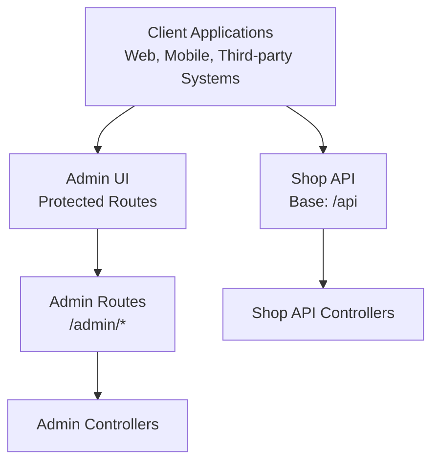
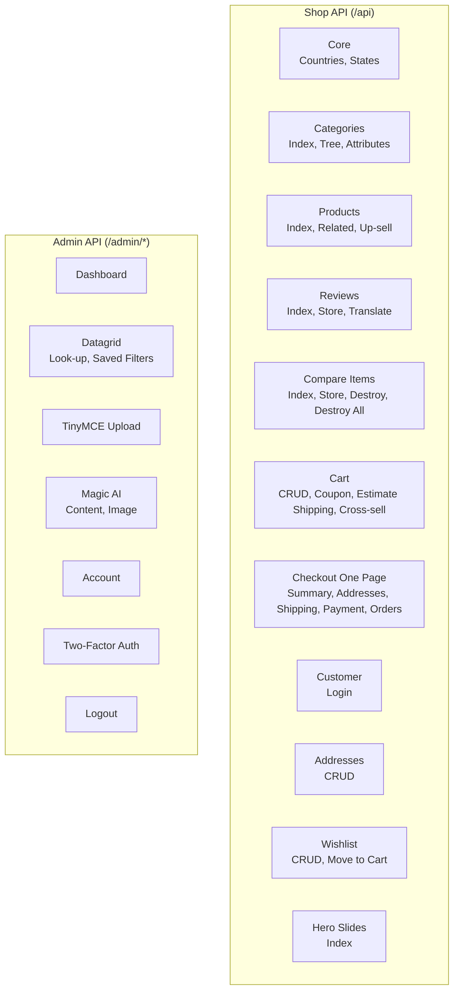
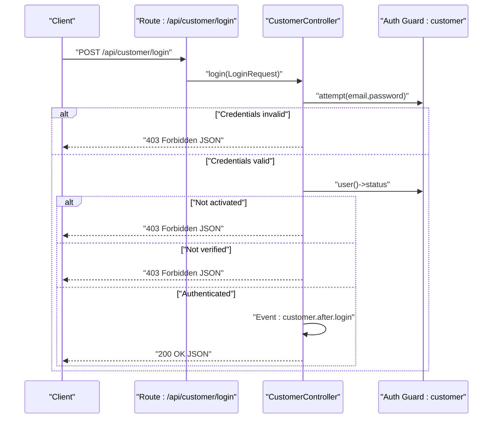
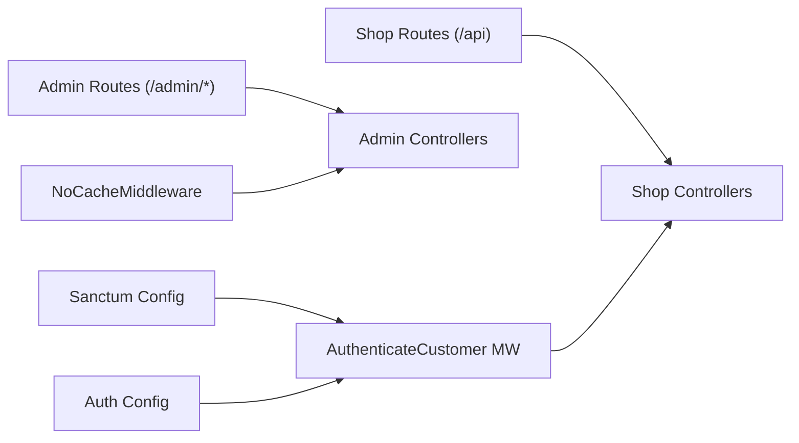

# API Documentation

<cite>
**Referenced Files in This Document**
- [api.php](file://packages/Webkul/Shop/src/Routes/api.php)
- [web.php](file://packages/Webkul/Shop/src/Routes/web.php)
- [rest-routes.php](file://packages/Webkul/Admin/src/Routes/rest-routes.php)
- [web.php](file://packages/Webkul/Admin/src/Routes/web.php)
- [AuthenticateCustomer.php](file://packages/Webkul/Shop/src/Http/Middleware/AuthenticateCustomer.php)
- [NoCacheMiddleware.php](file://packages/Webkul/Core/src/Http/Middleware/NoCacheMiddleware.php)
- [sanctum.php](file://config/sanctum.php)
- [auth.php](file://config/auth.php)
- [CustomerController.php](file://packages/Webkul/Shop/src/Http/Controllers/API/CustomerController.php)
- [CartController.php](file://packages/Webkul/Shop/src/Http/Controllers/API/CartController.php)
- [CategoryController.php](file://packages/Webkul/Shop/src/Http/Controllers/API/CategoryController.php)
- [ProductController.php](file://packages/Webkul/Shop/src/Http/Controllers/API/ProductController.php)
- [ReviewController.php](file://packages/Webkul/Shop/src/Http/Controllers/API/ReviewController.php)
- [WishlistController.php](file://packages/Webkul/Shop/src/Http/Controllers/API/WishlistController.php)
- [CompareController.php](file://packages/Webkul/Shop/src/Http/Controllers/API/CompareController.php)
- [OnepageController.php](file://packages/Webkul/Shop/src/Http/Controllers/API/OnepageController.php)
- [AddressController.php](file://packages/Webkul/Shop/src/Http/Controllers/API/AddressController.php)
- [CoreController.php](file://packages/Webkul/Shop/src/Http/Controllers/API/CoreController.php)
- [HeroSlideController.php](file://packages/Webkul/Shop/src/Http/Controllers/API/HeroSlideController.php)
</cite>

## Table of Contents
1. [Introduction](#introduction)
2. [Project Structure](#project-structure)
3. [Core Components](#core-components)
4. [Architecture Overview](#architecture-overview)
5. [Detailed Component Analysis](#detailed-component-analysis)
6. [Dependency Analysis](#dependency-analysis)
7. [Performance Considerations](#performance-considerations)
8. [Troubleshooting Guide](#troubleshooting-guide)
9. [Conclusion](#conclusion)
10. [Appendices](#appendices)

## Introduction
This document provides comprehensive API documentation for Frooxi’s RESTful endpoints. It covers authentication methods, request/response formats, API versioning, shop API endpoints for customer interactions, product browsing, and order management, as well as admin API endpoints for system management. It also documents rate limiting, error handling, response codes, practical integration examples, SDK usage, third-party connectivity, webhook integration, real-time updates, and API security measures.

## Project Structure
Frooxi exposes REST APIs primarily under the Shop module with a dedicated API prefix and under the Admin module for administrative tasks. The Shop API routes are grouped under a base path for easy versioning and discovery. Admin routes are protected by guards and middleware to ensure secure access to management features.

**Diagram sources**
- [api.php:16-127](file://packages/Webkul/Shop/src/Routes/api.php#L16-L127)
- [web.php:11-66](file://packages/Webkul/Admin/src/Routes/web.php#L11-L66)

**Section sources**
- [api.php:16-127](file://packages/Webkul/Shop/src/Routes/api.php#L16-L127)
- [web.php:11-66](file://packages/Webkul/Admin/src/Routes/web.php#L11-L66)

## Core Components
- Shop API base path: /api
- Admin API base path: /admin/*
- Authentication:
  - Customer authentication via session guard with JSON responses for AJAX requests.
  - Admin authentication via session guard with middleware protection.
- Middleware:
  - No-cache headers for admin responses.
  - Customer-specific authentication middleware for protected endpoints.
- Configuration:
  - Sanctum settings for stateful domains and middleware stack.
  - Auth guards for customer and admin.

Key configuration files:
- Authentication guards and providers for customer/admin.
- Sanctum middleware and expiration settings.

**Section sources**
- [api.php:16-127](file://packages/Webkul/Shop/src/Routes/api.php#L16-L127)
- [web.php:11-66](file://packages/Webkul/Admin/src/Routes/web.php#L11-L66)
- [AuthenticateCustomer.php:17-44](file://packages/Webkul/Shop/src/Http/Middleware/AuthenticateCustomer.php#L17-L44)
- [NoCacheMiddleware.php:15-26](file://packages/Webkul/Core/src/Http/Middleware/NoCacheMiddleware.php#L15-L26)
- [sanctum.php:21-69](file://config/sanctum.php#L21-L69)
- [auth.php:41-80](file://config/auth.php#L41-L80)

## Architecture Overview
The Shop API is organized into logical groups (core, categories, products, reviews, compare, cart, checkout, customer, addresses, wishlist, hero slides). Admin routes expose dashboard, datagrid, TinyMCE uploads, Magic AI, account management, and two-factor authentication features. Authentication is enforced per group using middleware.

**Diagram sources**
- [api.php:16-127](file://packages/Webkul/Shop/src/Routes/api.php#L16-L127)
- [rest-routes.php:16-74](file://packages/Webkul/Admin/src/Routes/rest-routes.php#L16-L74)

## Detailed Component Analysis

### Authentication Methods
- Customer Login:
  - Endpoint: POST /api/customer/login
  - Purpose: Authenticate a registered customer and trigger post-login events.
  - Behavior:
    - Validates credentials; returns 403 with message on invalid credentials.
    - Checks activation and verification; returns 403 with appropriate messages.
    - On success, dispatches a post-login event and returns empty JSON.
- Customer Session Protection:
  - Middleware checks authentication and user status; returns 401 JSON for AJAX requests expecting JSON.
  - Redirects to login page for non-AJAX requests if unauthenticated or inactive.

**Diagram sources**
- [CustomerController.php:18-52](file://packages/Webkul/Shop/src/Http/Controllers/API/CustomerController.php#L18-L52)
- [AuthenticateCustomer.php:19-43](file://packages/Webkul/Shop/src/Http/Middleware/AuthenticateCustomer.php#L19-L43)

**Section sources**
- [CustomerController.php:18-52](file://packages/Webkul/Shop/src/Http/Controllers/API/CustomerController.php#L18-L52)
- [AuthenticateCustomer.php:17-44](file://packages/Webkul/Shop/src/Http/Middleware/AuthenticateCustomer.php#L17-L44)

### API Versioning
- The Shop API is prefixed with /api. Versioning can be achieved by introducing a version segment (e.g., /api/v1) at the route level. Current routes demonstrate a clean separation suitable for future versioning without breaking changes.

**Section sources**
- [api.php:16](file://packages/Webkul/Shop/src/Routes/api.php#L16)

### Shop API Endpoints

#### Core
- GET /api/core/countries
  - Description: Retrieve country list.
- GET /api/core/states
  - Description: Retrieve state list.

**Section sources**
- [api.php:21-25](file://packages/Webkul/Shop/src/Routes/api.php#L21-L25)
- [CoreController.php](file://packages/Webkul/Shop/src/Http/Controllers/API/CoreController.php)

#### Categories
- GET /api/categories
  - Description: List categories.
- GET /api/categories/tree
  - Description: Retrieve hierarchical category tree.
- GET /api/categories/attributes
  - Description: Get category attributes.
- GET /api/categories/attributes/{attribute_id}/options
  - Description: Get attribute options.
- GET /api/categories/max-price/{id?}
  - Description: Get maximum product price for filters.

**Section sources**
- [api.php:27-37](file://packages/Webkul/Shop/src/Routes/api.php#L27-L37)
- [CategoryController.php](file://packages/Webkul/Shop/src/Http/Controllers/API/CategoryController.php)

#### Products
- GET /api/products
  - Description: Browse products.
- GET /api/products/{id}/related
  - Description: Fetch related products.
- GET /api/products/{id}/up-sell
  - Description: Fetch up-sell products.

**Section sources**
- [api.php:39-45](file://packages/Webkul/Shop/src/Routes/api.php#L39-L45)
- [ProductController.php](file://packages/Webkul/Shop/src/Http/Controllers/API/ProductController.php)

#### Reviews
- GET /api/product/{id}/reviews
  - Description: List product reviews.
- POST /api/product/{id}/review
  - Description: Submit a review.
- GET /api/product/{id}/reviews/{review_id}/translate
  - Description: Translate a review.

**Section sources**
- [api.php:47-53](file://packages/Webkul/Shop/src/Routes/api.php#L47-L53)
- [ReviewController.php](file://packages/Webkul/Shop/src/Http/Controllers/API/ReviewController.php)

#### Compare Items
- GET /api/compare-items
  - Description: List items in compare list.
- POST /api/compare-items
  - Description: Add item to compare list.
- DELETE /api/compare-items
  - Description: Remove item from compare list.
- DELETE /api/compare-items/all
  - Description: Clear entire compare list.

**Section sources**
- [api.php:55-63](file://packages/Webkul/Shop/src/Routes/api.php#L55-L63)
- [CompareController.php](file://packages/Webkul/Shop/src/Http/Controllers/API/CompareController.php)

#### Cart
- GET /api/checkout/cart
  - Description: View cart contents.
- POST /api/checkout/cart
  - Description: Add item to cart.
- PUT /api/checkout/cart
  - Description: Update cart item quantity or options.
- DELETE /api/checkout/cart
  - Description: Remove item from cart.
- DELETE /api/checkout/cart/selected
  - Description: Remove selected items.
- POST /api/checkout/cart/move-to-wishlist
  - Description: Move item to wishlist.
- POST /api/checkout/cart/coupon
  - Description: Apply coupon.
- POST /api/checkout/cart/estimate-shipping-methods
  - Description: Estimate shipping methods.
- DELETE /api/checkout/cart/coupon
  - Description: Remove applied coupon.
- GET /api/checkout/cart/cross-sell
  - Description: Cross-sell recommendations.

**Section sources**
- [api.php:65-85](file://packages/Webkul/Shop/src/Routes/api.php#L65-L85)
- [CartController.php](file://packages/Webkul/Shop/src/Http/Controllers/API/CartController.php)

#### Checkout One Page
- GET /api/checkout/onepage/summary
  - Description: Retrieve checkout summary.
- POST /api/checkout/onepage/addresses
  - Description: Save addresses.
- POST /api/checkout/onepage/shipping-methods
  - Description: Save shipping method.
- POST /api/checkout/onepage/payment-methods
  - Description: Save payment method.
- POST /api/checkout/onepage/orders
  - Description: Place order.

**Section sources**
- [api.php:87-97](file://packages/Webkul/Shop/src/Routes/api.php#L87-L97)
- [OnepageController.php](file://packages/Webkul/Shop/src/Http/Controllers/API/OnepageController.php)

#### Customer (Authenticated)
- GET /api/customer/addresses
  - Description: List customer addresses.
- POST /api/customer/addresses
  - Description: Add new address.
- PUT /api/customer/addresses/edit/{id?}
  - Description: Update existing address.

**Section sources**
- [api.php:106-113](file://packages/Webkul/Shop/src/Routes/api.php#L106-L113)
- [AddressController.php](file://packages/Webkul/Shop/src/Http/Controllers/API/AddressController.php)

#### Wishlist (Authenticated)
- GET /api/customer/wishlist
  - Description: List wishlist items.
- POST /api/customer/wishlist
  - Description: Add item to wishlist.
- POST /api/customer/wishlist/{id}/move-to-cart
  - Description: Move item to cart.
- DELETE /api/customer/wishlist/all
  - Description: Clear wishlist.
- DELETE /api/customer/wishlist/{id}
  - Description: Remove item from wishlist.

**Section sources**
- [api.php:115-125](file://packages/Webkul/Shop/src/Routes/api.php#L115-L125)
- [WishlistController.php](file://packages/Webkul/Shop/src/Http/Controllers/API/WishlistController.php)

#### Hero Slides
- GET /api/hero-slides
  - Description: Retrieve hero slide content.

**Section sources**
- [api.php:17-19](file://packages/Webkul/Shop/src/Routes/api.php#L17-L19)
- [HeroSlideController.php](file://packages/Webkul/Shop/src/Http/Controllers/API/HeroSlideController.php)

### Admin API Endpoints
Protected under /admin with admin guard and middleware. Includes:
- Dashboard
  - GET /admin/dashboard
  - GET /admin/dashboard/stats
- Datagrid
  - GET /admin/datagrid/look-up
  - POST /admin/datagrid/saved-filters
  - GET /admin/datagrid/saved-filters
  - PUT /admin/datagrid/saved-filters/{id}
  - DELETE /admin/datagrid/saved-filters/{id}
- TinyMCE Upload
  - POST /admin/tinymce/upload
- Magic AI
  - POST /admin/magic-ai/content
  - POST /admin/magic-ai/image
- Account
  - GET /admin/account
  - PUT /admin/account
- Two-Factor Authentication
  - GET /admin/two-factor/setup
  - POST /admin/two-factor/enable
  - GET /admin/two-factor/disable
- Logout
  - DELETE /admin/logout

**Section sources**
- [rest-routes.php:16-74](file://packages/Webkul/Admin/src/Routes/rest-routes.php#L16-L74)
- [web.php:11-66](file://packages/Webkul/Admin/src/Routes/web.php#L11-L66)

## Dependency Analysis
- Route dependencies:
  - Shop API routes depend on controllers for each endpoint group.
  - Admin routes depend on controllers for dashboard, datagrid, TinyMCE, Magic AI, account, and two-factor authentication.
- Authentication dependencies:
  - Customer authentication middleware ensures only logged-in, activated, and verified users can access protected endpoints.
  - Admin routes are guarded by admin middleware and protected by No-Cache headers.
- Configuration dependencies:
  - Sanctum configuration affects stateful domain handling and middleware stack.
  - Auth configuration defines guards and providers for customer and admin.

**Diagram sources**
- [api.php:16-127](file://packages/Webkul/Shop/src/Routes/api.php#L16-L127)
- [rest-routes.php:16-74](file://packages/Webkul/Admin/src/Routes/rest-routes.php#L16-L74)
- [AuthenticateCustomer.php:17-44](file://packages/Webkul/Shop/src/Http/Middleware/AuthenticateCustomer.php#L17-L44)
- [NoCacheMiddleware.php:15-26](file://packages/Webkul/Core/src/Http/Middleware/NoCacheMiddleware.php#L15-L26)
- [sanctum.php:21-69](file://config/sanctum.php#L21-L69)
- [auth.php:41-80](file://config/auth.php#L41-L80)

**Section sources**
- [api.php:16-127](file://packages/Webkul/Shop/src/Routes/api.php#L16-L127)
- [rest-routes.php:16-74](file://packages/Webkul/Admin/src/Routes/rest-routes.php#L16-L74)
- [AuthenticateCustomer.php:17-44](file://packages/Webkul/Shop/src/Http/Middleware/AuthenticateCustomer.php#L17-L44)
- [NoCacheMiddleware.php:15-26](file://packages/Webkul/Core/src/Http/Middleware/NoCacheMiddleware.php#L15-L26)
- [sanctum.php:21-69](file://config/sanctum.php#L21-L69)
- [auth.php:41-80](file://config/auth.php#L41-L80)

## Performance Considerations
- Response caching:
  - Admin responses include no-cache headers to prevent stale content in admin UI.
- Middleware overhead:
  - Authentication and session checks occur per request for protected endpoints; minimize unnecessary middleware for public endpoints.
- Payload sizes:
  - Use pagination for listings (categories, products, reviews) to reduce payload sizes.
- Compression:
  - Enable gzip/deflate at the web server level to reduce bandwidth usage.

**Section sources**
- [NoCacheMiddleware.php:19-23](file://packages/Webkul/Core/src/Http/Middleware/NoCacheMiddleware.php#L19-L23)

## Troubleshooting Guide
- Authentication failures:
  - 401 Unauthorized JSON responses for AJAX requests when unauthenticated.
  - 403 Forbidden responses for invalid credentials, inactive accounts, or unverified accounts during login.
- Session and cookie behavior:
  - Customer login may queue cookies to trigger verification resends; ensure client respects cookie lifecycle.
- Admin access:
  - Protected routes under /admin require admin guard; ensure proper admin session and middleware chain.

Common HTTP response codes:
- 200 OK: Successful request.
- 204 No Content: Successful deletion or empty result.
- 400 Bad Request: Malformed request or validation errors.
- 401 Unauthorized: Missing or invalid authentication for protected endpoints.
- 403 Forbidden: Authentication failure or insufficient permissions.
- 404 Not Found: Resource not found.
- 500 Internal Server Error: Unexpected server error.

**Section sources**
- [AuthenticateCustomer.php:20-43](file://packages/Webkul/Shop/src/Http/Middleware/AuthenticateCustomer.php#L20-L43)
- [CustomerController.php:20-44](file://packages/Webkul/Shop/src/Http/Controllers/API/CustomerController.php#L20-L44)

## Conclusion
Frooxi’s API provides a structured, modular REST interface for both customer-facing and administrative operations. The Shop API is organized under /api with clear grouping for categories, products, reviews, cart, checkout, customer, wishlist, and hero slides. Admin endpoints are secured behind guards and middleware. Authentication is handled via session-based guards with JSON responses for AJAX requests. Configuration files define guards, providers, and Sanctum middleware, enabling flexible deployment and security.

## Appendices

### API Security Measures
- Stateful domains and middleware:
  - Sanctum configuration supports stateful domains and CSRF validation middleware.
- Guard configuration:
  - Separate guards for customer and admin ensure isolation of authentication contexts.
- Admin middleware:
  - No-cache headers prevent cached admin responses.

**Section sources**
- [sanctum.php:21-69](file://config/sanctum.php#L21-L69)
- [auth.php:41-80](file://config/auth.php#L41-L80)
- [NoCacheMiddleware.php:19-23](file://packages/Webkul/Core/src/Http/Middleware/NoCacheMiddleware.php#L19-L23)

### Rate Limiting
- Not configured in the examined files. Consider implementing rate limiting at the web server or application level using middleware or platform features.

### Webhook Integration and Real-Time Updates
- Not present in the examined files. Implement webhooks and real-time features using external services or platform integrations as needed.

### Practical Integration Examples
- Client libraries:
  - Use standard HTTP clients to call endpoints under /api and /admin.
  - For Shop API, send JSON requests and parse JSON responses.
  - For Admin API, maintain admin session and respect CSRF and stateful domain policies.
- Third-party systems:
  - Integrate via REST calls to /api endpoints for product browsing, cart management, and checkout.
  - Use /admin endpoints for inventory and content management with admin credentials.