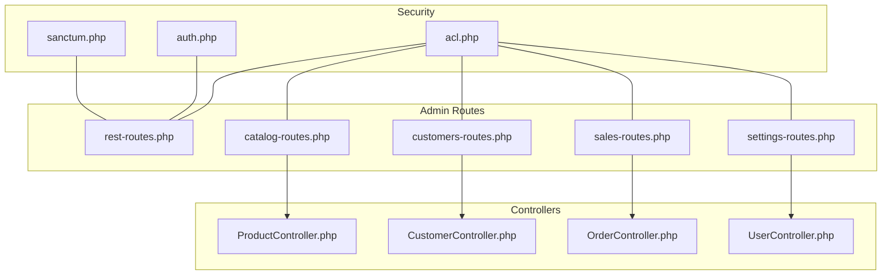
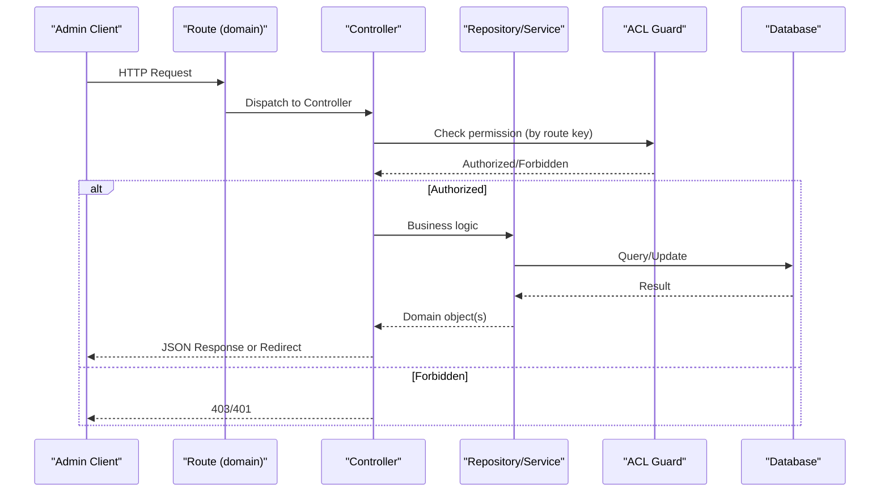
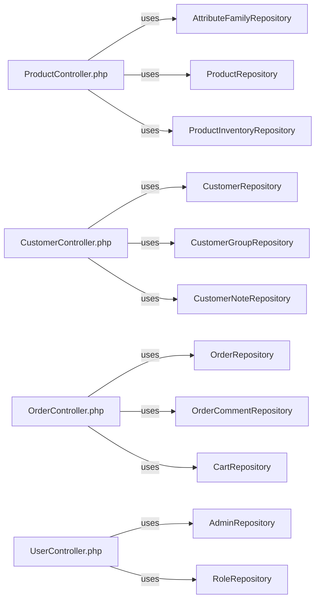

# Admin API Endpoints

<cite>
**Referenced Files in This Document**
- [rest-routes.php](file://packages/Webkul/Admin/src/Routes/rest-routes.php)
- [catalog-routes.php](file://packages/Webkul/Admin/src/Routes/catalog-routes.php)
- [customers-routes.php](file://packages/Webkul/Admin/src/Routes/customers-routes.php)
- [sales-routes.php](file://packages/Webkul/Admin/src/Routes/sales-routes.php)
- [settings-routes.php](file://packages/Webkul/Admin/src/Routes/settings-routes.php)
- [acl.php](file://packages/Webkul/Admin/src/Config/acl.php)
- [auth.php](file://config/auth.php)
- [sanctum.php](file://config/sanctum.php)
- [ProductController.php](file://packages/Webkul/Admin/src/Http/Controllers/Catalog/ProductController.php)
- [CustomerController.php](file://packages/Webkul/Admin/src/Http/Controllers/Customers/CustomerController.php)
- [OrderController.php](file://packages/Webkul/Admin/src/Http/Controllers/Sales/OrderController.php)
- [UserController.php](file://packages/Webkul/Admin/src/Http/Controllers/Settings/UserController.php)
</cite>

## Table of Contents
1. [Introduction](#introduction)
2. [Project Structure](#project-structure)
3. [Core Components](#core-components)
4. [Architecture Overview](#architecture-overview)
5. [Detailed Component Analysis](#detailed-component-analysis)
6. [Dependency Analysis](#dependency-analysis)
7. [Performance Considerations](#performance-considerations)
8. [Troubleshooting Guide](#troubleshooting-guide)
9. [Conclusion](#conclusion)

## Introduction
This document provides comprehensive API documentation for the Admin API endpoints in the Bagisto Admin module. It covers administrative functionality across product management, customer management, sales, and settings. It also documents request/response formats, authentication and authorization patterns, data validation rules, and operational capabilities such as bulk operations, filtering, sorting, and pagination. Admin-specific security considerations and rate-limiting guidance are included.

## Project Structure
The Admin module organizes endpoints by domain into dedicated route files under the Admin Routes directory. Each domain exposes a set of CRUD and specialized endpoints handled by dedicated controllers. ACL configuration defines granular permissions per endpoint.

**Diagram sources**
- [rest-routes.php:1-74](file://packages/Webkul/Admin/src/Routes/rest-routes.php#L1-L74)
- [catalog-routes.php:1-142](file://packages/Webkul/Admin/src/Routes/catalog-routes.php#L1-L142)
- [customers-routes.php:1-119](file://packages/Webkul/Admin/src/Routes/customers-routes.php#L1-L119)
- [sales-routes.php:1-68](file://packages/Webkul/Admin/src/Routes/sales-routes.php#L1-L68)
- [settings-routes.php:1-220](file://packages/Webkul/Admin/src/Routes/settings-routes.php#L1-L220)
- [acl.php:1-1000](file://packages/Webkul/Admin/src/Config/acl.php#L1-L1000)
- [auth.php:1-117](file://config/auth.php#L1-L117)
- [sanctum.php:1-72](file://config/sanctum.php#L1-L72)

**Section sources**
- [rest-routes.php:1-74](file://packages/Webkul/Admin/src/Routes/rest-routes.php#L1-L74)
- [catalog-routes.php:1-142](file://packages/Webkul/Admin/src/Routes/catalog-routes.php#L1-L142)
- [customers-routes.php:1-119](file://packages/Webkul/Admin/src/Routes/customers-routes.php#L1-L119)
- [sales-routes.php:1-68](file://packages/Webkul/Admin/src/Routes/sales-routes.php#L1-L68)
- [settings-routes.php:1-220](file://packages/Webkul/Admin/src/Routes/settings-routes.php#L1-L220)

## Core Components
- Product Management: Attributes, attribute families, categories, and products (including variants and downloadable assets).
- Customer Management: Profiles, addresses, groups, reviews, and related cart/order data.
- Sales: Orders, invoices, shipments, refunds, transactions, and comments.
- Settings: Users, roles, channels, currencies, exchange rates, locales, inventory sources, themes, and data transfer (imports).

Key controllers implement domain-specific logic and return structured JSON responses or redirects. ACL configuration enumerates permissions for each endpoint.

**Section sources**
- [ProductController.php:1-200](file://packages/Webkul/Admin/src/Http/Controllers/Catalog/ProductController.php#L1-L200)
- [CustomerController.php:1-200](file://packages/Webkul/Admin/src/Http/Controllers/Customers/CustomerController.php#L1-L200)
- [OrderController.php:1-200](file://packages/Webkul/Admin/src/Http/Controllers/Sales/OrderController.php#L1-L200)
- [UserController.php:1-200](file://packages/Webkul/Admin/src/Http/Controllers/Settings/UserController.php#L1-L200)
- [acl.php:1-1000](file://packages/Webkul/Admin/src/Config/acl.php#L1-L1000)

## Architecture Overview
The Admin API follows a layered architecture:
- Routes define endpoint contracts grouped by domain.
- Controllers orchestrate requests, apply validation, and delegate to repositories/services.
- DataGrids handle server-side filtering, sorting, and pagination for list endpoints.
- ACL enforces authorization per endpoint.
- Authentication uses session-based guards for admin users.

**Diagram sources**
- [catalog-routes.php:18-141](file://packages/Webkul/Admin/src/Routes/catalog-routes.php#L18-L141)
- [customers-routes.php:16-118](file://packages/Webkul/Admin/src/Routes/customers-routes.php#L16-L118)
- [sales-routes.php:13-67](file://packages/Webkul/Admin/src/Routes/sales-routes.php#L13-L67)
- [settings-routes.php:20-219](file://packages/Webkul/Admin/src/Routes/settings-routes.php#L20-L219)
- [acl.php:1-1000](file://packages/Webkul/Admin/src/Config/acl.php#L1-L1000)

## Detailed Component Analysis

### Product Management Endpoints
- Attributes
  - GET /admin/catalog/attributes → list attributes
  - GET /admin/catalog/attributes/{id}/options → list attribute options
  - GET /admin/catalog/attributes/create → render create form
  - POST /admin/catalog/attributes/create → create attribute
  - GET /admin/catalog/attributes/edit/{id} → render edit form
  - PUT /admin/catalog/attributes/edit/{id} → update attribute
  - DELETE /admin/catalog/attributes/edit/{id} → delete attribute
  - POST /admin/catalog/attributes/mass-delete → bulk delete

- Attribute Families
  - GET /admin/catalog/families → list families
  - GET /admin/catalog/families/create → render create form
  - POST /admin/catalog/families/create → create family
  - GET /admin/catalog/families/edit/{id} → render edit form
  - PUT /admin/catalog/families/edit/{id} → update family
  - DELETE /admin/catalog/families/edit/{id} → delete family

- Categories
  - GET /admin/catalog/categories → list categories
  - GET /admin/catalog/categories/create → render create form
  - POST /admin/catalog/categories/create → create category
  - GET /admin/catalog/categories/edit/{id} → render edit form
  - PUT /admin/catalog/categories/edit/{id} → update category
  - DELETE /admin/catalog/categories/edit/{id} → delete category
  - POST /admin/catalog/categories/mass-delete → bulk delete
  - POST /admin/catalog/categories/mass-update → bulk update
  - GET /admin/catalog/categories/search → search categories
  - GET /admin/catalog/categories/tree → tree view

- Products
  - GET /admin/catalog/products → list products (AJAX returns DataGrid)
  - POST /admin/catalog/products/create → create product
  - POST /admin/catalog/products/copy/{id} → copy product
  - GET /admin/catalog/products/edit/{id} → render edit form
  - PUT /admin/catalog/products/edit/{id} → update product
  - DELETE /admin/catalog/products/edit/{id} → delete product
  - PUT /admin/catalog/products/edit/{id}/inventories → update inventories
  - POST /admin/catalog/products/upload-file/{id} → upload downloadable link
  - POST /admin/catalog/products/upload-sample/{id} → upload downloadable sample
  - POST /admin/catalog/products/mass-update → bulk update
  - POST /admin/catalog/products/mass-delete → bulk delete
  - GET /admin/catalog/products/simple-customizable-options → customizable options (simple)
  - GET /admin/catalog/products/configurable-options → configurable options
  - GET /admin/catalog/products/bundle-options → bundle options
  - GET /admin/catalog/products/grouped-options → grouped options
  - GET /admin/catalog/products/downloadable-options → downloadable options
  - GET /admin/catalog/products/virtual-customizable-options → customizable options (virtual)
  - GET /admin/catalog/products/search → search products
  - GET /admin/catalog/products/{id}/{attribute_id} → download file

- Additional sync endpoint
  - GET /admin/catalog/sync → sync products

Validation and behavior:
- Product creation validates type, family, SKU uniqueness, and configurable attributes presence for variant types.
- Inventory updates persist quantities and return totals.
- Downloadable assets are uploaded via dedicated endpoints.

Bulk operations:
- Mass delete/update supported for categories, products, attributes, and invoices.

Filtering, sorting, pagination:
- AJAX-enabled list endpoints return DataGrid results supporting server-side filtering, sorting, and pagination.

**Section sources**
- [catalog-routes.php:18-141](file://packages/Webkul/Admin/src/Routes/catalog-routes.php#L18-L141)
- [ProductController.php:56-133](file://packages/Webkul/Admin/src/Http/Controllers/Catalog/ProductController.php#L56-L133)
- [ProductController.php:170-184](file://packages/Webkul/Admin/src/Http/Controllers/Catalog/ProductController.php#L170-L184)

### Customer Management Endpoints
- Customers
  - GET /admin/customers → list customers (AJAX returns DataGrid)
  - GET /admin/customers/view/{id} → view customer details
  - POST /admin/customers/create → create customer
  - GET /admin/customers/search → search customers
  - GET /admin/customers/login-as-customer/{id} → login as customer
  - POST /admin/customers/note/{id} → add note
  - PUT /admin/customers/edit/{id} → update customer
  - POST /admin/customers/mass-delete → bulk delete
  - POST /admin/customers/mass-update → bulk update
  - DELETE /admin/customers/{id} → delete customer
  - GET /admin/customers/{id}/wishlist-items → wishlist items
  - DELETE /admin/customers/{id}/wishlist-items → delete wishlist item
  - GET /admin/customers/{id}/compare-items → compare items
  - DELETE /admin/customers/{id}/compare-items → delete compare item
  - POST /admin/customers/{id}/cart/create → create cart
  - GET /admin/customers/{id}/cart/items → cart items
  - DELETE /admin/customers/{id}/cart/items → delete cart item
  - GET /admin/customers/{id}/recent-order-items → recent order items

- Addresses
  - GET /admin/customers/{id}/addresses → list customer addresses
  - GET /admin/customers/{id}/addresses/create → render create address form
  - POST /admin/customers/{id}/addresses/create → create address
  - GET /admin/customers/addresses/edit/{id} → render edit address form
  - PUT /admin/customers/addresses/edit/{id} → update address
  - POST /admin/customers/addresses/default/{id} → set default address
  - POST /admin/customers/addresses/delete/{id} → delete address

- Reviews
  - GET /admin/customers/reviews → list reviews
  - GET /admin/customers/reviews/edit/{id} → render edit review form
  - PUT /admin/customers/reviews/edit/{id} → update review
  - DELETE /admin/customers/reviews/{id} → delete review
  - POST /admin/customers/reviews/mass-delete → bulk delete
  - POST /admin/customers/reviews/mass-update → bulk update

- Groups
  - GET /admin/customers/groups → list groups
  - POST /admin/customers/groups/create → create group
  - PUT /admin/customers/groups/edit → update group
  - DELETE /admin/customers/groups/delete/{id} → delete group

Validation and behavior:
- Customer creation/update validates names, gender, channel, unique email/phone, date of birth, and phone number rules.
- Deletion checks for active orders before removal.

Bulk operations:
- Mass delete/update supported for customers and reviews.

Filtering, sorting, pagination:
- AJAX-enabled customer listing supports DataGrid features.

**Section sources**
- [customers-routes.php:16-118](file://packages/Webkul/Admin/src/Routes/customers-routes.php#L16-L118)
- [CustomerController.php:63-133](file://packages/Webkul/Admin/src/Http/Controllers/Customers/CustomerController.php#L63-L133)
- [CustomerController.php:140-180](file://packages/Webkul/Admin/src/Http/Controllers/Customers/CustomerController.php#L140-L180)

### Sales Endpoints
- Invoices
  - GET /admin/sales/invoices → list invoices
  - POST /admin/sales/invoices/create/{order_id} → create invoice
  - GET /admin/sales/invoices/view/{id} → view invoice
  - POST /admin/sales/invoices/send-duplicate-email/{id} → send duplicate email
  - GET /admin/sales/invoices/print/{id} → print invoice
  - POST /admin/sales/invoices/mass-update/state → bulk update state

- Orders
  - GET /admin/sales/orders → list orders
  - GET /admin/sales/orders/create/{cartId} → render create order form
  - POST /admin/sales/orders/create/{cartId} → store order
  - GET /admin/sales/orders/view/{id} → view order
  - POST /admin/sales/orders/cancel/{id} → cancel order
  - GET /admin/sales/orders/reorder/{id} → reorder
  - POST /admin/sales/orders/comment/{order_id} → add comment
  - GET /admin/sales/orders/search → search orders

- Refunds
  - GET /admin/sales/refunds → list refunds
  - POST /admin/sales/refunds/create/{order_id} → create refund
  - POST /admin/sales/refunds/update-totals/{order_id} → update totals
  - GET /admin/sales/refunds/view/{id} → view refund

- Shipments
  - GET /admin/sales/shipments → list shipments
  - POST /admin/sales/shipments/create/{order_id} → create shipment
  - GET /admin/sales/shipments/view/{id} → view shipment

- Transactions
  - GET /admin/sales/transactions → list transactions
  - POST /admin/sales/transactions/create → create transaction
  - GET /admin/sales/transactions/view/{id} → view transaction

Order creation validation:
- Validates cart existence, collects totals, checks payment method support, and transforms cart to order payload.

Bulk operations:
- Bulk state update supported for invoices.

Filtering, sorting, pagination:
- AJAX-enabled order listing supports DataGrid features.

**Section sources**
- [sales-routes.php:13-67](file://packages/Webkul/Admin/src/Routes/sales-routes.php#L13-L67)
- [OrderController.php:77-119](file://packages/Webkul/Admin/src/Http/Controllers/Sales/OrderController.php#L77-L119)
- [OrderController.php:165-176](file://packages/Webkul/Admin/src/Http/Controllers/Sales/OrderController.php#L165-L176)

### Settings Management Endpoints
- Channels
  - GET /admin/settings/channels → list channels
  - GET /admin/settings/channels/create → render create form
  - POST /admin/settings/channels/create → create channel
  - GET /admin/settings/channels/edit/{id} → render edit form
  - PUT /admin/settings/channels/edit/{id} → update channel
  - DELETE /admin/settings/channels/edit/{id} → delete channel

- Currencies
  - GET /admin/settings/currencies → list currencies
  - POST /admin/settings/currencies/create → create currency
  - GET /admin/settings/currencies/edit/{id} → render edit form
  - PUT /admin/settings/currencies/edit → update currency
  - DELETE /admin/settings/currencies/edit/{id} → delete currency
  - POST /admin/settings/currencies/mass-delete → bulk delete

- Exchange Rates
  - GET /admin/settings/exchange-rates → list exchange rates
  - POST /admin/settings/exchange-rates/create → create rate
  - GET /admin/settings/exchange-rates/edit/{id} → render edit form
  - GET /admin/settings/exchange-rates/update-rates → trigger update rates
  - PUT /admin/settings/exchange-rates/edit → update rate
  - DELETE /admin/settings/exchange-rates/edit/{id} → delete rate

- Locales
  - GET /admin/settings/locales → list locales
  - POST /admin/settings/locales/create → create locale
  - GET /admin/settings/locales/edit/{id} → render edit form
  - PUT /admin/settings/locales/edit → update locale
  - DELETE /admin/settings/locales/edit/{id} → delete locale

- Inventory Sources
  - GET /admin/settings/inventory-sources → list inventory sources
  - GET /admin/settings/inventory-sources/create → render create form
  - POST /admin/settings/inventory-sources/create → create inventory source
  - GET /admin/settings/inventory-sources/edit/{id} → render edit form
  - PUT /admin/settings/inventory-sources/edit/{id} → update inventory source
  - DELETE /admin/settings/inventory-sources/edit/{id} → delete inventory source

- Roles
  - GET /admin/settings/roles → list roles
  - GET /admin/settings/roles/create → render create form
  - POST /admin/settings/roles/create → create role
  - GET /admin/settings/roles/edit/{id} → render edit form
  - PUT /admin/settings/roles/edit/{id} → update role
  - DELETE /admin/settings/roles/edit/{id} → delete role

- Users
  - GET /admin/settings/users → list users (AJAX returns DataGrid)
  - POST /admin/settings/users/create → create user
  - GET /admin/settings/users/edit/{id} → render edit form
  - PUT /admin/settings/users/edit → update user
  - DELETE /admin/settings/users/edit/{id} → delete user
  - PUT /admin/settings/users/confirm → confirm self-deletion

- Themes
  - GET /admin/settings/themes → list themes
  - GET /admin/settings/themes/edit/{id} → render edit form
  - POST /admin/settings/themes/store → store theme
  - POST /admin/settings/themes/edit/{id} → update theme
  - DELETE /admin/settings/themes/edit/{id} → delete theme
  - POST /admin/settings/themes/mass-update → bulk update
  - POST /admin/settings/themes/mass-delete → bulk delete

- Data Transfer (Imports)
  - GET /admin/settings/data-transfer/imports → list imports
  - GET /admin/settings/data-transfer/imports/create → render create form
  - POST /admin/settings/data-transfer/imports/create → create import
  - GET /admin/settings/data-transfer/imports/edit/{id} → render edit form
  - PUT /admin/settings/data-transfer/imports/update/{id} → update import
  - DELETE /admin/settings/data-transfer/imports/destroy/{id} → delete import
  - GET /admin/settings/data-transfer/imports/import/{id} → import records
  - GET /admin/settings/data-transfer/imports/validate/{id} → validate import
  - GET /admin/settings/data-transfer/imports/start/{id} → start import
  - GET /admin/settings/data-transfer/imports/link/{id} → link import
  - GET /admin/settings/data-transfer/imports/index/{id} → index data
  - GET /admin/settings/data-transfer/imports/stats/{id}/{state?} → import stats
  - GET /admin/settings/data-transfer/imports/download-sample/{type}/{format} → download sample
  - GET /admin/settings/data-transfer/imports/download/{id} → download file
  - GET /admin/settings/data-transfer/imports/download-error-report/{id} → download error report

User management behavior:
- Creation sets hashed password and generates API token when password provided.
- Updates handle optional image uploads and password changes.
- Self-deletion disallowed and last admin protection enforced.

Bulk operations:
- Mass delete supported for currencies and themes.
- Mass update supported for themes.

Filtering, sorting, pagination:
- AJAX-enabled user listing supports DataGrid features.

**Section sources**
- [settings-routes.php:20-219](file://packages/Webkul/Admin/src/Routes/settings-routes.php#L20-L219)
- [UserController.php:50-82](file://packages/Webkul/Admin/src/Http/Controllers/Settings/UserController.php#L50-L82)
- [UserController.php:104-151](file://packages/Webkul/Admin/src/Http/Controllers/Settings/UserController.php#L104-L151)
- [UserController.php:158-188](file://packages/Webkul/Admin/src/Http/Controllers/Settings/UserController.php#L158-L188)

### Authentication, Authorization, and Security
- Guards and Providers
  - Admin guard uses session driver with admins provider.
  - Customer guard uses session driver with customers provider.

- Sanctum
  - Sanctum middleware configured for session authentication and CSRF validation.
  - Token expiration is not enforced by default.

- ACL
  - ACL keys map to route names and define permissions for dashboard, sales, catalog, customers, marketing, reporting, CMS, and settings.
  - Controllers check permissions against route names defined in ACL.

- Rate Limiting
  - No explicit global rate limit middleware applied to Admin routes in the examined files.
  - Consider applying rate limiting at the application level for sensitive endpoints.

- Admin Profile and 2FA
  - Account endpoints for viewing/updating profile.
  - Two-factor authentication setup, enable, and disable endpoints.

**Section sources**
- [auth.php:41-80](file://config/auth.php#L41-L80)
- [sanctum.php:65-69](file://config/sanctum.php#L65-L69)
- [acl.php:1-1000](file://packages/Webkul/Admin/src/Config/acl.php#L1-L1000)
- [rest-routes.php:56-71](file://packages/Webkul/Admin/src/Routes/rest-routes.php#L56-L71)

## Dependency Analysis

**Diagram sources**
- [ProductController.php:41-49](file://packages/Webkul/Admin/src/Http/Controllers/Catalog/ProductController.php#L41-L49)
- [CustomerController.php:52-56](file://packages/Webkul/Admin/src/Http/Controllers/Customers/CustomerController.php#L52-L56)
- [OrderController.php:29-34](file://packages/Webkul/Admin/src/Http/Controllers/Sales/OrderController.php#L29-L34)
- [UserController.php:26-29](file://packages/Webkul/Admin/src/Http/Controllers/Settings/UserController.php#L26-L29)

**Section sources**
- [ProductController.php:41-49](file://packages/Webkul/Admin/src/Http/Controllers/Catalog/ProductController.php#L41-L49)
- [CustomerController.php:52-56](file://packages/Webkul/Admin/src/Http/Controllers/Customers/CustomerController.php#L52-L56)
- [OrderController.php:29-34](file://packages/Webkul/Admin/src/Http/Controllers/Sales/OrderController.php#L29-L34)
- [UserController.php:26-29](file://packages/Webkul/Admin/src/Http/Controllers/Settings/UserController.php#L26-L29)

## Performance Considerations
- Use AJAX list endpoints for server-side filtering, sorting, and pagination to reduce client load.
- Prefer bulk operations for mass updates/deletes to minimize round trips.
- Validate inputs early in controllers to avoid unnecessary repository calls.
- Leverage DataGrids for complex queries and avoid loading full datasets unnecessarily.

## Troubleshooting Guide
Common issues and resolutions:
- 403/401 Unauthorized: Verify admin session and ACL permissions for the requested route.
- Validation errors: Ensure request payloads meet controller validation rules (SKU uniqueness, email uniqueness, phone format, date constraints).
- Order creation failures: Confirm cart validity, payment method support, and that totals are collected before order creation.
- Deletion rejections: For customers, ensure no active orders exist; for users, avoid self-deletion and last admin deletion.

**Section sources**
- [CustomerController.php:187-200](file://packages/Webkul/Admin/src/Http/Controllers/Customers/CustomerController.php#L187-L200)
- [OrderController.php:83-97](file://packages/Webkul/Admin/src/Http/Controllers/Sales/OrderController.php#L83-L97)
- [UserController.php:160-171](file://packages/Webkul/Admin/src/Http/Controllers/Settings/UserController.php#L160-L171)

## Conclusion
The Admin API provides comprehensive administrative capabilities across product, customer, sales, and settings domains. Endpoints follow consistent patterns for CRUD, bulk operations, and specialized workflows. ACL-driven authorization ensures secure access, while session-based authentication and optional Sanctum middleware support admin sessions. For production deployments, consider adding explicit rate limiting and monitoring for sensitive endpoints.