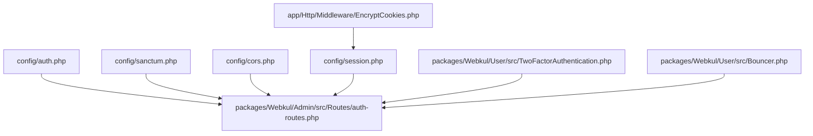
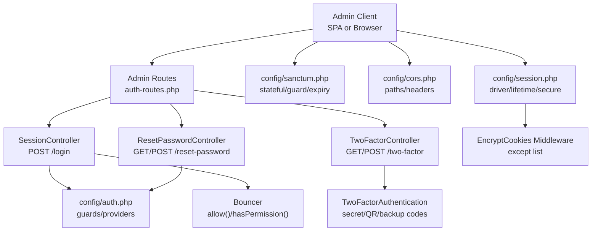
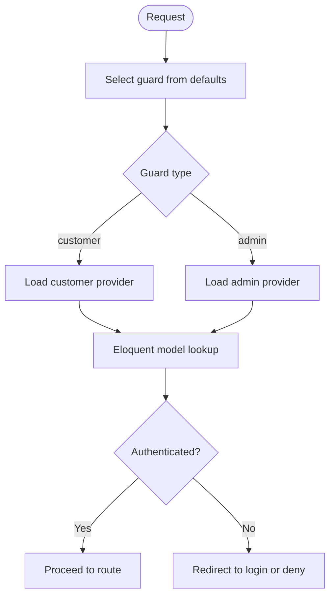
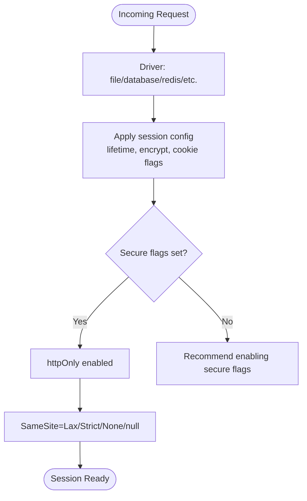
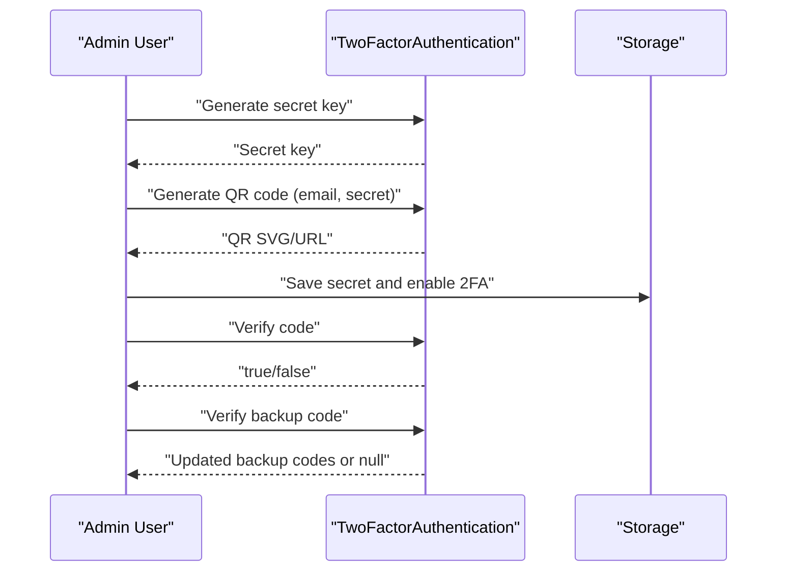
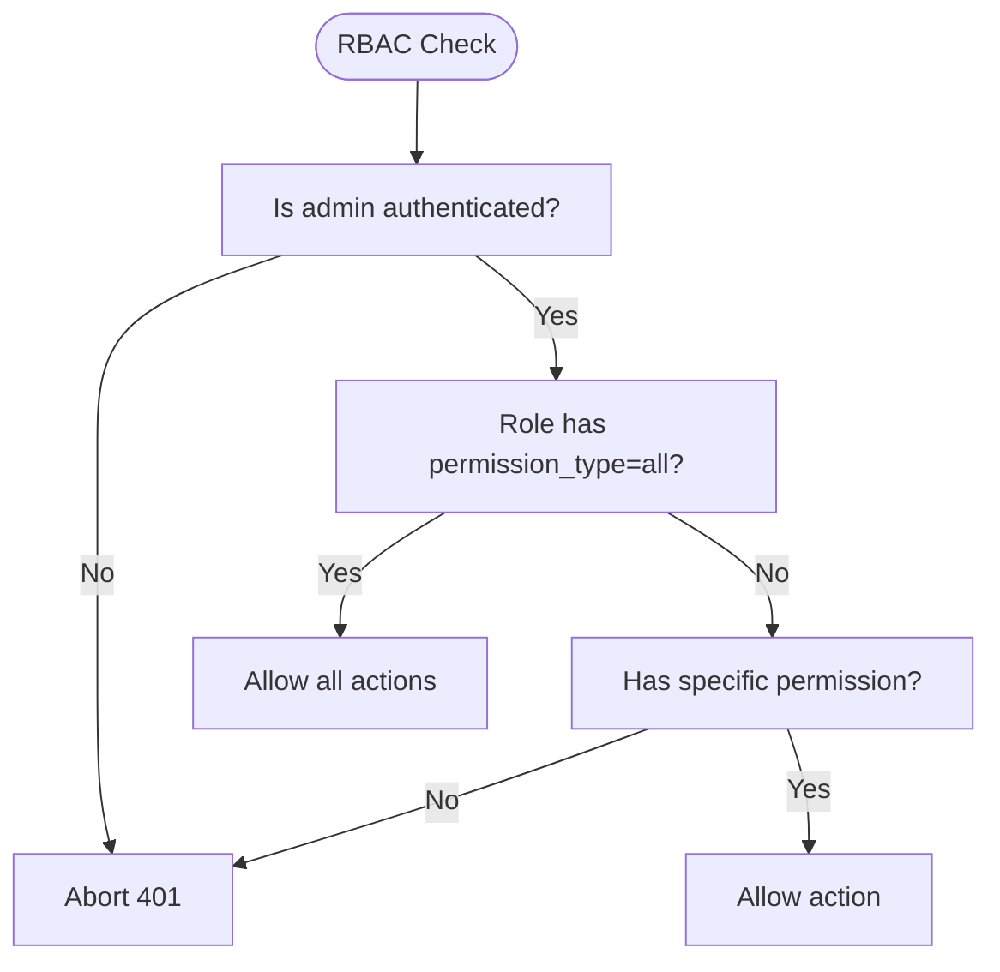
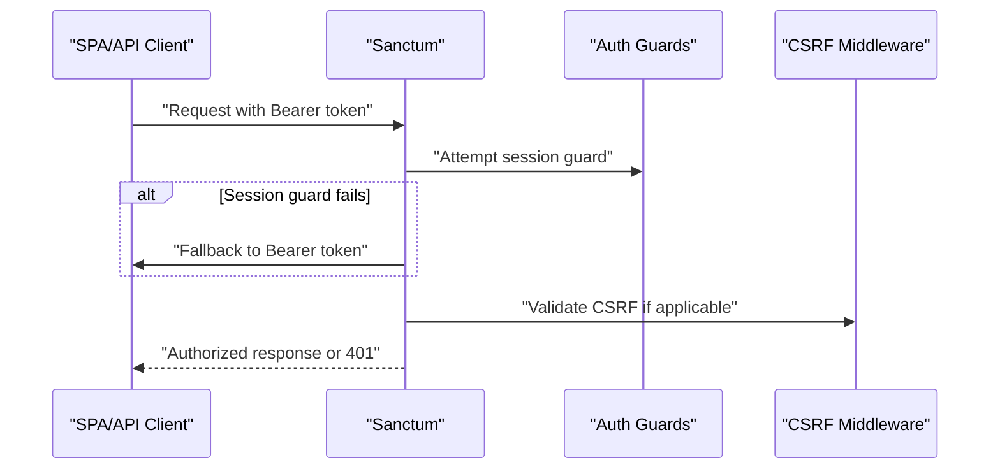
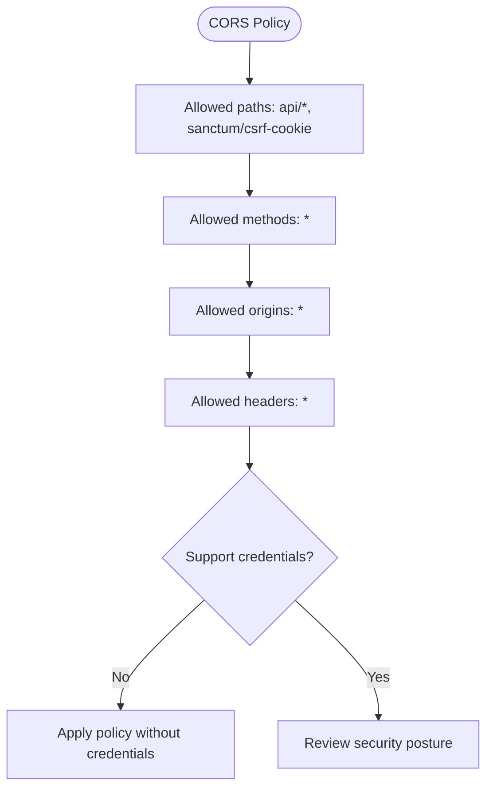
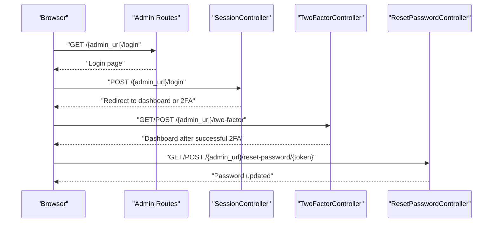
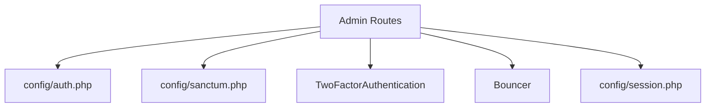

# Authentication & Security

<cite>
**Referenced Files in This Document**
- [auth.php](file://config/auth.php)
- [sanctum.php](file://config/sanctum.php)
- [cors.php](file://config/cors.php)
- [session.php](file://config/session.php)
- [EncryptCookies.php](file://app/Http/Middleware/EncryptCookies.php)
- [TwoFactorAuthentication.php](file://packages/Webkul/User/src/TwoFactorAuthentication.php)
- [Bouncer.php](file://packages/Webkul/User/src/Bouncer.php)
- [auth-routes.php](file://packages/Webkul/Admin/src/Routes/auth-routes.php)
</cite>

## Table of Contents
1. [Introduction](#introduction)
2. [Project Structure](#project-structure)
3. [Core Components](#core-components)
4. [Architecture Overview](#architecture-overview)
5. [Detailed Component Analysis](#detailed-component-analysis)
6. [Dependency Analysis](#dependency-analysis)
7. [Performance Considerations](#performance-considerations)
8. [Troubleshooting Guide](#troubleshooting-guide)
9. [Conclusion](#conclusion)
10. [Appendices](#appendices)

## Introduction
This document provides comprehensive authentication and security documentation for API access in the project. It covers customer and admin login flows, session management, two-factor authentication (2FA), role-based access control (RBAC), API token authentication via Laravel Sanctum, middleware protection patterns, security headers, CORS configuration, CSRF protection, rate limiting, IP whitelisting, brute-force protection, and best practices for secure API integration.

## Project Structure
Security-related configuration and components are primarily located under:
- Configuration: config/*.php
- Middleware overrides: app/Http/Middleware/*
- Authentication and RBAC utilities: packages/Webkul/User/src/*
- Admin authentication routes: packages/Webkul/Admin/src/Routes/auth-routes.php

**Diagram sources**
- [auth.php:1-117](file://config/auth.php#L1-L117)
- [sanctum.php:1-72](file://config/sanctum.php#L1-L72)
- [cors.php:1-35](file://config/cors.php#L1-L35)
- [session.php:1-218](file://config/session.php#L1-L218)
- [EncryptCookies.php:1-19](file://app/Http/Middleware/EncryptCookies.php#L1-L19)
- [TwoFactorAuthentication.php:1-109](file://packages/Webkul/User/src/TwoFactorAuthentication.php#L1-L109)
- [Bouncer.php:1-49](file://packages/Webkul/User/src/Bouncer.php#L1-L49)
- [auth-routes.php:1-58](file://packages/Webkul/Admin/src/Routes/auth-routes.php#L1-L58)

**Section sources**
- [auth.php:1-117](file://config/auth.php#L1-L117)
- [sanctum.php:1-72](file://config/sanctum.php#L1-L72)
- [cors.php:1-35](file://config/cors.php#L1-L35)
- [session.php:1-218](file://config/session.php#L1-L218)
- [EncryptCookies.php:1-19](file://app/Http/Middleware/EncryptCookies.php#L1-L19)
- [TwoFactorAuthentication.php:1-109](file://packages/Webkul/User/src/TwoFactorAuthentication.php#L1-L109)
- [Bouncer.php:1-49](file://packages/Webkul/User/src/Bouncer.php#L1-L49)
- [auth-routes.php:1-58](file://packages/Webkul/Admin/src/Routes/auth-routes.php#L1-L58)

## Core Components
- Authentication guards and providers for customer and admin roles
- Sanctum configuration for SPA and API authentication
- CORS policy for cross-origin requests
- Session configuration for cookie security and lifecycle
- Middleware to encrypt cookies selectively
- Two-factor authentication utilities for admin users
- Role-based access control (RBAC) enforcement
- Admin authentication routes for login, 2FA, and password reset

**Section sources**
- [auth.php:19-80](file://config/auth.php#L19-L80)
- [sanctum.php:21-69](file://config/sanctum.php#L21-L69)
- [cors.php:18-32](file://config/cors.php#L18-L32)
- [session.php:21-202](file://config/session.php#L21-L202)
- [EncryptCookies.php:14-17](file://app/Http/Middleware/EncryptCookies.php#L14-L17)
- [TwoFactorAuthentication.php:18-107](file://packages/Webkul/User/src/TwoFactorAuthentication.php#L18-L107)
- [Bouncer.php:13-47](file://packages/Webkul/User/src/Bouncer.php#L13-L47)
- [auth-routes.php:19-56](file://packages/Webkul/Admin/src/Routes/auth-routes.php#L19-L56)

## Architecture Overview
The authentication and security architecture integrates session-based authentication for admin/customer logins, optional 2FA for admin accounts, Sanctum for SPA/API token authentication, and RBAC for enforcing permissions. Middleware ensures secure cookie handling, and CORS/CSRF policies protect API endpoints.

**Diagram sources**
- [auth-routes.php:19-56](file://packages/Webkul/Admin/src/Routes/auth-routes.php#L19-L56)
- [auth.php:41-80](file://config/auth.php#L41-L80)
- [sanctum.php:21-69](file://config/sanctum.php#L21-L69)
- [cors.php:18-32](file://config/cors.php#L18-L32)
- [session.php:21-202](file://config/session.php#L21-L202)
- [EncryptCookies.php:14-17](file://app/Http/Middleware/EncryptCookies.php#L14-L17)
- [TwoFactorAuthentication.php:18-107](file://packages/Webkul/User/src/TwoFactorAuthentication.php#L18-L107)
- [Bouncer.php:13-47](file://packages/Webkul/User/src/Bouncer.php#L13-L47)

## Detailed Component Analysis

### Authentication Guards and Providers
- Defaults: customer guard is default for the application.
- Guards: session-based for customer and admin.
- Providers: Eloquent models for customer and admin user retrieval.
- Password resets: separate brokers per guard with expiry and throttling.

**Diagram sources**
- [auth.php:19-80](file://config/auth.php#L19-L80)

**Section sources**
- [auth.php:19-80](file://config/auth.php#L19-L80)

### Session Management and Cookie Security
- Driver: database-backed sessions by default.
- Lifetime: configurable minutes; can expire on browser close.
- Encryption: optional session encryption toggle.
- Cookie attributes: path, domain, secure flag, httpOnly, SameSite, partitioned cookies.
- EncryptCookies middleware excludes specific cookies from encryption.

**Diagram sources**
- [session.php:21-202](file://config/session.php#L21-L202)
- [EncryptCookies.php:14-17](file://app/Http/Middleware/EncryptCookies.php#L14-L17)

**Section sources**
- [session.php:21-202](file://config/session.php#L21-L202)
- [EncryptCookies.php:14-17](file://app/Http/Middleware/EncryptCookies.php#L14-L17)

### Two-Factor Authentication (2FA) for Admins
- Secret generation using TOTP.
- QR code generation for authenticator apps.
- Backup codes generation and verification.
- Verification routine against decrypted secret.

**Diagram sources**
- [TwoFactorAuthentication.php:18-107](file://packages/Webkul/User/src/TwoFactorAuthentication.php#L18-L107)

**Section sources**
- [TwoFactorAuthentication.php:18-107](file://packages/Webkul/User/src/TwoFactorAuthentication.php#L18-L107)

### Role-Based Access Control (RBAC)
- Permission checks for admin users.
- Allow-all mode when role permission_type equals all.
- Static allow() method aborts unauthorized actions with 401.

**Diagram sources**
- [Bouncer.php:13-47](file://packages/Webkul/User/src/Bouncer.php#L13-L47)

**Section sources**
- [Bouncer.php:13-47](file://packages/Webkul/User/src/Bouncer.php#L13-L47)

### Sanctum Integration for API Tokens
- Stateful domains configured for SPA access.
- Middleware stack includes session authentication, cookie encryption, and CSRF validation.
- Expiration can be configured; default is null (no expiry).
- Guard array is empty, relying on bearer tokens when stateful guards fail.

**Diagram sources**
- [sanctum.php:21-69](file://config/sanctum.php#L21-L69)

**Section sources**
- [sanctum.php:21-69](file://config/sanctum.php#L21-L69)

### CORS Configuration
- Paths: api/* and sanctum/csrf-cookie.
- Methods: wildcard allowed.
- Origins: wildcard allowed.
- Headers: wildcard allowed.
- Credentials: disabled by default.

**Diagram sources**
- [cors.php:18-32](file://config/cors.php#L18-L32)

**Section sources**
- [cors.php:18-32](file://config/cors.php#L18-L32)

### CSRF Protection for API Endpoints
- CSRF validation middleware included in Sanctum configuration.
- Sanctum’s CSRF handling applies to stateful requests.
- For token-based APIs, CSRF is typically not required; ensure appropriate middleware gating.

**Section sources**
- [sanctum.php:65-69](file://config/sanctum.php#L65-L69)

### Admin Authentication Routes
- Login form and submission.
- 2FA verification form and submission.
- Password reset initiation and completion.
- Prefixes and naming conventions for routes.

**Diagram sources**
- [auth-routes.php:19-56](file://packages/Webkul/Admin/src/Routes/auth-routes.php#L19-L56)

**Section sources**
- [auth-routes.php:19-56](file://packages/Webkul/Admin/src/Routes/auth-routes.php#L19-L56)

## Dependency Analysis
- Admin routes depend on authentication configuration and Sanctum settings.
- 2FA utilities support admin authentication flow.
- RBAC enforces permissions derived from authenticated admin user and role.
- Session and cookie configuration influence CSRF and Sanctum behavior.

**Diagram sources**
- [auth-routes.php:19-56](file://packages/Webkul/Admin/src/Routes/auth-routes.php#L19-L56)
- [auth.php:41-80](file://config/auth.php#L41-L80)
- [sanctum.php:21-69](file://config/sanctum.php#L21-L69)
- [session.php:21-202](file://config/session.php#L21-L202)
- [TwoFactorAuthentication.php:18-107](file://packages/Webkul/User/src/TwoFactorAuthentication.php#L18-L107)
- [Bouncer.php:13-47](file://packages/Webkul/User/src/Bouncer.php#L13-L47)

**Section sources**
- [auth-routes.php:19-56](file://packages/Webkul/Admin/src/Routes/auth-routes.php#L19-L56)
- [auth.php:41-80](file://config/auth.php#L41-L80)
- [sanctum.php:21-69](file://config/sanctum.php#L21-L69)
- [session.php:21-202](file://config/session.php#L21-L202)
- [TwoFactorAuthentication.php:18-107](file://packages/Webkul/User/src/TwoFactorAuthentication.php#L18-L107)
- [Bouncer.php:13-47](file://packages/Webkul/User/src/Bouncer.php#L13-L47)

## Performance Considerations
- Session driver selection impacts scalability; database sessions are reliable but require indexing and maintenance.
- Sanctum token lifetimes should be tuned to balance security and user experience.
- CORS wildcard settings simplify development but should be narrowed in production.
- Cookie flags (secure, httpOnly, SameSite) improve security without significant overhead.

[No sources needed since this section provides general guidance]

## Troubleshooting Guide
- 401 Unauthorized on protected routes: verify admin authentication and RBAC permissions.
- 2FA failures: confirm secret validity, time synchronization, and backup code usage.
- CSRF errors: ensure proper middleware inclusion and credential handling for stateful requests.
- Sanctum token issues: validate stateful domains, expiration settings, and bearer token presence.
- CORS failures: check allowed origins/methods/headers and credentials flag.

**Section sources**
- [Bouncer.php:42-47](file://packages/Webkul/User/src/Bouncer.php#L42-L47)
- [TwoFactorAuthentication.php:78-84](file://packages/Webkul/User/src/TwoFactorAuthentication.php#L78-L84)
- [sanctum.php:65-69](file://config/sanctum.php#L65-L69)
- [cors.php:22-32](file://config/cors.php#L22-L32)

## Conclusion
The project implements a layered security model combining session-based admin/customer authentication, optional 2FA for admins, Sanctum-based API tokens, RBAC enforcement, and configurable session/security cookies. Proper configuration of CORS, CSRF, and session flags, along with RBAC and 2FA, provides strong protection for API endpoints. Aligning middleware and configuration with environment-specific needs is essential for robust security.

[No sources needed since this section summarizes without analyzing specific files]

## Appendices

### Security Best Practices for API Integration
- Enforce HTTPS and secure cookies for all environments.
- Minimize CORS allowances in production; restrict origins and headers.
- Use short-lived tokens and enforce strict SameSite policies.
- Implement rate limiting and IP whitelisting for sensitive endpoints.
- Monitor and alert on failed authentication attempts and anomalies.

[No sources needed since this section provides general guidance]