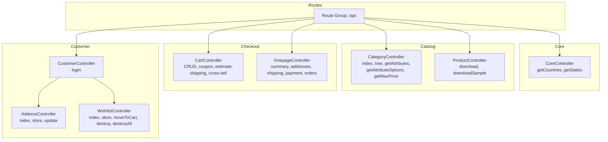
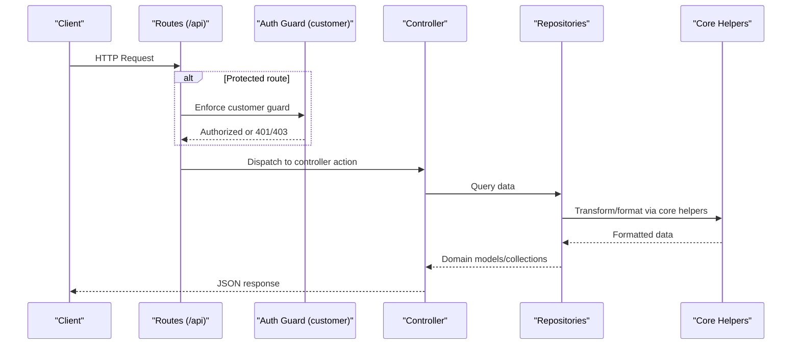
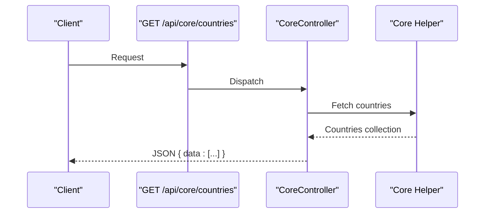
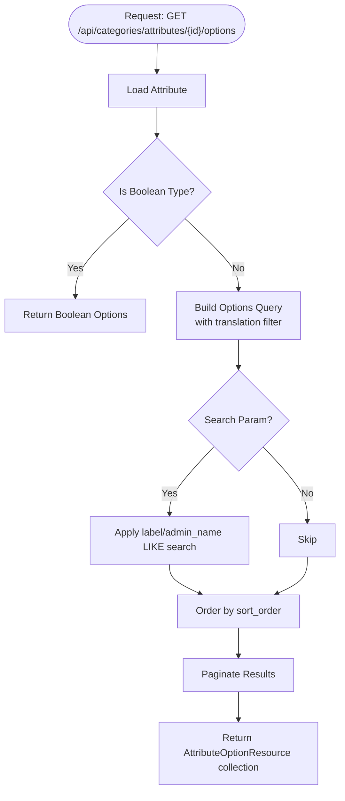
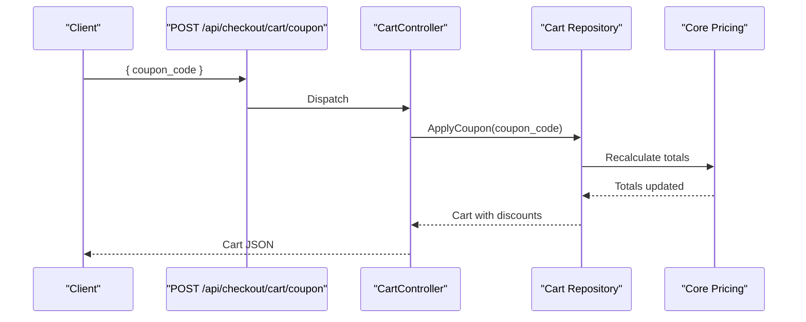
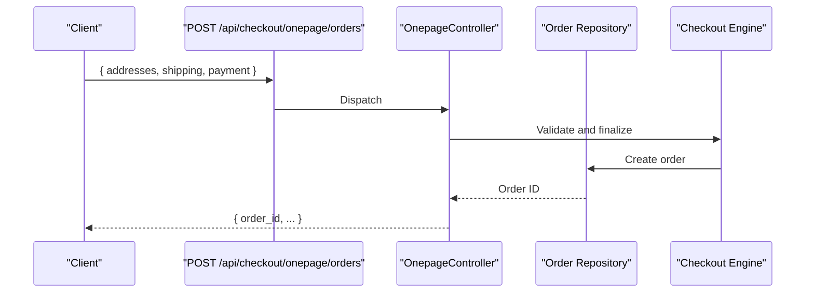
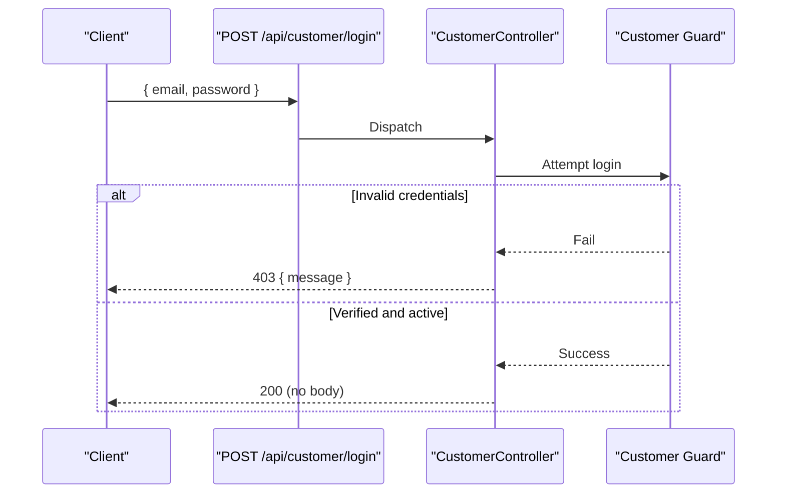
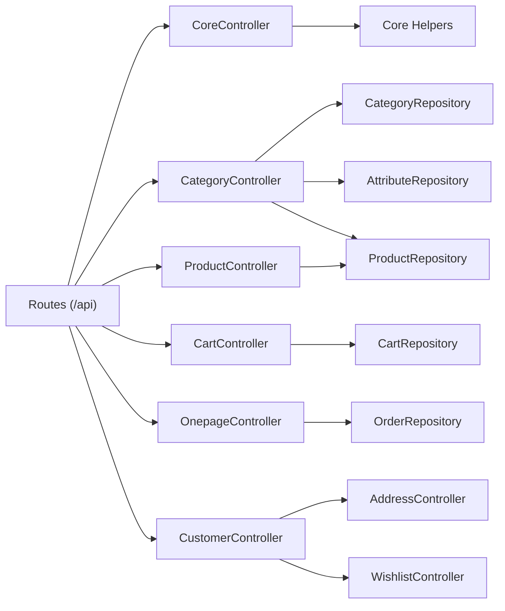

# Shop API Endpoints

<cite>
**Referenced Files in This Document**
- [api.php](file://packages/Webkul/Shop/src/Routes/api.php)
- [CustomerController.php](file://packages/Webkul/Shop/src/Http/Controllers/API/CustomerController.php)
- [CoreController.php](file://packages/Webkul/Shop/src/Http/Controllers/API/CoreController.php)
- [CategoryController.php](file://packages/Webkul/Shop/src/Http/Controllers/API/CategoryController.php)
- [ProductController.php](file://packages/Webkul/Shop/src/Http/Controllers/ProductController.php)
- [CartController.php](file://packages/Webkul/Shop/src/Http/Controllers/API/CartController.php)
- [WishlistController.php](file://packages/Webkul/Shop/src/Http/Controllers/API/WishlistController.php)
- [AddressController.php](file://packages/Webkul/Shop/src/Http/Controllers/API/AddressController.php)
- [OnepageController.php](file://packages/Webkul/Shop/src/Http/Controllers/API/OnepageController.php)
- [auth.php](file://config/auth.php)
- [sanctum.php](file://config/sanctum.php)
</cite>

## Table of Contents
1. [Introduction](#introduction)
2. [Project Structure](#project-structure)
3. [Core Components](#core-components)
4. [Architecture Overview](#architecture-overview)
5. [Detailed Component Analysis](#detailed-component-analysis)
6. [Dependency Analysis](#dependency-analysis)
7. [Performance Considerations](#performance-considerations)
8. [Troubleshooting Guide](#troubleshooting-guide)
9. [Conclusion](#conclusion)
10. [Appendices](#appendices)

## Introduction
This document provides comprehensive API documentation for the Shop module’s customer-facing endpoints. It covers:
- Country and state retrieval
- Category management with tree structure and attribute filtering
- Product listing with related and up-sell recommendations
- Cart operations (CRUD, coupons, shipping estimation, cross-sell)
- One-page checkout flow
- Customer authentication and account management (addresses, wishlist)
- Request/response schemas, parameter validation, error handling, and integration examples
- Authentication requirements, rate limiting, and security considerations

## Project Structure
The Shop API endpoints are grouped under a single route prefix and organized by domain areas. Authentication for customer-protected endpoints is enforced via a dedicated guard.

**Diagram sources**
- [api.php:16-127](file://packages/Webkul/Shop/src/Routes/api.php#L16-L127)
- [CoreController.php:14-35](file://packages/Webkul/Shop/src/Http/Controllers/API/CoreController.php#L14-L35)
- [CategoryController.php:32-124](file://packages/Webkul/Shop/src/Http/Controllers/API/CategoryController.php#L32-L124)
- [CartController.php](file://packages/Webkul/Shop/src/Http/Controllers/API/CartController.php)
- [OnepageController.php](file://packages/Webkul/Shop/src/Http/Controllers/API/OnepageController.php)
- [CustomerController.php:18-52](file://packages/Webkul/Shop/src/Http/Controllers/API/CustomerController.php#L18-L52)
- [AddressController.php](file://packages/Webkul/Shop/src/Http/Controllers/API/AddressController.php)
- [WishlistController.php](file://packages/Webkul/Shop/src/Http/Controllers/API/WishlistController.php)

**Section sources**
- [api.php:16-127](file://packages/Webkul/Shop/src/Routes/api.php#L16-L127)

## Core Components
- Core endpoints: country/state lists
- Category endpoints: list, tree, attribute filters, attribute options, max price
- Product endpoints: downloads and samples
- Cart endpoints: items, coupons, shipping estimation, cross-sell
- One-page checkout: summary, addresses, shipping/payment methods, order placement
- Customer endpoints: login; protected routes for addresses and wishlist

**Section sources**
- [CoreController.php:14-35](file://packages/Webkul/Shop/src/Http/Controllers/API/CoreController.php#L14-L35)
- [CategoryController.php:32-124](file://packages/Webkul/Shop/src/Http/Controllers/API/CategoryController.php#L32-L124)
- [ProductController.php:33-103](file://packages/Webkul/Shop/src/Http/Controllers/ProductController.php#L33-L103)
- [CartController.php](file://packages/Webkul/Shop/src/Http/Controllers/API/CartController.php)
- [OnepageController.php](file://packages/Webkul/Shop/src/Http/Controllers/API/OnepageController.php)
- [CustomerController.php:18-52](file://packages/Webkul/Shop/src/Http/Controllers/API/CustomerController.php#L18-L52)
- [AddressController.php](file://packages/Webkul/Shop/src/Http/Controllers/API/AddressController.php)
- [WishlistController.php](file://packages/Webkul/Shop/src/Http/Controllers/API/WishlistController.php)

## Architecture Overview
The Shop API is organized under a single route prefix with optional customer authentication middleware applied to protected endpoints. Controllers delegate to repositories and core helpers for data retrieval and transformations.

**Diagram sources**
- [api.php:16-127](file://packages/Webkul/Shop/src/Routes/api.php#L16-L127)
- [auth.php:41-51](file://config/auth.php#L41-L51)

## Detailed Component Analysis

### Authentication and Security
- Authentication guard: customer session-based guard
- CSRF and cookie handling: Sanctum middleware stack configured for stateful domains
- Rate limiting: Not explicitly configured in the examined files; consult rate-limiting policies in your deployment layer
- Security considerations:
  - Use HTTPS in production
  - Validate and sanitize all inputs
  - Apply CORS policies appropriate to your frontend origin
  - Protect sensitive endpoints with the customer guard

Authentication requirements:
- Public endpoints: No authentication
- Protected endpoints (customer area): Requires authenticated customer session

**Section sources**
- [auth.php:19-51](file://config/auth.php#L19-L51)
- [sanctum.php:21-69](file://config/sanctum.php#L21-L69)
- [api.php:106-126](file://packages/Webkul/Shop/src/Routes/api.php#L106-L126)

### Core: Country and State Retrieval
- Endpoint: GET /api/core/countries
  - Purpose: Retrieve list of countries with id, code, and name
  - Response: JSON object containing an array of countries
  - Authentication: None
  - Notes: Uses core country repository and locale-aware mapping

- Endpoint: GET /api/core/states
  - Purpose: Retrieve grouped states by country
  - Response: JSON object containing grouped states
  - Authentication: None

**Diagram sources**
- [CoreController.php:14-22](file://packages/Webkul/Shop/src/Http/Controllers/API/CoreController.php#L14-L22)
- [api.php:21-25](file://packages/Webkul/Shop/src/Routes/api.php#L21-L25)

**Section sources**
- [CoreController.php:14-35](file://packages/Webkul/Shop/src/Http/Controllers/API/CoreController.php#L14-L35)
- [api.php:21-25](file://packages/Webkul/Shop/src/Routes/api.php#L21-L25)

### Categories: Tree and Attribute Filtering
- Endpoint: GET /api/categories
  - Purpose: List categories (enabled, locale-aware)
  - Query params: Standard list filters supported by repository
  - Response: Paginated collection of categories
  - Authentication: None

- Endpoint: GET /api/categories/tree
  - Purpose: Return hierarchical category tree rooted at channel’s root category
  - Response: Nested tree structure
  - Authentication: None

- Endpoint: GET /api/categories/attributes
  - Purpose: Retrieve filterable attributes; optionally scoped to a category
  - Query: category_id (optional)
  - Response: Attributes suitable for filtering
  - Authentication: None

- Endpoint: GET /api/categories/attributes/{attribute_id}/options
  - Purpose: Retrieve attribute options with search and pagination
  - Query: search (optional), paginated
  - Response: Paginated attribute options with translations
  - Authentication: None

- Endpoint: GET /api/categories/max-price/{category_id?}
  - Purpose: Maximum product price for category or global
  - Response: JSON with max_price converted via core currency helper
  - Authentication: None

**Diagram sources**
- [CategoryController.php:81-106](file://packages/Webkul/Shop/src/Http/Controllers/API/CategoryController.php#L81-L106)

**Section sources**
- [CategoryController.php:32-124](file://packages/Webkul/Shop/src/Http/Controllers/API/CategoryController.php#L32-L124)
- [api.php:27-37](file://packages/Webkul/Shop/src/Routes/api.php#L27-L37)

### Products: Listing and Related/Up-sell
- Endpoint: GET /api/products
  - Purpose: List products (repository supports standard filters)
  - Response: Paginated product collection
  - Authentication: None

- Endpoint: GET /api/products/{id}/related
  - Purpose: Related products for a given product
  - Response: Collection of related products
  - Authentication: None

- Endpoint: GET /api/products/{id}/up-sell
  - Purpose: Up-sell products for a given product
  - Response: Collection of up-sell products
  - Authentication: None

- Endpoint: GET /api/product/{id}/reviews
  - Purpose: Reviews for a product
  - Response: Reviews collection
  - Authentication: None

- Endpoint: POST /api/product/{id}/review
  - Purpose: Submit a review for a product
  - Response: Created review or errors
  - Authentication: None

- Endpoint: GET /api/product/{id}/reviews/{review_id}/translate
  - Purpose: Translate a review
  - Response: Translation data
  - Authentication: None

- Endpoint: GET /api/compare-items
  - Purpose: List compare items
  - Response: Compare items
  - Authentication: None

- Endpoint: POST /api/compare-items
  - Purpose: Add item to compare list
  - Response: Success or error
  - Authentication: None

- Endpoint: DELETE /api/compare-items
  - Purpose: Remove selected compare items
  - Response: Success or error
  - Authentication: None

- Endpoint: DELETE /api/compare-items/all
  - Purpose: Clear all compare items
  - Response: Success or error
  - Authentication: None

Notes:
- Product download and sample endpoints exist in the product controller but are not exposed under the /api prefix in the examined routes.

**Section sources**
- [api.php:39-53](file://packages/Webkul/Shop/src/Routes/api.php#L39-L53)
- [ProductController.php:33-103](file://packages/Webkul/Shop/src/Http/Controllers/ProductController.php#L33-L103)

### Cart: CRUD, Coupons, Shipping Estimation, Cross-sell
- Endpoint: GET /api/checkout/cart
  - Purpose: Retrieve cart contents
  - Response: Cart representation
  - Authentication: Required (customer guard)

- Endpoint: POST /api/checkout/cart
  - Purpose: Add item to cart
  - Response: Updated cart
  - Authentication: Required

- Endpoint: PUT /api/checkout/cart
  - Purpose: Update cart item quantities/pricing
  - Response: Updated cart
  - Authentication: Required

- Endpoint: DELETE /api/checkout/cart
  - Purpose: Remove all items
  - Response: Empty cart
  - Authentication: Required

- Endpoint: DELETE /api/checkout/cart/selected
  - Purpose: Remove selected items
  - Response: Updated cart
  - Authentication: Required

- Endpoint: POST /api/checkout/cart/move-to-wishlist
  - Purpose: Move items to wishlist
  - Response: Success or error
  - Authentication: Required

- Endpoint: POST /api/checkout/cart/coupon
  - Purpose: Apply coupon
  - Response: Updated cart totals
  - Authentication: Required

- Endpoint: DELETE /api/checkout/cart/coupon
  - Purpose: Remove coupon
  - Response: Updated cart totals
  - Authentication: Required

- Endpoint: POST /api/checkout/cart/estimate-shipping-methods
  - Purpose: Estimate shipping methods based on shipping address
  - Response: Available shipping rates
  - Authentication: Required

- Endpoint: GET /api/checkout/cart/cross-sell
  - Purpose: Cross-sell products for current cart
  - Response: Cross-sell product suggestions
  - Authentication: Required

**Diagram sources**
- [api.php:65-85](file://packages/Webkul/Shop/src/Routes/api.php#L65-L85)
- [CartController.php](file://packages/Webkul/Shop/src/Http/Controllers/API/CartController.php)

**Section sources**
- [api.php:65-85](file://packages/Webkul/Shop/src/Routes/api.php#L65-L85)

### One-page Checkout
- Endpoint: GET /api/checkout/onepage/summary
  - Purpose: Retrieve checkout summary (cart, shipping, taxes)
  - Response: Summary object
  - Authentication: Required

- Endpoint: POST /api/checkout/onepage/addresses
  - Purpose: Save billing/shipping addresses
  - Response: Success or validation errors
  - Authentication: Required

- Endpoint: POST /api/checkout/onepage/shipping-methods
  - Purpose: Select shipping method
  - Response: Selected method and rates
  - Authentication: Required

- Endpoint: POST /api/checkout/onepage/payment-methods
  - Purpose: Select payment method
  - Response: Selected method
  - Authentication: Required

- Endpoint: POST /api/checkout/onepage/orders
  - Purpose: Place order
  - Response: Order confirmation
  - Authentication: Required

**Diagram sources**
- [api.php:87-97](file://packages/Webkul/Shop/src/Routes/api.php#L87-L97)
- [OnepageController.php](file://packages/Webkul/Shop/src/Http/Controllers/API/OnepageController.php)

**Section sources**
- [api.php:87-97](file://packages/Webkul/Shop/src/Routes/api.php#L87-L97)

### Customer Authentication
- Endpoint: POST /api/customer/login
  - Purpose: Authenticate customer
  - Body: email, password
  - Response: Success or error with reasons (inactive, unverified, invalid credentials)
  - Authentication: None
  - Side effects: Triggers event hook for post-login cart sync

**Diagram sources**
- [api.php:102-104](file://packages/Webkul/Shop/src/Routes/api.php#L102-L104)
- [CustomerController.php:18-52](file://packages/Webkul/Shop/src/Http/Controllers/API/CustomerController.php#L18-L52)

**Section sources**
- [CustomerController.php:18-52](file://packages/Webkul/Shop/src/Http/Controllers/API/CustomerController.php#L18-L52)
- [api.php:102-104](file://packages/Webkul/Shop/src/Routes/api.php#L102-L104)

### Addresses Management
- Endpoint: GET /api/customer/addresses
  - Purpose: List customer addresses
  - Response: Address list
  - Authentication: Required

- Endpoint: POST /api/customer/addresses
  - Purpose: Create new address
  - Response: Created address
  - Authentication: Required

- Endpoint: PUT /api/customer/addresses/edit/{id}
  - Purpose: Update address
  - Response: Updated address
  - Authentication: Required

**Section sources**
- [api.php:107-113](file://packages/Webkul/Shop/src/Routes/api.php#L107-L113)
- [AddressController.php](file://packages/Webkul/Shop/src/Http/Controllers/API/AddressController.php)

### Wishlist
- Endpoint: GET /api/customer/wishlist
  - Purpose: List wishlist items
  - Response: Wishlist items
  - Authentication: Required

- Endpoint: POST /api/customer/wishlist
  - Purpose: Add item to wishlist
  - Response: Success or error
  - Authentication: Required

- Endpoint: POST /api/customer/wishlist/{id}/move-to-cart
  - Purpose: Move item to cart
  - Response: Success or error
  - Authentication: Required

- Endpoint: DELETE /api/customer/wishlist/all
  - Purpose: Clear wishlist
  - Response: Success or error
  - Authentication: Required

- Endpoint: DELETE /api/customer/wishlist/{id}
  - Purpose: Remove item
  - Response: Success or error
  - Authentication: Required

**Section sources**
- [api.php:115-125](file://packages/Webkul/Shop/src/Routes/api.php#L115-L125)
- [WishlistController.php](file://packages/Webkul/Shop/src/Http/Controllers/API/WishlistController.php)

## Dependency Analysis
- Route grouping organizes endpoints by domain
- Controllers depend on repositories and core helpers for data and formatting
- Authentication middleware applies to customer-protected routes
- No circular dependencies observed among controllers in the examined files

**Diagram sources**
- [api.php:16-127](file://packages/Webkul/Shop/src/Routes/api.php#L16-L127)
- [CategoryController.php:23-27](file://packages/Webkul/Shop/src/Http/Controllers/API/CategoryController.php#L23-L27)
- [CartController.php](file://packages/Webkul/Shop/src/Http/Controllers/API/CartController.php)
- [OnepageController.php](file://packages/Webkul/Shop/src/Http/Controllers/API/OnepageController.php)
- [CustomerController.php:18-52](file://packages/Webkul/Shop/src/Http/Controllers/API/CustomerController.php#L18-L52)

**Section sources**
- [api.php:16-127](file://packages/Webkul/Shop/src/Routes/api.php#L16-L127)

## Performance Considerations
- Pagination: Attribute options and category listings support pagination; use limit parameters to control payload sizes
- Search: Attribute options support server-side LIKE search; prefer indexed labels and concise search terms
- Currency conversion: Max price endpoints convert amounts via core helpers; cache results where appropriate
- Image/file downloads: Product download endpoints stream content; ensure proper caching headers and disk configuration

## Troubleshooting Guide
Common issues and resolutions:
- Authentication failures:
  - Ensure customer guard is used for protected routes
  - Verify credentials and activation status
- Coupon application:
  - Confirm coupon validity and cart conditions
- Shipping estimation:
  - Provide valid shipping address fields
- Reviews:
  - Ensure product exists and reviews are enabled

**Section sources**
- [CustomerController.php:18-52](file://packages/Webkul/Shop/src/Http/Controllers/API/CustomerController.php#L18-L52)
- [CartController.php](file://packages/Webkul/Shop/src/Http/Controllers/API/CartController.php)
- [OnepageController.php](file://packages/Webkul/Shop/src/Http/Controllers/API/OnepageController.php)

## Conclusion
The Shop API provides a cohesive set of endpoints for customer-facing functionality. Adhering to the documented authentication, validation, and error-handling patterns ensures reliable integrations. For production deployments, complement the examined configurations with explicit rate limiting and robust monitoring.

## Appendices

### Request/Response Schemas and Examples

- GET /api/core/countries
  - Response shape: { data: [{ id, code, name }, ...] }
  - Example: [CoreController.php:16-22](file://packages/Webkul/Shop/src/Http/Controllers/API/CoreController.php#L16-L22)

- GET /api/core/states
  - Response shape: { data: { country_code: [ { id, name }, ... ] } }
  - Example: [CoreController.php:32-34](file://packages/Webkul/Shop/src/Http/Controllers/API/CoreController.php#L32-L34)

- GET /api/categories
  - Response shape: Paginated collection of categories
  - Example: [CategoryController.php:43-45](file://packages/Webkul/Shop/src/Http/Controllers/API/CategoryController.php#L43-L45)

- GET /api/categories/tree
  - Response shape: Hierarchical tree
  - Example: [CategoryController.php:53-55](file://packages/Webkul/Shop/src/Http/Controllers/API/CategoryController.php#L53-L55)

- GET /api/categories/attributes
  - Query: category_id (optional)
  - Response shape: Attributes collection
  - Example: [CategoryController.php:61-76](file://packages/Webkul/Shop/src/Http/Controllers/API/CategoryController.php#L61-L76)

- GET /api/categories/attributes/{id}/options
  - Query: search (optional)
  - Response shape: Paginated attribute options
  - Example: [CategoryController.php:81-106](file://packages/Webkul/Shop/src/Http/Controllers/API/CategoryController.php#L81-L106)

- GET /api/categories/max-price/{category_id?}
  - Response shape: { max_price: number }
  - Example: [CategoryController.php:111-124](file://packages/Webkul/Shop/src/Http/Controllers/API/CategoryController.php#L111-L124)

- GET /api/products
  - Response shape: Paginated products
  - Example: [api.php:40](file://packages/Webkul/Shop/src/Routes/api.php#L40)

- GET /api/products/{id}/related
  - Response shape: Related products
  - Example: [api.php:42](file://packages/Webkul/Shop/src/Routes/api.php#L42)

- GET /api/products/{id}/up-sell
  - Response shape: Up-sell products
  - Example: [api.php:44](file://packages/Webkul/Shop/src/Routes/api.php#L44)

- POST /api/customer/login
  - Body: { email, password }
  - Response shape: Empty on success; error object on failure
  - Example: [CustomerController.php:18-52](file://packages/Webkul/Shop/src/Http/Controllers/API/CustomerController.php#L18-L52)

- GET /api/checkout/cart
  - Response shape: Cart representation
  - Example: [api.php:66](file://packages/Webkul/Shop/src/Routes/api.php#L66)

- POST /api/checkout/cart
  - Body: Cart item payload
  - Response shape: Updated cart
  - Example: [api.php:68](file://packages/Webkul/Shop/src/Routes/api.php#L68)

- PUT /api/checkout/cart
  - Body: Updates
  - Response shape: Updated cart
  - Example: [api.php:70](file://packages/Webkul/Shop/src/Routes/api.php#L70)

- DELETE /api/checkout/cart
  - Response shape: Empty cart
  - Example: [api.php:72](file://packages/Webkul/Shop/src/Routes/api.php#L72)

- DELETE /api/checkout/cart/selected
  - Response shape: Updated cart
  - Example: [api.php:74](file://packages/Webkul/Shop/src/Routes/api.php#L74)

- POST /api/checkout/cart/move-to-wishlist
  - Response shape: Success or error
  - Example: [api.php:76](file://packages/Webkul/Shop/src/Routes/api.php#L76)

- POST /api/checkout/cart/coupon
  - Body: { coupon_code }
  - Response shape: Updated cart totals
  - Example: [api.php:78](file://packages/Webkul/Shop/src/Routes/api.php#L78)

- DELETE /api/checkout/cart/coupon
  - Response shape: Updated cart totals
  - Example: [api.php:82](file://packages/Webkul/Shop/src/Routes/api.php#L82)

- POST /api/checkout/cart/estimate-shipping-methods
  - Body: Address fields
  - Response shape: Shipping methods
  - Example: [api.php:80](file://packages/Webkul/Shop/src/Routes/api.php#L80)

- GET /api/checkout/cart/cross-sell
  - Response shape: Cross-sell products
  - Example: [api.php:84](file://packages/Webkul/Shop/src/Routes/api.php#L84)

- GET /api/checkout/onepage/summary
  - Response shape: Summary object
  - Example: [api.php:88](file://packages/Webkul/Shop/src/Routes/api.php#L88)

- POST /api/checkout/onepage/addresses
  - Body: Address data
  - Response shape: Success or errors
  - Example: [api.php:90](file://packages/Webkul/Shop/src/Routes/api.php#L90)

- POST /api/checkout/onepage/shipping-methods
  - Body: { method }
  - Response shape: Selected method
  - Example: [api.php:92](file://packages/Webkul/Shop/src/Routes/api.php#L92)

- POST /api/checkout/onepage/payment-methods
  - Body: { method }
  - Response shape: Selected method
  - Example: [api.php:94](file://packages/Webkul/Shop/src/Routes/api.php#L94)

- POST /api/checkout/onepage/orders
  - Response shape: Order confirmation
  - Example: [api.php:96](file://packages/Webkul/Shop/src/Routes/api.php#L96)

- GET /api/customer/addresses
  - Response shape: Address list
  - Example: [api.php:108](file://packages/Webkul/Shop/src/Routes/api.php#L108)

- POST /api/customer/addresses
  - Body: Address data
  - Response shape: Created address
  - Example: [api.php:110](file://packages/Webkul/Shop/src/Routes/api.php#L110)

- PUT /api/customer/addresses/edit/{id}
  - Body: Address updates
  - Response shape: Updated address
  - Example: [api.php:112](file://packages/Webkul/Shop/src/Routes/api.php#L112)

- GET /api/customer/wishlist
  - Response shape: Wishlist items
  - Example: [api.php:116](file://packages/Webkul/Shop/src/Routes/api.php#L116)

- POST /api/customer/wishlist
  - Body: Product identifier
  - Response shape: Success or error
  - Example: [api.php:118](file://packages/Webkul/Shop/src/Routes/api.php#L118)

- POST /api/customer/wishlist/{id}/move-to-cart
  - Response shape: Success or error
  - Example: [api.php:120](file://packages/Webkul/Shop/src/Routes/api.php#L120)

- DELETE /api/customer/wishlist/all
  - Response shape: Success or error
  - Example: [api.php:122](file://packages/Webkul/Shop/src/Routes/api.php#L122)

- DELETE /api/customer/wishlist/{id}
  - Response shape: Success or error
  - Example: [api.php:124](file://packages/Webkul/Shop/src/Routes/api.php#L124)

### Parameter Validation and Error Handling
- Validation:
  - Use standard form request validation patterns for customer login and address updates
  - Apply repository-level filters for list endpoints
- Error handling:
  - Authentication failures return 403 with localized messages
  - Unverified accounts trigger resend cookie flags and logout
  - Not activated accounts are rejected with 403
  - Resource not found scenarios return 404 where applicable

**Section sources**
- [CustomerController.php:18-52](file://packages/Webkul/Shop/src/Http/Controllers/API/CustomerController.php#L18-L52)
- [ProductsCategoriesProxyController.php:133](file://packages/Webkul/Shop/src/Http/Controllers/ProductsCategoriesProxyController.php#L133)

### Authentication Requirements and Rate Limiting
- Authentication:
  - Customer guard for protected routes
  - Sanctum middleware stack for stateful domains
- Rate limiting:
  - Not configured in examined files; implement at the framework level as needed

**Section sources**
- [auth.php:19-51](file://config/auth.php#L19-L51)
- [sanctum.php:21-69](file://config/sanctum.php#L21-L69)