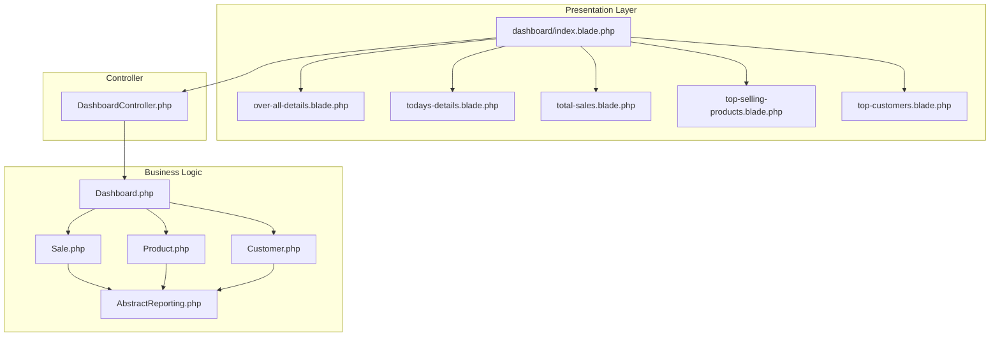
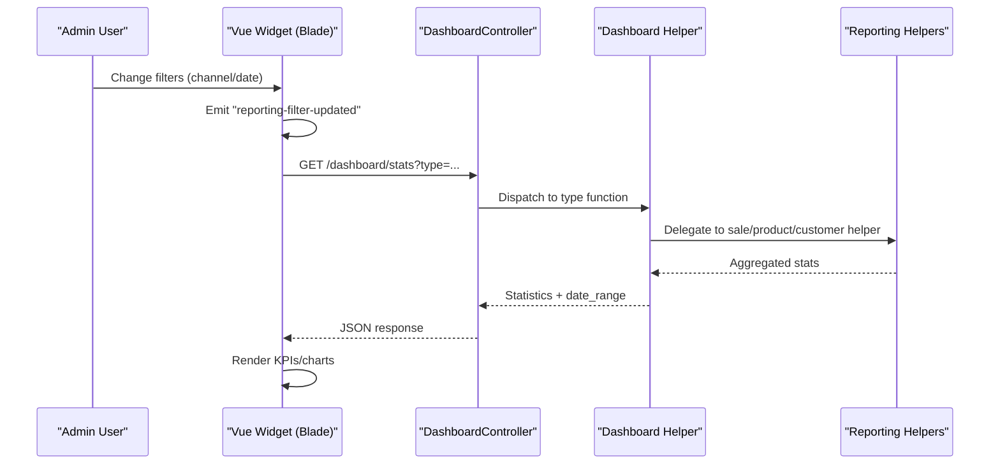
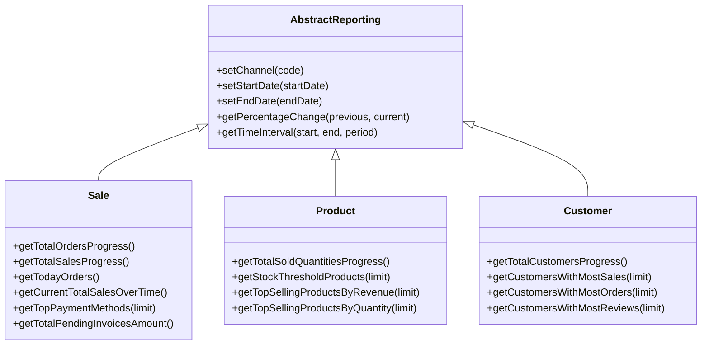
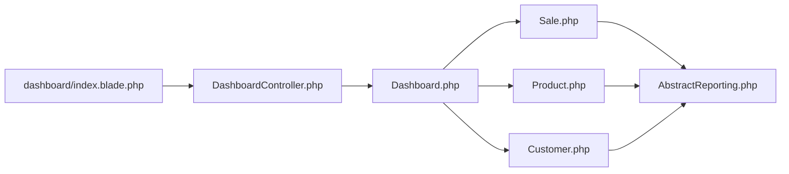

# Admin Dashboard

<cite>
**Referenced Files in This Document**
- [index.blade.php](file://packages/Webkul/Admin/src/Resources/views/dashboard/index.blade.php)
- [Dashboard.php](file://packages/Webkul/Admin/src/Helpers/Dashboard.php)
- [DashboardController.php](file://packages/Webkul/Admin/src/Http/Controllers/DashboardController.php)
- [Sale.php](file://packages/Webkul/Admin/src/Helpers/Reporting/Sale.php)
- [Product.php](file://packages/Webkul/Admin/src/Helpers/Reporting/Product.php)
- [Customer.php](file://packages/Webkul/Admin/src/Helpers/Reporting/Customer.php)
- [AbstractReporting.php](file://packages/Webkul/Admin/src/Helpers/Reporting/AbstractReporting.php)
- [over-all-details.blade.php](file://packages/Webkul/Admin/src/Resources/views/dashboard/over-all-details.blade.php)
- [todays-details.blade.php](file://packages/Webkul/Admin/src/Resources/views/dashboard/todays-details.blade.php)
- [total-sales.blade.php](file://packages/Webkul/Admin/src/Resources/views/dashboard/total-sales.blade.php)
- [top-selling-products.blade.php](file://packages/Webkul/Admin/src/Resources/views/dashboard/top-selling-products.blade.php)
- [top-customers.blade.php](file://packages/Webkul/Admin/src/Resources/views/dashboard/top-customers.blade.php)
</cite>

## Table of Contents
1. [Introduction](#introduction)
2. [Project Structure](#project-structure)
3. [Core Components](#core-components)
4. [Architecture Overview](#architecture-overview)
5. [Detailed Component Analysis](#detailed-component-analysis)
6. [Dependency Analysis](#dependency-analysis)
7. [Performance Considerations](#performance-considerations)
8. [Troubleshooting Guide](#troubleshooting-guide)
9. [Conclusion](#conclusion)

## Introduction
This document explains the admin dashboard functionality in the Admin package. It covers the dashboard layout, the widget system, key performance indicators (KPIs), and data visualization components such as sales charts, product performance metrics, and customer analytics. It also documents customization options, widget configuration, and real-time data updates via event-driven filters. Implementation details include the dashboard controller, reporting helpers, and Blade-based Vue components that render KPIs and charts.

## Project Structure
The dashboard is composed of:
- A Blade page that defines the layout and includes multiple widget partials.
- A controller that renders the dashboard and exposes a stats endpoint.
- A dashboard helper that orchestrates reporting helpers and aggregates statistics.
- Reporting helpers that encapsulate data retrieval and time-series computations.
- Blade widgets that render KPIs and charts using Vue components.

**Diagram sources**
- [index.blade.php:1-193](file://packages/Webkul/Admin/src/Resources/views/dashboard/index.blade.php#L1-L193)
- [DashboardController.php:1-60](file://packages/Webkul/Admin/src/Http/Controllers/DashboardController.php#L1-L60)
- [Dashboard.php:1-161](file://packages/Webkul/Admin/src/Helpers/Dashboard.php#L1-L161)
- [AbstractReporting.php:1-368](file://packages/Webkul/Admin/src/Helpers/Reporting/AbstractReporting.php#L1-L368)
- [Sale.php:1-639](file://packages/Webkul/Admin/src/Helpers/Reporting/Sale.php#L1-L639)
- [Product.php:1-409](file://packages/Webkul/Admin/src/Helpers/Reporting/Product.php#L1-L409)
- [Customer.php:1-256](file://packages/Webkul/Admin/src/Helpers/Reporting/Customer.php#L1-L256)

**Section sources**
- [index.blade.php:1-193](file://packages/Webkul/Admin/src/Resources/views/dashboard/index.blade.php#L1-L193)
- [DashboardController.php:1-60](file://packages/Webkul/Admin/src/Http/Controllers/DashboardController.php#L1-L60)
- [Dashboard.php:1-161](file://packages/Webkul/Admin/src/Helpers/Dashboard.php#L1-L161)

## Core Components
- Dashboard page layout: Defines the overall grid, user greeting, filter controls, and includes widget partials.
- Widget components: Each widget is a Blade partial with a Vue component that fetches data via AJAX and renders KPIs or charts.
- Stats endpoint: A single controller action serves all widget data grouped by type.
- Reporting helpers: Encapsulate queries and time-series logic for sales, products, and customers.
- Filter system: A Vue dropdown/date picker emits events that trigger widget reloads.

Key responsibilities:
- Layout and composition: [index.blade.php:1-193](file://packages/Webkul/Admin/src/Resources/views/dashboard/index.blade.php#L1-L193)
- Stats orchestration: [Dashboard.php:28-161](file://packages/Webkul/Admin/src/Helpers/Dashboard.php#L28-L161)
- Data retrieval and time-series: [Sale.php:13-639](file://packages/Webkul/Admin/src/Helpers/Reporting/Sale.php#L13-L639), [Product.php:17-409](file://packages/Webkul/Admin/src/Helpers/Reporting/Product.php#L17-L409), [Customer.php:12-256](file://packages/Webkul/Admin/src/Helpers/Reporting/Customer.php#L12-L256)
- Filters and real-time updates: [index.blade.php:19-191](file://packages/Webkul/Admin/src/Resources/views/dashboard/index.blade.php#L19-L191)
- Widget rendering: [over-all-details.blade.php:1-229](file://packages/Webkul/Admin/src/Resources/views/dashboard/over-all-details.blade.php#L1-L229), [todays-details.blade.php:1-251](file://packages/Webkul/Admin/src/Resources/views/dashboard/todays-details.blade.php#L1-L251), [total-sales.blade.php:1-108](file://packages/Webkul/Admin/src/Resources/views/dashboard/total-sales.blade.php#L1-L108), [top-selling-products.blade.php:1-146](file://packages/Webkul/Admin/src/Resources/views/dashboard/top-selling-products.blade.php#L1-L146), [top-customers.blade.php:1-126](file://packages/Webkul/Admin/src/Resources/views/dashboard/top-customers.blade.php#L1-L126)

**Section sources**
- [index.blade.php:1-193](file://packages/Webkul/Admin/src/Resources/views/dashboard/index.blade.php#L1-L193)
- [Dashboard.php:28-161](file://packages/Webkul/Admin/src/Helpers/Dashboard.php#L28-L161)
- [Sale.php:13-639](file://packages/Webkul/Admin/src/Helpers/Reporting/Sale.php#L13-L639)
- [Product.php:17-409](file://packages/Webkul/Admin/src/Helpers/Reporting/Product.php#L17-L409)
- [Customer.php:12-256](file://packages/Webkul/Admin/src/Helpers/Reporting/Customer.php#L12-L256)

## Architecture Overview
The dashboard follows a layered pattern:
- Presentation: Blade templates define the layout and include widget partials.
- Interaction: Vue components inside widgets manage loading states, fetch data, and render charts/KPIs.
- Control: A controller action serves JSON responses for widget types.
- Business logic: A dashboard helper delegates to specialized reporting helpers.
- Data: Reporting helpers compute totals, progress, and time-series data.

**Diagram sources**
- [index.blade.php:19-191](file://packages/Webkul/Admin/src/Resources/views/dashboard/index.blade.php#L19-L191)
- [DashboardController.php:50-58](file://packages/Webkul/Admin/src/Http/Controllers/DashboardController.php#L50-L58)
- [Dashboard.php:16-23](file://packages/Webkul/Admin/src/Helpers/Dashboard.php#L16-L23)

## Detailed Component Analysis

### Dashboard Page Layout
- User greeting and actions: Displays the logged-in admin’s name and includes the filter component.
- Sections:
  - Overall details: Includes the “over-all-details” partial.
  - Today’s details: Includes the “todays-details” partial.
  - Stock threshold: Includes the “stock-threshold-products” partial.
  - Right column: Store stats container with total sales, top selling products, and top customers.
- Filters: A Vue component with channel dropdown and date pickers emits a global event to refresh widgets.

**Section sources**
- [index.blade.php:6-99](file://packages/Webkul/Admin/src/Resources/views/dashboard/index.blade.php#L6-L99)
- [index.blade.php:19-191](file://packages/Webkul/Admin/src/Resources/views/dashboard/index.blade.php#L19-L191)

### Widget: Overall Details
- Purpose: Renders KPIs for total sales, total orders, total customers, average sales, and unpaid invoices.
- Behavior:
  - On mount and on filter updates, fetches stats with type “over-all”.
  - Displays formatted totals and progress percentages with directional icons.
- Data source: Uses the stats endpoint with type “over-all”.

**Section sources**
- [over-all-details.blade.php:1-229](file://packages/Webkul/Admin/src/Resources/views/dashboard/over-all-details.blade.php#L1-L229)
- [DashboardController.php:16-23](file://packages/Webkul/Admin/src/Http/Controllers/DashboardController.php#L16-L23)
- [Dashboard.php:28-40](file://packages/Webkul/Admin/src/Helpers/Dashboard.php#L28-L40)

### Widget: Today’s Details
- Purpose: Shows today’s sales, orders, and customers, plus recent orders with items preview.
- Behavior:
  - Fetches stats with type “today”.
  - Renders order rows with customer info, totals, and billing address.
- Data source: Uses the stats endpoint with type “today”.

**Section sources**
- [todays-details.blade.php:1-251](file://packages/Webkul/Admin/src/Resources/views/dashboard/todays-details.blade.php#L1-L251)
- [DashboardController.php:16-23](file://packages/Webkul/Admin/src/Http/Controllers/DashboardController.php#L16-L23)
- [Dashboard.php:45-73](file://packages/Webkul/Admin/src/Helpers/Dashboard.php#L45-L73)

### Widget: Total Sales (Bar Chart)
- Purpose: Displays total sales over time as a bar chart.
- Behavior:
  - Fetches stats with type “total-sales”.
  - Computes chart labels and datasets from the returned over_time series.
- Data source: Uses the stats endpoint with type “total-sales”.

**Section sources**
- [total-sales.blade.php:1-108](file://packages/Webkul/Admin/src/Resources/views/dashboard/total-sales.blade.php#L1-L108)
- [DashboardController.php:16-23](file://packages/Webkul/Admin/src/Http/Controllers/DashboardController.php#L16-L23)
- [Dashboard.php:102-109](file://packages/Webkul/Admin/src/Helpers/Dashboard.php#L102-L109)

### Widget: Top Selling Products
- Purpose: Lists top products by revenue during the selected period.
- Behavior:
  - Fetches stats with type “top-selling-products”.
  - Renders product images, price, and revenue; links to product edit page.
- Data source: Uses the stats endpoint with type “top-selling-products”.

**Section sources**
- [top-selling-products.blade.php:1-146](file://packages/Webkul/Admin/src/Resources/views/dashboard/top-selling-products.blade.php#L1-L146)
- [DashboardController.php:16-23](file://packages/Webkul/Admin/src/Http/Controllers/DashboardController.php#L16-L23)
- [Dashboard.php:114-117](file://packages/Webkul/Admin/src/Helpers/Dashboard.php#L114-L117)

### Widget: Top Customers
- Purpose: Lists top customers by total sales during the selected period.
- Behavior:
  - Fetches stats with type “top-customers”.
  - Renders customer name/email, formatted total, and optional order count; links to customer view.
- Data source: Uses the stats endpoint with type “top-customers”.

**Section sources**
- [top-customers.blade.php:1-126](file://packages/Webkul/Admin/src/Resources/views/dashboard/top-customers.blade.php#L1-L126)
- [DashboardController.php:16-23](file://packages/Webkul/Admin/src/Http/Controllers/DashboardController.php#L16-L23)
- [Dashboard.php:122-131](file://packages/Webkul/Admin/src/Helpers/Dashboard.php#L122-L131)

### Controller and Stats Endpoint
- Route: The stats endpoint is called by all widgets.
- Types: The controller dispatches to helper methods based on the query parameter type.
- Response: Returns statistics and a formatted date range string.

**Section sources**
- [DashboardController.php:37-58](file://packages/Webkul/Admin/src/Http/Controllers/DashboardController.php#L37-L58)
- [Dashboard.php:16-23](file://packages/Webkul/Admin/src/Helpers/Dashboard.php#L16-L23)

### Reporting Helpers and Data Aggregation
- AbstractReporting: Centralizes channel scoping, date range computation, and time-interval generation.
- Sale: Computes totals, progress, averages, refunds, taxes, shipping, and over-time series.
- Product: Computes sold quantities, wishlist additions, reviews, stock thresholds, and top products by revenue/quantity.
- Customer: Computes total customers, reviews, and top customers by sales/orders/reviews.

**Diagram sources**
- [AbstractReporting.php:1-368](file://packages/Webkul/Admin/src/Helpers/Reporting/AbstractReporting.php#L1-L368)
- [Sale.php:1-639](file://packages/Webkul/Admin/src/Helpers/Reporting/Sale.php#L1-L639)
- [Product.php:1-409](file://packages/Webkul/Admin/src/Helpers/Reporting/Product.php#L1-L409)
- [Customer.php:1-256](file://packages/Webkul/Admin/src/Helpers/Reporting/Customer.php#L1-L256)

**Section sources**
- [AbstractReporting.php:41-160](file://packages/Webkul/Admin/src/Helpers/Reporting/AbstractReporting.php#L41-L160)
- [Sale.php:13-639](file://packages/Webkul/Admin/src/Helpers/Reporting/Sale.php#L13-L639)
- [Product.php:17-409](file://packages/Webkul/Admin/src/Helpers/Reporting/Product.php#L17-L409)
- [Customer.php:12-256](file://packages/Webkul/Admin/src/Helpers/Reporting/Customer.php#L12-L256)

### Data Visualization Components
- Bar chart: Implemented via a reusable chart component in the “Total Sales” widget.
- KPI cards: Implemented via structured HTML and Vue bindings in each widget partial.
- Charts library: The page loads a chart script asset and uses a bar chart component to render sales over time.

**Section sources**
- [index.blade.php:101-107](file://packages/Webkul/Admin/src/Resources/views/dashboard/index.blade.php#L101-L107)
- [total-sales.blade.php:46-50](file://packages/Webkul/Admin/src/Resources/views/dashboard/total-sales.blade.php#L46-L50)

### Real-Time Data Updates and Filters
- Filters: A Vue component provides channel selection and date pickers.
- Event emission: On filter change, the component emits a global event to notify widgets.
- Widget refresh: Each widget listens for the event and re-fetches data with updated filters.

**Section sources**
- [index.blade.php:19-191](file://packages/Webkul/Admin/src/Resources/views/dashboard/index.blade.php#L19-L191)
- [over-all-details.blade.php:205](file://packages/Webkul/Admin/src/Resources/views/dashboard/over-all-details.blade.php#L205)
- [todays-details.blade.php:227](file://packages/Webkul/Admin/src/Resources/views/dashboard/todays-details.blade.php#L227)
- [total-sales.blade.php:84](file://packages/Webkul/Admin/src/Resources/views/dashboard/total-sales.blade.php#L84)
- [top-selling-products.blade.php:122](file://packages/Webkul/Admin/src/Resources/views/dashboard/top-selling-products.blade.php#L122)
- [top-customers.blade.php:102](file://packages/Webkul/Admin/src/Resources/views/dashboard/top-customers.blade.php#L102)

### Dashboard Customization Options
- Widget visibility: Widgets are included conditionally in the main layout; removing or reordering includes changes the layout.
- Widget content: Each widget’s Blade partial defines its own structure and Vue component logic.
- Filters: Users can switch channels and adjust date ranges to customize the displayed data.

**Section sources**
- [index.blade.php:30-99](file://packages/Webkul/Admin/src/Resources/views/dashboard/index.blade.php#L30-L99)

### Integration Patterns
- Single stats endpoint: All widgets integrate via a unified endpoint with a type parameter.
- Event-driven updates: Widgets subscribe to a shared event to react to filter changes.
- Reusable chart component: The bar chart component is reused across widgets for consistency.

**Section sources**
- [DashboardController.php:50-58](file://packages/Webkul/Admin/src/Http/Controllers/DashboardController.php#L50-L58)
- [index.blade.php:180-189](file://packages/Webkul/Admin/src/Resources/views/dashboard/index.blade.php#L180-L189)
- [total-sales.blade.php:46-50](file://packages/Webkul/Admin/src/Resources/views/dashboard/total-sales.blade.php#L46-L50)

## Dependency Analysis
The dashboard exhibits low coupling and high cohesion:
- Widgets depend on the controller endpoint and share a common event for updates.
- The dashboard helper depends on specialized reporting helpers, which depend on AbstractReporting for shared logic.
- No circular dependencies were identified among the reported files.

**Diagram sources**
- [DashboardController.php:1-60](file://packages/Webkul/Admin/src/Http/Controllers/DashboardController.php#L1-L60)
- [Dashboard.php:1-161](file://packages/Webkul/Admin/src/Helpers/Dashboard.php#L1-L161)
- [AbstractReporting.php:1-368](file://packages/Webkul/Admin/src/Helpers/Reporting/AbstractReporting.php#L1-L368)
- [Sale.php:1-639](file://packages/Webkul/Admin/src/Helpers/Reporting/Sale.php#L1-L639)
- [Product.php:1-409](file://packages/Webkul/Admin/src/Helpers/Reporting/Product.php#L1-L409)
- [Customer.php:1-256](file://packages/Webkul/Admin/src/Helpers/Reporting/Customer.php#L1-L256)

**Section sources**
- [DashboardController.php:1-60](file://packages/Webkul/Admin/src/Http/Controllers/DashboardController.php#L1-L60)
- [Dashboard.php:1-161](file://packages/Webkul/Admin/src/Helpers/Dashboard.php#L1-L161)

## Performance Considerations
- Time-series computation: AbstractReporting determines interval grouping automatically based on the selected period to balance granularity and performance.
- Efficient queries: Reporting helpers use aggregated SQL queries and appropriate joins to minimize overhead.
- Client-side caching: Widgets set a loading state and avoid unnecessary re-renders until new data arrives.
- Asset loading: Charts library is loaded once per page to reduce duplication.

[No sources needed since this section provides general guidance]

## Troubleshooting Guide
- Widgets not updating after changing filters:
  - Verify the filter component emits the expected event and that widgets listen for it.
  - Confirm the stats endpoint responds with the correct type and data shape.
- Incorrect date range or channel filtering:
  - Ensure the AbstractReporting date setters and channel scoping are invoked before queries.
- Missing chart visuals:
  - Confirm the chart asset is loaded and the chart component receives labels/datasets.

**Section sources**
- [index.blade.php:180-189](file://packages/Webkul/Admin/src/Resources/views/dashboard/index.blade.php#L180-L189)
- [DashboardController.php:50-58](file://packages/Webkul/Admin/src/Http/Controllers/DashboardController.php#L50-L58)
- [AbstractReporting.php:73-96](file://packages/Webkul/Admin/src/Helpers/Reporting/AbstractReporting.php#L73-L96)

## Conclusion
The admin dashboard is a modular, event-driven system that separates presentation, interaction, control, and business logic. Widgets are easy to customize and extend, while the centralized stats endpoint and reporting helpers ensure consistent data aggregation and efficient time-series computations. The filter system enables real-time updates across all widgets, and the reusable chart component supports scalable visualization patterns.