# Admin Interface

<cite>
**Referenced Files in This Document**
- [menu.php](file://packages/Webkul/Admin/src/Config/menu.php)
- [acl.php](file://packages/Webkul/Admin/src/Config/acl.php)
- [system.php](file://packages/Webkul/Admin/src/Config/system.php)
- [web.php](file://packages/Webkul/Admin/src/Routes/web.php)
- [DashboardController.php](file://packages/Webkul/Admin/src/Http/Controllers/DashboardController.php)
- [ConfigurationController.php](file://packages/Webkul/Admin/src/Http/Controllers/ConfigurationController.php)
- [Dashboard.php](file://packages/Webkul/Admin/src/Helpers/Dashboard.php)
- [Reporting.php](file://packages/Webkul/Admin/src/Helpers/Reporting.php)
- [index.blade.php](file://packages/Webkul/Admin/src/Resources/views/dashboard/index.blade.php)
- [sidebar/index.blade.php](file://packages/Webkul/Admin/src/Resources/views/components/layouts/sidebar/index.blade.php)
- [header/index.blade.php](file://packages/Webkul/Admin/src/Resources/views/components/layouts/header/index.blade.php)
- [OrderController.php](file://packages/Webkul/Admin/src/Http/Controllers/Sales/OrderController.php)
- [index.blade.php](file://packages/Webkul/Admin/src/Resources/views/components/layouts/index.blade.php)
- [index.blade.php](file://packages/Webkul/Admin/src/Resources/views/components/layouts/anonymous.blade.php)
- [index.blade.php](file://packages/Webkul/Shop/src/Resources/views/components/layouts/index.blade.php)
- [CategoryController.php](file://packages/Webkul/Admin/src/Http/Controllers/Catalog/CategoryController.php)
- [ProductController.php](file://packages/Webkul/Admin/src/Http/Controllers/Catalog/ProductController.php)
- [CategoryRequest.php](file://packages/Webkul/Admin/src/Http/Requests/CategoryRequest.php)
- [ProductForm.php](file://packages/Webkul/Admin/src/Http/Requests/ProductForm.php)
- [create.blade.php](file://packages/Webkul/Admin/src/Resources/views/catalog/categories/create.blade.php)
- [edit.blade.php](file://packages/Webkul/Admin/src/Resources/views/catalog/categories/edit.blade.php)
- [edit.blade.php](file://packages/Webkul/Admin/src/Resources/views/catalog/products/edit.blade.php)
- [controls.blade.php](file://packages/Webkul/Admin/src/Resources/views/catalog/products/edit/controls.blade.php)
- [simple.blade.php](file://packages/Webkul/Admin/src/Resources/views/catalog/products/edit/types/simple.blade.php)
</cite>

## Update Summary
**Changes Made**
- Updated category creation and editing forms to streamline interface with simplified panels
- Reduced complexity in product editing by implementing field organization improvements
- Enhanced admin interface efficiency while maintaining all necessary functionality

## Table of Contents
1. [Introduction](#introduction)
2. [Project Structure](#project-structure)
3. [Core Components](#core-components)
4. [Architecture Overview](#architecture-overview)
5. [Detailed Component Analysis](#detailed-component-analysis)
6. [Dependency Analysis](#dependency-analysis)
7. [Performance Considerations](#performance-considerations)
8. [Troubleshooting Guide](#troubleshooting-guide)
9. [Conclusion](#conclusion)

## Introduction
This document describes Frooxi's admin interface and administrative capabilities. It covers the admin panel layout, navigation structure, administrative workflows, configuration management, user role permissions, administrative reporting, product and order management interfaces, customer service features, customization options, dashboard widgets, and performance monitoring. Administrative security measures and audit trails are also documented.

**Updated** The admin interface now features streamlined category creation and editing forms with simplified panels, reduced complexity in product editing through improved field organization, and enhanced user experience while maintaining all necessary functionality.

## Project Structure
The admin module is organized around configuration-driven navigation, permission-based access control, modular controllers, reusable Blade components, and structured routes. The key areas include:
- Navigation and permissions: menu and ACL configurations
- Controllers: dashboards, configuration, sales, and reporting
- Views: layouts, components, and feature-specific pages
- Helpers: dashboard and reporting logic
- Routing: grouped under an admin middleware
- **Updated** Streamlined category and product interfaces: simplified forms with improved field organization

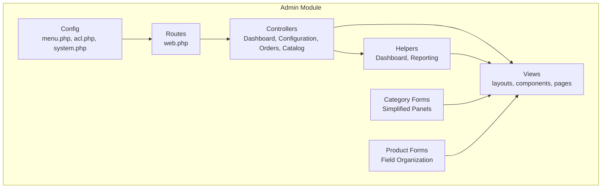

**Diagram sources**
- [menu.php:1-238](file://packages/Webkul/Admin/src/Config/menu.php#L1-L238)
- [acl.php:1-1000](file://packages/Webkul/Admin/src/Config/acl.php#L1-L1000)
- [system.php:1-800](file://packages/Webkul/Admin/src/Config/system.php#L1-L800)
- [web.php:1-67](file://packages/Webkul/Admin/src/Routes/web.php#L1-L67)
- [DashboardController.php:1-60](file://packages/Webkul/Admin/src/Http/Controllers/DashboardController.php#L1-L60)
- [ConfigurationController.php:1-112](file://packages/Webkul/Admin/src/Http/Controllers/ConfigurationController.php#L1-L112)
- [OrderController.php:1-267](file://packages/Webkul/Admin/src/Http/Controllers/Sales/OrderController.php#L1-L267)
- [Dashboard.php:1-161](file://packages/Webkul/Admin/src/Helpers/Dashboard.php#L1-L161)
- [Reporting.php:1-941](file://packages/Webkul/Admin/src/Helpers/Reporting.php#L1-L941)

**Section sources**
- [menu.php:1-238](file://packages/Webkul/Admin/src/Config/menu.php#L1-L238)
- [acl.php:1-1000](file://packages/Webkul/Admin/src/Config/acl.php#L1-L1000)
- [system.php:1-800](file://packages/Webkul/Admin/src/Config/system.php#L1-L800)
- [web.php:1-67](file://packages/Webkul/Admin/src/Routes/web.php#L1-L67)

## Core Components
- Navigation and sidebar: driven by menu configuration and rendered via a Blade sidebar component with collapsible behavior.
- Header and mega-search: provides quick access to products, orders, categories, and customers.
- Dashboard: aggregates overall, daily, and widgetized insights with filter controls.
- Configuration: centralized system configuration with categorized settings and dynamic fields.
- Sales and Orders: listing, creation from cart, viewing, cancellation, comments, and search.
- Reporting: sales, customers, and products analytics with graph/table modes.
- **Updated** Streamlined category management: simplified create/edit forms with focused field organization.
- **Updated** Enhanced product editing: improved field grouping and reduced interface complexity.

**Section sources**
- [sidebar/index.blade.php:1-124](file://packages/Webkul/Admin/src/Resources/views/components/layouts/sidebar/index.blade.php#L1-L124)
- [header/index.blade.php:1-772](file://packages/Webkul/Admin/src/Resources/views/components/layouts/header/index.blade.php#L1-L772)
- [DashboardController.php:1-60](file://packages/Webkul/Admin/src/Http/Controllers/DashboardController.php#L1-L60)
- [Dashboard.php:1-161](file://packages/Webkul/Admin/src/Helpers/Dashboard.php#L1-L161)
- [ConfigurationController.php:1-112](file://packages/Webkul/Admin/src/Http/Controllers/ConfigurationController.php#L1-L112)
- [system.php:1-800](file://packages/Webkul/Admin/src/Config/system.php#L1-L800)
- [OrderController.php:1-267](file://packages/Webkul/Admin/src/Http/Controllers/Sales/OrderController.php#L1-L267)
- [Reporting.php:1-941](file://packages/Webkul/Admin/src/Helpers/Reporting.php#L1-L941)

## Architecture Overview
The admin interface follows a layered MVC pattern:
- Routes define the admin group and load feature-specific route files.
- Controllers orchestrate requests, delegate to repositories/helpers, and render views.
- Views use Blade components for reusable UI parts (layout, sidebar, header, datagrids).
- Helpers encapsulate dashboard and reporting logic.
- Configuration files define navigation, permissions, and system settings.
- **Updated** Streamlined category and product forms utilize simplified panel structures with improved validation.

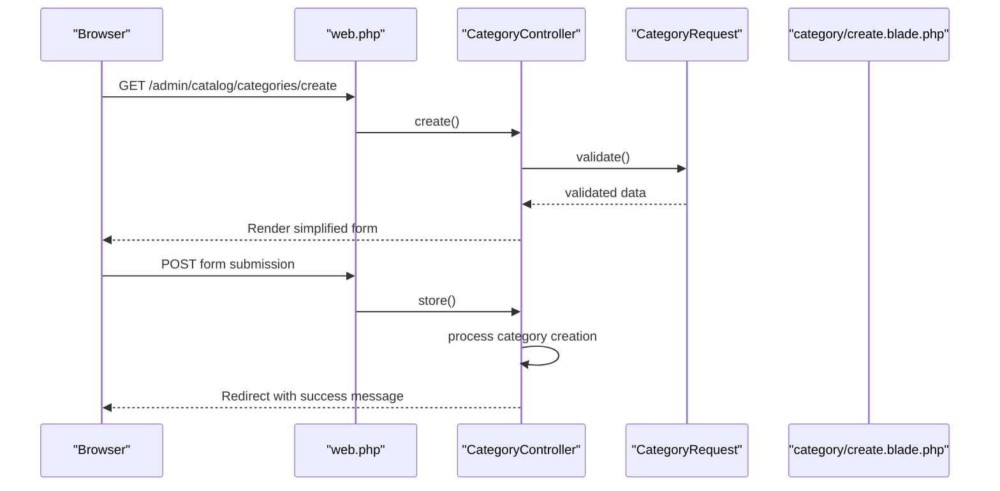

**Diagram sources**
- [web.php:1-67](file://packages/Webkul/Admin/src/Routes/web.php#L1-L67)
- [CategoryController.php:53-99](file://packages/Webkul/Admin/src/Http/Controllers/Catalog/CategoryController.php#L53-L99)
- [CategoryRequest.php:26-53](file://packages/Webkul/Admin/src/Http/Requests/CategoryRequest.php#L26-L53)
- [create.blade.php:48-142](file://packages/Webkul/Admin/src/Resources/views/catalog/categories/create.blade.php#L48-L142)

## Detailed Component Analysis

### Navigation and Permissions
- Menu configuration defines top-level sections (Dashboard, Sales, Catalog, Customers, Storefront, Reporting, Settings, Configuration) with nested items, icons, and sort order.
- ACL configuration defines granular permissions per section and actions (create, view, edit, delete), enabling role-based access control.

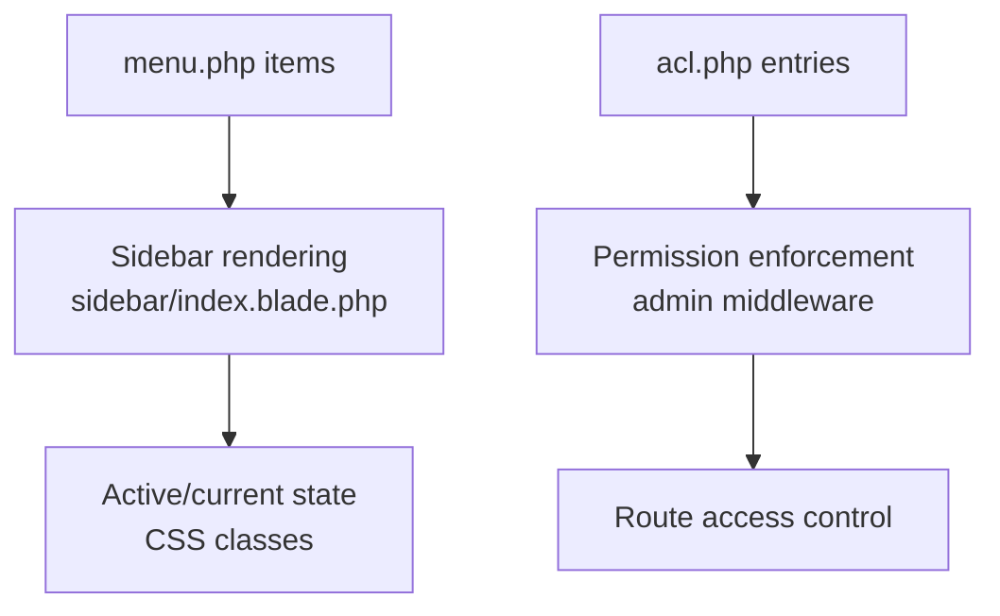

**Diagram sources**
- [menu.php:1-238](file://packages/Webkul/Admin/src/Config/menu.php#L1-L238)
- [sidebar/index.blade.php:1-124](file://packages/Webkul/Admin/src/Resources/views/components/layouts/sidebar/index.blade.php#L1-L124)
- [acl.php:1-1000](file://packages/Webkul/Admin/src/Config/acl.php#L1-L1000)

**Section sources**
- [menu.php:1-238](file://packages/Webkul/Admin/src/Config/menu.php#L1-L238)
- [acl.php:1-1000](file://packages/Webkul/Admin/src/Config/acl.php#L1-L1000)
- [sidebar/index.blade.php:1-124](file://packages/Webkul/Admin/src/Resources/views/components/layouts/sidebar/index.blade.php#L1-L124)

### Dashboard and Widgets
- DashboardController exposes index and stats endpoints. Stats types include overall, today, stock threshold, total sales, top selling products, and top customers.
- Dashboard helper computes KPIs and prepares data for widgets.
- The dashboard view composes widgets and provides date-range and channel filters.

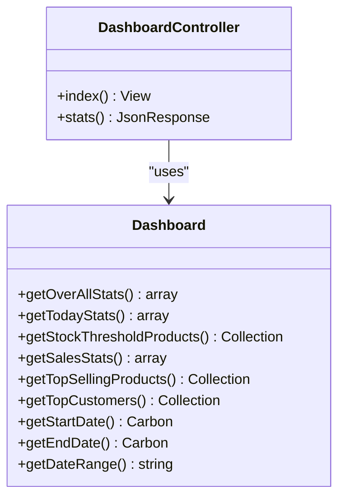

**Diagram sources**
- [DashboardController.php:9-59](file://packages/Webkul/Admin/src/Http/Controllers/DashboardController.php#L9-L59)
- [Dashboard.php:12-161](file://packages/Webkul/Admin/src/Helpers/Dashboard.php#L12-L161)

**Section sources**
- [DashboardController.php:1-60](file://packages/Webkul/Admin/src/Http/Controllers/DashboardController.php#L1-L60)
- [Dashboard.php:1-161](file://packages/Webkul/Admin/src/Helpers/Dashboard.php#L1-L161)
- [index.blade.php:1-193](file://packages/Webkul/Admin/src/Resources/views/dashboard/index.blade.php#L1-L193)

### Configuration Management
- ConfigurationController renders configuration pages, handles search, validates required payment/carrier setups, persists settings, and supports downloads.
- system.php defines configuration sections (General, Catalog, Sales, etc.) with fields and validation rules.
- **Updated** Design configuration now supports PNG favicon format with enhanced validation rules.

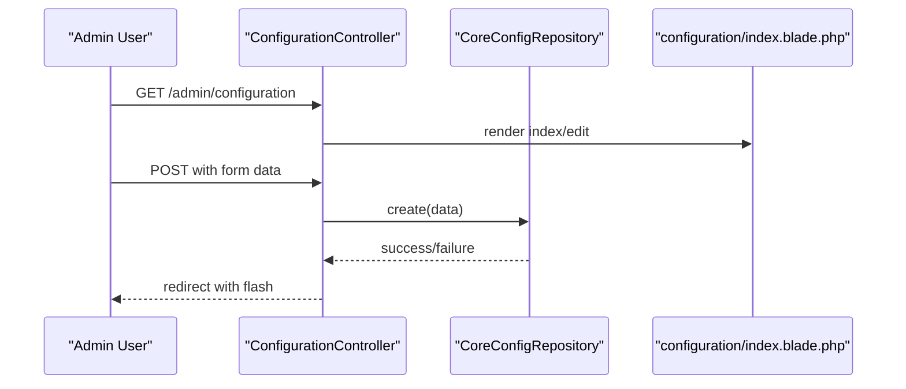

**Diagram sources**
- [ConfigurationController.php:23-96](file://packages/Webkul/Admin/src/Http/Controllers/ConfigurationController.php#L23-L96)
- [system.php:1-800](file://packages/Webkul/Admin/src/Config/system.php#L1-L800)

**Section sources**
- [ConfigurationController.php:1-112](file://packages/Webkul/Admin/src/Http/Controllers/ConfigurationController.php#L1-L112)
- [system.php:1-800](file://packages/Webkul/Admin/src/Config/system.php#L1-L800)

### Streamlined Category Management Interface
**Updated** The category management interface has been significantly simplified with streamlined forms and improved user experience.

- **Simplified Create Form**: The create form now uses a focused panel structure with essential fields only (name, slug, parent category, logo).
- **Reduced Complexity**: Hidden default values and simplified validation rules minimize form clutter.
- **Enhanced UX**: Clear field organization with required indicators and auto-generated slugs.

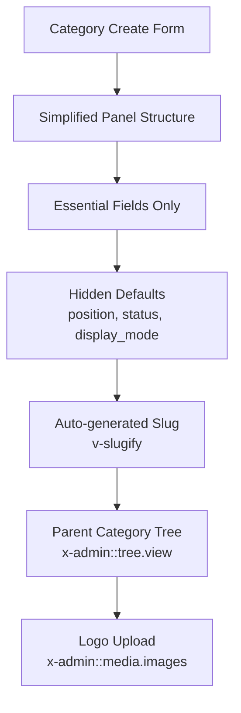

**Diagram sources**
- [create.blade.php:48-142](file://packages/Webkul/Admin/src/Resources/views/catalog/categories/create.blade.php#L48-L142)
- [CategoryController.php:53-59](file://packages/Webkul/Admin/src/Http/Controllers/Catalog/CategoryController.php#L53-L59)
- [CategoryRequest.php:26-53](file://packages/Webkul/Admin/src/Http/Requests/CategoryRequest.php#L26-L53)

**Section sources**
- [CategoryController.php:1-308](file://packages/Webkul/Admin/src/Http/Controllers/Catalog/CategoryController.php#L1-L308)
- [CategoryRequest.php:1-55](file://packages/Webkul/Admin/src/Http/Requests/CategoryRequest.php#L1-L55)
- [create.blade.php:1-151](file://packages/Webkul/Admin/src/Resources/views/catalog/categories/create.blade.php#L1-L151)
- [edit.blade.php:1-164](file://packages/Webkul/Admin/src/Resources/views/catalog/categories/edit.blade.php#L1-L164)

### Enhanced Product Editing Interface
**Updated** Product editing has been optimized with improved field organization and reduced interface complexity.

- **Field Organization**: Products are organized into logical groups (General, Price, Inventories, etc.) with conditional visibility based on product type.
- **Reduced Complexity**: Hidden attributes and simplified controls reduce cognitive load for administrators.
- **Type-specific Features**: Product type views are conditionally included based on the selected product type.

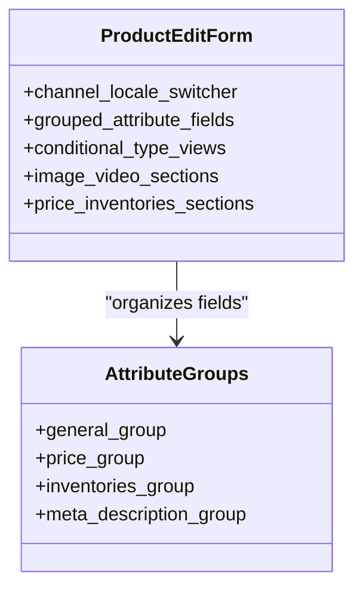

**Diagram sources**
- [edit.blade.php:145-306](file://packages/Webkul/Admin/src/Resources/views/catalog/products/edit.blade.php#L145-L306)
- [controls.blade.php:20-282](file://packages/Webkul/Admin/src/Resources/views/catalog/products/edit/controls.blade.php#L20-L282)

**Section sources**
- [ProductController.php:149-172](file://packages/Webkul/Admin/src/Http/Controllers/Catalog/ProductController.php#L149-L172)
- [edit.blade.php:1-315](file://packages/Webkul/Admin/src/Resources/views/catalog/products/edit.blade.php#L1-L315)
- [controls.blade.php:1-282](file://packages/Webkul/Admin/src/Resources/views/catalog/products/edit/controls.blade.php#L1-L282)

### Sales and Order Processing
- OrderController manages listing, creation from cart, viewing, cancellation, reordering, comments, and search.
- It validates minimum order amount, shipping/billing address presence, shipping method selection, and payment method support before order creation.

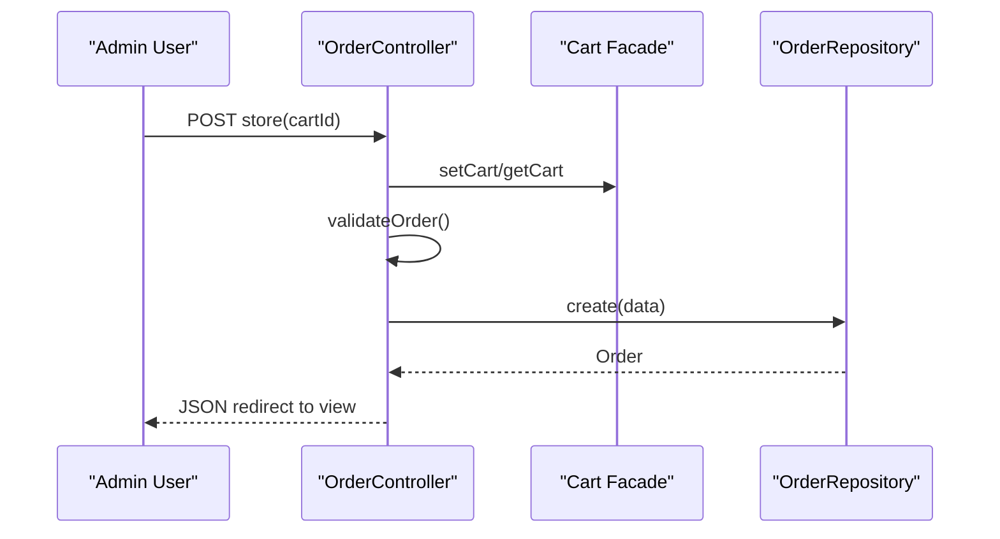

**Diagram sources**
- [OrderController.php:77-119](file://packages/Webkul/Admin/src/Http/Controllers/Sales/OrderController.php#L77-L119)
- [OrderController.php:234-265](file://packages/Webkul/Admin/src/Http/Controllers/Sales/OrderController.php#L234-L265)

**Section sources**
- [OrderController.php:1-267](file://packages/Webkul/Admin/src/Http/Controllers/Sales/OrderController.php#L1-L267)

### Administrative Reporting
- Reporting helper consolidates sales, customer, and product metrics, supporting graph/table modes and time-series data.
- Provides statistics such as total sales, average sales, total orders, purchase funnel, abandoned carts, refunds, tax collected, shipping collected, and top payment methods.

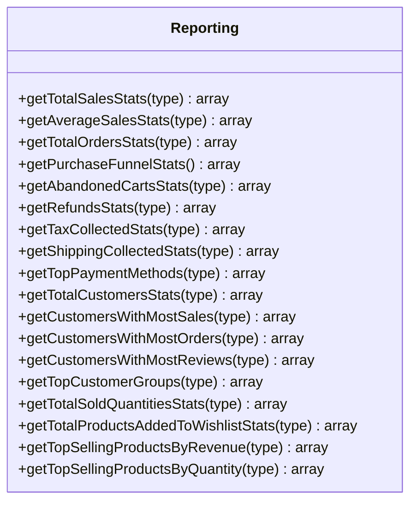

**Diagram sources**
- [Reporting.php:12-941](file://packages/Webkul/Admin/src/Helpers/Reporting.php#L12-L941)

**Section sources**
- [Reporting.php:1-941](file://packages/Webkul/Admin/src/Helpers/Reporting.php#L1-L941)

### Header Mega-Search and Layout
- Header component provides a responsive layout with dark mode toggle, visit shop link, and a powerful mega-search spanning products, orders, categories, and customers.
- Sidebar supports collapsing and adjusts sub-menu positions dynamically.
- **Updated** Layouts now reference PNG favicon for improved cross-browser compatibility.

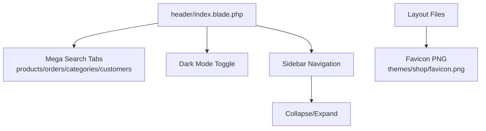

**Diagram sources**
- [header/index.blade.php:1-772](file://packages/Webkul/Admin/src/Resources/views/components/layouts/header/index.blade.php#L1-L772)
- [sidebar/index.blade.php:1-124](file://packages/Webkul/Admin/src/Resources/views/components/layouts/sidebar/index.blade.php#L1-L124)
- [index.blade.php:60-65](file://packages/Webkul/Admin/src/Resources/views/components/layouts/index.blade.php#L60-L65)

**Section sources**
- [header/index.blade.php:1-772](file://packages/Webkul/Admin/src/Resources/views/components/layouts/header/index.blade.php#L1-L772)
- [sidebar/index.blade.php:1-124](file://packages/Webkul/Admin/src/Resources/views/components/layouts/sidebar/index.blade.php#L1-L124)

## Dependency Analysis
- Controllers depend on repositories and helpers for data access and computation.
- Views rely on Blade components and Vue-like templates for interactivity.
- Routes group features and apply admin middleware for access control.
- Menu and ACL configurations drive navigation and permissions.
- **Updated** Streamlined category and product forms depend on simplified validation rules and focused field organization.
- **Updated** Product editing interface relies on attribute-based field organization with conditional visibility.

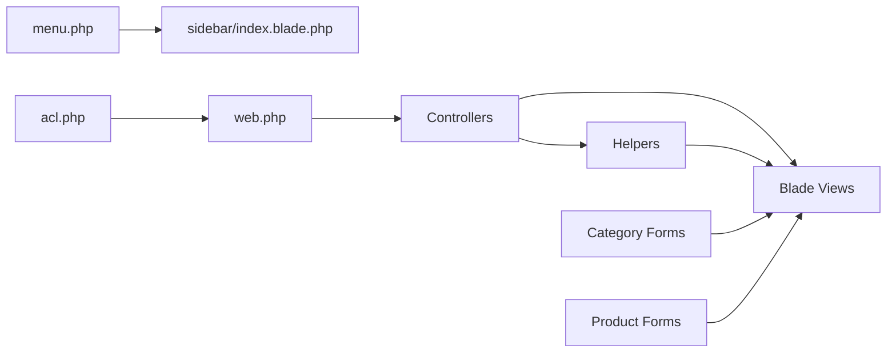

**Diagram sources**
- [menu.php:1-238](file://packages/Webkul/Admin/src/Config/menu.php#L1-L238)
- [acl.php:1-1000](file://packages/Webkul/Admin/src/Config/acl.php#L1-L1000)
- [web.php:1-67](file://packages/Webkul/Admin/src/Routes/web.php#L1-L67)

**Section sources**
- [web.php:1-67](file://packages/Webkul/Admin/src/Routes/web.php#L1-L67)
- [menu.php:1-238](file://packages/Webkul/Admin/src/Config/menu.php#L1-L238)
- [acl.php:1-1000](file://packages/Webkul/Admin/src/Config/acl.php#L1-L1000)

## Performance Considerations
- Use AJAX endpoints for dashboard widgets to avoid full-page reloads.
- Apply pagination and efficient queries in data grids and search endpoints.
- Minimize heavy computations in helpers; leverage caching where appropriate.
- Keep sidebar and header components lightweight; defer non-critical scripts.
- **Updated** Streamlined category and product forms reduce server-side processing and client-side complexity.
- **Updated** Simplified validation rules improve form processing performance.
- **Updated** Conditional field rendering reduces DOM complexity and improves page load times.

## Troubleshooting Guide
- Configuration validation: ensure at least one shipping carrier and one payment method are enabled before saving configuration.
- Order creation errors: verify minimum order amount, presence of shipping/billing addresses, selected shipping method, and supported payment method.
- Dashboard filters: ensure date range and channel filters are applied consistently across widget updates.
- **Updated** Category form validation: verify required fields (name, slug) and proper parent category selection.
- **Updated** Product form validation: check attribute-specific validation rules and type-specific requirements.
- **Updated** Streamlined forms: ensure hidden default values are properly handled during form submission.

**Section sources**
- [ConfigurationController.php:53-96](file://packages/Webkul/Admin/src/Http/Controllers/ConfigurationController.php#L53-L96)
- [OrderController.php:234-265](file://packages/Webkul/Admin/src/Http/Controllers/Sales/OrderController.php#L234-L265)
- [CategoryRequest.php:26-53](file://packages/Webkul/Admin/src/Http/Requests/CategoryRequest.php#L26-L53)
- [ProductForm.php:74-173](file://packages/Webkul/Admin/src/Http/Requests/ProductForm.php#L74-L173)

## Conclusion
Frooxi's admin interface is a modular, permission-driven system with a robust dashboard, comprehensive configuration management, and integrated reporting. Navigation is driven by configuration and ACLs, while controllers and helpers encapsulate business logic. The layout emphasizes usability with a responsive header, collapsible sidebar, and interactive widgets.

**Updated** The interface now features significantly streamlined category and product management forms with simplified panels, reduced complexity, and improved field organization. These enhancements maintain all necessary functionality while providing a cleaner, more efficient administrative experience. The category creation form focuses on essential fields with auto-generated slugs and simplified validation, while the product editing interface organizes attributes into logical groups with conditional visibility based on product type.

Proper configuration and validation ensure secure and reliable administrative operations with enhanced performance characteristics and improved user experience.