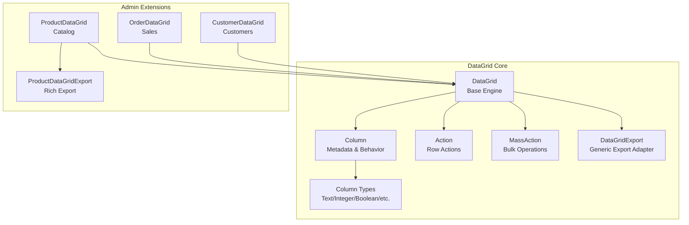
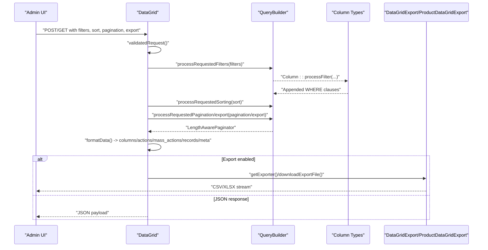
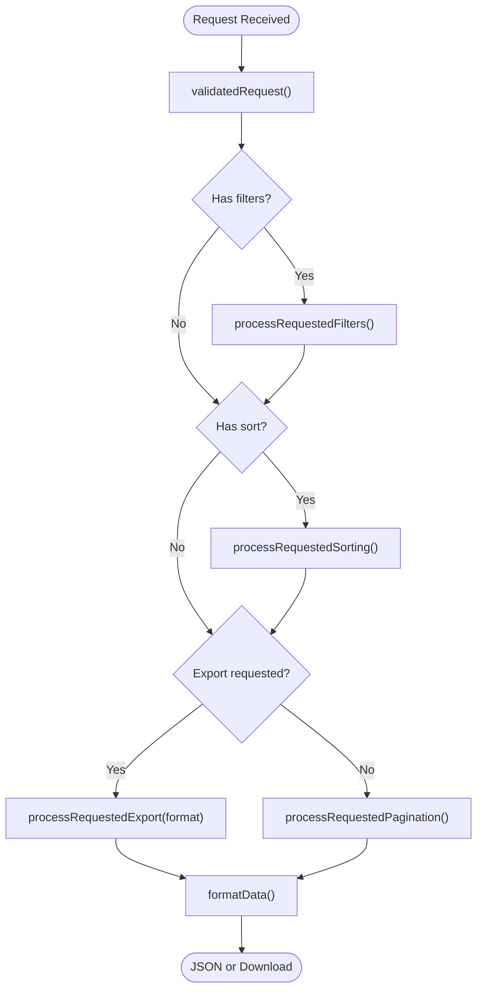
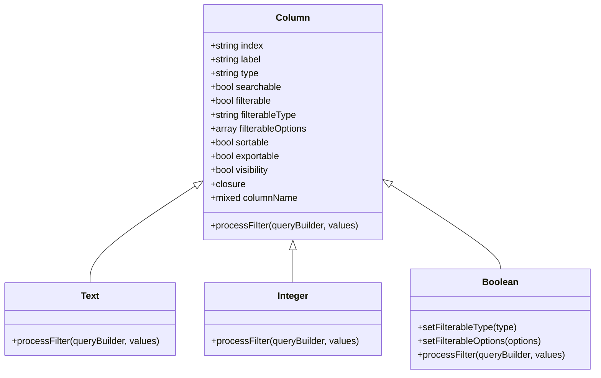
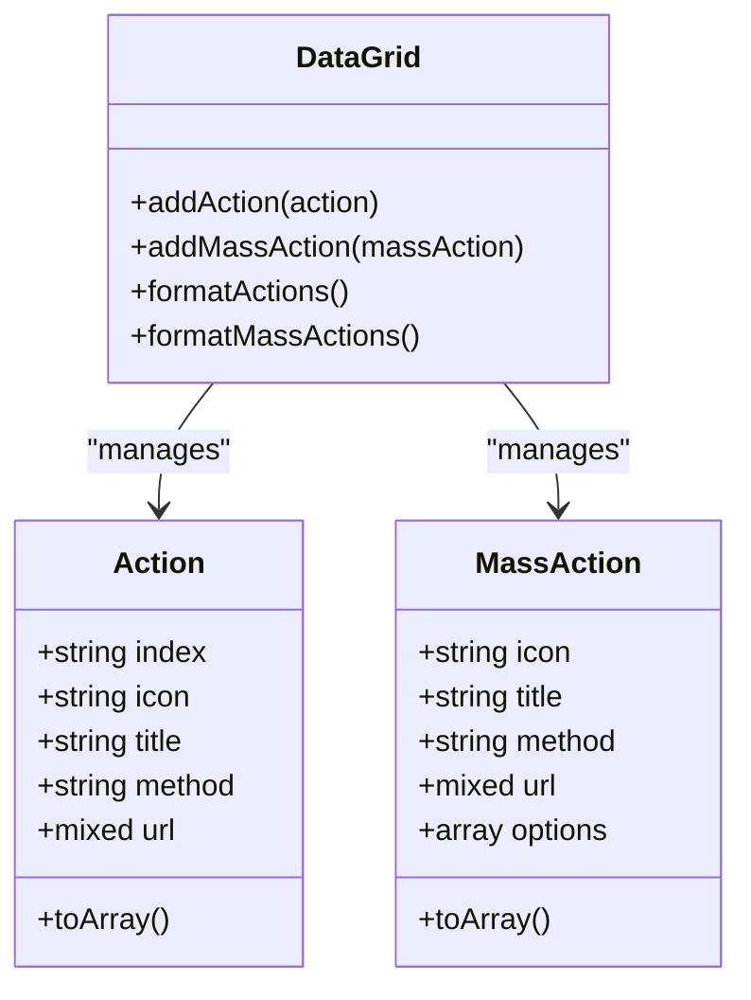
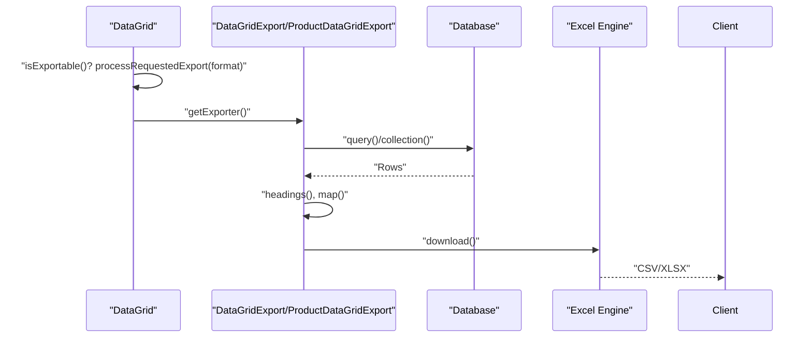
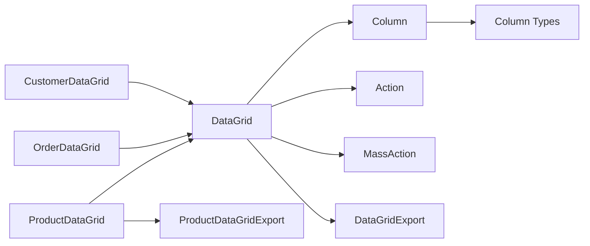

# Data Management Interfaces

<cite>
**Referenced Files in This Document**
- [packages/Webkul/DataGrid/src/DataGrid.php](file://packages/Webkul/DataGrid/src/DataGrid.php)
- [packages/Webkul/DataGrid/src/Column.php](file://packages/Webkul/DataGrid/src/Column.php)
- [packages/Webkul/DataGrid/src/Action.php](file://packages/Webkul/DataGrid/src/Action.php)
- [packages/Webkul/DataGrid/src/MassAction.php](file://packages/Webkul/DataGrid/src/MassAction.php)
- [packages/Webkul/DataGrid/src/Enums/ColumnTypeEnum.php](file://packages/Webkul/DataGrid/src/Enums/ColumnTypeEnum.php)
- [packages/Webkul/DataGrid/src/ColumnTypes/Text.php](file://packages/Webkul/DataGrid/src/ColumnTypes/Text.php)
- [packages/Webkul/DataGrid/src/ColumnTypes/Integer.php](file://packages/Webkul/DataGrid/src/ColumnTypes/Integer.php)
- [packages/Webkul/DataGrid/src/ColumnTypes/Boolean.php](file://packages/Webkul/DataGrid/src/ColumnTypes/Boolean.php)
- [packages/Webkul/DataGrid/src/Exports/DataGridExport.php](file://packages/Webkul/DataGrid/src/Exports/DataGridExport.php)
- [packages/Webkul/Admin/src/Exports/ProductDataGridExport.php](file://packages/Webkul/Admin/src/Exports/ProductDataGridExport.php)
- [packages/Webkul/Admin/src/DataGrids/Catalog/ProductDataGrid.php](file://packages/Webkul/Admin/src/DataGrids/Catalog/ProductDataGrid.php)
- [packages/Webkul/Admin/src/DataGrids/Sales/OrderDataGrid.php](file://packages/Webkul/Admin/src/DataGrids/Sales/OrderDataGrid.php)
- [packages/Webkul/Admin/src/DataGrids/Customers/CustomerDataGrid.php](file://packages/Webkul/Admin/src/DataGrids/Customers/CustomerDataGrid.php)
</cite>

## Table of Contents
1. [Introduction](#introduction)
2. [Project Structure](#project-structure)
3. [Core Components](#core-components)
4. [Architecture Overview](#architecture-overview)
5. [Detailed Component Analysis](#detailed-component-analysis)
6. [Dependency Analysis](#dependency-analysis)
7. [Performance Considerations](#performance-considerations)
8. [Troubleshooting Guide](#troubleshooting-guide)
9. [Conclusion](#conclusion)
10. [Appendices](#appendices)

## Introduction
This document explains the admin data management interfaces and data grids used across the administration panel. It covers the grid system architecture, filtering mechanisms, bulk operations, configuration, column definitions, export capabilities, saved filters, customization options, and performance optimizations. It also includes examples of custom grid creation, advanced filtering, and data manipulation workflows, along with pagination, sorting, and responsive design considerations.

## Project Structure
The data grid system is implemented in a reusable package and extended by admin-specific grids and exports:
- Core grid engine: DataGrid base class orchestrates preparation, filtering, sorting, pagination, and export.
- Column model and type system: Column defines metadata and behavior; ColumnType classes implement per-type filtering.
- Admin grids: Feature-specific grids define columns, actions, mass actions, and optional overrides for search/indexing.
- Exports: Generic export adapter and product-specific export that enriches rows with attributes and media.

**Diagram sources**
- [packages/Webkul/DataGrid/src/DataGrid.php:16-760](file://packages/Webkul/DataGrid/src/DataGrid.php#L16-L760)
- [packages/Webkul/DataGrid/src/Column.php:8-378](file://packages/Webkul/DataGrid/src/Column.php#L8-L378)
- [packages/Webkul/DataGrid/src/Enums/ColumnTypeEnum.php:14-67](file://packages/Webkul/DataGrid/src/Enums/ColumnTypeEnum.php#L14-L67)
- [packages/Webkul/Admin/src/DataGrids/Catalog/ProductDataGrid.php:15-458](file://packages/Webkul/Admin/src/DataGrids/Catalog/ProductDataGrid.php#L15-L458)
- [packages/Webkul/Admin/src/DataGrids/Sales/OrderDataGrid.php:12-234](file://packages/Webkul/Admin/src/DataGrids/Sales/OrderDataGrid.php#L12-L234)
- [packages/Webkul/Admin/src/DataGrids/Customers/CustomerDataGrid.php:12-259](file://packages/Webkul/Admin/src/DataGrids/Customers/CustomerDataGrid.php#L12-L259)
- [packages/Webkul/Admin/src/Exports/ProductDataGridExport.php:15-407](file://packages/Webkul/Admin/src/Exports/ProductDataGridExport.php#L15-L407)
- [packages/Webkul/DataGrid/src/Exports/DataGridExport.php:11-87](file://packages/Webkul/DataGrid/src/Exports/DataGridExport.php#L11-L87)

**Section sources**
- [packages/Webkul/DataGrid/src/DataGrid.php:16-760](file://packages/Webkul/DataGrid/src/DataGrid.php#L16-L760)
- [packages/Webkul/Admin/src/DataGrids/Catalog/ProductDataGrid.php:15-458](file://packages/Webkul/Admin/src/DataGrids/Catalog/ProductDataGrid.php#L15-L458)
- [packages/Webkul/Admin/src/DataGrids/Sales/OrderDataGrid.php:12-234](file://packages/Webkul/Admin/src/DataGrids/Sales/OrderDataGrid.php#L12-L234)
- [packages/Webkul/Admin/src/DataGrids/Customers/CustomerDataGrid.php:12-259](file://packages/Webkul/Admin/src/DataGrids/Customers/CustomerDataGrid.php#L12-L259)
- [packages/Webkul/Admin/src/Exports/ProductDataGridExport.php:15-407](file://packages/Webkul/Admin/src/Exports/ProductDataGridExport.php#L15-L407)
- [packages/Webkul/DataGrid/src/Exports/DataGridExport.php:11-87](file://packages/Webkul/DataGrid/src/Exports/DataGridExport.php#L11-L87)

## Core Components
- DataGrid: Orchestrates lifecycle, request validation, filtering, sorting, pagination/export, and response formatting. Provides hooks via events and exposes getters/setters for columns, actions, mass actions, and query builder.
- Column: Defines column metadata (index, label, type, searchable/filterable/sortable/exportable/visibility), supports closures for computed values, and resolves type-specific classes.
- Column Types: Implement per-type filtering logic (Text, Integer, Boolean) and enforce constraints (e.g., Boolean only supports dropdown).
- Actions and Mass Actions: Define row-level and bulk operations with icons, titles, HTTP methods, and URLs.
- Exports: Generic adapter exports visible columns; product export augments with attributes, images, and videos.

Key responsibilities:
- Request lifecycle: validatedRequest → processRequestedFilters → processRequestedSorting → processRequestedPagination/export → formatData
- Column resolution: ColumnTypeEnum maps type strings to classes; Column.validate ensures required keys; Column.resolveType constructs typed columns.
- Export pipeline: DataGrid.getExporter returns adapter; DataGrid.downloadExportFile triggers Excel download; ProductDataGridExport enriches rows.

**Section sources**
- [packages/Webkul/DataGrid/src/DataGrid.php:104-758](file://packages/Webkul/DataGrid/src/DataGrid.php#L104-L758)
- [packages/Webkul/DataGrid/src/Column.php:78-377](file://packages/Webkul/DataGrid/src/Column.php#L78-L377)
- [packages/Webkul/DataGrid/src/Enums/ColumnTypeEnum.php:14-67](file://packages/Webkul/DataGrid/src/Enums/ColumnTypeEnum.php#L14-L67)
- [packages/Webkul/DataGrid/src/ColumnTypes/Text.php:14-42](file://packages/Webkul/DataGrid/src/ColumnTypes/Text.php#L14-L42)
- [packages/Webkul/DataGrid/src/ColumnTypes/Integer.php:13-49](file://packages/Webkul/DataGrid/src/ColumnTypes/Integer.php#L13-L49)
- [packages/Webkul/DataGrid/src/ColumnTypes/Boolean.php:55-68](file://packages/Webkul/DataGrid/src/ColumnTypes/Boolean.php#L55-L68)
- [packages/Webkul/DataGrid/src/Action.php:13-34](file://packages/Webkul/DataGrid/src/Action.php#L13-L34)
- [packages/Webkul/DataGrid/src/MassAction.php:13-34](file://packages/Webkul/DataGrid/src/MassAction.php#L13-L34)
- [packages/Webkul/DataGrid/src/Exports/DataGridExport.php:23-86](file://packages/Webkul/DataGrid/src/Exports/DataGridExport.php#L23-L86)
- [packages/Webkul/Admin/src/Exports/ProductDataGridExport.php:70-172](file://packages/Webkul/Admin/src/Exports/ProductDataGridExport.php#L70-L172)

## Architecture Overview
The grid architecture follows a layered pattern:
- Base engine (DataGrid) handles request orchestration and response formatting.
- Column/type system encapsulates presentation and filtering logic.
- Admin grids override query building and optionally integrate external indexing.
- Exports adapt the query or enriched dataset to CSV/XLSX.

**Diagram sources**
- [packages/Webkul/DataGrid/src/DataGrid.php:447-582](file://packages/Webkul/DataGrid/src/DataGrid.php#L447-L582)
- [packages/Webkul/DataGrid/src/ColumnTypes/Text.php:14-42](file://packages/Webkul/DataGrid/src/ColumnTypes/Text.php#L14-L42)
- [packages/Webkul/DataGrid/src/ColumnTypes/Integer.php:13-49](file://packages/Webkul/DataGrid/src/ColumnTypes/Integer.php#L13-L49)
- [packages/Webkul/DataGrid/src/ColumnTypes/Boolean.php:55-68](file://packages/Webkul/DataGrid/src/ColumnTypes/Boolean.php#L55-L68)
- [packages/Webkul/DataGrid/src/Exports/DataGridExport.php:23-48](file://packages/Webkul/DataGrid/src/Exports/DataGridExport.php#L23-L48)
- [packages/Webkul/Admin/src/Exports/ProductDataGridExport.php:70-141](file://packages/Webkul/Admin/src/Exports/ProductDataGridExport.php#L70-L141)

## Detailed Component Analysis

### DataGrid Lifecycle and Request Processing
- Request validation enforces filters, sort, pagination, export flag, and format.
- Filters:
  - "all" wildcard searches across searchable, non-aggregate/boolean columns using LIKE.
  - Specific columns delegate to Column::processFilter via ColumnType classes.
- Sorting:
  - Uses configured default sort column/order unless overridden by request.
  - Only applies to sortable columns.
- Pagination vs Export:
  - If export=true, sets export mode and generates a temporary filename with chosen extension.
  - Otherwise paginates results.

**Diagram sources**
- [packages/Webkul/DataGrid/src/DataGrid.php:447-582](file://packages/Webkul/DataGrid/src/DataGrid.php#L447-L582)
- [packages/Webkul/DataGrid/src/DataGrid.php:465-539](file://packages/Webkul/DataGrid/src/DataGrid.php#L465-L539)
- [packages/Webkul/DataGrid/src/DataGrid.php:674-695](file://packages/Webkul/DataGrid/src/DataGrid.php#L674-L695)

**Section sources**
- [packages/Webkul/DataGrid/src/DataGrid.php:447-582](file://packages/Webkul/DataGrid/src/DataGrid.php#L447-L582)
- [packages/Webkul/DataGrid/src/DataGrid.php:674-695](file://packages/Webkul/DataGrid/src/DataGrid.php#L674-L695)

### Column Definitions and Type System
- Column metadata includes index, label, type, searchable/filterable/sortable/exportable/visibility, and optional closure for computed values.
- ColumnTypeEnum maps type strings to concrete ColumnType classes (Text, Integer, Boolean, Date/Datetime, Aggregate).
- ColumnType classes implement processFilter with type-aware logic:
  - Text: LIKE for strings; OR conditions for arrays; dropdown uses exact matches.
  - Integer: Supports operators (<, <=, >, >=, =) and ranges (-); falls back to equality.
  - Boolean: Enforces dropdown filter type and default options.

**Diagram sources**
- [packages/Webkul/DataGrid/src/Column.php:78-377](file://packages/Webkul/DataGrid/src/Column.php#L78-L377)
- [packages/Webkul/DataGrid/src/Enums/ColumnTypeEnum.php:14-67](file://packages/Webkul/DataGrid/src/Enums/ColumnTypeEnum.php#L14-L67)
- [packages/Webkul/DataGrid/src/ColumnTypes/Text.php:14-42](file://packages/Webkul/DataGrid/src/ColumnTypes/Text.php#L14-L42)
- [packages/Webkul/DataGrid/src/ColumnTypes/Integer.php:13-49](file://packages/Webkul/DataGrid/src/ColumnTypes/Integer.php#L13-L49)
- [packages/Webkul/DataGrid/src/ColumnTypes/Boolean.php:15-68](file://packages/Webkul/DataGrid/src/ColumnTypes/Boolean.php#L15-L68)

**Section sources**
- [packages/Webkul/DataGrid/src/Column.php:78-377](file://packages/Webkul/DataGrid/src/Column.php#L78-L377)
- [packages/Webkul/DataGrid/src/Enums/ColumnTypeEnum.php:14-67](file://packages/Webkul/DataGrid/src/Enums/ColumnTypeEnum.php#L14-L67)
- [packages/Webkul/DataGrid/src/ColumnTypes/Text.php:14-42](file://packages/Webkul/DataGrid/src/ColumnTypes/Text.php#L14-L42)
- [packages/Webkul/DataGrid/src/ColumnTypes/Integer.php:13-49](file://packages/Webkul/DataGrid/src/ColumnTypes/Integer.php#L13-L49)
- [packages/Webkul/DataGrid/src/ColumnTypes/Boolean.php:15-68](file://packages/Webkul/DataGrid/src/ColumnTypes/Boolean.php#L15-L68)

### Actions and Bulk Operations
- Actions: Row-level operations (e.g., edit, view, copy) with icon, title, HTTP method, and URL generator.
- Mass Actions: Bulk operations (e.g., delete, update status) with options for selection values.
- Both are formatted into the response payload and rendered by the UI.

**Diagram sources**
- [packages/Webkul/DataGrid/src/Action.php:13-34](file://packages/Webkul/DataGrid/src/Action.php#L13-L34)
- [packages/Webkul/DataGrid/src/MassAction.php:13-34](file://packages/Webkul/DataGrid/src/MassAction.php#L13-L34)
- [packages/Webkul/DataGrid/src/DataGrid.php:240-295](file://packages/Webkul/DataGrid/src/DataGrid.php#L240-L295)
- [packages/Webkul/DataGrid/src/DataGrid.php:622-637](file://packages/Webkul/DataGrid/src/DataGrid.php#L622-L637)

**Section sources**
- [packages/Webkul/DataGrid/src/Action.php:13-34](file://packages/Webkul/DataGrid/src/Action.php#L13-L34)
- [packages/Webkul/DataGrid/src/MassAction.php:13-34](file://packages/Webkul/DataGrid/src/MassAction.php#L13-L34)
- [packages/Webkul/DataGrid/src/DataGrid.php:240-295](file://packages/Webkul/DataGrid/src/DataGrid.php#L240-L295)
- [packages/Webkul/DataGrid/src/DataGrid.php:622-637](file://packages/Webkul/DataGrid/src/DataGrid.php#L622-L637)

### Export Functionality
- Generic export: DataGridExport maps visible columns to headings and values, sanitizing potential formula injections.
- Product export: ProductDataGridExport enriches rows with attributes from the product’s attribute family, images, and videos, ensuring consistent ordering and locale/channel context.

**Diagram sources**
- [packages/Webkul/DataGrid/src/DataGrid.php:392-413](file://packages/Webkul/DataGrid/src/DataGrid.php#L392-L413)
- [packages/Webkul/DataGrid/src/Exports/DataGridExport.php:23-48](file://packages/Webkul/DataGrid/src/Exports/DataGridExport.php#L23-L48)
- [packages/Webkul/Admin/src/Exports/ProductDataGridExport.php:70-141](file://packages/Webkul/Admin/src/Exports/ProductDataGridExport.php#L70-L141)

**Section sources**
- [packages/Webkul/DataGrid/src/Exports/DataGridExport.php:23-86](file://packages/Webkul/DataGrid/src/Exports/DataGridExport.php#L23-L86)
- [packages/Webkul/Admin/src/Exports/ProductDataGridExport.php:70-172](file://packages/Webkul/Admin/src/Exports/ProductDataGridExport.php#L70-L172)

### Saved Filters System
- The grid does not implement a dedicated persisted “saved filters” store in the referenced code. Filtering is driven by the current request payload and column definitions.
- Recommended approach: Persist user-selected filters server-side and hydrate them into the request payload before invoking the grid’s process() method.

[No sources needed since this section provides general guidance]

### Grid Customization Options
- Columns: Visibility, exportability, searchable, sortable, filterable, filterable_type/options, and closures for computed values.
- Actions and Mass Actions: Icons, titles, methods, URLs, and options for bulk selections.
- Query Builder: Override prepareQueryBuilder() to join tables, aggregates, and locale/channel scoping.
- Export: Override getExporter() to supply a richer export adapter.

**Section sources**
- [packages/Webkul/DataGrid/src/Column.php:78-377](file://packages/Webkul/DataGrid/src/Column.php#L78-L377)
- [packages/Webkul/Admin/src/DataGrids/Catalog/ProductDataGrid.php:36-83](file://packages/Webkul/Admin/src/DataGrids/Catalog/ProductDataGrid.php#L36-L83)
- [packages/Webkul/Admin/src/DataGrids/Catalog/ProductDataGrid.php:283-286](file://packages/Webkul/Admin/src/DataGrids/Catalog/ProductDataGrid.php#L283-L286)

### Examples of Custom Grid Creation
- Product grid:
  - Adds joins for inventory, images, categories, and attribute families.
  - Defines columns with filterable/dropdown options and closures for computed values (e.g., image URL, revenue).
  - Implements actions (copy/edit) and mass actions (delete/update status).
  - Overrides processRequest() to integrate Elasticsearch when configured.
- Order grid:
  - Builds aggregated columns (payment methods, customer location).
  - Adds status labels via closure and date range filtering.
- Customer grid:
  - Aggregates counts for orders and addresses.
  - Adds boolean filters and dropdowns for groups and channels.

**Section sources**
- [packages/Webkul/Admin/src/DataGrids/Catalog/ProductDataGrid.php:36-209](file://packages/Webkul/Admin/src/DataGrids/Catalog/ProductDataGrid.php#L36-L209)
- [packages/Webkul/Admin/src/DataGrids/Catalog/ProductDataGrid.php:216-278](file://packages/Webkul/Admin/src/DataGrids/Catalog/ProductDataGrid.php#L216-L278)
- [packages/Webkul/Admin/src/DataGrids/Catalog/ProductDataGrid.php:291-456](file://packages/Webkul/Admin/src/DataGrids/Catalog/ProductDataGrid.php#L291-L456)
- [packages/Webkul/Admin/src/DataGrids/Sales/OrderDataGrid.php:19-213](file://packages/Webkul/Admin/src/DataGrids/Sales/OrderDataGrid.php#L19-L213)
- [packages/Webkul/Admin/src/DataGrids/Customers/CustomerDataGrid.php:33-196](file://packages/Webkul/Admin/src/DataGrids/Customers/CustomerDataGrid.php#L33-L196)
- [packages/Webkul/Admin/src/DataGrids/Customers/CustomerDataGrid.php:203-257](file://packages/Webkul/Admin/src/DataGrids/Customers/CustomerDataGrid.php#L203-L257)

### Advanced Filtering Workflows
- Wildcard search: "all" requests apply LIKE across searchable columns (excluding boolean/aggregate).
- Dropdown filters: Use filterable_type dropdown with filterable_options to restrict values.
- Range and operator filters: Integer type supports comparison operators and ranges.
- Boolean filters: Enforced to use dropdown with true/false options.

**Section sources**
- [packages/Webkul/DataGrid/src/DataGrid.php:465-489](file://packages/Webkul/DataGrid/src/DataGrid.php#L465-L489)
- [packages/Webkul/DataGrid/src/ColumnTypes/Text.php:14-42](file://packages/Webkul/DataGrid/src/ColumnTypes/Text.php#L14-L42)
- [packages/Webkul/DataGrid/src/ColumnTypes/Integer.php:13-49](file://packages/Webkul/DataGrid/src/ColumnTypes/Integer.php#L13-L49)
- [packages/Webkul/DataGrid/src/ColumnTypes/Boolean.php:15-50](file://packages/Webkul/DataGrid/src/ColumnTypes/Boolean.php#L15-L50)

### Data Manipulation Workflows
- Actions: Row-level operations (view, edit, copy) with method and URL generation.
- Mass Actions: Bulk updates/deletes with selectable options (e.g., status toggles).
- Export: Download filtered datasets in CSV/XLSX; product export includes attributes/media.

**Section sources**
- [packages/Webkul/Admin/src/DataGrids/Catalog/ProductDataGrid.php:216-278](file://packages/Webkul/Admin/src/DataGrids/Catalog/ProductDataGrid.php#L216-L278)
- [packages/Webkul/Admin/src/DataGrids/Sales/OrderDataGrid.php:220-232](file://packages/Webkul/Admin/src/DataGrids/Sales/OrderDataGrid.php#L220-L232)
- [packages/Webkul/Admin/src/DataGrids/Customers/CustomerDataGrid.php:203-257](file://packages/Webkul/Admin/src/DataGrids/Customers/CustomerDataGrid.php#L203-L257)
- [packages/Webkul/Admin/src/Exports/ProductDataGridExport.php:70-141](file://packages/Webkul/Admin/src/Exports/ProductDataGridExport.php#L70-L141)

### Pagination, Sorting, and Responsive Design
- Pagination: Uses Laravel’s LengthAwarePaginator with configurable per-page options and page number.
- Sorting: Applies ORDER BY on primary or requested sortable column with ASC/DESC.
- Responsive design: The grid’s meta includes per_page_options and pagination info; UI adapts to viewport and screen size.

**Section sources**
- [packages/Webkul/DataGrid/src/DataGrid.php:527-539](file://packages/Webkul/DataGrid/src/DataGrid.php#L527-L539)
- [packages/Webkul/DataGrid/src/DataGrid.php:496-522](file://packages/Webkul/DataGrid/src/DataGrid.php#L496-L522)
- [packages/Webkul/DataGrid/src/DataGrid.php:684-694](file://packages/Webkul/DataGrid/src/DataGrid.php#L684-L694)

## Dependency Analysis
- DataGrid depends on:
  - Illuminate Query Builder and Paginator.
  - Maatwebsite Excel for exports.
  - ColumnTypeEnum and ColumnType classes for filtering.
  - Admin-specific grids and exports for domain logic.
- Admin grids depend on repositories and models for dynamic options and computed values.

**Diagram sources**
- [packages/Webkul/DataGrid/src/DataGrid.php:1-15](file://packages/Webkul/DataGrid/src/DataGrid.php#L1-L15)
- [packages/Webkul/DataGrid/src/Column.php:1-8](file://packages/Webkul/DataGrid/src/Column.php#L1-L8)
- [packages/Webkul/Admin/src/DataGrids/Catalog/ProductDataGrid.php:15-29](file://packages/Webkul/Admin/src/DataGrids/Catalog/ProductDataGrid.php#L15-L29)
- [packages/Webkul/Admin/src/DataGrids/Sales/OrderDataGrid.php:12-20](file://packages/Webkul/Admin/src/DataGrids/Sales/OrderDataGrid.php#L12-L20)
- [packages/Webkul/Admin/src/DataGrids/Customers/CustomerDataGrid.php:12-33](file://packages/Webkul/Admin/src/DataGrids/Customers/CustomerDataGrid.php#L12-L33)
- [packages/Webkul/Admin/src/Exports/ProductDataGridExport.php:15-63](file://packages/Webkul/Admin/src/Exports/ProductDataGridExport.php#L15-L63)

**Section sources**
- [packages/Webkul/DataGrid/src/DataGrid.php:1-15](file://packages/Webkul/DataGrid/src/DataGrid.php#L1-L15)
- [packages/Webkul/Admin/src/DataGrids/Catalog/ProductDataGrid.php:15-29](file://packages/Webkul/Admin/src/DataGrids/Catalog/ProductDataGrid.php#L15-L29)
- [packages/Webkul/Admin/src/DataGrids/Sales/OrderDataGrid.php:12-20](file://packages/Webkul/Admin/src/DataGrids/Sales/OrderDataGrid.php#L12-L20)
- [packages/Webkul/Admin/src/DataGrids/Customers/CustomerDataGrid.php:12-33](file://packages/Webkul/Admin/src/DataGrids/Customers/CustomerDataGrid.php#L12-L33)
- [packages/Webkul/Admin/src/Exports/ProductDataGridExport.php:15-63](file://packages/Webkul/Admin/src/Exports/ProductDataGridExport.php#L15-L63)

## Performance Considerations
- Prefer indexed columns in filters and joins to reduce query cost.
- Limit export scope by applying filters before triggering export.
- Use aggregation columns (e.g., SUM/COUNT) in the query builder to minimize post-processing overhead.
- For large catalogs, consider integrating external search (as seen in ProductDataGrid) to offload heavy filtering and sorting.
- Avoid exporting non-exportable columns to reduce memory and I/O during export.

[No sources needed since this section provides general guidance]

## Troubleshooting Guide
- Invalid column definition: Column validation throws exceptions if required keys (index, label, type) are missing.
- Invalid column expression: Type-specific exceptions occur when filter values are not supported (e.g., unexpected types for Text/Integer/Boolean).
- Export failures: Ensure exportable columns are properly configured and that the exporter is invoked with a valid query builder.

**Section sources**
- [packages/Webkul/DataGrid/src/Column.php:351-364](file://packages/Webkul/DataGrid/src/Column.php#L351-L364)
- [packages/Webkul/DataGrid/src/ColumnTypes/Text.php:25-39](file://packages/Webkul/DataGrid/src/ColumnTypes/Text.php#L25-L39)
- [packages/Webkul/DataGrid/src/ColumnTypes/Integer.php:23-48](file://packages/Webkul/DataGrid/src/ColumnTypes/Integer.php#L23-L48)
- [packages/Webkul/DataGrid/src/ColumnTypes/Boolean.php:21-26](file://packages/Webkul/DataGrid/src/ColumnTypes/Boolean.php#L21-L26)

## Conclusion
The data grid system provides a robust, extensible foundation for admin data management. Its modular design separates concerns between column metadata, type-specific filtering, request orchestration, and export adapters. Admin grids leverage this infrastructure to deliver rich, customizable interfaces with actions, mass operations, and advanced filtering. By following the patterns outlined here—defining columns, implementing type-aware filters, configuring actions/mass actions, and optimizing queries—teams can build performant and maintainable data grids tailored to their domains.

## Appendices
- Request payload fields:
  - filters: map of column index to values (supports "all" wildcard)
  - sort: { column, order }
  - pagination: { per_page, page }
  - export: boolean
  - format: csv/xls/xlsx

**Section sources**
- [packages/Webkul/DataGrid/src/DataGrid.php:449-455](file://packages/Webkul/DataGrid/src/DataGrid.php#L449-L455)