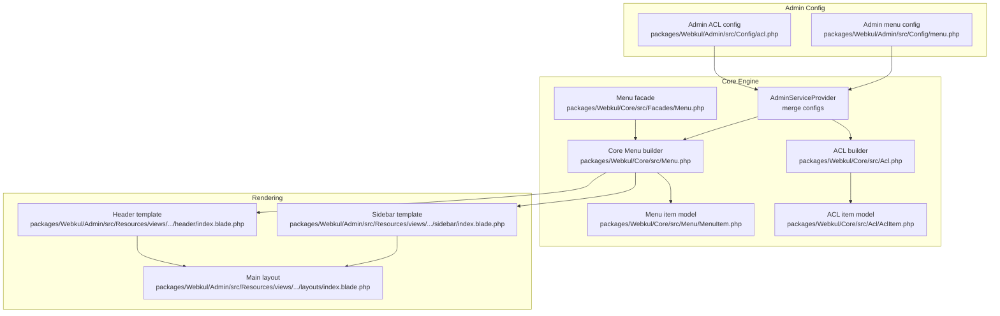
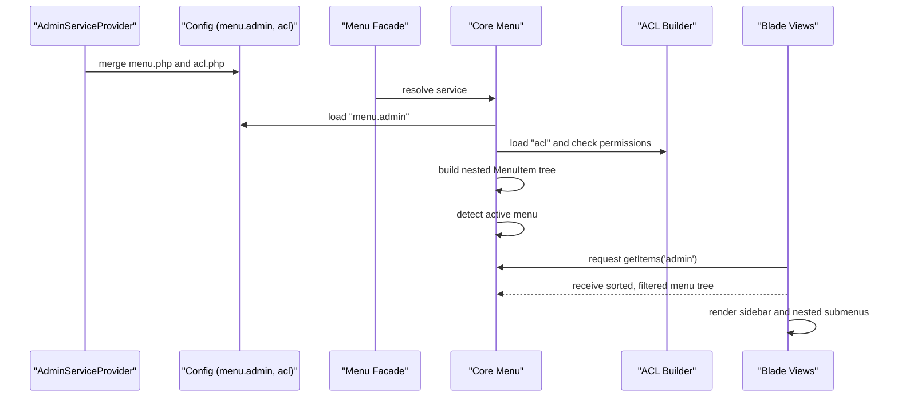
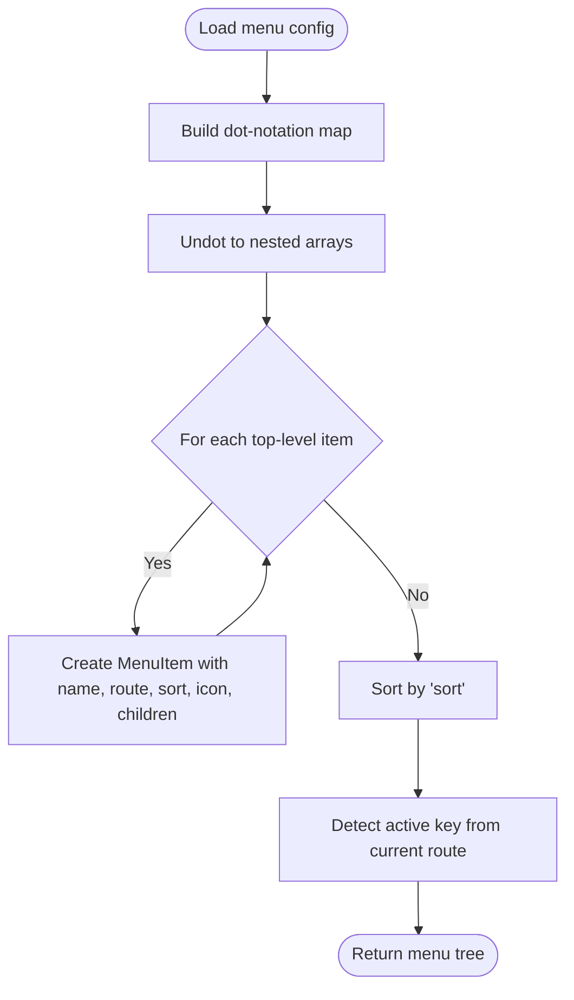
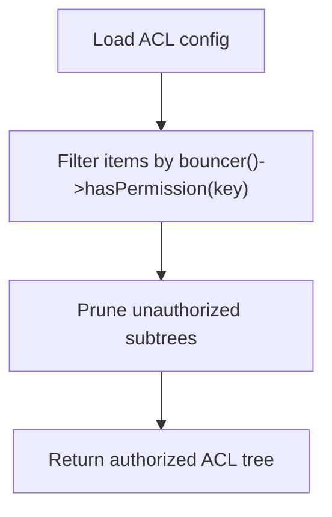
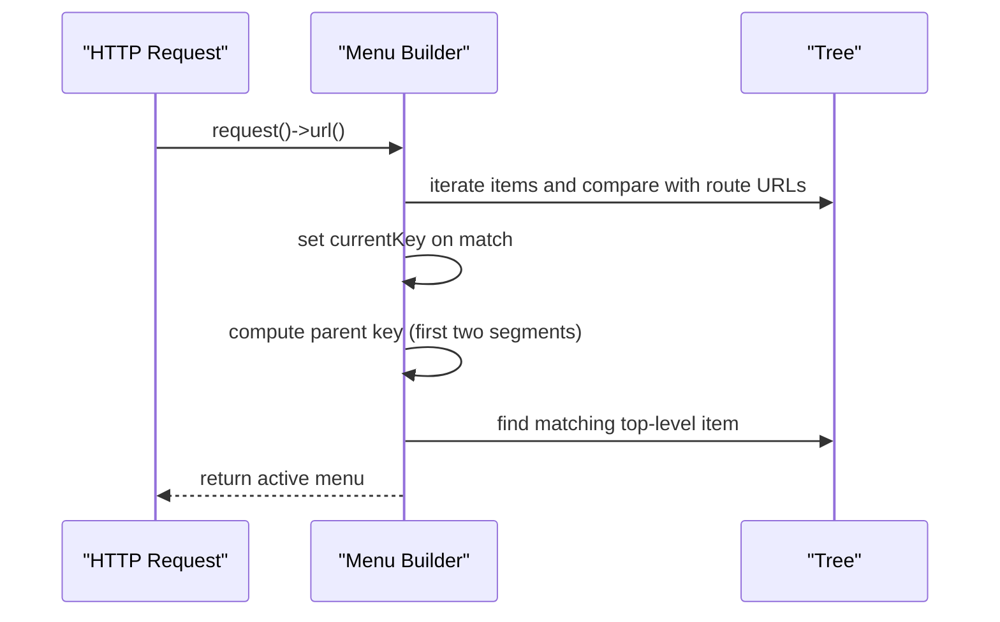
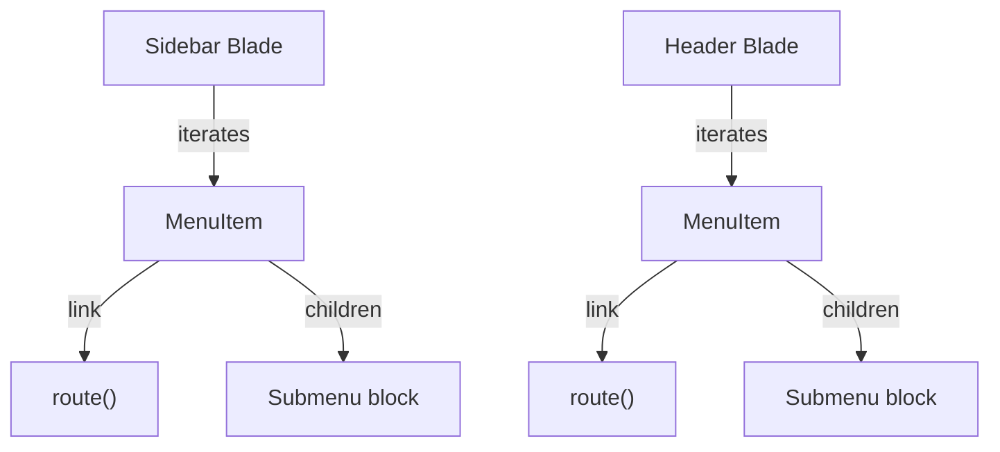
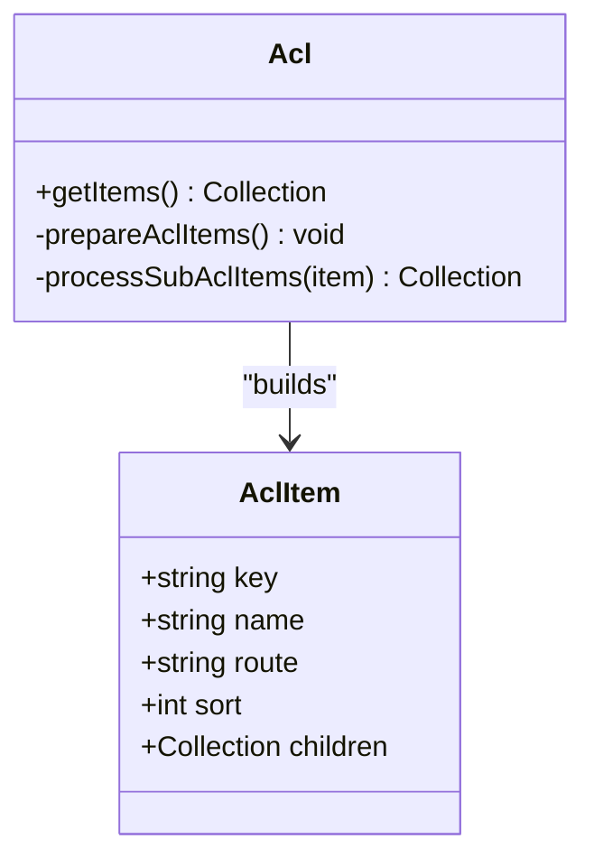
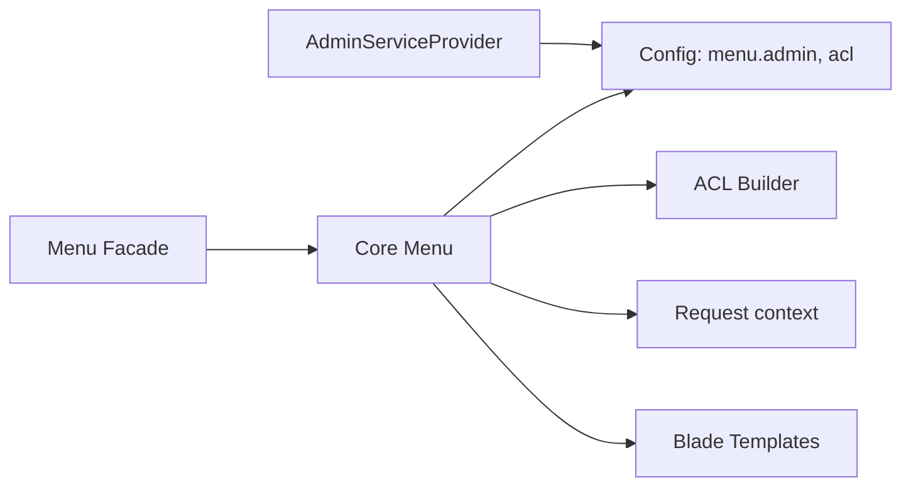

# Navigation & Menu System

<cite>
**Referenced Files in This Document**
- [menu.php](file://packages/Webkul/Admin/src/Config/menu.php)
- [acl.php](file://packages/Webkul/Admin/src/Config/acl.php)
- [AdminServiceProvider.php](file://packages/Webkul/Admin/src/Providers/AdminServiceProvider.php)
- [Menu.php](file://packages/Webkul/Core/src/Menu.php)
- [MenuItem.php](file://packages/Webkul/Core/src/Menu/MenuItem.php)
- [Acl.php](file://packages/Webkul/Core/src/Acl.php)
- [AclItem.php](file://packages/Webkul/Core/src/Acl/AclItem.php)
- [Facades/Menu.php](file://packages/Webkul/Core/src/Facades/Menu.php)
- [sidebar/index.blade.php](file://packages/Webkul/Admin/src/Resources/views/components/layouts/sidebar/index.blade.php)
- [header/index.blade.php](file://packages/Webkul/Admin/src/Resources/views/components/layouts/header/index.blade.php)
- [layouts/index.blade.php](file://packages/Webkul/Admin/src/Resources/views/components/layouts/index.blade.php)
</cite>

## Table of Contents
1. [Introduction](#introduction)
2. [Project Structure](#project-structure)
3. [Core Components](#core-components)
4. [Architecture Overview](#architecture-overview)
5. [Detailed Component Analysis](#detailed-component-analysis)
6. [Dependency Analysis](#dependency-analysis)
7. [Performance Considerations](#performance-considerations)
8. [Troubleshooting Guide](#troubleshooting-guide)
9. [Conclusion](#conclusion)
10. [Appendices](#appendices)

## Introduction
This document explains the admin navigation and menu system in the project. It covers the hierarchical menu structure, dynamic menu generation, ACL-based visibility, configuration and customization options, styling and responsiveness, and accessibility features. The system is built around a configuration-driven menu definition, a runtime menu builder, ACL enforcement, and Blade-based rendering.

## Project Structure
The admin menu system spans three main areas:
- Configuration: Admin-side menu and ACL definitions
- Core engine: Menu builder and ACL model
- Rendering: Blade templates for sidebar and header menus

**Diagram sources**
- [AdminServiceProvider.php:39-55](file://packages/Webkul/Admin/src/Providers/AdminServiceProvider.php#L39-L55)
- [menu.php:1-238](file://packages/Webkul/Admin/src/Config/menu.php#L1-L238)
- [acl.php:1-1000](file://packages/Webkul/Admin/src/Config/acl.php#L1-L1000)
- [Menu.php:1-197](file://packages/Webkul/Core/src/Menu.php#L1-L197)
- [MenuItem.php:1-103](file://packages/Webkul/Core/src/Menu/MenuItem.php#L1-L103)
- [Acl.php:1-117](file://packages/Webkul/Core/src/Acl.php#L1-L117)
- [AclItem.php:1-20](file://packages/Webkul/Core/src/Acl/AclItem.php#L1-L20)
- [Facades/Menu.php:1-20](file://packages/Webkul/Core/src/Facades/Menu.php#L1-L20)
- [sidebar/index.blade.php:1-21](file://packages/Webkul/Admin/src/Resources/views/components/layouts/sidebar/index.blade.php#L1-L21)
- [header/index.blade.php:171-188](file://packages/Webkul/Admin/src/Resources/views/components/layouts/header/index.blade.php#L171-L188)
- [layouts/index.blade.php:102-128](file://packages/Webkul/Admin/src/Resources/views/components/layouts/index.blade.php#L102-L128)

**Section sources**
- [AdminServiceProvider.php:39-55](file://packages/Webkul/Admin/src/Providers/AdminServiceProvider.php#L39-L55)
- [menu.php:1-238](file://packages/Webkul/Admin/src/Config/menu.php#L1-L238)
- [acl.php:1-1000](file://packages/Webkul/Admin/src/Config/acl.php#L1-L1000)
- [Menu.php:1-197](file://packages/Webkul/Core/src/Menu.php#L1-L197)
- [MenuItem.php:1-103](file://packages/Webkul/Core/src/Menu/MenuItem.php#L1-L103)
- [Acl.php:1-117](file://packages/Webkul/Core/src/Acl.php#L1-L117)
- [AclItem.php:1-20](file://packages/Webkul/Core/src/Acl/AclItem.php#L1-L20)
- [Facades/Menu.php:1-20](file://packages/Webkul/Core/src/Facades/Menu.php#L1-L20)
- [sidebar/index.blade.php:1-21](file://packages/Webkul/Admin/src/Resources/views/components/layouts/sidebar/index.blade.php#L1-L21)
- [header/index.blade.php:171-188](file://packages/Webkul/Admin/src/Resources/views/components/layouts/header/index.blade.php#L171-L188)
- [layouts/index.blade.php:102-128](file://packages/Webkul/Admin/src/Resources/views/components/layouts/index.blade.php#L102-L128)

## Core Components
- Admin menu configuration defines top-level and nested items, icons, sort order, and routes.
- ACL configuration defines granular permissions per route/key.
- Core Menu builder loads config, filters by ACL for admin area, builds a tree, and exposes active state detection.
- Menu facade provides a simple accessor for menu items in templates.
- Blade templates render the sidebar and nested dropdowns with responsive and dark-mode styles.

Key responsibilities:
- menu.php: Hierarchical menu definition with parent-child grouping via dot notation keys.
- acl.php: Permission definitions aligned to routes and grouped under parent keys.
- Menu.php: Filters admin menu items by bouncer permission checks, builds nested MenuItem instances, detects active menu, and prunes unauthorized subtrees.
- MenuItem.php: Encapsulates a single menu node with name, route, icon, sort, and children.
- Acl.php and AclItem.php: Mirror the menu ACL structure for display and role management.
- Facades/Menu.php: Facade accessor for menu service.
- Blade templates: Render the sidebar and nested submenus with Tailwind-based styling and responsive behavior.

**Section sources**
- [menu.php:1-238](file://packages/Webkul/Admin/src/Config/menu.php#L1-L238)
- [acl.php:1-1000](file://packages/Webkul/Admin/src/Config/acl.php#L1-L1000)
- [Menu.php:47-84](file://packages/Webkul/Core/src/Menu.php#L47-L84)
- [Menu.php:89-137](file://packages/Webkul/Core/src/Menu.php#L89-L137)
- [Menu.php:142-169](file://packages/Webkul/Core/src/Menu.php#L142-L169)
- [Menu.php:174-195](file://packages/Webkul/Core/src/Menu.php#L174-L195)
- [MenuItem.php:14-21](file://packages/Webkul/Core/src/Menu/MenuItem.php#L14-L21)
- [MenuItem.php:84-101](file://packages/Webkul/Core/src/Menu/MenuItem.php#L84-L101)
- [Acl.php:27-35](file://packages/Webkul/Core/src/Acl.php#L27-L35)
- [Acl.php:73-94](file://packages/Webkul/Core/src/Acl.php#L73-L94)
- [Acl.php:99-115](file://packages/Webkul/Core/src/Acl.php#L99-L115)
- [Facades/Menu.php:8-19](file://packages/Webkul/Core/src/Facades/Menu.php#L8-L19)

## Architecture Overview
The admin menu pipeline:
1. AdminServiceProvider merges menu and ACL configs into the application config.
2. The Menu facade resolves the core Menu service.
3. Menu builder reads the admin menu config, filters by ACL permissions, builds a nested MenuItem tree, sorts by configured order, and marks active items.
4. Blade templates render the sidebar and nested submenus, applying responsive and dark-mode styles.

**Diagram sources**
- [AdminServiceProvider.php:41-49](file://packages/Webkul/Admin/src/Providers/AdminServiceProvider.php#L41-L49)
- [Facades/Menu.php:15-18](file://packages/Webkul/Core/src/Facades/Menu.php#L15-L18)
- [Menu.php:53-84](file://packages/Webkul/Core/src/Menu.php#L53-L84)
- [Acl.php:48-51](file://packages/Webkul/Core/src/Acl.php#L48-L51)
- [sidebar/index.blade.php:5-21](file://packages/Webkul/Admin/src/Resources/views/components/layouts/sidebar/index.blade.php#L5-L21)
- [header/index.blade.php:171-188](file://packages/Webkul/Admin/src/Resources/views/components/layouts/header/index.blade.php#L171-L188)

## Detailed Component Analysis

### Menu Configuration and Hierarchy
- The admin menu is defined as a flat list with hierarchical intent via dot-delimited keys. Parent-child relationships are inferred by shared prefixes (e.g., a child key starts with parent.key + ".").
- Each item specifies:
  - key: Unique identifier and hierarchy anchor
  - name: Translatable label
  - route: Laravel route name
  - sort: Integer sort order
  - icon: Optional icon class
  - icon-class: Optional extra CSS class for styling
- The Menu builder converts the flat config into a nested tree and sets the first child’s route as the parent’s effective route for clickable parents.

**Diagram sources**
- [Menu.php:89-115](file://packages/Webkul/Core/src/Menu.php#L89-L115)
- [Menu.php:101-114](file://packages/Webkul/Core/src/Menu.php#L101-L114)

**Section sources**
- [menu.php:3-238](file://packages/Webkul/Admin/src/Config/menu.php#L3-L238)
- [Menu.php:89-115](file://packages/Webkul/Core/src/Menu.php#L89-L115)
- [Menu.php:101-114](file://packages/Webkul/Core/src/Menu.php#L101-L114)

### ACL-Based Menu Visibility
- ACL definitions mirror the menu structure and are keyed similarly.
- For the admin area, the Menu builder filters visible items by checking bouncer permissions against each item’s key.
- Unavailable subtrees are pruned so only permitted branches appear.

**Diagram sources**
- [Menu.php:57-59](file://packages/Webkul/Core/src/Menu.php#L57-L59)
- [Menu.php:174-195](file://packages/Webkul/Core/src/Menu.php#L174-L195)

**Section sources**
- [acl.php:1-1000](file://packages/Webkul/Admin/src/Config/acl.php#L1-L1000)
- [Menu.php:57-59](file://packages/Webkul/Core/src/Menu.php#L57-L59)
- [Menu.php:174-195](file://packages/Webkul/Core/src/Menu.php#L174-L195)

### Dynamic Menu Generation and Active State
- The Menu builder determines the current active menu by matching the current request URL to item routes and walking up to the top-level parent.
- It also adjusts parent routes to the first child’s route to enable clicking on parent nodes.

**Diagram sources**
- [Menu.php:94-96](file://packages/Webkul/Core/src/Menu.php#L94-L96)
- [Menu.php:142-147](file://packages/Webkul/Core/src/Menu.php#L142-L147)

**Section sources**
- [Menu.php:94-96](file://packages/Webkul/Core/src/Menu.php#L94-L96)
- [Menu.php:142-147](file://packages/Webkul/Core/src/Menu.php#L142-L147)
- [Menu.php:191-194](file://packages/Webkul/Core/src/Menu.php#L191-L194)

### Rendering the Sidebar and Nested Menus
- The sidebar template iterates over menu items, renders the primary link with icon and label, and conditionally renders nested submenus.
- The header template provides a secondary navigation drawer with similar nested rendering.
- Responsive behavior is handled via Tailwind utility classes and a container-level cookie-driven class toggling collapsed state.

**Diagram sources**
- [sidebar/index.blade.php:5-21](file://packages/Webkul/Admin/src/Resources/views/components/layouts/sidebar/index.blade.php#L5-L21)
- [sidebar/index.blade.php:21-21](file://packages/Webkul/Admin/src/Resources/views/components/layouts/sidebar/index.blade.php#L21-L21)
- [header/index.blade.php:171-188](file://packages/Webkul/Admin/src/Resources/views/components/layouts/header/index.blade.php#L171-L188)

**Section sources**
- [sidebar/index.blade.php:1-21](file://packages/Webkul/Admin/src/Resources/views/components/layouts/sidebar/index.blade.php#L1-L21)
- [header/index.blade.php:171-188](file://packages/Webkul/Admin/src/Resources/views/components/layouts/header/index.blade.php#L171-L188)
- [layouts/index.blade.php:106-128](file://packages/Webkul/Admin/src/Resources/views/components/layouts/index.blade.php#L106-L128)

### Access Control List Implementation and Role Permissions
- ACL definitions are loaded from config and mirrored into a nested ACL tree.
- The Menu builder enforces permissions during menu retrieval for the admin area.
- The ACL builder exposes roles and permissions for administrative management.

**Diagram sources**
- [Acl.php:27-35](file://packages/Webkul/Core/src/Acl.php#L27-L35)
- [Acl.php:73-94](file://packages/Webkul/Core/src/Acl.php#L73-L94)
- [Acl.php:99-115](file://packages/Webkul/Core/src/Acl.php#L99-L115)
- [AclItem.php:12-18](file://packages/Webkul/Core/src/Acl/AclItem.php#L12-L18)

**Section sources**
- [acl.php:1-1000](file://packages/Webkul/Admin/src/Config/acl.php#L1-L1000)
- [Acl.php:27-35](file://packages/Webkul/Core/src/Acl.php#L27-L35)
- [Acl.php:73-94](file://packages/Webkul/Core/src/Acl.php#L73-L94)
- [Acl.php:99-115](file://packages/Webkul/Core/src/Acl.php#L99-L115)
- [AclItem.php:12-18](file://packages/Webkul/Core/src/Acl/AclItem.php#L12-L18)

### Security Integration
- Menu visibility is enforced at render-time by checking bouncer permissions against item keys.
- Unauthorized subtrees are pruned to prevent accidental exposure of nested links.
- The active menu detection prefers the top-level parent to reflect the current section accurately.

**Section sources**
- [Menu.php:57-59](file://packages/Webkul/Core/src/Menu.php#L57-L59)
- [Menu.php:174-195](file://packages/Webkul/Core/src/Menu.php#L174-L195)
- [Menu.php:142-147](file://packages/Webkul/Core/src/Menu.php#L142-L147)

### Menu Styling, Responsive Behavior, and Accessibility
- Styling uses Tailwind utility classes for spacing, colors, hover effects, and dark mode variants.
- Responsive behavior leverages:
  - Hidden states on small screens
  - Collapsible sidebar controlled by a cookie-driven class on the container
  - Conditional text visibility inside icons when collapsed
- Accessibility considerations:
  - Links are focusable and keyboard navigable by default
  - Active states use color and background classes for visual focus
  - Icons are presentational; ensure screen reader-friendly labels via aria attributes if needed

**Section sources**
- [sidebar/index.blade.php:10-20](file://packages/Webkul/Admin/src/Resources/views/components/layouts/sidebar/index.blade.php#L10-L20)
- [sidebar/index.blade.php:16-18](file://packages/Webkul/Admin/src/Resources/views/components/layouts/sidebar/index.blade.php#L16-L18)
- [layouts/index.blade.php:106-128](file://packages/Webkul/Admin/src/Resources/views/components/layouts/index.blade.php#L106-L128)

## Dependency Analysis
- AdminServiceProvider merges menu and ACL configs into the application configuration namespace.
- Menu facade resolves the core Menu service.
- Menu builder depends on:
  - Config loader for menu.admin
  - ACL builder for permission checks
  - Request context for active state detection
- Blade templates depend on the Menu facade to fetch items and render nested structures.

**Diagram sources**
- [AdminServiceProvider.php:41-49](file://packages/Webkul/Admin/src/Providers/AdminServiceProvider.php#L41-L49)
- [Facades/Menu.php:15-18](file://packages/Webkul/Core/src/Facades/Menu.php#L15-L18)
- [Menu.php:53-84](file://packages/Webkul/Core/src/Menu.php#L53-L84)
- [Acl.php:48-51](file://packages/Webkul/Core/src/Acl.php#L48-L51)

**Section sources**
- [AdminServiceProvider.php:41-49](file://packages/Webkul/Admin/src/Providers/AdminServiceProvider.php#L41-L49)
- [Facades/Menu.php:15-18](file://packages/Webkul/Core/src/Facades/Menu.php#L15-L18)
- [Menu.php:53-84](file://packages/Webkul/Core/src/Menu.php#L53-L84)
- [Acl.php:48-51](file://packages/Webkul/Core/src/Acl.php#L48-L51)

## Performance Considerations
- Menu building occurs once per request and caches computed ACL roles internally.
- Filtering and sorting are linear in the number of menu items; keep the menu compact for large installations.
- Avoid excessive nesting to minimize recursive processing overhead.
- Use lazy evaluation via the Menu facade to defer work until templates require it.

## Troubleshooting Guide
Common issues and resolutions:
- Menu item does not appear:
  - Verify the item’s key exists in ACL and the current role has permission.
  - Confirm the key matches the ACL structure and the route name exists.
- Active state not highlighting:
  - Ensure the current route name matches the item or child route.
  - Check that the URL comparison logic aligns with actual routes.
- Submenu not rendering:
  - Confirm the child items share the correct parent key prefix.
  - Verify sort order and icon/name fields are properly set.
- Styling inconsistencies:
  - Check Tailwind classes applied conditionally for collapsed state and dark mode.
  - Ensure icon classes are correct and present.

**Section sources**
- [Menu.php:57-59](file://packages/Webkul/Core/src/Menu.php#L57-L59)
- [Menu.php:94-96](file://packages/Webkul/Core/src/Menu.php#L94-L96)
- [Menu.php:101-114](file://packages/Webkul/Core/src/Menu.php#L101-L114)
- [sidebar/index.blade.php:10-20](file://packages/Webkul/Admin/src/Resources/views/components/layouts/sidebar/index.blade.php#L10-L20)

## Conclusion
The admin navigation system combines a declarative configuration with a robust runtime builder and strict ACL enforcement. It supports hierarchical menus, dynamic filtering, responsive rendering, and clean separation of concerns. Administrators can customize menus and permissions through configuration files, while developers can extend rendering via Blade templates.

## Appendices

### Menu Configuration Reference
- Keys:
  - Top-level keys define major sections (e.g., dashboard, sales, catalog, customers, reporting, settings, configuration).
  - Child keys follow the pattern parent_key.child_key.
- Fields:
  - key: Unique identifier and hierarchy anchor
  - name: Translatable label
  - route: Laravel route name
  - sort: Integer sort order
  - icon: Icon class
  - icon-class: Additional CSS class for styling

Examples of top-level and child entries:
- Top-level: dashboard, sales, catalog, customers, storefront, reporting, settings, configuration
- Children: sales.orders, sales.shipments, sales.invoices, sales.refunds, sales.transactions; catalog.products, catalog.categories, catalog.attributes, catalog.families; customers.customers, customers.groups, customers.reviews; settings.locales, settings.currencies, settings.exchange_rates, settings.inventory_sources, settings.channels, settings.users, settings.roles, settings.themes

**Section sources**
- [menu.php:7-238](file://packages/Webkul/Admin/src/Config/menu.php#L7-L238)

### ACL Configuration Reference
- ACL items mirror menu keys and define permissions per route.
- Examples include granular permissions such as create, edit, delete, view for orders, invoices, shipments, refunds, products, categories, attributes, families, customers, groups, reviews, and settings.

**Section sources**
- [acl.php:13-1000](file://packages/Webkul/Admin/src/Config/acl.php#L13-L1000)

### Custom Navigation Creation and Management
- To add a new top-level section:
  - Define a new top-level item in the menu configuration with a unique key and route.
  - Add corresponding ACL entries under the same key.
- To add a submenu:
  - Define a child item whose key follows parent_key.child_key.
  - Ensure sort order is set appropriately.
- To hide a section from certain roles:
  - Remove or restrict the ACL key for that role.

**Section sources**
- [menu.php:3-238](file://packages/Webkul/Admin/src/Config/menu.php#L3-L238)
- [acl.php:1-1000](file://packages/Webkul/Admin/src/Config/acl.php#L1-L1000)