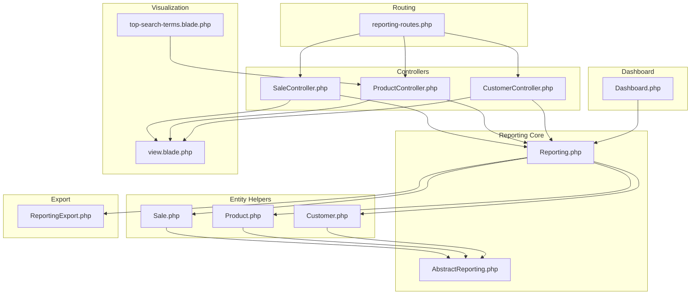
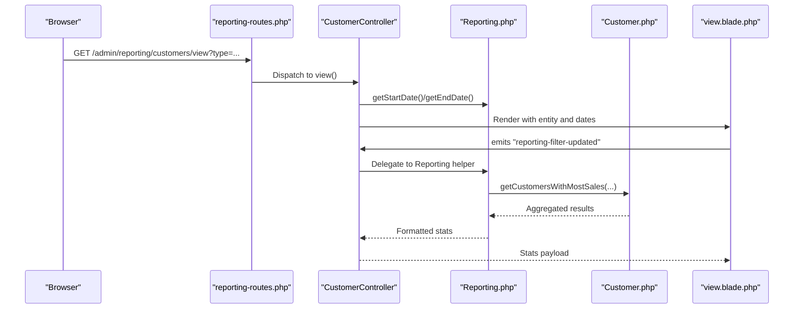
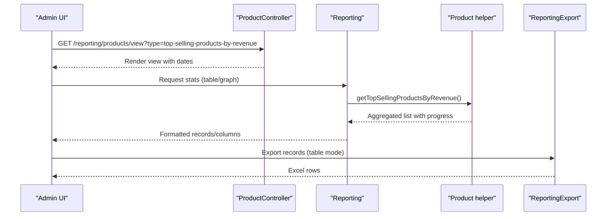
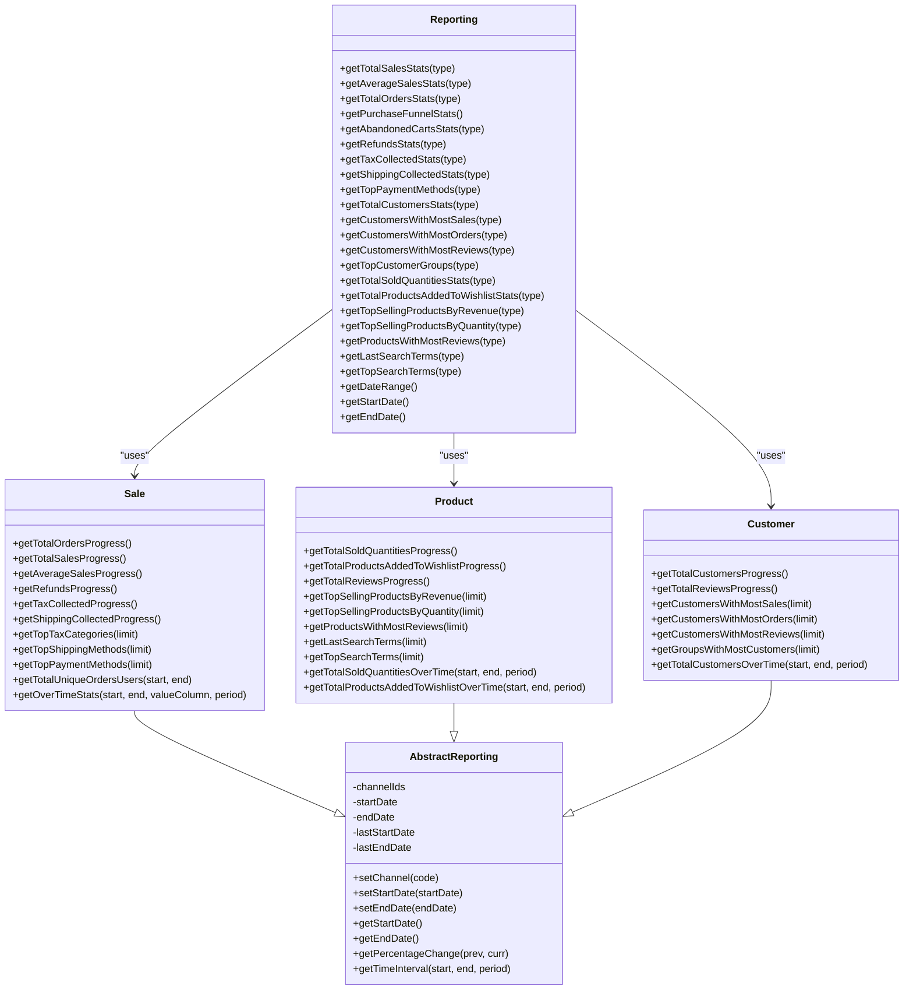

# Reporting & Analytics

<cite>
**Referenced Files in This Document**
- [reporting-routes.php](file://packages/Webkul/Admin/src/Routes/reporting-routes.php)
- [Reporting.php](file://packages/Webkul/Admin/src/Helpers/Reporting.php)
- [AbstractReporting.php](file://packages/Webkul/Admin/src/Helpers/Reporting/AbstractReporting.php)
- [Sale.php](file://packages/Webkul/Admin/src/Helpers/Reporting/Sale.php)
- [Product.php](file://packages/Webkul/Admin/src/Helpers/Reporting/Product.php)
- [Customer.php](file://packages/Webkul/Admin/src/Helpers/Reporting/Customer.php)
- [SaleController.php](file://packages/Webkul/Admin/src/Http/Controllers/Reporting/SaleController.php)
- [ProductController.php](file://packages/Webkul/Admin/src/Http/Controllers/Reporting/ProductController.php)
- [CustomerController.php](file://packages/Webkul/Admin/src/Http/Controllers/Reporting/CustomerController.php)
- [ReportingExport.php](file://packages/Webkul/Admin/src/Exports/ReportingExport.php)
- [Dashboard.php](file://packages/Webkul/Admin/src/Helpers/Dashboard.php)
- [view.blade.php](file://packages/Webkul/Admin/src/Resources/views/reporting/view.blade.php)
- [top-search-terms.blade.php](file://packages/Webkul/Admin/src/Resources/views/reporting/products/top-search-terms.blade.php)
</cite>

## Table of Contents
1. [Introduction](#introduction)
2. [Project Structure](#project-structure)
3. [Core Components](#core-components)
4. [Architecture Overview](#architecture-overview)
5. [Detailed Component Analysis](#detailed-component-analysis)
6. [Dependency Analysis](#dependency-analysis)
7. [Performance Considerations](#performance-considerations)
8. [Troubleshooting Guide](#troubleshooting-guide)
9. [Conclusion](#conclusion)
10. [Appendices](#appendices)

## Introduction
This document explains the admin reporting and analytics capabilities in the codebase. It covers the reporting framework, data aggregation mechanisms, and visualization components. It documents the available report types (sales, product analytics, customer insights), the report generation workflow, export functionality, and how dashboards integrate with the reporting system. It also outlines filtering, performance metrics calculation, and how the frontend consumes backend data.

## Project Structure
The reporting system is organized around:
- Routes that expose reporting endpoints per entity (sales, products, customers)
- Controllers that render views and orchestrate report retrieval
- A central Reporting helper that delegates to specialized reporting helpers
- Specialized helpers for Sales, Product, and Customer analytics
- Export functionality for tabular reports
- Dashboard integration for summary widgets

**Diagram sources**
- [reporting-routes.php:11-56](file://packages/Webkul/Admin/src/Routes/reporting-routes.php#L11-L56)
- [SaleController.php:31-55](file://packages/Webkul/Admin/src/Http/Controllers/Reporting/SaleController.php#L31-L55)
- [ProductController.php:29-53](file://packages/Webkul/Admin/src/Http/Controllers/Reporting/ProductController.php#L29-L53)
- [CustomerController.php:27-51](file://packages/Webkul/Admin/src/Http/Controllers/Reporting/CustomerController.php#L27-L51)
- [Reporting.php:12-24](file://packages/Webkul/Admin/src/Helpers/Reporting.php#L12-L24)
- [AbstractReporting.php:9-48](file://packages/Webkul/Admin/src/Helpers/Reporting/AbstractReporting.php#L9-L48)
- [Sale.php:13-27](file://packages/Webkul/Admin/src/Helpers/Reporting/Sale.php#L13-L27)
- [Product.php:17-34](file://packages/Webkul/Admin/src/Helpers/Reporting/Product.php#L17-L34)
- [Customer.php:12-25](file://packages/Webkul/Admin/src/Helpers/Reporting/Customer.php#L12-L25)
- [view.blade.php:1-24](file://packages/Webkul/Admin/src/Resources/views/reporting/view.blade.php#L1-L24)
- [top-search-terms.blade.php:89-113](file://packages/Webkul/Admin/src/Resources/views/reporting/products/top-search-terms.blade.php#L89-L113)
- [ReportingExport.php:8-38](file://packages/Webkul/Admin/src/Exports/ReportingExport.php#L8-L38)
- [Dashboard.php:12-23](file://packages/Webkul/Admin/src/Helpers/Dashboard.php#L12-L23)

**Section sources**
- [reporting-routes.php:11-56](file://packages/Webkul/Admin/src/Routes/reporting-routes.php#L11-L56)
- [Reporting.php:12-24](file://packages/Webkul/Admin/src/Helpers/Reporting.php#L12-L24)
- [AbstractReporting.php:9-48](file://packages/Webkul/Admin/src/Helpers/Reporting/AbstractReporting.php#L9-L48)
- [Sale.php:13-27](file://packages/Webkul/Admin/src/Helpers/Reporting/Sale.php#L13-L27)
- [Product.php:17-34](file://packages/Webkul/Admin/src/Helpers/Reporting/Product.php#L17-L34)
- [Customer.php:12-25](file://packages/Webkul/Admin/src/Helpers/Reporting/Customer.php#L12-L25)
- [ReportingExport.php:8-38](file://packages/Webkul/Admin/src/Exports/ReportingExport.php#L8-L38)
- [Dashboard.php:12-23](file://packages/Webkul/Admin/src/Helpers/Dashboard.php#L12-L23)
- [view.blade.php:1-24](file://packages/Webkul/Admin/src/Resources/views/reporting/view.blade.php#L1-L24)
- [top-search-terms.blade.php:89-113](file://packages/Webkul/Admin/src/Resources/views/reporting/products/top-search-terms.blade.php#L89-L113)

## Core Components
- Reporting facade: Central orchestrator that exposes typed report getters and formats results for UI/table/export consumption.
- Entity-specific helpers:
  - Sales helper aggregates orders, sales totals, average sales, refunds, taxes, shipping, top payment methods, and purchase funnel metrics.
  - Product helper aggregates sold quantities, wishlist additions, top selling by revenue/quantity, reviews, and search terms.
  - Customer helper aggregates total customers, top customers by sales/orders/reviews, and top customer groups.
- AbstractReporting base: Provides shared date range computation, interval generation, and percentage change calculations.
- Controllers: Render entity-specific views and pass date range context.
- Export: Converts tabular report records into an Excel-friendly collection.
- Dashboard: Integrates reporting data into dashboard widgets.

**Section sources**
- [Reporting.php:12-941](file://packages/Webkul/Admin/src/Helpers/Reporting.php#L12-L941)
- [Sale.php:13-639](file://packages/Webkul/Admin/src/Helpers/Reporting/Sale.php#L13-L639)
- [Product.php:17-409](file://packages/Webkul/Admin/src/Helpers/Reporting/Product.php#L17-L409)
- [Customer.php:12-256](file://packages/Webkul/Admin/src/Helpers/Reporting/Customer.php#L12-L256)
- [AbstractReporting.php:9-368](file://packages/Webkul/Admin/src/Helpers/Reporting/AbstractReporting.php#L9-L368)
- [SaleController.php:7-56](file://packages/Webkul/Admin/src/Http/Controllers/Reporting/SaleController.php#L7-L56)
- [ProductController.php:7-54](file://packages/Webkul/Admin/src/Http/Controllers/Reporting/ProductController.php#L7-L54)
- [CustomerController.php:7-52](file://packages/Webkul/Admin/src/Http/Controllers/Reporting/CustomerController.php#L7-L52)
- [ReportingExport.php:8-38](file://packages/Webkul/Admin/src/Exports/ReportingExport.php#L8-L38)
- [Dashboard.php:12-161](file://packages/Webkul/Admin/src/Helpers/Dashboard.php#L12-L161)

## Architecture Overview
The reporting architecture follows a layered design:
- HTTP layer: Routes define endpoints for each entity and report type.
- Controller layer: Handles rendering and passes date range context to views.
- Reporting layer: Central Reporting helper delegates to entity helpers.
- Data access layer: Entity helpers query repositories and compute aggregates.
- Presentation layer: Blade views render charts and tables; Vue components fetch filtered stats via events.

**Diagram sources**
- [reporting-routes.php:15-25](file://packages/Webkul/Admin/src/Routes/reporting-routes.php#L15-L25)
- [CustomerController.php:40-51](file://packages/Webkul/Admin/src/Http/Controllers/Reporting/CustomerController.php#L40-L51)
- [Reporting.php:484-528](file://packages/Webkul/Admin/src/Helpers/Reporting.php#L484-L528)
- [Customer.php:122-141](file://packages/Webkul/Admin/src/Helpers/Reporting/Customer.php#L122-L141)
- [view.blade.php:1-24](file://packages/Webkul/Admin/src/Resources/views/reporting/view.blade.php#L1-L24)

## Detailed Component Analysis

### Reporting Framework
- Central Reporting helper composes:
  - Sales: total sales, average sales, total orders, purchase funnel, abandoned carts, refunds, tax collected, shipping collected, top payment methods.
  - Product: total sold quantities, total products added to wishlist, top selling by revenue/quantity, products with most reviews, last/top search terms.
  - Customer: total customers, customers with most sales/orders/reviews, top customer groups.
- It formats results for both graph/table modes and attaches currency formatting and progress percentages.

**Section sources**
- [Reporting.php:31-941](file://packages/Webkul/Admin/src/Helpers/Reporting.php#L31-L941)

### Data Aggregation Mechanisms
- Date range and intervals:
  - AbstractReporting computes current and previous periods and generates auto-intervals (days/weeks/months) based on the selected period.
  - Over-time queries group by computed date expressions and fill gaps using configured intervals.
- Percentage change:
  - getPercentageChange handles division by zero and normalizes progress for UI.
- Entity-specific aggregations:
  - Sales: sums invoiced/refunded amounts, counts orders, averages order value, refunds, taxes, shipping; joins with order_payment for payment methods.
  - Product: left joins with orders to aggregate quantities and revenue; wishlist counts; review counts; search terms disabled due to removed marketing package.
  - Customer: counts registrations; aggregates customer-level sales/orders/reviews; groups by customer group.

**Section sources**
- [AbstractReporting.php:41-250](file://packages/Webkul/Admin/src/Helpers/Reporting/AbstractReporting.php#L41-L250)
- [AbstractReporting.php:168-175](file://packages/Webkul/Admin/src/Helpers/Reporting/AbstractReporting.php#L168-L175)
- [Sale.php:68-232](file://packages/Webkul/Admin/src/Helpers/Reporting/Sale.php#L68-L232)
- [Sale.php:446-572](file://packages/Webkul/Admin/src/Helpers/Reporting/Sale.php#L446-L572)
- [Product.php:78-137](file://packages/Webkul/Admin/src/Helpers/Reporting/Product.php#L78-L137)
- [Product.php:192-256](file://packages/Webkul/Admin/src/Helpers/Reporting/Product.php#L192-L256)
- [Product.php:263-287](file://packages/Webkul/Admin/src/Helpers/Reporting/Product.php#L263-L287)
- [Product.php:294-328](file://packages/Webkul/Admin/src/Helpers/Reporting/Product.php#L294-L328)
- [Customer.php:79-141](file://packages/Webkul/Admin/src/Helpers/Reporting/Customer.php#L79-L141)
- [Customer.php:148-216](file://packages/Webkul/Admin/src/Helpers/Reporting/Customer.php#L148-L216)

### Visualization Components
- Blade views:
  - Generic reporting view renders a shimmer placeholder and mounts a Vue component that requests stats.
  - Entity-specific views (e.g., top search terms) mount Vue components and listen for filter updates.
- Frontend integration:
  - Vue components call backend endpoints, receive formatted stats, and update charts/tables.
  - Filters propagate via event emissions to re-fetch stats.

**Section sources**
- [view.blade.php:6-24](file://packages/Webkul/Admin/src/Resources/views/reporting/view.blade.php#L6-L24)
- [top-search-terms.blade.php:89-113](file://packages/Webkul/Admin/src/Resources/views/reporting/products/top-search-terms.blade.php#L89-L113)

### Report Types and Workflows
- Sales reports:
  - Total sales, average order value, total orders, purchase funnel, abandoned carts, refunds, tax collected, shipping collected, top payment methods.
  - Workflow: Controller view() renders the generic view with entity context; Vue component fetches stats; optional export endpoint available.
- Product analytics:
  - Total sold quantities, total products added to wishlist, top selling by revenue/quantity, products with most reviews, last/top search terms.
  - Note: Search term tracking is disabled due to removal of the marketing package.
- Customer insights:
  - Total customers, customers with most sales/orders/reviews, top customer groups.
- Export:
  - Tabular reports generated via ReportingExport using columns/records structure returned by Reporting helper.

**Section sources**
- [SaleController.php:14-24](file://packages/Webkul/Admin/src/Http/Controllers/Reporting/SaleController.php#L14-L24)
- [ProductController.php:14-22](file://packages/Webkul/Admin/src/Http/Controllers/Reporting/ProductController.php#L14-L22)
- [CustomerController.php:14-20](file://packages/Webkul/Admin/src/Http/Controllers/Reporting/CustomerController.php#L14-L20)
- [Reporting.php:272-326](file://packages/Webkul/Admin/src/Helpers/Reporting.php#L272-L326)
- [Reporting.php:333-389](file://packages/Webkul/Admin/src/Helpers/Reporting.php#L333-L389)
- [Reporting.php:396-444](file://packages/Webkul/Admin/src/Helpers/Reporting.php#L396-L444)
- [Reporting.php:451-477](file://packages/Webkul/Admin/src/Helpers/Reporting.php#L451-L477)
- [Reporting.php:484-528](file://packages/Webkul/Admin/src/Helpers/Reporting.php#L484-L528)
- [Reporting.php:535-571](file://packages/Webkul/Admin/src/Helpers/Reporting.php#L535-L571)
- [Reporting.php:621-654](file://packages/Webkul/Admin/src/Helpers/Reporting.php#L621-L654)
- [Reporting.php:661-720](file://packages/Webkul/Admin/src/Helpers/Reporting.php#L661-L720)
- [Reporting.php:727-770](file://packages/Webkul/Admin/src/Helpers/Reporting.php#L727-L770)
- [Reporting.php:777-815](file://packages/Webkul/Admin/src/Helpers/Reporting.php#L777-L815)
- [Reporting.php:822-858](file://packages/Webkul/Admin/src/Helpers/Reporting.php#L822-L858)
- [Reporting.php:865-898](file://packages/Webkul/Admin/src/Helpers/Reporting.php#L865-L898)
- [Reporting.php:905-908](file://packages/Webkul/Admin/src/Helpers/Reporting.php#L905-L908)
- [ReportingExport.php:8-38](file://packages/Webkul/Admin/src/Exports/ReportingExport.php#L8-L38)

### Report Generation Workflow
- Routing: Entities expose index, stats, export, view, and view/stats endpoints.
- Controller: Renders entity view with date range context; validates requested type.
- Reporting helper: Delegates to entity helper; formats results for graph/table/export.
- Frontend: Vue components mount, request stats, and react to filter updates.

**Diagram sources**
- [reporting-routes.php:30-40](file://packages/Webkul/Admin/src/Routes/reporting-routes.php#L30-L40)
- [ProductController.php:42-53](file://packages/Webkul/Admin/src/Http/Controllers/Reporting/ProductController.php#L42-L53)
- [Reporting.php:727-770](file://packages/Webkul/Admin/src/Helpers/Reporting.php#L727-L770)
- [Product.php:192-221](file://packages/Webkul/Admin/src/Helpers/Reporting/Product.php#L192-L221)
- [ReportingExport.php:23-38](file://packages/Webkul/Admin/src/Exports/ReportingExport.php#L23-L38)

### Scheduling Options and Real-Time Updates
- Scheduling: No built-in scheduler for report generation was identified in the codebase.
- Real-time updates: Frontend components emit filter events and re-request stats, enabling near real-time updates without server-side polling.

**Section sources**
- [top-search-terms.blade.php:104-105](file://packages/Webkul/Admin/src/Resources/views/reporting/products/top-search-terms.blade.php#L104-L105)

### Export Functionality
- Export converts tabular report data into an Excel-friendly collection using column keys and record values.
- Typical usage occurs when a report is rendered in table mode and the user initiates export.

**Section sources**
- [ReportingExport.php:8-38](file://packages/Webkul/Admin/src/Exports/ReportingExport.php#L8-L38)
- [Reporting.php:31-58](file://packages/Webkul/Admin/src/Helpers/Reporting.php#L31-L58)
- [Reporting.php:77-102](file://packages/Webkul/Admin/src/Helpers/Reporting.php#L77-L102)
- [Reporting.php:119-145](file://packages/Webkul/Admin/src/Helpers/Reporting.php#L119-L145)
- [Reporting.php:178-221](file://packages/Webkul/Admin/src/Helpers/Reporting.php#L178-L221)
- [Reporting.php:228-265](file://packages/Webkul/Admin/src/Helpers/Reporting.php#L228-L265)
- [Reporting.php:272-326](file://packages/Webkul/Admin/src/Helpers/Reporting.php#L272-L326)
- [Reporting.php:333-389](file://packages/Webkul/Admin/src/Helpers/Reporting.php#L333-L389)
- [Reporting.php:396-444](file://packages/Webkul/Admin/src/Helpers/Reporting.php#L396-L444)
- [Reporting.php:451-477](file://packages/Webkul/Admin/src/Helpers/Reporting.php#L451-L477)
- [Reporting.php:484-528](file://packages/Webkul/Admin/src/Helpers/Reporting.php#L484-L528)
- [Reporting.php:535-571](file://packages/Webkul/Admin/src/Helpers/Reporting.php#L535-L571)
- [Reporting.php:621-654](file://packages/Webkul/Admin/src/Helpers/Reporting.php#L621-L654)
- [Reporting.php:661-720](file://packages/Webkul/Admin/src/Helpers/Reporting.php#L661-L720)
- [Reporting.php:727-770](file://packages/Webkul/Admin/src/Helpers/Reporting.php#L727-L770)
- [Reporting.php:777-815](file://packages/Webkul/Admin/src/Helpers/Reporting.php#L777-L815)
- [Reporting.php:822-858](file://packages/Webkul/Admin/src/Helpers/Reporting.php#L822-L858)
- [Reporting.php:865-898](file://packages/Webkul/Admin/src/Helpers/Reporting.php#L865-L898)
- [Reporting.php:905-908](file://packages/Webkul/Admin/src/Helpers/Reporting.php#L905-L908)

### Examples and Patterns
- Custom report creation:
  - Add a new type in the entity controller’s typeFunctions map and implement a method in the central Reporting helper that calls the appropriate entity helper.
- Data filtering:
  - Use query params for channel, start/end dates; AbstractReporting parses and normalizes them.
- Performance metrics:
  - Use getPercentageChange to compute progress; helpers return pre-formatted totals and counts.

**Section sources**
- [SaleController.php:14-24](file://packages/Webkul/Admin/src/Http/Controllers/Reporting/SaleController.php#L14-L24)
- [ProductController.php:14-22](file://packages/Webkul/Admin/src/Http/Controllers/Reporting/ProductController.php#L14-L22)
- [CustomerController.php:14-20](file://packages/Webkul/Admin/src/Http/Controllers/Reporting/CustomerController.php#L14-L20)
- [Reporting.php:12-24](file://packages/Webkul/Admin/src/Helpers/Reporting.php#L12-L24)
- [AbstractReporting.php:41-96](file://packages/Webkul/Admin/src/Helpers/Reporting/AbstractReporting.php#L41-L96)
- [AbstractReporting.php:168-175](file://packages/Webkul/Admin/src/Helpers/Reporting/AbstractReporting.php#L168-L175)

### Dashboard Integration
- Dashboard helper composes:
  - Overall stats (total customers, total orders, total sales, average sales, unpaid invoices)
  - Today’s stats (orders, sales, customers, recent orders)
  - Stock threshold products
  - Sales over time and top selling products
  - Top customers by sales
- It leverages the same Reporting helpers to keep dashboard data aligned with reporting.

**Section sources**
- [Dashboard.php:28-73](file://packages/Webkul/Admin/src/Helpers/Dashboard.php#L28-L73)
- [Dashboard.php:80-97](file://packages/Webkul/Admin/src/Helpers/Dashboard.php#L80-L97)
- [Dashboard.php:102-131](file://packages/Webkul/Admin/src/Helpers/Dashboard.php#L102-L131)
- [Reporting.php:12-24](file://packages/Webkul/Admin/src/Helpers/Reporting.php#L12-L24)

## Dependency Analysis

**Diagram sources**
- [Reporting.php:12-941](file://packages/Webkul/Admin/src/Helpers/Reporting.php#L12-L941)
- [AbstractReporting.php:9-368](file://packages/Webkul/Admin/src/Helpers/Reporting/AbstractReporting.php#L9-L368)
- [Sale.php:13-639](file://packages/Webkul/Admin/src/Helpers/Reporting/Sale.php#L13-L639)
- [Product.php:17-409](file://packages/Webkul/Admin/src/Helpers/Reporting/Product.php#L17-L409)
- [Customer.php:12-256](file://packages/Webkul/Admin/src/Helpers/Reporting/Customer.php#L12-L256)

**Section sources**
- [Reporting.php:12-941](file://packages/Webkul/Admin/src/Helpers/Reporting.php#L12-L941)
- [AbstractReporting.php:9-368](file://packages/Webkul/Admin/src/Helpers/Reporting/AbstractReporting.php#L9-L368)
- [Sale.php:13-639](file://packages/Webkul/Admin/src/Helpers/Reporting/Sale.php#L13-L639)
- [Product.php:17-409](file://packages/Webkul/Admin/src/Helpers/Reporting/Product.php#L17-L409)
- [Customer.php:12-256](file://packages/Webkul/Admin/src/Helpers/Reporting/Customer.php#L12-L256)

## Performance Considerations
- Aggregation efficiency:
  - Prefer grouped queries with sum/count/avg and limit results to reduce memory footprint.
  - Use left joins and whereBetween clauses to constrain datasets early.
- Interval computation:
  - Auto-interval selection reduces query cardinality by grouping over larger buckets when appropriate.
- Formatting:
  - Currency and label formatting are applied after aggregation to minimize repeated conversions.

[No sources needed since this section provides general guidance]

## Troubleshooting Guide
- Invalid report type:
  - Controllers validate requested type and abort with 404 if unsupported.
- Missing search terms:
  - Search term tracking is disabled due to removal of the marketing package; last/top search terms return empty collections.
- Date range anomalies:
  - Ensure start/end dates are within allowed bounds; AbstractReporting normalizes to start/end of day and prevents future dates.

**Section sources**
- [CustomerController.php:42-44](file://packages/Webkul/Admin/src/Http/Controllers/Reporting/CustomerController.php#L42-L44)
- [Product.php:294-328](file://packages/Webkul/Admin/src/Helpers/Reporting/Product.php#L294-L328)

## Conclusion
The reporting system provides a robust, extensible foundation for sales, product, and customer analytics. It offers flexible date filtering, auto-interval grouping, and dual-mode outputs (graph/table). While scheduling is not present, real-time updates via frontend events enable dynamic dashboards. Export support streamlines sharing of tabular insights. The modular design allows adding new report types with minimal effort.

[No sources needed since this section summarizes without analyzing specific files]

## Appendices

### Report Types Reference
- Sales
  - Total sales, Average order value, Total orders, Purchase funnel, Abandoned carts, Refunds, Tax collected, Shipping collected, Top payment methods
- Products
  - Total sold quantities, Total products added to wishlist, Top selling by revenue, Top selling by quantity, Products with most reviews, Last search terms, Top search terms
- Customers
  - Total customers, Customers with most sales, Customers with most orders, Customers with most reviews, Top customer groups

**Section sources**
- [SaleController.php:14-24](file://packages/Webkul/Admin/src/Http/Controllers/Reporting/SaleController.php#L14-L24)
- [ProductController.php:14-22](file://packages/Webkul/Admin/src/Http/Controllers/Reporting/ProductController.php#L14-L22)
- [CustomerController.php:14-20](file://packages/Webkul/Admin/src/Http/Controllers/Reporting/CustomerController.php#L14-L20)

### Filtering and Date Range
- Query parameters:
  - channel, start (date), end (date)
- Behavior:
  - Defaults to last 30 days if not provided; normalizes to start/end of day; computes previous period accordingly.

**Section sources**
- [AbstractReporting.php:41-96](file://packages/Webkul/Admin/src/Helpers/Reporting/AbstractReporting.php#L41-L96)
- [AbstractReporting.php:121-160](file://packages/Webkul/Admin/src/Helpers/Reporting/AbstractReporting.php#L121-L160)