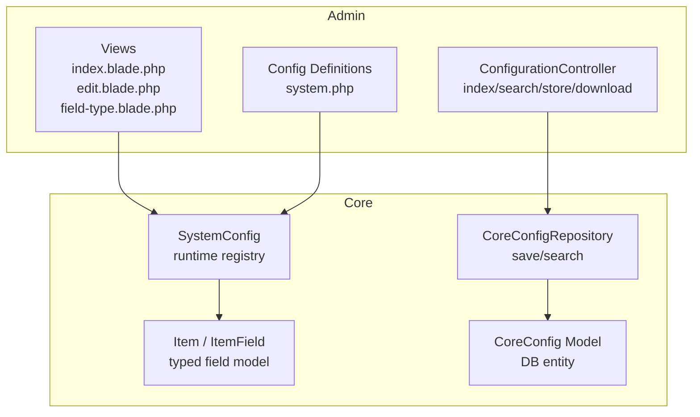
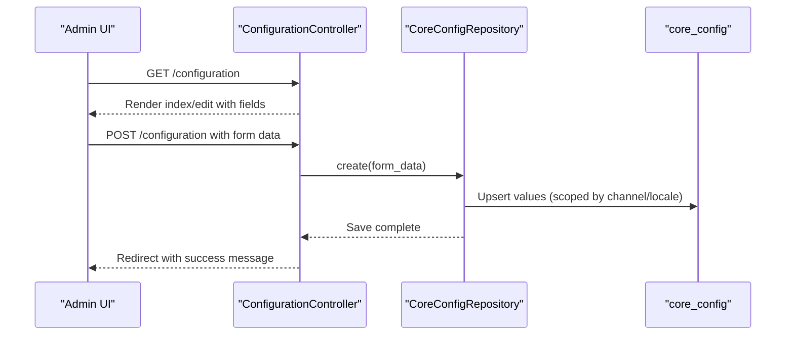
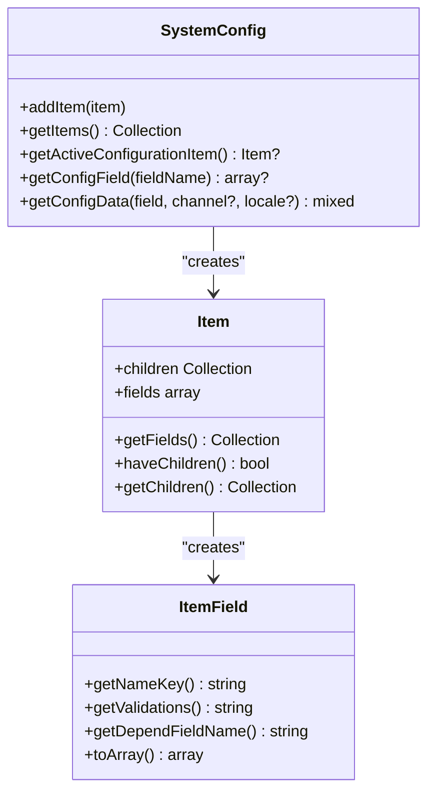
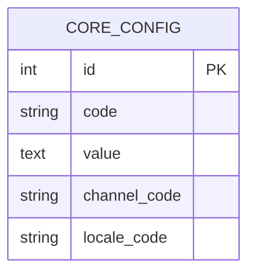
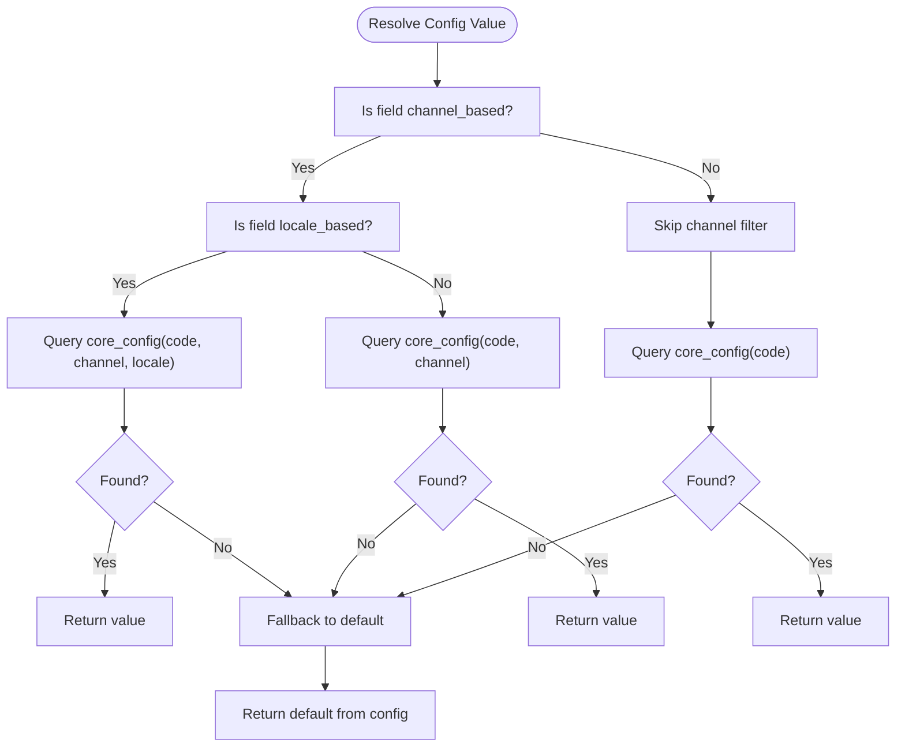
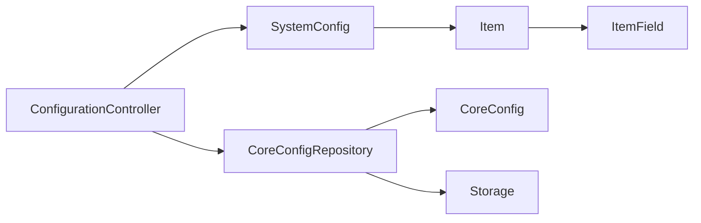

# System Configuration

<cite>
**Referenced Files in This Document**
- [system.php](file://packages/Webkul/Admin/src/Config/system.php)
- [SystemConfig.php](file://packages/Webkul/Core/src/SystemConfig.php)
- [Item.php](file://packages/Webkul/Core/src/SystemConfig/Item.php)
- [ItemField.php](file://packages/Webkul/Core/src/SystemConfig/ItemField.php)
- [ConfigurationController.php](file://packages/Webkul/Admin/src/Http/Controllers/ConfigurationController.php)
- [CoreConfigRepository.php](file://packages/Webkul/Core/src/Repositories/CoreConfigRepository.php)
- [CoreConfig.php](file://packages/Webkul/Core/src/Models/CoreConfig.php)
- [index.blade.php](file://packages/Webkul/Admin/src/Resources/views/configuration/index.blade.php)
- [edit.blade.php](file://packages/Webkul/Admin/src/Resources/views/configuration/edit.blade.php)
- [field-type.blade.php](file://packages/Webkul/Admin/src/Resources/views/configuration/field-type.blade.php)
- [cache-management.blade.php](file://packages/Webkul/Admin/src/Resources/views/configuration/custom-views/cache-management.blade.php)
- [category-menu.blade.php](file://packages/Webkul/Admin/src/Resources/views/configuration/custom-views/category-menu.blade.php)
- [smtp-driver-notice.blade.php](file://packages/Webkul/Admin/src/Resources/views/configuration/custom-views/smtp-driver-notice.blade.php)
</cite>

## Table of Contents
1. [Introduction](#introduction)
2. [Project Structure](#project-structure)
3. [Core Components](#core-components)
4. [Architecture Overview](#architecture-overview)
5. [Detailed Component Analysis](#detailed-component-analysis)
6. [Dependency Analysis](#dependency-analysis)
7. [Performance Considerations](#performance-considerations)
8. [Troubleshooting Guide](#troubleshooting-guide)
9. [Conclusion](#conclusion)
10. [Appendices](#appendices)

## Introduction
This document describes the admin system configuration interface in depth. It covers the configuration forms, field types, validation mechanisms, configuration hierarchy, environment-specific configurations, the configuration data model, caching strategies, performance optimization, custom configuration fields, conditional field display, import/export and backup/restore capabilities, and multi-channel configuration management. The goal is to provide a comprehensive yet accessible guide for both developers and administrators working with the configuration system.

## Project Structure
The configuration system spans several modules:
- Admin configuration definition and UI templates
- Core configuration runtime and data persistence
- Controllers for rendering and saving configuration
- Blade templates for form rendering and custom field types

**Diagram sources**
- [ConfigurationController.php:13-112](file://packages/Webkul/Admin/src/Http/Controllers/ConfigurationController.php#L13-L112)
- [index.blade.php](file://packages/Webkul/Admin/src/Resources/views/configuration/index.blade.php)
- [edit.blade.php](file://packages/Webkul/Admin/src/Resources/views/configuration/edit.blade.php)
- [field-type.blade.php](file://packages/Webkul/Admin/src/Resources/views/configuration/field-type.blade.php)
- [system.php:1-2984](file://packages/Webkul/Admin/src/Config/system.php#L1-L2984)
- [SystemConfig.php:12-234](file://packages/Webkul/Core/src/SystemConfig.php#L12-L234)
- [Item.php:7-133](file://packages/Webkul/Core/src/SystemConfig/Item.php#L7-L133)
- [ItemField.php:7-257](file://packages/Webkul/Core/src/SystemConfig/ItemField.php#L7-L257)
- [CoreConfigRepository.php:12-241](file://packages/Webkul/Core/src/Repositories/CoreConfigRepository.php#L12-L241)
- [CoreConfig.php:11-49](file://packages/Webkul/Core/src/Models/CoreConfig.php#L11-L49)

**Section sources**
- [ConfigurationController.php:13-112](file://packages/Webkul/Admin/src/Http/Controllers/ConfigurationController.php#L13-L112)
- [SystemConfig.php:12-234](file://packages/Webkul/Core/src/SystemConfig.php#L12-L234)
- [Item.php:7-133](file://packages/Webkul/Core/src/SystemConfig/Item.php#L7-L133)
- [ItemField.php:7-257](file://packages/Webkul/Core/src/SystemConfig/ItemField.php#L7-L257)
- [CoreConfigRepository.php:12-241](file://packages/Webkul/Core/src/Repositories/CoreConfigRepository.php#L12-L241)
- [CoreConfig.php:11-49](file://packages/Webkul/Core/src/Models/CoreConfig.php#L11-L49)
- [system.php:1-2984](file://packages/Webkul/Admin/src/Config/system.php#L1-L2984)

## Core Components
- Configuration definitions: Hierarchical groups and fields defined in the Admin configuration file.
- Runtime registry: SystemConfig builds a typed tree of configuration items and fields.
- Field model: ItemField encapsulates field metadata, validation mapping, and visibility logic.
- Persistence: CoreConfigRepository persists values to the core_config table with channel/locale scoping.
- UI: Blade templates render configuration forms and support custom field types.

Key responsibilities:
- Define configuration schema and UI hints (types, defaults, validations).
- Resolve effective values considering channel and locale scoping.
- Persist submitted values, handle uploads, and manage deletions.
- Render forms and conditional fields client-side via depends expressions.

**Section sources**
- [system.php:1-2984](file://packages/Webkul/Admin/src/Config/system.php#L1-L2984)
- [SystemConfig.php:12-234](file://packages/Webkul/Core/src/SystemConfig.php#L12-L234)
- [Item.php:7-133](file://packages/Webkul/Core/src/SystemConfig/Item.php#L7-L133)
- [ItemField.php:7-257](file://packages/Webkul/Core/src/SystemConfig/ItemField.php#L7-L257)
- [CoreConfigRepository.php:25-116](file://packages/Webkul/Core/src/Repositories/CoreConfigRepository.php#L25-L116)
- [CoreConfig.php:11-49](file://packages/Webkul/Core/src/Models/CoreConfig.php#L11-L49)

## Architecture Overview
The configuration architecture follows a layered pattern:
- Definition layer: PHP arrays define sections, subsections, and fields.
- Runtime layer: SystemConfig transforms definitions into typed Item/ItemField objects.
- Persistence layer: CoreConfigRepository writes values to the database with scoping.
- Presentation layer: Blade renders forms and supports custom field types.

**Diagram sources**
- [ConfigurationController.php:23-96](file://packages/Webkul/Admin/src/Http/Controllers/ConfigurationController.php#L23-L96)
- [CoreConfigRepository.php:25-116](file://packages/Webkul/Core/src/Repositories/CoreConfigRepository.php#L25-L116)
- [CoreConfig.php:20-32](file://packages/Webkul/Core/src/Models/CoreConfig.php#L20-L32)

## Detailed Component Analysis

### Configuration Schema and Hierarchy
- Sections and subsections are defined with keys, names, icons, and sort orders.
- Fields specify type, default, validation rules, and scoping flags (channel_based, locale_based).
- Conditional fields use depends expressions to show/hide based on other fields.

Examples of field types observed:
- text, textarea, number, password, boolean, select, image, editor, blade.

Environment-specific configurations:
- channel_based and locale_based flags drive per-channel/per-locale overrides stored in core_config.

Validation mechanisms:
- validation strings are mapped to frontend validation rules during field rendering.

Conditional field display:
- depends expressions like "prerender_enabled:true" control visibility.

Custom field types:
- blade type allows rendering a custom Blade view path.

**Section sources**
- [system.php:27-44](file://packages/Webkul/Admin/src/Config/system.php#L27-L44)
- [system.php:118-131](file://packages/Webkul/Admin/src/Config/system.php#L118-L131)
- [system.php:262-264](file://packages/Webkul/Admin/src/Config/system.php#L262-L264)
- [ItemField.php:14-24](file://packages/Webkul/Core/src/SystemConfig/ItemField.php#L14-L24)
- [ItemField.php:99-114](file://packages/Webkul/Core/src/SystemConfig/ItemField.php#L99-L114)

### Runtime Registry and Field Model
SystemConfig builds a hierarchical registry from the configuration definitions:
- Converts nested arrays into Item nodes.
- Processes fields into ItemField instances with typed metadata.
- Supports retrieving active configuration items by route slugs.

ItemField features:
- Maps Laravel validation rules to frontend rules.
- Provides getNameKey(), getNameField(), getDependFieldName() for form binding.
- Handles dynamic options via callback notation.

**Diagram sources**
- [SystemConfig.php:12-234](file://packages/Webkul/Core/src/SystemConfig.php#L12-L234)
- [Item.php:7-133](file://packages/Webkul/Core/src/SystemConfig/Item.php#L7-L133)
- [ItemField.php:7-257](file://packages/Webkul/Core/src/SystemConfig/ItemField.php#L7-L257)

**Section sources**
- [SystemConfig.php:64-136](file://packages/Webkul/Core/src/SystemConfig.php#L64-L136)
- [Item.php:43-63](file://packages/Webkul/Core/src/SystemConfig/Item.php#L43-L63)
- [ItemField.php:193-231](file://packages/Webkul/Core/src/SystemConfig/ItemField.php#L193-L231)

### Data Model and Persistence
CoreConfigRepository handles creation/upserts and search:
- Recursively flattens nested form data into dot-notation keys.
- Resolves field metadata via SystemConfig.getConfigField().
- Persists values with optional channel/locale scoping.
- Handles file uploads by storing to storage and saving the path.
- Manages deletions when a delete flag is present.

CoreConfig table schema:
- code, value, channel_code, locale_code.

**Diagram sources**
- [CoreConfig.php:20-32](file://packages/Webkul/Core/src/Models/CoreConfig.php#L20-L32)
- [CoreConfigRepository.php:25-116](file://packages/Webkul/Core/src/Repositories/CoreConfigRepository.php#L25-L116)

**Section sources**
- [CoreConfigRepository.php:25-116](file://packages/Webkul/Core/src/Repositories/CoreConfigRepository.php#L25-L116)
- [CoreConfig.php:11-49](file://packages/Webkul/Core/src/Models/CoreConfig.php#L11-L49)

### UI Rendering and Form Handling
Blade templates:
- index.blade.php renders the configuration index and navigation.
- edit.blade.php renders the configuration edit form.
- field-type.blade.php renders individual field types based on type metadata.
- Custom views under configuration/custom-views support specialized controls (e.g., cache management, SMTP notices).

Conditional rendering:
- depends expressions are resolved client-side to toggle visibility.

Upload handling:
- Image fields trigger file storage and persist the storage path.

Validation:
- Frontend validation is derived from backend validation rules.

**Section sources**
- [index.blade.php](file://packages/Webkul/Admin/src/Resources/views/configuration/index.blade.php)
- [edit.blade.php](file://packages/Webkul/Admin/src/Resources/views/configuration/edit.blade.php)
- [field-type.blade.php](file://packages/Webkul/Admin/src/Resources/views/configuration/field-type.blade.php)
- [cache-management.blade.php](file://packages/Webkul/Admin/src/Resources/views/configuration/custom-views/cache-management.blade.php)
- [smtp-driver-notice.blade.php](file://packages/Webkul/Admin/src/Resources/views/configuration/custom-views/smtp-driver-notice.blade.php)

### Import/Export and Backup/Restore
- Export: The controller exposes a download action to retrieve stored files associated with configuration values.
- Import/Backup: There is no dedicated import/export endpoint in the controller; backups rely on exporting stored files and restoring database rows in core_config.

Operational notes:
- File-backed configuration values are stored under storage and referenced by path.
- For full restore, both database rows and storage files must be restored consistently.

**Section sources**
- [ConfigurationController.php:101-110](file://packages/Webkul/Admin/src/Http/Controllers/ConfigurationController.php#L101-L110)
- [CoreConfigRepository.php:83-85](file://packages/Webkul/Core/src/Repositories/CoreConfigRepository.php#L83-L85)

### Multi-Channel Configuration Management
- channel_based flag enables per-channel overrides.
- locale_based flag enables per-locale overrides.
- Effective value resolution considers requested channel and locale, falling back to defaults when no override exists.

**Diagram sources**
- [SystemConfig.php:163-232](file://packages/Webkul/Core/src/SystemConfig.php#L163-L232)
- [CoreConfigRepository.php:57-81](file://packages/Webkul/Core/src/Repositories/CoreConfigRepository.php#L57-L81)

**Section sources**
- [SystemConfig.php:163-232](file://packages/Webkul/Core/src/SystemConfig.php#L163-L232)
- [CoreConfigRepository.php:57-81](file://packages/Webkul/Core/src/Repositories/CoreConfigRepository.php#L57-L81)

### Examples and Patterns

- Custom configuration fields
  - Blade-type fields render a custom view path for advanced controls.
  - Example: A custom Blade view for category menu configuration.

- Conditional field display
  - depends expressions like "prerender_enabled:true" control visibility of related fields.

- Environment-specific configurations
  - channel_based and locale_based flags enable per-channel/per-locale overrides.

- Validation mapping
  - Backend validation strings are transformed for frontend validation compatibility.

- Import/export and backup/restore
  - Stored file values can be downloaded via the controller’s download action.
  - Full restoration requires database and storage consistency.

**Section sources**
- [system.php:262-264](file://packages/Webkul/Admin/src/Config/system.php#L262-L264)
- [system.php:124-131](file://packages/Webkul/Admin/src/Config/system.php#L124-L131)
- [ItemField.php:99-114](file://packages/Webkul/Core/src/SystemConfig/ItemField.php#L99-L114)
- [ConfigurationController.php:101-110](file://packages/Webkul/Admin/src/Http/Controllers/ConfigurationController.php#L101-L110)

## Dependency Analysis
- ConfigurationController depends on CoreConfigRepository for persistence and on SystemConfig for UI composition.
- SystemConfig depends on configuration definitions and translates them into typed Item/ItemField objects.
- CoreConfigRepository depends on CoreConfig model and storage for file handling.
- Views depend on Item/ItemField metadata to render forms and conditional logic.

**Diagram sources**
- [ConfigurationController.php:13-112](file://packages/Webkul/Admin/src/Http/Controllers/ConfigurationController.php#L13-L112)
- [SystemConfig.php:12-234](file://packages/Webkul/Core/src/SystemConfig.php#L12-L234)
- [Item.php:7-133](file://packages/Webkul/Core/src/SystemConfig/Item.php#L7-L133)
- [ItemField.php:7-257](file://packages/Webkul/Core/src/SystemConfig/ItemField.php#L7-L257)
- [CoreConfigRepository.php:12-241](file://packages/Webkul/Core/src/Repositories/CoreConfigRepository.php#L12-L241)
- [CoreConfig.php:11-49](file://packages/Webkul/Core/src/Models/CoreConfig.php#L11-L49)

**Section sources**
- [ConfigurationController.php:13-112](file://packages/Webkul/Admin/src/Http/Controllers/ConfigurationController.php#L13-L112)
- [SystemConfig.php:12-234](file://packages/Webkul/Core/src/SystemConfig.php#L12-L234)
- [CoreConfigRepository.php:12-241](file://packages/Webkul/Core/src/Repositories/CoreConfigRepository.php#L12-L241)

## Performance Considerations
- Minimize repeated queries by leveraging SystemConfig’s lazy preparation and sorting.
- Use channel/locale scoping judiciously; excessive overrides increase query volume.
- Batch updates where possible to reduce event dispatch overhead.
- For large forms, defer expensive computations in custom Blade views.
- Cache frequently accessed configuration values at runtime if appropriate.

## Troubleshooting Guide
- No values saved
  - Verify channel/locale scoping flags and ensure values are posted under the correct keys.
  - Confirm that file uploads are handled properly and storage paths are valid.

- Conditional fields not appearing
  - Check depends expressions and ensure the referenced field names match the item_key.field_name pattern.

- Validation errors
  - Review mapped validation rules and ensure frontend validation matches backend expectations.

- Search not finding configuration sections
  - Ensure titles are translatable and that search terms match translated titles.

**Section sources**
- [CoreConfigRepository.php:44-55](file://packages/Webkul/Core/src/Repositories/CoreConfigRepository.php#L44-L55)
- [ItemField.php:236-245](file://packages/Webkul/Core/src/SystemConfig/ItemField.php#L236-L245)
- [ConfigurationController.php:38-48](file://packages/Webkul/Admin/src/Http/Controllers/ConfigurationController.php#L38-L48)

## Conclusion
The configuration system provides a robust, extensible framework for managing system-wide settings with strong support for multi-channel and multi-locale deployments. Its layered design separates concerns between definition, runtime, persistence, and presentation, while offering flexible field types, conditional logic, and environment-aware scoping. Administrators can tailor the UI with custom field types, and developers can extend the schema and persistence behavior with minimal friction.

## Appendices

### Appendix A: Field Types and Validation Mapping
- Supported types include text, textarea, number, password, boolean, select, image, editor, and blade.
- Validation rules are mapped to frontend validators for real-time feedback.

**Section sources**
- [system.php:31-42](file://packages/Webkul/Admin/src/Config/system.php#L31-L42)
- [system.php:135-151](file://packages/Webkul/Admin/src/Config/system.php#L135-L151)
- [ItemField.php:14-24](file://packages/Webkul/Core/src/SystemConfig/ItemField.php#L14-L24)
- [ItemField.php:99-114](file://packages/Webkul/Core/src/SystemConfig/ItemField.php#L99-L114)

### Appendix B: Custom Views and Specialized Controls
- Blade-type fields can render custom views for advanced configuration scenarios.
- Examples include cache management and SMTP driver notices.

**Section sources**
- [system.php:262-264](file://packages/Webkul/Admin/src/Config/system.php#L262-L264)
- [cache-management.blade.php](file://packages/Webkul/Admin/src/Resources/views/configuration/custom-views/cache-management.blade.php)
- [smtp-driver-notice.blade.php](file://packages/Webkul/Admin/src/Resources/views/configuration/custom-views/smtp-driver-notice.blade.php)