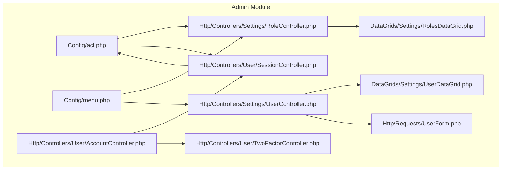
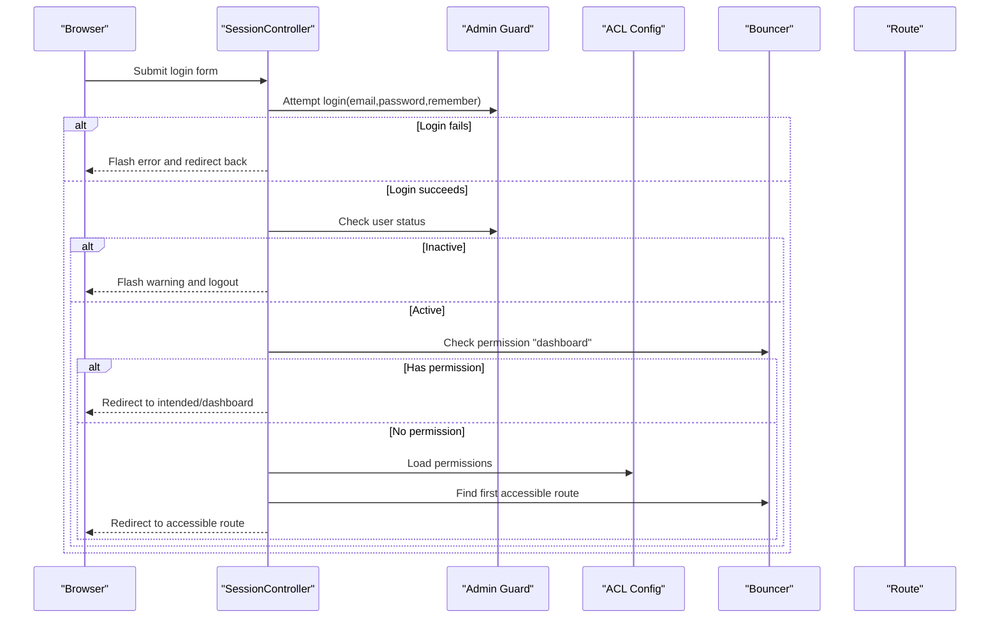
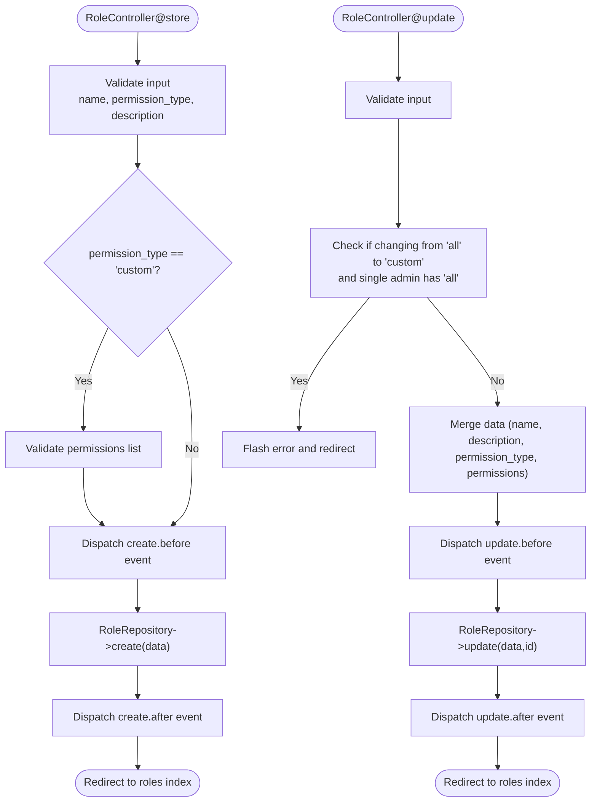
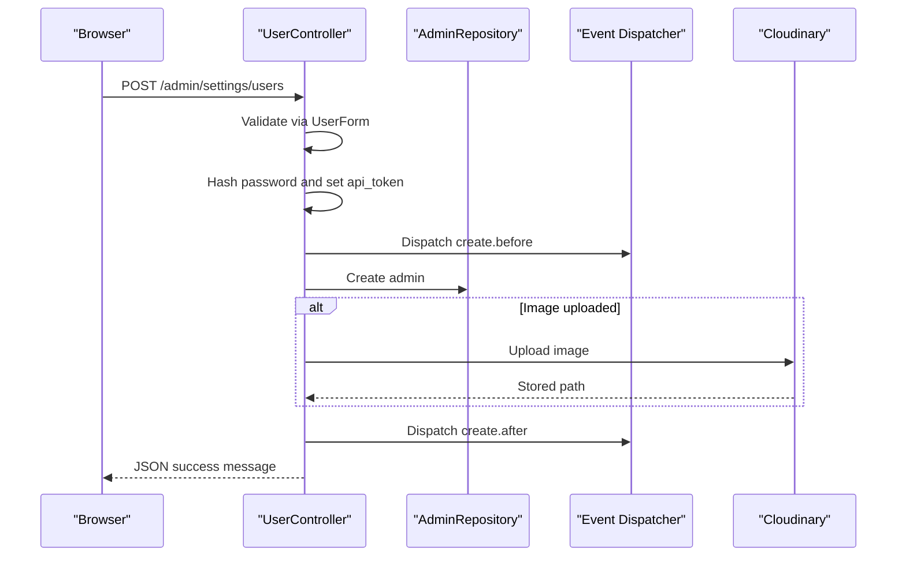
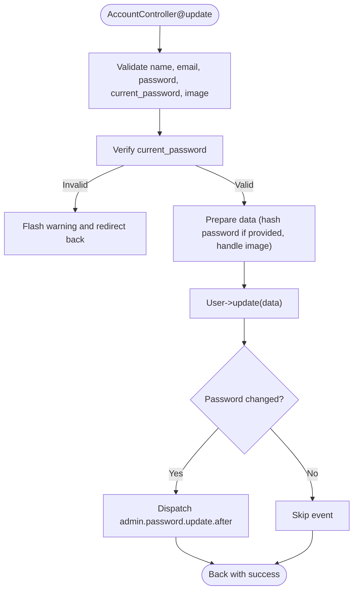
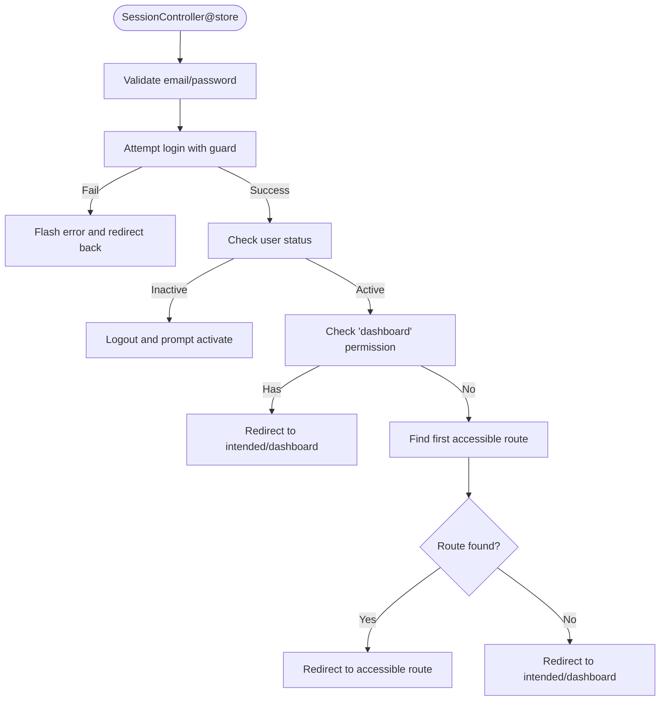
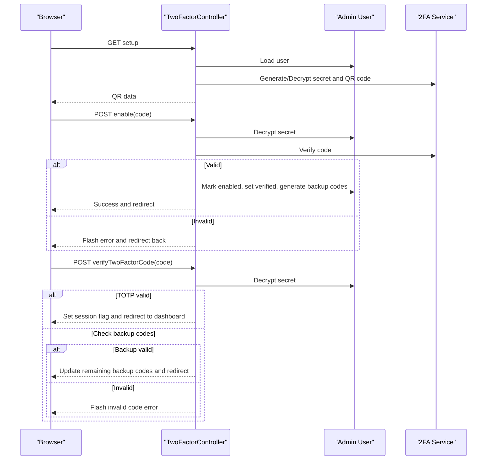
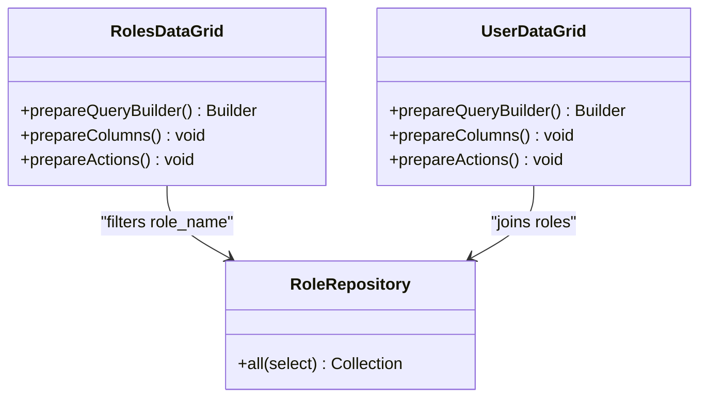
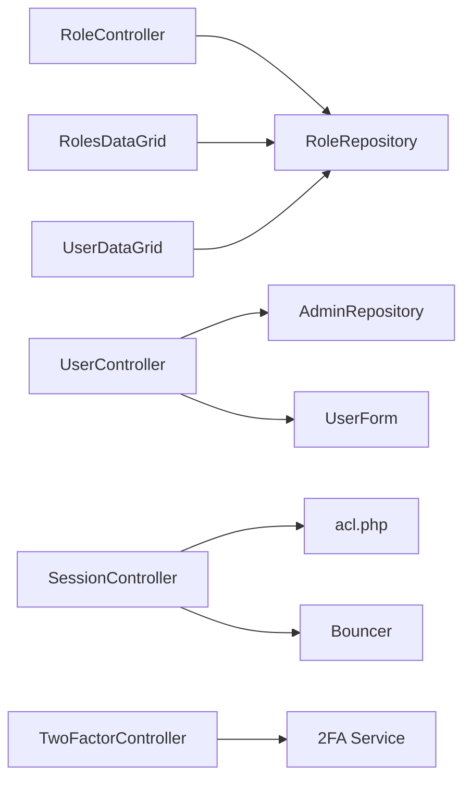

# User & Role Management

<cite>
**Referenced Files in This Document**
- [acl.php](file://packages/Webkul/Admin/src/Config/acl.php)
- [menu.php](file://packages/Webkul/Admin/src/Config/menu.php)
- [RoleController.php](file://packages/Webkul/Admin/src/Http/Controllers/Settings/RoleController.php)
- [UserController.php](file://packages/Webkul/Admin/src/Http/Controllers/Settings/UserController.php)
- [AccountController.php](file://packages/Webkul/Admin/src/Http/Controllers/User/AccountController.php)
- [SessionController.php](file://packages/Webkul/Admin/src/Http/Controllers/User/SessionController.php)
- [TwoFactorController.php](file://packages/Webkul/Admin/src/Http/Controllers/User/TwoFactorController.php)
- [UserForm.php](file://packages/Webkul/Admin/src/Http/Requests/UserForm.php)
- [RolesDataGrid.php](file://packages/Webkul/Admin/src/DataGrids/Settings/RolesDataGrid.php)
- [UserDataGrid.php](file://packages/Webkul/Admin/src/DataGrids/Settings/UserDataGrid.php)
</cite>

## Table of Contents
1. [Introduction](#introduction)
2. [Project Structure](#project-structure)
3. [Core Components](#core-components)
4. [Architecture Overview](#architecture-overview)
5. [Detailed Component Analysis](#detailed-component-analysis)
6. [Dependency Analysis](#dependency-analysis)
7. [Performance Considerations](#performance-considerations)
8. [Troubleshooting Guide](#troubleshooting-guide)
9. [Conclusion](#conclusion)

## Introduction
This document explains the admin user and role management functionality in the Admin module. It covers:
- The user administration interface for creating, updating, viewing, and deleting admin users
- Role-based access control (RBAC) with permission definitions and enforcement
- Permission management via roles and ACL configuration
- User profile management and account security features
- Role hierarchy and permission assignment
- Audit-ready workflows through events and validation
- Examples of user provisioning, role customization, and security policy enforcement
- Two-factor authentication (2FA), password policies, and session management

## Project Structure
The Admin module organizes user and role management under:
- Configuration: ACL definitions and sidebar menu entries
- Controllers: Settings controllers for roles/users and User controllers for account/session/2FA
- DataGrids: Read-only listings for roles and users with filters/actions
- Requests: Validation for user forms

**Diagram sources**
- [acl.php:1-1000](file://packages/Webkul/Admin/src/Config/acl.php#L1-L1000)
- [menu.php:1-238](file://packages/Webkul/Admin/src/Config/menu.php#L1-L238)
- [RoleController.php:1-185](file://packages/Webkul/Admin/src/Http/Controllers/Settings/RoleController.php#L1-L185)
- [UserController.php:1-302](file://packages/Webkul/Admin/src/Http/Controllers/Settings/UserController.php#L1-L302)
- [AccountController.php:1-93](file://packages/Webkul/Admin/src/Http/Controllers/User/AccountController.php#L1-L93)
- [SessionController.php:1-170](file://packages/Webkul/Admin/src/Http/Controllers/User/SessionController.php#L1-L170)
- [TwoFactorController.php:1-169](file://packages/Webkul/Admin/src/Http/Controllers/User/TwoFactorController.php#L1-L169)
- [RolesDataGrid.php:1-101](file://packages/Webkul/Admin/src/DataGrids/Settings/RolesDataGrid.php#L1-L101)
- [UserDataGrid.php:1-169](file://packages/Webkul/Admin/src/DataGrids/Settings/UserDataGrid.php#L1-L169)
- [UserForm.php:1-38](file://packages/Webkul/Admin/src/Http/Requests/UserForm.php#L1-L38)

**Section sources**
- [acl.php:1-1000](file://packages/Webkul/Admin/src/Config/acl.php#L1-L1000)
- [menu.php:1-238](file://packages/Webkul/Admin/src/Config/menu.php#L1-L238)

## Core Components
- ACL configuration defines granular permissions keyed by feature and action (e.g., settings.users.create, sales.orders.view).
- Sidebar menu groups navigation items by functional areas and exposes sub-items for roles and users.
- RoleController manages role lifecycle: listing, creating, editing, updating, and deleting roles with validation and event hooks.
- UserController manages admin user lifecycle: listing, creating, editing, updating, and deleting users with validation, password hashing, and image handling.
- AccountController handles self-service profile updates including password changes and avatar management.
- SessionController controls admin login/logout, intended redirects, and fallback routing based on user permissions.
- TwoFactorController enables/disables 2FA, generates QR codes and backup codes, and verifies 2FA or backup codes during login.
- RolesDataGrid and UserDataGrid provide filtered, sortable, and actionable lists for admin UI.

**Section sources**
- [RoleController.php:1-185](file://packages/Webkul/Admin/src/Http/Controllers/Settings/RoleController.php#L1-L185)
- [UserController.php:1-302](file://packages/Webkul/Admin/src/Http/Controllers/Settings/UserController.php#L1-L302)
- [AccountController.php:1-93](file://packages/Webkul/Admin/src/Http/Controllers/User/AccountController.php#L1-L93)
- [SessionController.php:1-170](file://packages/Webkul/Admin/src/Http/Controllers/User/SessionController.php#L1-L170)
- [TwoFactorController.php:1-169](file://packages/Webkul/Admin/src/Http/Controllers/User/TwoFactorController.php#L1-L169)
- [RolesDataGrid.php:1-101](file://packages/Webkul/Admin/src/DataGrids/Settings/RolesDataGrid.php#L1-L101)
- [UserDataGrid.php:1-169](file://packages/Webkul/Admin/src/DataGrids/Settings/UserDataGrid.php#L1-L169)

## Architecture Overview
The RBAC architecture ties together ACL definitions, role assignments, and runtime permission checks. On login, the system validates credentials, checks status, enforces 2FA if enabled, and then determines the first accessible route based on the user’s role permissions.

**Diagram sources**
- [SessionController.php:40-114](file://packages/Webkul/Admin/src/Http/Controllers/User/SessionController.php#L40-L114)
- [acl.php:1-1000](file://packages/Webkul/Admin/src/Config/acl.php#L1-L1000)

**Section sources**
- [SessionController.php:1-170](file://packages/Webkul/Admin/src/Http/Controllers/User/SessionController.php#L1-L170)
- [acl.php:1-1000](file://packages/Webkul/Admin/src/Config/acl.php#L1-L1000)

## Detailed Component Analysis

### Role Management
RoleController orchestrates role CRUD with strict validation and safeguards:
- Validation ensures name, permission type (all/custom), and description are present; custom roles require a permissions list.
- During updates, it prevents scenarios where removing “all” access would leave no admin with full privileges.
- Deletion guards against deleting the last role and prevents removal if role is still assigned to admins.

**Diagram sources**
- [RoleController.php:55-143](file://packages/Webkul/Admin/src/Http/Controllers/Settings/RoleController.php#L55-L143)

**Section sources**
- [RoleController.php:1-185](file://packages/Webkul/Admin/src/Http/Controllers/Settings/RoleController.php#L1-L185)

### User Management
UserController manages admin user lifecycle with strong validation and security:
- Creation: Hashes passwords, generates API tokens, uploads images, dispatches events.
- Update: Prepares validated data, conditionally hashes password, manages avatar updates/deletions, dispatches password change event when applicable.
- Deletion: Prevents self-deletion and ensures at least one admin remains; dispatches delete events.

**Diagram sources**
- [UserController.php:50-82](file://packages/Webkul/Admin/src/Http/Controllers/Settings/UserController.php#L50-L82)
- [UserForm.php:24-36](file://packages/Webkul/Admin/src/Http/Requests/UserForm.php#L24-L36)

**Section sources**
- [UserController.php:1-302](file://packages/Webkul/Admin/src/Http/Controllers/Settings/UserController.php#L1-L302)
- [UserForm.php:1-38](file://packages/Webkul/Admin/src/Http/Requests/UserForm.php#L1-L38)

### Profile Management
AccountController allows the logged-in admin to update personal details:
- Validates name, email uniqueness, optional password confirmation, and image constraints.
- Requires current password verification before applying changes.
- Triggers a password update event when password changes.

**Diagram sources**
- [AccountController.php:31-91](file://packages/Webkul/Admin/src/Http/Controllers/User/AccountController.php#L31-L91)

**Section sources**
- [AccountController.php:1-93](file://packages/Webkul/Admin/src/Http/Controllers/User/AccountController.php#L1-L93)

### Session Management and Permission-Based Routing
SessionController handles login, logout, and dynamic redirection based on permissions:
- Redirects already logged-in users to dashboard.
- Stores intended URLs for seamless post-login navigation.
- Enforces account activation and 2FA gating.
- If user lacks the dashboard permission, finds the first accessible route by traversing ACL keys and checking bouncer permissions.

**Diagram sources**
- [SessionController.php:40-114](file://packages/Webkul/Admin/src/Http/Controllers/User/SessionController.php#L40-L114)
- [acl.php:1-1000](file://packages/Webkul/Admin/src/Config/acl.php#L1-L1000)

**Section sources**
- [SessionController.php:1-170](file://packages/Webkul/Admin/src/Http/Controllers/User/SessionController.php#L1-L170)

### Two-Factor Authentication (2FA)
TwoFactorController supports enabling/disabling 2FA and verifying codes:
- Generates or retrieves a secret, produces a QR code for authenticator apps, and stores encrypted secret.
- Verifies 6-digit TOTP codes; on success, marks verification and stores backup codes.
- Also supports backup codes during verification.
- Disabling clears 2FA state and returns a JSON success message.

**Diagram sources**
- [TwoFactorController.php:15-167](file://packages/Webkul/Admin/src/Http/Controllers/User/TwoFactorController.php#L15-L167)

**Section sources**
- [TwoFactorController.php:1-169](file://packages/Webkul/Admin/src/Http/Controllers/User/TwoFactorController.php#L1-L169)

### DataGrids for Admin UI
- RolesDataGrid displays roles with ID, name, and permission type, and offers edit/delete actions based on permissions.
- UserDataGrid joins admins with roles, exposing user details, status, email, and role name, with filters and actions.

**Diagram sources**
- [RolesDataGrid.php:16-100](file://packages/Webkul/Admin/src/DataGrids/Settings/RolesDataGrid.php#L16-L100)
- [UserDataGrid.php:32-168](file://packages/Webkul/Admin/src/DataGrids/Settings/UserDataGrid.php#L32-L168)

**Section sources**
- [RolesDataGrid.php:1-101](file://packages/Webkul/Admin/src/DataGrids/Settings/RolesDataGrid.php#L1-L101)
- [UserDataGrid.php:1-169](file://packages/Webkul/Admin/src/DataGrids/Settings/UserDataGrid.php#L1-L169)

## Dependency Analysis
- Controllers depend on repositories for persistence and on ACL/menu configs for permission enforcement and navigation.
- DataGrids depend on repositories and ACL for filtering and action visibility.
- SessionController depends on ACL to compute accessible routes dynamically.
- TwoFactorController depends on a 2FA service facade for secrets, QR generation, and code verification.

**Diagram sources**
- [RoleController.php:1-185](file://packages/Webkul/Admin/src/Http/Controllers/Settings/RoleController.php#L1-L185)
- [UserController.php:1-302](file://packages/Webkul/Admin/src/Http/Controllers/Settings/UserController.php#L1-L302)
- [SessionController.php:1-170](file://packages/Webkul/Admin/src/Http/Controllers/User/SessionController.php#L1-L170)
- [TwoFactorController.php:1-169](file://packages/Webkul/Admin/src/Http/Controllers/User/TwoFactorController.php#L1-L169)
- [RolesDataGrid.php:1-101](file://packages/Webkul/Admin/src/DataGrids/Settings/RolesDataGrid.php#L1-L101)
- [UserDataGrid.php:1-169](file://packages/Webkul/Admin/src/DataGrids/Settings/UserDataGrid.php#L1-L169)

**Section sources**
- [RoleController.php:1-185](file://packages/Webkul/Admin/src/Http/Controllers/Settings/RoleController.php#L1-L185)
- [UserController.php:1-302](file://packages/Webkul/Admin/src/Http/Controllers/Settings/UserController.php#L1-L302)
- [SessionController.php:1-170](file://packages/Webkul/Admin/src/Http/Controllers/User/SessionController.php#L1-L170)
- [TwoFactorController.php:1-169](file://packages/Webkul/Admin/src/Http/Controllers/User/TwoFactorController.php#L1-L169)
- [RolesDataGrid.php:1-101](file://packages/Webkul/Admin/src/DataGrids/Settings/RolesDataGrid.php#L1-L101)
- [UserDataGrid.php:1-169](file://packages/Webkul/Admin/src/DataGrids/Settings/UserDataGrid.php#L1-L169)

## Performance Considerations
- Prefer server-side filtering and pagination via DataGrids to avoid loading large datasets.
- Minimize redundant permission checks by caching ACL keys and role permissions per session where feasible.
- Use batch operations for mass updates/deletes to reduce round-trips.
- Offload image uploads to external services (as seen in uploads) to reduce local storage overhead.

## Troubleshooting Guide
Common issues and resolutions:
- Login failures: Ensure credentials are correct and the account is active; inactive accounts are rejected.
- Permission errors: If redirected to dashboard despite lacking dashboard permission, verify role permission_type and assigned permissions match ACL keys.
- 2FA setup/verification: Confirm the authenticator app time sync and that backup codes are securely stored.
- Self-service updates: Current password verification is mandatory before changing email or password.
- Role deletion blocked: Deleting roles is prevented if they are assigned to users or if it would leave zero roles.

**Section sources**
- [SessionController.php:49-67](file://packages/Webkul/Admin/src/Http/Controllers/User/SessionController.php#L49-L67)
- [TwoFactorController.php:130-156](file://packages/Webkul/Admin/src/Http/Controllers/User/TwoFactorController.php#L130-L156)
- [AccountController.php:52-56](file://packages/Webkul/Admin/src/Http/Controllers/User/AccountController.php#L52-L56)
- [RoleController.php:148-183](file://packages/Webkul/Admin/src/Http/Controllers/Settings/RoleController.php#L148-L183)
- [UserController.php:158-188](file://packages/Webkul/Admin/src/Http/Controllers/Settings/UserController.php#L158-L188)

## Conclusion
The Admin module provides a robust foundation for user and role management:
- ACL-driven permissions define fine-grained access across features.
- RoleController and UserController enforce validation, security, and safeguards during lifecycle operations.
- SessionController and TwoFactorController deliver secure login flows with dynamic routing and 2FA support.
- DataGrids offer efficient, filterable admin interfaces for roles and users.