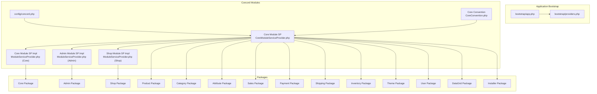
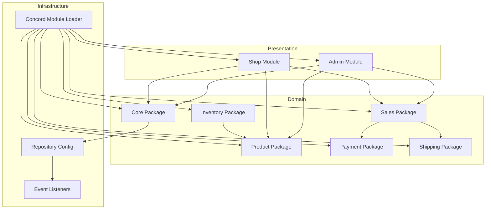
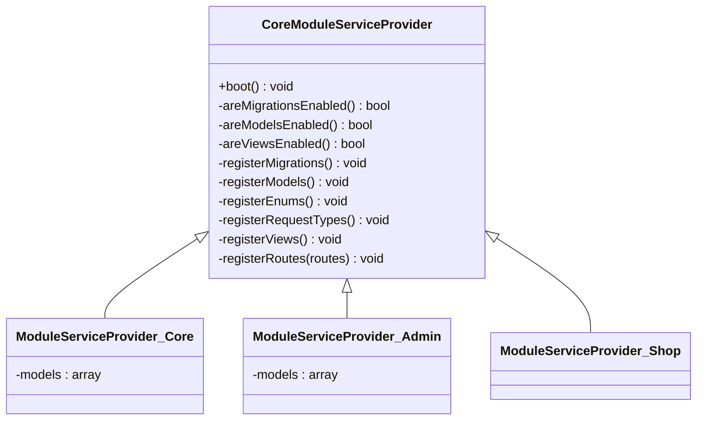
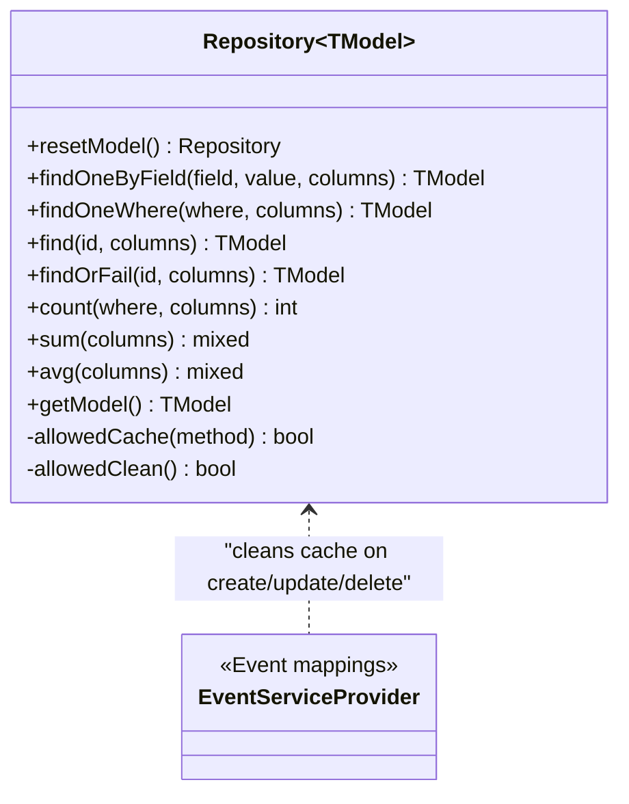
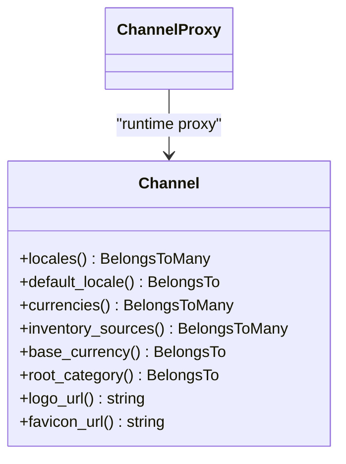
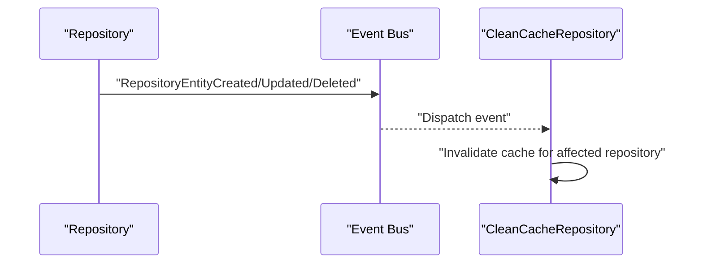
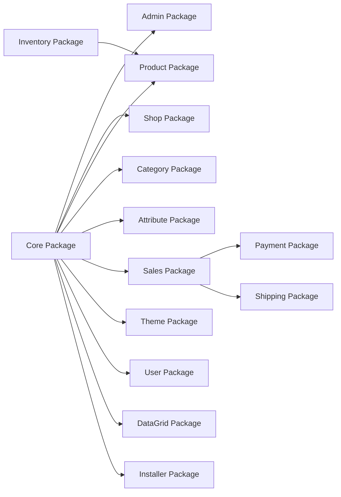
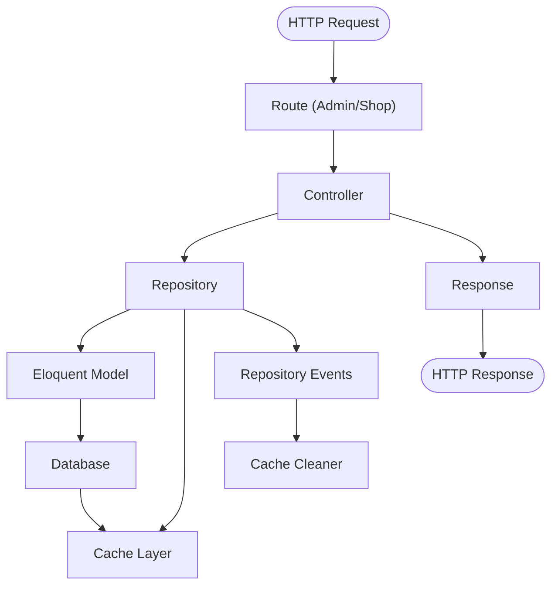
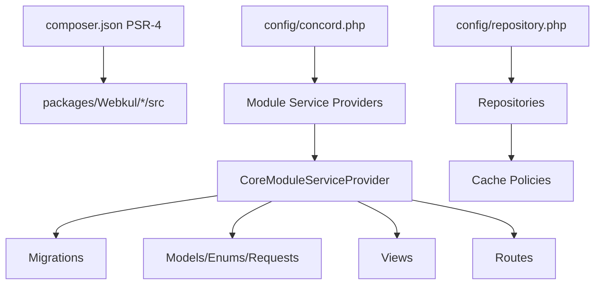

# Architecture Overview

<cite>
**Referenced Files in This Document**
- [composer.json](file://composer.json)
- [bootstrap/app.php](file://bootstrap/app.php)
- [bootstrap/providers.php](file://bootstrap/providers.php)
- [config/concord.php](file://config/concord.php)
- [config/repository.php](file://config/repository.php)
- [packages/Webkul/Core/src/CoreConvention.php](file://packages/Webkul/Core/src/CoreConvention.php)
- [packages/Webkul/Core/src/Providers/CoreModuleServiceProvider.php](file://packages/Webkul/Core/src/Providers/CoreModuleServiceProvider.php)
- [packages/Webkul/Core/src/Providers/ModuleServiceProvider.php](file://packages/Webkul/Core/src/Providers/ModuleServiceProvider.php)
- [packages/Webkul/Admin/src/Providers/ModuleServiceProvider.php](file://packages/Webkul/Admin/src/Providers/ModuleServiceProvider.php)
- [packages/Webkul/Shop/src/Providers/ModuleServiceProvider.php](file://packages/Webkul/Shop/src/Providers/ModuleServiceProvider.php)
- [packages/Webkul/Core/src/Eloquent/Repository.php](file://packages/Webkul/Core/src/Eloquent/Repository.php)
- [packages/Webkul/Core/src/Providers/EventServiceProvider.php](file://packages/Webkul/Core/src/Providers/EventServiceProvider.php)
- [packages/Webkul/Core/src/Models/Channel.php](file://packages/Webkul/Core/src/Models/Channel.php)
- [packages/Webkul/Core/src/Models/ChannelProxy.php](file://packages/Webkul/Core/src/Models/ChannelProxy.php)
</cite>

## Table of Contents
1. [Introduction](#introduction)
2. [Project Structure](#project-structure)
3. [Core Components](#core-components)
4. [Architecture Overview](#architecture-overview)
5. [Detailed Component Analysis](#detailed-component-analysis)
6. [Dependency Analysis](#dependency-analysis)
7. [Performance Considerations](#performance-considerations)
8. [Troubleshooting Guide](#troubleshooting-guide)
9. [Conclusion](#conclusion)

## Introduction
This document describes the architecture of Frooxi 2.4’s modular e-commerce platform built on Laravel. It explains how the Concord modular package system organizes core packages and business modules, how service providers register modules and bind contracts, and how high-level design patterns such as repository pattern, proxy pattern, and event-driven architecture are applied. It also documents system boundaries, data flow patterns, integration points, and separation of concerns across admin, shop, and core functionalities.

## Project Structure
Frooxi 2.4 follows a monorepo-like structure under the packages/Webkul directory, where each domain feature is a separate Composer package. The application integrates these packages via Concord, a Laravel module manager. PSR-4 autoload maps connect package namespaces to their src directories, enabling modular development and deployment.

Key characteristics:
- Modular packages per domain (Core, Admin, Shop, Product, Category, Attribute, Sales, Payment, Shipping, Inventory, Theme, User, DataGrid, Installer).
- Concord configuration declares module service providers to load models, migrations, views, and routes.
- Laravel application bootstrap wires middleware and registers providers.

**Diagram sources**
- [bootstrap/app.php:14-55](file://bootstrap/app.php#L14-L55)
- [bootstrap/providers.php:22-48](file://bootstrap/providers.php#L22-L48)
- [config/concord.php:6-36](file://config/concord.php#L6-L36)
- [packages/Webkul/Core/src/CoreConvention.php:7-24](file://packages/Webkul/Core/src/CoreConvention.php#L7-L24)
- [packages/Webkul/Core/src/Providers/CoreModuleServiceProvider.php:10-35](file://packages/Webkul/Core/src/Providers/CoreModuleServiceProvider.php#L10-L35)
- [packages/Webkul/Core/src/Providers/ModuleServiceProvider.php:16-35](file://packages/Webkul/Core/src/Providers/ModuleServiceProvider.php#L16-L35)
- [packages/Webkul/Admin/src/Providers/ModuleServiceProvider.php:7-15](file://packages/Webkul/Admin/src/Providers/ModuleServiceProvider.php#L7-L15)
- [packages/Webkul/Shop/src/Providers/ModuleServiceProvider.php:7-7](file://packages/Webkul/Shop/src/Providers/ModuleServiceProvider.php#L7-L7)

**Section sources**
- [composer.json:58-81](file://composer.json#L58-L81)
- [config/concord.php:6-36](file://config/concord.php#L6-L36)
- [bootstrap/app.php:14-55](file://bootstrap/app.php#L14-L55)
- [bootstrap/providers.php:22-48](file://bootstrap/providers.php#L22-L48)

## Core Components
- Concord module system: Declares module service providers and conventions for migrations, views, and manifests.
- Core package: Provides foundational models, enums, traits, facades, and the base repository with caching support.
- Proxy pattern: Model proxies enable runtime binding to concrete models across modules.
- Repository pattern: Centralized data access via Prettus repositories with criteria, caching, and clean listeners.
- Event-driven architecture: Repository events trigger cache invalidation and other cross-cutting behaviors.

**Section sources**
- [config/concord.php:6-36](file://config/concord.php#L6-L36)
- [packages/Webkul/Core/src/CoreConvention.php:7-24](file://packages/Webkul/Core/src/CoreConvention.php#L7-L24)
- [packages/Webkul/Core/src/Providers/ModuleServiceProvider.php:16-35](file://packages/Webkul/Core/src/Providers/ModuleServiceProvider.php#L16-L35)
- [packages/Webkul/Core/src/Eloquent/Repository.php:9-224](file://packages/Webkul/Core/src/Eloquent/Repository.php#L9-L224)
- [packages/Webkul/Core/src/Providers/EventServiceProvider.php:14-24](file://packages/Webkul/Core/src/Providers/EventServiceProvider.php#L14-L24)

## Architecture Overview
The system is layered:
- Presentation layer: Admin and Shop modules expose routes and controllers.
- Domain layer: Core and business packages encapsulate models, repositories, and domain logic.
- Infrastructure layer: Concord manages module discovery, migrations, and resource registration; Prettus repositories provide data access and caching.

**Diagram sources**
- [config/concord.php:19-35](file://config/concord.php#L19-L35)
- [config/repository.php:12-294](file://config/repository.php#L12-L294)
- [packages/Webkul/Core/src/Providers/EventServiceProvider.php:14-24](file://packages/Webkul/Core/src/Providers/EventServiceProvider.php#L14-L24)

## Detailed Component Analysis

### Concord Module System and Service Provider Registration
- config/concord.php defines the CoreConvention and lists module service providers to load.
- CoreModuleServiceProvider extends the Concord base to register migrations, models/enums/request types, views, and routes when enabled.
- Each package’s ModuleServiceProvider (e.g., Core, Admin, Shop) extends CoreModuleServiceProvider and optionally declares models to register.

**Diagram sources**
- [packages/Webkul/Core/src/Providers/CoreModuleServiceProvider.php:10-35](file://packages/Webkul/Core/src/Providers/CoreModuleServiceProvider.php#L10-L35)
- [packages/Webkul/Core/src/Providers/ModuleServiceProvider.php:16-35](file://packages/Webkul/Core/src/Providers/ModuleServiceProvider.php#L16-L35)
- [packages/Webkul/Admin/src/Providers/ModuleServiceProvider.php:7-15](file://packages/Webkul/Admin/src/Providers/ModuleServiceProvider.php#L7-L15)
- [packages/Webkul/Shop/src/Providers/ModuleServiceProvider.php:7-7](file://packages/Webkul/Shop/src/Providers/ModuleServiceProvider.php#L7-L7)

**Section sources**
- [config/concord.php:6-36](file://config/concord.php#L6-L36)
- [packages/Webkul/Core/src/Providers/CoreModuleServiceProvider.php:10-35](file://packages/Webkul/Core/src/Providers/CoreModuleServiceProvider.php#L10-L35)
- [packages/Webkul/Core/src/Providers/ModuleServiceProvider.php:16-35](file://packages/Webkul/Core/src/Providers/ModuleServiceProvider.php#L16-L35)

### Repository Pattern and Data Access
- Core Eloquent Repository extends Prettus BaseRepository and adds caching controls and convenience methods.
- Configuration in config/repository.php governs pagination, fractal serialization, cache enablement, and repository-specific cache policies.
- EventServiceProvider listens to repository lifecycle events to clean caches.

**Diagram sources**
- [packages/Webkul/Core/src/Eloquent/Repository.php:9-224](file://packages/Webkul/Core/src/Eloquent/Repository.php#L9-L224)
- [packages/Webkul/Core/src/Providers/EventServiceProvider.php:14-24](file://packages/Webkul/Core/src/Providers/EventServiceProvider.php#L14-L24)

**Section sources**
- [packages/Webkul/Core/src/Eloquent/Repository.php:9-224](file://packages/Webkul/Core/src/Eloquent/Repository.php#L9-L224)
- [config/repository.php:12-294](file://config/repository.php#L12-L294)
- [packages/Webkul/Core/src/Providers/EventServiceProvider.php:14-24](file://packages/Webkul/Core/src/Providers/EventServiceProvider.php#L14-L24)

### Proxy Pattern for Models
- ModelProxy enables dynamic binding of concrete models to contracts at runtime.
- Example: ChannelProxy binds to the concrete Channel model, allowing modules to depend on contracts while Concord resolves the actual model.

**Diagram sources**
- [packages/Webkul/Core/src/Models/ChannelProxy.php:7-7](file://packages/Webkul/Core/src/Models/ChannelProxy.php#L7-L7)
- [packages/Webkul/Core/src/Models/Channel.php:16-157](file://packages/Webkul/Core/src/Models/Channel.php#L16-L157)

**Section sources**
- [packages/Webkul/Core/src/Models/ChannelProxy.php:7-7](file://packages/Webkul/Core/src/Models/ChannelProxy.php#L7-L7)
- [packages/Webkul/Core/src/Models/Channel.php:16-157](file://packages/Webkul/Core/src/Models/Channel.php#L16-L157)

### Event-Driven Architecture
- RepositoryEntityCreated/Updated/Deleted events trigger cache cleaning via CleanCacheRepository listener.
- This ensures data consistency across cached repository queries.

**Diagram sources**
- [packages/Webkul/Core/src/Providers/EventServiceProvider.php:14-24](file://packages/Webkul/Core/src/Providers/EventServiceProvider.php#L14-L24)

**Section sources**
- [packages/Webkul/Core/src/Providers/EventServiceProvider.php:14-24](file://packages/Webkul/Core/src/Providers/EventServiceProvider.php#L14-L24)

### System Boundaries and Separation of Concerns
- Core: Provides shared models, enums, facades, conventions, and infrastructure (repository, caching, translations).
- Admin: Manages administrative UI, configuration, reports, and workflows; depends on Core and business packages.
- Shop: Manages storefront presentation and customer-facing flows; depends on Core and business packages.
- Business packages (Product, Category, Attribute, Sales, Payment, Shipping, Inventory): Encapsulate domain logic and data access.

**Diagram sources**
- [config/concord.php:19-35](file://config/concord.php#L19-L35)

**Section sources**
- [config/concord.php:19-35](file://config/concord.php#L19-L35)

### Data Flow Patterns
- Request flow: HTTP requests enter via Admin or Shop routes, processed by controllers, delegating to repositories and services, and returning responses.
- Data persistence: Repositories encapsulate Eloquent queries, apply criteria, and leverage caching policies.
- Cross-module updates: Events propagate changes across modules, ensuring cache coherence.

[No sources needed since this diagram shows conceptual workflow, not actual code structure]

## Dependency Analysis
- Composer autoload maps package namespaces to src directories, enabling PSR-4 loading.
- Concord loads module service providers declared in config/concord.php.
- CoreModuleServiceProvider orchestrates registration of migrations, models, enums, views, and routes.
- Repository configuration centralizes caching and criteria behavior.

**Diagram sources**
- [composer.json:58-81](file://composer.json#L58-L81)
- [config/concord.php:6-36](file://config/concord.php#L6-L36)
- [packages/Webkul/Core/src/Providers/CoreModuleServiceProvider.php:10-35](file://packages/Webkul/Core/src/Providers/CoreModuleServiceProvider.php#L10-L35)
- [config/repository.php:12-294](file://config/repository.php#L12-L294)

**Section sources**
- [composer.json:58-81](file://composer.json#L58-L81)
- [config/concord.php:6-36](file://config/concord.php#L6-L36)
- [packages/Webkul/Core/src/Providers/CoreModuleServiceProvider.php:10-35](file://packages/Webkul/Core/src/Providers/CoreModuleServiceProvider.php#L10-L35)
- [config/repository.php:12-294](file://config/repository.php#L12-L294)

## Performance Considerations
- Repository caching: Enabled globally and per-repository; configurable TTL and selective method caching reduce database load.
- Cache clean listener: Automatically invalidates cache on repository create/update/delete to prevent stale reads.
- Criteria-based filtering: Efficient query building via request parameters reduces payload sizes and improves UX.
- Middleware overrides: Custom middleware adjustments optimize header handling and CSRF exemptions for specific endpoints.

[No sources needed since this section provides general guidance]

## Troubleshooting Guide
- Module not loading: Verify module service provider is present in config/concord.php and that CoreModuleServiceProvider bootstraps migrations/models/views/routes.
- Cache inconsistencies: Confirm repository cache settings and that EventServiceProvider is registered so cache listeners can invalidate entries.
- Proxy resolution errors: Ensure models are registered via ModuleServiceProvider and that proxies resolve to concrete models.

**Section sources**
- [config/concord.php:6-36](file://config/concord.php#L6-L36)
- [packages/Webkul/Core/src/Providers/EventServiceProvider.php:14-24](file://packages/Webkul/Core/src/Providers/EventServiceProvider.php#L14-L24)
- [packages/Webkul/Core/src/Providers/ModuleServiceProvider.php:16-35](file://packages/Webkul/Core/src/Providers/ModuleServiceProvider.php#L16-L35)

## Conclusion
Frooxi 2.4 leverages Laravel and Concord to achieve a highly modular, maintainable e-commerce architecture. The separation of concerns across admin, shop, and core packages, combined with the repository and proxy patterns and event-driven cache invalidation, yields a scalable foundation suitable for growth and extension.