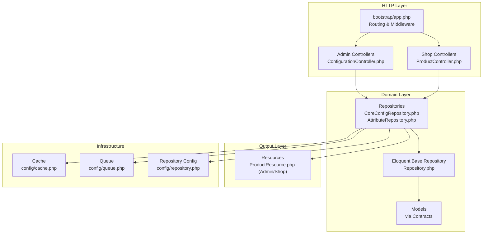
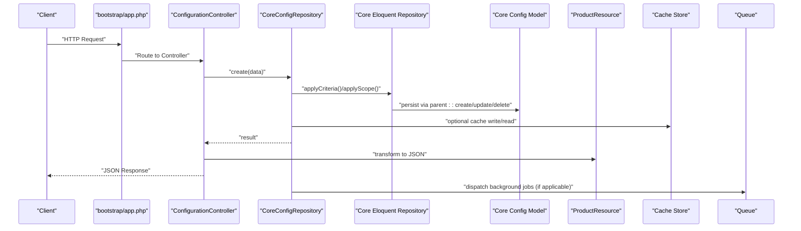
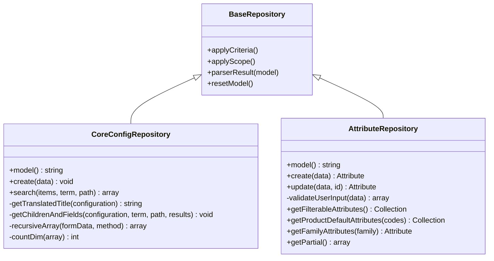
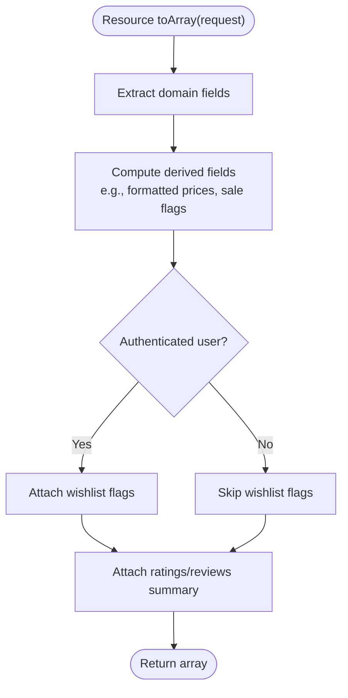
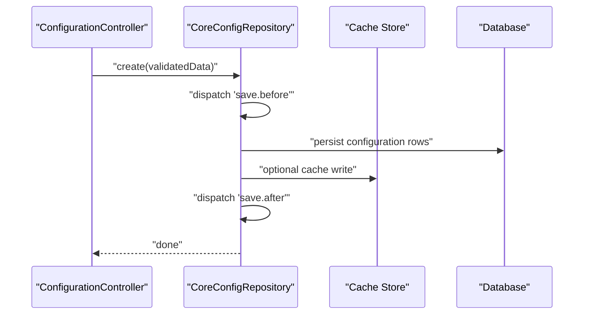
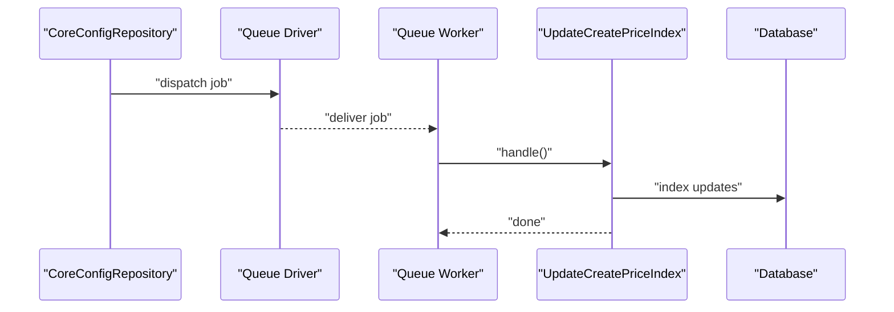
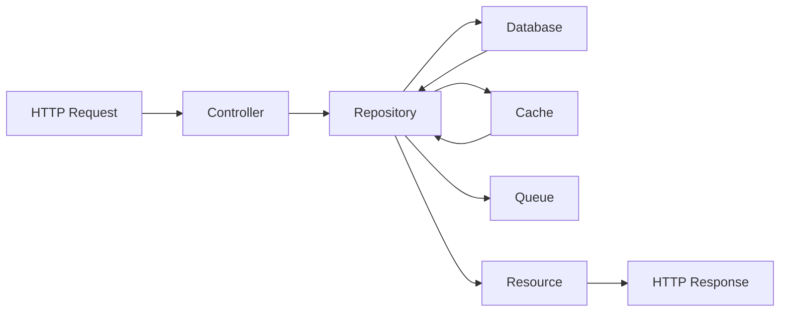
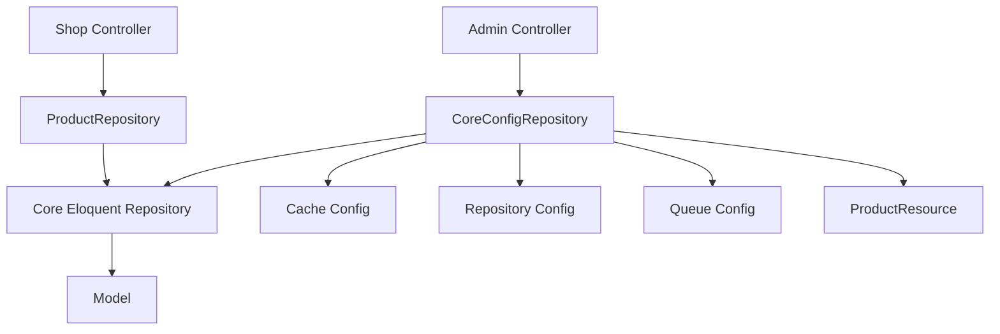

# Data Flow Patterns

<cite>
**Referenced Files in This Document**
- [app.php](file://bootstrap/app.php)
- [repository.php](file://config/repository.php)
- [cache.php](file://config/cache.php)
- [queue.php](file://config/queue.php)
- [Controller.php](file://app/Http/Controllers/Controller.php)
- [Controller.php](file://packages/Webkul/Admin/src/Http/Controllers/Controller.php)
- [Controller.php](file://packages/Webkul/Shop/src/Http/Controllers/Controller.php)
- [ConfigurationController.php](file://packages/Webkul/Admin/src/Http/Controllers/ConfigurationController.php)
- [ProductController.php](file://packages/Webkul/Shop/src/Http/Controllers/ProductController.php)
- [Repository.php](file://packages/Webkul/Core/src/Eloquent/Repository.php)
- [CoreConfigRepository.php](file://packages/Webkul/Core/src/Repositories/CoreConfigRepository.php)
- [AttributeRepository.php](file://packages/Webkul/Attribute/src/Repositories/AttributeRepository.php)
- [ProductResource.php](file://packages/Webkul/Admin/src/Http/Resources/ProductResource.php)
- [ProductResource.php](file://packages/Webkul/Shop/src/Http/Resources/ProductResource.php)
- [UpdateCreatePriceIndex.php](file://packages/Webkul/Product/src/Jobs/UpdateCreatePriceIndex.php)
- [UpdateCreateInventoryIndex.php](file://packages/Webkul/Product/src/Jobs/UpdateCreateInventoryIndex.php)
</cite>

## Table of Contents
1. [Introduction](#introduction)
2. [Project Structure](#project-structure)
3. [Core Components](#core-components)
4. [Architecture Overview](#architecture-overview)
5. [Detailed Component Analysis](#detailed-component-analysis)
6. [Dependency Analysis](#dependency-analysis)
7. [Performance Considerations](#performance-considerations)
8. [Troubleshooting Guide](#troubleshooting-guide)
9. [Conclusion](#conclusion)

## Introduction
This document explains the data flow patterns in Frooxi 2.4 across HTTP requests, controllers, repositories, models, resources, caching, and queues. It focuses on:
- The request-response lifecycle from HTTP requests through controllers to repositories and models
- Repository pattern implementation and criteria-based filtering
- Data transformation via resources and presenter-style serialization
- Event-driven updates and cache invalidation
- Data movement between API responses, database operations, and cache management
- Examples of request validation, data sanitization, and response formatting
- Asynchronous processing via job queues and background tasks
- Error handling patterns and data consistency mechanisms

## Project Structure
Frooxi 2.4 follows a modular Laravel application structure with feature-based packages under packages/Webkul. The HTTP layer is configured in the bootstrap file, while configuration files define repository, cache, and queue behavior. Controllers live under each module’s Http/Controllers namespace, repositories under Repositories, and resources under Http/Resources.

**Diagram sources**
- [app.php:14-56](file://bootstrap/app.php#L14-L56)
- [ConfigurationController.php:13-112](file://packages/Webkul/Admin/src/Http/Controllers/ConfigurationController.php#L13-L112)
- [ProductController.php:12-156](file://packages/Webkul/Shop/src/Http/Controllers/ProductController.php#L12-L156)
- [CoreConfigRepository.php:12-241](file://packages/Webkul/Core/src/Repositories/CoreConfigRepository.php#L12-L241)
- [AttributeRepository.php:12-253](file://packages/Webkul/Attribute/src/Repositories/AttributeRepository.php#L12-L253)
- [Repository.php:9-224](file://packages/Webkul/Core/src/Eloquent/Repository.php#L9-L224)
- [ProductResource.php:8-32](file://packages/Webkul/Admin/src/Http/Resources/ProductResource.php#L8-L32)
- [ProductResource.php:9-62](file://packages/Webkul/Shop/src/Http/Resources/ProductResource.php#L9-L62)
- [cache.php:1-109](file://config/cache.php#L1-L109)
- [queue.php:1-113](file://config/queue.php#L1-L113)
- [repository.php:12-294](file://config/repository.php#L12-L294)

**Section sources**
- [app.php:14-56](file://bootstrap/app.php#L14-L56)
- [repository.php:12-294](file://config/repository.php#L12-L294)
- [cache.php:1-109](file://config/cache.php#L1-L109)
- [queue.php:1-113](file://config/queue.php#L1-L113)

## Core Components
- HTTP Controllers: Admin and Shop controllers orchestrate request handling, validation, and delegation to repositories. They return responses or redirects and leverage middleware for CSRF and secure headers.
- Repositories: Domain-specific repositories encapsulate data access, apply criteria, and integrate caching and event hooks. They extend a base repository that applies scopes and parsing.
- Models and Contracts: Repositories operate against model contracts and underlying Eloquent models.
- Resources: Transform domain objects into standardized JSON structures for API responses.
- Configuration: Repository, cache, and queue configurations define pagination, serialization, cache TTL, and queue backends.

Key responsibilities:
- Controllers validate input and delegate to repositories
- Repositories apply criteria, manage caching, and trigger events
- Resources format output consistently
- Cache and queue configs govern performance and async processing

**Section sources**
- [Controller.php:11-25](file://packages/Webkul/Admin/src/Http/Controllers/Controller.php#L11-L25)
- [Controller.php:9-13](file://packages/Webkul/Shop/src/Http/Controllers/Controller.php#L9-L13)
- [Repository.php:9-224](file://packages/Webkul/Core/src/Eloquent/Repository.php#L9-L224)
- [CoreConfigRepository.php:12-241](file://packages/Webkul/Core/src/Repositories/CoreConfigRepository.php#L12-L241)
- [AttributeRepository.php:12-253](file://packages/Webkul/Attribute/src/Repositories/AttributeRepository.php#L12-L253)
- [ProductResource.php:8-32](file://packages/Webkul/Admin/src/Http/Resources/ProductResource.php#L8-L32)
- [ProductResource.php:9-62](file://packages/Webkul/Shop/src/Http/Resources/ProductResource.php#L9-L62)

## Architecture Overview
The request flow typically proceeds as follows:
- Bootstrap configures routing and middleware
- HTTP request reaches a controller action
- Controller validates input and delegates to a repository
- Repository applies criteria, queries the model, and parses results
- Optional: Repository triggers events and manages cache
- Response is formatted via a resource and returned to the client
- Background tasks are dispatched to queues for asynchronous work

**Diagram sources**
- [app.php:14-56](file://bootstrap/app.php#L14-L56)
- [ConfigurationController.php:53-96](file://packages/Webkul/Admin/src/Http/Controllers/ConfigurationController.php#L53-L96)
- [CoreConfigRepository.php:25-116](file://packages/Webkul/Core/src/Repositories/CoreConfigRepository.php#L25-L116)
- [Repository.php:131-156](file://packages/Webkul/Core/src/Eloquent/Repository.php#L131-L156)
- [ProductResource.php:16-31](file://packages/Webkul/Admin/src/Http/Resources/ProductResource.php#L16-L31)
- [queue.php:31-75](file://config/queue.php#L31-L75)

## Detailed Component Analysis

### Repository Pattern Implementation
The repository pattern centralizes data access and adds cross-cutting concerns like caching, criteria application, and event dispatching.

Key behaviors:
- Criteria application and scoping are handled by the base repository before querying the model
- Caching is configurable per repository and method, with clean listeners on create/update/delete
- Events are dispatched around save operations to trigger side effects

**Diagram sources**
- [Repository.php:9-224](file://packages/Webkul/Core/src/Eloquent/Repository.php#L9-L224)
- [CoreConfigRepository.php:12-241](file://packages/Webkul/Core/src/Repositories/CoreConfigRepository.php#L12-L241)
- [AttributeRepository.php:12-253](file://packages/Webkul/Attribute/src/Repositories/AttributeRepository.php#L12-L253)

**Section sources**
- [Repository.php:53-80](file://packages/Webkul/Core/src/Eloquent/Repository.php#L53-L80)
- [Repository.php:131-156](file://packages/Webkul/Core/src/Eloquent/Repository.php#L131-L156)
- [repository.php:49-191](file://config/repository.php#L49-L191)

### Data Transformation and Resource Formatting
Resources transform domain models into normalized JSON structures for clients. Admin and Shop share similar patterns but include environment-specific fields.

**Diagram sources**
- [ProductResource.php:30-61](file://packages/Webkul/Shop/src/Http/Resources/ProductResource.php#L30-L61)
- [ProductResource.php:16-31](file://packages/Webkul/Admin/src/Http/Resources/ProductResource.php#L16-L31)

**Section sources**
- [ProductResource.php:16-31](file://packages/Webkul/Admin/src/Http/Resources/ProductResource.php#L16-L31)
- [ProductResource.php:30-61](file://packages/Webkul/Shop/src/Http/Resources/ProductResource.php#L30-L61)

### Event-Driven Data Flows and Cache Management
Configuration saves trigger pre/post events and may update cache entries. Cache configuration allows enabling/disabling and specifying TTL and allowed methods.

**Diagram sources**
- [ConfigurationController.php:53-96](file://packages/Webkul/Admin/src/Http/Controllers/ConfigurationController.php#L53-L96)
- [CoreConfigRepository.php:27-115](file://packages/Webkul/Core/src/Repositories/CoreConfigRepository.php#L27-L115)
- [repository.php:49-191](file://config/repository.php#L49-L191)

**Section sources**
- [CoreConfigRepository.php:27-115](file://packages/Webkul/Core/src/Repositories/CoreConfigRepository.php#L27-L115)
- [repository.php:49-191](file://config/repository.php#L49-L191)

### Request Validation, Data Sanitization, and Response Formatting
Controllers coordinate validation and sanitization, while repositories enforce domain rules and normalize data.

- Validation: Controllers use form request classes to validate inputs and flash errors on failure.
- Sanitization: Repositories normalize arrays, handle file uploads, and convert nested structures into flat keys for persistence.
- Response: Resources format output consistently for both Admin and Shop contexts.

Examples by file:
- Validation and redirect on failure: [ConfigurationController.php:53-96](file://packages/Webkul/Admin/src/Http/Controllers/ConfigurationController.php#L53-L96)
- Data normalization and persistence: [CoreConfigRepository.php:25-116](file://packages/Webkul/Core/src/Repositories/CoreConfigRepository.php#L25-L116)
- Attribute input validation: [AttributeRepository.php:125-149](file://packages/Webkul/Attribute/src/Repositories/AttributeRepository.php#L125-L149)
- Resource formatting: [ProductResource.php:16-31](file://packages/Webkul/Admin/src/Http/Resources/ProductResource.php#L16-L31), [ProductResource.php:30-61](file://packages/Webkul/Shop/src/Http/Resources/ProductResource.php#L30-L61)

**Section sources**
- [ConfigurationController.php:53-96](file://packages/Webkul/Admin/src/Http/Controllers/ConfigurationController.php#L53-L96)
- [CoreConfigRepository.php:25-116](file://packages/Webkul/Core/src/Repositories/CoreConfigRepository.php#L25-L116)
- [AttributeRepository.php:125-149](file://packages/Webkul/Attribute/src/Repositories/AttributeRepository.php#L125-L149)
- [ProductResource.php:16-31](file://packages/Webkul/Admin/src/Http/Resources/ProductResource.php#L16-L31)
- [ProductResource.php:30-61](file://packages/Webkul/Shop/src/Http/Resources/ProductResource.php#L30-L61)

### Asynchronous Processing, Job Queues, and Background Tasks
Background tasks are modeled as jobs and dispatched to queues. The queue configuration defines connections and retry behavior.

**Diagram sources**
- [UpdateCreatePriceIndex.php](file://packages/Webkul/Product/src/Jobs/UpdateCreatePriceIndex.php)
- [UpdateCreateInventoryIndex.php](file://packages/Webkul/Product/src/Jobs/UpdateCreateInventoryIndex.php)
- [queue.php:31-75](file://config/queue.php#L31-L75)

**Section sources**
- [queue.php:16-113](file://config/queue.php#L16-L113)
- [UpdateCreatePriceIndex.php](file://packages/Webkul/Product/src/Jobs/UpdateCreatePriceIndex.php)
- [UpdateCreateInventoryIndex.php](file://packages/Webkul/Product/src/Jobs/UpdateCreateInventoryIndex.php)

### Data Movement Between Layers
- API responses: Controllers return JSON responses transformed by resources
- Database operations: Repositories persist and query models after applying criteria and scopes
- Cache management: Repository configuration enables cache per method and repository, with automatic clearing on create/update/delete

**Diagram sources**
- [ConfigurationController.php:53-96](file://packages/Webkul/Admin/src/Http/Controllers/ConfigurationController.php#L53-L96)
- [CoreConfigRepository.php:25-116](file://packages/Webkul/Core/src/Repositories/CoreConfigRepository.php#L25-L116)
- [ProductResource.php:16-31](file://packages/Webkul/Admin/src/Http/Resources/ProductResource.php#L16-L31)
- [repository.php:49-191](file://config/repository.php#L49-L191)
- [cache.php:34-93](file://config/cache.php#L34-L93)

**Section sources**
- [repository.php:49-191](file://config/repository.php#L49-L191)
- [cache.php:34-93](file://config/cache.php#L34-L93)

### Error Handling Patterns and Data Consistency
- Validation failures: Controllers return redirects with flashed error messages
- External resource downloads: Controllers validate URLs and abort on invalid inputs
- Database consistency: Repository methods reset model state after queries to prevent scope leakage
- Cache consistency: Repository configuration supports cleaning on create/update/delete to maintain cache coherence

**Section sources**
- [ConfigurationController.php:53-96](file://packages/Webkul/Admin/src/Http/Controllers/ConfigurationController.php#L53-L96)
- [ProductController.php:108-154](file://packages/Webkul/Shop/src/Http/Controllers/ProductController.php#L108-L154)
- [Repository.php:87-92](file://packages/Webkul/Core/src/Eloquent/Repository.php#L87-L92)
- [repository.php:88-113](file://config/repository.php#L88-L113)

## Dependency Analysis
- Controllers depend on repositories for data access and on resources for response formatting
- Repositories depend on the base repository for scoping and parsing, on models for persistence, and on configuration for caching and criteria
- Resources depend on domain instances and helper utilities for formatting
- Infrastructure configuration (cache, queue, repository) influences performance and behavior across layers

**Diagram sources**
- [ConfigurationController.php:18-18](file://packages/Webkul/Admin/src/Http/Controllers/ConfigurationController.php#L18-L18)
- [ProductController.php:19-24](file://packages/Webkul/Shop/src/Http/Controllers/ProductController.php#L19-L24)
- [CoreConfigRepository.php:12-241](file://packages/Webkul/Core/src/Repositories/CoreConfigRepository.php#L12-L241)
- [Repository.php:9-224](file://packages/Webkul/Core/src/Eloquent/Repository.php#L9-L224)
- [cache.php:1-109](file://config/cache.php#L1-L109)
- [repository.php:12-294](file://config/repository.php#L12-L294)
- [queue.php:1-113](file://config/queue.php#L1-L113)
- [ProductResource.php:16-31](file://packages/Webkul/Admin/src/Http/Resources/ProductResource.php#L16-L31)

**Section sources**
- [ConfigurationController.php:18-18](file://packages/Webkul/Admin/src/Http/Controllers/ConfigurationController.php#L18-L18)
- [ProductController.php:19-24](file://packages/Webkul/Shop/src/Http/Controllers/ProductController.php#L19-L24)
- [CoreConfigRepository.php:12-241](file://packages/Webkul/Core/src/Repositories/CoreConfigRepository.php#L12-L241)
- [Repository.php:9-224](file://packages/Webkul/Core/src/Eloquent/Repository.php#L9-L224)
- [cache.php:1-109](file://config/cache.php#L1-L109)
- [repository.php:12-294](file://config/repository.php#L12-L294)
- [queue.php:1-113](file://config/queue.php#L1-L113)
- [ProductResource.php:16-31](file://packages/Webkul/Admin/src/Http/Resources/ProductResource.php#L16-L31)

## Performance Considerations
- Pagination defaults and criteria parameters are configurable to limit payload sizes and optimize queries
- Cache configuration supports multiple backends and per-repository enablement with TTL and allowed methods
- Queue backends allow offloading heavy tasks like indexing to background workers
- Resource formatting avoids redundant computations by deriving fields only when needed

[No sources needed since this section provides general guidance]

## Troubleshooting Guide
Common issues and resolutions:
- Validation errors: Ensure form requests are passed to controllers and check flashed messages on redirect
- External download failures: Verify URL scheme, host resolution, and IP range checks before downloading
- Cache inconsistencies: Confirm cache clean settings and repository-level overrides are enabled
- Queue job failures: Review failed job storage and queue connection settings

**Section sources**
- [ConfigurationController.php:53-96](file://packages/Webkul/Admin/src/Http/Controllers/ConfigurationController.php#L53-L96)
- [ProductController.php:108-154](file://packages/Webkul/Shop/src/Http/Controllers/ProductController.php#L108-L154)
- [repository.php:88-113](file://config/repository.php#L88-L113)
- [queue.php:106-110](file://config/queue.php#L106-L110)

## Conclusion
Frooxi 2.4 employs a layered architecture with clear separation of concerns:
- Controllers handle HTTP concerns and orchestration
- Repositories encapsulate persistence, criteria, caching, and events
- Resources provide consistent output formatting
- Configuration files govern caching, queues, and repository behavior

This design yields predictable data flows, supports asynchronous processing, and maintains consistency through events and cache policies.