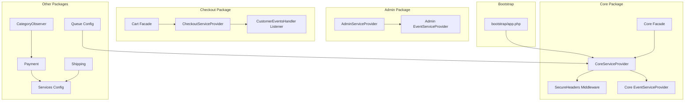
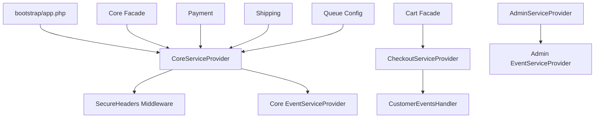
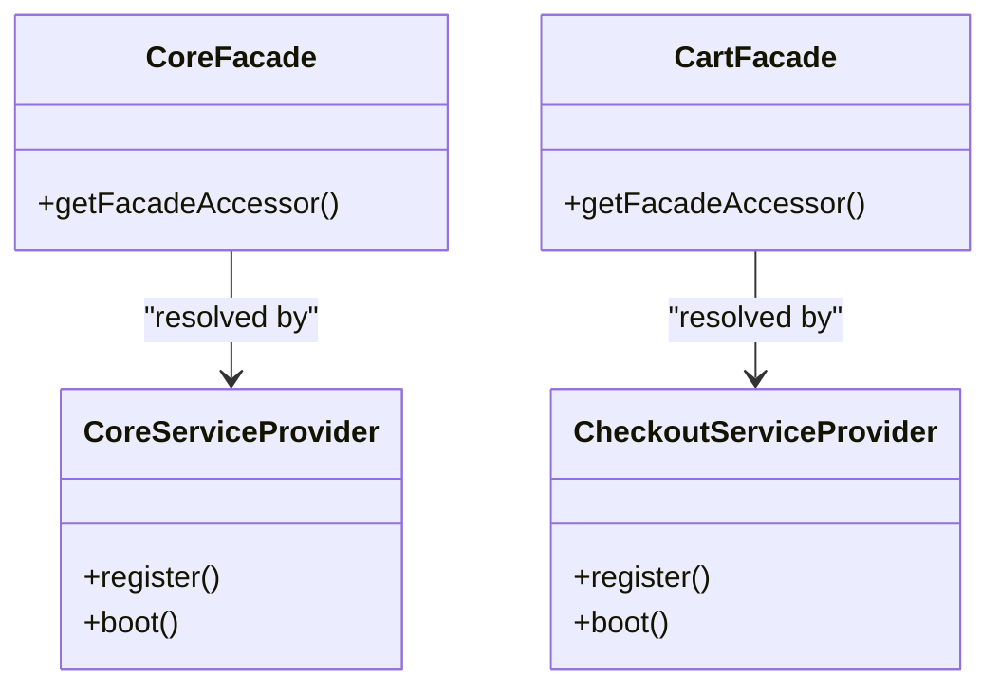
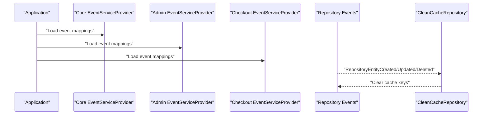
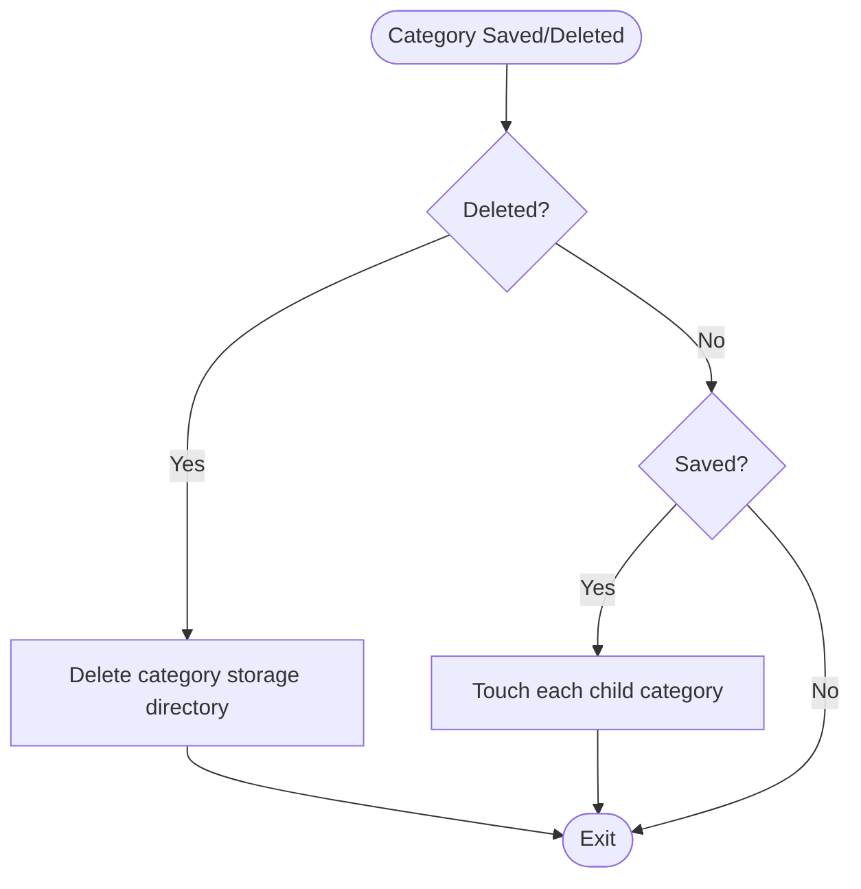
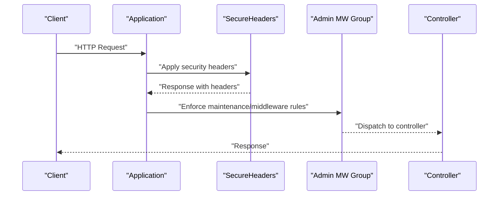
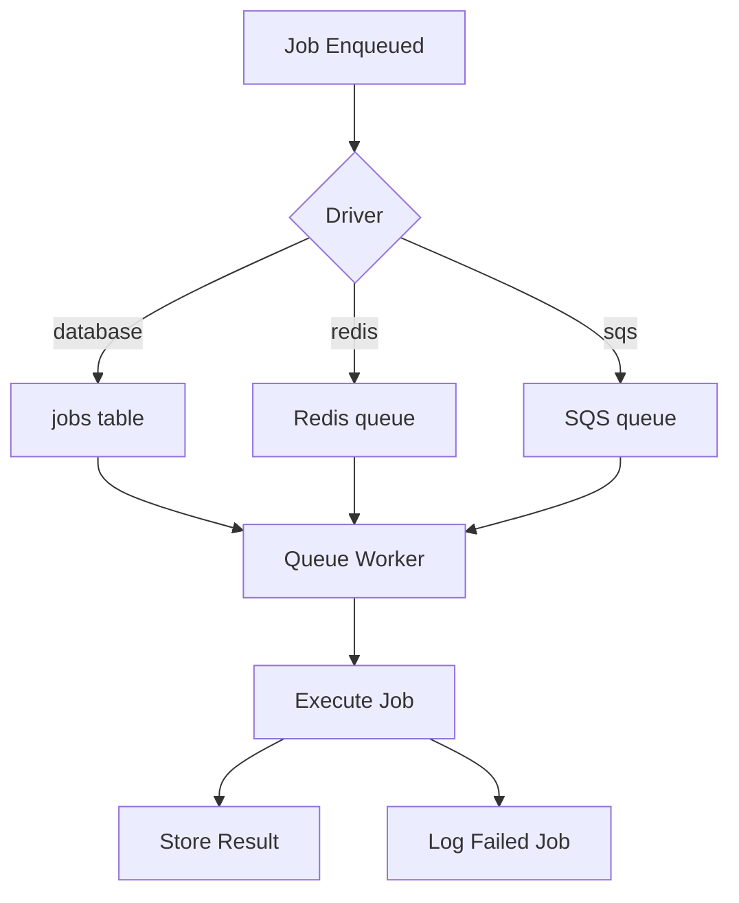
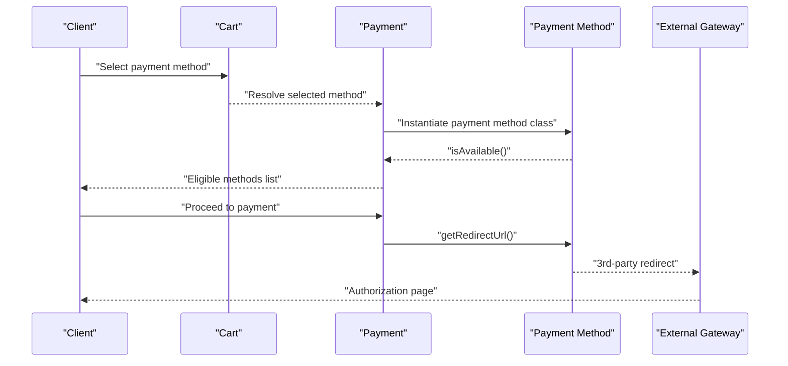
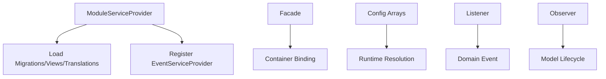
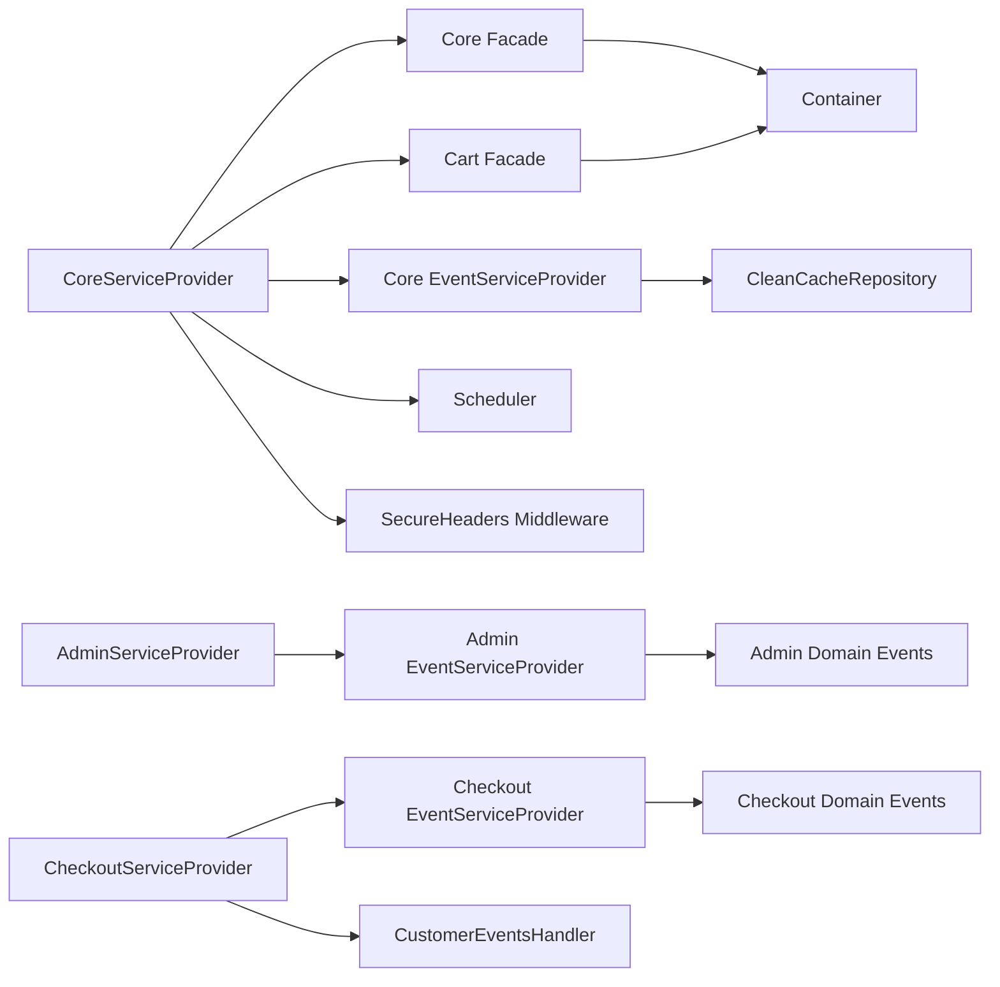

# Integration Patterns

<cite>
**Referenced Files in This Document**
- [bootstrap/app.php](file://bootstrap/app.php)
- [config/services.php](file://config/services.php)
- [config/queue.php](file://config/queue.php)
- [packages/Webkul/Core/src/Providers/CoreServiceProvider.php](file://packages/Webkul/Core/src/Providers/CoreServiceProvider.php)
- [packages/Webkul/Admin/src/Providers/AdminServiceProvider.php](file://packages/Webkul/Admin/src/Providers/AdminServiceProvider.php)
- [packages/Webkul/Checkout/src/Providers/CheckoutServiceProvider.php](file://packages/Webkul/Checkout/src/Providers/CheckoutServiceProvider.php)
- [packages/Webkul/Core/src/Facades/Core.php](file://packages/Webkul/Core/src/Facades/Core.php)
- [packages/Webkul/Checkout/src/Facades/Cart.php](file://packages/Webkul/Checkout/src/Facades/Cart.php)
- [packages/Webkul/Core/src/Listeners/CleanCacheRepository.php](file://packages/Webkul/Core/src/Listeners/CleanCacheRepository.php)
- [packages/Webkul/Category/src/Observers/CategoryObserver.php](file://packages/Webkul/Category/src/Observers/CategoryObserver.php)
- [packages/Webkul/Payment/src/Payment.php](file://packages/Webkul/Payment/src/Payment.php)
- [packages/Webkul/Shipping/src/Shipping.php](file://packages/Webkul/Shipping/src/Shipping.php)
- [packages/Webkul/Core/src/Http/Middleware/SecureHeaders.php](file://packages/Webkul/Core/src/Http/Middleware/SecureHeaders.php)
- [packages/Webkul/Core/src/Providers/EventServiceProvider.php](file://packages/Webkul/Core/src/Providers/EventServiceProvider.php)
- [packages/Webkul/Admin/src/Providers/EventServiceProvider.php](file://packages/Webkul/Admin/src/Providers/EventServiceProvider.php)
- [packages/Webkul/Checkout/src/Listeners/CustomerEventsHandler.php](file://packages/Webkul/Checkout/src/Listeners/CustomerEventsHandler.php)
</cite>

## Table of Contents
1. [Introduction](#introduction)
2. [Project Structure](#project-structure)
3. [Core Components](#core-components)
4. [Architecture Overview](#architecture-overview)
5. [Detailed Component Analysis](#detailed-component-analysis)
6. [Dependency Analysis](#dependency-analysis)
7. [Performance Considerations](#performance-considerations)
8. [Troubleshooting Guide](#troubleshooting-guide)
9. [Conclusion](#conclusion)
10. [Appendices](#appendices)

## Introduction
This document explains integration patterns in Frooxi 2.4, focusing on how the application composes modular packages, wires facades, registers event listeners, and applies observer patterns for cross-package communication. It also documents middleware integration, queue workers, background job processing, and practical guidance for integrating external services such as payment gateways, shipping providers, and email services. Security considerations and best practices for maintaining compatibility across updates are included.

## Project Structure
Frooxi 2.4 organizes functionality into modular packages under packages/Webkul/<Module>/src. Each module typically exposes:
- Providers to load migrations, views, translations, and register events
- Facades for convenient access to core services
- Listeners and Observers for decoupled cross-cutting concerns
- Configuration files for integrations (e.g., services, queues)

**Diagram sources**
- [bootstrap/app.php:14-56](file://bootstrap/app.php#L14-L56)
- [packages/Webkul/Core/src/Providers/CoreServiceProvider.php:22-63](file://packages/Webkul/Core/src/Providers/CoreServiceProvider.php#L22-L63)
- [packages/Webkul/Core/src/Http/Middleware/SecureHeaders.php:9-67](file://packages/Webkul/Core/src/Http/Middleware/SecureHeaders.php#L9-L67)
- [packages/Webkul/Core/src/Providers/EventServiceProvider.php:7-25](file://packages/Webkul/Core/src/Providers/EventServiceProvider.php#L7-L25)
- [packages/Webkul/Admin/src/Providers/AdminServiceProvider.php:10-34](file://packages/Webkul/Admin/src/Providers/AdminServiceProvider.php#L10-L34)
- [packages/Webkul/Admin/src/Providers/EventServiceProvider.php:14-58](file://packages/Webkul/Admin/src/Providers/EventServiceProvider.php#L14-L58)
- [packages/Webkul/Checkout/src/Providers/CheckoutServiceProvider.php:7-26](file://packages/Webkul/Checkout/src/Providers/CheckoutServiceProvider.php#L7-L26)
- [packages/Webkul/Checkout/src/Listeners/CustomerEventsHandler.php:8-34](file://packages/Webkul/Checkout/src/Listeners/CustomerEventsHandler.php#L8-L34)
- [packages/Webkul/Checkout/src/Facades/Cart.php:8-19](file://packages/Webkul/Checkout/src/Facades/Cart.php#L8-L19)
- [packages/Webkul/Core/src/Facades/Core.php:8-19](file://packages/Webkul/Core/src/Facades/Core.php#L8-L19)
- [packages/Webkul/Payment/src/Payment.php:8-82](file://packages/Webkul/Payment/src/Payment.php#L8-L82)
- [packages/Webkul/Shipping/src/Shipping.php:8-176](file://packages/Webkul/Shipping/src/Shipping.php#L8-L176)
- [packages/Webkul/Category/src/Observers/CategoryObserver.php:8-33](file://packages/Webkul/Category/src/Observers/CategoryObserver.php#L8-L33)
- [config/queue.php:3-112](file://config/queue.php#L3-L112)
- [config/services.php:3-81](file://config/services.php#L3-L81)

**Section sources**
- [bootstrap/app.php:14-56](file://bootstrap/app.php#L14-L56)
- [config/services.php:3-81](file://config/services.php#L3-L81)
- [config/queue.php:3-112](file://config/queue.php#L3-L112)

## Core Components
- Facades: Provide static-like access to container-bound services. Examples:
  - Core facade resolves the base core service for configuration and utilities.
  - Cart facade resolves the checkout cart service for cart operations.
- Event Listeners: Modules register listeners for domain events to trigger cross-package actions.
- Observers: Model lifecycle hooks enable automatic side effects (e.g., storage cleanup, parent touch propagation).
- Middleware: Global and route-specific middleware enforce security and request handling policies.
- Queue and Background Jobs: Centralized configuration supports multiple drivers and failed job handling.

**Section sources**
- [packages/Webkul/Core/src/Facades/Core.php:8-19](file://packages/Webkul/Core/src/Facades/Core.php#L8-L19)
- [packages/Webkul/Checkout/src/Facades/Cart.php:8-19](file://packages/Webkul/Checkout/src/Facades/Cart.php#L8-L19)
- [packages/Webkul/Core/src/Providers/EventServiceProvider.php:14-24](file://packages/Webkul/Core/src/Providers/EventServiceProvider.php#L14-L24)
- [packages/Webkul/Admin/src/Providers/EventServiceProvider.php:21-57](file://packages/Webkul/Admin/src/Providers/EventServiceProvider.php#L21-L57)
- [packages/Webkul/Category/src/Observers/CategoryObserver.php:16-32](file://packages/Webkul/Category/src/Observers/CategoryObserver.php#L16-L32)
- [packages/Webkul/Core/src/Http/Middleware/SecureHeaders.php:24-49](file://packages/Webkul/Core/src/Http/Middleware/SecureHeaders.php#L24-L49)
- [config/queue.php:31-112](file://config/queue.php#L31-L112)

## Architecture Overview
Frooxi 2.4 composes a layered architecture:
- Bootstrap configures routing, middleware, scheduling, and exception handling.
- Core package registers global events, schedules recurring tasks, and binds facades.
- Admin and Shop packages register their own event providers and middleware groups.
- Checkout integrates customer login events to synchronize guest carts with authenticated users.
- Payment and Shipping consume configuration-driven provider lists to deliver runtime integrations.
- Queue configuration centralizes background job processing.

**Diagram sources**
- [bootstrap/app.php:14-56](file://bootstrap/app.php#L14-L56)
- [packages/Webkul/Core/src/Providers/CoreServiceProvider.php:22-63](file://packages/Webkul/Core/src/Providers/CoreServiceProvider.php#L22-L63)
- [packages/Webkul/Admin/src/Providers/AdminServiceProvider.php:23-34](file://packages/Webkul/Admin/src/Providers/AdminServiceProvider.php#L23-L34)
- [packages/Webkul/Checkout/src/Providers/CheckoutServiceProvider.php:20-25](file://packages/Webkul/Checkout/src/Providers/CheckoutServiceProvider.php#L20-L25)
- [packages/Webkul/Core/src/Http/Middleware/SecureHeaders.php:24-49](file://packages/Webkul/Core/src/Http/Middleware/SecureHeaders.php#L24-L49)
- [packages/Webkul/Core/src/Providers/EventServiceProvider.php:14-24](file://packages/Webkul/Core/src/Providers/EventServiceProvider.php#L14-L24)
- [packages/Webkul/Admin/src/Providers/EventServiceProvider.php:21-57](file://packages/Webkul/Admin/src/Providers/EventServiceProvider.php#L21-L57)
- [packages/Webkul/Checkout/src/Listeners/CustomerEventsHandler.php:30-33](file://packages/Webkul/Checkout/src/Listeners/CustomerEventsHandler.php#L30-L33)
- [packages/Webkul/Core/src/Facades/Core.php:8-19](file://packages/Webkul/Core/src/Facades/Core.php#L8-L19)
- [packages/Webkul/Checkout/src/Facades/Cart.php:8-19](file://packages/Webkul/Checkout/src/Facades/Cart.php#L8-L19)
- [packages/Webkul/Payment/src/Payment.php:15-81](file://packages/Webkul/Payment/src/Payment.php#L15-L81)
- [packages/Webkul/Shipping/src/Shipping.php:22-175](file://packages/Webkul/Shipping/src/Shipping.php#L22-L175)
- [config/queue.php:31-112](file://config/queue.php#L31-L112)

## Detailed Component Analysis

### Facade Usage
Facades simplify access to container-bound services:
- Core facade resolves the base core service for configuration and utilities.
- Cart facade resolves the checkout cart service for cart operations.

**Diagram sources**
- [packages/Webkul/Core/src/Facades/Core.php:8-19](file://packages/Webkul/Core/src/Facades/Core.php#L8-L19)
- [packages/Webkul/Checkout/src/Facades/Cart.php:8-19](file://packages/Webkul/Checkout/src/Facades/Cart.php#L8-L19)
- [packages/Webkul/Core/src/Providers/CoreServiceProvider.php:27-34](file://packages/Webkul/Core/src/Providers/CoreServiceProvider.php#L27-L34)
- [packages/Webkul/Checkout/src/Providers/CheckoutServiceProvider.php:12-15](file://packages/Webkul/Checkout/src/Providers/CheckoutServiceProvider.php#L12-L15)

**Section sources**
- [packages/Webkul/Core/src/Facades/Core.php:8-19](file://packages/Webkul/Core/src/Facades/Core.php#L8-L19)
- [packages/Webkul/Checkout/src/Facades/Cart.php:8-19](file://packages/Webkul/Checkout/src/Facades/Cart.php#L8-L19)
- [packages/Webkul/Core/src/Providers/CoreServiceProvider.php:27-34](file://packages/Webkul/Core/src/Providers/CoreServiceProvider.php#L27-L34)
- [packages/Webkul/Checkout/src/Providers/CheckoutServiceProvider.php:12-15](file://packages/Webkul/Checkout/src/Providers/CheckoutServiceProvider.php#L12-L15)

### Event Listener Registration
Modules register event listeners through dedicated EventServiceProvider classes:
- Core listens to repository events to clean caches.
- Admin listens to customer, order, invoice, shipment, refund, and GDPR-related events.
- Checkout registers its own event provider and a customer login listener to merge guest carts.

**Diagram sources**
- [packages/Webkul/Core/src/Providers/EventServiceProvider.php:14-24](file://packages/Webkul/Core/src/Providers/EventServiceProvider.php#L14-L24)
- [packages/Webkul/Admin/src/Providers/EventServiceProvider.php:21-57](file://packages/Webkul/Admin/src/Providers/EventServiceProvider.php#L21-L57)
- [packages/Webkul/Checkout/src/Providers/CheckoutServiceProvider.php:22-25](file://packages/Webkul/Checkout/src/Providers/CheckoutServiceProvider.php#L22-L25)
- [packages/Webkul/Core/src/Listeners/CleanCacheRepository.php:10-39](file://packages/Webkul/Core/src/Listeners/CleanCacheRepository.php#L10-L39)

**Section sources**
- [packages/Webkul/Core/src/Providers/EventServiceProvider.php:14-24](file://packages/Webkul/Core/src/Providers/EventServiceProvider.php#L14-L24)
- [packages/Webkul/Admin/src/Providers/EventServiceProvider.php:21-57](file://packages/Webkul/Admin/src/Providers/EventServiceProvider.php#L21-L57)
- [packages/Webkul/Checkout/src/Providers/CheckoutServiceProvider.php:22-25](file://packages/Webkul/Checkout/src/Providers/CheckoutServiceProvider.php#L22-L25)
- [packages/Webkul/Core/src/Listeners/CleanCacheRepository.php:10-39](file://packages/Webkul/Core/src/Listeners/CleanCacheRepository.php#L10-L39)

### Observer Pattern for Cross-Package Communication
Observers react to model lifecycle events:
- CategoryObserver deletes associated storage directories on deletion and touches child categories on save.

**Diagram sources**
- [packages/Webkul/Category/src/Observers/CategoryObserver.php:16-32](file://packages/Webkul/Category/src/Observers/CategoryObserver.php#L16-L32)

**Section sources**
- [packages/Webkul/Category/src/Observers/CategoryObserver.php:16-32](file://packages/Webkul/Category/src/Observers/CategoryObserver.php#L16-L32)

### Middleware Integration
Global middleware configuration:
- Removes default maintenance and empty-string-to-null middleware and appends secure headers and install guard.
- Replaces cookie encryption middleware group with a custom implementation.
- Validates CSRF tokens except for specific routes (e.g., Stripe webhooks).

Route-level middleware:
- Admin routes apply a middleware group including maintenance prevention.

Security headers middleware:
- Sets strict security headers and removes unwanted ones.

**Diagram sources**
- [bootstrap/app.php:20-49](file://bootstrap/app.php#L20-L49)
- [packages/Webkul/Admin/src/Providers/AdminServiceProvider.php:23-25](file://packages/Webkul/Admin/src/Providers/AdminServiceProvider.php#L23-L25)
- [packages/Webkul/Core/src/Http/Middleware/SecureHeaders.php:24-49](file://packages/Webkul/Core/src/Http/Middleware/SecureHeaders.php#L24-L49)

**Section sources**
- [bootstrap/app.php:20-49](file://bootstrap/app.php#L20-L49)
- [packages/Webkul/Admin/src/Providers/AdminServiceProvider.php:23-25](file://packages/Webkul/Admin/src/Providers/AdminServiceProvider.php#L23-L25)
- [packages/Webkul/Core/src/Http/Middleware/SecureHeaders.php:24-49](file://packages/Webkul/Core/src/Http/Middleware/SecureHeaders.php#L24-L49)

### Queue Workers and Background Job Processing
Queue configuration supports multiple drivers and failed job storage:
- Default connection, driver-specific options, batching, and failed job logging.
- Core schedules recurring tasks (e.g., invoice cron, exchange rate updates) via the scheduler.

**Diagram sources**
- [config/queue.php:31-112](file://config/queue.php#L31-L112)
- [packages/Webkul/Core/src/Providers/CoreServiceProvider.php:55-104](file://packages/Webkul/Core/src/Providers/CoreServiceProvider.php#L55-L104)

**Section sources**
- [config/queue.php:31-112](file://config/queue.php#L31-L112)
- [packages/Webkul/Core/src/Providers/CoreServiceProvider.php:55-104](file://packages/Webkul/Core/src/Providers/CoreServiceProvider.php#L55-L104)

### External Service Integrations
Third-party integrations are configured centrally:
- Email providers (SES, Postmark, Resend), Slack notifications, social providers (Facebook, Google, etc.), and exchange rate APIs.
- Payment and shipping providers are resolved dynamically from configuration arrays.

Payment gateway integration pattern:
- Enumerate configured payment methods, instantiate their classes, and filter availability.
- Redirect URL resolution per cart’s selected payment method.

Shipping provider integration pattern:
- Iterate carriers from configuration, instantiate classes, calculate rates, persist them to the cart, and group by carrier.

**Diagram sources**
- [packages/Webkul/Payment/src/Payment.php:15-81](file://packages/Webkul/Payment/src/Payment.php#L15-L81)
- [config/services.php:17-81](file://config/services.php#L17-L81)

**Section sources**
- [config/services.php:17-81](file://config/services.php#L17-L81)
- [packages/Webkul/Payment/src/Payment.php:15-81](file://packages/Webkul/Payment/src/Payment.php#L15-L81)
- [packages/Webkul/Shipping/src/Shipping.php:22-175](file://packages/Webkul/Shipping/src/Shipping.php#L22-L175)

### Plugin Architecture, Hook System, and Extension Points
- Module providers load migrations, views, translations, and register event providers.
- Facades expose container-bound services for easy extension.
- Configuration arrays (e.g., payment methods, carriers, exchange providers) act as extension points.
- Listeners and observers provide hooks for cross-module behavior without tight coupling.

**Diagram sources**
- [packages/Webkul/Checkout/src/Providers/CheckoutServiceProvider.php:20-25](file://packages/Webkul/Checkout/src/Providers/CheckoutServiceProvider.php#L20-L25)
- [packages/Webkul/Core/src/Facades/Core.php:8-19](file://packages/Webkul/Core/src/Facades/Core.php#L8-L19)
- [packages/Webkul/Payment/src/Payment.php:31-43](file://packages/Webkul/Payment/src/Payment.php#L31-L43)
- [packages/Webkul/Shipping/src/Shipping.php:32-42](file://packages/Webkul/Shipping/src/Shipping.php#L32-L42)
- [packages/Webkul/Core/src/Listeners/CleanCacheRepository.php:12-38](file://packages/Webkul/Core/src/Listeners/CleanCacheRepository.php#L12-L38)
- [packages/Webkul/Category/src/Observers/CategoryObserver.php:16-32](file://packages/Webkul/Category/src/Observers/CategoryObserver.php#L16-L32)

**Section sources**
- [packages/Webkul/Checkout/src/Providers/CheckoutServiceProvider.php:20-25](file://packages/Webkul/Checkout/src/Providers/CheckoutServiceProvider.php#L20-L25)
- [packages/Webkul/Core/src/Facades/Core.php:8-19](file://packages/Webkul/Core/src/Facades/Core.php#L8-L19)
- [packages/Webkul/Payment/src/Payment.php:31-43](file://packages/Webkul/Payment/src/Payment.php#L31-L43)
- [packages/Webkul/Shipping/src/Shipping.php:32-42](file://packages/Webkul/Shipping/src/Shipping.php#L32-L42)
- [packages/Webkul/Core/src/Listeners/CleanCacheRepository.php:12-38](file://packages/Webkul/Core/src/Listeners/CleanCacheRepository.php#L12-L38)
- [packages/Webkul/Category/src/Observers/CategoryObserver.php:16-32](file://packages/Webkul/Category/src/Observers/CategoryObserver.php#L16-L32)

### API Consumption Patterns
- Configuration-driven discovery: Payment and shipping providers are resolved from configuration arrays, enabling dynamic selection and swapping without code changes.
- Facade access: Facades provide a concise API surface for cart and core operations, simplifying integration points.

**Section sources**
- [packages/Webkul/Payment/src/Payment.php:62-67](file://packages/Webkul/Payment/src/Payment.php#L62-L67)
- [packages/Webkul/Shipping/src/Shipping.php:126-146](file://packages/Webkul/Shipping/src/Shipping.php#L126-L146)
- [packages/Webkul/Checkout/src/Facades/Cart.php:8-19](file://packages/Webkul/Checkout/src/Facades/Cart.php#L8-L19)

### Custom Integration Development
- Define a new provider to load views, migrations, and register an EventServiceProvider.
- Add entries to configuration arrays (e.g., payment_methods, carriers) pointing to your implementation class.
- Implement a facade if you need a static-like interface.
- Register listeners for relevant domain events to integrate with cross-cutting concerns.

**Section sources**
- [packages/Webkul/Checkout/src/Providers/CheckoutServiceProvider.php:20-25](file://packages/Webkul/Checkout/src/Providers/CheckoutServiceProvider.php#L20-L25)
- [packages/Webkul/Payment/src/Payment.php:31-54](file://packages/Webkul/Payment/src/Payment.php#L31-L54)
- [packages/Webkul/Shipping/src/Shipping.php:126-146](file://packages/Webkul/Shipping/src/Shipping.php#L126-L146)
- [packages/Webkul/Core/src/Facades/Core.php:8-19](file://packages/Webkul/Core/src/Facades/Core.php#L8-L19)

### Third-Party Service Integration
- Configure credentials in the services configuration file.
- Use facades or configuration lookups to resolve provider implementations.
- For asynchronous operations, enqueue jobs via the configured queue driver.

**Section sources**
- [config/services.php:17-81](file://config/services.php#L17-L81)
- [config/queue.php:31-112](file://config/queue.php#L31-L112)

## Dependency Analysis
Key dependencies and relationships:
- CoreServiceProvider depends on the container to bind facades, override maintenance middleware, and schedule recurring tasks.
- Event providers depend on domain events to trigger cross-module actions.
- Facades depend on container bindings established by their respective service providers.
- Middleware depends on request/response lifecycle to set headers and enforce policies.

**Diagram sources**
- [packages/Webkul/Core/src/Providers/CoreServiceProvider.php:27-140](file://packages/Webkul/Core/src/Providers/CoreServiceProvider.php#L27-L140)
- [packages/Webkul/Admin/src/Providers/AdminServiceProvider.php:33-34](file://packages/Webkul/Admin/src/Providers/AdminServiceProvider.php#L33-L34)
- [packages/Webkul/Checkout/src/Providers/CheckoutServiceProvider.php:22-25](file://packages/Webkul/Checkout/src/Providers/CheckoutServiceProvider.php#L22-L25)
- [packages/Webkul/Checkout/src/Listeners/CustomerEventsHandler.php:30-33](file://packages/Webkul/Checkout/src/Listeners/CustomerEventsHandler.php#L30-L33)
- [packages/Webkul/Core/src/Facades/Core.php:8-19](file://packages/Webkul/Core/src/Facades/Core.php#L8-L19)
- [packages/Webkul/Checkout/src/Facades/Cart.php:8-19](file://packages/Webkul/Checkout/src/Facades/Cart.php#L8-L19)
- [packages/Webkul/Core/src/Providers/EventServiceProvider.php:14-24](file://packages/Webkul/Core/src/Providers/EventServiceProvider.php#L14-L24)
- [packages/Webkul/Admin/src/Providers/EventServiceProvider.php:21-57](file://packages/Webkul/Admin/src/Providers/EventServiceProvider.php#L21-L57)

**Section sources**
- [packages/Webkul/Core/src/Providers/CoreServiceProvider.php:27-140](file://packages/Webkul/Core/src/Providers/CoreServiceProvider.php#L27-L140)
- [packages/Webkul/Admin/src/Providers/AdminServiceProvider.php:33-34](file://packages/Webkul/Admin/src/Providers/AdminServiceProvider.php#L33-L34)
- [packages/Webkul/Checkout/src/Providers/CheckoutServiceProvider.php:22-25](file://packages/Webkul/Checkout/src/Providers/CheckoutServiceProvider.php#L22-L25)
- [packages/Webkul/Checkout/src/Listeners/CustomerEventsHandler.php:30-33](file://packages/Webkul/Checkout/src/Listeners/CustomerEventsHandler.php#L30-L33)
- [packages/Webkul/Core/src/Facades/Core.php:8-19](file://packages/Webkul/Core/src/Facades/Core.php#L8-L19)
- [packages/Webkul/Checkout/src/Facades/Cart.php:8-19](file://packages/Webkul/Checkout/src/Facades/Cart.php#L8-L19)
- [packages/Webkul/Core/src/Providers/EventServiceProvider.php:14-24](file://packages/Webkul/Core/src/Providers/EventServiceProvider.php#L14-L24)
- [packages/Webkul/Admin/src/Providers/EventServiceProvider.php:21-57](file://packages/Webkul/Admin/src/Providers/EventServiceProvider.php#L21-L57)

## Performance Considerations
- Prefer configuration-driven provider resolution to avoid repeated instantiation overhead.
- Use observers judiciously; heavy operations in lifecycle hooks can slow model saves.
- Leverage caching and batched operations for shipping rate calculations.
- Offload long-running tasks to queue workers using the configured drivers.

[No sources needed since this section provides general guidance]

## Troubleshooting Guide
- Maintenance mode overrides: Ensure custom maintenance middleware is applied in the correct order.
- CSRF exceptions: Verify routes excluded from CSRF validation (e.g., webhook endpoints) are properly whitelisted.
- Cache invalidation: Confirm repository event listeners are firing to keep cached data consistent.
- Queue failures: Review failed job storage configuration and retry policies.

**Section sources**
- [bootstrap/app.php:20-49](file://bootstrap/app.php#L20-L49)
- [packages/Webkul/Core/src/Listeners/CleanCacheRepository.php:12-38](file://packages/Webkul/Core/src/Listeners/CleanCacheRepository.php#L12-L38)
- [config/queue.php:106-110](file://config/queue.php#L106-L110)

## Conclusion
Frooxi 2.4 integrates external services and modules through a cohesive set of patterns: facades for simplified access, event listeners and observers for decoupled cross-cutting behavior, middleware for security and policy enforcement, and configuration-driven provider resolution for payment and shipping. The queue system enables robust background processing, while scheduled tasks automate routine operations. Following the extension points and best practices outlined here ensures maintainable and compatible integrations across updates.

[No sources needed since this section summarizes without analyzing specific files]

## Appendices
- Middleware configuration and security headers
- Queue driver options and failed job handling
- Services configuration for third-party providers

**Section sources**
- [bootstrap/app.php:20-49](file://bootstrap/app.php#L20-L49)
- [packages/Webkul/Core/src/Http/Middleware/SecureHeaders.php:24-49](file://packages/Webkul/Core/src/Http/Middleware/SecureHeaders.php#L24-L49)
- [config/queue.php:31-112](file://config/queue.php#L31-L112)
- [config/services.php:17-81](file://config/services.php#L17-L81)