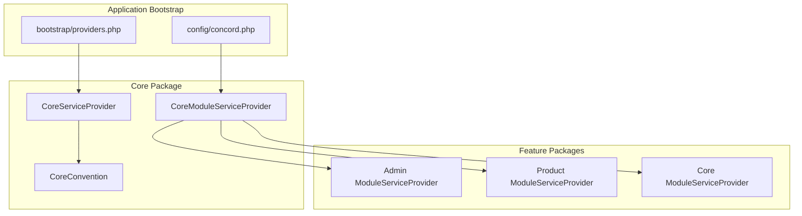
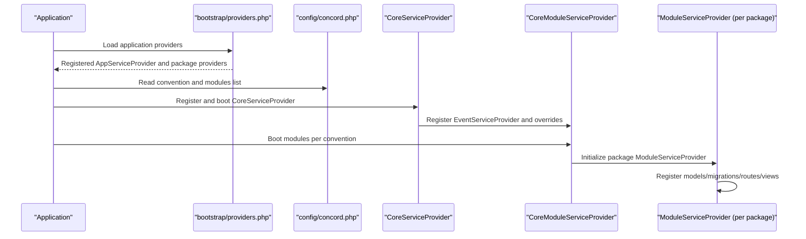
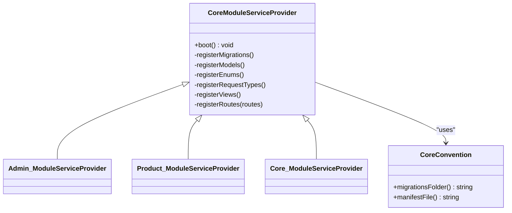
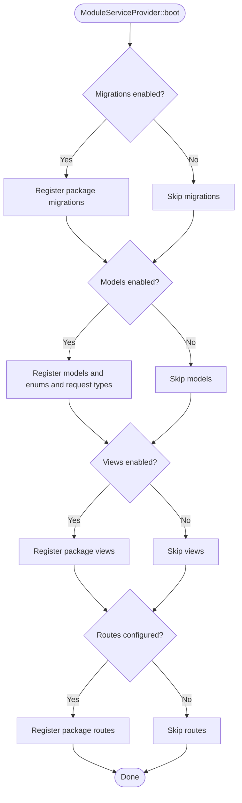
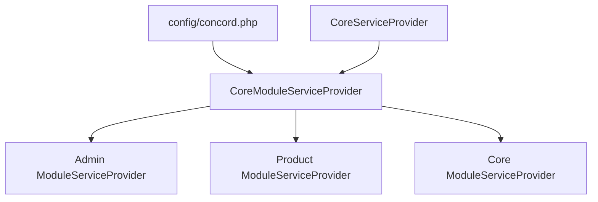

# Package Architecture

<cite>
**Referenced Files in This Document**
- [config/concord.php](file://config/concord.php)
- [bootstrap/providers.php](file://bootstrap/providers.php)
- [packages/Webkul/Core/src/Providers/CoreModuleServiceProvider.php](file://packages/Webkul/Core/src/Providers/CoreModuleServiceProvider.php)
- [packages/Webkul/Core/src/Providers/CoreServiceProvider.php](file://packages/Webkul/Core/src/Providers/CoreServiceProvider.php)
- [packages/Webkul/Core/src/CoreConvention.php](file://packages/Webkul/Core/src/CoreConvention.php)
- [packages/Webkul/Admin/src/Providers/ModuleServiceProvider.php](file://packages/Webkul/Admin/src/Providers/ModuleServiceProvider.php)
- [packages/Webkul/Product/src/Providers/ModuleServiceProvider.php](file://packages/Webkul/Product/src/Providers/ModuleServiceProvider.php)
- [packages/Webkul/Core/src/Providers/ModuleServiceProvider.php](file://packages/Webkul/Core/src/Providers/ModuleServiceProvider.php)
- [packages/Webkul/Admin/src/Resources/manifest.php](file://packages/Webkul/Admin/src/Resources/manifest.php)
- [packages/Webkul/Product/src/Resources/manifest.php](file://packages/Webkul/Product/src/Resources/manifest.php)
- [packages/Webkul/Core/src/Resources/manifest.php](file://packages/Webkul/Core/src/Resources/manifest.php)
- [composer.json](file://composer.json)
</cite>

## Table of Contents
1. [Introduction](#introduction)
2. [Project Structure](#project-structure)
3. [Core Components](#core-components)
4. [Architecture Overview](#architecture-overview)
5. [Detailed Component Analysis](#detailed-component-analysis)
6. [Dependency Analysis](#dependency-analysis)
7. [Performance Considerations](#performance-considerations)
8. [Troubleshooting Guide](#troubleshooting-guide)
9. [Conclusion](#conclusion)
10. [Appendices](#appendices)

## Introduction
This document explains the modular package architecture of Frooxi 2.4, focusing on the Concord modular package system. It covers how packages are structured, registered, and integrated into the main application, the role of ModuleServiceProvider classes, and how inter-package dependencies are managed. It also outlines package isolation, dependency injection, and the benefits of this architecture for e-commerce development.

## Project Structure
Frooxi 2.4 organizes its domain features as Composer packages under packages/Webkul/<FeatureName>/src. Each package exposes:
- Providers: Service providers (including ModuleServiceProvider) that register models, routes, views, and other bindings.
- Resources: Manifest files, language files, and views.
- Database: Migrations and factories.
- Models and Repositories: Domain models and repositories.
- Routes and Controllers: Feature-specific routing and HTTP handlers.

Key configuration files:
- config/concord.php defines the Concord convention and lists module service providers to load.
- bootstrap/providers.php registers application and package service providers.
- composer.json maps PSR-4 namespaces to package source directories and configures local repositories for packages.

**Diagram sources**
- [bootstrap/providers.php:1-49](file://bootstrap/providers.php#L1-L49)
- [config/concord.php:1-37](file://config/concord.php#L1-L37)
- [packages/Webkul/Core/src/Providers/CoreServiceProvider.php:1-142](file://packages/Webkul/Core/src/Providers/CoreServiceProvider.php#L1-L142)
- [packages/Webkul/Core/src/Providers/CoreModuleServiceProvider.php:1-36](file://packages/Webkul/Core/src/Providers/CoreModuleServiceProvider.php#L1-L36)
- [packages/Webkul/Core/src/CoreConvention.php:1-25](file://packages/Webkul/Core/src/CoreConvention.php#L1-L25)
- [packages/Webkul/Admin/src/Providers/ModuleServiceProvider.php:1-16](file://packages/Webkul/Admin/src/Providers/ModuleServiceProvider.php#L1-L16)
- [packages/Webkul/Product/src/Providers/ModuleServiceProvider.php:1-61](file://packages/Webkul/Product/src/Providers/ModuleServiceProvider.php#L1-L61)
- [packages/Webkul/Core/src/Providers/ModuleServiceProvider.php:1-36](file://packages/Webkul/Core/src/Providers/ModuleServiceProvider.php#L1-L36)

**Section sources**
- [config/concord.php:1-37](file://config/concord.php#L1-L37)
- [bootstrap/providers.php:1-49](file://bootstrap/providers.php#L1-L49)
- [composer.json:58-135](file://composer.json#L58-L135)

## Core Components
- Concord Convention and Modules Registration
  - config/concord.php sets the convention class and enumerates module service providers to load via Concord.
  - The convention defines migration and manifest locations for packages.

- Core ModuleServiceProvider
  - packages/Webkul/Core/src/Providers/CoreModuleServiceProvider extends the Concord base and orchestrates package bootstrapping: migrations, models/enums/request types, views, and routes.

- Core ServiceProvider
  - packages/Webkul/Core/src/Providers/CoreServiceProvider registers console commands, overrides framework commands, binds facades, and loads translations and views.

- Package Manifests
  - Each package’s Resources/manifest.php declares metadata such as package name and version.

**Section sources**
- [config/concord.php:6-36](file://config/concord.php#L6-L36)
- [packages/Webkul/Core/src/Providers/CoreModuleServiceProvider.php:10-35](file://packages/Webkul/Core/src/Providers/CoreModuleServiceProvider.php#L10-L35)
- [packages/Webkul/Core/src/Providers/CoreServiceProvider.php:22-141](file://packages/Webkul/Core/src/Providers/CoreServiceProvider.php#L22-L141)
- [packages/Webkul/Admin/src/Resources/manifest.php:1-7](file://packages/Webkul/Admin/src/Resources/manifest.php#L1-L7)
- [packages/Webkul/Product/src/Resources/manifest.php:1-7](file://packages/Webkul/Product/src/Resources/manifest.php#L1-L7)
- [packages/Webkul/Core/src/Resources/manifest.php:1-7](file://packages/Webkul/Core/src/Resources/manifest.php#L1-L7)

## Architecture Overview
The Concord modular architecture separates concerns by package while centralizing discovery and lifecycle management. The flow below shows how the application initializes modules and integrates them.

**Diagram sources**
- [bootstrap/providers.php:22-48](file://bootstrap/providers.php#L22-L48)
- [config/concord.php:11-35](file://config/concord.php#L11-L35)
- [packages/Webkul/Core/src/Providers/CoreServiceProvider.php:39-63](file://packages/Webkul/Core/src/Providers/CoreServiceProvider.php#L39-L63)
- [packages/Webkul/Core/src/Providers/CoreModuleServiceProvider.php:15-34](file://packages/Webkul/Core/src/Providers/CoreModuleServiceProvider.php#L15-L34)
- [packages/Webkul/Admin/src/Providers/ModuleServiceProvider.php:7-15](file://packages/Webkul/Admin/src/Providers/ModuleServiceProvider.php#L7-L15)
- [packages/Webkul/Product/src/Providers/ModuleServiceProvider.php:29-59](file://packages/Webkul/Product/src/Providers/ModuleServiceProvider.php#L29-L59)

## Detailed Component Analysis

### Concord Convention and Package Discovery
- Convention
  - packages/Webkul/Core/src/CoreConvention defines migration and manifest paths used by Concord to discover package assets.
- Modules Registration
  - config/concord.php lists module service providers. These are loaded by Concord to initialize each package.

**Diagram sources**
- [packages/Webkul/Core/src/CoreConvention.php:7-24](file://packages/Webkul/Core/src/CoreConvention.php#L7-L24)
- [packages/Webkul/Core/src/Providers/CoreModuleServiceProvider.php:10-35](file://packages/Webkul/Core/src/Providers/CoreModuleServiceProvider.php#L10-L35)
- [packages/Webkul/Admin/src/Providers/ModuleServiceProvider.php:7-15](file://packages/Webkul/Admin/src/Providers/ModuleServiceProvider.php#L7-L15)
- [packages/Webkul/Product/src/Providers/ModuleServiceProvider.php:29-59](file://packages/Webkul/Product/src/Providers/ModuleServiceProvider.php#L29-L59)
- [packages/Webkul/Core/src/Providers/ModuleServiceProvider.php:16-35](file://packages/Webkul/Core/src/Providers/ModuleServiceProvider.php#L16-L35)

**Section sources**
- [packages/Webkul/Core/src/CoreConvention.php:7-24](file://packages/Webkul/Core/src/CoreConvention.php#L7-L24)
- [config/concord.php:11-35](file://config/concord.php#L11-L35)

### ModuleServiceProvider Lifecycle
- CoreModuleServiceProvider boot method coordinates enabling of migrations, models/enums/request types, views, and routes based on configuration flags.
- Each package’s ModuleServiceProvider extends CoreModuleServiceProvider and defines its models list.

**Diagram sources**
- [packages/Webkul/Core/src/Providers/CoreModuleServiceProvider.php:15-34](file://packages/Webkul/Core/src/Providers/CoreModuleServiceProvider.php#L15-L34)

**Section sources**
- [packages/Webkul/Core/src/Providers/CoreModuleServiceProvider.php:15-34](file://packages/Webkul/Core/src/Providers/CoreModuleServiceProvider.php#L15-L34)

### Package Manifests and Metadata
- Each package provides a manifest file that declares metadata such as package name and version. This enables runtime introspection and tooling.

Examples:
- Admin manifest
- Product manifest
- Core manifest

**Section sources**
- [packages/Webkul/Admin/src/Resources/manifest.php:1-7](file://packages/Webkul/Admin/src/Resources/manifest.php#L1-L7)
- [packages/Webkul/Product/src/Resources/manifest.php:1-7](file://packages/Webkul/Product/src/Resources/manifest.php#L1-L7)
- [packages/Webkul/Core/src/Resources/manifest.php:1-7](file://packages/Webkul/Core/src/Resources/manifest.php#L1-L7)

### Namespace Organization and PSR-4 Autoloading
- composer.json defines PSR-4 namespaces mapping package vendor and feature names to their src directories. This ensures consistent autoloading across packages and the application.

**Section sources**
- [composer.json:58-81](file://composer.json#L58-L81)

### Inter-Package Dependencies and Communication Patterns
- Dependency Injection and Overrides
  - CoreServiceProvider demonstrates dependency injection by binding facades and extending framework commands. This pattern can be replicated in package service providers to inject dependencies and override behavior.
- Package-to-Package Communication
  - Packages communicate primarily through shared contracts, repositories, events, and facades. ModuleServiceProvider classes can expose bindings and listeners to coordinate cross-package behavior.

**Section sources**
- [packages/Webkul/Core/src/Providers/CoreServiceProvider.php:111-140](file://packages/Webkul/Core/src/Providers/CoreServiceProvider.php#L111-L140)

### Package Creation and Registration Checklist
- Create package directory under packages/Webkul/<Feature>/src.
- Add PSR-4 autoload entry in composer.json.
- Implement ModuleServiceProvider extending CoreModuleServiceProvider and define models.
- Provide Resources/manifest.php with metadata.
- Register the ModuleServiceProvider in config/concord.php.
- Optionally add CoreServiceProvider for application-level bindings and overrides.

**Section sources**
- [composer.json:58-81](file://composer.json#L58-L81)
- [config/concord.php:19-35](file://config/concord.php#L19-L35)
- [packages/Webkul/Core/src/Providers/CoreModuleServiceProvider.php:10-35](file://packages/Webkul/Core/src/Providers/CoreModuleServiceProvider.php#L10-L35)
- [packages/Webkul/Admin/src/Resources/manifest.php:1-7](file://packages/Webkul/Admin/src/Resources/manifest.php#L1-L7)

## Dependency Analysis
The following diagram shows the primary dependencies among core and feature packages, highlighting how Concord drives module initialization and how CoreServiceProvider contributes application-level bindings.

**Diagram sources**
- [config/concord.php:11-35](file://config/concord.php#L11-L35)
- [packages/Webkul/Core/src/Providers/CoreModuleServiceProvider.php:10-35](file://packages/Webkul/Core/src/Providers/CoreModuleServiceProvider.php#L10-L35)
- [packages/Webkul/Core/src/Providers/CoreServiceProvider.php:22-63](file://packages/Webkul/Core/src/Providers/CoreServiceProvider.php#L22-L63)
- [packages/Webkul/Admin/src/Providers/ModuleServiceProvider.php:7-15](file://packages/Webkul/Admin/src/Providers/ModuleServiceProvider.php#L7-L15)
- [packages/Webkul/Product/src/Providers/ModuleServiceProvider.php:29-59](file://packages/Webkul/Product/src/Providers/ModuleServiceProvider.php#L29-L59)
- [packages/Webkul/Core/src/Providers/ModuleServiceProvider.php:16-35](file://packages/Webkul/Core/src/Providers/ModuleServiceProvider.php#L16-L35)

**Section sources**
- [config/concord.php:11-35](file://config/concord.php#L11-L35)
- [packages/Webkul/Core/src/Providers/CoreServiceProvider.php:22-63](file://packages/Webkul/Core/src/Providers/CoreServiceProvider.php#L22-L63)

## Performance Considerations
- Lazy loading of package resources: Enable only necessary features to reduce boot overhead.
- Centralized migrations and views: Concord’s convention simplifies deployment but ensure migrations are ordered and idempotent.
- Dependency injection: Prefer interface-based bindings to minimize coupling and improve testability.
- Caching and indexing: Use package-provided caches and indexes where applicable to optimize queries.

## Troubleshooting Guide
- Package not discovered
  - Verify PSR-4 autoload entries in composer.json and that the package namespace matches the directory structure.
- Module not booting
  - Confirm the ModuleServiceProvider is listed in config/concord.php and extends CoreModuleServiceProvider.
- Migrations not applied
  - Ensure migrations are placed under Database/Migrations per CoreConvention and that migrations are enabled in the module configuration.
- Manifest missing or incorrect
  - Ensure Resources/manifest.php exists and returns a valid structure with name and version.

**Section sources**
- [composer.json:58-81](file://composer.json#L58-L81)
- [config/concord.php:19-35](file://config/concord.php#L19-L35)
- [packages/Webkul/Core/src/CoreConvention.php:12-23](file://packages/Webkul/Core/src/CoreConvention.php#L12-L23)
- [packages/Webkul/Admin/src/Resources/manifest.php:1-7](file://packages/Webkul/Admin/src/Resources/manifest.php#L1-L7)

## Conclusion
Frooxi 2.4 leverages the Concord modular package system to deliver a scalable, maintainable e-commerce platform. By organizing features into cohesive packages, standardizing conventions, and centralizing discovery and lifecycle management, the architecture supports rapid feature development, clear separation of concerns, and robust inter-package communication. Following the patterns outlined here ensures consistent package creation, reliable integration, and long-term maintainability.

## Appendices
- Example package structure conventions
  - Providers: Service providers and ModuleServiceProvider.
  - Resources: manifest.php, language files, and views.
  - Database: Migrations and Factories.
  - Models and Repositories: Domain models and repositories.
  - Routes and Controllers: Feature-specific routing and HTTP handlers.