# Service Provider System

<cite>
**Referenced Files in This Document**
- [bootstrap/app.php](file://bootstrap/app.php)
- [bootstrap/providers.php](file://bootstrap/providers.php)
- [app/Providers/AppServiceProvider.php](file://app/Providers/AppServiceProvider.php)
- [packages/Webkul/Core/src/Providers/CoreServiceProvider.php](file://packages/Webkul/Core/src/Providers/CoreServiceProvider.php)
- [packages/Webkul/Core/src/Providers/EnvValidatorServiceProvider.php](file://packages/Webkul/Core/src/Providers/EnvValidatorServiceProvider.php)
- [packages/Webkul/Core/src/Providers/DynamicSmtpServiceProvider.php](file://packages/Webkul/Core/src/Providers/DynamicSmtpServiceProvider.php)
- [packages/Webkul/Core/src/Providers/EventServiceProvider.php](file://packages/Webkul/Core/src/Providers/EventServiceProvider.php)
- [packages/Webkul/Core/src/Providers/CoreModuleServiceProvider.php](file://packages/Webkul/Core/src/Providers/CoreModuleServiceProvider.php)
- [packages/Webkul/Admin/src/Providers/AdminServiceProvider.php](file://packages/Webkul/Admin/src/Providers/AdminServiceProvider.php)
- [packages/Webkul/Admin/src/Providers/ModuleServiceProvider.php](file://packages/Webkul/Admin/src/Providers/ModuleServiceProvider.php)
- [packages/Webkul/Shop/src/Providers/ShopServiceProvider.php](file://packages/Webkul/Shop/src/Providers/ShopServiceProvider.php)
- [packages/Webkul/Checkout/src/Facades/Cart.php](file://packages/Webkul/Checkout/src/Facades/Cart.php)
- [packages/Webkul/Core/src/Facades/Core.php](file://packages/Webkul/Core/src/Facades/Core.php)
- [packages/Webkul/Admin/src/Config/acl.php](file://packages/Webkul/Admin/src/Config/acl.php)
</cite>

## Table of Contents
1. [Introduction](#introduction)
2. [Project Structure](#project-structure)
3. [Core Components](#core-components)
4. [Architecture Overview](#architecture-overview)
5. [Detailed Component Analysis](#detailed-component-analysis)
6. [Dependency Analysis](#dependency-analysis)
7. [Performance Considerations](#performance-considerations)
8. [Troubleshooting Guide](#troubleshooting-guide)
9. [Conclusion](#conclusion)
10. [Appendices](#appendices)

## Introduction
This document explains the Laravel service provider system in Frooxi 2.4. It covers how providers register bindings, configure facades, and manage package bootstrapping. It also documents provider loading order, dependency resolution, and registration patterns. Differences between core, admin, and shop providers are highlighted, along with examples of creating custom providers, publishing configuration, registering routes, inheritance patterns, conditional loading, and environment-specific behaviors. Best practices for extending existing providers and building new ones are included.

## Project Structure
Frooxi 2.4 organizes providers across the application and modular packages:
- Application-level providers are registered via a central providers list.
- Core providers bootstrap foundational services, events, and console commands.
- Module providers (Admin, Shop, etc.) extend core capabilities and load their own routes, views, translations, and middleware groups.
- Facades expose container-bound services for convenient access.

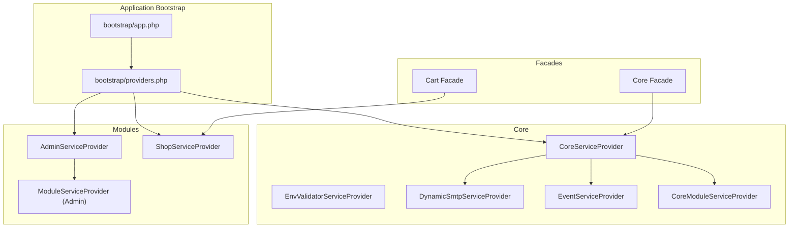

**Diagram sources**
- [bootstrap/app.php:14-55](file://bootstrap/app.php#L14-L55)
- [bootstrap/providers.php:22-48](file://bootstrap/providers.php#L22-L48)
- [packages/Webkul/Core/src/Providers/CoreServiceProvider.php:22-63](file://packages/Webkul/Core/src/Providers/CoreServiceProvider.php#L22-L63)
- [packages/Webkul/Core/src/Providers/EnvValidatorServiceProvider.php:10-38](file://packages/Webkul/Core/src/Providers/EnvValidatorServiceProvider.php#L10-L38)
- [packages/Webkul/Core/src/Providers/DynamicSmtpServiceProvider.php:8-18](file://packages/Webkul/Core/src/Providers/DynamicSmtpServiceProvider.php#L8-L18)
- [packages/Webkul/Core/src/Providers/EventServiceProvider.php:7-24](file://packages/Webkul/Core/src/Providers/EventServiceProvider.php#L7-L24)
- [packages/Webkul/Core/src/Providers/CoreModuleServiceProvider.php:10-34](file://packages/Webkul/Core/src/Providers/CoreModuleServiceProvider.php#L10-L34)
- [packages/Webkul/Admin/src/Providers/AdminServiceProvider.php:10-34](file://packages/Webkul/Admin/src/Providers/AdminServiceProvider.php#L10-L34)
- [packages/Webkul/Admin/src/Providers/ModuleServiceProvider.php:7-15](file://packages/Webkul/Admin/src/Providers/ModuleServiceProvider.php#L7-L15)
- [packages/Webkul/Shop/src/Providers/ShopServiceProvider.php:17-58](file://packages/Webkul/Shop/src/Providers/ShopServiceProvider.php#L17-L58)
- [packages/Webkul/Core/src/Facades/Core.php:8-18](file://packages/Webkul/Core/src/Facades/Core.php#L8-L18)
- [packages/Webkul/Checkout/src/Facades/Cart.php:8-18](file://packages/Webkul/Checkout/src/Facades/Cart.php#L8-L18)

**Section sources**
- [bootstrap/app.php:14-55](file://bootstrap/app.php#L14-L55)
- [bootstrap/providers.php:22-48](file://bootstrap/providers.php#L22-L48)

## Core Components
- CoreServiceProvider: Registers console commands, overrides core commands and middleware, binds facades, and registers event and dynamic SMTP providers. Boots migrations, translations, and views.
- EnvValidatorServiceProvider: Validates environment variables early in the boot process.
- DynamicSmtpServiceProvider: Extends the mail transport manager with a custom driver.
- EventServiceProvider: Defines event-to-listener mappings.
- CoreModuleServiceProvider: Concord module bootstrap enabling migrations, models, enums, requests, and routes per module configuration.
- AdminServiceProvider: Loads admin routes, views, translations, and registers event provider; merges admin configuration.
- ModuleServiceProvider (Admin): Extends CoreModuleServiceProvider for Admin module specifics.
- ShopServiceProvider: Registers shop middleware group and aliases, loads routes, migrations, views, translations, pagination defaults, and registers event provider; merges shop configuration.

**Section sources**
- [packages/Webkul/Core/src/Providers/CoreServiceProvider.php:22-141](file://packages/Webkul/Core/src/Providers/CoreServiceProvider.php#L22-L141)
- [packages/Webkul/Core/src/Providers/EnvValidatorServiceProvider.php:10-89](file://packages/Webkul/Core/src/Providers/EnvValidatorServiceProvider.php#L10-L89)
- [packages/Webkul/Core/src/Providers/DynamicSmtpServiceProvider.php:8-18](file://packages/Webkul/Core/src/Providers/DynamicSmtpServiceProvider.php#L8-L18)
- [packages/Webkul/Core/src/Providers/EventServiceProvider.php:7-24](file://packages/Webkul/Core/src/Providers/EventServiceProvider.php#L7-L24)
- [packages/Webkul/Core/src/Providers/CoreModuleServiceProvider.php:10-34](file://packages/Webkul/Core/src/Providers/CoreModuleServiceProvider.php#L10-L34)
- [packages/Webkul/Admin/src/Providers/AdminServiceProvider.php:10-56](file://packages/Webkul/Admin/src/Providers/AdminServiceProvider.php#L10-L56)
- [packages/Webkul/Admin/src/Providers/ModuleServiceProvider.php:7-15](file://packages/Webkul/Admin/src/Providers/ModuleServiceProvider.php#L7-L15)
- [packages/Webkul/Shop/src/Providers/ShopServiceProvider.php:17-71](file://packages/Webkul/Shop/src/Providers/ShopServiceProvider.php#L17-L71)

## Architecture Overview
The provider architecture follows a layered pattern:
- Application bootstrap configures routing and middleware globally.
- Central providers list registers core and module providers in a defined order.
- Core provider initializes base services, schedules, and overrides.
- Module providers extend core with domain-specific routes, middleware, views, and configuration.
- Facades provide convenient access to container-bound services.

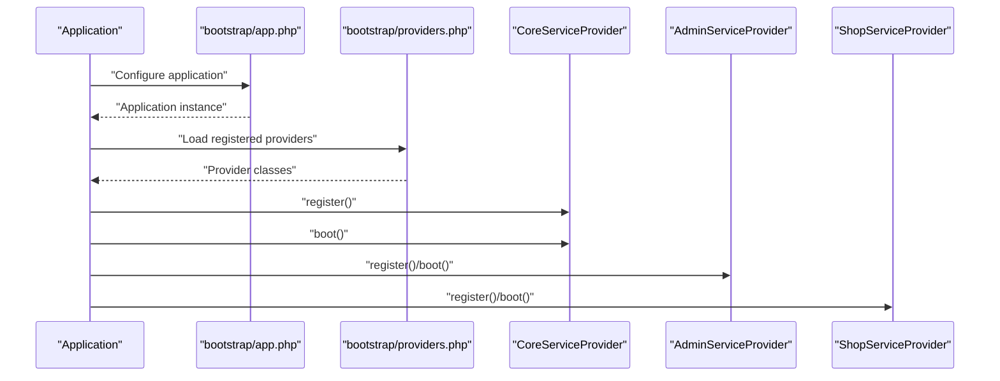

**Diagram sources**
- [bootstrap/app.php:14-55](file://bootstrap/app.php#L14-L55)
- [bootstrap/providers.php:22-48](file://bootstrap/providers.php#L22-L48)
- [packages/Webkul/Core/src/Providers/CoreServiceProvider.php:27-63](file://packages/Webkul/Core/src/Providers/CoreServiceProvider.php#L27-L63)
- [packages/Webkul/Admin/src/Providers/AdminServiceProvider.php:15-34](file://packages/Webkul/Admin/src/Providers/AdminServiceProvider.php#L15-L34)
- [packages/Webkul/Shop/src/Providers/ShopServiceProvider.php:22-58](file://packages/Webkul/Shop/src/Providers/ShopServiceProvider.php#L22-L58)

## Detailed Component Analysis

### CoreServiceProvider
Responsibilities:
- Registers console commands and schedules.
- Overrides core commands and middleware.
- Binds facades and singleton services.
- Loads migrations, translations, and views.
- Registers event and dynamic SMTP providers.

Key behaviors:
- Conditional command registration during console runtime.
- Environment-aware scheduling with configuration-driven frequency and time.
- Extends core maintenance commands and binds custom exception handler.
- Binds Elasticsearch client and blade compiler.

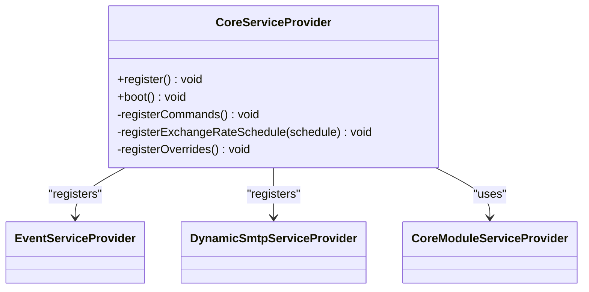

**Diagram sources**
- [packages/Webkul/Core/src/Providers/CoreServiceProvider.php:22-141](file://packages/Webkul/Core/src/Providers/CoreServiceProvider.php#L22-L141)
- [packages/Webkul/Core/src/Providers/EventServiceProvider.php:7-24](file://packages/Webkul/Core/src/Providers/EventServiceProvider.php#L7-L24)
- [packages/Webkul/Core/src/Providers/DynamicSmtpServiceProvider.php:8-18](file://packages/Webkul/Core/src/Providers/DynamicSmtpServiceProvider.php#L8-L18)
- [packages/Webkul/Core/src/Providers/CoreModuleServiceProvider.php:10-34](file://packages/Webkul/Core/src/Providers/CoreModuleServiceProvider.php#L10-L34)

**Section sources**
- [packages/Webkul/Core/src/Providers/CoreServiceProvider.php:27-141](file://packages/Webkul/Core/src/Providers/CoreServiceProvider.php#L27-L141)

### AdminServiceProvider
Responsibilities:
- Merges admin configuration (ACL, menu, system).
- Loads admin routes with maintenance middleware.
- Loads admin views and translations.
- Registers event provider.

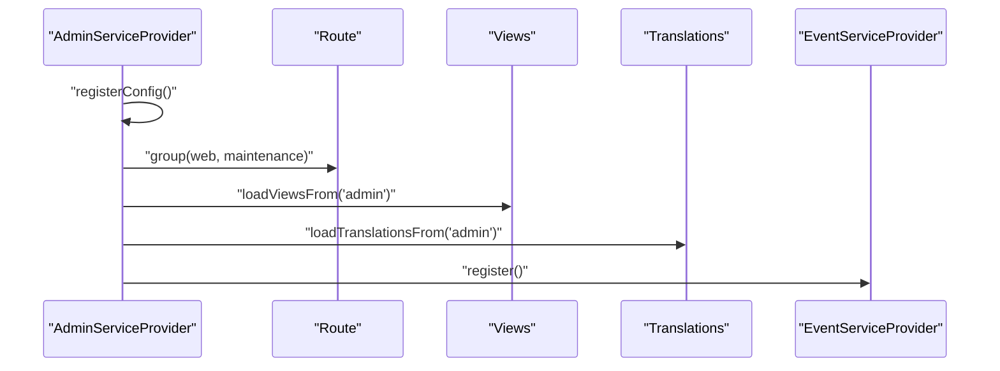

**Diagram sources**
- [packages/Webkul/Admin/src/Providers/AdminServiceProvider.php:15-34](file://packages/Webkul/Admin/src/Providers/AdminServiceProvider.php#L15-L34)

**Section sources**
- [packages/Webkul/Admin/src/Providers/AdminServiceProvider.php:15-56](file://packages/Webkul/Admin/src/Providers/AdminServiceProvider.php#L15-L56)

### ShopServiceProvider
Responsibilities:
- Registers shop middleware group and aliases.
- Loads shop routes (web and API) with maintenance middleware.
- Loads shop migrations, views, translations, and pagination defaults.
- Registers event provider.
- Merges shop configuration.

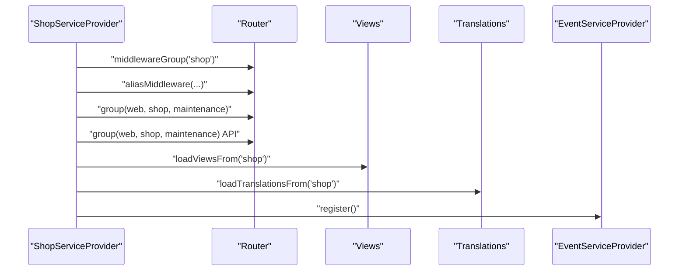

**Diagram sources**
- [packages/Webkul/Shop/src/Providers/ShopServiceProvider.php:30-58](file://packages/Webkul/Shop/src/Providers/ShopServiceProvider.php#L30-L58)

**Section sources**
- [packages/Webkul/Shop/src/Providers/ShopServiceProvider.php:22-71](file://packages/Webkul/Shop/src/Providers/ShopServiceProvider.php#L22-L71)

### Facades and Bindings
- Core facade resolves to a container-bound implementation, enabling static-like access to core services.
- Cart facade resolves to a checkout-specific implementation, allowing convenient access to cart operations.

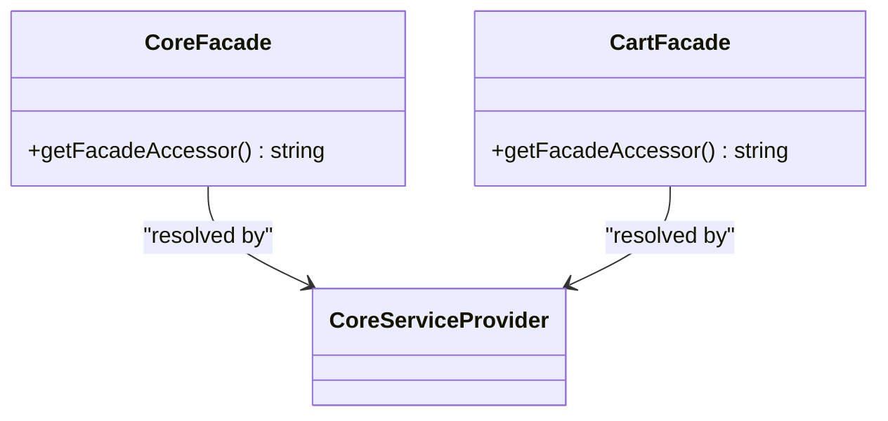

**Diagram sources**
- [packages/Webkul/Core/src/Facades/Core.php:8-18](file://packages/Webkul/Core/src/Facades/Core.php#L8-L18)
- [packages/Webkul/Checkout/src/Facades/Cart.php:8-18](file://packages/Webkul/Checkout/src/Facades/Cart.php#L8-L18)
- [packages/Webkul/Core/src/Providers/CoreServiceProvider.php:121-139](file://packages/Webkul/Core/src/Providers/CoreServiceProvider.php#L121-L139)

**Section sources**
- [packages/Webkul/Core/src/Facades/Core.php:8-18](file://packages/Webkul/Core/src/Facades/Core.php#L8-L18)
- [packages/Webkul/Checkout/src/Facades/Cart.php:8-18](file://packages/Webkul/Checkout/src/Facades/Cart.php#L8-L18)
- [packages/Webkul/Core/src/Providers/CoreServiceProvider.php:121-139](file://packages/Webkul/Core/src/Providers/CoreServiceProvider.php#L121-L139)

### Configuration Publishing and Registration
- AdminServiceProvider merges admin configuration (ACL, menu, system) into the application config.
- ShopServiceProvider merges shop configuration (menu) into the application config.
- EnvValidatorServiceProvider validates environment variables early to prevent invalid deployments.

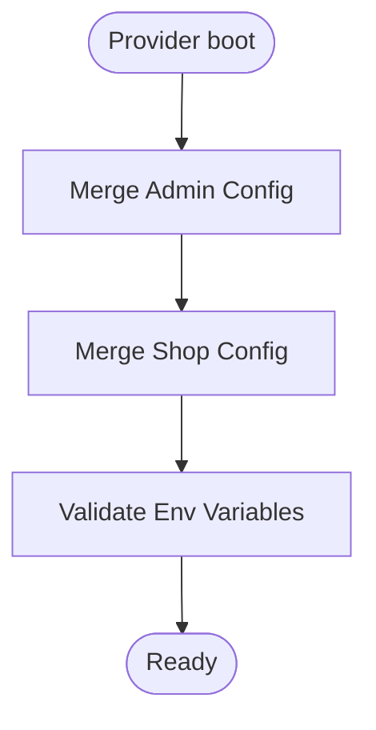

**Diagram sources**
- [packages/Webkul/Admin/src/Providers/AdminServiceProvider.php:39-55](file://packages/Webkul/Admin/src/Providers/AdminServiceProvider.php#L39-L55)
- [packages/Webkul/Shop/src/Providers/ShopServiceProvider.php:64-70](file://packages/Webkul/Shop/src/Providers/ShopServiceProvider.php#L64-L70)
- [packages/Webkul/Core/src/Providers/EnvValidatorServiceProvider.php:35-57](file://packages/Webkul/Core/src/Providers/EnvValidatorServiceProvider.php#L35-L57)

**Section sources**
- [packages/Webkul/Admin/src/Providers/AdminServiceProvider.php:39-55](file://packages/Webkul/Admin/src/Providers/AdminServiceProvider.php#L39-L55)
- [packages/Webkul/Shop/src/Providers/ShopServiceProvider.php:64-70](file://packages/Webkul/Shop/src/Providers/ShopServiceProvider.php#L64-L70)
- [packages/Webkul/Admin/src/Config/acl.php:1-20](file://packages/Webkul/Admin/src/Config/acl.php#L1-L20)
- [packages/Webkul/Core/src/Providers/EnvValidatorServiceProvider.php:35-57](file://packages/Webkul/Core/src/Providers/EnvValidatorServiceProvider.php#L35-L57)

### Route Registration Patterns
- Admin routes are grouped under web and maintenance middleware.
- Shop routes are grouped under web, shop, and maintenance middleware; includes both web and API route files.
- Middleware groups and aliases are registered centrally in the Shop provider.

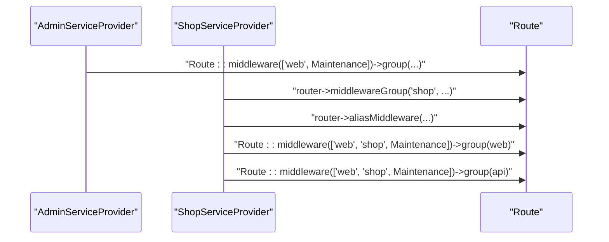

**Diagram sources**
- [packages/Webkul/Admin/src/Providers/AdminServiceProvider.php:25](file://packages/Webkul/Admin/src/Providers/AdminServiceProvider.php#L25)
- [packages/Webkul/Shop/src/Providers/ShopServiceProvider.php:32-45](file://packages/Webkul/Shop/src/Providers/ShopServiceProvider.php#L32-L45)

**Section sources**
- [packages/Webkul/Admin/src/Providers/AdminServiceProvider.php:25](file://packages/Webkul/Admin/src/Providers/AdminServiceProvider.php#L25)
- [packages/Webkul/Shop/src/Providers/ShopServiceProvider.php:30-58](file://packages/Webkul/Shop/src/Providers/ShopServiceProvider.php#L30-L58)

### Provider Loading Order and Dependencies
- The providers list defines the registration order.
- CoreServiceProvider registers EventServiceProvider and DynamicSmtpServiceProvider internally.
- Module providers depend on CoreModuleServiceProvider for Concord module features.

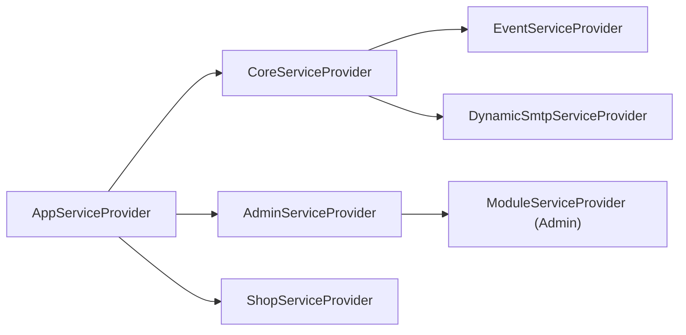

**Diagram sources**
- [bootstrap/providers.php:22-48](file://bootstrap/providers.php#L22-L48)
- [packages/Webkul/Core/src/Providers/CoreServiceProvider.php:61-62](file://packages/Webkul/Core/src/Providers/CoreServiceProvider.php#L61-L62)
- [packages/Webkul/Admin/src/Providers/ModuleServiceProvider.php:7-15](file://packages/Webkul/Admin/src/Providers/ModuleServiceProvider.php#L7-L15)

**Section sources**
- [bootstrap/providers.php:22-48](file://bootstrap/providers.php#L22-L48)
- [packages/Webkul/Core/src/Providers/CoreServiceProvider.php:61-62](file://packages/Webkul/Core/src/Providers/CoreServiceProvider.php#L61-L62)
- [packages/Webkul/Admin/src/Providers/ModuleServiceProvider.php:7-15](file://packages/Webkul/Admin/src/Providers/ModuleServiceProvider.php#L7-L15)

### Conditional Loading and Environment-Specific Behaviors
- CoreServiceProvider conditionally registers console commands and schedules only in console context.
- EnvValidatorServiceProvider validates environment variables and exits early on failure.
- Maintenance middleware is consistently applied to admin and shop routes.

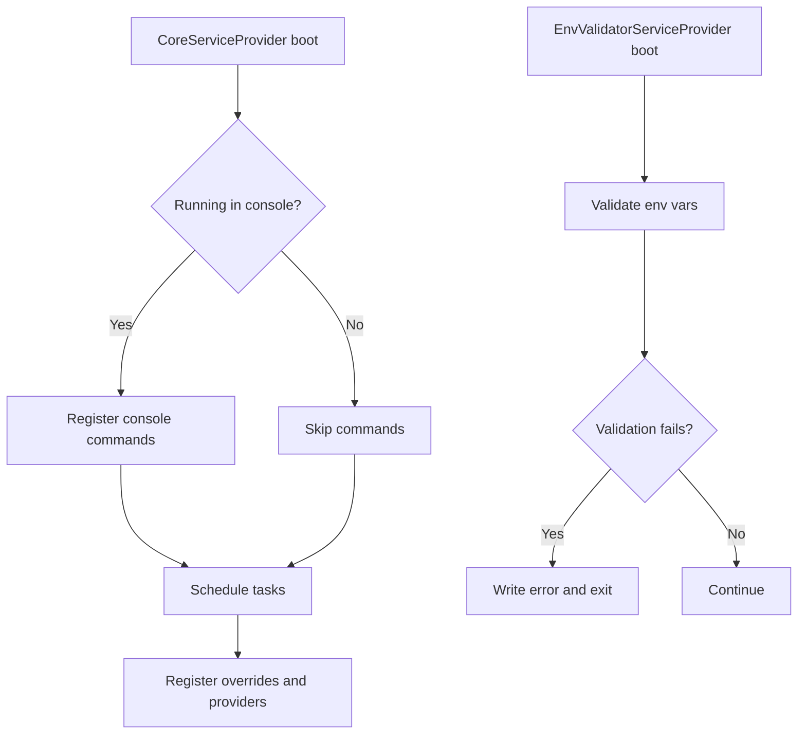

**Diagram sources**
- [packages/Webkul/Core/src/Providers/CoreServiceProvider.php:68-104](file://packages/Webkul/Core/src/Providers/CoreServiceProvider.php#L68-L104)
- [packages/Webkul/Core/src/Providers/EnvValidatorServiceProvider.php:35-88](file://packages/Webkul/Core/src/Providers/EnvValidatorServiceProvider.php#L35-L88)

**Section sources**
- [packages/Webkul/Core/src/Providers/CoreServiceProvider.php:68-104](file://packages/Webkul/Core/src/Providers/CoreServiceProvider.php#L68-L104)
- [packages/Webkul/Core/src/Providers/EnvValidatorServiceProvider.php:35-88](file://packages/Webkul/Core/src/Providers/EnvValidatorServiceProvider.php#L35-L88)

### Differences Between Core, Admin, and Shop Providers
- Core: Foundation services, scheduling, overrides, and module bootstrap.
- Admin: Admin-specific routes, views, translations, configuration merging, and event registration.
- Shop: Shop routes (web and API), middleware groups and aliases, pagination defaults, configuration merging, and event registration.

**Section sources**
- [packages/Webkul/Core/src/Providers/CoreServiceProvider.php:27-141](file://packages/Webkul/Core/src/Providers/CoreServiceProvider.php#L27-L141)
- [packages/Webkul/Admin/src/Providers/AdminServiceProvider.php:15-56](file://packages/Webkul/Admin/src/Providers/AdminServiceProvider.php#L15-L56)
- [packages/Webkul/Shop/src/Providers/ShopServiceProvider.php:22-71](file://packages/Webkul/Shop/src/Providers/ShopServiceProvider.php#L22-L71)

### Creating a Custom Service Provider
Steps:
- Extend the appropriate base class (ServiceProvider for app-level, CoreModuleServiceProvider for modules).
- Implement register() to bind services and merge configuration.
- Implement boot() to load routes, views, translations, migrations, and schedule tasks.
- Register the provider in the central providers list.

Patterns to follow:
- Use mergeConfigFrom for configuration publishing.
- Use loadRoutesFrom/loadViewsFrom/loadTranslationsFrom/loadMigrationsFrom for resource loading.
- Use app->singleton/bind for container bindings.
- Use app->register for nested providers.

**Section sources**
- [packages/Webkul/Admin/src/Providers/ModuleServiceProvider.php:7-15](file://packages/Webkul/Admin/src/Providers/ModuleServiceProvider.php#L7-L15)
- [packages/Webkul/Admin/src/Providers/AdminServiceProvider.php:39-55](file://packages/Webkul/Admin/src/Providers/AdminServiceProvider.php#L39-L55)
- [packages/Webkul/Shop/src/Providers/ShopServiceProvider.php:64-70](file://packages/Webkul/Shop/src/Providers/ShopServiceProvider.php#L64-L70)

### Extending Existing Providers
- Override or extend core services via registerOverrides in CoreServiceProvider.
- Register additional providers inside boot() using app->register.
- Use facades to expose container-bound services.

Best practices:
- Keep register() lightweight; defer heavy work to boot().
- Use conditional checks for console vs. HTTP contexts.
- Prefer configuration merging over hardcoding paths.

**Section sources**
- [packages/Webkul/Core/src/Providers/CoreServiceProvider.php:109-140](file://packages/Webkul/Core/src/Providers/CoreServiceProvider.php#L109-L140)
- [packages/Webkul/Core/src/Providers/CoreServiceProvider.php:61-62](file://packages/Webkul/Core/src/Providers/CoreServiceProvider.php#L61-L62)

## Dependency Analysis
Provider dependencies and coupling:
- CoreServiceProvider depends on EventServiceProvider and DynamicSmtpServiceProvider.
- AdminServiceProvider depends on CoreModuleServiceProvider indirectly via ModuleServiceProvider.
- ShopServiceProvider depends on CoreModuleServiceProvider indirectly via ModuleServiceProvider.
- Facades depend on container bindings established by CoreServiceProvider.

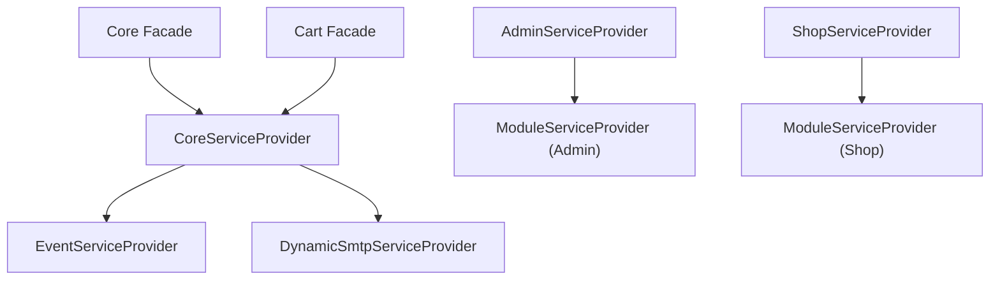

**Diagram sources**
- [packages/Webkul/Core/src/Providers/CoreServiceProvider.php:61-62](file://packages/Webkul/Core/src/Providers/CoreServiceProvider.php#L61-L62)
- [packages/Webkul/Admin/src/Providers/ModuleServiceProvider.php:7-15](file://packages/Webkul/Admin/src/Providers/ModuleServiceProvider.php#L7-L15)
- [packages/Webkul/Shop/src/Providers/ShopServiceProvider.php:58](file://packages/Webkul/Shop/src/Providers/ShopServiceProvider.php#L58)
- [packages/Webkul/Core/src/Facades/Core.php:8-18](file://packages/Webkul/Core/src/Facades/Core.php#L8-L18)
- [packages/Webkul/Checkout/src/Facades/Cart.php:8-18](file://packages/Webkul/Checkout/src/Facades/Cart.php#L8-L18)

**Section sources**
- [packages/Webkul/Core/src/Providers/CoreServiceProvider.php:61-62](file://packages/Webkul/Core/src/Providers/CoreServiceProvider.php#L61-L62)
- [packages/Webkul/Admin/src/Providers/ModuleServiceProvider.php:7-15](file://packages/Webkul/Admin/src/Providers/ModuleServiceProvider.php#L7-L15)
- [packages/Webkul/Shop/src/Providers/ShopServiceProvider.php:58](file://packages/Webkul/Shop/src/Providers/ShopServiceProvider.php#L58)
- [packages/Webkul/Core/src/Facades/Core.php:8-18](file://packages/Webkul/Core/src/Facades/Core.php#L8-L18)
- [packages/Webkul/Checkout/src/Facades/Cart.php:8-18](file://packages/Webkul/Checkout/src/Facades/Cart.php#L8-L18)

## Performance Considerations
- Defer heavy operations to boot() to avoid slowing down application startup.
- Use conditional checks for console vs. HTTP contexts to avoid unnecessary work.
- Leverage caching for compiled views and routes where applicable.
- Minimize the number of registered providers to reduce bootstrap overhead.

## Troubleshooting Guide
Common issues and resolutions:
- Environment validation failures: EnvValidatorServiceProvider writes errors and exits; fix invalid environment variables (e.g., DB_PREFIX).
- Maintenance mode conflicts: Both application and module providers override maintenance middleware; ensure correct precedence in middleware groups.
- Missing routes or views: Verify loadRoutesFrom/loadViewsFrom paths and that providers are registered in the central providers list.
- Facade resolution errors: Ensure the underlying binding exists in register() and that the facade accessor matches the bound interface/class.

**Section sources**
- [packages/Webkul/Core/src/Providers/EnvValidatorServiceProvider.php:80-88](file://packages/Webkul/Core/src/Providers/EnvValidatorServiceProvider.php#L80-L88)
- [bootstrap/app.php:20-48](file://bootstrap/app.php#L20-L48)
- [packages/Webkul/Admin/src/Providers/AdminServiceProvider.php:25](file://packages/Webkul/Admin/src/Providers/AdminServiceProvider.php#L25)
- [packages/Webkul/Shop/src/Providers/ShopServiceProvider.php:44-45](file://packages/Webkul/Shop/src/Providers/ShopServiceProvider.php#L44-L45)

## Conclusion
Frooxi 2.4’s service provider system is structured around a core foundation (CoreServiceProvider) that registers essential services, schedules, and overrides, while module providers (Admin, Shop) extend functionality with domain-specific routes, middleware, views, and configuration. Facades provide convenient access to container-bound services. Providers are registered in a central list, ensuring predictable loading order and dependency resolution. Following the documented patterns enables safe extension and creation of new providers tailored to specific needs.

## Appendices
- Provider registration order and bootstrap flow are defined in the application bootstrap and providers list.
- Configuration merging and publishing are handled via provider boot methods.
- Route registration uses middleware groups and aliases for consistent behavior across admin and shop domains.

**Section sources**
- [bootstrap/app.php:14-55](file://bootstrap/app.php#L14-L55)
- [bootstrap/providers.php:22-48](file://bootstrap/providers.php#L22-L48)
- [packages/Webkul/Admin/src/Providers/AdminServiceProvider.php:39-55](file://packages/Webkul/Admin/src/Providers/AdminServiceProvider.php#L39-L55)
- [packages/Webkul/Shop/src/Providers/ShopServiceProvider.php:64-70](file://packages/Webkul/Shop/src/Providers/ShopServiceProvider.php#L64-L70)