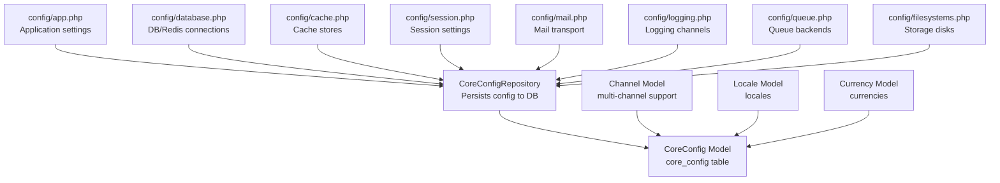
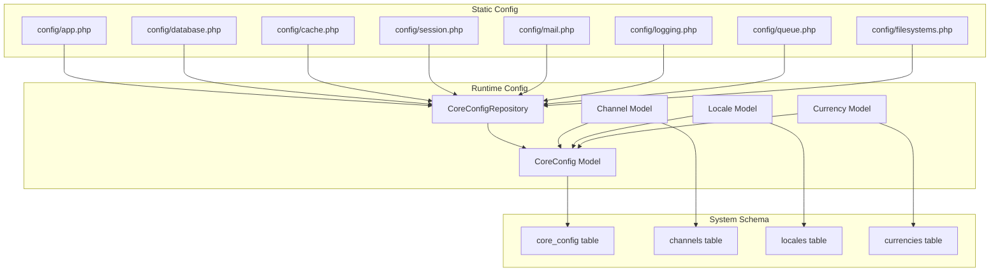
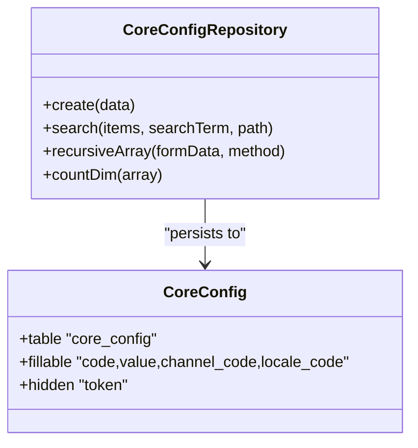
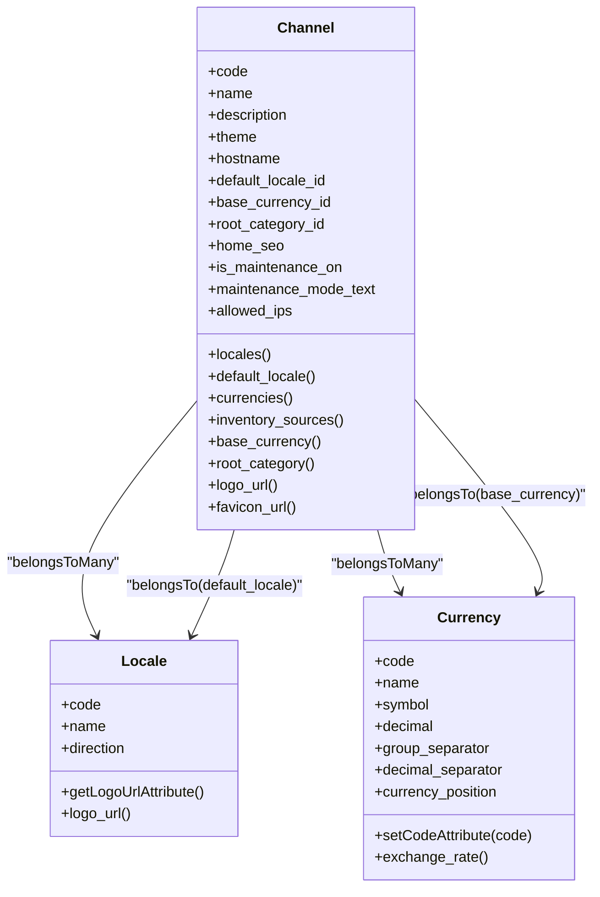
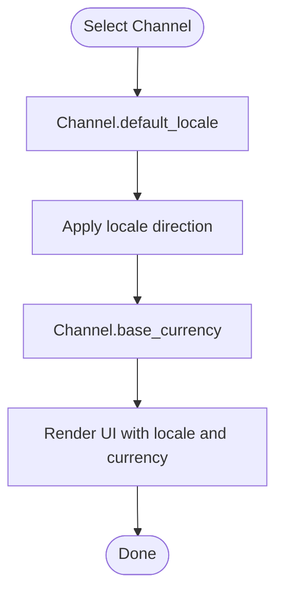
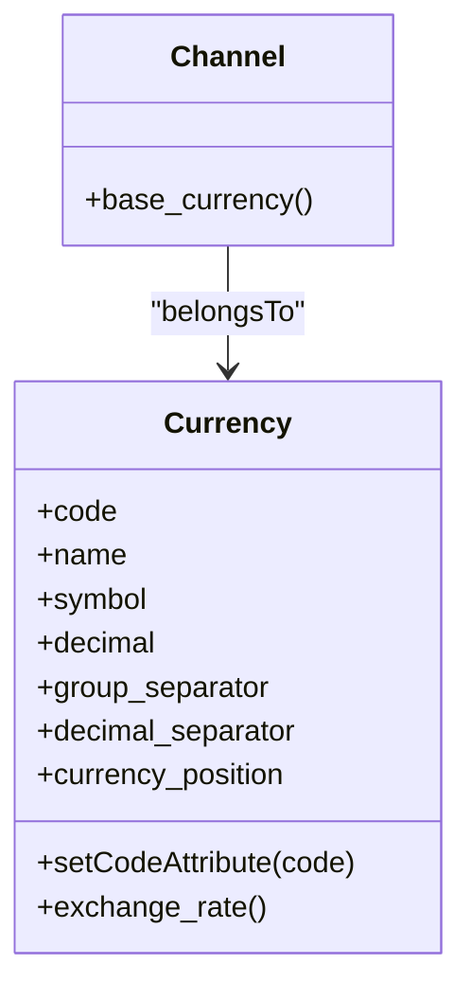
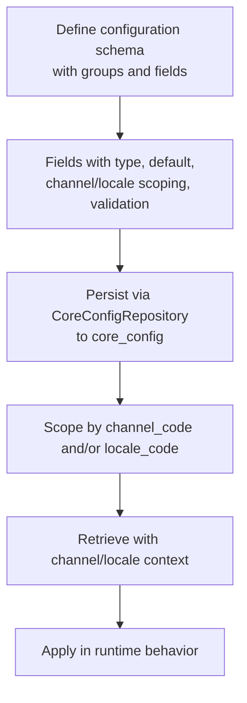
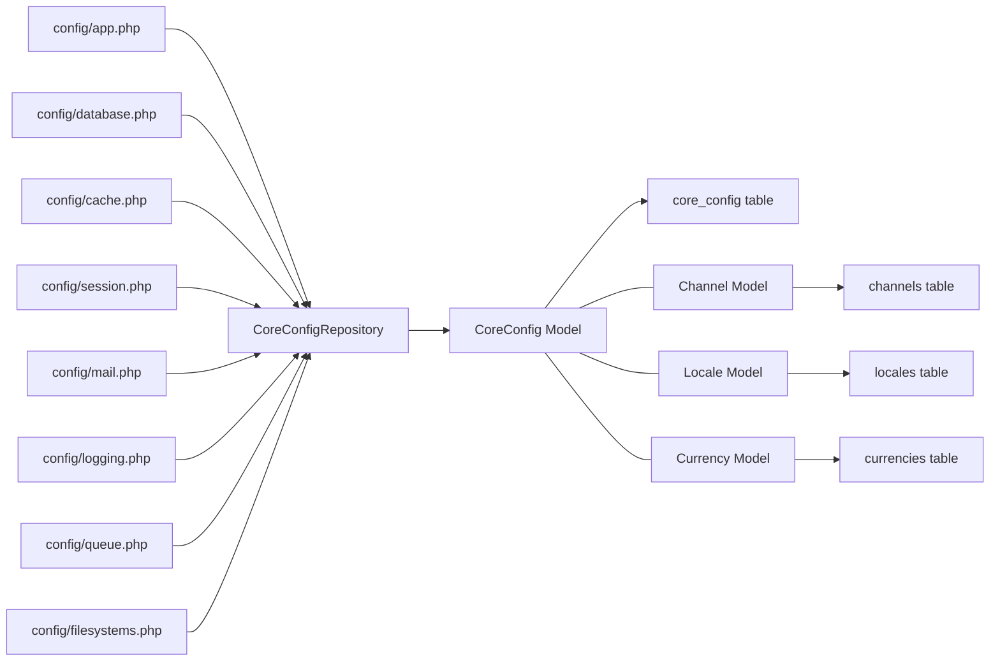

# Configuration Management

<cite>
**Referenced Files in This Document**
- [app.php](file://config/app.php)
- [database.php](file://config/database.php)
- [cache.php](file://config/cache.php)
- [session.php](file://config/session.php)
- [mail.php](file://config/mail.php)
- [logging.php](file://config/logging.php)
- [queue.php](file://config/queue.php)
- [filesystems.php](file://config/filesystems.php)
- [CoreConfig.php](file://packages/Webkul/Core/src/Models/CoreConfig.php)
- [CoreConfigRepository.php](file://packages/Webkul/Core/src/Repositories/CoreConfigRepository.php)
- [Channel.php](file://packages/Webkul/Core/src/Models/Channel.php)
- [Locale.php](file://packages/Webkul/Core/src/Models/Locale.php)
- [Currency.php](file://packages/Webkul/Core/src/Models/Currency.php)
- [Locales.php](file://packages/Webkul/Core/src/Helpers/Locales.php)
- [system.php](file://packages/Webkul/Admin/src/Config/system.php)
</cite>

## Table of Contents
1. [Introduction](#introduction)
2. [Project Structure](#project-structure)
3. [Core Components](#core-components)
4. [Architecture Overview](#architecture-overview)
5. [Detailed Component Analysis](#detailed-component-analysis)
6. [Dependency Analysis](#dependency-analysis)
7. [Performance Considerations](#performance-considerations)
8. [Troubleshooting Guide](#troubleshooting-guide)
9. [Conclusion](#conclusion)
10. [Appendices](#appendices)

## Introduction
This document describes Frooxi's configuration management system. It covers system configuration options, environment variables, multi-channel setup, locale and currency configuration, regional preferences, database and cache settings, performance tuning, backup and restore procedures, environment-specific configurations, deployment strategies, validation, troubleshooting, and production best practices.

## Project Structure
Configuration is primarily managed through Laravel-style configuration files under the config directory, with runtime configuration persisted in the database and managed via repositories. Multi-channel, locale, and currency models provide regional and channel-specific behavior.

**Diagram sources**
- [app.php:1-188](file://config/app.php#L1-L188)
- [database.php:1-183](file://config/database.php#L1-L183)
- [cache.php:1-109](file://config/cache.php#L1-L109)
- [session.php:1-218](file://config/session.php#L1-L218)
- [mail.php:1-155](file://config/mail.php#L1-L155)
- [logging.php:1-133](file://config/logging.php#L1-L133)
- [queue.php:1-113](file://config/queue.php#L1-L113)
- [filesystems.php:1-94](file://config/filesystems.php#L1-L94)
- [CoreConfigRepository.php:1-241](file://packages/Webkul/Core/src/Repositories/CoreConfigRepository.php#L1-L241)
- [CoreConfig.php:1-49](file://packages/Webkul/Core/src/Models/CoreConfig.php#L1-L49)
- [Channel.php:1-157](file://packages/Webkul/Core/src/Models/Channel.php#L1-L157)
- [Locale.php:1-66](file://packages/Webkul/Core/src/Models/Locale.php#L1-L66)
- [Currency.php:1-55](file://packages/Webkul/Core/src/Models/Currency.php#L1-L55)

**Section sources**
- [app.php:1-188](file://config/app.php#L1-L188)
- [database.php:1-183](file://config/database.php#L1-L183)
- [cache.php:1-109](file://config/cache.php#L1-L109)
- [session.php:1-218](file://config/session.php#L1-L218)
- [mail.php:1-155](file://config/mail.php#L1-L155)
- [logging.php:1-133](file://config/logging.php#L1-L133)
- [queue.php:1-113](file://config/queue.php#L1-L113)
- [filesystems.php:1-94](file://config/filesystems.php#L1-L94)

## Core Components
- Application configuration: application name, environment, debug mode, URL, admin URL, timezone, locale, fallback locale, faker locale, default country, base currency, default channel, encryption key, maintenance mode driver.
- Database configuration: default connection, named connections (sqlite, mysql, mariadb, pgsql, sqlsrv), migration table, Redis client and databases (default, cache, session).
- Cache configuration: default store, stores (array, database, file, memcached, redis, dynamodb, octane), cache key prefix.
- Session configuration: driver, lifetime, encryption, file location, database/redis connection/table, cache store, cookie name/path/domain/secure/http_only/same_site/partitioned.
- Mail configuration: default mailer, mailers (smtp, ses, postmark, resend, sendmail, log, array, failover, roundrobin), global from/admin/contact addresses.
- Logging configuration: default channel, deprecation channel, channels (stack, single, daily, slack, papertrail, stderr, syslog, errorlog, null, emergency).
- Queue configuration: default connection, connections (sync, database, beanstalkd, sqs, redis), batching, failed jobs.
- Filesystems configuration: default disk, disks (local, s3, cloudinary), symbolic links.

**Section sources**
- [app.php:1-188](file://config/app.php#L1-L188)
- [database.php:1-183](file://config/database.php#L1-L183)
- [cache.php:1-109](file://config/cache.php#L1-L109)
- [session.php:1-218](file://config/session.php#L1-L218)
- [mail.php:1-155](file://config/mail.php#L1-L155)
- [logging.php:1-133](file://config/logging.php#L1-L133)
- [queue.php:1-113](file://config/queue.php#L1-L113)
- [filesystems.php:1-94](file://config/filesystems.php#L1-L94)

## Architecture Overview
The configuration system blends static configuration files with dynamic, channel- and locale-aware persisted settings.

**Diagram sources**
- [app.php:1-188](file://config/app.php#L1-L188)
- [database.php:1-183](file://config/database.php#L1-L183)
- [cache.php:1-109](file://config/cache.php#L1-L109)
- [session.php:1-218](file://config/session.php#L1-L218)
- [mail.php:1-155](file://config/mail.php#L1-L155)
- [logging.php:1-133](file://config/logging.php#L1-L133)
- [queue.php:1-113](file://config/queue.php#L1-L113)
- [filesystems.php:1-94](file://config/filesystems.php#L1-L94)
- [CoreConfigRepository.php:1-241](file://packages/Webkul/Core/src/Repositories/CoreConfigRepository.php#L1-L241)
- [CoreConfig.php:1-49](file://packages/Webkul/Core/src/Models/CoreConfig.php#L1-L49)
- [Channel.php:1-157](file://packages/Webkul/Core/src/Models/Channel.php#L1-L157)
- [Locale.php:1-66](file://packages/Webkul/Core/src/Models/Locale.php#L1-L66)
- [Currency.php:1-55](file://packages/Webkul/Core/src/Models/Currency.php#L1-L55)

## Detailed Component Analysis

### Static Configuration Files
- Application: Controls environment, debug, URLs, admin URL, timezone, locales, default country, base currency, default channel, encryption, maintenance driver.
- Database: Defines default connection, per-driver settings, charset/collation, prefixes, SSL options, Redis client and cluster/prefix, and per-role Redis DBs.
- Cache: Selects default store and configures stores, including database-backed cache with optional lock connection/table, file paths, memcached servers, redis connections, DynamoDB credentials, Octane.
- Session: Sets driver, lifetime, encryption, file path, database/redis connection/table, cache store, cookie attributes (name, path, domain, secure, http_only, same_site, partitioned).
- Mail: Chooses default mailer and configures transports (SMTP, SES, Postmark, Resend, Sendmail, Log, Array, Failover, RoundRobin), global From/Admin/Contact addresses.
- Logging: Sets default channel, deprecation channel, and multiple channels (stack, single, daily, Slack, Papertrail, stderr, syslog, errorlog, null, emergency).
- Queue: Selects default connection and configures backends (sync, database, Beanstalkd, SQS, Redis), batching database/table, failed jobs driver and table.
- Filesystems: Sets default disk and disks (local private/public, S3, Cloudinary), and storage symlink.

**Section sources**
- [app.php:1-188](file://config/app.php#L1-L188)
- [database.php:1-183](file://config/database.php#L1-L183)
- [cache.php:1-109](file://config/cache.php#L1-L109)
- [session.php:1-218](file://config/session.php#L1-L218)
- [mail.php:1-155](file://config/mail.php#L1-L155)
- [logging.php:1-133](file://config/logging.php#L1-L133)
- [queue.php:1-113](file://config/queue.php#L1-L113)
- [filesystems.php:1-94](file://config/filesystems.php#L1-L94)

### Runtime Configuration Persistence (CoreConfig)
Core configuration values are persisted to the core_config table with optional channel_code and locale_code scoping. The repository handles creation, updates, deletions, file uploads, and recursive flattening of nested configuration arrays.

**Diagram sources**
- [CoreConfigRepository.php:1-241](file://packages/Webkul/Core/src/Repositories/CoreConfigRepository.php#L1-L241)
- [CoreConfig.php:1-49](file://packages/Webkul/Core/src/Models/CoreConfig.php#L1-L49)

**Section sources**
- [CoreConfigRepository.php:1-241](file://packages/Webkul/Core/src/Repositories/CoreConfigRepository.php#L1-L241)
- [CoreConfig.php:1-49](file://packages/Webkul/Core/src/Models/CoreConfig.php#L1-L49)

### Multi-Channel Setup
Channels encapsulate hostname, default locale, base currency, theme, root category, SEO, maintenance mode, and allowed IPs. They maintain many-to-many relationships with locales and currencies and expose helper methods for logo/favicon URLs.

**Diagram sources**
- [Channel.php:1-157](file://packages/Webkul/Core/src/Models/Channel.php#L1-L157)
- [Locale.php:1-66](file://packages/Webkul/Core/src/Models/Locale.php#L1-L66)
- [Currency.php:1-55](file://packages/Webkul/Core/src/Models/Currency.php#L1-L55)

**Section sources**
- [Channel.php:1-157](file://packages/Webkul/Core/src/Models/Channel.php#L1-L157)
- [Locale.php:1-66](file://packages/Webkul/Core/src/Models/Locale.php#L1-L66)
- [Currency.php:1-55](file://packages/Webkul/Core/src/Models/Currency.php#L1-L55)

### Locale Configuration and Regional Preferences
Locales define language codes, names, and directionality, with helper methods to resolve logo URLs. Regional preferences are applied per channel via default_locale and base_currency associations.

**Diagram sources**
- [Channel.php:72-99](file://packages/Webkul/Core/src/Models/Channel.php#L72-L99)
- [Locale.php:1-66](file://packages/Webkul/Core/src/Models/Locale.php#L1-L66)
- [Locales.php:1-21](file://packages/Webkul/Core/src/Helpers/Locales.php#L1-L21)

**Section sources**
- [Locales.php:1-21](file://packages/Webkul/Core/src/Helpers/Locales.php#L1-L21)
- [Channel.php:1-157](file://packages/Webkul/Core/src/Models/Channel.php#L1-L157)
- [Locale.php:1-66](file://packages/Webkul/Core/src/Models/Locale.php#L1-L66)

### Currency Settings and Exchange Rates
Currency records include code, name, symbol, decimal formatting, separators, and position. Exchange rates are linked via a related model. Base currency per channel governs pricing and display.

**Diagram sources**
- [Currency.php:1-55](file://packages/Webkul/Core/src/Models/Currency.php#L1-L55)
- [Channel.php:96-99](file://packages/Webkul/Core/src/Models/Channel.php#L96-L99)

**Section sources**
- [Currency.php:1-55](file://packages/Webkul/Core/src/Models/Currency.php#L1-L55)
- [Channel.php:96-99](file://packages/Webkul/Core/src/Models/Channel.php#L96-L99)

### System Configuration Schema (Admin)
The system configuration schema defines grouped settings with fields supporting channel-based and locale-based scoping, validation, defaults, and conditional dependencies. Examples include general settings, GDPR, sitemaps, exchange rates, and storefront preferences.

**Diagram sources**
- [system.php:1-800](file://packages/Webkul/Admin/src/Config/system.php#L1-L800)
- [CoreConfigRepository.php:25-116](file://packages/Webkul/Core/src/Repositories/CoreConfigRepository.php#L25-L116)

**Section sources**
- [system.php:1-800](file://packages/Webkul/Admin/src/Config/system.php#L1-L800)
- [CoreConfigRepository.php:1-241](file://packages/Webkul/Core/src/Repositories/CoreConfigRepository.php#L1-L241)

## Dependency Analysis
Configuration dependencies span static files, database persistence, and model relationships.

**Diagram sources**
- [app.php:1-188](file://config/app.php#L1-L188)
- [database.php:1-183](file://config/database.php#L1-L183)
- [cache.php:1-109](file://config/cache.php#L1-L109)
- [session.php:1-218](file://config/session.php#L1-L218)
- [mail.php:1-155](file://config/mail.php#L1-L155)
- [logging.php:1-133](file://config/logging.php#L1-L133)
- [queue.php:1-113](file://config/queue.php#L1-L113)
- [filesystems.php:1-94](file://config/filesystems.php#L1-L94)
- [CoreConfigRepository.php:1-241](file://packages/Webkul/Core/src/Repositories/CoreConfigRepository.php#L1-L241)
- [CoreConfig.php:1-49](file://packages/Webkul/Core/src/Models/CoreConfig.php#L1-L49)
- [Channel.php:1-157](file://packages/Webkul/Core/src/Models/Channel.php#L1-L157)
- [Locale.php:1-66](file://packages/Webkul/Core/src/Models/Locale.php#L1-L66)
- [Currency.php:1-55](file://packages/Webkul/Core/src/Models/Currency.php#L1-L55)

**Section sources**
- [CoreConfigRepository.php:1-241](file://packages/Webkul/Core/src/Repositories/CoreConfigRepository.php#L1-L241)
- [CoreConfig.php:1-49](file://packages/Webkul/Core/src/Models/CoreConfig.php#L1-L49)
- [Channel.php:1-157](file://packages/Webkul/Core/src/Models/Channel.php#L1-L157)
- [Locale.php:1-66](file://packages/Webkul/Core/src/Models/Locale.php#L1-L66)
- [Currency.php:1-55](file://packages/Webkul/Core/src/Models/Currency.php#L1-L55)

## Performance Considerations
- Cache stores: Prefer Redis for distributed caching and session storage in production. Tune Redis cluster and database separation for cache vs. session.
- Sessions: Use database or Redis sessions for scalability; adjust lifetime and lottery settings appropriately.
- Queues: Use Redis or SQS for async workloads; tune retry_after and block_for settings.
- Logging: Use daily rotation and appropriate log levels; avoid excessive verbosity in production.
- Filesystems: Use S3 or Cloudinary for scalable asset storage; ensure proper CDN configuration.
- Database: Enable charset/collation suitable for your data; consider strict mode and engine settings per driver.

[No sources needed since this section provides general guidance]

## Troubleshooting Guide
Common configuration issues and resolutions:
- Environment variables not taking effect:
  - Verify .env values align with config/app.php defaults and that APP_KEY is set.
  - Confirm APP_ENV and APP_DEBUG are correctly set for development vs. production.
- Database connectivity:
  - Validate DB_CONNECTION and credentials; check charset/collation and SSL settings.
  - For Redis, confirm client, cluster, prefix, and per-role DB indices.
- Cache/store inconsistencies:
  - Clear cache after changing CACHE_STORE or Redis DB indices.
  - Ensure cache key prefix uniqueness across environments.
- Session problems:
  - Check SESSION_DRIVER and SESSION_CONNECTION; verify cookie domain/path/secure flags.
  - Adjust SESSION_LIFETIME and http_only/same_site/partitioned settings.
- Mail delivery:
  - Choose a supported MAIL_MAILER and configure credentials; test with log or failover mailers.
- Logging:
  - Set LOG_CHANNEL and LOG_LEVEL; verify daily rotation and Slack/Papertrail endpoints.
- Queue failures:
  - Confirm QUEUE_CONNECTION and failed jobs driver; review failed_jobs table.
- Filesystem storage:
  - Validate FILESYSTEM_DISK and S3/Cloudinary credentials; run storage:link if needed.
- Multi-channel/localization:
  - Ensure Channel.default_locale and Channel.base_currency are set; verify locale codes and currency codes.
- Configuration persistence:
  - Confirm core_config entries exist for scoped fields; check channel_code and locale_code values.

**Section sources**
- [app.php:1-188](file://config/app.php#L1-L188)
- [database.php:1-183](file://config/database.php#L1-L183)
- [cache.php:1-109](file://config/cache.php#L1-L109)
- [session.php:1-218](file://config/session.php#L1-L218)
- [mail.php:1-155](file://config/mail.php#L1-L155)
- [logging.php:1-133](file://config/logging.php#L1-L133)
- [queue.php:1-113](file://config/queue.php#L1-L113)
- [filesystems.php:1-94](file://config/filesystems.php#L1-L94)
- [CoreConfigRepository.php:1-241](file://packages/Webkul/Core/src/Repositories/CoreConfigRepository.php#L1-L241)
- [Channel.php:1-157](file://packages/Webkul/Core/src/Models/Channel.php#L1-L157)
- [Locale.php:1-66](file://packages/Webkul/Core/src/Models/Locale.php#L1-L66)
- [Currency.php:1-55](file://packages/Webkul/Core/src/Models/Currency.php#L1-L55)

## Conclusion
Frooxi’s configuration management combines static configuration files with a robust, channel- and locale-aware persistence layer. Proper environment variable management, cache/session/queue/logging configuration, and multi-channel setup ensures reliable, scalable, and regionally appropriate operation. Adhering to the troubleshooting steps and best practices outlined above will minimize configuration-related issues in development and production.

[No sources needed since this section summarizes without analyzing specific files]

## Appendices

### Environment Variables Reference
- Application: APP_NAME, APP_ENV, APP_DEBUG, APP_DEBUG_ALLOWED_IPS, APP_URL, APP_ADMIN_URL, APP_TIMEZONE, APP_LOCALE, APP_FALLBACK_LOCALE, APP_FAKER_LOCALE, APP_CURRENCY, APP_KEY, APP_PREVIOUS_KEYS, APP_MAINTENANCE_DRIVER, APP_MAINTENANCE_STORE.
- Database: DB_CONNECTION, DB_URL, DB_HOST, DB_PORT, DB_DATABASE, DB_USERNAME, DB_PASSWORD, DB_SOCKET, DB_CHARSET, DB_COLLATION, DB_PREFIX, DB_CACHE_CONNECTION, DB_CACHE_TABLE, DB_CACHE_LOCK_CONNECTION, DB_CACHE_LOCK_TABLE, DB_QUEUE_CONNECTION, DB_QUEUE_TABLE, DB_QUEUE, DB_QUEUE_RETRY_AFTER, MYSQL_ATTR_SSL_CA.
- Redis: REDIS_CLIENT, REDIS_CLUSTER, REDIS_PREFIX, REDIS_URL, REDIS_HOST, REDIS_USERNAME, REDIS_PASSWORD, REDIS_PORT, REDIS_DB, REDIS_CACHE_DB, REDIS_SESSION_DATABASE, REDIS_QUEUE_CONNECTION, REDIS_CACHE_CONNECTION, REDIS_CACHE_LOCK_CONNECTION.
- Cache: CACHE_STORE, DB_CACHE_CONNECTION, DB_CACHE_TABLE, DB_CACHE_LOCK_CONNECTION, DB_CACHE_LOCK_TABLE, CACHE_PREFIX.
- Session: SESSION_DRIVER, SESSION_LIFETIME, SESSION_EXPIRE_ON_CLOSE, SESSION_ENCRYPT, SESSION_CONNECTION, SESSION_TABLE, SESSION_STORE, SESSION_COOKIE, SESSION_PATH, SESSION_DOMAIN, SESSION_SECURE_COOKIE, SESSION_HTTP_ONLY, SESSION_SAME_SITE, SESSION_PARTITIONED_COOKIE.
- Mail: MAIL_MAILER, MAIL_URL, MAIL_HOST, MAIL_PORT, MAIL_ENCRYPTION, MAIL_USERNAME, MAIL_PASSWORD, MAIL_EHLO_DOMAIN, MAIL_FROM_ADDRESS, MAIL_FROM_NAME, ADMIN_MAIL_ADDRESS, ADMIN_MAIL_NAME, CONTACT_MAIL_ADDRESS, CONTACT_MAIL_NAME.
- Logging: LOG_CHANNEL, LOG_DEPRECATIONS_CHANNEL, LOG_DEPRECATIONS_TRACE, LOG_LEVEL, LOG_STACK, LOG_DAILY_DAYS, LOG_SLACK_WEBHOOK_URL, LOG_SLACK_USERNAME, LOG_SLACK_EMOJI, LOG_STDERR_FORMATTER, PAPERTRAIL_URL, PAPERTRAIL_PORT.
- Queue: QUEUE_CONNECTION, DB_QUEUE_CONNECTION, DB_QUEUE_TABLE, DB_QUEUE, DB_QUEUE_RETRY_AFTER, BEANSTALKD_QUEUE_HOST, BEANSTALKD_QUEUE, BEANSTALKD_QUEUE_RETRY_AFTER, SQS_PREFIX, SQS_QUEUE, SQS_SUFFIX, AWS_ACCESS_KEY_ID, AWS_SECRET_ACCESS_KEY, AWS_DEFAULT_REGION, REDIS_QUEUE_CONNECTION, REDIS_QUEUE, REDIS_QUEUE_RETRY_AFTER, QUEUE_FAILED_DRIVER.
- Filesystems: FILESYSTEM_DISK, AWS_ACCESS_KEY_ID, AWS_SECRET_ACCESS_KEY, AWS_DEFAULT_REGION, AWS_BUCKET, AWS_URL, AWS_ENDPOINT, AWS_USE_PATH_STYLE_ENDPOINT, CLOUDINARY_CLOUD_NAME, CLOUDINARY_API_KEY, CLOUDINARY_API_SECRET, CLOUDINARY_URL.

**Section sources**
- [app.php:1-188](file://config/app.php#L1-L188)
- [database.php:1-183](file://config/database.php#L1-L183)
- [cache.php:1-109](file://config/cache.php#L1-L109)
- [session.php:1-218](file://config/session.php#L1-L218)
- [mail.php:1-155](file://config/mail.php#L1-L155)
- [logging.php:1-133](file://config/logging.php#L1-L133)
- [queue.php:1-113](file://config/queue.php#L1-L113)
- [filesystems.php:1-94](file://config/filesystems.php#L1-L94)

### Backup and Restore Procedures
- Database backup:
  - Use mysqldump/mariadb-dump/pg_dump/sqlsrv tools to export schema and data.
  - Include core_config, channels, locales, currencies, and related tables.
- Configuration backup:
  - Commit config/*.php and .env to version control (exclude sensitive keys).
  - Export core_config values for audit and reproducibility.
- Restore process:
  - Restore database dump, then re-run migrations and seeders if needed.
  - Re-apply environment variables and restart services.
  - Clear cache and rebuild optimized artifacts.

[No sources needed since this section provides general guidance]

### Environment-Specific Configurations
- Development: APP_ENV=development, APP_DEBUG=true, LOG_LEVEL=debug, CACHE_STORE=file, QUEUE_CONNECTION=sync.
- Staging: APP_ENV=staging, APP_DEBUG=false, LOG_LEVEL=info, CACHE_STORE=redis, QUEUE_CONNECTION=redis.
- Production: APP_ENV=production, APP_DEBUG=false, LOG_LEVEL=error, CACHE_STORE=redis, QUEUE_CONNECTION=redis, secure cookies enabled.

[No sources needed since this section provides general guidance]

### Configuration Deployment Strategies
- Immutable deployments: bake environment variables into images; avoid runtime .env changes.
- Blue-green deployments: switch traffic after validating configuration on the new environment.
- Canary releases: gradually roll out configuration changes across subsets of instances.
- Zero-downtime: pre-warm cache, warm queues, and validate Redis connectivity before cutover.

[No sources needed since this section provides general guidance]

### Configuration Validation and Best Practices
- Validation:
  - Use field-level validation in system configuration schema (e.g., max length, numeric ranges).
  - Enforce required environment variables during bootstrapping.
- Best practices:
  - Centralize secrets in environment variables; never commit secrets to VCS.
  - Use separate Redis DBs for cache/session/queue to avoid conflicts.
  - Set secure, http_only, same_site, and partitioned cookie flags in production.
  - Configure logging channels for monitoring and alerting.
  - Use database-backed cache and sessions for multi-instance setups.
  - Regularly rotate APP_KEY and previous keys safely.

[No sources needed since this section provides general guidance]