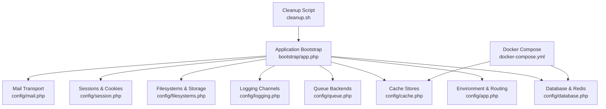
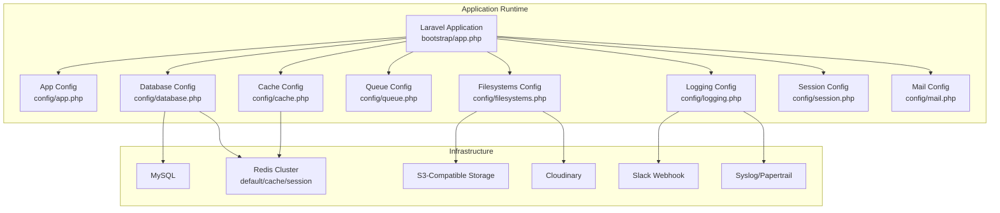
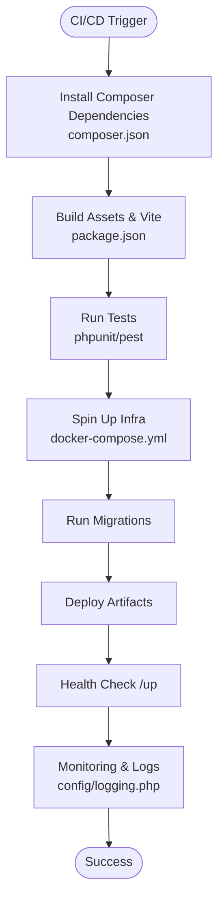
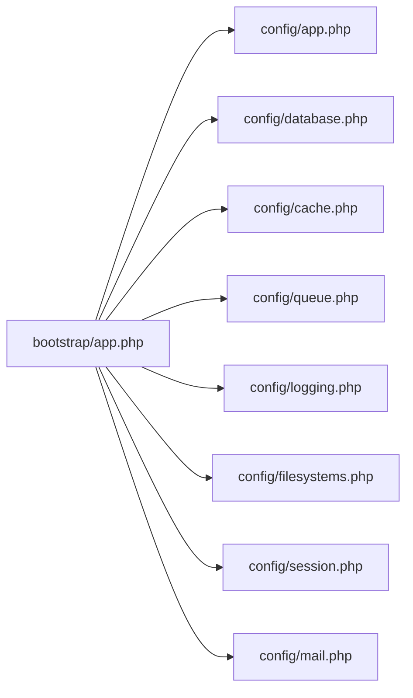

# Deployment Configuration

<cite>
**Referenced Files in This Document**
- [config/app.php](file://config/app.php)
- [config/database.php](file://config/database.php)
- [config/cache.php](file://config/cache.php)
- [config/queue.php](file://config/queue.php)
- [config/logging.php](file://config/logging.php)
- [config/filesystems.php](file://config/filesystems.php)
- [config/session.php](file://config/session.php)
- [config/mail.php](file://config/mail.php)
- [bootstrap/app.php](file://bootstrap/app.php)
- [composer.json](file://composer.json)
- [docker-compose.yml](file://docker-compose.yml)
- [cleanup.sh](file://cleanup.sh)
</cite>

## Table of Contents
1. [Introduction](#introduction)
2. [Project Structure](#project-structure)
3. [Core Components](#core-components)
4. [Architecture Overview](#architecture-overview)
5. [Detailed Component Analysis](#detailed-component-analysis)
6. [Dependency Analysis](#dependency-analysis)
7. [Performance Considerations](#performance-considerations)
8. [Troubleshooting Guide](#troubleshooting-guide)
9. [Conclusion](#conclusion)
10. [Appendices](#appendices)

## Introduction
This document provides comprehensive deployment configuration and production setup guidance for Frooxi’s Bagisto-based e-commerce platform. It covers production environment configuration, file system setup, logging configuration, and queue management. It also documents database optimization settings, cache configuration for production, security hardening procedures, deployment strategies, environment variable management, configuration validation for production releases, CI/CD pipeline configuration examples, automated deployment scripts, rollback procedures, monitoring setup, health checks, and performance tuning for production environments.

## Project Structure
The deployment configuration is primarily governed by Laravel configuration files under the config directory, the application bootstrap configuration, and supporting infrastructure files such as Docker Compose and cleanup scripts. The structure emphasizes environment-driven configuration via .env variables and modular configuration per concern.

**Diagram sources**
- [bootstrap/app.php:14-56](file://bootstrap/app.php#L14-L56)
- [config/app.php:3-187](file://config/app.php#L3-L187)
- [config/database.php:5-182](file://config/database.php#L5-L182)
- [config/cache.php:5-108](file://config/cache.php#L5-L108)
- [config/queue.php:3-112](file://config/queue.php#L3-L112)
- [config/logging.php:8-132](file://config/logging.php#L8-L132)
- [config/filesystems.php:3-93](file://config/filesystems.php#L3-L93)
- [config/session.php:5-217](file://config/session.php#L5-L217)
- [config/mail.php:3-154](file://config/mail.php#L3-L154)
- [docker-compose.yml:1-74](file://docker-compose.yml#L1-L74)
- [cleanup.sh:1-55](file://cleanup.sh#L1-L55)

**Section sources**
- [bootstrap/app.php:14-56](file://bootstrap/app.php#L14-L56)
- [config/app.php:3-187](file://config/app.php#L3-L187)
- [docker-compose.yml:1-74](file://docker-compose.yml#L1-L74)
- [cleanup.sh:1-55](file://cleanup.sh#L1-L55)

## Core Components
- Application environment and runtime behavior are configured via environment variables in config/app.php, including application name, environment, debug mode, URL, admin URL, timezone, locale, encryption key, and maintenance mode driver/store.
- Database connectivity and Redis configuration are centralized in config/database.php, supporting multiple drivers and Redis clusters with distinct databases for default, cache, and session usage.
- Cache stores are defined in config/cache.php, enabling production-grade backends such as Redis and database-backed caching with configurable prefixes.
- Queue backends are configured in config/queue.php, supporting sync, database, Beanstalkd, SQS, and Redis with job batching and failed job handling.
- Logging channels are defined in config/logging.php, supporting stack-based logging, daily rotation, Slack, syslog, stderr, and Papertrail integrations.
- Filesystems and storage are configured in config/filesystems.php, including local disks, S3, and Cloudinary, with public storage symlink generation.
- Sessions and cookies are configured in config/session.php, including driver selection, lifetime, encryption, cookie attributes, and SameSite policies.
- Mail transport is configured in config/mail.php, supporting SMTP, SES, Postmark, Resend, Sendmail, and dynamic SMTP transport.
- Bootstrap configuration in bootstrap/app.php defines routing, middleware overrides, health endpoint, and proxy trust.

**Section sources**
- [config/app.php:3-187](file://config/app.php#L3-L187)
- [config/database.php:5-182](file://config/database.php#L5-L182)
- [config/cache.php:5-108](file://config/cache.php#L5-L108)
- [config/queue.php:3-112](file://config/queue.php#L3-L112)
- [config/logging.php:8-132](file://config/logging.php#L8-L132)
- [config/filesystems.php:3-93](file://config/filesystems.php#L3-L93)
- [config/session.php:5-217](file://config/session.php#L5-L217)
- [config/mail.php:3-154](file://config/mail.php#L3-L154)
- [bootstrap/app.php:14-56](file://bootstrap/app.php#L14-L56)

## Architecture Overview
The production architecture relies on environment-driven configuration and modularized concerns. The application exposes a health endpoint, integrates with external services via queues and cache, and persists data through database and filesystem backends. Docker Compose provisions MySQL and Redis for development and CI environments.

**Diagram sources**
- [bootstrap/app.php:14-56](file://bootstrap/app.php#L14-L56)
- [config/app.php:3-187](file://config/app.php#L3-L187)
- [config/database.php:5-182](file://config/database.php#L5-L182)
- [config/cache.php:5-108](file://config/cache.php#L5-L108)
- [config/queue.php:3-112](file://config/queue.php#L3-L112)
- [config/logging.php:8-132](file://config/logging.php#L8-L132)
- [config/filesystems.php:3-93](file://config/filesystems.php#L3-L93)
- [config/session.php:5-217](file://config/session.php#L5-L217)
- [config/mail.php:3-154](file://config/mail.php#L3-L154)

## Detailed Component Analysis

### Production Environment Configuration
- Environment and runtime:
  - Application environment and debug mode are controlled via APP_ENV and APP_DEBUG.
  - Maintenance mode driver and store are configurable for distributed control.
  - URL and admin URL are environment-driven for multi-tenant or reverse-proxy setups.
  - Timezone and locale are set for consistent internationalization.
- Security hardening:
  - Encryption cipher and key management are enforced.
  - Secure headers middleware is appended in bootstrap/app.php.
  - CSRF validation exceptions are explicitly declared for specific routes.
  - Proxy trust is enabled for load balancers/proxies.

**Section sources**
- [config/app.php:29](file://config/app.php#L29)
- [config/app.php:42](file://config/app.php#L42)
- [config/app.php:182-185](file://config/app.php#L182-L185)
- [config/app.php:161](file://config/app.php#L161)
- [bootstrap/app.php:36-48](file://bootstrap/app.php#L36-L48)

### Database Optimization Settings
- Supported drivers include sqlite, mysql, mariadb, pgsql, and sqlsrv.
- Strict mode is disabled for MySQL/MariaDB to align with legacy compatibility expectations.
- SSL CA configuration is supported for MySQL connections.
- Redis client and cluster settings enable high-throughput caching and pub/sub.
- Migration repository table configuration supports publish/update lifecycle.

**Section sources**
- [config/database.php:45-83](file://config/database.php#L45-L83)
- [config/database.php:58](file://config/database.php#L58)
- [config/database.php:61](file://config/database.php#L61)
- [config/database.php:144-180](file://config/database.php#L144-L180)

### Cache Configuration for Production
- Default store is file-based; recommended production stores include Redis and database.
- Redis cache connection and lock connection are configurable for isolation.
- Cache key prefix is slugified from APP_NAME to prevent collisions across environments.
- Octane store is available for high-performance hot-reload scenarios.

**Section sources**
- [config/cache.php:18](file://config/cache.php#L18)
- [config/cache.php:74-78](file://config/cache.php#L74-L78)
- [config/cache.php:106](file://config/cache.php#L106)

### Queue Management
- Default queue driver is database; production-grade drivers include Redis and SQS.
- Job batching is configured with a dedicated table for batch tracking.
- Failed job logging supports database-uuids, DynamoDB, file, and null drivers.
- Retry-after values and block-for settings are environment-configurable.

**Section sources**
- [config/queue.php:16](file://config/queue.php#L16)
- [config/queue.php:37-44](file://config/queue.php#L37-L44)
- [config/queue.php:66-73](file://config/queue.php#L66-L73)
- [config/queue.php:88-91](file://config/queue.php#L88-L91)
- [config/queue.php:106-110](file://config/queue.php#L106-L110)

### Logging Configuration
- Default channel is stack; production should select appropriate channels such as daily, slack, syslog, or stderr.
- Daily rotation with retention days is configurable.
- Slack webhook integration and Papertrail syslog are supported for alerting and log aggregation.

**Section sources**
- [config/logging.php:21](file://config/logging.php#L21)
- [config/logging.php:68-74](file://config/logging.php#L68-L74)
- [config/logging.php:76-83](file://config/logging.php#L76-L83)
- [config/logging.php:85-95](file://config/logging.php#L85-L95)

### File System Setup
- Default disk is public; local, private, S3, and Cloudinary are supported.
- Public storage symlink is generated to serve media assets.
- Visibility and URL generation are environment-driven for CDN and reverse-proxy setups.

**Section sources**
- [config/filesystems.php:16](file://config/filesystems.php#L16)
- [config/filesystems.php:47-53](file://config/filesystems.php#L47-L53)
- [config/filesystems.php:55-74](file://config/filesystems.php#L55-L74)
- [config/filesystems.php:89-91](file://config/filesystems.php#L89-L91)

### Session and Cookie Security
- Session driver defaults to database; Redis is recommended for scale.
- Cookie attributes include secure, http-only, same-site, and optional partitioned cookies.
- Session lifetime and expiration behavior are configurable.

**Section sources**
- [config/session.php:21](file://config/session.php#L21)
- [config/session.php:130-133](file://config/session.php#L130-L133)
- [config/session.php:172](file://config/session.php#L172)
- [config/session.php:202](file://config/session.php#L202)
- [config/session.php:215](file://config/session.php#L215)

### Mail Transport
- Default mailer is a custom dynamic SMTP transport; SMTP, SES, Postmark, Resend, Sendmail, and log transports are supported.
- Global sender and admin/contact addresses are configurable.

**Section sources**
- [config/mail.php:17](file://config/mail.php#L17)
- [config/mail.php:38-105](file://config/mail.php#L38-L105)
- [config/mail.php:118-152](file://config/mail.php#L118-L152)

### Health Checks and Monitoring
- Health endpoint is exposed at /up via bootstrap/app.php.
- Logging channels support integration with Slack and syslog/Papertrail for monitoring and alerting.

**Section sources**
- [bootstrap/app.php:18](file://bootstrap/app.php#L18)
- [config/logging.php:76-83](file://config/logging.php#L76-L83)
- [config/logging.php:85-95](file://config/logging.php#L85-L95)

### CI/CD Pipeline Configuration and Automated Deployment
- Composer dependencies and autoload optimization are defined in composer.json.
- Docker Compose provisions MySQL and Redis for containerized environments.
- Cleanup script removes obsolete package artifacts to streamline deployments.

**Diagram sources**
- [composer.json:92-101](file://composer.json#L92-L101)
- [docker-compose.yml:1-74](file://docker-compose.yml#L1-L74)
- [bootstrap/app.php:18](file://bootstrap/app.php#L18)
- [config/logging.php:21](file://config/logging.php#L21)

**Section sources**
- [composer.json:92-101](file://composer.json#L92-L101)
- [docker-compose.yml:1-74](file://docker-compose.yml#L1-L74)
- [cleanup.sh:1-55](file://cleanup.sh#L1-L55)

### Rollback Procedures
- Maintain multiple APP_KEY entries for seamless key rotation and fallback.
- Use database migration versioning to roll back schema changes.
- Revert artifact deployments to previous working versions and restore backups for data and media.

**Section sources**
- [config/app.php:163-167](file://config/app.php#L163-L167)
- [config/database.php:128-131](file://config/database.php#L128-L131)

### Configuration Validation for Production Releases
- Validate environment variables for database credentials, cache and queue backends, logging channels, filesystem disks, mailer settings, and session configuration.
- Confirm health endpoint availability and successful log aggregation.
- Verify Redis and MySQL health checks in containerized environments.

**Section sources**
- [config/database.php:19](file://config/database.php#L19)
- [config/cache.php:18](file://config/cache.php#L18)
- [config/queue.php:16](file://config/queue.php#L16)
- [config/logging.php:21](file://config/logging.php#L21)
- [config/filesystems.php:16](file://config/filesystems.php#L16)
- [config/mail.php:17](file://config/mail.php#L17)
- [config/session.php:21](file://config/session.php#L21)
- [docker-compose.yml:43-65](file://docker-compose.yml#L43-L65)

## Dependency Analysis
The application’s deployment configuration exhibits low coupling between concerns, with each subsystem (database, cache, queue, logging, filesystems, sessions, mail) independently configurable via environment variables. The bootstrap layer orchestrates routing and middleware while delegating operational concerns to configuration files.

**Diagram sources**
- [bootstrap/app.php:14-56](file://bootstrap/app.php#L14-L56)
- [config/app.php:3-187](file://config/app.php#L3-L187)
- [config/database.php:5-182](file://config/database.php#L5-L182)
- [config/cache.php:5-108](file://config/cache.php#L5-L108)
- [config/queue.php:3-112](file://config/queue.php#L3-L112)
- [config/logging.php:8-132](file://config/logging.php#L8-L132)
- [config/filesystems.php:3-93](file://config/filesystems.php#L3-L93)
- [config/session.php:5-217](file://config/session.php#L5-L217)
- [config/mail.php:3-154](file://config/mail.php#L3-L154)

**Section sources**
- [bootstrap/app.php:14-56](file://bootstrap/app.php#L14-L56)
- [config/app.php:3-187](file://config/app.php#L3-L187)

## Performance Considerations
- Use Redis for cache and queues in production to reduce database load and improve throughput.
- Enable database strict mode only if schema guarantees are met; otherwise, keep it disabled for compatibility.
- Configure queue retry-after and block-for settings aligned with workload characteristics.
- Optimize logging levels and channels to minimize I/O overhead in production.
- Tune session lifetime and secure cookie attributes to balance security and performance.

[No sources needed since this section provides general guidance]

## Troubleshooting Guide
- Health check failures:
  - Verify health endpoint configuration and container readiness probes.
  - Inspect MySQL and Redis health checks in docker-compose.yml.
- Logging issues:
  - Confirm default channel and stack composition in config/logging.php.
  - Validate Slack webhook URL and Papertrail host/port.
- Database connectivity:
  - Review DB_CONNECTION, host, port, username, and password in config/database.php.
  - Ensure SSL CA path is set if required.
- Queue failures:
  - Check failed job driver and table configuration in config/queue.php.
  - Validate queue worker processes and retry-after settings.
- Filesystem errors:
  - Confirm FILESYSTEM_DISK and S3/Cloudinary credentials in config/filesystems.php.
  - Ensure public/storage symlink exists.

**Section sources**
- [bootstrap/app.php:18](file://bootstrap/app.php#L18)
- [docker-compose.yml:43-65](file://docker-compose.yml#L43-L65)
- [config/logging.php:21](file://config/logging.php#L21)
- [config/database.php:19](file://config/database.php#L19)
- [config/queue.php:106-110](file://config/queue.php#L106-L110)
- [config/filesystems.php:16](file://config/filesystems.php#L16)

## Conclusion
Frooxi’s deployment configuration leverages environment-driven settings across Laravel’s modular configuration system. Production readiness hinges on selecting robust backends for cache and queues (Redis), ensuring secure session and cookie policies, validating logging and filesystem configurations, and integrating health checks and monitoring. The included Docker Compose and cleanup scripts facilitate reproducible environments and streamlined deployments.

[No sources needed since this section summarizes without analyzing specific files]

## Appendices
- Environment variable management:
  - Centralize secrets and configuration in .env and CI/CD secret stores.
  - Use distinct environment files for staging and production.
- Security hardening checklist:
  - Enforce HTTPS, secure cookies, and SameSite policies.
  - Rotate APP_KEY regularly and maintain previous keys.
  - Restrict debug mode and configure debug_allowed_ips.
- Monitoring and alerting:
  - Integrate Slack and syslog/Papertrail channels for critical events.
  - Track queue backlog and cache hit rates.

[No sources needed since this section provides general guidance]