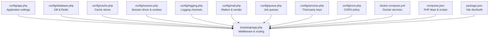
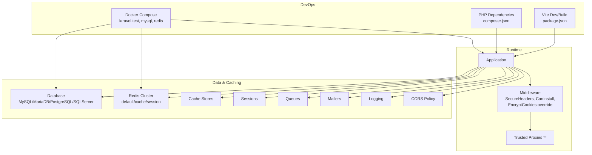
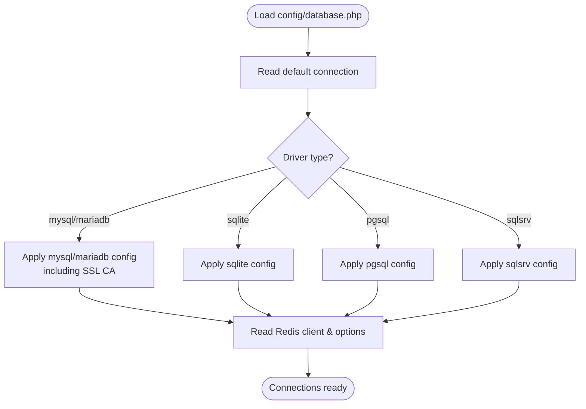
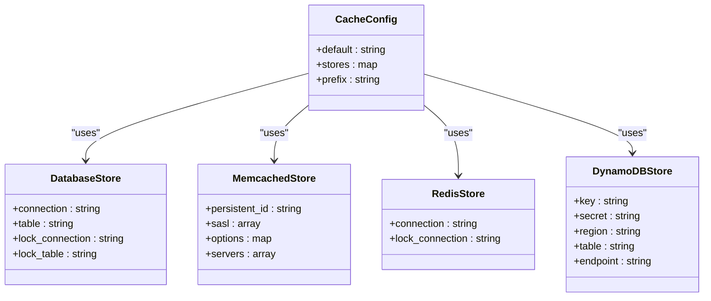
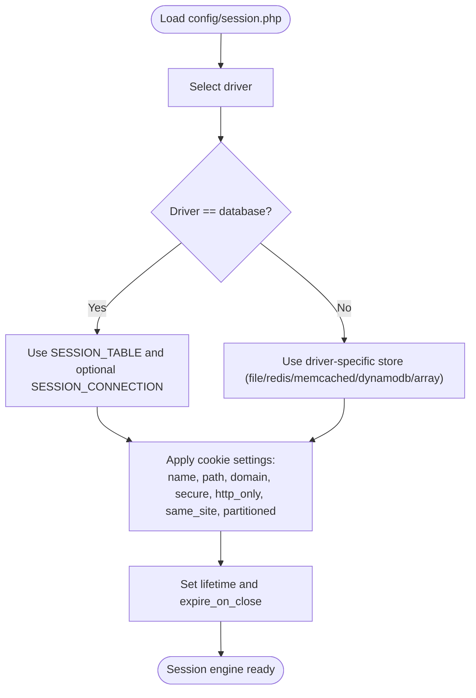
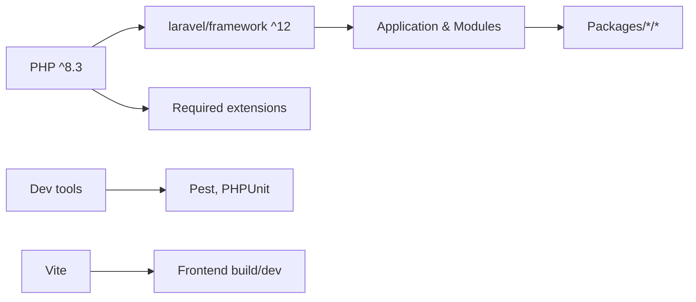

# Environment Setup

<cite>
**Referenced Files in This Document**
- [config/app.php](file://config/app.php)
- [config/database.php](file://config/database.php)
- [config/cache.php](file://config/cache.php)
- [config/session.php](file://config/session.php)
- [config/logging.php](file://config/logging.php)
- [config/mail.php](file://config/mail.php)
- [config/queue.php](file://config/queue.php)
- [config/cors.php](file://config/cors.php)
- [config/services.php](file://config/services.php)
- [bootstrap/app.php](file://bootstrap/app.php)
- [docker-compose.yml](file://docker-compose.yml)
- [composer.json](file://composer.json)
- [package.json](file://package.json)
</cite>

## Table of Contents
1. [Introduction](#introduction)
2. [Project Structure](#project-structure)
3. [Core Components](#core-components)
4. [Architecture Overview](#architecture-overview)
5. [Detailed Component Analysis](#detailed-component-analysis)
6. [Dependency Analysis](#dependency-analysis)
7. [Performance Considerations](#performance-considerations)
8. [Troubleshooting Guide](#troubleshooting-guide)
9. [Conclusion](#conclusion)
10. [Appendices](#appendices)

## Introduction
This document explains how to set up and configure the Frooxi environment for development and production. It covers environment variable configuration, database and cache settings, session management, development versus production differences, security considerations for sensitive data, environment-specific optimizations, Docker configuration, reverse proxy and load balancer guidance, SSL/TLS, CDN configuration, and performance tuning. The goal is to help operators deploy and operate the system reliably and securely across environments.

## Project Structure
The environment configuration is primarily managed through Laravel’s configuration files under config/, environment variables loaded via env(), and container orchestration via docker-compose.yml. The bootstrap/app.php file wires middleware and runtime behavior, while composer.json and package.json define runtime dependencies and scripts.

**Diagram sources**
- [config/app.php:1-188](file://config/app.php#L1-L188)
- [bootstrap/app.php:1-56](file://bootstrap/app.php#L1-L56)
- [config/database.php:1-183](file://config/database.php#L1-L183)
- [config/cache.php:1-109](file://config/cache.php#L1-L109)
- [config/session.php:1-218](file://config/session.php#L1-L218)
- [config/logging.php:1-133](file://config/logging.php#L1-L133)
- [config/mail.php:1-155](file://config/mail.php#L1-L155)
- [config/queue.php:1-113](file://config/queue.php#L1-L113)
- [config/services.php:1-82](file://config/services.php#L1-L82)
- [config/cors.php:1-35](file://config/cors.php#L1-L35)
- [docker-compose.yml:1-74](file://docker-compose.yml#L1-L74)
- [composer.json:1-135](file://composer.json#L1-L135)
- [package.json:1-15](file://package.json#L1-L15)

**Section sources**
- [config/app.php:1-188](file://config/app.php#L1-L188)
- [bootstrap/app.php:1-56](file://bootstrap/app.php#L1-L56)
- [docker-compose.yml:1-74](file://docker-compose.yml#L1-L74)
- [composer.json:1-135](file://composer.json#L1-L135)
- [package.json:1-15](file://package.json#L1-L15)

## Core Components
- Application identity, environment, debug mode, URL, admin URL, timezone, locale, encryption key, and maintenance driver.
- Database connections (SQLite, MySQL, MariaDB, PostgreSQL, SQL Server), migration table, and Redis clusters for default, cache, and session.
- Cache stores (array, database, file, memcached, redis, dynamodb, octane) and key prefixing.
- Session driver (file, cookie, database, APCu, memcached, redis, dynamodb, array), lifetime, encryption, cookie attributes, and store mapping.
- Logging channels (stack, single, daily, slack, syslog, stderr, papertrail, errorlog, null) and deprecation logging.
- Mailers (SMTP, SES, Postmark, Resend, Sendmail, Log, Array, Failover, Round-robin), global From/Admin/Contact addresses.
- Queues (sync, database, Beanstalkd, SQS, Redis) and failed job storage.
- CORS policy for API paths and credentials.
- Third-party service credentials (Postmark, SES, Resend, Slack, exchange APIs, social providers).
- Bootstrap wiring for middleware, proxies, CSRF exceptions, and cookie encryption replacement.

**Section sources**
- [config/app.php:1-188](file://config/app.php#L1-L188)
- [config/database.php:1-183](file://config/database.php#L1-L183)
- [config/cache.php:1-109](file://config/cache.php#L1-L109)
- [config/session.php:1-218](file://config/session.php#L1-L218)
- [config/logging.php:1-133](file://config/logging.php#L1-L133)
- [config/mail.php:1-155](file://config/mail.php#L1-L155)
- [config/queue.php:1-113](file://config/queue.php#L1-L113)
- [config/cors.php:1-35](file://config/cors.php#L1-L35)
- [config/services.php:1-82](file://config/services.php#L1-L82)
- [bootstrap/app.php:1-56](file://bootstrap/app.php#L1-L56)

## Architecture Overview
The environment configuration orchestrates runtime behavior across application, database, cache, session, logging, mail, queue, and CORS layers. Docker Compose provisions a local stack with PHP application, MySQL, and Redis. Middleware ensures secure headers, install checks, and CSRF handling, while proxies and cookie policies are configurable.

**Diagram sources**
- [bootstrap/app.php:1-56](file://bootstrap/app.php#L1-L56)
- [config/database.php:1-183](file://config/database.php#L1-L183)
- [config/cache.php:1-109](file://config/cache.php#L1-L109)
- [config/session.php:1-218](file://config/session.php#L1-L218)
- [config/queue.php:1-113](file://config/queue.php#L1-L113)
- [config/mail.php:1-155](file://config/mail.php#L1-L155)
- [config/logging.php:1-133](file://config/logging.php#L1-L133)
- [config/cors.php:1-35](file://config/cors.php#L1-L35)
- [docker-compose.yml:1-74](file://docker-compose.yml#L1-L74)
- [composer.json:1-135](file://composer.json#L1-L135)
- [package.json:1-15](file://package.json#L1-L15)

## Detailed Component Analysis

### Environment Variables and Application Settings
- Application name, environment, debug mode, allowed IPs, URL, admin URL, timezone, locale, fallback locale, faker locale, default country, base currency, channel, cipher, encryption key, previous keys, and maintenance driver/store.
- Security-sensitive values include APP_KEY and previous keys; ensure they are rotated and stored securely.

**Section sources**
- [config/app.php:16-187](file://config/app.php#L16-L187)

### Database Configuration
- Default connection is derived from DB_CONNECTION; supports sqlite, mysql, mariadb, pgsql, sqlsrv.
- Connection parameters include host, port, database, username, password, charset, collation, prefix, strict mode, and SSL CA for PDO.
- Redis client type, cluster prefix, and per-store connections for default, cache, and session.
- Migration repository table defaults and Redis options.

**Diagram sources**
- [config/database.php:19-182](file://config/database.php#L19-L182)

**Section sources**
- [config/database.php:19-182](file://config/database.php#L19-L182)

### Cache Configuration
- Default store is CACHE_STORE; supported stores include array, database, file, memcached, redis, dynamodb, octane, null.
- Database-backed cache uses DB_CACHE_* variables for connection, table, lock connection, and lock table.
- Memcached servers and SASL credentials are configurable.
- Redis cache uses REDIS_CACHE_CONNECTION and REDIS_CACHE_LOCK_CONNECTION.
- DynamoDB cache uses AWS credentials and region; table and endpoint configurable.
- Cache key prefix is prefixed by APP_NAME slug.

**Diagram sources**
- [config/cache.php:18-106](file://config/cache.php#L18-L106)

**Section sources**
- [config/cache.php:18-106](file://config/cache.php#L18-L106)

### Session Management
- Driver defaults to database; alternatives include file, cookie, APCu, memcached, redis, dynamodb, array.
- Session lifetime in minutes and expiration on close flag.
- Encryption toggle for session data.
- Session files location under storage_path('framework/sessions').
- Database table configurable via SESSION_TABLE; connection via SESSION_CONNECTION.
- Cache store mapping via SESSION_STORE for cache-backed drivers.
- Cookie name, path, domain, secure, http_only, same_site, and partitioned cookie toggles.

**Diagram sources**
- [config/session.php:21-217](file://config/session.php#L21-L217)

**Section sources**
- [config/session.php:21-217](file://config/session.php#L21-L217)

### Logging Configuration
- Default channel is LOG_CHANNEL; supports stack, single, daily, slack, syslog, stderr, papertrail, errorlog, and null.
- Deprecations channel and tracing toggle.
- Daily retention days configurable; Papertrail requires host and port; Slack requires webhook URL and optional username/emoji.
- Level configurable per channel; placeholders enabled for replacements.

**Section sources**
- [config/logging.php:21-132](file://config/logging.php#L21-L132)

### Mail Configuration
- Default mailer is nextoutfit-dynamic-smtp; SMTP host/port/encryption/username/password and EHLO domain configurable.
- SES, Postmark, Resend transports supported.
- Sendmail path configurable.
- Log and array transports for development/testing.
- Failover and roundrobin strategies for resilience.
- Global From/Admin/Contact addresses and names.

**Section sources**
- [config/mail.php:17-154](file://config/mail.php#L17-L154)

### Queue Configuration
- Default queue connection is QUEUE_CONNECTION; supports sync, database, beanstalkd, sqs, redis.
- Database queue table, queue name, retry_after, and after_commit.
- Beanstalkd host, queue, retry_after, block_for.
- SQS key/secret/region/prefix/queue/suffix.
- Redis queue connection, queue name, retry_after, block_for.
- Failed jobs driver and table.

**Section sources**
- [config/queue.php:16-112](file://config/queue.php#L16-L112)

### CORS Policy
- Paths and methods allowed globally; origins wildcard by default; headers wildcard; max age and credentials toggled.
- Adjust allowed_origins and supports_credentials for production hardening.

**Section sources**
- [config/cors.php:18-34](file://config/cors.php#L18-L34)

### Third-Party Services
- Postmark, SES, Resend tokens and regions.
- Slack bot token and default channel.
- Exchange rate APIs (Fixer, Exchange Rates) with keys and classes.
- Social providers (Facebook, Twitter, Google, LinkedIn OpenID, GitHub) with client IDs, secrets, and redirect callbacks.

**Section sources**
- [config/services.php:17-81](file://config/services.php#L17-L81)

### Bootstrap and Middleware
- Removes default maintenance and empty-string conversion middleware.
- Appends SecureHeaders and CanInstall middlewares.
- Replaces default EncryptCookies with application-specific EncryptCookies.
- Validates CSRF tokens except stripe/* routes.
- Trusts proxies for upstream load balancers.

**Section sources**
- [bootstrap/app.php:20-49](file://bootstrap/app.php#L20-L49)

## Dependency Analysis
- Runtime dependencies are declared in composer.json; autoload maps namespaces for core and package modules.
- Frontend tooling uses Vite via package.json scripts.
- Docker Compose provisions PHP application, MySQL, and Redis services with health checks and shared network/volume.

**Diagram sources**
- [composer.json:10-44](file://composer.json#L10-L44)
- [composer.json:46-56](file://composer.json#L46-L56)
- [package.json:4-14](file://package.json#L4-L14)

**Section sources**
- [composer.json:10-135](file://composer.json#L10-L135)
- [package.json:1-15](file://package.json#L1-L15)
- [docker-compose.yml:1-74](file://docker-compose.yml#L1-L74)

## Performance Considerations
- Use Redis for cache and sessions in production for horizontal scaling and lower latency.
- Prefer database-backed sessions only when centralized persistence is required; otherwise use Redis for speed.
- Tune queue workers and retry_after per workload; monitor failed jobs.
- Enable proper logging levels and rotation (daily) to reduce I/O overhead.
- Use Octane-compatible cache drivers (octane) for in-process caching in high-throughput scenarios.
- Configure trusted proxies to ensure correct scheme/headers for HTTPS termination.

[No sources needed since this section provides general guidance]

## Troubleshooting Guide
- Application key missing or invalid: ensure APP_KEY is set and matches the generated key; previous keys can be rotated via APP_PREVIOUS_KEYS.
- Database connectivity failures: verify DB_CONNECTION and credentials; confirm SSL CA path if using PDO options; check Redis client and cluster prefix.
- Session issues: confirm SESSION_DRIVER alignment with infrastructure; ensure SESSION_TABLE exists if using database sessions; check cookie domain/path/security flags.
- Queue not processing: verify QUEUE_CONNECTION and worker configuration; inspect failed_jobs table for errors.
- Logging anomalies: set LOG_LEVEL appropriately; use daily channel for rotation; validate Papertrail/Slack endpoints.
- CORS blocked requests: tighten allowed_origins and enable supports_credentials only when necessary.
- Reverse proxy and load balancer: ensure trusted proxies are configured; enforce HTTPS cookies; set APP_URL to HTTPS origin.

**Section sources**
- [config/app.php:161-167](file://config/app.php#L161-L167)
- [config/database.php:19-182](file://config/database.php#L19-L182)
- [config/session.php:21-217](file://config/session.php#L21-L217)
- [config/queue.php:16-112](file://config/queue.php#L16-L112)
- [config/logging.php:21-132](file://config/logging.php#L21-L132)
- [config/cors.php:18-34](file://config/cors.php#L18-L34)
- [bootstrap/app.php:48-48](file://bootstrap/app.php#L48-L48)

## Conclusion
Frooxi’s environment setup relies on a layered configuration model: application settings, database and cache backends, session and queue strategies, logging and mail delivery, and CORS policy. Production deployments should emphasize secure keys, Redis-backed cache and sessions, hardened CORS and cookie policies, and robust logging and queue monitoring. Docker Compose streamlines local development, while middleware and trusted proxy settings prepare the app for reverse proxy and load balancer deployments.

[No sources needed since this section summarizes without analyzing specific files]

## Appendices

### Step-by-Step Setup Procedures
- Local development with Sail/Docker:
  - Start services via docker-compose.yml; ensure MySQL and Redis are healthy.
  - Generate application key if needed.
  - Run database migrations and seeders.
  - Build frontend assets using Vite scripts.
- Production checklist:
  - Set APP_ENV=production, APP_DEBUG=false, APP_URL=https://your-domain.
  - Generate and secure APP_KEY; rotate previous keys.
  - Choose Redis for cache/session; configure DB and Redis credentials.
  - Configure mailer (SES/Postmark/SMTP) and sender addresses.
  - Set queue connection to database or Redis; run workers.
  - Harden CORS and session cookies; enable trusted proxies.
  - Monitor logs and configure alerts.

**Section sources**
- [docker-compose.yml:1-74](file://docker-compose.yml#L1-L74)
- [config/app.php:29-67](file://config/app.php#L29-L67)
- [config/mail.php:17-154](file://config/mail.php#L17-L154)
- [config/queue.php:16-112](file://config/queue.php#L16-L112)
- [config/session.php:21-217](file://config/session.php#L21-L217)
- [config/cors.php:18-34](file://config/cors.php#L18-L34)
- [bootstrap/app.php:48-48](file://bootstrap/app.php#L48-L48)
- [package.json:4-6](file://package.json#L4-L6)

### Environment-Specific Optimizations
- Development:
  - APP_DEBUG=true, LOG_LEVEL=debug, daily rotation, mail log transport.
  - File cache/session for simplicity.
- Production:
  - APP_DEBUG=false, LOG_LEVEL=notice/warn, centralized logging (Papertrail/Slack), Redis cache/session.
  - HTTPS enforcement via APP_URL and secure cookies; trusted proxies enabled.

**Section sources**
- [config/app.php:42-42](file://config/app.php#L42-L42)
- [config/logging.php:61-119](file://config/logging.php#L61-L119)
- [config/session.php:130-217](file://config/session.php#L130-L217)
- [bootstrap/app.php:48-48](file://bootstrap/app.php#L48-L48)

### Security Considerations for Sensitive Data
- Store APP_KEY and previous keys in secure secret managers; rotate periodically.
- Use environment-specific .env files; exclude from version control.
- Enforce HTTPS cookies (secure=true) behind reverse proxies; set same_site and partitioned cookies as appropriate.
- Limit allowed_origins and disable supports_credentials unless required.
- Use trusted proxies to avoid header spoofing.

**Section sources**
- [config/app.php:161-167](file://config/app.php#L161-L167)
- [config/session.php:172-217](file://config/session.php#L172-L217)
- [config/cors.php:22-32](file://config/cors.php#L22-L32)
- [bootstrap/app.php:48-48](file://bootstrap/app.php#L48-L48)

### Docker Configuration
- Service definitions for PHP application, MySQL, and Redis with health checks.
- Port mappings for application and Vite; environment variables for credentials and Xdebug.
- Shared network and volumes for persistence.

**Section sources**
- [docker-compose.yml:1-74](file://docker-compose.yml#L1-L74)

### Reverse Proxy, Load Balancer, and SSL/TLS
- Configure trusted proxies to recognize upstream IPs.
- Enforce HTTPS by setting APP_URL to https; ensure cookies are secure and same_site is set appropriately.
- Place a TLS-terminating reverse proxy or load balancer in front of the application; forward headers accordingly.

**Section sources**
- [bootstrap/app.php:48-48](file://bootstrap/app.php#L48-L48)
- [config/app.php:67-67](file://config/app.php#L67-L67)
- [config/session.php:172-202](file://config/session.php#L172-L202)

### CDN and Performance Optimization
- Serve static assets via CDN; ensure cache headers and immutable assets where possible.
- Use Redis-backed cache and sessions for reduced latency.
- Tune queue workers and retry policies for background tasks.

[No sources needed since this section provides general guidance]