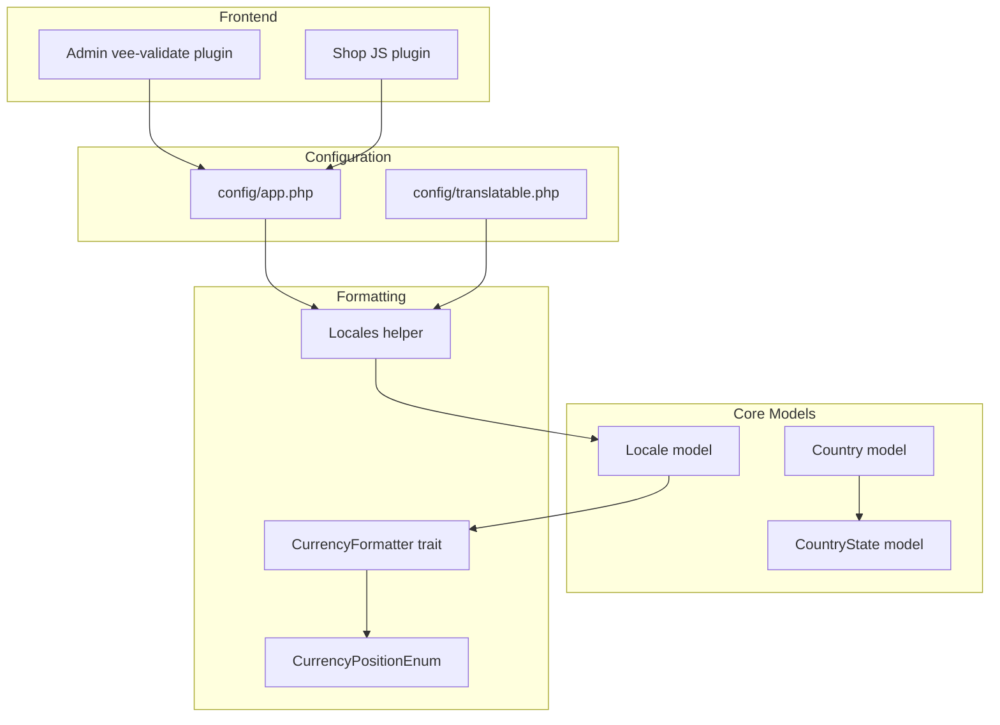
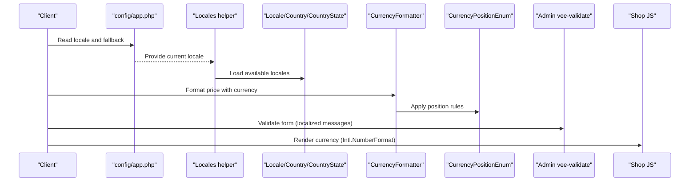
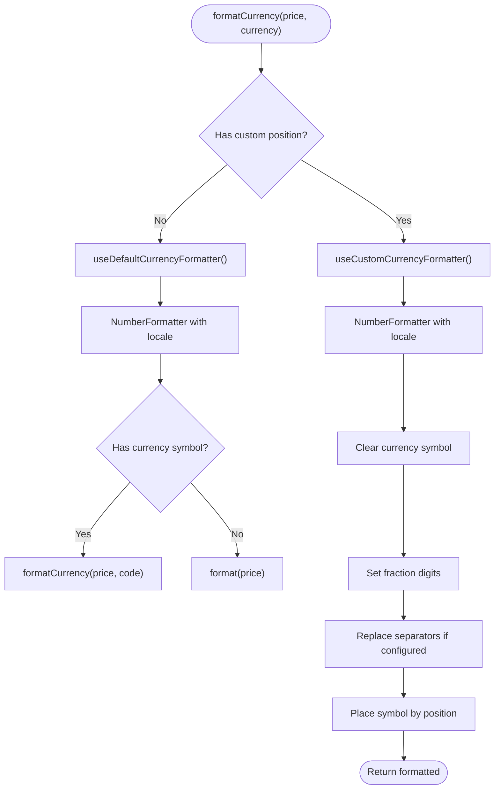
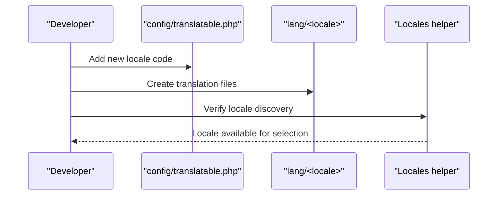
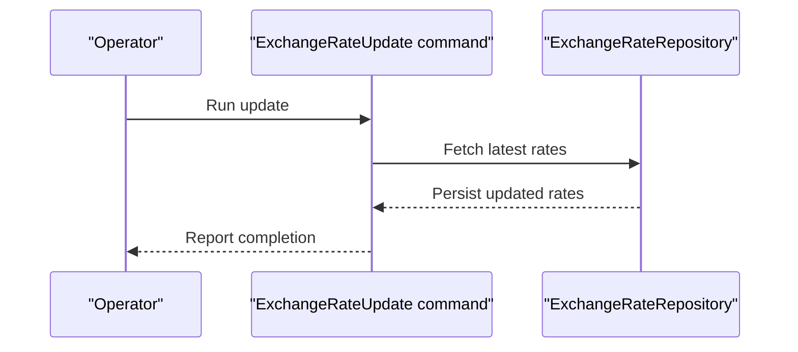
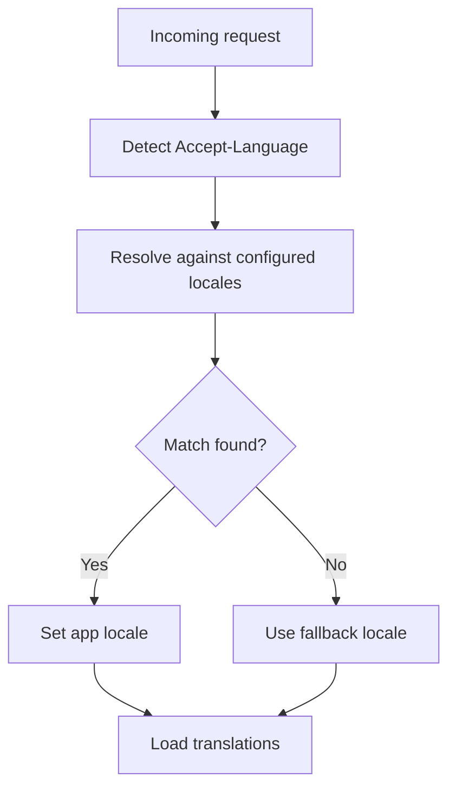
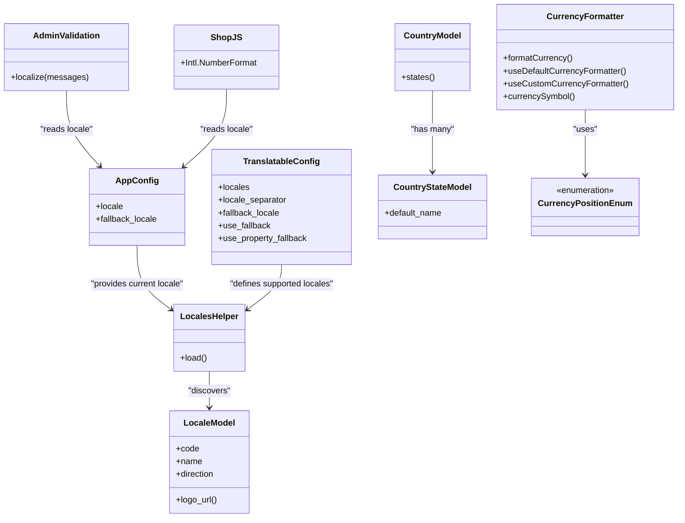

# Localization Configuration

<cite>
**Referenced Files in This Document**
- [config/app.php](file://config/app.php)
- [config/translatable.php](file://config/translatable.php)
- [packages/Webkul/Core/src/Helpers/Locales.php](file://packages/Webkul/Core/src/Helpers/Locales.php)
- [packages/Webkul/Core/src/Concerns/CurrencyFormatter.php](file://packages/Webkul/Core/src/Concerns/CurrencyFormatter.php)
- [packages/Webkul/Core/src/Models/Locale.php](file://packages/Webkul/Core/src/Models/Locale.php)
- [packages/Webkul/Core/src/Models/Country.php](file://packages/Webkul/Core/src/Models/Country.php)
- [packages/Webkul/Core/src/Models/CountryState.php](file://packages/Webkul/Core/src/Models/CountryState.php)
- [packages/Webkul/Core/src/Enums/CurrencyPositionEnum.php](file://packages/Webkul/Core/src/Enums/CurrencyPositionEnum.php)
- [packages/Webkul/Admin/src/Resources/assets/js/plugins/vee-validate.js](file://packages/Webkul/Admin/src/Resources/assets/js/plugins/vee-validate.js)
- [packages/Webkul/Shop/src/Resources/assets/js/plugins/shop.js](file://packages/Webkul/Shop/src/Resources/assets/js/plugins/shop.js)
</cite>

## Table of Contents
1. [Introduction](#introduction)
2. [Project Structure](#project-structure)
3. [Core Components](#core-components)
4. [Architecture Overview](#architecture-overview)
5. [Detailed Component Analysis](#detailed-component-analysis)
6. [Dependency Analysis](#dependency-analysis)
7. [Performance Considerations](#performance-considerations)
8. [Troubleshooting Guide](#troubleshooting-guide)
9. [Conclusion](#conclusion)
10. [Appendices](#appendices)

## Introduction
This document explains Frooxi’s localization configuration system. It covers locale setup, language and regional configuration, country and state management, currency formatting, date/time and number formatting, translation management, locale-specific content, and internationalization best practices. It also provides practical examples for adding new locales, configuring currency exchange rates, and managing multi-language storefronts, along with locale detection, fallback mechanisms, and performance optimization strategies.

## Project Structure
Localization spans configuration, models, helpers, enums, and frontend plugins:
- Application-level locale and fallback defaults are defined in configuration.
- Translatable module configuration controls locales, fallback behavior, and translation model settings.
- Core models represent locales, countries, and states with translatable attributes.
- Formatting utilities handle currency presentation using PHP NumberFormatter and JavaScript Intl APIs.
- Frontend plugins provide localized validation messages and client-side currency formatting.

**Diagram sources**
- [config/app.php:105-107](file://config/app.php#L105-L107)
- [config/translatable.php:15-22](file://config/translatable.php#L15-L22)
- [packages/Webkul/Core/src/Helpers/Locales.php:12-19](file://packages/Webkul/Core/src/Helpers/Locales.php#L12-L19)
- [packages/Webkul/Core/src/Models/Locale.php:21-25](file://packages/Webkul/Core/src/Models/Locale.php#L21-L25)
- [packages/Webkul/Core/src/Models/Country.php:12-14](file://packages/Webkul/Core/src/Models/Country.php#L12-L14)
- [packages/Webkul/Core/src/Models/CountryState.php:12-14](file://packages/Webkul/Core/src/Models/CountryState.php#L12-L14)
- [packages/Webkul/Core/src/Concerns/CurrencyFormatter.php:13-20](file://packages/Webkul/Core/src/Concerns/CurrencyFormatter.php#L13-L20)
- [packages/Webkul/Core/src/Enums/CurrencyPositionEnum.php:5-26](file://packages/Webkul/Core/src/Enums/CurrencyPositionEnum.php#L5-L26)
- [packages/Webkul/Admin/src/Resources/assets/js/plugins/vee-validate.js:158-357](file://packages/Webkul/Admin/src/Resources/assets/js/plugins/vee-validate.js#L158-L357)
- [packages/Webkul/Shop/src/Resources/assets/js/plugins/shop.js:42-73](file://packages/Webkul/Shop/src/Resources/assets/js/plugins/shop.js#L42-L73)

**Section sources**
- [config/app.php:105-107](file://config/app.php#L105-L107)
- [config/translatable.php:15-22](file://config/translatable.php#L15-L22)
- [packages/Webkul/Core/src/Helpers/Locales.php:12-19](file://packages/Webkul/Core/src/Helpers/Locales.php#L12-L19)
- [packages/Webkul/Core/src/Models/Locale.php:21-25](file://packages/Webkul/Core/src/Models/Locale.php#L21-L25)
- [packages/Webkul/Core/src/Models/Country.php:12-14](file://packages/Webkul/Core/Core/src/Models/Country.php#L12-L14)
- [packages/Webkul/Core/src/Models/CountryState.php:12-14](file://packages/Webkul/Core/src/Models/CountryState.php#L12-L14)
- [packages/Webkul/Core/src/Concerns/CurrencyFormatter.php:13-20](file://packages/Webkul/Core/src/Concerns/CurrencyFormatter.php#L13-L20)
- [packages/Webkul/Core/src/Enums/CurrencyPositionEnum.php:5-26](file://packages/Webkul/Core/src/Enums/CurrencyPositionEnum.php#L5-L26)
- [packages/Webkul/Admin/src/Resources/assets/js/plugins/vee-validate.js:158-357](file://packages/Webkul/Admin/src/Resources/assets/js/plugins/vee-validate.js#L158-L357)
- [packages/Webkul/Shop/src/Resources/assets/js/plugins/shop.js:42-73](file://packages/Webkul/Shop/src/Resources/assets/js/plugins/shop.js#L42-L73)

## Core Components
- Locale definition and discovery: The application locale and fallback are configured centrally. A helper loads available locales from core services for runtime use.
- Translatable configuration: Defines supported locales, separators, default/fallback behavior, and translation model conventions.
- Regional data: Country and state models support translatable names and relationships.
- Currency formatting: A trait formats currency using ICU NumberFormatter with default and custom layouts, including position and separators.
- Frontend localization: Admin validation messages and storefront currency formatting leverage locale-aware APIs.

Key responsibilities:
- Locale setup: Centralized via configuration and dynamic discovery.
- Regional settings: Managed through Country and CountryState models with translations.
- Currency formatting: Dual-mode formatting via PHP and JavaScript, respecting locale and currency settings.
- Translation management: Controlled by translatable configuration and Laravel translation services.

**Section sources**
- [config/app.php:105-107](file://config/app.php#L105-L107)
- [config/translatable.php:15-22](file://config/translatable.php#L15-L22)
- [packages/Webkul/Core/src/Helpers/Locales.php:12-19](file://packages/Webkul/Core/src/Helpers/Locales.php#L12-L19)
- [packages/Webkul/Core/src/Models/Country.php:12-14](file://packages/Webkul/Core/src/Models/Country.php#L12-L14)
- [packages/Webkul/Core/src/Models/CountryState.php:12-14](file://packages/Webkul/Core/src/Models/CountryState.php#L12-L14)
- [packages/Webkul/Core/src/Concerns/CurrencyFormatter.php:13-20](file://packages/Webkul/Core/src/Concerns/CurrencyFormatter.php#L13-L20)
- [packages/Webkul/Admin/src/Resources/assets/js/plugins/vee-validate.js:158-357](file://packages/Webkul/Admin/src/Resources/assets/js/plugins/vee-validate.js#L158-L357)
- [packages/Webkul/Shop/src/Resources/assets/js/plugins/shop.js:42-73](file://packages/Webkul/Shop/src/Resources/assets/js/plugins/shop.js#L42-L73)

## Architecture Overview
The localization pipeline integrates configuration, models, formatting utilities, and frontend plugins.

**Diagram sources**
- [config/app.php:105-107](file://config/app.php#L105-L107)
- [packages/Webkul/Core/src/Helpers/Locales.php:12-19](file://packages/Webkul/Core/src/Helpers/Locales.php#L12-L19)
- [packages/Webkul/Core/src/Models/Locale.php:21-25](file://packages/Webkul/Core/src/Models/Locale.php#L21-L25)
- [packages/Webkul/Core/src/Concerns/CurrencyFormatter.php:13-20](file://packages/Webkul/Core/src/Concerns/CurrencyFormatter.php#L13-L20)
- [packages/Webkul/Core/src/Enums/CurrencyPositionEnum.php:5-26](file://packages/Webkul/Core/src/Enums/CurrencyPositionEnum.php#L5-L26)
- [packages/Webkul/Admin/src/Resources/assets/js/plugins/vee-validate.js:158-357](file://packages/Webkul/Admin/src/Resources/assets/js/plugins/vee-validate.js#L158-L357)
- [packages/Webkul/Shop/src/Resources/assets/js/plugins/shop.js:42-73](file://packages/Webkul/Shop/src/Resources/assets/js/plugins/shop.js#L42-L73)

## Detailed Component Analysis

### Locale Setup and Discovery
- Application locale and fallback are defined in configuration.
- A helper class loads available locales dynamically from core services and exposes them as code=>code pairs for runtime selection.

Implementation highlights:
- Centralized locale and fallback configuration.
- Dynamic discovery of installed locales for UI and routing.

Best practices:
- Keep configuration minimal and environment-driven.
- Ensure the helper reflects the actual installed locales.

**Section sources**
- [config/app.php:105-107](file://config/app.php#L105-L107)
- [packages/Webkul/Core/src/Helpers/Locales.php:12-19](file://packages/Webkul/Core/src/Helpers/Locales.php#L12-L19)

### Translatable Configuration
- Supported locales and separators are defined.
- Default and fallback locales control behavior when translations are missing.
- Property-level fallback allows returning fallback values when a specific property is empty.

Operational impact:
- Enables region-specific locales (e.g., es-MX) and hierarchical fallback resolution.

**Section sources**
- [config/translatable.php:15-22](file://config/translatable.php#L15-L22)
- [config/translatable.php:89](file://config/translatable.php#L89)
- [config/translatable.php:73](file://config/translatable.php#L73)

### Regional Settings: Country and State
- Country model defines translatable names and maintains a relationship to states.
- CountryState model defines translatable default names and ensures translations are eager-loaded.

Usage:
- Use Country->states() to fetch regions for a country.
- Access translated names via state attributes.

**Section sources**
- [packages/Webkul/Core/src/Models/Country.php:12-14](file://packages/Webkul/Core/src/Models/Country.php#L12-L14)
- [packages/Webkul/Core/src/Models/CountryState.php:12-14](file://packages/Webkul/Core/src/Models/CountryState.php#L12-L14)

### Currency Formatting
- Dual-mode formatting:
  - PHP: Uses NumberFormatter with locale-aware currency formatting and optional custom separators/symbols.
  - JavaScript: Uses Intl.NumberFormat in storefront scripts for client-side rendering.
- Positioning options are governed by an enum with four layout variants.

Key behaviors:
- Default formatter respects locale and currency code.
- Custom formatter supports explicit symbol, grouping, decimal separators, and position.

**Diagram sources**
- [packages/Webkul/Core/src/Concerns/CurrencyFormatter.php:13-20](file://packages/Webkul/Core/src/Concerns/CurrencyFormatter.php#L13-L20)
- [packages/Webkul/Core/src/Concerns/CurrencyFormatter.php:25-44](file://packages/Webkul/Core/src/Concerns/CurrencyFormatter.php#L25-L44)
- [packages/Webkul/Core/src/Concerns/CurrencyFormatter.php:49-88](file://packages/Webkul/Core/src/Concerns/CurrencyFormatter.php#L49-L88)
- [packages/Webkul/Core/src/Enums/CurrencyPositionEnum.php:5-26](file://packages/Webkul/Core/src/Enums/CurrencyPositionEnum.php#L5-L26)

**Section sources**
- [packages/Webkul/Core/src/Concerns/CurrencyFormatter.php:13-20](file://packages/Webkul/Core/src/Concerns/CurrencyFormatter.php#L13-L20)
- [packages/Webkul/Core/src/Concerns/CurrencyFormatter.php:25-44](file://packages/Webkul/Core/src/Concerns/CurrencyFormatter.php#L25-L44)
- [packages/Webkul/Core/src/Concerns/CurrencyFormatter.php:49-88](file://packages/Webkul/Core/src/Concerns/CurrencyFormatter.php#L49-L88)
- [packages/Webkul/Core/src/Enums/CurrencyPositionEnum.php:5-26](file://packages/Webkul/Core/src/Enums/CurrencyPositionEnum.php#L5-L26)

### Date/Time and Number Formatting
- Date/time formatting is handled by ICU-based NumberFormatter in PHP and Intl APIs in JavaScript.
- Number formatting follows locale-specific grouping and decimal separators.

Recommendations:
- Prefer locale-aware formatters for consistency across devices and browsers.
- Keep fractional digits and separators aligned with currency configuration.

**Section sources**
- [packages/Webkul/Core/src/Concerns/CurrencyFormatter.php:25-44](file://packages/Webkul/Core/src/Concerns/CurrencyFormatter.php#L25-L44)
- [packages/Webkul/Shop/src/Resources/assets/js/plugins/shop.js:42-73](file://packages/Webkul/Shop/src/Resources/assets/js/plugins/shop.js#L42-L73)

### Translation Management and Locale-Specific Content
- Translatable configuration governs fallback and property-level fallback.
- Admin validation messages are localized per locale in the vee-validate plugin.
- Storefront currency formatting uses locale metadata to render prices consistently.

Guidelines:
- Maintain translation completeness per locale.
- Use property fallback to avoid blank values when a specific field is untranslated.

**Section sources**
- [config/translatable.php:73](file://config/translatable.php#L73)
- [packages/Webkul/Admin/src/Resources/assets/js/plugins/vee-validate.js:158-357](file://packages/Webkul/Admin/src/Resources/assets/js/plugins/vee-validate.js#L158-L357)
- [packages/Webkul/Shop/src/Resources/assets/js/plugins/shop.js:42-73](file://packages/Webkul/Shop/src/Resources/assets/js/plugins/shop.js#L42-L73)

### Examples and Workflows

#### Adding a New Locale
- Define the locale in translatable configuration.
- Ensure translation files exist under the lang directory.
- Confirm the locale appears in the helper’s discovered list.

**Diagram sources**
- [config/translatable.php:15-22](file://config/translatable.php#L15-L22)
- [packages/Webkul/Core/src/Helpers/Locales.php:12-19](file://packages/Webkul/Core/src/Helpers/Locales.php#L12-L19)

**Section sources**
- [config/translatable.php:15-22](file://config/translatable.php#L15-L22)
- [packages/Webkul/Core/src/Helpers/Locales.php:12-19](file://packages/Webkul/Core/src/Helpers/Locales.php#L12-L19)

#### Configuring Currency Exchange Rates
- Currency exchange rate updates are supported by dedicated commands and repositories.
- Use scheduled updates or manual triggers to refresh rates.

**Diagram sources**
- [packages/Webkul/Core/src/Console/Commands/ExchangeRateUpdate.php](file://packages/Webkul/Core/src/Console/Commands/ExchangeRateUpdate.php)

**Section sources**
- [packages/Webkul/Core/src/Console/Commands/ExchangeRateUpdate.php](file://packages/Webkul/Core/src/Console/Commands/ExchangeRateUpdate.php)

#### Managing Multi-Language Storefronts
- Use locale-aware currency formatting in storefront scripts.
- Ensure locale metadata is present for accurate rendering.

**Section sources**
- [packages/Webkul/Shop/src/Resources/assets/js/plugins/shop.js:42-73](file://packages/Webkul/Shop/src/Resources/assets/js/plugins/shop.js#L42-L73)

### Locale Detection and Fallback
- Application locale and fallback are configured centrally.
- Translatable configuration defines fallback behavior and property-level fallback.
- The helper discovers available locales at runtime.

**Diagram sources**
- [config/app.php:105-107](file://config/app.php#L105-L107)
- [config/translatable.php:89](file://config/translatable.php#L89)

**Section sources**
- [config/app.php:105-107](file://config/app.php#L105-L107)
- [config/translatable.php:89](file://config/translatable.php#L89)

## Dependency Analysis
Localization components depend on configuration, models, and formatting utilities. The following diagram outlines key dependencies.

**Diagram sources**
- [config/app.php:105-107](file://config/app.php#L105-L107)
- [config/translatable.php:15-22](file://config/translatable.php#L15-L22)
- [packages/Webkul/Core/src/Helpers/Locales.php:12-19](file://packages/Webkul/Core/src/Helpers/Locales.php#L12-L19)
- [packages/Webkul/Core/src/Models/Locale.php:21-25](file://packages/Webkul/Core/src/Models/Locale.php#L21-L25)
- [packages/Webkul/Core/src/Models/Country.php:12-14](file://packages/Webkul/Core/src/Models/Country.php#L12-L14)
- [packages/Webkul/Core/src/Models/CountryState.php:12-14](file://packages/Webkul/Core/src/Models/CountryState.php#L12-L14)
- [packages/Webkul/Core/src/Concerns/CurrencyFormatter.php:13-20](file://packages/Webkul/Core/src/Concerns/CurrencyFormatter.php#L13-L20)
- [packages/Webkul/Core/src/Enums/CurrencyPositionEnum.php:5-26](file://packages/Webkul/Core/src/Enums/CurrencyPositionEnum.php#L5-L26)
- [packages/Webkul/Admin/src/Resources/assets/js/plugins/vee-validate.js:158-357](file://packages/Webkul/Admin/src/Resources/assets/js/plugins/vee-validate.js#L158-L357)
- [packages/Webkul/Shop/src/Resources/assets/js/plugins/shop.js:42-73](file://packages/Webkul/Shop/src/Resources/assets/js/plugins/shop.js#L42-L73)

**Section sources**
- [config/app.php:105-107](file://config/app.php#L105-L107)
- [config/translatable.php:15-22](file://config/translatable.php#L15-L22)
- [packages/Webkul/Core/src/Helpers/Locales.php:12-19](file://packages/Webkul/Core/src/Helpers/Locales.php#L12-L19)
- [packages/Webkul/Core/src/Models/Locale.php:21-25](file://packages/Webkul/Core/src/Models/Locale.php#L21-L25)
- [packages/Webkul/Core/src/Models/Country.php:12-14](file://packages/Webkul/Core/src/Models/Country.php#L12-L14)
- [packages/Webkul/Core/src/Models/CountryState.php:12-14](file://packages/Webkul/Core/src/Models/CountryState.php#L12-L14)
- [packages/Webkul/Core/src/Concerns/CurrencyFormatter.php:13-20](file://packages/Webkul/Core/src/Concerns/CurrencyFormatter.php#L13-L20)
- [packages/Webkul/Core/src/Enums/CurrencyPositionEnum.php:5-26](file://packages/Webkul/Core/src/Enums/CurrencyPositionEnum.php#L5-L26)
- [packages/Webkul/Admin/src/Resources/assets/js/plugins/vee-validate.js:158-357](file://packages/Webkul/Admin/src/Resources/assets/js/plugins/vee-validate.js#L158-L357)
- [packages/Webkul/Shop/src/Resources/assets/js/plugins/shop.js:42-73](file://packages/Webkul/Shop/src/Resources/assets/js/plugins/shop.js#L42-L73)

## Performance Considerations
- Prefer default NumberFormatter behavior when possible to minimize custom logic.
- Cache formatted currency strings where appropriate to reduce repeated formatting work.
- Minimize translation loading overhead by disabling “always loads translations” if not needed.
- Use locale-aware JavaScript formatting on the client to offload server-side formatting.

[No sources needed since this section provides general guidance]

## Troubleshooting Guide
Common issues and resolutions:
- Missing translations: Enable property fallback and verify fallback locale.
- Incorrect currency symbols: Ensure currency symbol alignment with locale and custom overrides.
- Region-specific formatting: Confirm country/state translations are loaded and accessible.

**Section sources**
- [config/translatable.php:73](file://config/translatable.php#L73)
- [packages/Webkul/Core/src/Concerns/CurrencyFormatter.php:49-88](file://packages/Webkul/Core/src/Concerns/CurrencyFormatter.php#L49-L88)

## Conclusion
Frooxi’s localization system combines centralized configuration, robust translatable settings, locale discovery, and dual-mode currency formatting. By aligning locale definitions, translation coverage, and formatting rules, teams can deliver consistent, region-aware experiences across admin and storefront interfaces.

[No sources needed since this section summarizes without analyzing specific files]

## Appendices

### Best Practices Checklist
- Define locales and separators in configuration.
- Maintain complete translation sets per locale.
- Use fallback locales and property fallback for resilience.
- Align currency formatting with locale-specific standards.
- Test storefront currency rendering with locale metadata.
- Monitor and update exchange rates regularly.

[No sources needed since this section provides general guidance]