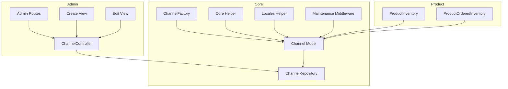
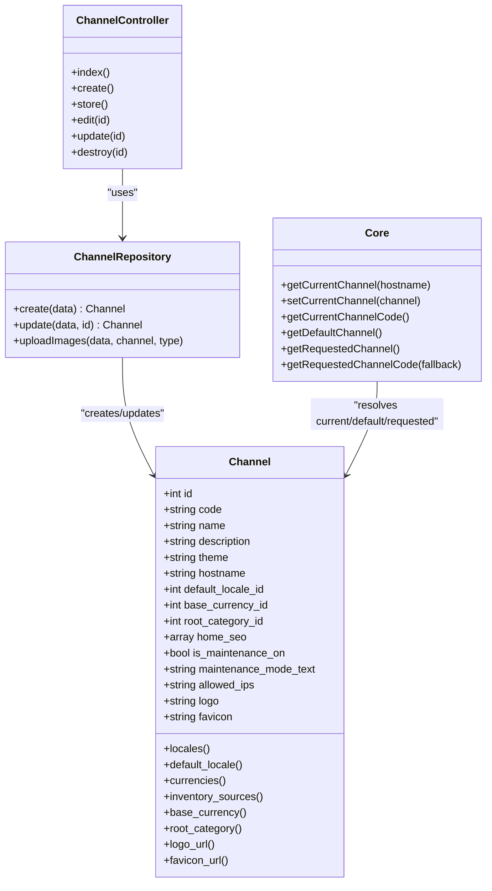
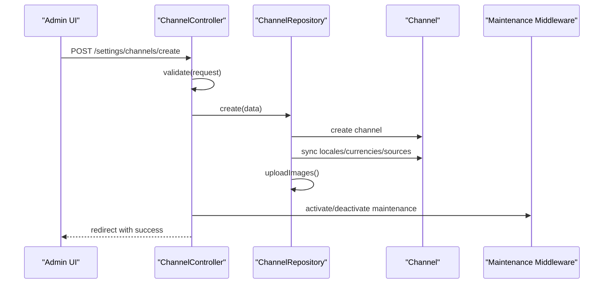
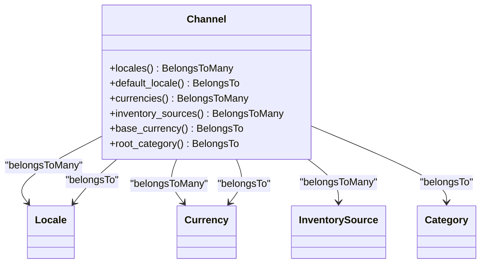
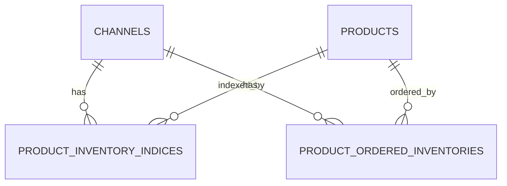
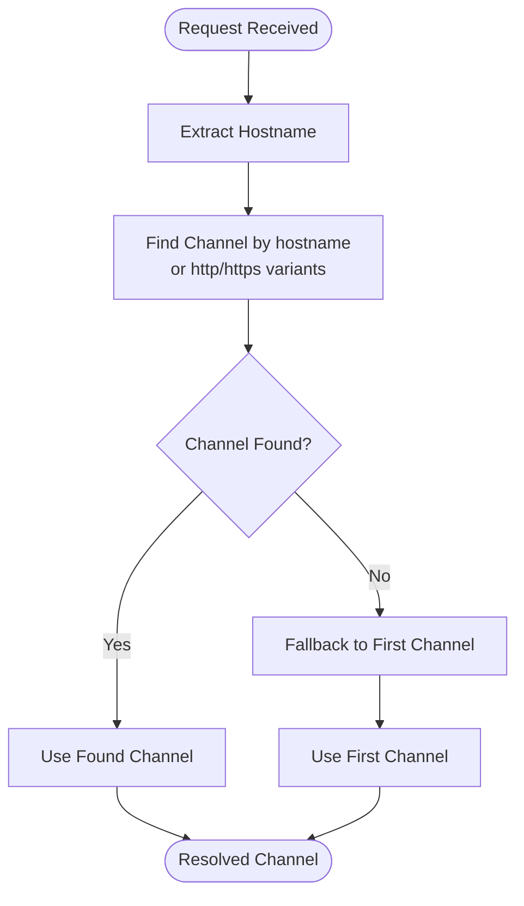
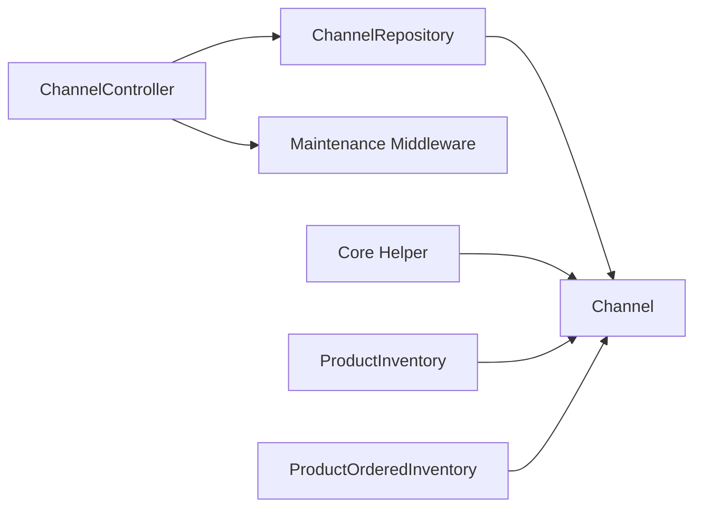

# Multi-Channel Configuration

<cite>
**Referenced Files in This Document**
- [Channel.php](file://packages/Webkul/Core/src/Models/Channel.php)
- [ChannelRepository.php](file://packages/Webkul/Core/src/Repositories/ChannelRepository.php)
- [Channel.php (Contract)](file://packages/Webkul/Core/src/Contracts/Channel.php)
- [ChannelFactory.php](file://packages/Webkul/Core/src/Database/Factories/ChannelFactory.php)
- [2025_09_05_000100_add_indexes_to_channels_tables.php](file://packages/Webkul/Core/src/Database/Migrations/2025_09_05_000100_add_indexes_to_channels_tables.php)
- [ChannelController.php](file://packages/Webkul/Admin/src/Http/Controllers/Settings/ChannelController.php)
- [settings-routes.php](file://packages/Webkul/Admin/src/Routes/settings-routes.php)
- [create.blade.php](file://packages/Webkul/Admin/src/Resources/views/settings/channels/create.blade.php)
- [edit.blade.php](file://packages/Webkul/Admin/src/Resources/views/settings/channels/edit.blade.php)
- [Locales.php](file://packages/Webkul/Core/src/Helpers/Locales.php)
- [Core.php](file://packages/Webkul/Core/src/Core.php)
- [PreventRequestsDuringMaintenance.php](file://packages/Webkul/Core/src/Http/Middleware/PreventRequestsDuringMaintenance.php)
- [ProductInventory.php](file://packages/Webkul/Product/src/Models/ProductInventory.php)
- [ProductOrderedInventory.php](file://packages/Webkul/Product/src/Models/ProductOrderedInventory.php)
- [2022_10_08_134150_create_product_inventory_indices_table.php](file://packages/Webkul/Product/src/Database/Migrations/2022_10_08_134150_create_product_inventory_indices_table.php)
- [2018_12_26_165327_create_product_ordered_inventories_table.php](file://packages/Webkul/Product/src/Database/Migrations/2018_12_26_165327_create_product_ordered_inventories_table.php)
- [index.blade.php](file://packages/Webkul/Admin/src/Resources/views/settings/channels/index.blade.php)
- [channels.spec.ts](file://packages/Webkul/Admin/tests/e2e-pw/tests/settings/channels.spec.ts)
- [home/index.blade.php](file://packages/Webkul/Shop/src/Resources/views/home/index.blade.php)
- [03433be7464fa4aaad5a69858d54eb4d.php](file://storage/framework/views/03433be7464fa4aaad5a69858d54eb4d.php)
- [CoreTest.php](file://packages/Webkul/Core/tests/Unit/CoreTest.php)
</cite>

## Table of Contents
1. [Introduction](#introduction)
2. [Project Structure](#project-structure)
3. [Core Components](#core-components)
4. [Architecture Overview](#architecture-overview)
5. [Detailed Component Analysis](#detailed-component-analysis)
6. [Dependency Analysis](#dependency-analysis)
7. [Performance Considerations](#performance-considerations)
8. [Troubleshooting Guide](#troubleshooting-guide)
9. [Conclusion](#conclusion)
10. [Appendices](#appendices)

## Introduction
This document explains Frooxi’s multi-channel configuration system. It covers how channels are created, configured, and managed; how channel-specific settings are applied; how locales and currencies are associated per channel; how inventory is managed per channel; and how channel switching and routing work. It also includes practical examples for setting up multiple sales channels, managing channel-specific content, configuring workflows, and understanding performance considerations for multi-channel deployments.

## Project Structure
The multi-channel system spans several packages and modules:
- Core models and repositories define channels, locales, currencies, and inventory relationships.
- Admin controllers and views manage channel creation, updates, and deletion.
- Routing exposes settings endpoints for channels.
- Middleware integrates channel context into request handling.
- Product inventory models and migrations support channel-scoped stock tracking.
- Blade templates render channel branding and SEO metadata.

**Diagram sources**
- [ChannelController.php:1-255](file://packages/Webkul/Admin/src/Http/Controllers/Settings/ChannelController.php#L1-L255)
- [settings-routes.php:1-220](file://packages/Webkul/Admin/src/Routes/settings-routes.php#L1-L220)
- [Channel.php:1-157](file://packages/Webkul/Core/src/Models/Channel.php#L1-L157)
- [ChannelRepository.php:1-103](file://packages/Webkul/Core/src/Repositories/ChannelRepository.php#L1-L103)
- [ChannelFactory.php:1-47](file://packages/Webkul/Core/src/Database/Factories/ChannelFactory.php#L1-L47)
- [Core.php:1-800](file://packages/Webkul/Core/src/Core.php#L1-L800)
- [Locales.php:1-21](file://packages/Webkul/Core/src/Helpers/Locales.php#L1-L21)
- [PreventRequestsDuringMaintenance.php:102-122](file://packages/Webkul/Core/src/Http/Middleware/PreventRequestsDuringMaintenance.php#L102-L122)
- [ProductInventory.php:1-62](file://packages/Webkul/Product/src/Models/ProductInventory.php#L1-L62)
- [ProductOrderedInventory.php:1-62](file://packages/Webkul/Product/src/Models/ProductOrderedInventory.php#L1-L62)

**Section sources**
- [Channel.php:1-157](file://packages/Webkul/Core/src/Models/Channel.php#L1-L157)
- [ChannelRepository.php:1-103](file://packages/Webkul/Core/src/Repositories/ChannelRepository.php#L1-L103)
- [ChannelController.php:1-255](file://packages/Webkul/Admin/src/Http/Controllers/Settings/ChannelController.php#L1-L255)
- [settings-routes.php:1-220](file://packages/Webkul/Admin/src/Routes/settings-routes.php#L1-L220)

## Core Components
- Channel model encapsulates channel metadata, relationships to locales, currencies, inventory sources, root category, branding assets, and SEO content. It exposes helper methods for logo and favicon URLs.
- Channel repository handles creation, updates, syncing of related entities (locales, currencies, inventory sources), and uploading of images.
- Admin controller validates and persists channel configuration, dispatches events, and manages maintenance mode activation/deactivation.
- Routes expose CRUD endpoints for channels under the settings namespace.
- Core helper resolves the current, default, and requested channels based on hostname and request parameters.
- Maintenance middleware reads channel-specific allowed IPs to bypass maintenance mode checks.
- Product inventory models and migrations support channel-scoped stock indices and ordered inventories.

**Section sources**
- [Channel.php:1-157](file://packages/Webkul/Core/src/Models/Channel.php#L1-L157)
- [ChannelRepository.php:1-103](file://packages/Webkul/Core/src/Repositories/ChannelRepository.php#L1-L103)
- [ChannelController.php:1-255](file://packages/Webkul/Admin/src/Http/Controllers/Settings/ChannelController.php#L1-L255)
- [settings-routes.php:1-220](file://packages/Webkul/Admin/src/Routes/settings-routes.php#L1-L220)
- [Core.php:124-187](file://packages/Webkul/Core/src/Core.php#L124-L187)
- [PreventRequestsDuringMaintenance.php:102-122](file://packages/Webkul/Core/src/Http/Middleware/PreventRequestsDuringMaintenance.php#L102-L122)
- [ProductInventory.php:1-62](file://packages/Webkul/Product/src/Models/ProductInventory.php#L1-L62)
- [ProductOrderedInventory.php:1-62](file://packages/Webkul/Product/src/Models/ProductOrderedInventory.php#L1-L62)

## Architecture Overview
The multi-channel architecture centers on the Channel model and repository, with Admin controllers orchestrating configuration changes. Requests are resolved to a channel via hostname or fallback to the first channel. Middleware and views consume channel context for branding, SEO, and maintenance behavior.

**Diagram sources**
- [Channel.php:1-157](file://packages/Webkul/Core/src/Models/Channel.php#L1-L157)
- [ChannelRepository.php:1-103](file://packages/Webkul/Core/src/Repositories/ChannelRepository.php#L1-L103)
- [ChannelController.php:1-255](file://packages/Webkul/Admin/src/Http/Controllers/Settings/ChannelController.php#L1-L255)
- [Core.php:124-187](file://packages/Webkul/Core/src/Core.php#L124-L187)

## Detailed Component Analysis

### Channel Creation and Management
- Creation flow:
  - Admin view posts to the store endpoint with general, currencies/locales, design, SEO, and maintenance fields.
  - Controller validates inputs, normalizes SEO content into the channel’s home_seo attribute, and dispatches pre/post events.
  - Repository creates the channel, syncs attached locales, currencies, and inventory sources, and uploads logo/favicon.
  - Maintenance mode is activated or deactivated based on the channel’s maintenance flag.
- Editing flow mirrors creation with updates to relations and assets.
- Deletion prevents removing the default channel and dispatches pre/post events.

**Diagram sources**
- [ChannelController.php:52-102](file://packages/Webkul/Admin/src/Http/Controllers/Settings/ChannelController.php#L52-L102)
- [ChannelRepository.php:24-50](file://packages/Webkul/Core/src/Repositories/ChannelRepository.php#L24-L50)
- [PreventRequestsDuringMaintenance.php:102-122](file://packages/Webkul/Core/src/Http/Middleware/PreventRequestsDuringMaintenance.php#L102-L122)

**Section sources**
- [ChannelController.php:52-102](file://packages/Webkul/Admin/src/Http/Controllers/Settings/ChannelController.php#L52-L102)
- [ChannelRepository.php:24-50](file://packages/Webkul/Core/src/Repositories/ChannelRepository.php#L24-L50)
- [create.blade.php:238-263](file://packages/Webkul/Admin/src/Resources/views/settings/channels/create.blade.php#L238-L263)
- [edit.blade.php:203-293](file://packages/Webkul/Admin/src/Resources/views/settings/channels/edit.blade.php#L203-L293)

### Channel Configuration Fields
- General:
  - code, name, description, theme, hostname, root_category_id.
- Locales and Currencies:
  - locales (multiple), default_locale_id, currencies (multiple), base_currency_id.
- Branding:
  - logo, favicon.
- SEO:
  - seo_title, seo_description, seo_keywords mapped into home_seo.
- Maintenance:
  - is_maintenance_on, maintenance_mode_text, allowed_ips.

These fields are validated and persisted through the controller and repository.

**Section sources**
- [ChannelController.php:54-83](file://packages/Webkul/Admin/src/Http/Controllers/Settings/ChannelController.php#L54-L83)
- [ChannelController.php:125-154](file://packages/Webkul/Admin/src/Http/Controllers/Settings/ChannelController.php#L125-L154)
- [ChannelRepository.php:24-73](file://packages/Webkul/Core/src/Repositories/ChannelRepository.php#L24-L73)
- [Channel.php:25-59](file://packages/Webkul/Core/src/Models/Channel.php#L25-L59)

### Channel Relationships and Inheritance Patterns
- Many-to-many relationships:
  - locales and currencies are attached to channels.
  - inventory_sources are attached to channels.
- One-to-one relationships:
  - default_locale, base_currency, root_category.
- Translation:
  - Name, description, maintenance_mode_text, and home_seo are translatable attributes.
- Inheritance:
  - Requested channel resolution falls back to current channel, then default channel, then first channel.
  - Locale selection prefers requested locale if supported by the channel; otherwise defaults to channel default.

**Diagram sources**
- [Channel.php:64-107](file://packages/Webkul/Core/src/Models/Channel.php#L64-L107)

**Section sources**
- [Channel.php:64-107](file://packages/Webkul/Core/src/Models/Channel.php#L64-L107)
- [Core.php:227-236](file://packages/Webkul/Core/src/Core.php#L227-L236)
- [Core.php:334-345](file://packages/Webkul/Core/src/Core.php#L334-L345)

### Locale Associations and Currency Configurations
- Locales:
  - Channels can support multiple locales; default locale is enforced via validation.
  - The Locales helper loads available locales for UI rendering.
- Currencies:
  - Channels support multiple currencies; base currency is enforced via validation.
  - Exchange rates are used for price conversion and formatting.

**Section sources**
- [ChannelController.php:63-67](file://packages/Webkul/Admin/src/Http/Controllers/Settings/ChannelController.php#L63-L67)
- [ChannelController.php:134-138](file://packages/Webkul/Admin/src/Http/Controllers/Settings/ChannelController.php#L134-L138)
- [Locales.php:12-19](file://packages/Webkul/Core/src/Helpers/Locales.php#L12-L19)
- [Core.php:392-405](file://packages/Webkul/Core/src/Core.php#L392-L405)

### Inventory Management Per Channel
- Product inventory tracking supports channel scoping:
  - product_inventory_indices table stores per-product/channel quantities with unique constraints.
  - product_ordered_inventories table tracks reserved quantities per product/channel.
- These models define foreign keys to channels and products, enabling channel-aware stock management.

**Diagram sources**
- [2022_10_08_134150_create_product_inventory_indices_table.php:14-26](file://packages/Webkul/Product/src/Database/Migrations/2022_10_08_134150_create_product_inventory_indices_table.php#L14-L26)
- [2018_12_26_165327_create_product_ordered_inventories_table.php:14-25](file://packages/Webkul/Product/src/Database/Migrations/2018_12_26_165327_create_product_ordered_inventories_table.php#L14-L25)
- [ProductInventory.php:36-53](file://packages/Webkul/Product/src/Models/ProductInventory.php#L36-L53)
- [ProductOrderedInventory.php:36-53](file://packages/Webkul/Product/src/Models/ProductOrderedInventory.php#L36-L53)

**Section sources**
- [2022_10_08_134150_create_product_inventory_indices_table.php:14-26](file://packages/Webkul/Product/src/Database/Migrations/2022_10_08_134150_create_product_inventory_indices_table.php#L14-L26)
- [2018_12_26_165327_create_product_ordered_inventories_table.php:14-25](file://packages/Webkul/Product/src/Database/Migrations/2018_12_26_165327_create_product_ordered_inventories_table.php#L14-L25)
- [ProductInventory.php:36-53](file://packages/Webkul/Product/src/Models/ProductInventory.php#L36-L53)
- [ProductOrderedInventory.php:36-53](file://packages/Webkul/Product/src/Models/ProductOrderedInventory.php#L36-L53)

### Channel-Specific Branding and SEO
- Branding:
  - Logo and favicon are uploaded and stored per channel; getters return asset URLs.
- SEO:
  - home_seo includes meta_title, meta_description, meta_keywords.
  - Views inject SEO meta tags from the current channel’s home_seo.

**Section sources**
- [Channel.php:112-147](file://packages/Webkul/Core/src/Models/Channel.php#L112-L147)
- [ChannelRepository.php:83-101](file://packages/Webkul/Core/src/Repositories/ChannelRepository.php#L83-L101)
- [create.blade.php:238-263](file://packages/Webkul/Admin/src/Resources/views/settings/channels/create.blade.php#L238-L263)
- [edit.blade.php:203-293](file://packages/Webkul/Admin/src/Resources/views/settings/channels/edit.blade.php#L203-L293)
- [home/index.blade.php:1-23](file://packages/Webkul/Shop/src/Resources/views/home/index.blade.php#L1-L23)
- [03433be7464fa4aaad5a69858d54eb4d.php:1-29](file://storage/framework/views/03433be7464fa4aaad5a69858d54eb4d.php#L1-L29)

### Channel Switching Mechanisms and Routing
- Channel routing:
  - Settings routes expose index, create, store, edit, update, and delete endpoints for channels.
- Channel switching:
  - Resolution by hostname with http/https variants and fallback to first channel.
  - Requested channel can be forced via query parameter; otherwise current channel is used.
  - Default channel is derived from configuration or first channel.

**Diagram sources**
- [Core.php:139-160](file://packages/Webkul/Core/src/Core.php#L139-L160)

**Section sources**
- [settings-routes.php:24-36](file://packages/Webkul/Admin/src/Routes/settings-routes.php#L24-L36)
- [Core.php:139-160](file://packages/Webkul/Core/src/Core.php#L139-L160)
- [Core.php:227-236](file://packages/Webkul/Core/src/Core.php#L227-L236)
- [Core.php:244-253](file://packages/Webkul/Core/src/Core.php#L244-L253)

### Channel-Aware Workflows and Maintenance
- Maintenance mode:
  - Controlled per channel via is_maintenance_on and maintenance_mode_text.
  - Allowed IPs per channel are loaded by middleware to permit access during maintenance.
- Currency and locale workflows:
  - Session currency is updated when base currency changes.
  - Locale selection respects channel-supported locales and defaults to channel default.

**Section sources**
- [ChannelController.php:91-95](file://packages/Webkul/Admin/src/Http/Controllers/Settings/ChannelController.php#L91-L95)
- [ChannelController.php:164-168](file://packages/Webkul/Admin/src/Http/Controllers/Settings/ChannelController.php#L164-L168)
- [PreventRequestsDuringMaintenance.php:116-122](file://packages/Webkul/Core/src/Http/Middleware/PreventRequestsDuringMaintenance.php#L116-L122)
- [Core.php:334-345](file://packages/Webkul/Core/src/Core.php#L334-L345)
- [Core.php:172-176](file://packages/Webkul/Core/src/Core.php#L172-L176)

### Examples: Setting Up Multiple Sales Channels
- Create a new channel:
  - Use the Admin create view to set code, name, description, hostname, root category, locales, default locale, currencies, base currency, theme, logo, favicon, SEO, and maintenance settings.
  - Submit to store endpoint; repository persists relations and assets.
- Manage channel-specific content:
  - Edit channel to update SEO, branding, and locale/currency availability.
  - Use the channel’s default locale and base currency for content and pricing consistency.
- Configure channel-specific workflows:
  - Enable maintenance mode with allowed IPs for development access.
  - Adjust inventory sources per channel to reflect regional fulfillment.

**Section sources**
- [create.blade.php:296-323](file://packages/Webkul/Admin/src/Resources/views/settings/channels/create.blade.php#L296-L323)
- [edit.blade.php:295-342](file://packages/Webkul/Admin/src/Resources/views/settings/channels/edit.blade.php#L295-L342)
- [channels.spec.ts:10-48](file://packages/Webkul/Admin/tests/e2e-pw/tests/settings/channels.spec.ts#L10-L48)

## Dependency Analysis
- ChannelController depends on ChannelRepository for persistence and on maintenance mode service for runtime behavior.
- ChannelRepository depends on Channel model and Eloquent relationships to locales, currencies, inventory sources.
- Core helper centralizes channel resolution and locale/currency selection.
- Middleware consumes channel context for maintenance checks.
- Product inventory models depend on Channel and Product proxies for foreign keys.

**Diagram sources**
- [ChannelController.php:21](file://packages/Webkul/Admin/src/Http/Controllers/Settings/ChannelController.php#L21)
- [ChannelRepository.php:9](file://packages/Webkul/Core/src/Repositories/ChannelRepository.php#L9)
- [Channel.php:16](file://packages/Webkul/Core/src/Models/Channel.php#L16)
- [PreventRequestsDuringMaintenance.php:102-122](file://packages/Webkul/Core/src/Http/Middleware/PreventRequestsDuringMaintenance.php#L102-L122)
- [Core.php:124-187](file://packages/Webkul/Core/src/Core.php#L124-L187)
- [ProductInventory.php:9-53](file://packages/Webkul/Product/src/Models/ProductInventory.php#L9-L53)
- [ProductOrderedInventory.php:9-53](file://packages/Webkul/Product/src/Models/ProductOrderedInventory.php#L9-L53)

**Section sources**
- [ChannelController.php:21](file://packages/Webkul/Admin/src/Http/Controllers/Settings/ChannelController.php#L21)
- [ChannelRepository.php:9](file://packages/Webkul/Core/src/Repositories/ChannelRepository.php#L9)
- [Channel.php:16](file://packages/Webkul/Core/src/Models/Channel.php#L16)
- [Core.php:124-187](file://packages/Webkul/Core/src/Core.php#L124-L187)
- [ProductInventory.php:9-53](file://packages/Webkul/Product/src/Models/ProductInventory.php#L9-L53)
- [ProductOrderedInventory.php:9-53](file://packages/Webkul/Product/src/Models/ProductOrderedInventory.php#L9-L53)

## Performance Considerations
- Indexing:
  - Channels hostname index improves hostname-based lookup performance.
  - Composite indexes on channel_locales and channel_currencies optimize relationship queries.
- Caching:
  - Cache channel lists and current channel resolution to reduce repeated DB queries.
- Asset handling:
  - Offload logo/favicon uploads to CDN-backed storage to minimize latency.
- Inventory queries:
  - Use unique product/channel combinations in inventory tables to avoid scans; ensure appropriate indexing on product_id and channel_id.
- Middleware overhead:
  - Keep maintenance mode checks lightweight; reuse resolved channel context.

**Section sources**
- [2025_09_05_000100_add_indexes_to_channels_tables.php:14-30](file://packages/Webkul/Core/src/Database/Migrations/2025_09_05_000100_add_indexes_to_channels_tables.php#L14-L30)
- [2022_10_08_134150_create_product_inventory_indices_table.php:23-26](file://packages/Webkul/Product/src/Database/Migrations/2022_10_08_134150_create_product_inventory_indices_table.php#L23-L26)
- [2018_12_26_165327_create_product_ordered_inventories_table.php:22-25](file://packages/Webkul/Product/src/Database/Migrations/2018_12_26_165327_create_product_ordered_inventories_table.php#L22-L25)

## Troubleshooting Guide
- Cannot delete default channel:
  - Attempting to delete the channel configured as default returns an error; change default channel first.
- Maintenance mode not applying:
  - Ensure is_maintenance_on is enabled and allowed_ips are properly formatted; middleware reads channel.allowed_ips.
- Locale mismatch:
  - If requested locale is not in channel locales, the system falls back to channel default locale.
- Currency mismatch:
  - Session currency updates when base currency changes; verify exchange rates are configured.

**Section sources**
- [ChannelController.php:184-210](file://packages/Webkul/Admin/src/Http/Controllers/Settings/ChannelController.php#L184-L210)
- [PreventRequestsDuringMaintenance.php:116-122](file://packages/Webkul/Core/src/Http/Middleware/PreventRequestsDuringMaintenance.php#L116-L122)
- [Core.php:334-345](file://packages/Webkul/Core/src/Core.php#L334-L345)
- [Core.php:172-176](file://packages/Webkul/Core/src/Core.php#L172-L176)

## Conclusion
Frooxi’s multi-channel system provides robust configuration, localization, currency, branding, and inventory controls per channel. Admin endpoints, repository logic, and middleware integrate seamlessly to deliver channel-aware experiences. Proper indexing, caching, and asset handling ensure scalable performance across multiple channels.

## Appendices
- Example test coverage for channel creation, editing, and deletion is available in the e2e suite.
- Unit tests demonstrate channel resolution and fallback behavior.

**Section sources**
- [channels.spec.ts:10-144](file://packages/Webkul/Admin/tests/e2e-pw/tests/settings/channels.spec.ts#L10-L144)
- [CoreTest.php:104-159](file://packages/Webkul/Core/tests/Unit/CoreTest.php#L104-L159)