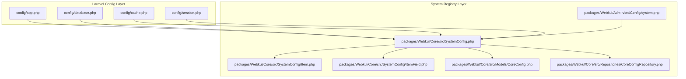
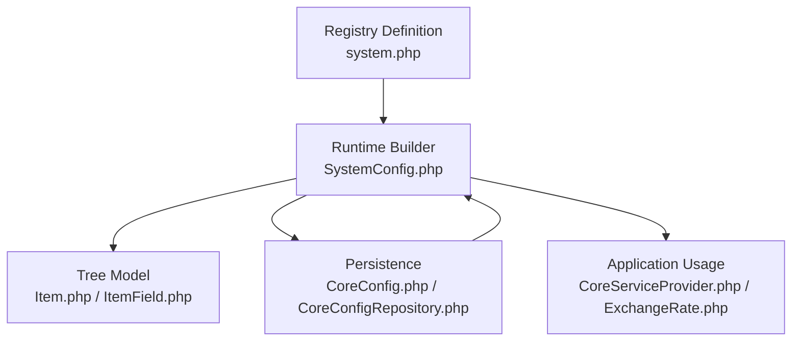
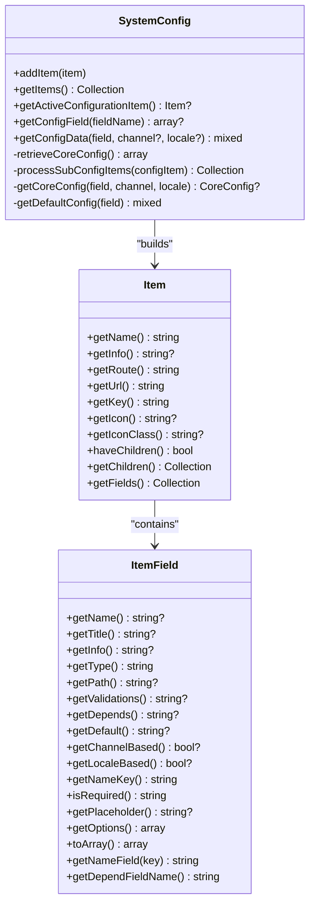
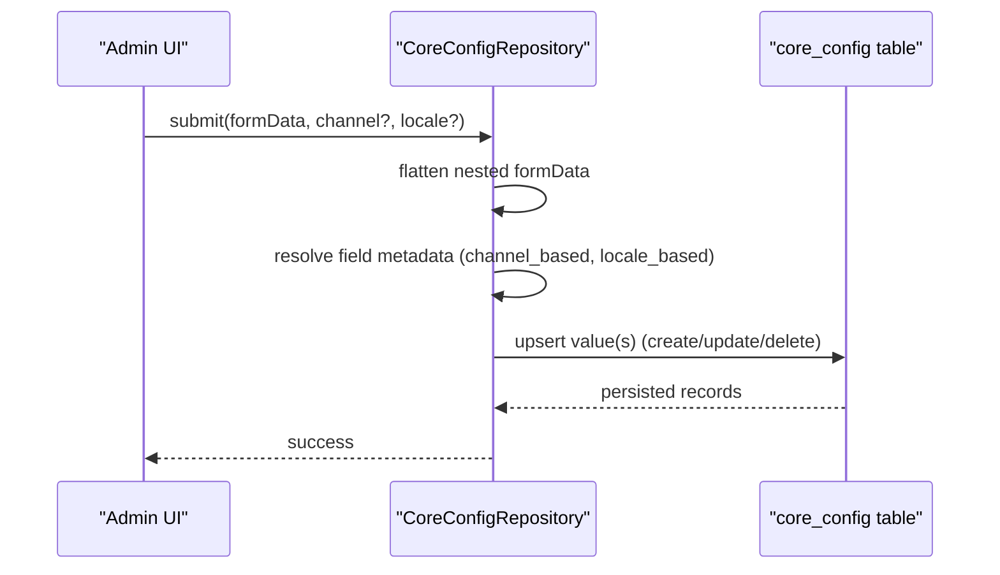
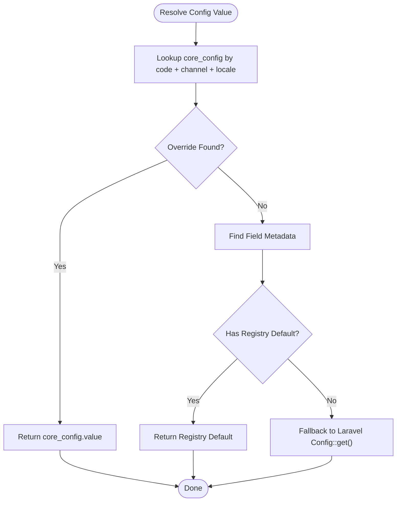
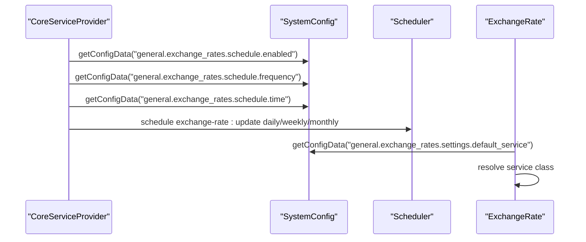
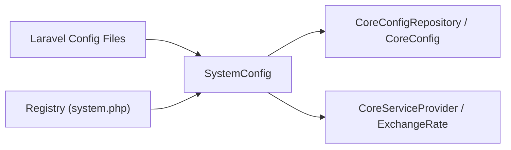

# System Configuration

<cite>
**Referenced Files in This Document**
- [app.php](file://bootstrap/app.php)
- [providers.php](file://bootstrap/providers.php)
- [app.php](file://config/app.php)
- [database.php](file://config/database.php)
- [cache.php](file://config/cache.php)
- [session.php](file://config/session.php)
- [system.php](file://packages/Webkul/Admin/src/Config/system.php)
- [SystemConfig.php](file://packages/Webkul/Core/src/SystemConfig.php)
- [Item.php](file://packages/Webkul/Core/src/SystemConfig/Item.php)
- [ItemField.php](file://packages/Webkul/Core/src/SystemConfig/ItemField.php)
- [CoreConfig.php](file://packages/Webkul/Core/src/Models/CoreConfig.php)
- [CoreConfigRepository.php](file://packages/Webkul/Core/src/Repositories/CoreConfigRepository.php)
- [CoreServiceProvider.php](file://packages/Webkul/Core/src/Providers/CoreServiceProvider.php)
- [helpers.php](file://packages/Webkul/Core/src/Http/helpers.php)
- [ExchangeRate.php](file://packages/Webkul/Core/src/Helpers/Exchange/ExchangeRate.php)
- [ExchangeRateUpdate.php](file://packages/Webkul/Core/src/Console/Commands/ExchangeRateUpdate.php)
</cite>

## Table of Contents
1. [Introduction](#introduction)
2. [Project Structure](#project-structure)
3. [Core Components](#core-components)
4. [Architecture Overview](#architecture-overview)
5. [Detailed Component Analysis](#detailed-component-analysis)
6. [Dependency Analysis](#dependency-analysis)
7. [Performance Considerations](#performance-considerations)
8. [Troubleshooting Guide](#troubleshooting-guide)
9. [Conclusion](#conclusion)
10. [Appendices](#appendices)

## Introduction
This document explains Frooxi’s system configuration system. It covers the configuration registry structure, available configuration options, and how system-wide settings are managed. You will learn how to configure core system parameters, enable or disable features, and manage settings across channels and locales. The document also details the configuration hierarchy, defaults, overrides, validation rules, and inheritance patterns. Finally, it documents the configuration API, programmatic access methods, and best practices for maintaining configuration consistency across environments.

## Project Structure
Frooxi organizes configuration in two primary places:
- Laravel configuration files under config/, which define environment-specific defaults and infrastructure settings (application, database, cache, sessions).
- The system configuration registry under packages/Webkul/Admin/src/Config/system.php, which defines the hierarchical structure of admin-managed settings, their fields, validation rules, and localization support.

**Diagram sources**
- [app.php:1-188](file://config/app.php#L1-L188)
- [database.php:1-183](file://config/database.php#L1-L183)
- [cache.php:1-109](file://config/cache.php#L1-L109)
- [session.php:1-218](file://config/session.php#L1-L218)
- [system.php:1-2984](file://packages/Webkul/Admin/src/Config/system.php#L1-L2984)
- [SystemConfig.php:1-234](file://packages/Webkul/Core/src/SystemConfig.php#L1-L234)
- [Item.php:1-133](file://packages/Webkul/Core/src/SystemConfig/Item.php#L1-L133)
- [ItemField.php:1-257](file://packages/Webkul/Core/src/SystemConfig/ItemField.php#L1-L257)
- [CoreConfig.php:1-49](file://packages/Webkul/Core/src/Models/CoreConfig.php#L1-L49)
- [CoreConfigRepository.php:1-241](file://packages/Webkul/Core/src/Repositories/CoreConfigRepository.php#L1-L241)

**Section sources**
- [app.php:1-188](file://config/app.php#L1-L188)
- [database.php:1-183](file://config/database.php#L1-L183)
- [cache.php:1-109](file://config/cache.php#L1-L109)
- [session.php:1-218](file://config/session.php#L1-L218)
- [system.php:1-2984](file://packages/Webkul/Admin/src/Config/system.php#L1-L2984)

## Core Components
- Configuration registry definition: Defines the hierarchical structure of settings, grouped by functional areas (General, Catalog, Customer, Emails, Sales), and each group contains fields with metadata such as type, default, validation, and localization flags.
- System configuration runtime: Loads the registry, builds a navigable tree of configuration items, resolves active configuration items from the request, and retrieves values considering channel/locale scoping and defaults.
- Persistence layer: Stores per-channel/per-locale overrides in the core_config table and exposes CRUD operations with event hooks and file handling.
- Helpers and facades: Provides convenient functions to access configuration programmatically and integrate with scheduling and services.

Key responsibilities:
- Define and validate configuration fields and their rules.
- Resolve effective values from persisted overrides or defaults.
- Support channel and locale scoping.
- Provide programmatic access and integration points.

**Section sources**
- [system.php:1-2984](file://packages/Webkul/Admin/src/Config/system.php#L1-L2984)
- [SystemConfig.php:1-234](file://packages/Webkul/Core/src/SystemConfig.php#L1-L234)
- [CoreConfigRepository.php:1-241](file://packages/Webkul/Core/src/Repositories/CoreConfigRepository.php#L1-L241)
- [CoreConfig.php:1-49](file://packages/Webkul/Core/src/Models/CoreConfig.php#L1-L49)
- [helpers.php:1-264](file://packages/Webkul/Core/src/Http/helpers.php#L1-L264)

## Architecture Overview
The configuration system follows a layered architecture:
- Registry layer: Describes available settings and their metadata.
- Runtime layer: Builds the configuration tree, resolves active items, and fetches values.
- Persistence layer: Reads/writes overrides to the database with channel/locale awareness.
- Integration layer: Uses configuration values for scheduling, services, and rendering.

**Diagram sources**
- [system.php:1-2984](file://packages/Webkul/Admin/src/Config/system.php#L1-L2984)
- [SystemConfig.php:1-234](file://packages/Webkul/Core/src/SystemConfig.php#L1-L234)
- [Item.php:1-133](file://packages/Webkul/Core/src/SystemConfig/Item.php#L1-L133)
- [ItemField.php:1-257](file://packages/Webkul/Core/src/SystemConfig/ItemField.php#L1-L257)
- [CoreConfig.php:1-49](file://packages/Webkul/Core/src/Models/CoreConfig.php#L1-L49)
- [CoreConfigRepository.php:1-241](file://packages/Webkul/Core/src/Repositories/CoreConfigRepository.php#L1-L241)
- [CoreServiceProvider.php:1-142](file://packages/Webkul/Core/src/Providers/CoreServiceProvider.php#L1-L142)
- [ExchangeRate.php:1-60](file://packages/Webkul/Core/src/Helpers/Exchange/ExchangeRate.php#L1-L60)

## Detailed Component Analysis

### Configuration Registry Structure
The registry is a hierarchical array of configuration groups and fields. Each group has:
- key: Dot-delimited identifier for routing and lookup.
- name/info: Translatable labels and descriptions.
- icon/icon_class/route/sort: Presentation and navigation metadata.
- fields: Array of field definitions with:
  - name/title/type/validation/default/placeholder/options
  - channel_based/locale_based flags
  - depends: conditional visibility rules
  - path: for specialized renderers (e.g., blade templates)

Examples of fields include booleans, text, textarea, select, password, image, editor, and specialized types like country/state/postcode.

**Section sources**
- [system.php:1-2984](file://packages/Webkul/Admin/src/Config/system.php#L1-L2984)

### Runtime Configuration Builder
The SystemConfig class:
- Loads registry definitions and flattens dot notation keys into nested arrays.
- Builds Item and ItemField objects, translating labels and options.
- Provides methods to:
  - getItems(): returns sorted configuration items.
  - getActiveConfigurationItem(): resolves the active item from request slugs.
  - getConfigField(fieldName): finds a field definition by its fully-qualified name.
  - getConfigData(field, channel?, locale?): resolves effective value considering overrides and defaults.

**Diagram sources**
- [SystemConfig.php:1-234](file://packages/Webkul/Core/src/SystemConfig.php#L1-L234)
- [Item.php:1-133](file://packages/Webkul/Core/src/SystemConfig/Item.php#L1-L133)
- [ItemField.php:1-257](file://packages/Webkul/Core/src/SystemConfig/ItemField.php#L1-L257)

**Section sources**
- [SystemConfig.php:1-234](file://packages/Webkul/Core/src/SystemConfig.php#L1-L234)
- [Item.php:1-133](file://packages/Webkul/Core/src/SystemConfig/Item.php#L1-L133)
- [ItemField.php:1-257](file://packages/Webkul/Core/src/SystemConfig/ItemField.php#L1-L257)

### Persistence and Overrides
CoreConfigRepository handles:
- Creating/updating/deleting configuration overrides with support for channel/locale scoping.
- File uploads for image-type fields, replacing previous files.
- Recursive flattening of nested form data into key/value pairs for persistence.
- Searching and building breadcrumb-like navigation for configuration items.

CoreConfig model persists:
- code: Fully-qualified field key.
- value: Stored value or file path.
- channel_code and locale_code: Scoping fields.
- mass-assignable fillable fields and hidden token.

**Diagram sources**
- [CoreConfigRepository.php:1-241](file://packages/Webkul/Core/src/Repositories/CoreConfigRepository.php#L1-L241)
- [CoreConfig.php:1-49](file://packages/Webkul/Core/src/Models/CoreConfig.php#L1-L49)

**Section sources**
- [CoreConfigRepository.php:1-241](file://packages/Webkul/Core/src/Repositories/CoreConfigRepository.php#L1-L241)
- [CoreConfig.php:1-49](file://packages/Webkul/Core/src/Models/CoreConfig.php#L1-L49)

### Configuration Hierarchy, Defaults, and Overrides
- Hierarchy: Groups → Subgroups → Fields. Active item is resolved from request slugs.
- Scoping: Fields can be channel-based, locale-based, or both. Resolution prefers the most specific override.
- Defaults: If no override exists, the field’s default is used. For fields defined in the registry, the default comes from the registry; for other keys, the default falls back to Laravel’s Config::get().
- Inheritance: Effective value resolution follows channel/locale specificity, then registry defaults, then Laravel config defaults.

**Diagram sources**
- [SystemConfig.php:163-232](file://packages/Webkul/Core/src/SystemConfig.php#L163-L232)

**Section sources**
- [SystemConfig.php:163-232](file://packages/Webkul/Core/src/SystemConfig.php#L163-L232)

### Validation Rules and Conditional Dependencies
- Validation: Laravel-style validation strings are mapped to frontend validation rules for forms.
- Conditional visibility: depends fields control visibility of related fields based on boolean expressions.
- Options: Select options can be static arrays or dynamic callbacks.

**Section sources**
- [ItemField.php:1-257](file://packages/Webkul/Core/src/SystemConfig/ItemField.php#L1-L257)
- [system.php:1-2984](file://packages/Webkul/Admin/src/Config/system.php#L1-L2984)

### Programmatic Access and Integration
- Facades and helpers:
  - core(): access to core services and configuration.
  - system_config(): access to SystemConfig builder.
- Scheduling integration:
  - CoreServiceProvider reads exchange rate schedule settings and registers cron jobs accordingly.
- Service integration:
  - ExchangeRate helper resolves the configured exchange rate service and falls back to Laravel config when needed.

**Diagram sources**
- [CoreServiceProvider.php:83-104](file://packages/Webkul/Core/src/Providers/CoreServiceProvider.php#L83-L104)
- [ExchangeRate.php:26-41](file://packages/Webkul/Core/src/Helpers/Exchange/ExchangeRate.php#L26-L41)
- [SystemConfig.php:215-232](file://packages/Webkul/Core/src/SystemConfig.php#L215-L232)

**Section sources**
- [helpers.php:1-264](file://packages/Webkul/Core/src/Http/helpers.php#L1-L264)
- [CoreServiceProvider.php:1-142](file://packages/Webkul/Core/src/Providers/CoreServiceProvider.php#L1-L142)
- [ExchangeRate.php:1-60](file://packages/Webkul/Core/src/Helpers/Exchange/ExchangeRate.php#L1-L60)

## Dependency Analysis
- Configuration files define environment defaults and infrastructure settings.
- System configuration depends on Laravel’s Config facade and translation system.
- Runtime depends on the registry definition and persistence layer.
- Persistence depends on Eloquent models and repositories.
- Integration depends on runtime configuration values.

**Diagram sources**
- [app.php:1-188](file://config/app.php#L1-L188)
- [database.php:1-183](file://config/database.php#L1-L183)
- [cache.php:1-109](file://config/cache.php#L1-L109)
- [session.php:1-218](file://config/session.php#L1-L218)
- [system.php:1-2984](file://packages/Webkul/Admin/src/Config/system.php#L1-L2984)
- [SystemConfig.php:1-234](file://packages/Webkul/Core/src/SystemConfig.php#L1-L234)
- [CoreConfigRepository.php:1-241](file://packages/Webkul/Core/src/Repositories/CoreConfigRepository.php#L1-L241)
- [CoreConfig.php:1-49](file://packages/Webkul/Core/src/Models/CoreConfig.php#L1-L49)
- [CoreServiceProvider.php:1-142](file://packages/Webkul/Core/src/Providers/CoreServiceProvider.php#L1-L142)
- [ExchangeRate.php:1-60](file://packages/Webkul/Core/src/Helpers/Exchange/ExchangeRate.php#L1-L60)

**Section sources**
- [providers.php:1-49](file://bootstrap/providers.php#L1-L49)
- [app.php:1-56](file://bootstrap/app.php#L1-L56)

## Performance Considerations
- Minimize repeated queries: SystemConfig caches computed items internally; avoid rebuilding the tree unnecessarily.
- Prefer batched writes: When updating multiple fields, submit them together to reduce database round-trips.
- Use appropriate cache stores: For high-traffic environments, prefer Redis or database cache stores for session and application caching.
- Avoid heavy validations on every request: Keep validation rules concise and leverage client-side mapping for user experience.

## Troubleshooting Guide
Common issues and resolutions:
- No effect after saving configuration:
  - Verify channel/locale scoping matches the current context.
  - Confirm the field is marked as channel_based or locale_based appropriately.
- Unexpected default values:
  - Check registry defaults and Laravel config fallbacks.
  - Ensure the key matches the exact dot notation used in the registry.
- File upload failures:
  - Confirm file permissions and storage disk configuration.
  - Verify validation rules for allowed MIME types.
- Scheduling not running:
  - Confirm exchange rate schedule settings and server cron availability.
  - Check for exceptions during schedule registration.

**Section sources**
- [CoreConfigRepository.php:25-116](file://packages/Webkul/Core/src/Repositories/CoreConfigRepository.php#L25-L116)
- [CoreServiceProvider.php:83-104](file://packages/Webkul/Core/src/Providers/CoreServiceProvider.php#L83-L104)
- [SystemConfig.php:215-232](file://packages/Webkul/Core/src/SystemConfig.php#L215-L232)

## Conclusion
Frooxi’s configuration system combines a flexible registry-driven structure with robust persistence and scoping. Administrators can define rich configuration sets with validation and localization, while developers can programmatically access effective values across channels and locales. Proper use of defaults, overrides, and scoping ensures consistent behavior across environments.

## Appendices

### Configuration API Reference
- Access configuration:
  - core()->getConfigData('group.section.field', channel?, locale?)
  - system_config()->getActiveConfigurationItem()
  - system_config()->getConfigField('group.section.field')
- Save configuration:
  - Submit form data to CoreConfigRepository::create() with optional channel/locale.
- Helpers:
  - core(), menu(), acl(), system_config() for convenient access.

**Section sources**
- [SystemConfig.php:141-232](file://packages/Webkul/Core/src/SystemConfig.php#L141-L232)
- [CoreConfigRepository.php:25-116](file://packages/Webkul/Core/src/Repositories/CoreConfigRepository.php#L25-L116)
- [helpers.php:11-57](file://packages/Webkul/Core/src/Http/helpers.php#L11-L57)

### Best Practices
- Define clear defaults in the registry to minimize overrides.
- Use channel_based and locale_based judiciously to avoid excessive overrides.
- Keep validation rules explicit and localized for user clarity.
- Centralize environment-specific values in Laravel config files and use the registry for admin-managed settings.
- Test configuration changes across channels and locales before deployment.