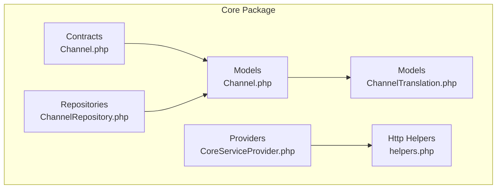
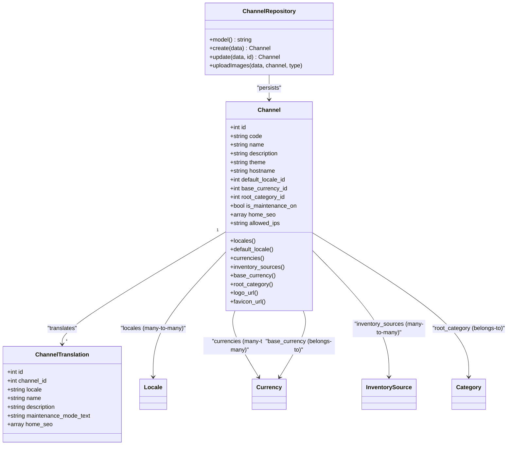
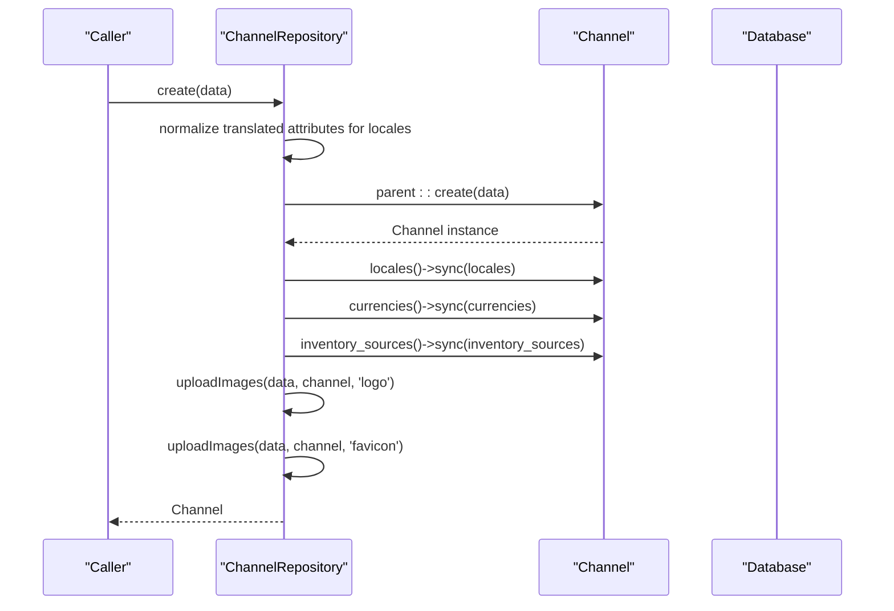
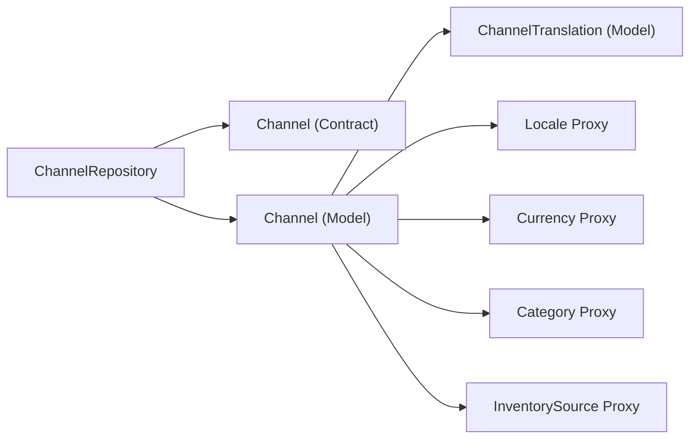

# Channel Management

<cite>
**Referenced Files in This Document**
- [Channel.php](file://packages/Webkul/Core/src/Models/Channel.php)
- [ChannelTranslation.php](file://packages/Webkul/Core/src/Models/ChannelTranslation.php)
- [ChannelRepository.php](file://packages/Webkul/Core/src/Repositories/ChannelRepository.php)
- [Channel.php (Contract)](file://packages/Webkul/Core/src/Contracts/Channel.php)
- [CoreServiceProvider.php](file://packages/Webkul/Core/src/Providers/CoreServiceProvider.php)
- [helpers.php](file://packages/Webkul/Core/src/Http/helpers.php)
</cite>

## Table of Contents
1. [Introduction](#introduction)
2. [Project Structure](#project-structure)
3. [Core Components](#core-components)
4. [Architecture Overview](#architecture-overview)
5. [Detailed Component Analysis](#detailed-component-analysis)
6. [Dependency Analysis](#dependency-analysis)
7. [Performance Considerations](#performance-considerations)
8. [Troubleshooting Guide](#troubleshooting-guide)
9. [Conclusion](#conclusion)
10. [Appendices](#appendices)

## Introduction
This document explains the Channel Management system in Bagisto’s Core package. It focuses on the multi-channel architecture that enables running multiple e-commerce stores from a single installation. It documents the Channel model and its relationships, the ChannelRepository implementation, and channel creation/update flows. It also outlines channel-specific configurations such as hostname association, locales, currencies, and inventory sources, and provides practical guidance for setting up multi-store environments.

## Project Structure
The Channel Management system resides primarily under the Core module:
- Models define the Channel entity and its translations.
- Repositories encapsulate persistence and channel-specific operations.
- Contracts define the interface for the Channel model.
- Service provider integrates core functionality and loads helpers.
- Helpers expose runtime utilities such as channel discovery and retrieval.

**Diagram sources**
- [Channel.php (Contract):1-6](file://packages/Webkul/Core/src/Contracts/Channel.php#L1-L6)
- [Channel.php:1-157](file://packages/Webkul/Core/src/Models/Channel.php#L1-L157)
- [ChannelTranslation.php:1-39](file://packages/Webkul/Core/src/Models/ChannelTranslation.php#L1-L39)
- [ChannelRepository.php:1-103](file://packages/Webkul/Core/src/Repositories/ChannelRepository.php#L1-L103)
- [CoreServiceProvider.php:1-142](file://packages/Webkul/Core/src/Providers/CoreServiceProvider.php#L1-L142)
- [helpers.php](file://packages/Webkul/Core/src/Http/helpers.php)

**Section sources**
- [Channel.php (Contract):1-6](file://packages/Webkul/Core/src/Contracts/Channel.php#L1-L6)
- [Channel.php:1-157](file://packages/Webkul/Core/src/Models/Channel.php#L1-L157)
- [ChannelTranslation.php:1-39](file://packages/Webkul/Core/src/Models/ChannelTranslation.php#L1-L39)
- [ChannelRepository.php:1-103](file://packages/Webkul/Core/src/Repositories/ChannelRepository.php#L1-L103)
- [CoreServiceProvider.php:1-142](file://packages/Webkul/Core/src/Providers/CoreServiceProvider.php#L1-L142)

## Core Components
- Channel model: Defines the channel entity, attributes, relationships, and helper methods for media assets.
- Channel translation model: Stores localized fields per channel.
- Channel repository: Handles creation, updates, syncing of associated entities, and image uploads.
- Contract: Defines the Channel interface.
- Service provider: Loads helpers and integrates core services.
- Helpers: Provide runtime utilities such as channel discovery and configuration retrieval.

Key responsibilities:
- Multi-channel identity: code, name, description, theme, hostname, maintenance mode, SEO metadata.
- Associations: locales, currencies, inventory sources, root category, default locale, base currency.
- Persistence: create/update via repository, sync many-to-many relations, manage logo/favicon.

**Section sources**
- [Channel.php:16-157](file://packages/Webkul/Core/src/Models/Channel.php#L16-L157)
- [ChannelTranslation.php:11-39](file://packages/Webkul/Core/src/Models/ChannelTranslation.php#L11-L39)
- [ChannelRepository.php:9-103](file://packages/Webkul/Core/src/Repositories/ChannelRepository.php#L9-L103)
- [Channel.php (Contract):3-6](file://packages/Webkul/Core/src/Contracts/Channel.php#L3-L6)
- [CoreServiceProvider.php:27-29](file://packages/Webkul/Core/src/Providers/CoreServiceProvider.php#L27-L29)

## Architecture Overview
The Channel Management system is built around an Eloquent model with translatable attributes and several many-to-many relationships. The repository centralizes channel lifecycle operations and ensures associated entities are synchronized. Helpers provide runtime accessors for the current channel and related configuration.

**Diagram sources**
- [Channel.php:16-157](file://packages/Webkul/Core/src/Models/Channel.php#L16-L157)
- [ChannelTranslation.php:11-39](file://packages/Webkul/Core/src/Models/ChannelTranslation.php#L11-L39)
- [ChannelRepository.php:9-103](file://packages/Webkul/Core/src/Repositories/ChannelRepository.php#L9-L103)

## Detailed Component Analysis

### Channel Model
The Channel model defines:
- Fillable attributes including code, name, description, theme, hostname, default locale, base currency, root category, SEO, maintenance flags, and allowed IPs.
- Translatable attributes such as localized name, description, maintenance text, and home SEO.
- Relationships:
  - locales: many-to-many via a pivot table.
  - default_locale: belongs-to a Locale.
  - currencies: many-to-many via a pivot table.
  - inventory_sources: many-to-many via a pivot table.
  - base_currency: belongs-to a Currency.
  - root_category: belongs-to a Category.
- Media helpers:
  - logo_url and favicon_url resolve storage URLs for channel assets.
- Factory support for seeding and testing.

Practical implications:
- Hostname is part of the channel definition and is essential for multi-store routing and discovery.
- Translatable fields enable localized content per channel.
- Many-to-many associations decouple channels from locales/currencies/inventory sources.

**Section sources**
- [Channel.php:25-59](file://packages/Webkul/Core/src/Models/Channel.php#L25-L59)
- [Channel.php:64-107](file://packages/Webkul/Core/src/Models/Channel.php#L64-L107)
- [Channel.php:112-147](file://packages/Webkul/Core/src/Models/Channel.php#L112-L147)
- [Channel.php:152-155](file://packages/Webkul/Core/src/Models/Channel.php#L152-L155)

### Channel Translation Model
The ChannelTranslation model:
- Stores translated fields for each channel and locale.
- Uses a factory for generation.
- Casts SEO metadata as arrays.

Usage:
- Ensures localized channel metadata and content are persisted separately from the main channel record.

**Section sources**
- [ChannelTranslation.php:20-29](file://packages/Webkul/Core/src/Models/ChannelTranslation.php#L20-L29)
- [ChannelTranslation.php:34-37](file://packages/Webkul/Core/src/Models/ChannelTranslation.php#L34-L37)

### ChannelRepository
The ChannelRepository:
- Specifies the Channel contract as the model.
- Implements create and update flows:
  - Normalizes input by duplicating top-level translated fields into locale-specific keys for all available locales.
  - Persists the channel and synchronizes many-to-many relations for locales, currencies, and inventory sources.
  - Uploads logo and favicon via Cloudinary, handling file deletion when cleared.
- Provides a reusable uploadImages method for both logo and favicon.

Operational flow:
- Creation: normalize translated attributes -> persist -> sync associations -> upload images.
- Update: persist -> sync associations -> upload images.

**Diagram sources**
- [ChannelRepository.php:24-50](file://packages/Webkul/Core/src/Repositories/ChannelRepository.php#L24-L50)

**Section sources**
- [ChannelRepository.php:14-17](file://packages/Webkul/Core/src/Repositories/ChannelRepository.php#L14-L17)
- [ChannelRepository.php:24-50](file://packages/Webkul/Core/src/Repositories/ChannelRepository.php#L24-L50)
- [ChannelRepository.php:58-73](file://packages/Webkul/Core/src/Repositories/ChannelRepository.php#L58-L73)
- [ChannelRepository.php:83-101](file://packages/Webkul/Core/src/Repositories/ChannelRepository.php#L83-L101)

### Channel Discovery and Routing
Routing logic and hostname matching:
- The Channel model includes a hostname attribute, enabling hostname-based routing to distinct channels.
- Helpers provide runtime access to the current channel and related configuration, facilitating discovery and selection of channel-specific resources.

Practical guidance:
- Configure each channel with a unique hostname.
- Use middleware or request handlers to inspect the incoming host and select the appropriate channel.
- Apply channel-aware logic for locales, currencies, inventory sources, and content.

Note: The repository does not include explicit middleware or route files. Channel discovery is typically handled at the application level using the Channel model’s hostname field and helper utilities.

**Section sources**
- [Channel.php:30-38](file://packages/Webkul/Core/src/Models/Channel.php#L30-L38)
- [helpers.php](file://packages/Webkul/Core/src/Http/helpers.php)

### Channel-Specific Configurations
Examples of channel-specific configurations:
- Hostname: unique domain per channel for routing.
- Default locale and base currency: set defaults for the channel.
- Locales and currencies: enable multi-language and multi-currency experiences.
- Inventory sources: associate stock locations per channel.
- Root category: define the primary catalog for the channel.
- Maintenance mode and allowed IPs: control access per channel.
- SEO metadata: localized page metadata per channel.

These are configured during channel creation and updated via the repository’s update flow.

**Section sources**
- [Channel.php:25-38](file://packages/Webkul/Core/src/Models/Channel.php#L25-L38)
- [Channel.php:64-107](file://packages/Webkul/Core/src/Models/Channel.php#L64-L107)
- [ChannelRepository.php:29-43](file://packages/Webkul/Core/src/Repositories/ChannelRepository.php#L29-L43)
- [ChannelRepository.php:62-66](file://packages/Webkul/Core/src/Repositories/ChannelRepository.php#L62-L66)

### Practical Setup Examples
- Multi-store environment:
  - Create multiple channels with distinct hostnames.
  - Assign unique sets of locales and currencies per channel.
  - Link inventory sources to align stock with regional fulfillment.
  - Set root categories per channel to segment catalogs.
- Managing channel-specific content:
  - Use localized names, descriptions, and SEO metadata via translations.
  - Toggle maintenance mode and restrict access using allowed IPs.

These steps are executed through the repository’s create and update methods, which synchronize associations and handle media uploads.

**Section sources**
- [ChannelRepository.php:24-50](file://packages/Webkul/Core/src/Repositories/ChannelRepository.php#L24-L50)
- [ChannelRepository.php:58-73](file://packages/Webkul/Core/src/Repositories/ChannelRepository.php#L58-L73)

## Dependency Analysis
The Channel model depends on:
- Translatable model base for localized fields.
- Proxies for Locale, Currency, Category, and InventorySource to maintain loose coupling.
- Storage facade for asset URLs.

The repository depends on:
- The Channel contract for model resolution.
- Helper functions for retrieving locales and uploading assets.

**Diagram sources**
- [ChannelRepository.php:6-17](file://packages/Webkul/Core/src/Repositories/ChannelRepository.php#L6-L17)
- [Channel.php:10-14](file://packages/Webkul/Core/src/Models/Channel.php#L10-L14)
- [Channel.php:64-107](file://packages/Webkul/Core/src/Models/Channel.php#L64-L107)

**Section sources**
- [ChannelRepository.php:6-17](file://packages/Webkul/Core/src/Repositories/ChannelRepository.php#L6-L17)
- [Channel.php:10-14](file://packages/Webkul/Core/src/Models/Channel.php#L10-L14)
- [Channel.php:64-107](file://packages/Webkul/Core/src/Models/Channel.php#L64-L107)

## Performance Considerations
- Relationship synchronization: Syncing many-to-many relations (locales, currencies, inventory sources) occurs on create/update. Batch operations or careful input validation can reduce unnecessary writes.
- Image uploads: Uploading to Cloudinary adds latency. Consider async processing or CDN caching for logos and favicons.
- Translatable normalization: Iterating over locales during creation can be costly with many locales. Optimize by limiting locales or deferring normalization.

## Troubleshooting Guide
Common issues and resolutions:
- Missing associations after creation:
  - Verify that locales, currencies, and inventory sources arrays are passed and non-empty.
  - Confirm the repository’s sync calls are invoked during create/update.
- Hostname conflicts:
  - Ensure each channel has a unique hostname to avoid routing ambiguity.
- Media deletion:
  - When clearing logo/favicon, confirm the repository clears stored paths and persists the change.
- Maintenance mode:
  - Use allowed IPs to whitelist admin access during maintenance.

**Section sources**
- [ChannelRepository.php:45-49](file://packages/Webkul/Core/src/Repositories/ChannelRepository.php#L45-L49)
- [ChannelRepository.php:68-72](file://packages/Webkul/Core/src/Repositories/ChannelRepository.php#L68-L72)
- [ChannelRepository.php:90-99](file://packages/Webkul/Core/src/Repositories/ChannelRepository.php#L90-L99)

## Conclusion
Bagisto’s Channel Management system provides a robust foundation for multi-store setups. The Channel model encapsulates identity and associations, while the ChannelRepository streamlines creation, updates, and media handling. Combined with helpers for runtime access, this architecture supports hostname-based routing, localized content, and region-specific commerce configurations.

## Appendices
- Integration points:
  - Service provider loads helpers and integrates core services.
  - Contracts ensure consistent model interfaces across modules.

**Section sources**
- [CoreServiceProvider.php:27-29](file://packages/Webkul/Core/src/Providers/CoreServiceProvider.php#L27-L29)
- [Channel.php (Contract):3-6](file://packages/Webkul/Core/src/Contracts/Channel.php#L3-L6)