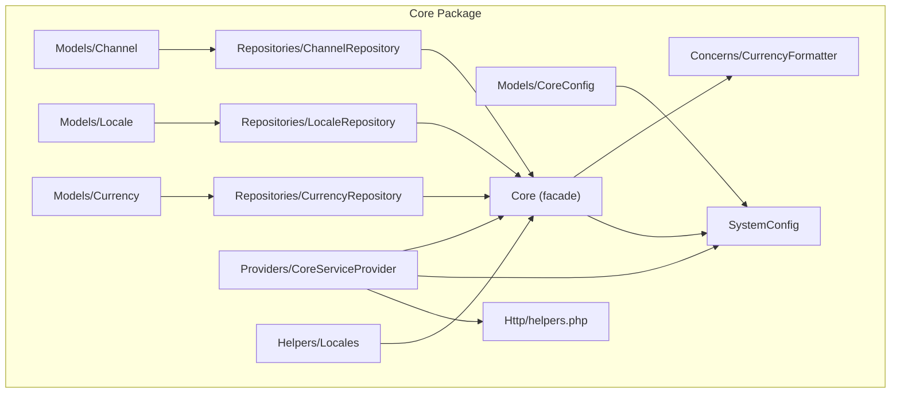
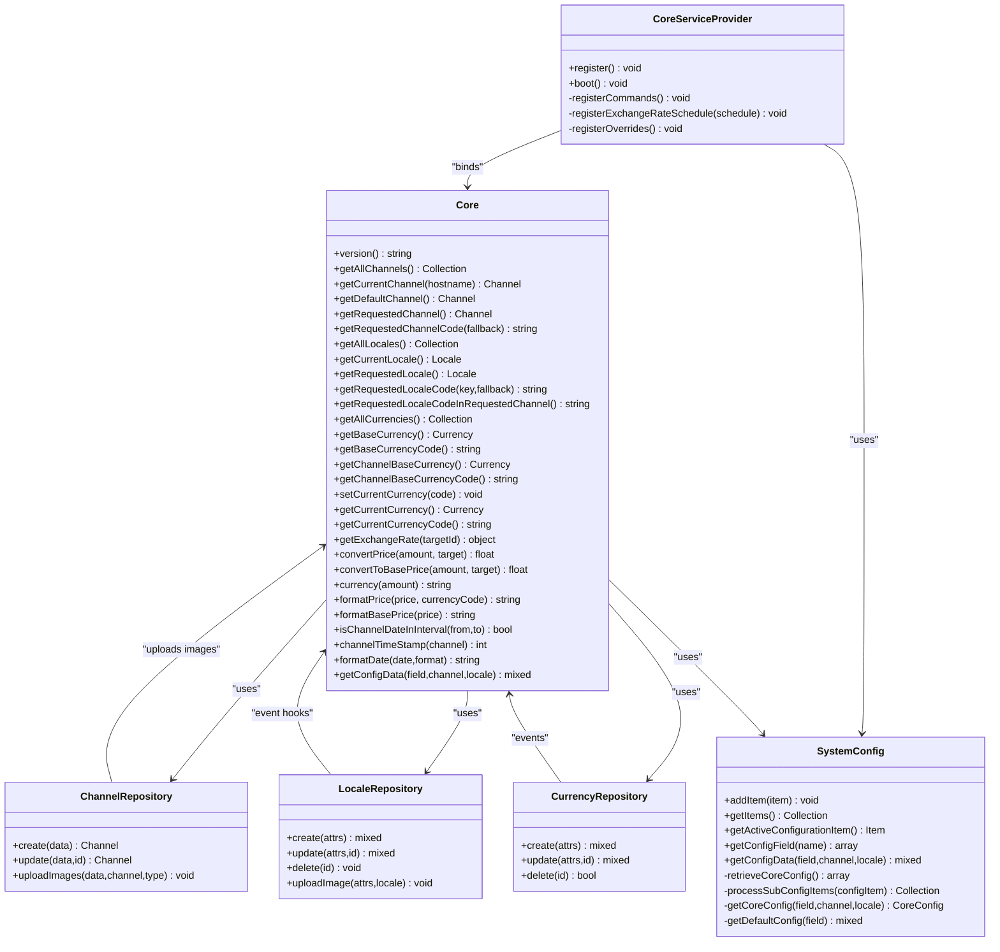
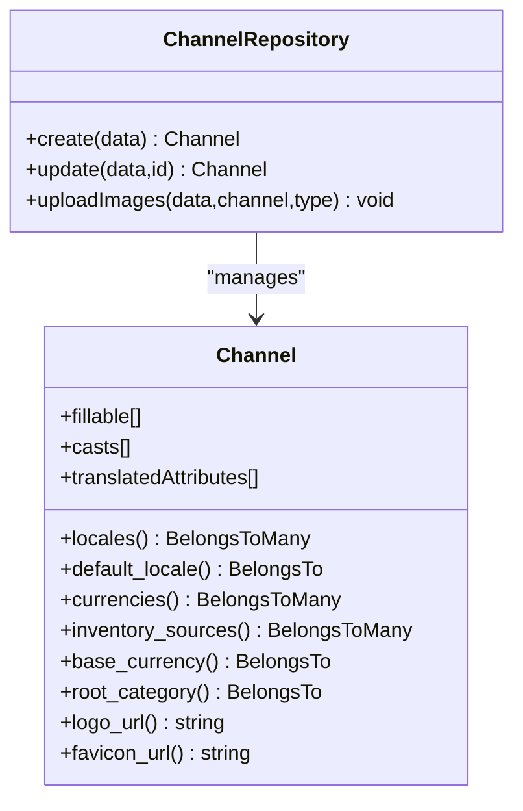
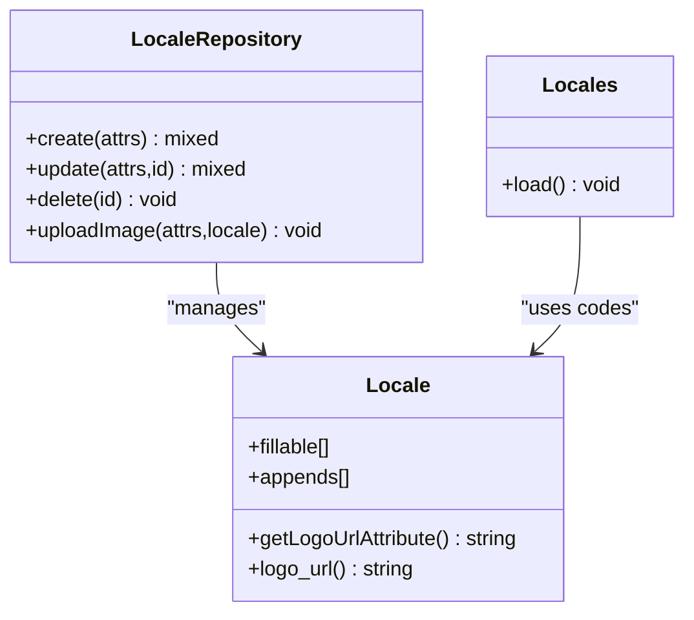
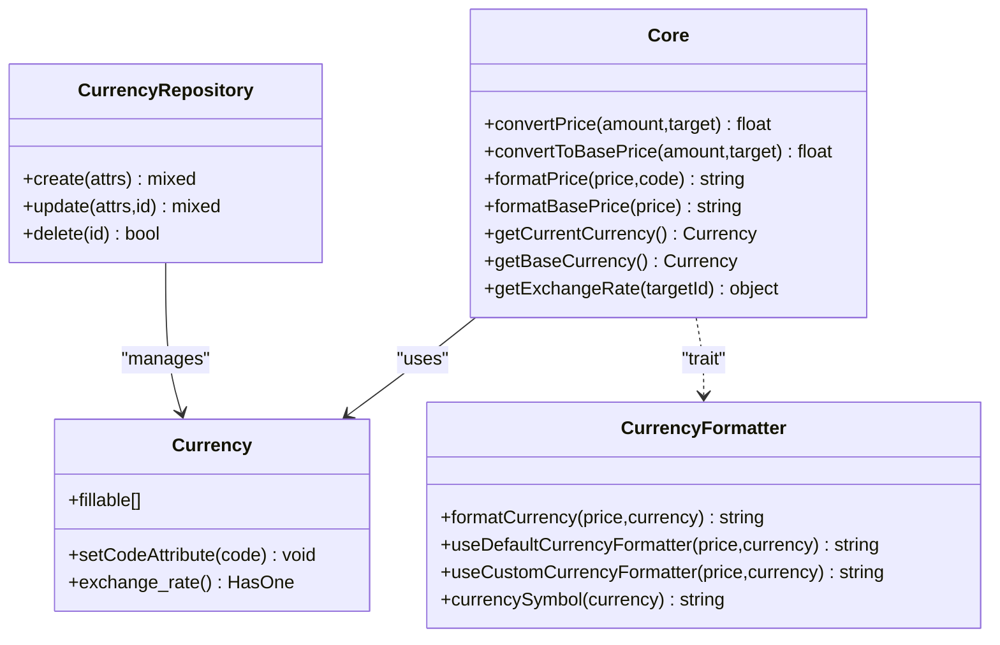
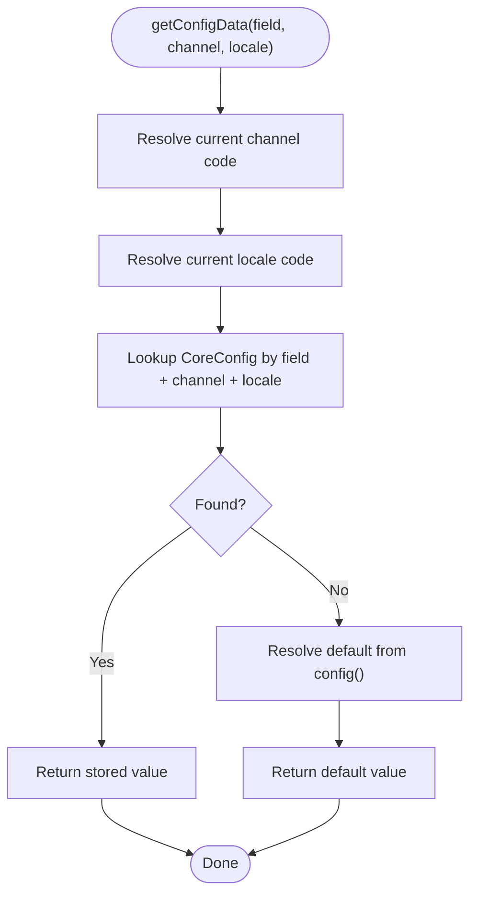
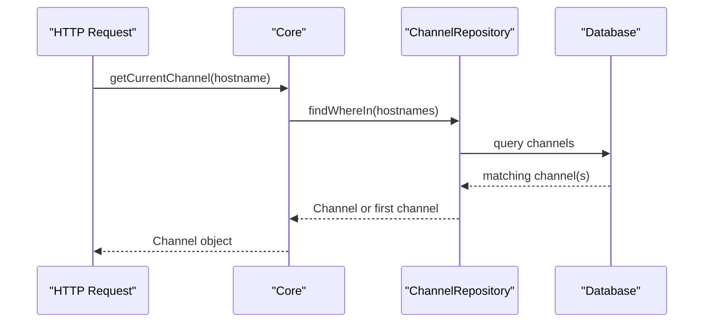
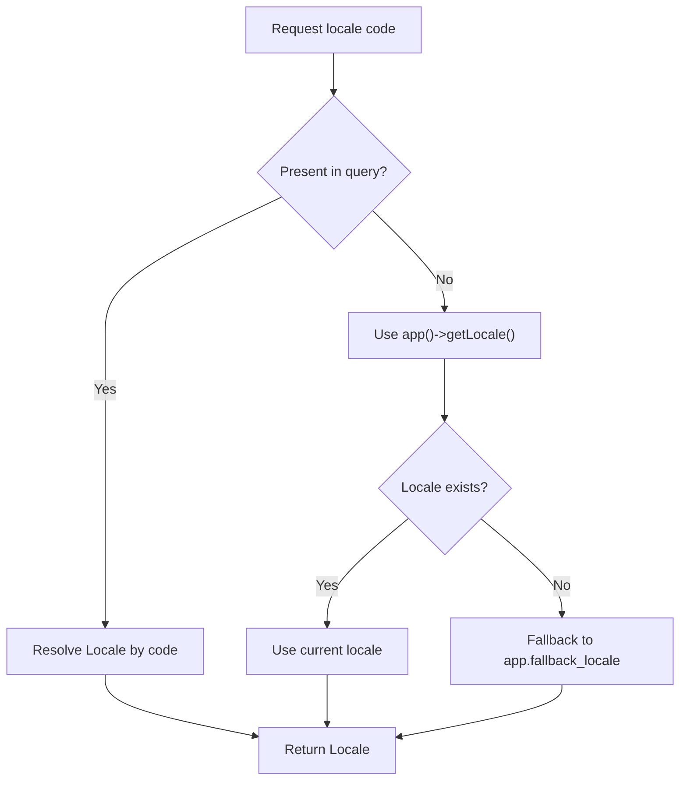
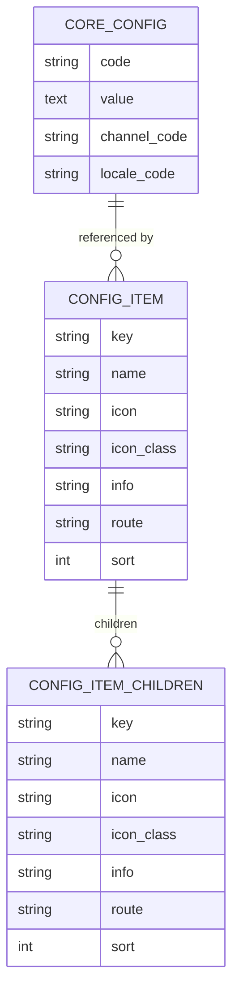
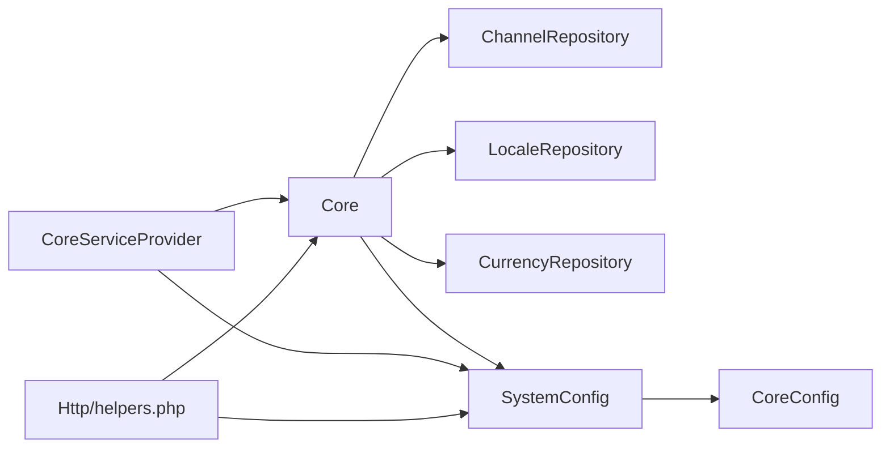

# Core Packages

<cite>
**Referenced Files in This Document**
- [packages/Webkul/Core/src/Models/Channel.php](file://packages/Webkul/Core/src/Models/Channel.php)
- [packages/Webkul/Core/src/Models/Locale.php](file://packages/Webkul/Core/src/Models/Locale.php)
- [packages/Webkul/Core/src/Models/Currency.php](file://packages/Webkul/Core/src/Models/Currency.php)
- [packages/Webkul/Core/src/Models/CoreConfig.php](file://packages/Webkul/Core/src/Models/CoreConfig.php)
- [packages/Webkul/Core/src/Providers/CoreServiceProvider.php](file://packages/Webkul/Core/src/Providers/CoreServiceProvider.php)
- [packages/Webkul/Core/src/Repositories/ChannelRepository.php](file://packages/Webkul/Core/src/Repositories/ChannelRepository.php)
- [packages/Webkul/Core/src/Repositories/LocaleRepository.php](file://packages/Webkul/Core/src/Repositories/LocaleRepository.php)
- [packages/Webkul/Core/src/Repositories/CurrencyRepository.php](file://packages/Webkul/Core/src/Repositories/CurrencyRepository.php)
- [packages/Webkul/Core/src/SystemConfig.php](file://packages/Webkul/Core/src/SystemConfig.php)
- [packages/Webkul/Core/src/Core.php](file://packages/Webkul/Core/src/Core.php)
- [packages/Webkul/Core/src/Helpers/Locales.php](file://packages/Webkul/Core/src/Helpers/Locales.php)
- [packages/Webkul/Core/src/Concerns/CurrencyFormatter.php](file://packages/Webkul/Core/src/Concerns/CurrencyFormatter.php)
- [packages/Webkul/Core/src/Http/helpers.php](file://packages/Webkul/Core/src/Http/helpers.php)
</cite>

## Table of Contents
1. [Introduction](#introduction)
2. [Project Structure](#project-structure)
3. [Core Components](#core-components)
4. [Architecture Overview](#architecture-overview)
5. [Detailed Component Analysis](#detailed-component-analysis)
6. [Dependency Analysis](#dependency-analysis)
7. [Performance Considerations](#performance-considerations)
8. [Troubleshooting Guide](#troubleshooting-guide)
9. [Conclusion](#conclusion)
10. [Appendices](#appendices)

## Introduction
This document explains the Core packages that underpin Frooxi’s e-commerce platform. It focuses on the foundational capabilities for multi-channel operations, internationalization, localization, currency handling, and system configuration. The Core package provides models, repositories, service providers, helpers, and configuration abstractions that enable channel-aware behavior, locale selection, currency formatting and conversion, and centralized configuration management across admin and storefront contexts.

## Project Structure
The Core package is organized around:
- Models: Channel, Locale, Currency, CoreConfig
- Repositories: ChannelRepository, LocaleRepository, CurrencyRepository, plus others used by Core
- Providers: CoreServiceProvider for registration, scheduling, and overrides
- System configuration: SystemConfig and related Item/ItemField structures
- Formatting and helpers: CurrencyFormatter trait, Core facade, and HTTP helpers
- Internationalization: Locale model and helper integration

**Diagram sources**
- [packages/Webkul/Core/src/Models/Channel.php:1-157](file://packages/Webkul/Core/src/Models/Channel.php#L1-L157)
- [packages/Webkul/Core/src/Models/Locale.php:1-66](file://packages/Webkul/Core/src/Models/Locale.php#L1-L66)
- [packages/Webkul/Core/src/Models/Currency.php:1-55](file://packages/Webkul/Core/src/Models/Currency.php#L1-L55)
- [packages/Webkul/Core/src/Models/CoreConfig.php:1-49](file://packages/Webkul/Core/src/Models/CoreConfig.php#L1-L49)
- [packages/Webkul/Core/src/Repositories/ChannelRepository.php:1-103](file://packages/Webkul/Core/src/Repositories/ChannelRepository.php#L1-L103)
- [packages/Webkul/Core/src/Repositories/LocaleRepository.php:1-109](file://packages/Webkul/Core/src/Repositories/LocaleRepository.php#L1-L109)
- [packages/Webkul/Core/src/Repositories/CurrencyRepository.php:1-74](file://packages/Webkul/Core/src/Repositories/CurrencyRepository.php#L1-L74)
- [packages/Webkul/Core/src/Providers/CoreServiceProvider.php:1-142](file://packages/Webkul/Core/src/Providers/CoreServiceProvider.php#L1-L142)
- [packages/Webkul/Core/src/SystemConfig.php:1-234](file://packages/Webkul/Core/src/SystemConfig.php#L1-L234)
- [packages/Webkul/Core/src/Core.php:1-800](file://packages/Webkul/Core/src/Core.php#L1-L800)
- [packages/Webkul/Core/src/Concerns/CurrencyFormatter.php:1-104](file://packages/Webkul/Core/src/Concerns/CurrencyFormatter.php#L1-L104)
- [packages/Webkul/Core/src/Helpers/Locales.php:1-21](file://packages/Webkul/Core/src/Helpers/Locales.php#L1-L21)
- [packages/Webkul/Core/src/Http/helpers.php:1-264](file://packages/Webkul/Core/src/Http/helpers.php#L1-L264)

**Section sources**
- [packages/Webkul/Core/src/Models/Channel.php:1-157](file://packages/Webkul/Core/src/Models/Channel.php#L1-L157)
- [packages/Webkul/Core/src/Models/Locale.php:1-66](file://packages/Webkul/Core/src/Models/Locale.php#L1-L66)
- [packages/Webkul/Core/src/Models/Currency.php:1-55](file://packages/Webkul/Core/src/Models/Currency.php#L1-L55)
- [packages/Webkul/Core/src/Models/CoreConfig.php:1-49](file://packages/Webkul/Core/src/Models/CoreConfig.php#L1-L49)
- [packages/Webkul/Core/src/Repositories/ChannelRepository.php:1-103](file://packages/Webkul/Core/src/Repositories/ChannelRepository.php#L1-L103)
- [packages/Webkul/Core/src/Repositories/LocaleRepository.php:1-109](file://packages/Webkul/Core/src/Repositories/LocaleRepository.php#L1-L109)
- [packages/Webkul/Core/src/Repositories/CurrencyRepository.php:1-74](file://packages/Webkul/Core/src/Repositories/CurrencyRepository.php#L1-L74)
- [packages/Webkul/Core/src/Providers/CoreServiceProvider.php:1-142](file://packages/Webkul/Core/src/Providers/CoreServiceProvider.php#L1-L142)
- [packages/Webkul/Core/src/SystemConfig.php:1-234](file://packages/Webkul/Core/src/SystemConfig.php#L1-L234)
- [packages/Webkul/Core/src/Core.php:1-800](file://packages/Webkul/Core/src/Core.php#L1-L800)
- [packages/Webkul/Core/src/Concerns/CurrencyFormatter.php:1-104](file://packages/Webkul/Core/src/Concerns/CurrencyFormatter.php#L1-L104)
- [packages/Webkul/Core/src/Helpers/Locales.php:1-21](file://packages/Webkul/Core/src/Helpers/Locales.php#L1-L21)
- [packages/Webkul/Core/src/Http/helpers.php:1-264](file://packages/Webkul/Core/src/Http/helpers.php#L1-L264)

## Core Components
- Channel: Multi-tenant-like channel entity with hostname routing, default locale and base currency, SEO metadata, maintenance mode, allowed IPs, and associations to locales, currencies, and inventory sources.
- Locale: Localization unit with code/name/direction and optional logo path resolution.
- Currency: Monetary unit with symbol, decimal precision, grouping/decimal separators, and position formatting rules; includes exchange rate association.
- CoreConfig: Hierarchical configuration persisted per field, channel, and locale.
- SystemConfig: Aggregates configuration definitions, builds nested items, resolves active item by slug, and retrieves values honoring channel/locale scoping.
- Core: Facade providing channel discovery, locale/currency selection, exchange rate retrieval, price conversion/formatting, date/timezone utilities, and configuration access.
- Repositories: CRUD and specialized behaviors for Channel, Locale, and Currency, including image uploads and event hooks.
- Provider: Registers commands, schedules, view events, middleware overrides, and binds core compiler and Elasticsearch client.
- Helpers: Global helpers for core, menu, ACL, system config, asset URLs, image encoding, and Cloudinary utilities.

**Section sources**
- [packages/Webkul/Core/src/Models/Channel.php:1-157](file://packages/Webkul/Core/src/Models/Channel.php#L1-L157)
- [packages/Webkul/Core/src/Models/Locale.php:1-66](file://packages/Webkul/Core/src/Models/Locale.php#L1-L66)
- [packages/Webkul/Core/src/Models/Currency.php:1-55](file://packages/Webkul/Core/src/Models/Currency.php#L1-L55)
- [packages/Webkul/Core/src/Models/CoreConfig.php:1-49](file://packages/Webkul/Core/src/Models/CoreConfig.php#L1-L49)
- [packages/Webkul/Core/src/SystemConfig.php:1-234](file://packages/Webkul/Core/src/SystemConfig.php#L1-L234)
- [packages/Webkul/Core/src/Core.php:1-800](file://packages/Webkul/Core/src/Core.php#L1-L800)
- [packages/Webkul/Core/src/Repositories/ChannelRepository.php:1-103](file://packages/Webkul/Core/src/Repositories/ChannelRepository.php#L1-L103)
- [packages/Webkul/Core/src/Repositories/LocaleRepository.php:1-109](file://packages/Webkul/Core/src/Repositories/LocaleRepository.php#L1-L109)
- [packages/Webkul/Core/src/Repositories/CurrencyRepository.php:1-74](file://packages/Webkul/Core/src/Repositories/CurrencyRepository.php#L1-L74)
- [packages/Webkul/Core/src/Providers/CoreServiceProvider.php:1-142](file://packages/Webkul/Core/src/Providers/CoreServiceProvider.php#L1-L142)
- [packages/Webkul/Core/src/Http/helpers.php:1-264](file://packages/Webkul/Core/src/Http/helpers.php#L1-L264)

## Architecture Overview
The Core package orchestrates multi-channel, internationalization, and configuration across the application via a facade-driven design. The provider wires console commands, scheduling, view events, and middleware overrides. The Core facade encapsulates channel detection, locale/currency selection, and configuration retrieval. SystemConfig composes configuration definitions from core config arrays and resolves values considering channel and locale scopes.

**Diagram sources**
- [packages/Webkul/Core/src/Providers/CoreServiceProvider.php:1-142](file://packages/Webkul/Core/src/Providers/CoreServiceProvider.php#L1-L142)
- [packages/Webkul/Core/src/Core.php:1-800](file://packages/Webkul/Core/src/Core.php#L1-L800)
- [packages/Webkul/Core/src/SystemConfig.php:1-234](file://packages/Webkul/Core/src/SystemConfig.php#L1-L234)
- [packages/Webkul/Core/src/Repositories/ChannelRepository.php:1-103](file://packages/Webkul/Core/src/Repositories/ChannelRepository.php#L1-L103)
- [packages/Webkul/Core/src/Repositories/LocaleRepository.php:1-109](file://packages/Webkul/Core/src/Repositories/LocaleRepository.php#L1-L109)
- [packages/Webkul/Core/src/Repositories/CurrencyRepository.php:1-74](file://packages/Webkul/Core/src/Repositories/CurrencyRepository.php#L1-L74)

## Detailed Component Analysis

### Channel Management
- Purpose: Encapsulate channel-level settings, branding assets, and scoping for locales, currencies, inventory sources, and root category.
- Key relationships:
  - Belongs to default locale and base currency
  - Belongs to root category
  - Many-to-many with locales and currencies
  - Many-to-many with inventory sources
- Assets: Logo and favicon URL helpers delegate to storage; repository supports uploading and clearing images.
- Hostname routing: Core selects current channel by HTTP host with protocol normalization.

**Diagram sources**
- [packages/Webkul/Core/src/Models/Channel.php:1-157](file://packages/Webkul/Core/src/Models/Channel.php#L1-L157)
- [packages/Webkul/Core/src/Repositories/ChannelRepository.php:1-103](file://packages/Webkul/Core/src/Repositories/ChannelRepository.php#L1-L103)

**Section sources**
- [packages/Webkul/Core/src/Models/Channel.php:1-157](file://packages/Webkul/Core/src/Models/Channel.php#L1-L157)
- [packages/Webkul/Core/src/Repositories/ChannelRepository.php:1-103](file://packages/Webkul/Core/src/Repositories/ChannelRepository.php#L1-L103)
- [packages/Webkul/Core/src/Core.php:139-160](file://packages/Webkul/Core/src/Core.php#L139-L160)

### Locale Configuration and Internationalization
- Purpose: Define supported locales with code, name, direction, and optional logo path.
- Resolution: Core selects current locale by application locale, falling back to configured fallback; also resolves requested locale from query parameters.
- Locale helper: Extends translation locales to populate available codes for the application.

**Diagram sources**
- [packages/Webkul/Core/src/Models/Locale.php:1-66](file://packages/Webkul/Core/src/Models/Locale.php#L1-L66)
- [packages/Webkul/Core/src/Repositories/LocaleRepository.php:1-109](file://packages/Webkul/Core/src/Repositories/LocaleRepository.php#L1-L109)
- [packages/Webkul/Core/src/Helpers/Locales.php:1-21](file://packages/Webkul/Core/src/Helpers/Locales.php#L1-L21)

**Section sources**
- [packages/Webkul/Core/src/Models/Locale.php:1-66](file://packages/Webkul/Core/src/Models/Locale.php#L1-L66)
- [packages/Webkul/Core/src/Repositories/LocaleRepository.php:1-109](file://packages/Webkul/Core/src/Repositories/LocaleRepository.php#L1-L109)
- [packages/Webkul/Core/src/Helpers/Locales.php:1-21](file://packages/Webkul/Core/src/Helpers/Locales.php#L1-L21)
- [packages/Webkul/Core/src/Core.php:278-307](file://packages/Webkul/Core/src/Core.php#L278-L307)

### Currency Handling and Formatting
- Purpose: Represent currencies with symbol, decimals, separators, and position formatting; link to exchange rates; format prices consistently.
- Features:
  - Default ICU-based formatting or custom formatting with configurable separators and symbol placement
  - Price conversion using exchange rates
  - Base vs current currency selection with fallbacks
- Model behavior: Forces uppercase currency codes and exposes exchange rate relationship.

**Diagram sources**
- [packages/Webkul/Core/src/Models/Currency.php:1-55](file://packages/Webkul/Core/src/Models/Currency.php#L1-L55)
- [packages/Webkul/Core/src/Repositories/CurrencyRepository.php:1-74](file://packages/Webkul/Core/src/Repositories/CurrencyRepository.php#L1-L74)
- [packages/Webkul/Core/src/Concerns/CurrencyFormatter.php:1-104](file://packages/Webkul/Core/src/Concerns/CurrencyFormatter.php#L1-L104)
- [packages/Webkul/Core/src/Core.php:455-566](file://packages/Webkul/Core/src/Core.php#L455-L566)

**Section sources**
- [packages/Webkul/Core/src/Models/Currency.php:1-55](file://packages/Webkul/Core/src/Models/Currency.php#L1-L55)
- [packages/Webkul/Core/src/Repositories/CurrencyRepository.php:1-74](file://packages/Webkul/Core/src/Repositories/CurrencyRepository.php#L1-L74)
- [packages/Webkul/Core/src/Concerns/CurrencyFormatter.php:1-104](file://packages/Webkul/Core/src/Concerns/CurrencyFormatter.php#L1-L104)
- [packages/Webkul/Core/src/Core.php:455-566](file://packages/Webkul/Core/src/Core.php#L455-L566)

### System Configuration and Scoping
- Purpose: Centralized configuration with hierarchical keys, optional channel and locale scoping, and dynamic composition from core config definitions.
- Behavior:
  - Builds nested configuration items from dot-notated keys
  - Resolves active configuration item by slug(s)
  - Retrieves values prioritizing channel/locale-specific entries, then defaults
- Accessor: Core delegates getConfigData to SystemConfig.

**Diagram sources**
- [packages/Webkul/Core/src/SystemConfig.php:163-232](file://packages/Webkul/Core/src/SystemConfig.php#L163-L232)
- [packages/Webkul/Core/src/Core.php:656-659](file://packages/Webkul/Core/src/Core.php#L656-L659)

**Section sources**
- [packages/Webkul/Core/src/SystemConfig.php:1-234](file://packages/Webkul/Core/src/SystemConfig.php#L1-L234)
- [packages/Webkul/Core/src/Core.php:656-659](file://packages/Webkul/Core/src/Core.php#L656-L659)

### Multi-Channel Architecture and Routing
- Channel discovery: Core detects the current channel by HTTP host, normalizing scheme, with fallback to the first channel if none match.
- Channel scoping: Configuration reads, currency conversions, and locale checks consider the current channel.
- Channel creation/update: ChannelRepository synchronizes associated locales, currencies, inventory sources, and uploads images.

**Diagram sources**
- [packages/Webkul/Core/src/Core.php:139-160](file://packages/Webkul/Core/src/Core.php#L139-L160)
- [packages/Webkul/Core/src/Repositories/ChannelRepository.php:24-50](file://packages/Webkul/Core/src/Repositories/ChannelRepository.php#L24-L50)

**Section sources**
- [packages/Webkul/Core/src/Core.php:139-160](file://packages/Webkul/Core/src/Core.php#L139-L160)
- [packages/Webkul/Core/src/Repositories/ChannelRepository.php:24-50](file://packages/Webkul/Core/src/Repositories/ChannelRepository.php#L24-L50)

### Internationalization System and Localization Features
- Locale resolution: Core.getCurrentLocale falls back to app fallback locale if the current locale is unavailable.
- Locale lists: Core.getAllLocales returns sorted locales for UI and selection.
- Translation integration: Locale codes are populated by the Locales helper using core()->getAllLocales().
- Channel-scoped locales: Channels maintain many-to-many relations with locales, ensuring channel-specific visibility.

**Diagram sources**
- [packages/Webkul/Core/src/Core.php:298-307](file://packages/Webkul/Core/src/Core.php#L298-L307)
- [packages/Webkul/Core/src/Core.php:278-291](file://packages/Webkul/Core/src/Core.php#L278-L291)
- [packages/Webkul/Core/src/Helpers/Locales.php:1-21](file://packages/Webkul/Core/src/Helpers/Locales.php#L1-L21)

**Section sources**
- [packages/Webkul/Core/src/Core.php:268-345](file://packages/Webkul/Core/src/Core.php#L268-L345)
- [packages/Webkul/Core/src/Helpers/Locales.php:1-21](file://packages/Webkul/Core/src/Helpers/Locales.php#L1-L21)

### Configuration Options and Data Models
- CoreConfig fields: code, value, channel_code, locale_code; hidden token property.
- SystemConfig items: composed from core config definitions with icons, names, info, routes, and sorting; supports nested children.
- Field scoping: getConfigData considers channel_based and locale_based flags to select the most specific value.

**Diagram sources**
- [packages/Webkul/Core/src/Models/CoreConfig.php:1-49](file://packages/Webkul/Core/src/Models/CoreConfig.php#L1-L49)
- [packages/Webkul/Core/src/SystemConfig.php:64-114](file://packages/Webkul/Core/src/SystemConfig.php#L64-L114)

**Section sources**
- [packages/Webkul/Core/src/Models/CoreConfig.php:1-49](file://packages/Webkul/Core/src/Models/CoreConfig.php#L1-L49)
- [packages/Webkul/Core/src/SystemConfig.php:64-114](file://packages/Webkul/Core/src/SystemConfig.php#L64-L114)

### Integration Patterns
- Facade pattern: core(), system_config(), menu(), acl() provide global access to Core, SystemConfig, Menu, and ACL singletons.
- Event hooks: LocaleRepository dispatches before/after create/update/delete events; ChannelRepository updates associations and images.
- Middleware overrides: CoreServiceProvider replaces default maintenance and exception handling with package-specific implementations.
- Asset pipeline: Helpers provide Cloudinary upload and URL generation for fast asset delivery.

**Section sources**
- [packages/Webkul/Core/src/Http/helpers.php:11-57](file://packages/Webkul/Core/src/Http/helpers.php#L11-L57)
- [packages/Webkul/Core/src/Repositories/LocaleRepository.php:26-54](file://packages/Webkul/Core/src/Repositories/LocaleRepository.php#L26-L54)
- [packages/Webkul/Core/src/Repositories/ChannelRepository.php:37-72](file://packages/Webkul/Core/src/Repositories/ChannelRepository.php#L37-L72)
- [packages/Webkul/Core/src/Providers/CoreServiceProvider.php:109-140](file://packages/Webkul/Core/src/Providers/CoreServiceProvider.php#L109-L140)

### Examples of Extending Core Functionality
- Adding a new channel attribute:
  - Extend Channel model fillable and translated attributes.
  - Update ChannelRepository create/update to sync new associations or images.
  - Add configuration keys under SystemConfig to control behavior per channel.
- Introducing a new currency formatting rule:
  - Extend CurrencyFormatter trait to support additional positions or separators.
  - Update Currency model attributes to persist formatting preferences.
- Customizing maintenance mode behavior:
  - Override PreventRequestsDuringMaintenance binding in CoreServiceProvider.
  - Adjust CoreConfig keys to change maintenance mode text or allowed IPs.

[No sources needed since this section provides general guidance]

## Dependency Analysis
- Core depends on repositories for channels, locales, currencies, exchange rates, countries, states, and customer groups.
- SystemConfig depends on CoreConfig model and repository to resolve values.
- Providers bind facades, override console commands, and schedule recurring tasks.
- Helpers depend on facades and configuration for asset and sanitization utilities.

**Diagram sources**
- [packages/Webkul/Core/src/Core.php:102-112](file://packages/Webkul/Core/src/Core.php#L102-L112)
- [packages/Webkul/Core/src/SystemConfig.php:24-24](file://packages/Webkul/Core/src/SystemConfig.php#L24-L24)
- [packages/Webkul/Core/src/Providers/CoreServiceProvider.php:61-63](file://packages/Webkul/Core/src/Providers/CoreServiceProvider.php#L61-L63)
- [packages/Webkul/Core/src/Http/helpers.php:11-57](file://packages/Webkul/Core/src/Http/helpers.php#L11-L57)

**Section sources**
- [packages/Webkul/Core/src/Core.php:102-112](file://packages/Webkul/Core/src/Core.php#L102-L112)
- [packages/Webkul/Core/src/SystemConfig.php:24-24](file://packages/Webkul/Core/src/SystemConfig.php#L24-L24)
- [packages/Webkul/Core/src/Providers/CoreServiceProvider.php:61-63](file://packages/Webkul/Core/src/Providers/CoreServiceProvider.php#L61-L63)
- [packages/Webkul/Core/src/Http/helpers.php:11-57](file://packages/Webkul/Core/src/Http/helpers.php#L11-L57)

## Performance Considerations
- Currency formatting: Prefer caching formatted results for repeated renders; avoid excessive NumberFormatter instantiation.
- Exchange rate lookups: Cache exchange rates keyed by target currency to minimize repository queries.
- Asset handling: Use Cloudinary URL helper to bypass Storage::url API calls for faster image rendering.
- Configuration reads: SystemConfig caches prepared items; avoid deep nesting in core config definitions to keep lookup efficient.

[No sources needed since this section provides general guidance]

## Troubleshooting Guide
- Channel not detected:
  - Verify hostname normalization and presence in channel hostnames; check fallback to first channel.
- Locale not applied:
  - Confirm locale code exists and is included in the requested channel’s locales; ensure app fallback locale is configured.
- Currency symbol mismatch:
  - Use currencySymbol helper to verify ICU symbol; customize symbol via Currency model or custom formatter.
- Configuration not taking effect:
  - Check channel/locale scoping flags; confirm stored CoreConfig values; validate SystemConfig item keys and sorting.
- Maintenance mode or exceptions:
  - Review overridden maintenance middleware and exception handler bindings in CoreServiceProvider.

**Section sources**
- [packages/Webkul/Core/src/Core.php:139-160](file://packages/Webkul/Core/src/Core.php#L139-L160)
- [packages/Webkul/Core/src/Core.php:278-307](file://packages/Webkul/Core/src/Core.php#L278-L307)
- [packages/Webkul/Core/src/Concerns/CurrencyFormatter.php:95-102](file://packages/Webkul/Core/src/Concerns/CurrencyFormatter.php#L95-L102)
- [packages/Webkul/Core/src/SystemConfig.php:163-232](file://packages/Webkul/Core/src/SystemConfig.php#L163-L232)
- [packages/Webkul/Core/src/Providers/CoreServiceProvider.php:109-140](file://packages/Webkul/Core/src/Providers/CoreServiceProvider.php#L109-L140)

## Conclusion
The Core package establishes a robust foundation for multi-channel, internationalized, and configurable e-commerce operations. Through well-defined models, repositories, and the Core facade, it centralizes channel detection, locale and currency selection, price formatting and conversion, and system configuration resolution. The provider and helpers integrate tightly with the framework to offer extensible behavior, while SystemConfig enables structured, scoped configuration management.

[No sources needed since this section summarizes without analyzing specific files]

## Appendices

### API and Helper Reference
- core(): Core facade accessor
- system_config(): SystemConfig accessor
- menu(): Menu accessor
- acl(): ACL accessor
- cloudinary_upload(file, folder, subFolder, filename, convert): Upload to Cloudinary
- cloudinary_url(path, transformations): Fast Cloudinary URL generation

**Section sources**
- [packages/Webkul/Core/src/Http/helpers.php:11-57](file://packages/Webkul/Core/src/Http/helpers.php#L11-L57)
- [packages/Webkul/Core/src/Http/helpers.php:187-263](file://packages/Webkul/Core/src/Http/helpers.php#L187-L263)