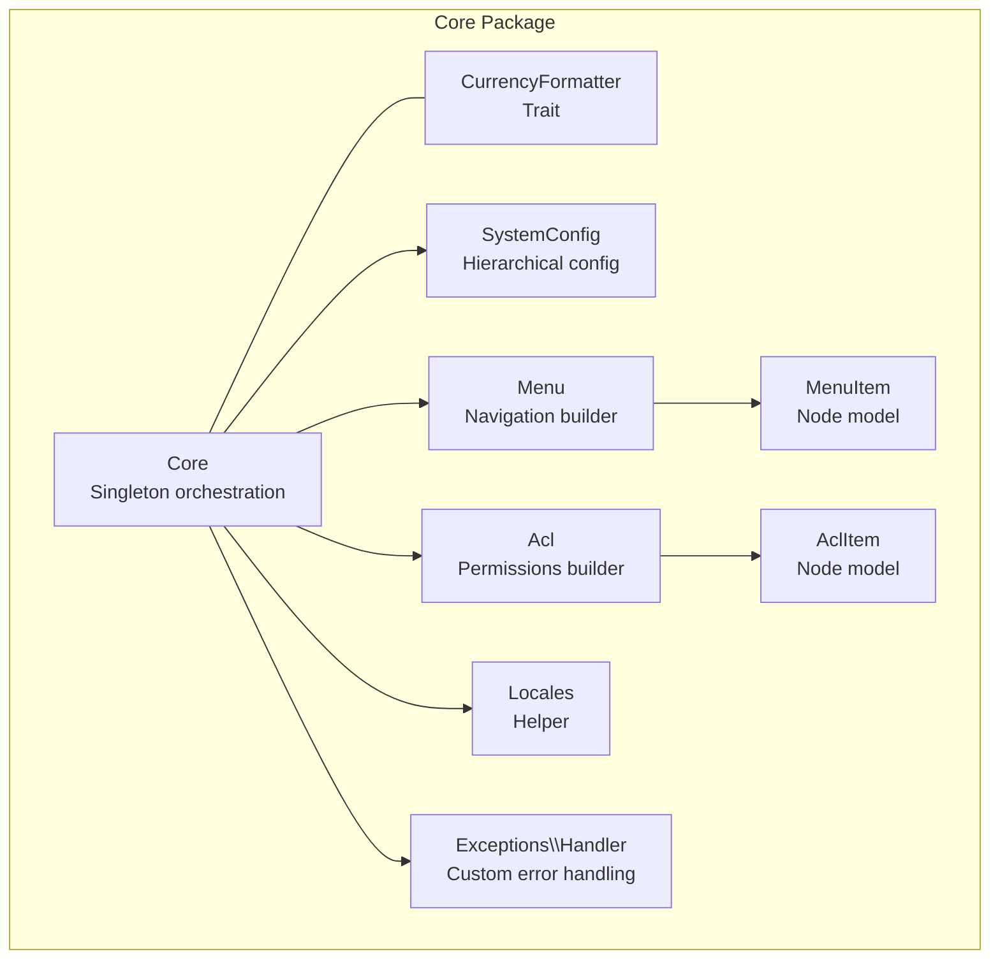
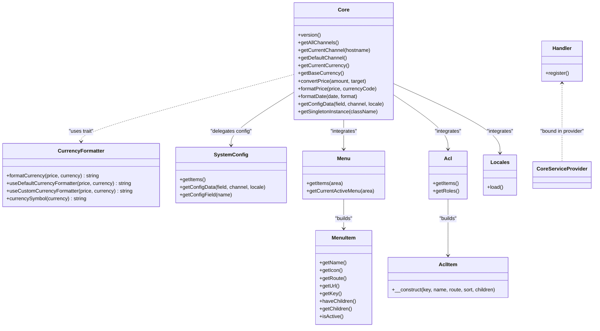
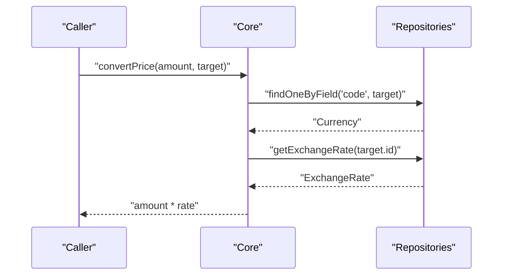
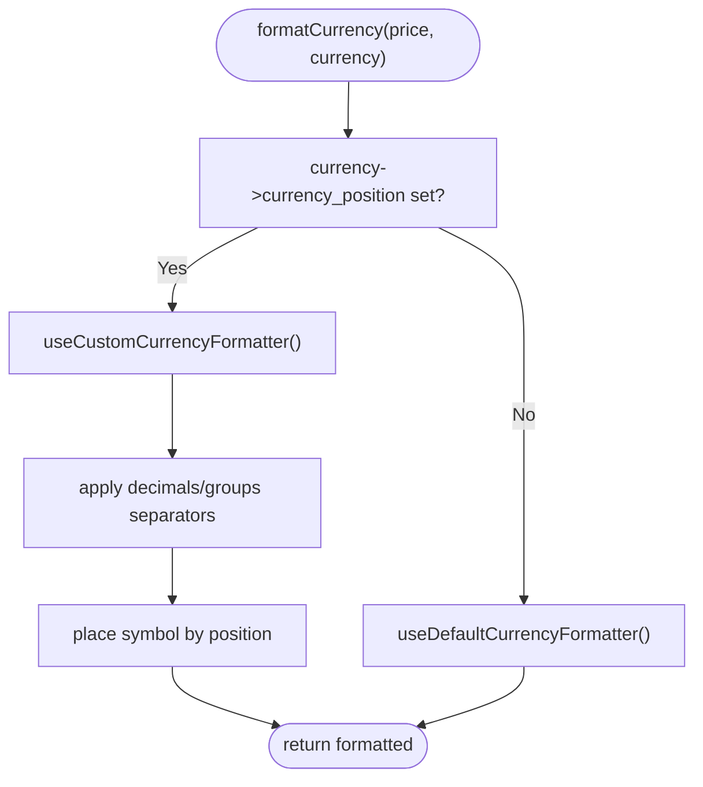
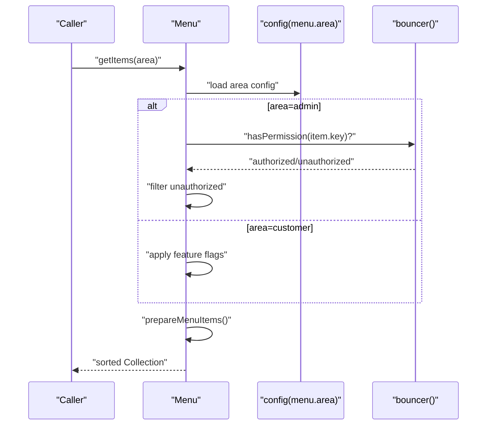
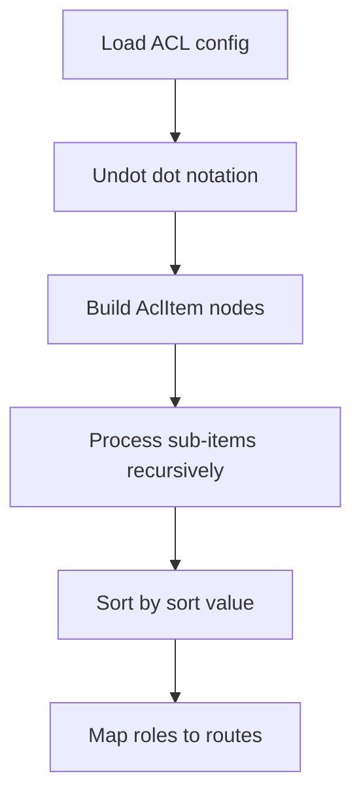
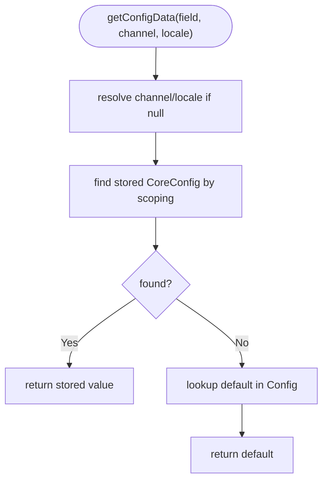
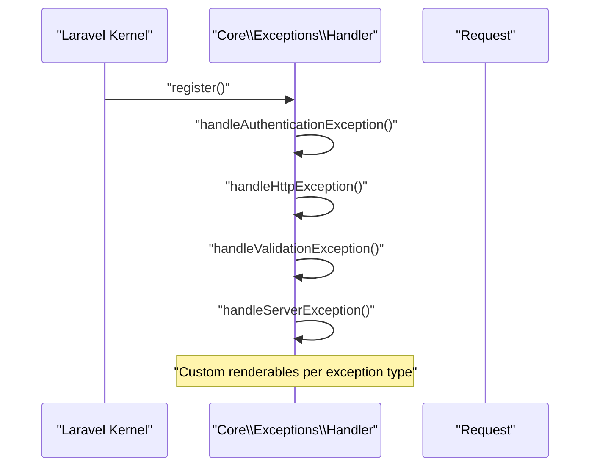
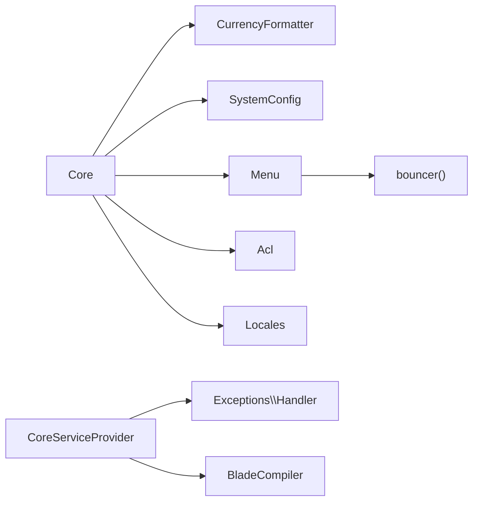

# Core Services & Utilities

<cite>
**Referenced Files in This Document**
- [Core.php](file://packages/Webkul/Core/src/Core.php)
- [CurrencyFormatter.php](file://packages/Webkul/Core/src/Concerns/CurrencyFormatter.php)
- [Acl.php](file://packages/Webkul/Core/src/Acl.php)
- [AclItem.php](file://packages/Webkul/Core/src/Acl/AclItem.php)
- [Menu.php](file://packages/Webkul/Core/src/Menu.php)
- [MenuItem.php](file://packages/Webkul/Core/src/Menu/MenuItem.php)
- [Locales.php](file://packages/Webkul/Core/src/Helpers/Locales.php)
- [SystemConfig.php](file://packages/Webkul/Core/src/SystemConfig.php)
- [Handler.php](file://packages/Webkul/Core/src/Exceptions/Handler.php)
- [CoreServiceProvider.php](file://packages/Webkul/Core/src/Providers/CoreServiceProvider.php)
- [helpers.php](file://packages/Webkul/Core/src/Http/helpers.php)
</cite>

## Table of Contents
1. [Introduction](#introduction)
2. [Project Structure](#project-structure)
3. [Core Components](#core-components)
4. [Architecture Overview](#architecture-overview)
5. [Detailed Component Analysis](#detailed-component-analysis)
6. [Dependency Analysis](#dependency-analysis)
7. [Performance Considerations](#performance-considerations)
8. [Troubleshooting Guide](#troubleshooting-guide)
9. [Conclusion](#conclusion)
10. [Appendices](#appendices)

## Introduction
This document explains Bagisto’s Core package services and utilities with a focus on:
- The Core class singleton pattern, channel and locale resolution, currency conversion/formatting, and date/time formatting
- Exception handling and custom error management
- Currency formatting via a reusable trait
- Navigation building with the Menu system and Access Control List (ACL) permissions
- Locales helper utilities and related core services
- Extension points, custom formatter implementations, and integration with Menu and ACL
- Service provider registration and dependency injection patterns

## Project Structure
The Core package organizes cross-cutting concerns under a cohesive set of classes and traits:
- Core service orchestrating channels, currencies, locales, dates, and configuration
- Currency formatting utilities via a trait consumed by Core
- Menu and ACL builders for navigation and permissions
- System configuration abstraction for hierarchical settings
- Exception handler customization
- Service provider wiring and facades/helpers

**Diagram sources**
- [Core.php:23-112](file://packages/Webkul/Core/src/Core.php#L23-L112)
- [CurrencyFormatter.php:8-104](file://packages/Webkul/Core/src/Concerns/CurrencyFormatter.php#L8-L104)
- [SystemConfig.php:12-234](file://packages/Webkul/Core/src/SystemConfig.php#L12-L234)
- [Menu.php:9-197](file://packages/Webkul/Core/src/Menu.php#L9-L197)
- [MenuItem.php:7-103](file://packages/Webkul/Core/src/Menu/MenuItem.php#L7-L103)
- [Acl.php:9-117](file://packages/Webkul/Core/src/Acl.php#L9-L117)
- [AclItem.php:7-20](file://packages/Webkul/Core/src/Acl/AclItem.php#L7-L20)
- [Locales.php:7-21](file://packages/Webkul/Core/src/Helpers/Locales.php#L7-L21)
- [Handler.php:12-118](file://packages/Webkul/Core/src/Exceptions/Handler.php#L12-L118)

**Section sources**
- [Core.php:23-112](file://packages/Webkul/Core/src/Core.php#L23-L112)
- [CoreServiceProvider.php:22-142](file://packages/Webkul/Core/src/Providers/CoreServiceProvider.php#L22-L142)

## Core Components
- Core service: central orchestrator for channels, currencies, locales, dates, and configuration; exposes singleton retrieval and formatting helpers
- CurrencyFormatter trait: encapsulates locale-aware currency formatting with default and custom symbol/separator positioning
- Menu and MenuItem: build navigations from configuration, filter by permissions, and compute active states
- Acl and AclItem: transform ACL configuration into a hierarchical tree of permission nodes
- SystemConfig: resolves nested configuration items and values with channel/locale scoping
- Exception Handler: customizes error rendering per admin/shop and JSON vs HTML requests
- Service Provider: registers commands, overrides maintenance/up/down commands, binds exception handler, and wires facades/helpers

**Section sources**
- [Core.php:23-112](file://packages/Webkul/Core/src/Core.php#L23-L112)
- [CurrencyFormatter.php:8-104](file://packages/Webkul/Core/src/Concerns/CurrencyFormatter.php#L8-L104)
- [Menu.php:9-197](file://packages/Webkul/Core/src/Menu.php#L9-L197)
- [Acl.php:9-117](file://packages/Webkul/Core/src/Acl.php#L9-L117)
- [SystemConfig.php:12-234](file://packages/Webkul/Core/src/SystemConfig.php#L12-L234)
- [Handler.php:12-118](file://packages/Webkul/Core/src/Exceptions/Handler.php#L12-L118)
- [CoreServiceProvider.php:22-142](file://packages/Webkul/Core/src/Providers/CoreServiceProvider.php#L22-L142)

## Architecture Overview
The Core package integrates with Laravel’s container and configuration system to provide:
- Facades and global helpers for convenient access
- Hierarchical configuration resolution with channel/locale awareness
- Permission-driven navigation filtering
- Locale-aware currency and date formatting
- Centralized exception handling with environment-aware behavior

**Diagram sources**
- [Core.php:23-112](file://packages/Webkul/Core/src/Core.php#L23-L112)
- [CurrencyFormatter.php:8-104](file://packages/Webkul/Core/src/Concerns/CurrencyFormatter.php#L8-L104)
- [SystemConfig.php:12-234](file://packages/Webkul/Core/src/SystemConfig.php#L12-L234)
- [Menu.php:9-197](file://packages/Webkul/Core/src/Menu.php#L9-L197)
- [MenuItem.php:7-103](file://packages/Webkul/Core/src/Menu/MenuItem.php#L7-L103)
- [Acl.php:9-117](file://packages/Webkul/Core/src/Acl.php#L9-L117)
- [AclItem.php:7-20](file://packages/Webkul/Core/src/Acl/AclItem.php#L7-L20)
- [Locales.php:7-21](file://packages/Webkul/Core/src/Helpers/Locales.php#L7-L21)
- [Handler.php:12-118](file://packages/Webkul/Core/src/Exceptions/Handler.php#L12-L118)

## Detailed Component Analysis

### Core Service
Responsibilities:
- Singleton pattern via container binding and a dedicated retrieval method
- Channel resolution from hostname/request/query with fallback to default channel
- Currency selection and exchange rate-backed conversion (to/from target/base)
- Price formatting using the CurrencyFormatter trait
- Date/time formatting respecting channel timezone and locale
- Configuration retrieval with channel/locale scoping
- Helper utilities (e.g., converting empty strings to null)

Key behaviors:
- Channel selection prioritizes request hostname variants and falls back to first channel
- Currency selection prefers current channel base currency with explicit override
- Exchange rates cached per target currency ID
- Date parsing respects channel timezone; defaults to app timezone
- Configuration resolution supports channel-based and locale-based overrides

**Diagram sources**
- [Core.php:473-490](file://packages/Webkul/Core/src/Core.php#L473-L490)
- [Core.php:455-464](file://packages/Webkul/Core/src/Core.php#L455-L464)

**Section sources**
- [Core.php:23-112](file://packages/Webkul/Core/src/Core.php#L23-L112)
- [Core.php:139-253](file://packages/Webkul/Core/src/Core.php#L139-L253)
- [Core.php:413-490](file://packages/Webkul/Core/src/Core.php#L413-L490)
- [Core.php:529-651](file://packages/Webkul/Core/src/Core.php#L529-L651)
- [Core.php:829-836](file://packages/Webkul/Core/src/Core.php#L829-L836)

### CurrencyFormatter Trait
Capabilities:
- Delegates to default ICU NumberFormatter when currency position is not configured
- Supports custom formatting with configurable decimal/group separators and symbol placement
- Resolves currency symbol via locale-specific formatter
- Applies position enums (left/right, with/without space)

**Diagram sources**
- [CurrencyFormatter.php:13-88](file://packages/Webkul/Core/src/Concerns/CurrencyFormatter.php#L13-L88)

**Section sources**
- [CurrencyFormatter.php:8-104](file://packages/Webkul/Core/src/Concerns/CurrencyFormatter.php#L8-L104)

### Menu System
Features:
- Builds hierarchical menus from configuration arrays
- Filters items by permission for admin area using bouncer
- Applies runtime conditions (e.g., feature flags) for customer area
- Computes active state by matching current route against menu items
- Removes unauthorized child items and normalizes parent routes

**Diagram sources**
- [Menu.php:47-84](file://packages/Webkul/Core/src/Menu.php#L47-L84)
- [Menu.php:89-137](file://packages/Webkul/Core/src/Menu.php#L89-L137)

**Section sources**
- [Menu.php:9-197](file://packages/Webkul/Core/src/Menu.php#L9-L197)
- [MenuItem.php:7-103](file://packages/Webkul/Core/src/Menu/MenuItem.php#L7-L103)

### ACL System
Capabilities:
- Loads ACL configuration and flattens dot notation keys
- Builds a hierarchical tree of AclItem nodes
- Sorts by configured order and translates labels
- Provides role-to-route mapping for permission checks

**Diagram sources**
- [Acl.php:40-115](file://packages/Webkul/Core/src/Acl.php#L40-L115)
- [AclItem.php:12-18](file://packages/Webkul/Core/src/Acl/AclItem.php#L12-L18)

**Section sources**
- [Acl.php:9-117](file://packages/Webkul/Core/src/Acl.php#L9-L117)
- [AclItem.php:7-20](file://packages/Webkul/Core/src/Acl/AclItem.php#L7-L20)

### System Configuration
Highlights:
- Prepares nested configuration items from core config
- Resolves active configuration item by route slug
- Retrieves values with channel/locale scoping and falls back to defaults

**Diagram sources**
- [SystemConfig.php:215-232](file://packages/Webkul/Core/src/SystemConfig.php#L215-L232)
- [SystemConfig.php:163-210](file://packages/Webkul/Core/src/SystemConfig.php#L163-L210)

**Section sources**
- [SystemConfig.php:12-234](file://packages/Webkul/Core/src/SystemConfig.php#L12-L234)

### Exception Handling
Behavior:
- Registers environment-aware handlers for authentication, HTTP, validation, and server errors
- Redirects unauthenticated users to appropriate login routes by namespace
- Renders JSON errors for AJAX requests with localized messages
- Falls back to generic error views when custom views are missing

**Diagram sources**
- [Handler.php:17-116](file://packages/Webkul/Core/src/Exceptions/Handler.php#L17-L116)

**Section sources**
- [Handler.php:12-118](file://packages/Webkul/Core/src/Exceptions/Handler.php#L12-L118)

### Locales Helper
Role:
- Extends the translation locales provider to populate available locales from Core

**Section sources**
- [Locales.php:7-21](file://packages/Webkul/Core/src/Helpers/Locales.php#L7-L21)

## Dependency Analysis
- Core depends on repositories for channels, currencies, exchange rates, countries/states, locales, and customer groups
- Core consumes CurrencyFormatter trait for formatting
- Menu depends on configuration and ACL for filtering and on bouncer for permissions
- SystemConfig depends on CoreConfigRepository and configuration arrays
- CoreServiceProvider registers commands, schedules, and binds the exception handler and blade compiler

**Diagram sources**
- [Core.php:23-112](file://packages/Webkul/Core/src/Core.php#L23-L112)
- [CoreServiceProvider.php:109-140](file://packages/Webkul/Core/src/Providers/CoreServiceProvider.php#L109-L140)

**Section sources**
- [CoreServiceProvider.php:22-142](file://packages/Webkul/Core/src/Providers/CoreServiceProvider.php#L22-L142)

## Performance Considerations
- Cache exchange rates per target currency ID to avoid repeated repository lookups
- Reuse singleton instances via Core::getSingletonInstance to minimize container overhead
- Minimize repeated locale/channel resolution by caching current values on Core
- Avoid excessive deep recursion in Menu and ACL builders by keeping configuration flat and ordered
- Use default ICU formatter when possible to leverage system-level optimizations

## Troubleshooting Guide
Common issues and remedies:
- Incorrect currency symbol or formatting:
  - Verify currency position and symbol settings; use custom formatter when position is configured
  - Confirm locale currency symbol availability
- Unexpected timezone in date formatting:
  - Ensure channel timezone is set; otherwise, app timezone is used
- Unauthorized menu items still visible:
  - Confirm ACL keys match bouncer permissions and that bouncer is initialized
  - Verify feature flag conditions in customer area filters
- JSON errors not localized:
  - Ensure localized error messages exist under the expected namespace
- Maintenance mode commands overridden:
  - Confirm CoreServiceProvider overrides are registered and executed

**Section sources**
- [CurrencyFormatter.php:13-88](file://packages/Webkul/Core/src/Concerns/CurrencyFormatter.php#L13-L88)
- [Core.php:634-651](file://packages/Webkul/Core/src/Core.php#L634-L651)
- [Menu.php:56-76](file://packages/Webkul/Core/src/Menu.php#L56-L76)
- [Handler.php:37-78](file://packages/Webkul/Core/src/Exceptions/Handler.php#L37-L78)
- [CoreServiceProvider.php:111-129](file://packages/Webkul/Core/src/Providers/CoreServiceProvider.php#L111-L129)

## Conclusion
Bagisto’s Core package centralizes internationalization, commerce, and infrastructure concerns behind a cohesive API. It leverages Laravel’s container and configuration to deliver:
- A robust Core service with singleton pattern and rich helpers
- Flexible currency formatting with default and custom modes
- Permission-aware navigation and hierarchical ACL
- Hierarchical system configuration with channel/locale scoping
- Environment-aware exception handling

These components provide strong extension points for customization while maintaining predictable behavior.

## Appendices

### Extending Core Services
- Extend Core:
  - Override methods for specialized channel resolution or currency conversion logic
  - Add new helpers for domain-specific formatting or calculations
- Implement custom formatters:
  - Create a new trait similar to CurrencyFormatter and compose it into Core
  - Respect locale and currency settings; expose via Core methods
- Integrate with Menu and ACL:
  - Register new ACL keys and menu items in configuration arrays
  - Use bouncer to enforce permissions and rely on Menu filtering

**Section sources**
- [Core.php:23-112](file://packages/Webkul/Core/src/Core.php#L23-L112)
- [CurrencyFormatter.php:8-104](file://packages/Webkul/Core/src/Concerns/CurrencyFormatter.php#L8-L104)
- [Menu.php:47-84](file://packages/Webkul/Core/src/Menu.php#L47-L84)
- [Acl.php:40-115](file://packages/Webkul/Core/src/Acl.php#L40-L115)

### Service Provider Registration and DI Patterns
- Commands and scheduling:
  - Console commands registered via CoreServiceProvider
  - Exchange rate updates scheduled based on configuration
- Overrides:
  - Up/Down maintenance commands extended
  - Exception handler bound to custom handler
  - Blade compiler bound to custom compiler
- Facades and helpers:
  - Global helpers (core(), menu(), acl(), system_config()) delegate to facades
  - Facades resolve singleton instances from the container

**Section sources**
- [CoreServiceProvider.php:27-140](file://packages/Webkul/Core/src/Providers/CoreServiceProvider.php#L27-L140)
- [helpers.php:11-57](file://packages/Webkul/Core/src/Http/helpers.php#L11-L57)