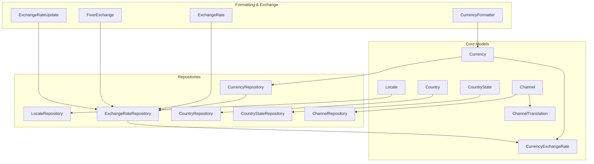
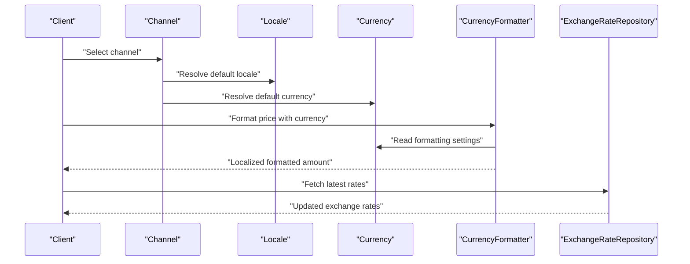
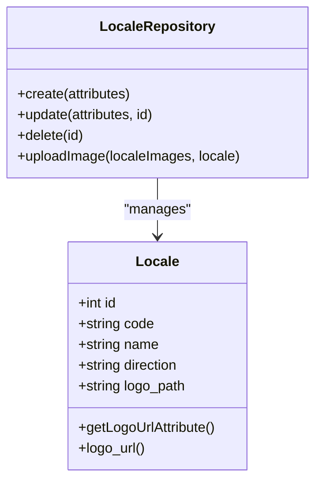
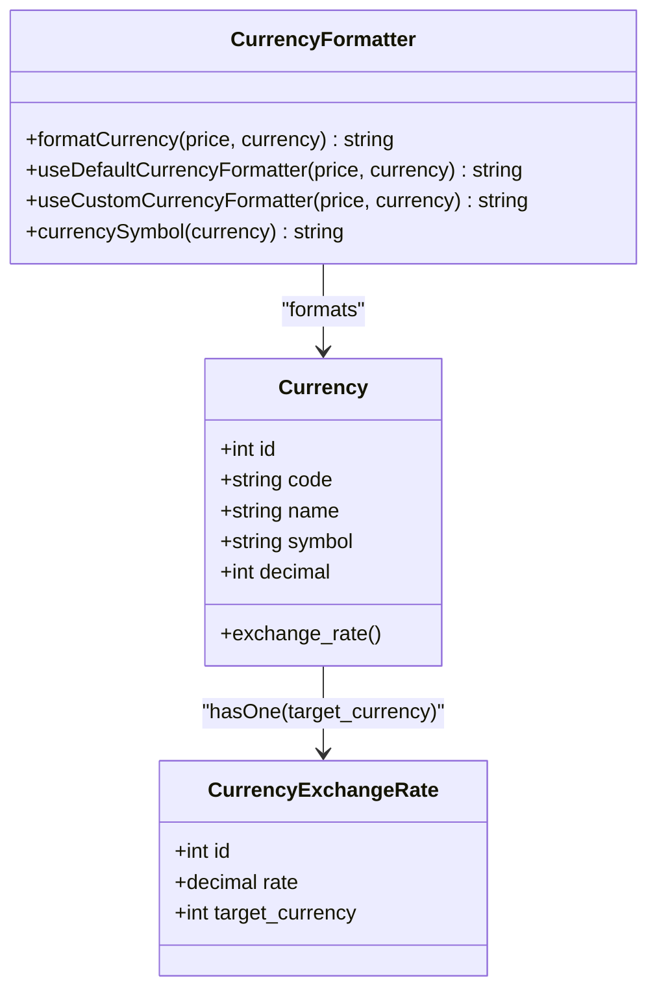
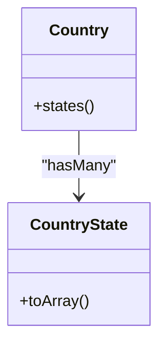
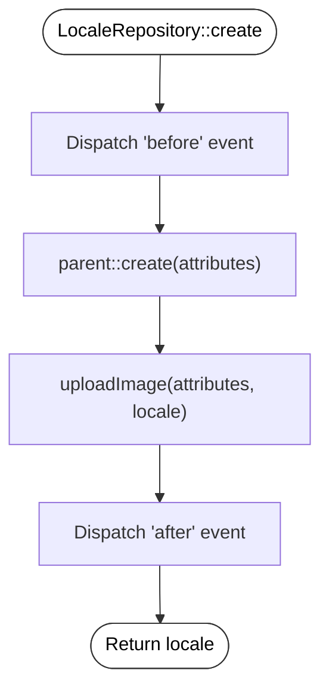
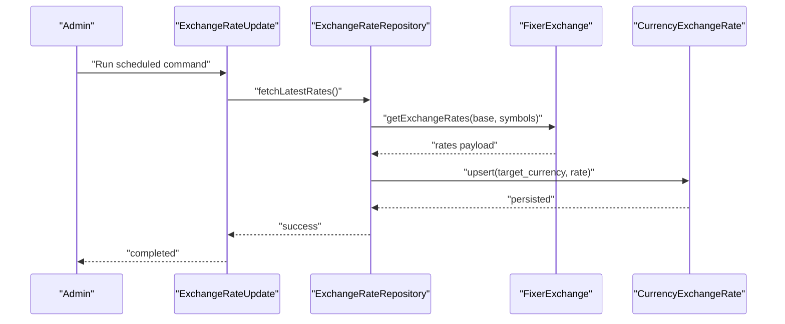
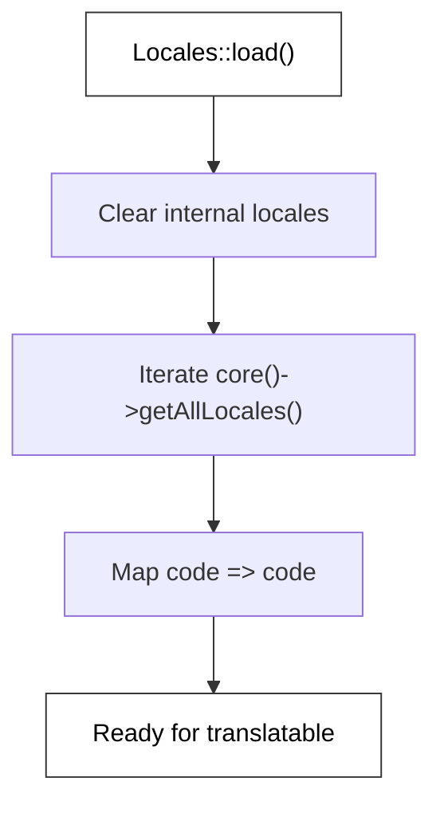
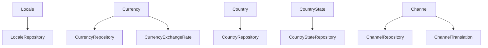
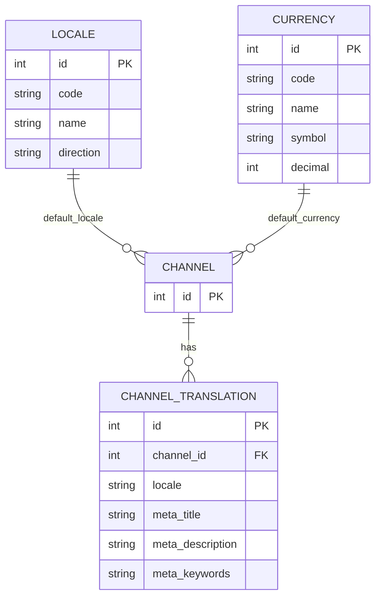

# Locale & Currency System

<cite>
**Referenced Files in This Document**
- [Locale.php](file://packages/Webkul/Core/src/Models/Locale.php)
- [Currency.php](file://packages/Webkul/Core/src/Models/Currency.php)
- [Country.php](file://packages/Webkul/Core/src/Models/Country.php)
- [CountryState.php](file://packages/Webkul/Core/src/Models/CountryState.php)
- [LocaleRepository.php](file://packages/Webkul/Core/src/Repositories/LocaleRepository.php)
- [CurrencyRepository.php](file://packages/Webkul/Core/src/Repositories/CurrencyRepository.php)
- [CountryRepository.php](file://packages/Webkul/Core/src/Repositories/CountryRepository.php)
- [CountryStateRepository.php](file://packages/Webkul/Core/src/Repositories/CountryStateRepository.php)
- [2018_07_10_055143_create_locales_table.php](file://packages/Webkul/Core/src/Database/Migrations/2018_07_10_055143_create_locales_table.php)
- [2018_07_20_054502_create_currencies_table.php](file://packages/Webkul/Core/src/Database/Migrations/2018_07_20_054502_create_currencies_table.php)
- [2018_07_20_054542_create_currency_exchange_rates_table.php](file://packages/Webkul/Core/src/Database/Migrations/2018_07_20_054542_create_currency_exchange_rates_table.php)
- [CurrencyFormatter.php](file://packages/Webkul/Core/src/Concerns/CurrencyFormatter.php)
- [Locales.php](file://packages/Webkul/Core/src/Helpers/Locales.php)
- [helpers.php](file://packages/Webkul/Core/src/Http/helpers.php)
- [ExchangeRateUpdate.php](file://packages/Webkul/Core/src/Console/Commands/ExchangeRateUpdate.php)
- [ExchangeRateRepository.php](file://packages/Webkul/Core/src/Repositories/ExchangeRateRepository.php)
- [ExchangeRate.php](file://packages/Webkul/Core/src/Helpers/Exchange/ExchangeRate.php)
- [FixerExchange.php](file://packages/Webkul/Core/src/Helpers/Exchange/FixerExchange.php)
- [CurrencyExchangeRate.php](file://packages/Webkul/Core/src/Models/CurrencyExchangeRate.php)
- [CurrencyExchangeRateProxy.php](file://packages/Webkul/Core/src/Models/CurrencyExchangeRateProxy.php)
- [Channel.php](file://packages/Webkul/Core/src/Models/Channel.php)
- [ChannelTranslation.php](file://packages/Webkul/Core/src/Models/ChannelTranslation.php)
- [ChannelRepository.php](file://packages/Webkul/Core/src/Repositories/ChannelRepository.php)
- [2018_07_20_064849_create_channels_table.php](file://packages/Webkul/Core/src/Database/Migrations/2018_07_20_064849_create_channels_table.php)
- [2020_12_21_000200_create_channel_translations_table.php](file://packages/Webkul/Core/src/Database/Migrations/2020_12_21_000200_create_channel_translations_table.php)
</cite>

## Table of Contents
1. [Introduction](#introduction)
2. [Project Structure](#project-structure)
3. [Core Components](#core-components)
4. [Architecture Overview](#architecture-overview)
5. [Detailed Component Analysis](#detailed-component-analysis)
6. [Dependency Analysis](#dependency-analysis)
7. [Performance Considerations](#performance-considerations)
8. [Troubleshooting Guide](#troubleshooting-guide)
9. [Conclusion](#conclusion)
10. [Appendices](#appendices)

## Introduction
This document explains Bagisto’s internationalization and currency system within the Core package. It covers:
- Locale model and language directionality (LTR/RTL)
- Currency model, formatting, and exchange rate integration
- Country and CountryState models for address validation and shipping
- Repository implementations for locale and currency management
- Configuration and operational guidance for adding locales/currencies, updating exchange rates, and enabling multi-currency pricing
- The relationship between locales, currencies, and channels

## Project Structure
The Locale and Currency system spans models, repositories, migrations, helpers, and console commands under the Core package. The following diagram shows the primary components and their relationships.

**Diagram sources**
- [Locale.php:12-66](file://packages/Webkul/Core/src/Models/Locale.php#L12-L66)
- [Currency.php:12-55](file://packages/Webkul/Core/src/Models/Currency.php#L12-L55)
- [CurrencyExchangeRate.php](file://packages/Webkul/Core/src/Models/CurrencyExchangeRate.php)
- [Country.php:8-24](file://packages/Webkul/Core/src/Models/Country.php#L8-L24)
- [CountryState.php:8-28](file://packages/Webkul/Core/src/Models/CountryState.php#L8-L28)
- [Channel.php](file://packages/Webkul/Core/src/Models/Channel.php)
- [ChannelTranslation.php](file://packages/Webkul/Core/src/Models/ChannelTranslation.php)
- [LocaleRepository.php:11-109](file://packages/Webkul/Core/src/Repositories/LocaleRepository.php#L11-L109)
- [CurrencyRepository.php:9-74](file://packages/Webkul/Core/src/Repositories/CurrencyRepository.php#L9-L74)
- [ExchangeRateRepository.php](file://packages/Webkul/Core/src/Repositories/ExchangeRateRepository.php)
- [CountryRepository.php:7-17](file://packages/Webkul/Core/src/Repositories/CountryRepository.php#L7-L17)
- [CountryStateRepository.php:7-17](file://packages/Webkul/Core/src/Repositories/CountryStateRepository.php#L7-L17)
- [ChannelRepository.php](file://packages/Webkul/Core/src/Repositories/ChannelRepository.php)
- [CurrencyFormatter.php:8-104](file://packages/Webkul/Core/src/Concerns/CurrencyFormatter.php#L8-L104)
- [ExchangeRate.php](file://packages/Webkul/Core/src/Helpers/Exchange/ExchangeRate.php)
- [FixerExchange.php](file://packages/Webkul/Core/src/Helpers/Exchange/FixerExchange.php)
- [ExchangeRateUpdate.php](file://packages/Webkul/Core/src/Console/Commands/ExchangeRateUpdate.php)

**Section sources**
- [Locale.php:12-66](file://packages/Webkul/Core/src/Models/Locale.php#L12-L66)
- [Currency.php:12-55](file://packages/Webkul/Core/src/Models/Currency.php#L12-L55)
- [Country.php:8-24](file://packages/Webkul/Core/src/Models/Country.php#L8-L24)
- [CountryState.php:8-28](file://packages/Webkul/Core/src/Models/CountryState.php#L8-L28)
- [Channel.php](file://packages/Webkul/Core/src/Models/Channel.php)
- [ChannelTranslation.php](file://packages/Webkul/Core/src/Models/ChannelTranslation.php)

## Core Components
- Locale: Stores language code, display name, and direction (LTR/RTL). Includes a computed logo URL attribute and optional logo path storage.
- Currency: Stores currency metadata (code, name, symbol, decimals, separators, position). Provides a HasOne relation to exchange rates and normalizes currency codes to uppercase.
- Country and CountryState: Translatable models supporting internationalized names and states/provinces.
- CurrencyFormatter: Provides two formatting modes:
  - Default: Uses PHP NumberFormatter with locale-aware currency symbols.
  - Custom: Applies custom separators, decimal places, and symbol placement based on currency settings.
- Exchange Rate Infrastructure: Models, repositories, helpers, and a console command to update exchange rates from external providers.

**Section sources**
- [Locale.php:12-66](file://packages/Webkul/Core/src/Models/Locale.php#L12-L66)
- [Currency.php:12-55](file://packages/Webkul/Core/src/Models/Currency.php#L12-L55)
- [CurrencyFormatter.php:8-104](file://packages/Webkul/Core/src/Concerns/CurrencyFormatter.php#L8-L104)
- [Country.php:8-24](file://packages/Webkul/Core/src/Models/Country.php#L8-L24)
- [CountryState.php:8-28](file://packages/Webkul/Core/src/Models/CountryState.php#L8-L28)

## Architecture Overview
The system integrates locale selection, currency formatting, and exchange rate updates. Channels can be associated with locales and currencies, enabling storefronts to serve localized experiences.

**Diagram sources**
- [Channel.php](file://packages/Webkul/Core/src/Models/Channel.php)
- [ChannelTranslation.php](file://packages/Webkul/Core/src/Models/ChannelTranslation.php)
- [Locale.php:12-66](file://packages/Webkul/Core/src/Models/Locale.php#L12-L66)
- [Currency.php:12-55](file://packages/Webkul/Core/src/Models/Currency.php#L12-L55)
- [CurrencyFormatter.php:8-104](file://packages/Webkul/Core/src/Concerns/CurrencyFormatter.php#L8-L104)
- [ExchangeRateRepository.php](file://packages/Webkul/Core/src/Repositories/ExchangeRateRepository.php)

## Detailed Component Analysis

### Locale Model and Management
- Attributes: code, name, direction (LTR/RTL), and computed logo URL via logo_path.
- Behavior: Normalizes code to uppercase; computes logo URL using storage.
- Repository: Handles creation, update, deletion, and image upload with events and storage cleanup.

**Diagram sources**
- [Locale.php:12-66](file://packages/Webkul/Core/src/Models/Locale.php#L12-L66)
- [LocaleRepository.php:11-109](file://packages/Webkul/Core/src/Repositories/LocaleRepository.php#L11-L109)

**Section sources**
- [Locale.php:12-66](file://packages/Webkul/Core/src/Models/Locale.php#L12-L66)
- [LocaleRepository.php:11-109](file://packages/Webkul/Core/src/Repositories/LocaleRepository.php#L11-L109)
- [2018_07_10_055143_create_locales_table.php:14-23](file://packages/Webkul/Core/src/Database/Migrations/2018_07_10_055143_create_locales_table.php#L14-L23)

### Currency Model, Formatting, and Exchange Rates
- Attributes: code, name, symbol, decimal precision, grouping and decimal separators, currency position.
- Relations: HasOne exchange_rate mapped to CurrencyExchangeRate.
- Formatting modes:
  - Default: Uses NumberFormatter with locale and currency code; respects symbol overrides.
  - Custom: Applies custom separators and symbol placement per CurrencyPositionEnum.
- Exchange Rates: Separate target_currency column with unique constraint; stored as decimal with precision.

**Diagram sources**
- [Currency.php:12-55](file://packages/Webkul/Core/src/Models/Currency.php#L12-L55)
- [CurrencyExchangeRate.php](file://packages/Webkul/Core/src/Models/CurrencyExchangeRate.php)
- [CurrencyFormatter.php:8-104](file://packages/Webkul/Core/src/Concerns/CurrencyFormatter.php#L8-L104)

**Section sources**
- [Currency.php:12-55](file://packages/Webkul/Core/src/Models/Currency.php#L12-L55)
- [CurrencyExchangeRate.php](file://packages/Webkul/Core/src/Models/CurrencyExchangeRate.php)
- [CurrencyFormatter.php:8-104](file://packages/Webkul/Core/src/Concerns/CurrencyFormatter.php#L8-L104)
- [2018_07_20_054502_create_currencies_table.php:14-24](file://packages/Webkul/Core/src/Database/Migrations/2018_07_20_054502_create_currencies_table.php#L14-L24)
- [2018_07_20_054542_create_currency_exchange_rates_table.php:14-22](file://packages/Webkul/Core/src/Database/Migrations/2018_07_20_054542_create_currency_exchange_rates_table.php#L14-L22)

### Country and CountryState Models
- Country: Translatable with states relation.
- CountryState: Translatable with default_name exposure in toArray.

**Diagram sources**
- [Country.php:8-24](file://packages/Webkul/Core/src/Models/Country.php#L8-L24)
- [CountryState.php:8-28](file://packages/Webkul/Core/src/Models/CountryState.php#L8-L28)

**Section sources**
- [Country.php:8-24](file://packages/Webkul/Core/src/Models/Country.php#L8-L24)
- [CountryState.php:8-28](file://packages/Webkul/Core/src/Models/CountryState.php#L8-L28)

### Repository Implementations
- LocaleRepository: Creates, updates, deletes locales; uploads logo images to storage; dispatches events around lifecycle hooks.
- CurrencyRepository: Manages currency CRUD; prevents deletion if only one currency remains; emits events.
- Country/CountryState/Currency repositories: Minimal proxies returning contract classes.

**Diagram sources**
- [LocaleRepository.php:26-37](file://packages/Webkul/Core/src/Repositories/LocaleRepository.php#L26-L37)

**Section sources**
- [LocaleRepository.php:11-109](file://packages/Webkul/Core/src/Repositories/LocaleRepository.php#L11-L109)
- [CurrencyRepository.php:9-74](file://packages/Webkul/Core/src/Repositories/CurrencyRepository.php#L9-L74)
- [CountryRepository.php:7-17](file://packages/Webkul/Core/src/Repositories/CountryRepository.php#L7-L17)
- [CountryStateRepository.php:7-17](file://packages/Webkul/Core/src/Repositories/CountryStateRepository.php#L7-L17)

### Exchange Rate Management
- Models and migrations define exchange rate storage with foreign key to currencies.
- Helpers and repositories encapsulate fetching and updating rates.
- Console command automates periodic updates.

**Diagram sources**
- [ExchangeRateUpdate.php](file://packages/Webkul/Core/src/Console/Commands/ExchangeRateUpdate.php)
- [ExchangeRateRepository.php](file://packages/Webkul/Core/src/Repositories/ExchangeRateRepository.php)
- [FixerExchange.php](file://packages/Webkul/Core/src/Helpers/Exchange/FixerExchange.php)
- [CurrencyExchangeRate.php](file://packages/Webkul/Core/src/Models/CurrencyExchangeRate.php)
- [2018_07_20_054542_create_currency_exchange_rates_table.php:14-22](file://packages/Webkul/Core/src/Database/Migrations/2018_07_20_054542_create_currency_exchange_rates_table.php#L14-L22)

**Section sources**
- [ExchangeRateRepository.php](file://packages/Webkul/Core/src/Repositories/ExchangeRateRepository.php)
- [ExchangeRateUpdate.php](file://packages/Webkul/Core/src/Console/Commands/ExchangeRateUpdate.php)
- [FixerExchange.php](file://packages/Webkul/Core/src/Helpers/Exchange/FixerExchange.php)
- [CurrencyExchangeRate.php](file://packages/Webkul/Core/src/Models/CurrencyExchangeRate.php)

### Locale Helper and Translation Integration
- Locales helper extends translatable locales and builds a code-to-code mapping from core()->getAllLocales().
- HTTP helpers expose core() facade and other utilities.

**Diagram sources**
- [Locales.php:7-21](file://packages/Webkul/Core/src/Helpers/Locales.php#L7-L21)

**Section sources**
- [Locales.php:7-21](file://packages/Webkul/Core/src/Helpers/Locales.php#L7-L21)
- [helpers.php:11-21](file://packages/Webkul/Core/src/Http/helpers.php#L11-L21)

## Dependency Analysis
- Locale depends on storage for logo URLs and is managed by LocaleRepository.
- Currency depends on exchange rates via HasOne and formatting via CurrencyFormatter.
- Country and CountryState depend on translatable traits and are managed by dedicated repositories.
- Channels associate locales and currencies; translations enable localized channel metadata.

**Diagram sources**
- [LocaleRepository.php:11-19](file://packages/Webkul/Core/src/Repositories/LocaleRepository.php#L11-L19)
- [CurrencyRepository.php:9-17](file://packages/Webkul/Core/src/Repositories/CurrencyRepository.php#L9-L17)
- [CountryRepository.php:7-15](file://packages/Webkul/Core/src/Repositories/CountryRepository.php#L7-L15)
- [CountryStateRepository.php:7-15](file://packages/Webkul/Core/src/Repositories/CountryStateRepository.php#L7-L15)
- [ChannelRepository.php](file://packages/Webkul/Core/src/Repositories/ChannelRepository.php)
- [ChannelTranslation.php](file://packages/Webkul/Core/src/Models/ChannelTranslation.php)

**Section sources**
- [Channel.php](file://packages/Webkul/Core/src/Models/Channel.php)
- [ChannelTranslation.php](file://packages/Webkul/Core/src/Models/ChannelTranslation.php)

## Performance Considerations
- Currency formatting:
  - Prefer custom formatting only when locale defaults are insufficient; default NumberFormatter leverages system locales efficiently.
  - Minimize repeated NumberFormatter instantiation; reuse where possible.
- Exchange rates:
  - Cache fetched rates and refresh periodically via the ExchangeRateUpdate command.
  - Batch upsert operations to reduce database round-trips.
- Locale logos:
  - Store optimized images and leverage CDN for logo delivery.
- Translations:
  - Keep locale lists small and cached; avoid frequent reinitialization.

## Troubleshooting Guide
- Currency symbol mismatch:
  - Use currencySymbol() to derive the correct symbol for a given currency code and locale; fallback to code if symbol is missing.
- Formatting anomalies:
  - Verify decimal and group separator settings; ensure currency_position aligns with regional expectations.
- Exchange rate updates failing:
  - Confirm provider credentials and network connectivity; check logs for exceptions during provider fetch.
- Locale deletion errors:
  - Ensure at least one locale exists; repository prevents removal if count equals one.

**Section sources**
- [CurrencyFormatter.php:95-102](file://packages/Webkul/Core/src/Concerns/CurrencyFormatter.php#L95-L102)
- [CurrencyRepository.php:61-63](file://packages/Webkul/Core/src/Repositories/CurrencyRepository.php#L61-L63)
- [ExchangeRateUpdate.php](file://packages/Webkul/Core/src/Console/Commands/ExchangeRateUpdate.php)

## Conclusion
Bagisto’s Core package provides a robust foundation for internationalization and currency handling. The Locale model supports LTR/RTL and optional branding, while the Currency model and CurrencyFormatter deliver flexible localization. Country and CountryState models enable accurate address handling. Exchange rate infrastructure and repositories streamline dynamic rate updates. Channels tie locales and currencies together for a cohesive storefront experience.

## Appendices

### A. Adding New Locales and Currencies
- Add locales:
  - Seed or create via LocaleRepository; ensure direction is set appropriately.
  - Upload locale logo via uploadImage; logo_path is stored and logo_url is computed.
- Add currencies:
  - Create via CurrencyRepository; set symbol, decimal, separators, and currency_position.
  - Define exchange rates via ExchangeRateRepository or console command.

**Section sources**
- [LocaleRepository.php:26-37](file://packages/Webkul/Core/src/Repositories/LocaleRepository.php#L26-L37)
- [CurrencyRepository.php:24-33](file://packages/Webkul/Core/src/Repositories/CurrencyRepository.php#L24-L33)
- [ExchangeRateUpdate.php](file://packages/Webkul/Core/src/Console/Commands/ExchangeRateUpdate.php)

### B. Multi-Currency Pricing and Switching
- Enable multi-currency:
  - Maintain multiple Currency records; set exchange rates for conversions.
  - Use CurrencyFormatter to render prices in the selected currency.
- Switching:
  - Change channel default currency or user-selected currency; reformat prices accordingly.

**Section sources**
- [CurrencyFormatter.php:13-20](file://packages/Webkul/Core/src/Concerns/CurrencyFormatter.php#L13-L20)
- [Channel.php](file://packages/Webkul/Core/src/Models/Channel.php)

### C. Relationship Between Locales, Currencies, and Channels
- Channels can be configured with default locales and currencies.
- Channel translations provide localized metadata.
- Locale direction influences layout rendering; currency settings influence number formatting.

**Diagram sources**
- [2018_07_10_055143_create_locales_table.php:14-23](file://packages/Webkul/Core/src/Database/Migrations/2018_07_10_055143_create_locales_table.php#L14-L23)
- [2018_07_20_054502_create_currencies_table.php:14-24](file://packages/Webkul/Core/src/Database/Migrations/2018_07_20_054502_create_currencies_table.php#L14-L24)
- [2018_07_20_064849_create_channels_table.php](file://packages/Webkul/Core/src/Database/Migrations/2018_07_20_064849_create_channels_table.php)
- [2020_12_21_000200_create_channel_translations_table.php](file://packages/Webkul/Core/src/Database/Migrations/2020_12_21_000200_create_channel_translations_table.php)