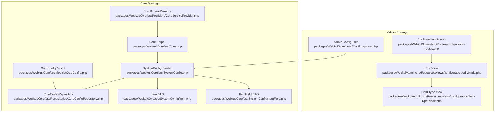
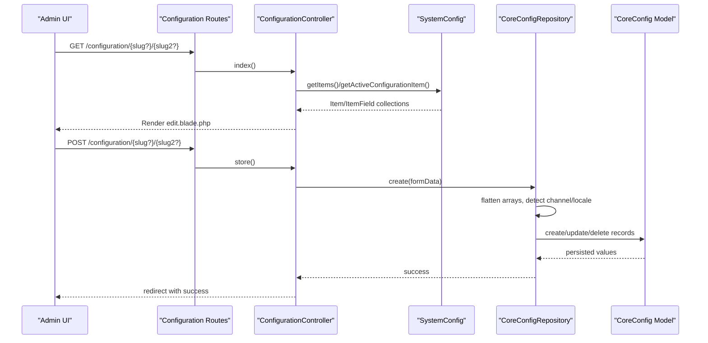
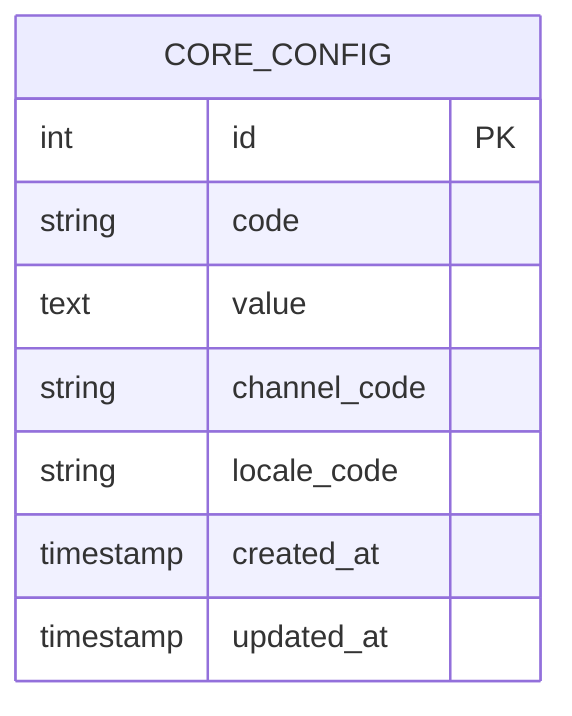
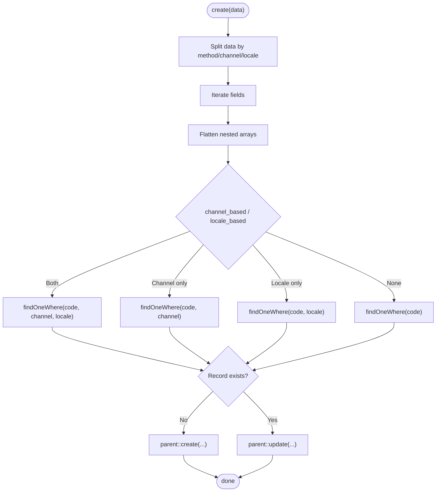
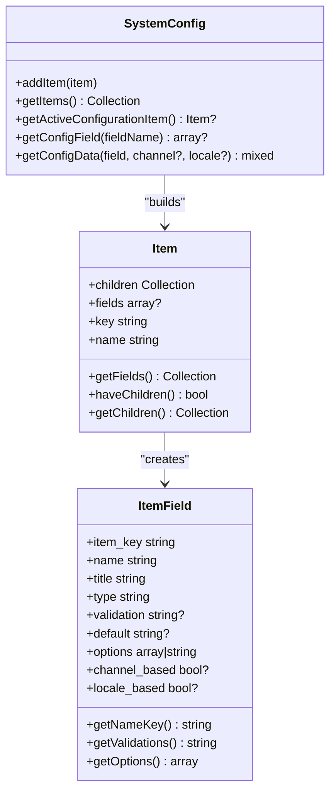
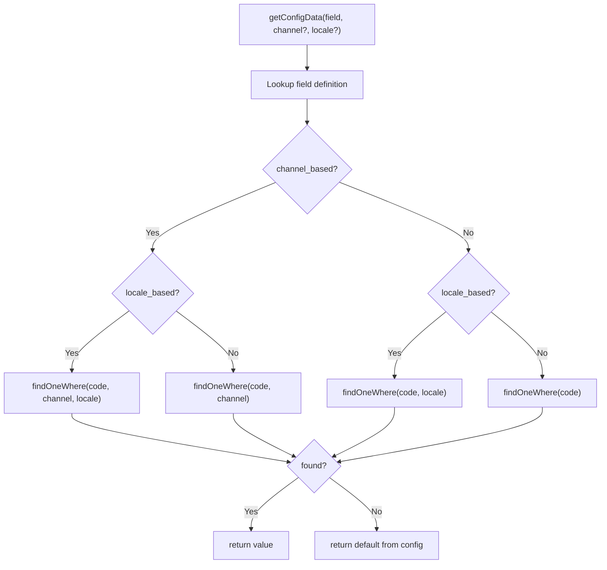
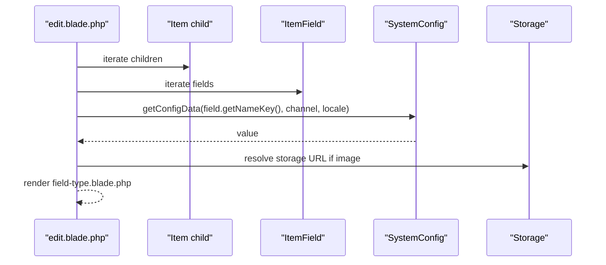
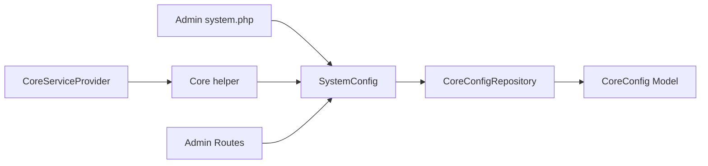

# System Configuration

<cite>
**Referenced Files in This Document**
- [CoreConfig.php](file://packages/Webkul/Core/src/Models/CoreConfig.php)
- [CoreConfigRepository.php](file://packages/Webkul/Core/src/Repositories/CoreConfigRepository.php)
- [SystemConfig.php](file://packages/Webkul/Core/src/SystemConfig.php)
- [Item.php](file://packages/Webkul/Core/src/SystemConfig/Item.php)
- [ItemField.php](file://packages/Webkul/Core/src/SystemConfig/ItemField.php)
- [system.php](file://packages/Webkul/Admin/src/Config/system.php)
- [2018_09_20_060658_create_core_config_table.php](file://packages/Webkul/Core/src/Database/Migrations/2018_09_20_060658_create_core_config_table.php)
- [Core.php](file://packages/Webkul/Core/src/Core.php)
- [configuration-routes.php](file://packages/Webkul/Admin/src/Routes/configuration-routes.php)
- [edit.blade.php](file://packages/Webkul/Admin/src/Resources/views/configuration/edit.blade.php)
- [field-type.blade.php](file://packages/Webkul/Admin/src/Resources/views/configuration/field-type.blade.php)
- [SystemConfig Facade](file://packages/Webkul/Core/src/Facades/SystemConfig.php)
- [CoreServiceProvider.php](file://packages/Webkul/Core/src/Providers/CoreServiceProvider.php)
</cite>

## Table of Contents
1. [Introduction](#introduction)
2. [Project Structure](#project-structure)
3. [Core Components](#core-components)
4. [Architecture Overview](#architecture-overview)
5. [Detailed Component Analysis](#detailed-component-analysis)
6. [Dependency Analysis](#dependency-analysis)
7. [Performance Considerations](#performance-considerations)
8. [Troubleshooting Guide](#troubleshooting-guide)
9. [Conclusion](#conclusion)
10. [Appendices](#appendices)

## Introduction
This document explains the System Configuration system in Bagisto’s Core package. It covers how application settings are modeled, persisted, and rendered into dynamic configuration forms. It details the hierarchical configuration structure with scopes (default, channel, locale), field types, and validation rules. It also describes how to extend the configuration system by adding new sections and fields, and how configuration inheritance works via channel and locale scoping.

## Project Structure
The System Configuration system spans several layers:
- Data model and persistence: CoreConfig model and core_config table
- Repository for CRUD and search: CoreConfigRepository
- Runtime configuration builder and accessor: SystemConfig, Item, ItemField
- Configuration definition: Admin module’s system.php configuration tree
- Presentation: Admin views and routes for rendering and saving configuration
- Integration: Core helper methods and service provider scheduling hooks

**Diagram sources**
- [CoreConfig.php:11-48](file://packages/Webkul/Core/src/Models/CoreConfig.php#L11-L48)
- [CoreConfigRepository.php:12-240](file://packages/Webkul/Core/src/Repositories/CoreConfigRepository.php#L12-L240)
- [SystemConfig.php:12-233](file://packages/Webkul/Core/src/SystemConfig.php#L12-L233)
- [Item.php:7-132](file://packages/Webkul/Core/src/SystemConfig/Item.php#L7-L132)
- [ItemField.php:7-256](file://packages/Webkul/Core/src/SystemConfig/ItemField.php#L7-L256)
- [Core.php:656-804](file://packages/Webkul/Core/src/Core.php#L656-L804)
- [CoreServiceProvider.php:83-104](file://packages/Webkul/Core/src/Providers/CoreServiceProvider.php#L83-L104)
- [system.php:1-2984](file://packages/Webkul/Admin/src/Config/system.php#L1-L2984)
- [configuration-routes.php:15-21](file://packages/Webkul/Admin/src/Routes/configuration-routes.php#L15-L21)
- [edit.blade.php:125-152](file://packages/Webkul/Admin/src/Resources/views/configuration/edit.blade.php#L125-L152)
- [field-type.blade.php:1-45](file://packages/Webkul/Admin/src/Resources/views/configuration/field-type.blade.php#L1-L45)

**Section sources**
- [CoreConfig.php:11-48](file://packages/Webkul/Core/src/Models/CoreConfig.php#L11-L48)
- [CoreConfigRepository.php:12-240](file://packages/Webkul/Core/src/Repositories/CoreConfigRepository.php#L12-L240)
- [SystemConfig.php:12-233](file://packages/Webkul/Core/src/SystemConfig.php#L12-L233)
- [Item.php:7-132](file://packages/Webkul/Core/src/SystemConfig/Item.php#L7-L132)
- [ItemField.php:7-256](file://packages/Webkul/Core/src/SystemConfig/ItemField.php#L7-L256)
- [system.php:1-2984](file://packages/Webkul/Admin/src/Config/system.php#L1-L2984)
- [2018_09_20_060658_create_core_config_table.php:16-23](file://packages/Webkul/Core/src/Database/Migrations/2018_09_20_060658_create_core_config_table.php#L16-L23)
- [Core.php:656-804](file://packages/Webkul/Core/src/Core.php#L656-L804)
- [configuration-routes.php:15-21](file://packages/Webkul/Admin/src/Routes/configuration-routes.php#L15-L21)
- [edit.blade.php:125-152](file://packages/Webkul/Admin/src/Resources/views/configuration/edit.blade.php#L125-L152)
- [field-type.blade.php:1-45](file://packages/Webkul/Admin/src/Resources/views/configuration/field-type.blade.php#L1-L45)
- [SystemConfig Facade:8-19](file://packages/Webkul/Core/src/Facades/SystemConfig.php#L8-L19)
- [CoreServiceProvider.php:83-104](file://packages/Webkul/Core/src/Providers/CoreServiceProvider.php#L83-L104)

## Core Components
- CoreConfig model: Represents a persisted configuration record with code, value, and optional channel/locale scoping.
- CoreConfigRepository: Handles creation/updating/deletion of configuration entries, array flattening, file uploads, and search indexing.
- SystemConfig: Builds the configuration tree from the Admin config definition, exposes getters for active item and fields, and resolves values with inheritance.
- Item and ItemField: Lightweight DTOs that represent a configuration section and a single field respectively, including metadata, validation, and options.
- Admin system.php: Defines the hierarchical configuration categories, subcategories, and fields with type, defaults, visibility, and scoping flags.
- Views and routes: Render the configuration UI and persist changes.

**Section sources**
- [CoreConfig.php:11-48](file://packages/Webkul/Core/src/Models/CoreConfig.php#L11-L48)
- [CoreConfigRepository.php:25-116](file://packages/Webkul/Core/src/Repositories/CoreConfigRepository.php#L25-L116)
- [SystemConfig.php:29-88](file://packages/Webkul/Core/src/SystemConfig.php#L29-L88)
- [Item.php:12-62](file://packages/Webkul/Core/src/SystemConfig/Item.php#L12-L62)
- [ItemField.php:29-46](file://packages/Webkul/Core/src/SystemConfig/ItemField.php#L29-L46)
- [system.php:11-542](file://packages/Webkul/Admin/src/Config/system.php#L11-L542)

## Architecture Overview
The configuration system follows a layered architecture:
- Definition layer: Admin system.php defines the structure and fields.
- Builder layer: SystemConfig reads the definition and constructs Item/ItemField objects.
- Persistence layer: CoreConfigRepository persists values to core_config with scoping.
- Accessor layer: Core helper methods delegate to SystemConfig to resolve effective values.
- Presentation layer: Admin routes and views render forms and submit updates.

**Diagram sources**
- [configuration-routes.php:15-21](file://packages/Webkul/Admin/src/Routes/configuration-routes.php#L15-L21)
- [edit.blade.php:125-152](file://packages/Webkul/Admin/src/Resources/views/configuration/edit.blade.php#L125-L152)
- [field-type.blade.php:1-45](file://packages/Webkul/Admin/src/Resources/views/configuration/field-type.blade.php#L1-L45)
- [SystemConfig.php:37-88](file://packages/Webkul/Core/src/SystemConfig.php#L37-L88)
- [CoreConfigRepository.php:25-116](file://packages/Webkul/Core/src/Repositories/CoreConfigRepository.php#L25-L116)
- [CoreConfig.php:11-48](file://packages/Webkul/Core/src/Models/CoreConfig.php#L11-L48)

## Detailed Component Analysis

### CoreConfig Model and Table
- Purpose: Persist a single configuration value identified by code, optionally scoped to channel and/or locale.
- Attributes:
  - code: dot-notation key (e.g., general.content.header_offer.title)
  - value: serialized or string value
  - channel_code: nullable channel identifier
  - locale_code: nullable locale identifier
- Scoping: Allows per-channel and per-locale overrides of global defaults.

**Diagram sources**
- [2018_09_20_060658_create_core_config_table.php:16-23](file://packages/Webkul/Core/src/Database/Migrations/2018_09_20_060658_create_core_config_table.php#L16-L23)
- [CoreConfig.php:20-39](file://packages/Webkul/Core/src/Models/CoreConfig.php#L20-L39)

**Section sources**
- [CoreConfig.php:11-48](file://packages/Webkul/Core/src/Models/CoreConfig.php#L11-L48)
- [2018_09_20_060658_create_core_config_table.php:16-23](file://packages/Webkul/Core/src/Database/Migrations/2018_09_20_060658_create_core_config_table.php#L16-L23)

### CoreConfigRepository
- Responsibilities:
  - Create/update configuration entries from nested form data.
  - Flatten multi-dimensional arrays into dot-notation keys.
  - Handle file uploads and replace stored paths.
  - Support channel/locale scoping queries.
  - Search configuration items by translated titles.
- Key behaviors:
  - Detects channel_based and locale_based flags from field definitions.
  - Converts array-typed field values to comma-separated strings.
  - Emits events around save lifecycle.

**Diagram sources**
- [CoreConfigRepository.php:25-116](file://packages/Webkul/Core/src/Repositories/CoreConfigRepository.php#L25-L116)

**Section sources**
- [CoreConfigRepository.php:12-240](file://packages/Webkul/Core/src/Repositories/CoreConfigRepository.php#L12-L240)

### SystemConfig, Item, and ItemField
- SystemConfig:
  - Loads configuration definition from Admin system.php.
  - Builds a sorted collection of Item nodes with children and fields.
  - Resolves active configuration item from request slugs.
  - Retrieves effective values with channel/locale inheritance.
  - Provides getConfigField lookup by full key.
- Item:
  - Holds metadata (key, name, info, icon, route, sort).
  - Converts raw field definitions into ItemField objects.
  - Supports child navigation and visibility checks.
- ItemField:
  - Encapsulates field metadata: type, validation, default, options, depends, placeholders.
  - Generates form-friendly names and validation strings.
  - Resolves option lists either statically or via callback.

**Diagram sources**
- [SystemConfig.php:29-136](file://packages/Webkul/Core/src/SystemConfig.php#L29-L136)
- [Item.php:12-62](file://packages/Webkul/Core/src/SystemConfig/Item.php#L12-L62)
- [ItemField.php:29-114](file://packages/Webkul/Core/src/SystemConfig/ItemField.php#L29-L114)

**Section sources**
- [SystemConfig.php:29-233](file://packages/Webkul/Core/src/SystemConfig.php#L29-L233)
- [Item.php:12-132](file://packages/Webkul/Core/src/SystemConfig/Item.php#L12-L132)
- [ItemField.php:29-256](file://packages/Webkul/Core/src/SystemConfig/ItemField.php#L29-L256)

### Configuration Categories, Field Types, and Validation
- Categories and subcategories are defined in Admin system.php with keys forming hierarchical dot notation.
- Fields support multiple types (e.g., boolean, text, textarea, select, image, password, editor, blade).
- Validation rules are mapped from Laravel-style rules to frontend validation library equivalents.
- Options can be static arrays or resolved via a callable [class@method].
- Depends allows conditional visibility based on another field’s value.

Examples present in the Admin configuration tree include:
- General → General → Unit Options: select with channel-based scoping
- General → Content → Header Offer: text fields with validation
- General → Design → Admin Logo: image fields with MIME validation
- General → GDPR: extensive boolean and editor fields with locale-based scoping

**Section sources**
- [system.php:27-101](file://packages/Webkul/Admin/src/Config/system.php#L27-L101)
- [system.php:224-238](file://packages/Webkul/Admin/src/Config/system.php#L224-L238)
- [system.php:402-441](file://packages/Webkul/Admin/src/Config/system.php#L402-L441)
- [ItemField.php:105-114](file://packages/Webkul/Core/src/SystemConfig/ItemField.php#L105-L114)

### Configuration Inheritance and Resolution
- Effective value resolution considers channel and locale scoping:
  - If a channel-based field is requested, look for a record matching code + channel + locale.
  - If locale-based, match code + locale (ignoring channel).
  - Otherwise match code globally.
- If no record is found, the default value from configuration is returned.

**Diagram sources**
- [SystemConfig.php:163-232](file://packages/Webkul/Core/src/SystemConfig.php#L163-L232)
- [Core.php:656-659](file://packages/Webkul/Core/src/Core.php#L656-L659)

**Section sources**
- [SystemConfig.php:163-232](file://packages/Webkul/Core/src/SystemConfig.php#L163-L232)
- [Core.php:656-659](file://packages/Webkul/Core/src/Core.php#L656-L659)

### Rendering Dynamic Forms
- The Admin edit view iterates over active configuration children and fields.
- For each field, it renders a specialized component or includes a reusable field-type template.
- The field-type template binds field metadata, validation, and current value resolved from SystemConfig.

**Diagram sources**
- [edit.blade.php:125-152](file://packages/Webkul/Admin/src/Resources/views/configuration/edit.blade.php#L125-L152)
- [field-type.blade.php:1-45](file://packages/Webkul/Admin/src/Resources/views/configuration/field-type.blade.php#L1-L45)
- [SystemConfig.php:215-232](file://packages/Webkul/Core/src/SystemConfig.php#L215-L232)

**Section sources**
- [edit.blade.php:125-152](file://packages/Webkul/Admin/src/Resources/views/configuration/edit.blade.php#L125-L152)
- [field-type.blade.php:1-45](file://packages/Webkul/Admin/src/Resources/views/configuration/field-type.blade.php#L1-L45)

### Extending the Configuration System
- Add a new section:
  - Define a new top-level or nested key in Admin system.php with metadata (name, info, icon, sort).
  - Optionally define fields with type, default, validation, options, depends, and scoping flags.
- Add a new field:
  - Append to an existing section’s fields array with a unique name under the section key.
  - Use appropriate type and validation rules.
- Implement custom settings management:
  - Use core()->getConfigData('your.section.field') to read values anywhere in the application.
  - Use system_config()->getConfigField('your.section.field') to introspect field metadata.
  - Leverage depends and options callbacks to drive dynamic UI behavior.

Practical examples from the Admin configuration tree:
- New boolean field under general.content.speculation_rules
- New select field under general.design.categories
- New image fields under general.design.admin_logo with MIME validation

**Section sources**
- [system.php:107-192](file://packages/Webkul/Admin/src/Config/system.php#L107-L192)
- [system.php:240-266](file://packages/Webkul/Admin/src/Config/system.php#L240-L266)
- [system.php:224-238](file://packages/Webkul/Admin/src/Config/system.php#L224-L238)
- [Core.php:656-804](file://packages/Webkul/Core/src/Core.php#L656-L804)
- [SystemConfig.php:141-158](file://packages/Webkul/Core/src/SystemConfig.php#L141-L158)

## Dependency Analysis
- SystemConfig depends on:
  - Admin system.php for configuration definitions
  - CoreConfigRepository for persistence and lookup
  - Core helper for channel/locale resolution
- Core helper delegates to SystemConfig for value retrieval and field introspection.
- Admin routes depend on SystemConfig to determine active configuration and render forms.
- CoreServiceProvider conditionally schedules tasks based on configuration values.

**Diagram sources**
- [system.php:1-20](file://packages/Webkul/Admin/src/Config/system.php#L1-L20)
- [SystemConfig.php:64-88](file://packages/Webkul/Core/src/SystemConfig.php#L64-L88)
- [CoreConfigRepository.php:12-20](file://packages/Webkul/Core/src/Repositories/CoreConfigRepository.php#L12-L20)
- [Core.php:656-659](file://packages/Webkul/Core/src/Core.php#L656-L659)
- [configuration-routes.php:15-21](file://packages/Webkul/Admin/src/Routes/configuration-routes.php#L15-L21)
- [CoreServiceProvider.php:83-104](file://packages/Webkul/Core/src/Providers/CoreServiceProvider.php#L83-L104)

**Section sources**
- [SystemConfig.php:64-136](file://packages/Webkul/Core/src/SystemConfig.php#L64-L136)
- [CoreConfigRepository.php:12-20](file://packages/Webkul/Core/src/Repositories/CoreConfigRepository.php#L12-L20)
- [Core.php:656-804](file://packages/Webkul/Core/src/Core.php#L656-L804)
- [configuration-routes.php:15-21](file://packages/Webkul/Admin/src/Routes/configuration-routes.php#L15-L21)
- [CoreServiceProvider.php:83-104](file://packages/Webkul/Core/src/Providers/CoreServiceProvider.php#L83-L104)

## Performance Considerations
- Minimize repeated lookups: Cache effective values per request where feasible.
- Prefer batched queries: If rendering many fields, fetch values in bulk using repository methods.
- Avoid excessive file uploads: Validate and limit file sizes early; leverage storage URLs instead of large inline data.
- Use scoping judiciously: Limit channel/locale combinations to reduce query permutations.

## Troubleshooting Guide
- Values not applying by channel/locale:
  - Verify channel_based and locale_based flags in the field definition.
  - Confirm the current channel and locale codes passed to getConfigData.
- Validation not enforced:
  - Ensure validation strings are properly mapped in ItemField.
  - Check depends expressions are correctly formatted (e.g., enabled:true).
- Images not updating:
  - Confirm file upload handling and storage path replacement logic.
  - Ensure delete flag is handled when replacing files.
- Configuration not visible:
  - Check sort order and key hierarchy in system.php.
  - Ensure translation keys exist for name/info.

**Section sources**
- [SystemConfig.php:163-232](file://packages/Webkul/Core/src/SystemConfig.php#L163-L232)
- [CoreConfigRepository.php:83-111](file://packages/Webkul/Core/src/Repositories/CoreConfigRepository.php#L83-L111)
- [ItemField.php:105-114](file://packages/Webkul/Core/src/SystemConfig/ItemField.php#L105-L114)

## Conclusion
Bagisto’s System Configuration system provides a robust, extensible mechanism for managing application-wide settings with hierarchical organization, flexible scoping, and dynamic form rendering. By defining configuration in Admin system.php and leveraging SystemConfig, Item, and ItemField, developers can introduce new sections and fields with minimal effort while maintaining strong typing, validation, and inheritance semantics.

## Appendices

### Practical Examples Index
- Creating a custom configuration section:
  - Add a new top-level key in Admin system.php with name, info, sort, and optional fields.
- Adding a new configuration field:
  - Append to an existing section’s fields array with type, default, validation, and scoping flags.
- Implementing configuration inheritance:
  - Use channel_based and locale_based flags; SystemConfig resolves values accordingly.
- Integrating with other core components:
  - Use core()->getConfigData(...) to read settings in controllers, jobs, or listeners.
  - Schedule tasks based on configuration values via CoreServiceProvider.

**Section sources**
- [system.php:11-542](file://packages/Webkul/Admin/src/Config/system.php#L11-L542)
- [Core.php:656-804](file://packages/Webkul/Core/src/Core.php#L656-L804)
- [CoreServiceProvider.php:83-104](file://packages/Webkul/Core/src/Providers/CoreServiceProvider.php#L83-L104)