# Address Book & Wishlist Management

<cite>
**Referenced Files in This Document**
- [packages/Webkul/Core/src/Models/Address.php](file://packages/Webkul/Core/src/Models/Address.php)
- [packages/Webkul/Customer/src/Models/CustomerAddress.php](file://packages/Webkul/Customer/src/Models/CustomerAddress.php)
- [packages/Webkul/Checkout/src/Models/CartAddress.php](file://packages/Webkul/Checkout/src/Models/CartAddress.php)
- [packages/Webkul/Customer/src/Models/Wishlist.php](file://packages/Webkul/Customer/src/Models/Wishlist.php)
- [packages/Webkul/Shop/src/Http/Controllers/API/WishlistController.php](file://packages/Webkul/Shop/src/Http/Controllers/API/WishlistController.php)
- [packages/Webkul/Admin/src/Http/Controllers/Customers/Customer/WishlistController.php](file://packages/Webkul/Admin/src/Http/Controllers/Customers/Customer/WishlistController.php)
- [packages/Webkul/Shop/src/Resources/views/checkout/onepage/address/customer.blade.php](file://packages/Webkul/Shop/src/Resources/views/checkout/onepage/address/customer.blade.php)
- [packages/Webkul/Admin/src/Resources/views/sales/orders/create/cart/address.blade.php](file://packages/Webkul/Admin/src/Resources/views/sales/orders/create/cart/address.blade.php)
- [packages/Webkul/Admin/src/Resources/views/customers/customers/view.blade.php](file://packages/Webkul/Admin/src/Resources/views/customers/customers/view.blade.php)
- [packages/Webkul/Admin/src/Resources/views/customers/customers/view/address/create.blade.php](file://packages/Webkul/Admin/src/Resources/views/customers/customers/view/address/create.blade.php)
- [packages/Webkul/Admin/src/Resources/views/customers/customers/view/address/edit.blade.php](file://packages/Webkul/Admin/src/Resources/views/customers/customers/view/address/edit.blade.php)
- [packages/Webkul/Shop/src/Resources/views/customers/account/wishlist/index.blade.php](file://packages/Webkul/Shop/src/Resources/views/customers/account/wishlist/index.blade.php)
- [packages/Webkul/Admin/src/Resources/views/sales/orders/create/wishlist-items.blade.php](file://packages/Webkul/Admin/src/Resources/views/sales/orders/create/wishlist-items.blade.php)
- [packages/Webkul/Shop/src/Resources/assets/js/plugins/vee-validate.js](file://packages/Webkul/Shop/src/Resources/assets/js/plugins/vee-validate.js)
- [packages/Webkul/Admin/src/Resources/assets/js/plugins/vee-validate.js](file://packages/Webkul/Admin/src/Resources/assets/js/plugins/vee-validate.js)
- [packages/Webkul/Shop/src/Data/postal-code.json](file://packages/Webkul/Shop/src/Data/postal-code.json)
- [packages/Webkul/Customer/src/Database/Migrations/2023_05_26_213105_create_wishlist_items_table.php](file://packages/Webkul/Customer/src/Database/Migrations/2023_05_26_213105_create_wishlist_items_table.php)
- [packages/Webkul/Customer/src/Database/Migrations/2018_10_03_025230_create_wishlist_table.php](file://packages/Webkul/Customer/src/Database/Migrations/2018_10_03_025230_create_wishlist_table.php)
- [packages/Webkul/Admin/tests/e2e-pw/tests/customers/customers.spec.ts](file://packages/Webkul/Admin/tests/e2e-pw/tests/customers/customers.spec.ts)
- [packages/Webkul/Shop/tests/e2e-pw/tests/customer.spec.ts](file://packages/Webkul/Shop/tests/e2e-pw/tests/customer.spec.ts)
- [packages/Webkul/Admin/tests/e2e-pw/tests/sales.spec.ts](file://packages/Webkul/Admin/tests/e2e-pw/tests/sales.spec.ts)
- [packages/Webkul/Admin/tests/e2e-pw/tests/configuration/customer/address.spec.ts](file://packages/Webkul/Admin/tests/e2e-pw/tests/configuration/customer/address.spec.ts)
- [packages/Webkul/Admin/tests/e2e-pw/tests/configuration/customer/settings.spec.ts](file://packages/Webkul/Admin/tests/e2e-pw/tests/configuration/customer/settings.spec.ts)
- [packages/Webkul/Admin/tests/e2e-pw/utils/address.ts](file://packages/Webkul/Admin/tests/e2e-pw/utils/address.ts)
- [packages/Webkul/Admin/tests/e2e-pw/utils/data-transfer.ts](file://packages/Webkul/Admin/tests/e2e-pw/utils/data-transfer.ts)
- [packages/Webkul/Admin/src/Routes/settings-routes.php](file://packages/Webkul/Admin/src/Routes/settings-routes.php)
- [storage/app/public/.gitignore](file://storage/app/public/.gitignore)
</cite>

## Table of Contents
1. [Introduction](#introduction)
2. [Project Structure](#project-structure)
3. [Core Components](#core-components)
4. [Architecture Overview](#architecture-overview)
5. [Detailed Component Analysis](#detailed-component-analysis)
6. [Dependency Analysis](#dependency-analysis)
7. [Performance Considerations](#performance-considerations)
8. [Troubleshooting Guide](#troubleshooting-guide)
9. [Conclusion](#conclusion)
10. [Appendices](#appendices)

## Introduction
This document explains the address book and wishlist management systems in the codebase. It covers:
- Address book: storing multiple addresses, selecting a default address, validation, and handling billing vs shipping addresses during checkout.
- Internationalization support via postal code patterns and validation rules.
- Wishlist: saving products, moving items to cart, bulk removal, sharing flags, and admin integration for order creation.
- Address-based shipping considerations and administrative import/export capabilities for data transfer.

## Project Structure
Key modules involved:
- Core address model and customer-specific address model
- Checkout cart address model for billing/shipping
- Customer wishlist model and repositories/controllers
- Frontend templates and validation plugins
- Admin and Shop E2E tests validating behavior

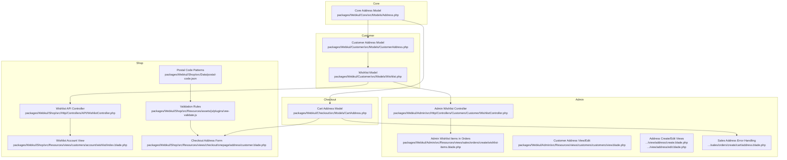

**Diagram sources**
- [packages/Webkul/Core/src/Models/Address.php:1-56](file://packages/Webkul/Core/src/Models/Address.php#L1-L56)
- [packages/Webkul/Customer/src/Models/CustomerAddress.php:1-50](file://packages/Webkul/Customer/src/Models/CustomerAddress.php#L1-L50)
- [packages/Webkul/Checkout/src/Models/CartAddress.php:1-81](file://packages/Webkul/Checkout/src/Models/CartAddress.php#L1-L81)
- [packages/Webkul/Customer/src/Models/Wishlist.php:1-85](file://packages/Webkul/Customer/src/Models/Wishlist.php#L1-L85)
- [packages/Webkul/Shop/src/Http/Controllers/API/WishlistController.php:1-224](file://packages/Webkul/Shop/src/Http/Controllers/API/WishlistController.php#L1-L224)
- [packages/Webkul/Admin/src/Http/Controllers/Customers/Customer/WishlistController.php:1-53](file://packages/Webkul/Admin/src/Http/Controllers/Customers/Customer/WishlistController.php#L1-L53)
- [packages/Webkul/Shop/src/Resources/views/checkout/onepage/address/customer.blade.php:148-158](file://packages/Webkul/Shop/src/Resources/views/checkout/onepage/address/customer.blade.php#L148-L158)
- [packages/Webkul/Admin/src/Resources/views/sales/orders/create/cart/address.blade.php:560-589](file://packages/Webkul/Admin/src/Resources/views/sales/orders/create/cart/address.blade.php#L560-L589)
- [packages/Webkul/Admin/src/Resources/views/customers/customers/view.blade.php:302-441](file://packages/Webkul/Admin/src/Resources/views/customers/customers/view.blade.php#L302-L441)
- [packages/Webkul/Admin/src/Resources/views/customers/customers/view/address/create.blade.php:35-61](file://packages/Webkul/Admin/src/Resources/views/customers/customers/view/address/create.blade.php#L35-L61)
- [packages/Webkul/Admin/src/Resources/views/customers/customers/view/address/edit.blade.php:31-56](file://packages/Webkul/Admin/src/Resources/views/customers/customers/view/address/edit.blade.php#L31-L56)
- [packages/Webkul/Shop/src/Resources/views/customers/account/wishlist/index.blade.php:141-369](file://packages/Webkul/Shop/src/Resources/views/customers/account/wishlist/index.blade.php#L141-L369)
- [packages/Webkul/Admin/src/Resources/views/sales/orders/create/wishlist-items.blade.php:1-175](file://packages/Webkul/Admin/src/Resources/views/sales/orders/create/wishlist-items.blade.php#L1-L175)
- [packages/Webkul/Shop/src/Resources/assets/js/plugins/vee-validate.js:70-118](file://packages/Webkul/Shop/src/Resources/assets/js/plugins/vee-validate.js#L70-L118)
- [packages/Webkul/Admin/src/Resources/assets/js/plugins/vee-validate.js:70-118](file://packages/Webkul/Admin/src/Resources/assets/js/plugins/vee-validate.js#L70-L118)
- [packages/Webkul/Shop/src/Data/postal-code.json:1-1172](file://packages/Webkul/Shop/src/Data/postal-code.json#L1-L1172)

**Section sources**
- [packages/Webkul/Core/src/Models/Address.php:1-56](file://packages/Webkul/Core/src/Models/Address.php#L1-L56)
- [packages/Webkul/Customer/src/Models/CustomerAddress.php:1-50](file://packages/Webkul/Customer/src/Models/CustomerAddress.php#L1-L50)
- [packages/Webkul/Checkout/src/Models/CartAddress.php:1-81](file://packages/Webkul/Checkout/src/Models/CartAddress.php#L1-L81)
- [packages/Webkul/Customer/src/Models/Wishlist.php:1-85](file://packages/Webkul/Customer/src/Models/Wishlist.php#L1-L85)
- [packages/Webkul/Shop/src/Http/Controllers/API/WishlistController.php:1-224](file://packages/Webkul/Shop/src/Http/Controllers/API/WishlistController.php#L1-L224)
- [packages/Webkul/Admin/src/Http/Controllers/Customers/Customer/WishlistController.php:1-53](file://packages/Webkul/Admin/src/Http/Controllers/Customers/Customer/WishlistController.php#L1-L53)
- [packages/Webkul/Shop/src/Resources/views/checkout/onepage/address/customer.blade.php:148-158](file://packages/Webkul/Shop/src/Resources/views/checkout/onepage/address/customer.blade.php#L148-L158)
- [packages/Webkul/Admin/src/Resources/views/sales/orders/create/cart/address.blade.php:560-589](file://packages/Webkul/Admin/src/Resources/views/sales/orders/create/cart/address.blade.php#L560-L589)
- [packages/Webkul/Admin/src/Resources/views/customers/customers/view.blade.php:302-441](file://packages/Webkul/Admin/src/Resources/views/customers/customers/view.blade.php#L302-L441)
- [packages/Webkul/Admin/src/Resources/views/customers/customers/view/address/create.blade.php:35-61](file://packages/Webkul/Admin/src/Resources/views/customers/customers/view/address/create.blade.php#L35-L61)
- [packages/Webkul/Admin/src/Resources/views/customers/customers/view/address/edit.blade.php:31-56](file://packages/Webkul/Admin/src/Resources/views/customers/customers/view/address/edit.blade.php#L31-L56)
- [packages/Webkul/Shop/src/Resources/views/customers/account/wishlist/index.blade.php:141-369](file://packages/Webkul/Shop/src/Resources/views/customers/account/wishlist/index.blade.php#L141-L369)
- [packages/Webkul/Admin/src/Resources/views/sales/orders/create/wishlist-items.blade.php:1-175](file://packages/Webkul/Admin/src/Resources/views/sales/orders/create/wishlist-items.blade.php#L1-L175)
- [packages/Webkul/Shop/src/Resources/assets/js/plugins/vee-validate.js:70-118](file://packages/Webkul/Shop/src/Resources/assets/js/plugins/vee-validate.js#L70-L118)
- [packages/Webkul/Admin/src/Resources/assets/js/plugins/vee-validate.js:70-118](file://packages/Webkul/Admin/src/Resources/assets/js/plugins/vee-validate.js#L70-L118)
- [packages/Webkul/Shop/src/Data/postal-code.json:1-1172](file://packages/Webkul/Shop/src/Data/postal-code.json#L1-L1172)

## Core Components
- Core Address model defines shared address fields and relationships, including boolean flags for default and shipping usage.
- Customer Address model extends Core Address for customer records and scopes by address type.
- Cart Address model supports billing and shipping address types within checkout.
- Wishlist model stores customer/product/channel associations, optional item options, and sharing flags.
- Shop API controller manages wishlist CRUD, moving items to cart, and removing inactive entries.
- Admin controllers integrate wishlist data for customer views and order creation.

**Section sources**
- [packages/Webkul/Core/src/Models/Address.php:1-56](file://packages/Webkul/Core/src/Models/Address.php#L1-L56)
- [packages/Webkul/Customer/src/Models/CustomerAddress.php:1-50](file://packages/Webkul/Customer/src/Models/CustomerAddress.php#L1-L50)
- [packages/Webkul/Checkout/src/Models/CartAddress.php:1-81](file://packages/Webkul/Checkout/src/Models/CartAddress.php#L1-L81)
- [packages/Webkul/Customer/src/Models/Wishlist.php:1-85](file://packages/Webkul/Customer/src/Models/Wishlist.php#L1-L85)
- [packages/Webkul/Shop/src/Http/Controllers/API/WishlistController.php:1-224](file://packages/Webkul/Shop/src/Http/Controllers/API/WishlistController.php#L1-L224)
- [packages/Webkul/Admin/src/Http/Controllers/Customers/Customer/WishlistController.php:1-53](file://packages/Webkul/Admin/src/Http/Controllers/Customers/Customer/WishlistController.php#L1-L53)

## Architecture Overview
End-to-end flows for address and wishlist:

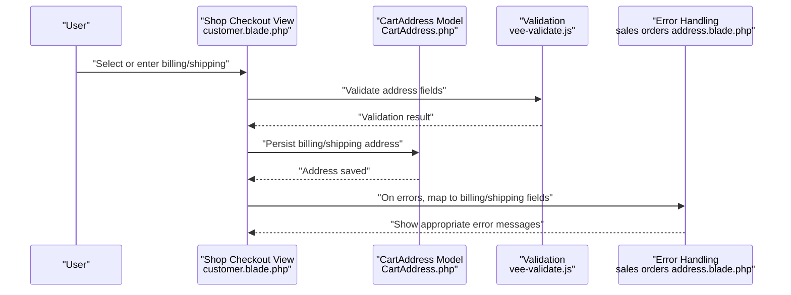

**Diagram sources**
- [packages/Webkul/Shop/src/Resources/views/checkout/onepage/address/customer.blade.php:148-158](file://packages/Webkul/Shop/src/Resources/views/checkout/onepage/address/customer.blade.php#L148-L158)
- [packages/Webkul/Checkout/src/Models/CartAddress.php:1-81](file://packages/Webkul/Checkout/src/Models/CartAddress.php#L1-L81)
- [packages/Webkul/Shop/src/Resources/assets/js/plugins/vee-validate.js:70-118](file://packages/Webkul/Shop/src/Resources/assets/js/plugins/vee-validate.js#L70-L118)
- [packages/Webkul/Admin/src/Resources/views/sales/orders/create/cart/address.blade.php:560-589](file://packages/Webkul/Admin/src/Resources/views/sales/orders/create/cart/address.blade.php#L560-L589)

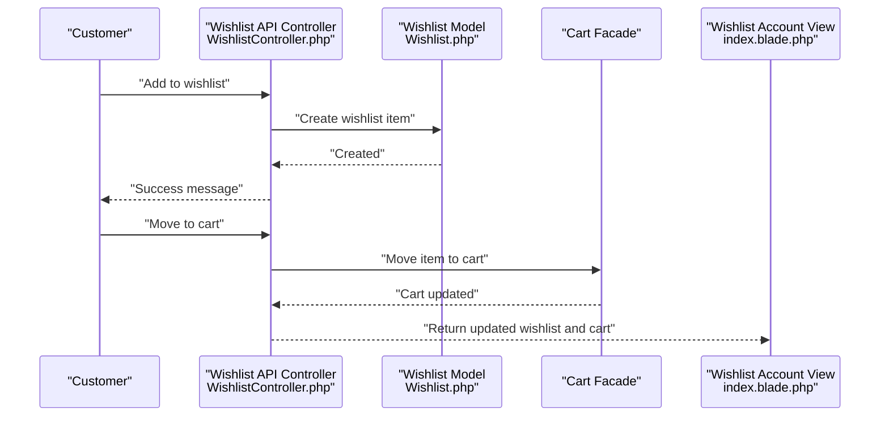

**Diagram sources**
- [packages/Webkul/Shop/src/Http/Controllers/API/WishlistController.php:1-224](file://packages/Webkul/Shop/src/Http/Controllers/API/WishlistController.php#L1-L224)
- [packages/Webkul/Customer/src/Models/Wishlist.php:1-85](file://packages/Webkul/Customer/src/Models/Wishlist.php#L1-L85)
- [packages/Webkul/Shop/src/Resources/views/customers/account/wishlist/index.blade.php:141-369](file://packages/Webkul/Shop/src/Resources/views/customers/account/wishlist/index.blade.php#L141-L369)

## Detailed Component Analysis

### Address Book: Multiple Addresses, Default Selection, Validation
- Multiple addresses per customer are supported via the Customer Address model, which scopes records by address type.
- Default address flag is persisted and managed in the Core Address model; Admin UI toggles default address and updates all customer addresses accordingly.
- Validation rules enforce acceptable address characters and postal code formatting; international postal patterns are loaded from JSON and validated client-side.
- Billing vs shipping addresses are handled separately in checkout; the Admin order creation view maps validation errors to billing or shipping fields.

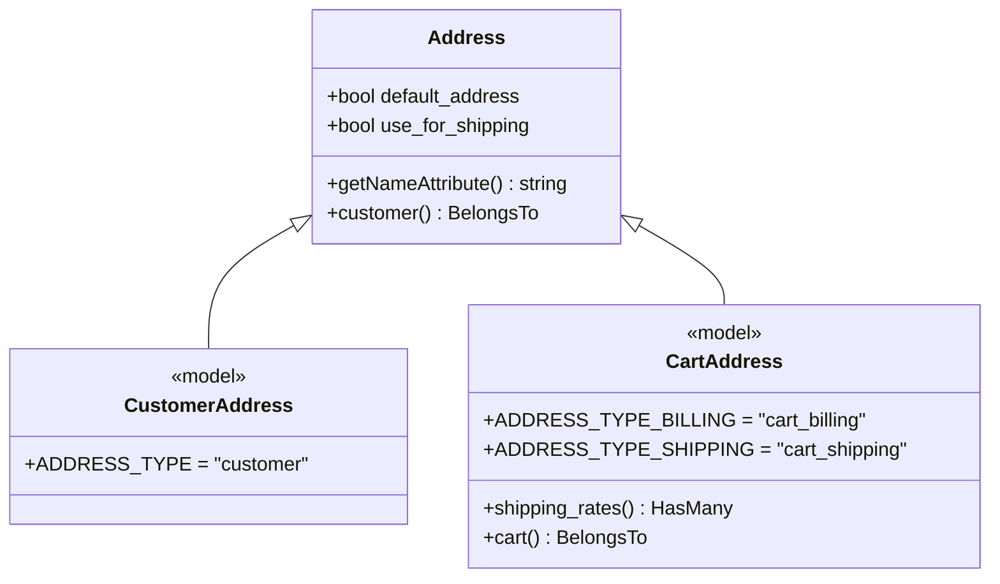

**Diagram sources**
- [packages/Webkul/Core/src/Models/Address.php:1-56](file://packages/Webkul/Core/src/Models/Address.php#L1-L56)
- [packages/Webkul/Customer/src/Models/CustomerAddress.php:1-50](file://packages/Webkul/Customer/src/Models/CustomerAddress.php#L1-L50)
- [packages/Webkul/Checkout/src/Models/CartAddress.php:1-81](file://packages/Webkul/Checkout/src/Models/CartAddress.php#L1-L81)

**Section sources**
- [packages/Webkul/Admin/src/Resources/views/customers/customers/view.blade.php:302-441](file://packages/Webkul/Admin/src/Resources/views/customers/customers/view.blade.php#L302-L441)
- [packages/Webkul/Admin/src/Resources/views/customers/customers/view/address/create.blade.php:35-61](file://packages/Webkul/Admin/src/Resources/views/customers/customers/view/address/create.blade.php#L35-L61)
- [packages/Webkul/Admin/src/Resources/views/customers/customers/view/address/edit.blade.php:31-56](file://packages/Webkul/Admin/src/Resources/views/customers/customers/view/address/edit.blade.php#L31-L56)
- [packages/Webkul/Shop/src/Resources/assets/js/plugins/vee-validate.js:70-118](file://packages/Webkul/Shop/src/Resources/assets/js/plugins/vee-validate.js#L70-L118)
- [packages/Webkul/Admin/src/Resources/assets/js/plugins/vee-validate.js:70-118](file://packages/Webkul/Admin/src/Resources/assets/js/plugins/vee-validate.js#L70-L118)
- [packages/Webkul/Shop/src/Data/postal-code.json:1-1172](file://packages/Webkul/Shop/src/Data/postal-code.json#L1-L1172)
- [packages/Webkul/Shop/src/Resources/views/checkout/onepage/address/customer.blade.php:434-456](file://packages/Webkul/Shop/src/Resources/views/checkout/onepage/address/customer.blade.php#L434-L456)
- [packages/Webkul/Admin/src/Resources/views/sales/orders/create/cart/address.blade.php:560-589](file://packages/Webkul/Admin/src/Resources/views/sales/orders/create/cart/address.blade.php#L560-L589)

### Address Validation and International Formatting
- Client-side validation rules ensure address and postal code formats meet constraints.
- Postal code patterns are loaded from a JSON dataset and localized for international use.
- Tests configure address requirements (country/state/postcode) via Admin configuration.

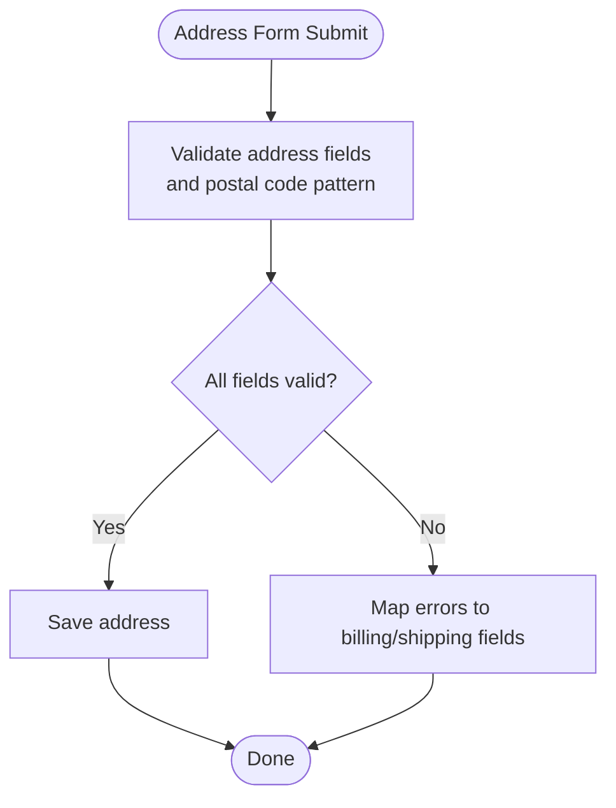

**Diagram sources**
- [packages/Webkul/Shop/src/Resources/assets/js/plugins/vee-validate.js:70-118](file://packages/Webkul/Shop/src/Resources/assets/js/plugins/vee-validate.js#L70-L118)
- [packages/Webkul/Shop/src/Data/postal-code.json:1-1172](file://packages/Webkul/Shop/src/Data/postal-code.json#L1-L1172)
- [packages/Webkul/Admin/tests/e2e-pw/tests/configuration/customer/address.spec.ts:1-30](file://packages/Webkul/Admin/tests/e2e-pw/tests/configuration/customer/address.spec.ts#L1-L30)

**Section sources**
- [packages/Webkul/Shop/src/Resources/assets/js/plugins/vee-validate.js:70-118](file://packages/Webkul/Shop/src/Resources/assets/js/plugins/vee-validate.js#L70-L118)
- [packages/Webkul/Admin/tests/e2e-pw/tests/configuration/customer/address.spec.ts:1-30](file://packages/Webkul/Admin/tests/e2e-pw/tests/configuration/customer/address.spec.ts#L1-L30)

### Billing vs Shipping Address Handling
- During checkout, users can choose to use the billing address for shipping or select a separate shipping address.
- Admin order creation toggles between billing and shipping address selection and handles validation errors distinctly.

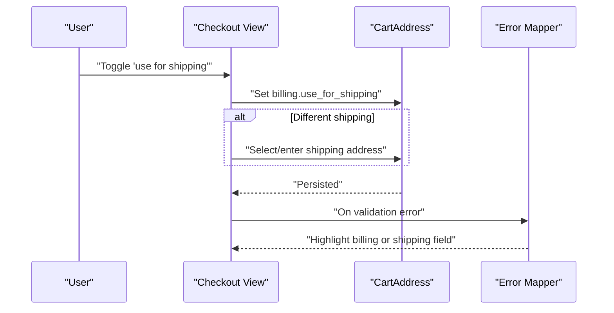

**Diagram sources**
- [packages/Webkul/Shop/src/Resources/views/checkout/onepage/address/customer.blade.php:148-158](file://packages/Webkul/Shop/src/Resources/views/checkout/onepage/address/customer.blade.php#L148-L158)
- [packages/Webkul/Admin/tests/e2e-pw/tests/sales.spec.ts:1011-1565](file://packages/Webkul/Admin/tests/e2e-pw/tests/sales.spec.ts#L1011-L1565)
- [packages/Webkul/Admin/src/Resources/views/sales/orders/create/cart/address.blade.php:560-589](file://packages/Webkul/Admin/src/Resources/views/sales/orders/create/cart/address.blade.php#L560-L589)

**Section sources**
- [packages/Webkul/Shop/src/Resources/views/checkout/onepage/address/customer.blade.php:148-158](file://packages/Webkul/Shop/src/Resources/views/checkout/onepage/address/customer.blade.php#L148-L158)
- [packages/Webkul/Admin/tests/e2e-pw/tests/sales.spec.ts:1011-1565](file://packages/Webkul/Admin/tests/e2e-pw/tests/sales.spec.ts#L1011-L1565)
- [packages/Webkul/Admin/src/Resources/views/sales/orders/create/cart/address.blade.php:560-589](file://packages/Webkul/Admin/src/Resources/views/sales/orders/create/cart/address.blade.php#L560-L589)

### Wishlist Management
- Store and retrieve wishlist items via the Shop API controller, including moving items to cart and removing inactive items.
- Admin controllers expose wishlist items for customer profiles and order creation.
- Account view supports bulk removal and moving items to cart with immediate UI feedback.

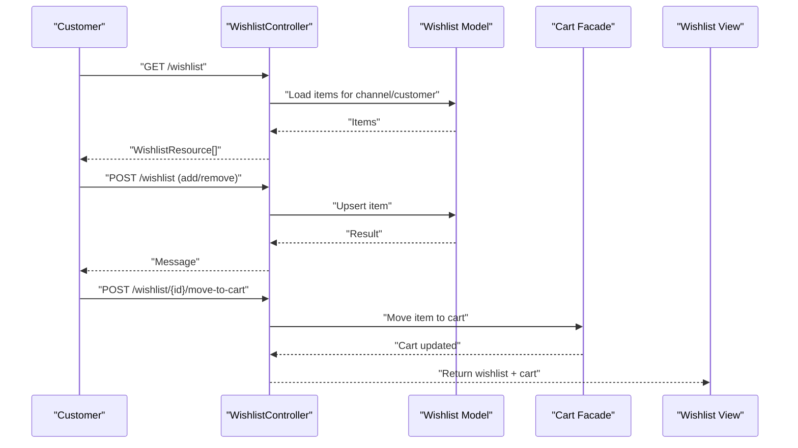

**Diagram sources**
- [packages/Webkul/Shop/src/Http/Controllers/API/WishlistController.php:1-224](file://packages/Webkul/Shop/src/Http/Controllers/API/WishlistController.php#L1-L224)
- [packages/Webkul/Customer/src/Models/Wishlist.php:1-85](file://packages/Webkul/Customer/src/Models/Wishlist.php#L1-L85)
- [packages/Webkul/Shop/src/Resources/views/customers/account/wishlist/index.blade.php:141-369](file://packages/Webkul/Shop/src/Resources/views/customers/account/wishlist/index.blade.php#L141-L369)
- [packages/Webkul/Admin/src/Http/Controllers/Customers/Customer/WishlistController.php:1-53](file://packages/Webkul/Admin/src/Http/Controllers/Customers/Customer/WishlistController.php#L1-L53)
- [packages/Webkul/Admin/src/Resources/views/sales/orders/create/wishlist-items.blade.php:1-175](file://packages/Webkul/Admin/src/Resources/views/sales/orders/create/wishlist-items.blade.php#L1-L175)

**Section sources**
- [packages/Webkul/Shop/src/Http/Controllers/API/WishlistController.php:1-224](file://packages/Webkul/Shop/src/Http/Controllers/API/WishlistController.php#L1-L224)
- [packages/Webkul/Admin/src/Http/Controllers/Customers/Customer/WishlistController.php:1-53](file://packages/Webkul/Admin/src/Http/Controllers/Customers/Customer/WishlistController.php#L1-L53)
- [packages/Webkul/Shop/src/Resources/views/customers/account/wishlist/index.blade.php:141-369](file://packages/Webkul/Shop/src/Resources/views/customers/account/wishlist/index.blade.php#L141-L369)
- [packages/Webkul/Admin/src/Resources/views/sales/orders/create/wishlist-items.blade.php:1-175](file://packages/Webkul/Admin/src/Resources/views/sales/orders/create/wishlist-items.blade.php#L1-L175)

### Address-Based Shipping Calculations
- The system distinguishes between billing and shipping addresses for shipping rate calculation.
- Admin configuration exposes calculation settings and default destination calculation options.

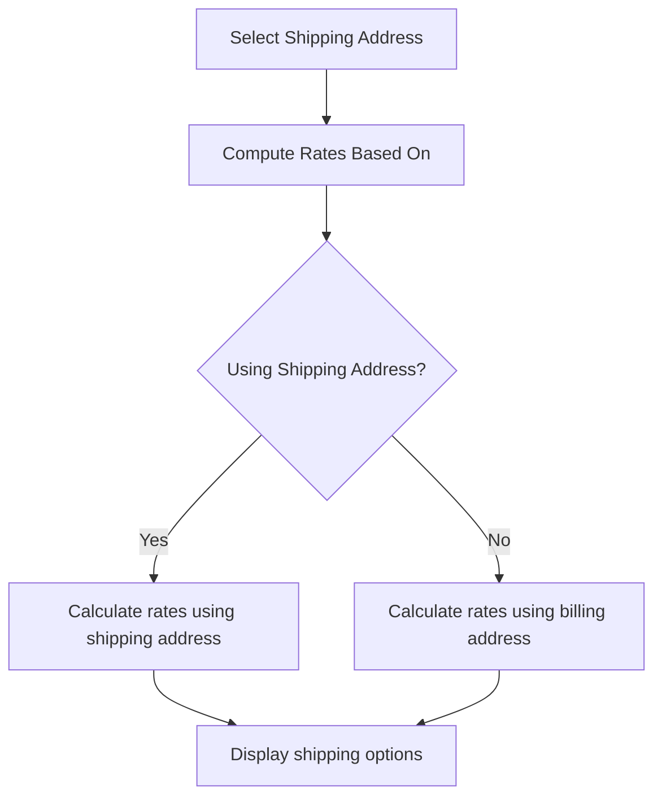

**Diagram sources**
- [packages/Webkul/Checkout/src/Models/CartAddress.php:1-81](file://packages/Webkul/Checkout/src/Models/CartAddress.php#L1-L81)
- [packages/Webkul/Admin/src/Resources/lang/en/app.php:4927-4946](file://packages/Webkul/Admin/src/Resources/lang/en/app.php#L4927-L4946)

**Section sources**
- [packages/Webkul/Checkout/src/Models/CartAddress.php:1-81](file://packages/Webkul/Checkout/src/Models/CartAddress.php#L1-L81)
- [packages/Webkul/Admin/src/Resources/lang/en/app.php:4927-4946](file://packages/Webkul/Admin/src/Resources/lang/en/app.php#L4927-L4946)

### Address Import/Export and Bulk Address Management
- Administrative data transfer routes support importing and exporting data, including sample downloads and error reports.
- Bulk address management is available in Admin UI for creating, editing, and setting defaults for customer addresses.

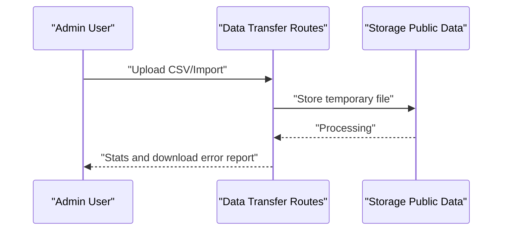

**Diagram sources**
- [packages/Webkul/Admin/src/Routes/settings-routes.php:208-219](file://packages/Webkul/Admin/src/Routes/settings-routes.php#L208-L219)
- [storage/app/public/.gitignore:1-3](file://storage/app/public/.gitignore#L1-L3)
- [packages/Webkul/Admin/tests/e2e-pw/utils/data-transfer.ts:1-51](file://packages/Webkul/Admin/tests/e2e-pw/utils/data-transfer.ts#L1-L51)

**Section sources**
- [packages/Webkul/Admin/src/Routes/settings-routes.php:208-219](file://packages/Webkul/Admin/src/Routes/settings-routes.php#L208-L219)
- [storage/app/public/.gitignore:1-3](file://storage/app/public/.gitignore#L1-L3)
- [packages/Webkul/Admin/tests/e2e-pw/utils/data-transfer.ts:1-51](file://packages/Webkul/Admin/tests/e2e-pw/utils/data-transfer.ts#L1-L51)

## Dependency Analysis
- Address models depend on Core Address contract and relationships to customer/cart.
- Wishlist depends on product/channel/customer proxies and integrates with Cart facade for moving items.
- Controllers orchestrate repositories and events for wishlist actions.
- Views bind to controllers and handle validation and error mapping.

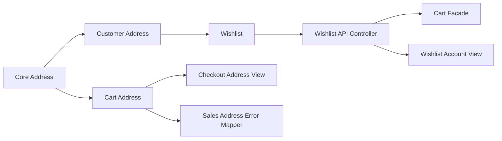

**Diagram sources**
- [packages/Webkul/Core/src/Models/Address.php:1-56](file://packages/Webkul/Core/src/Models/Address.php#L1-L56)
- [packages/Webkul/Customer/src/Models/CustomerAddress.php:1-50](file://packages/Webkul/Customer/src/Models/CustomerAddress.php#L1-L50)
- [packages/Webkul/Checkout/src/Models/CartAddress.php:1-81](file://packages/Webkul/Checkout/src/Models/CartAddress.php#L1-L81)
- [packages/Webkul/Customer/src/Models/Wishlist.php:1-85](file://packages/Webkul/Customer/src/Models/Wishlist.php#L1-L85)
- [packages/Webkul/Shop/src/Http/Controllers/API/WishlistController.php:1-224](file://packages/Webkul/Shop/src/Http/Controllers/API/WishlistController.php#L1-L224)
- [packages/Webkul/Shop/src/Resources/views/checkout/onepage/address/customer.blade.php:148-158](file://packages/Webkul/Shop/src/Resources/views/checkout/onepage/address/customer.blade.php#L148-L158)
- [packages/Webkul/Admin/src/Resources/views/sales/orders/create/cart/address.blade.php:560-589](file://packages/Webkul/Admin/src/Resources/views/sales/orders/create/cart/address.blade.php#L560-L589)

**Section sources**
- [packages/Webkul/Core/src/Models/Address.php:1-56](file://packages/Webkul/Core/src/Models/Address.php#L1-L56)
- [packages/Webkul/Customer/src/Models/CustomerAddress.php:1-50](file://packages/Webkul/Customer/src/Models/CustomerAddress.php#L1-L50)
- [packages/Webkul/Checkout/src/Models/CartAddress.php:1-81](file://packages/Webkul/Checkout/src/Models/CartAddress.php#L1-L81)
- [packages/Webkul/Customer/src/Models/Wishlist.php:1-85](file://packages/Webkul/Customer/src/Models/Wishlist.php#L1-L85)
- [packages/Webkul/Shop/src/Http/Controllers/API/WishlistController.php:1-224](file://packages/Webkul/Shop/src/Http/Controllers/API/WishlistController.php#L1-L224)

## Performance Considerations
- Use server-side validation and scoped queries to minimize unnecessary data retrieval.
- Batch operations for bulk address management and wishlist bulk removal reduce round trips.
- Client-side validation reduces server load by catching invalid inputs early.

## Troubleshooting Guide
- Address validation failures: Ensure address and postal code match configured patterns; review mapped billing/shipping error fields.
- Default address conflicts: When setting a new default, existing defaults are cleared automatically in Admin UI.
- Wishlist move-to-cart issues: If missing options are reported, redirect to product page to select options before moving to cart.

**Section sources**
- [packages/Webkul/Admin/src/Resources/views/sales/orders/create/cart/address.blade.php:560-589](file://packages/Webkul/Admin/src/Resources/views/sales/orders/create/cart/address.blade.php#L560-L589)
- [packages/Webkul/Admin/src/Resources/views/customers/customers/view.blade.php:410-436](file://packages/Webkul/Admin/src/Resources/views/customers/customers/view.blade.php#L410-L436)
- [packages/Webkul/Shop/src/Http/Controllers/API/WishlistController.php:120-141](file://packages/Webkul/Shop/src/Http/Controllers/API/WishlistController.php#L120-L141)

## Conclusion
The address book and wishlist systems are modular and extensible, leveraging shared address models, robust validation, and clear separation between billing and shipping contexts. Administrative controls support bulk operations and data import/export, while Shop APIs enable seamless wishlist management integrated with cart operations.

## Appendices

### Data Models Overview
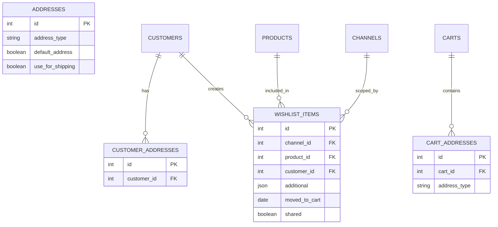

**Diagram sources**
- [packages/Webkul/Core/src/Models/Address.php:1-56](file://packages/Webkul/Core/src/Models/Address.php#L1-L56)
- [packages/Webkul/Customer/src/Models/CustomerAddress.php:1-50](file://packages/Webkul/Customer/src/Models/CustomerAddress.php#L1-L50)
- [packages/Webkul/Checkout/src/Models/CartAddress.php:1-81](file://packages/Webkul/Checkout/src/Models/CartAddress.php#L1-L81)
- [packages/Webkul/Customer/src/Models/Wishlist.php:1-85](file://packages/Webkul/Customer/src/Models/Wishlist.php#L1-L85)
- [packages/Webkul/Customer/src/Database/Migrations/2023_05_26_213105_create_wishlist_items_table.php:1-37](file://packages/Webkul/Customer/src/Database/Migrations/2023_05_26_213105_create_wishlist_items_table.php#L1-L37)
- [packages/Webkul/Customer/src/Database/Migrations/2018_10_03_025230_create_wishlist_table.php:1-43](file://packages/Webkul/Customer/src/Database/Migrations/2018_10_03_025230_create_wishlist_table.php#L1-L43)

### Test Coverage Highlights
- Admin customer address creation and default setting.
- Shop customer address updates and default address toggling.
- Admin order creation toggling between billing and shipping addresses.
- Enabling wishlist feature via Admin configuration.
- Data transfer import/export flows.

**Section sources**
- [packages/Webkul/Admin/tests/e2e-pw/tests/customers/customers.spec.ts:167-199](file://packages/Webkul/Admin/tests/e2e-pw/tests/customers/customers.spec.ts#L167-L199)
- [packages/Webkul/Shop/tests/e2e-pw/tests/customer.spec.ts:472-501](file://packages/Webkul/Shop/tests/e2e-pw/tests/customer.spec.ts#L472-L501)
- [packages/Webkul/Admin/tests/e2e-pw/tests/sales.spec.ts:1011-1565](file://packages/Webkul/Admin/tests/e2e-pw/tests/sales.spec.ts#L1011-L1565)
- [packages/Webkul/Admin/tests/e2e-pw/tests/configuration/customer/settings.spec.ts:1-39](file://packages/Webkul/Admin/tests/e2e-pw/tests/configuration/customer/settings.spec.ts#L1-L39)
- [packages/Webkul/Admin/tests/e2e-pw/utils/address.ts:24-52](file://packages/Webkul/Admin/tests/e2e-pw/utils/address.ts#L24-L52)
- [packages/Webkul/Admin/tests/e2e-pw/utils/data-transfer.ts:1-51](file://packages/Webkul/Admin/tests/e2e-pw/utils/data-transfer.ts#L1-L51)