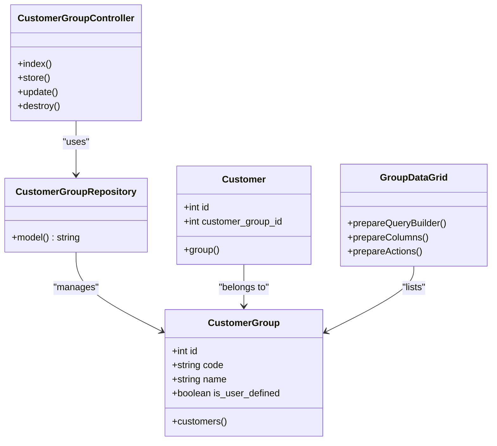
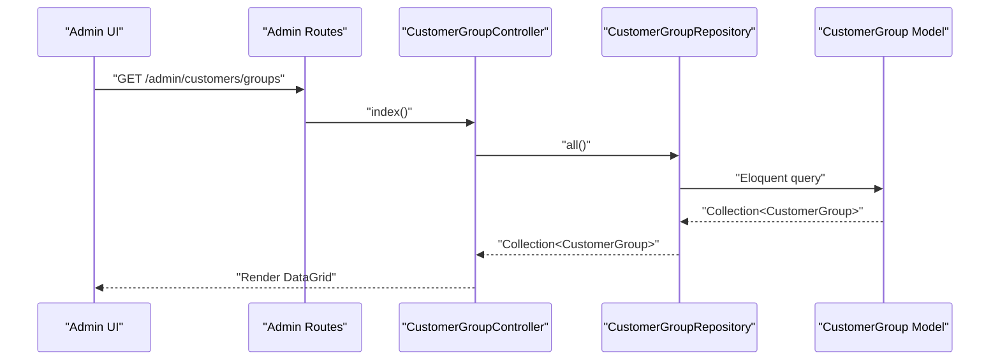
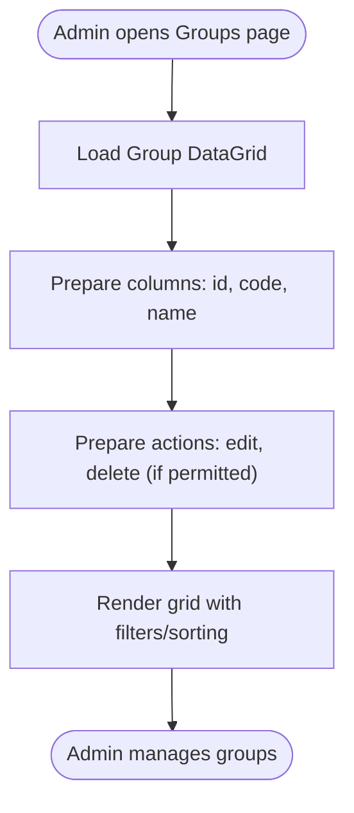
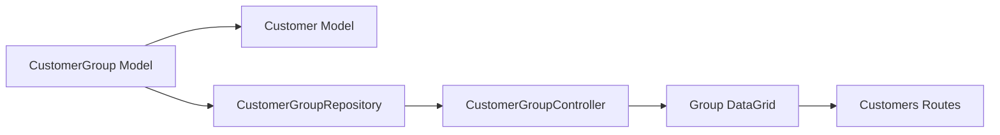

# Customer Groups & Segmentation

<cite>
**Referenced Files in This Document**
- [CustomerGroup.php](file://packages/Webkul/Customer/src/Models/CustomerGroup.php)
- [CustomerGroup.php (Contract)](file://packages/Webkul/Customer/src/Contracts/CustomerGroup.php)
- [CustomerGroupRepository.php](file://packages/Webkul/Customer/src/Repositories/CustomerGroupRepository.php)
- [Customer.php](file://packages/Webkul/Customer/src/Models/Customer.php)
- [2018_07_24_082635_create_customer_groups_table.php](file://packages/Webkul/Customer/src/Database/Migrations/2018_07_24_082635_create_customer_groups_table.php)
- [GroupDataGrid.php](file://packages/Webkul/Admin/src/DataGrids/Customers/GroupDataGrid.php)
- [customers-routes.php](file://packages/Webkul/Admin/src/Routes/customers-routes.php)
- [CustomerGroupController.php](file://packages/Webkul/Admin/src/Http/Controllers/Customers/CustomerGroupController.php)
</cite>

## Table of Contents
1. [Introduction](#introduction)
2. [Project Structure](#project-structure)
3. [Core Components](#core-components)
4. [Architecture Overview](#architecture-overview)
5. [Detailed Component Analysis](#detailed-component-analysis)
6. [Dependency Analysis](#dependency-analysis)
7. [Performance Considerations](#performance-considerations)
8. [Troubleshooting Guide](#troubleshooting-guide)
9. [Conclusion](#conclusion)

## Introduction
This document describes the customer group management and segmentation system in the platform. It covers how customer groups are modeled, persisted, and managed via the administrative interface, how customers are assigned to groups, and how group membership can underpin downstream features such as group-based pricing, targeted offers, and analytics. It also outlines the foundational data structures and relationships that enable dynamic segmentation and personalization workflows.

## Project Structure
The customer group system spans three primary areas:
- Domain model and persistence: customer group entity and its migration
- Administrative UI and data grid: listing, editing, and deleting groups
- Customer-to-group relationship: foreign-key linkage from customer records to groups

```mermaid
graph TB
subgraph "Customer Module"
CGM["CustomerGroup Model<br/>packages/Webkul/Customer/src/Models/CustomerGroup.php"]
CGR["CustomerGroup Repository<br/>packages/Webkul/Customer/src/Repositories/CustomerGroupRepository.php"]
CM["Customer Model<br/>packages/Webkul/Customer/src/Models/Customer.php"]
CGT["Migration: customer_groups<br/>packages/Webkul/Customer/src/Database/Migrations/..._create_customer_groups_table.php"]
end
subgraph "Admin Module"
GDG["Group DataGrid<br/>packages/Webkul/Admin/src/DataGrids/Customers/GroupDataGrid.php"]
CR["Customers Routes<br/>packages/Webkul/Admin/src/Routes/customers-routes.php"]
CGC["CustomerGroupController<br/>packages/Webkul/Admin/src/Http/Controllers/Customers/CustomerGroupController.php"]
end
CGM --> CGR
CM --> CGM
CGT --> CGM
GDG --> CR
CR --> CGC
```



**Diagram sources**
- [CustomerGroup.php:12-49](file://packages/Webkul/Customer/src/Models/CustomerGroup.php#L12-L49)
- [CustomerGroupRepository.php:7-16](file://packages/Webkul/Customer/src/Repositories/CustomerGroupRepository.php#L7-L16)
- [Customer.php:149-152](file://packages/Webkul/Customer/src/Models/Customer.php#L149-L152)
- [2018_07_24_082635_create_customer_groups_table.php:16-22](file://packages/Webkul/Customer/src/Database/Migrations/2018_07_24_082635_create_customer_groups_table.php#L16-L22)
- [GroupDataGrid.php:16-24](file://packages/Webkul/Admin/src/DataGrids/Customers/GroupDataGrid.php#L16-L24)
- [customers-routes.php:109-117](file://packages/Webkul/Admin/src/Routes/customers-routes.php#L109-L117)
- [CustomerGroupController.php](file://packages/Webkul/Admin/src/Http/Controllers/Customers/CustomerGroupController.php)

**Section sources**
- [CustomerGroup.php:12-49](file://packages/Webkul/Customer/src/Models/CustomerGroup.php#L12-L49)
- [CustomerGroupRepository.php:7-16](file://packages/Webkul/Customer/src/Repositories/CustomerGroupRepository.php#L7-L16)
- [Customer.php:149-152](file://packages/Webkul/Customer/src/Models/Customer.php#L149-L152)
- [2018_07_24_082635_create_customer_groups_table.php:16-22](file://packages/Webkul/Customer/src/Database/Migrations/2018_07_24_082635_create_customer_groups_table.php#L16-L22)
- [GroupDataGrid.php:16-24](file://packages/Webkul/Admin/src/DataGrids/Customers/GroupDataGrid.php#L16-L24)
- [customers-routes.php:109-117](file://packages/Webkul/Admin/src/Routes/customers-routes.php#L109-L117)

## Core Components
- CustomerGroup model: Defines the group entity, fillable attributes, and the relationship to customers.
- CustomerGroupRepository: Provides the repository abstraction for group operations.
- Customer model: Defines the foreign key relationship from customer to group.
- Migration: Creates the customer_groups table with unique code, human-readable name, and user-defined flag.
- Group DataGrid: Presents a paginated, filterable, sortable listing of groups in the admin panel.
- Admin routes: Expose CRUD endpoints for groups under the customers/groups namespace.
- CustomerGroupController: Handles requests for listing, creating, updating, and deleting groups.

Key responsibilities:
- Group definition and persistence
- Customer-to-group assignment via foreign key
- Administrative listing and management
- Foundation for downstream segmentation and personalization

**Section sources**
- [CustomerGroup.php:12-49](file://packages/Webkul/Customer/src/Models/CustomerGroup.php#L12-L49)
- [CustomerGroupRepository.php:7-16](file://packages/Webkul/Customer/src/Repositories/CustomerGroupRepository.php#L7-L16)
- [Customer.php:149-152](file://packages/Webkul/Customer/src/Models/Customer.php#L149-L152)
- [2018_07_24_082635_create_customer_groups_table.php:16-22](file://packages/Webkul/Customer/src/Database/Migrations/2018_07_24_082635_create_customer_groups_table.php#L16-L22)
- [GroupDataGrid.php:16-57](file://packages/Webkul/Admin/src/DataGrids/Customers/GroupDataGrid.php#L16-L57)
- [customers-routes.php:109-117](file://packages/Webkul/Admin/src/Routes/customers-routes.php#L109-L117)

## Architecture Overview
The group management architecture follows a layered pattern:
- Data layer: Eloquent model and migration define the schema and relationships.
- Repository layer: Encapsulates data access for group operations.
- Presentation layer: DataGrid renders the admin UI for groups.
- Routing and controller layer: Exposes REST endpoints for group CRUD.



**Diagram sources**
- [CustomerGroup.php:12-49](file://packages/Webkul/Customer/src/Models/CustomerGroup.php#L12-L49)
- [CustomerGroupRepository.php:7-16](file://packages/Webkul/Customer/src/Repositories/CustomerGroupRepository.php#L7-L16)
- [Customer.php:149-152](file://packages/Webkul/Customer/src/Models/Customer.php#L149-L152)
- [GroupDataGrid.php:16-89](file://packages/Webkul/Admin/src/DataGrids/Customers/GroupDataGrid.php#L16-L89)
- [CustomerGroupController.php](file://packages/Webkul/Admin/src/Http/Controllers/Customers/CustomerGroupController.php)

## Detailed Component Analysis

### Customer Group Entity and Persistence
- The group entity persists in the customer_groups table with a unique code, a human-readable name, and a flag indicating whether it was user-defined.
- The model exposes a relationship to customers, enabling queries such as listing all customers in a given group.
- A factory is registered for test and seeding scenarios.

```mermaid
erDiagram
CUSTOMER_GROUPS {
int id PK
string code UK
string name
boolean is_user_defined
timestamp created_at
timestamp updated_at
}
CUSTOMERS {
int id PK
int customer_group_id FK
string email
string first_name
string last_name
...
}
CUSTOMERS }o--|| CUSTOMER_GROUPS : "belongs to"
```

**Diagram sources**
- [2018_07_24_082635_create_customer_groups_table.php:16-22](file://packages/Webkul/Customer/src/Database/Migrations/2018_07_24_082635_create_customer_groups_table.php#L16-L22)
- [CustomerGroup.php:37-40](file://packages/Webkul/Customer/src/Models/CustomerGroup.php#L37-L40)
- [Customer.php:149-152](file://packages/Webkul/Customer/src/Models/Customer.php#L149-L152)

**Section sources**
- [CustomerGroup.php:12-49](file://packages/Webkul/Customer/src/Models/CustomerGroup.php#L12-L49)
- [2018_07_24_082635_create_customer_groups_table.php:16-22](file://packages/Webkul/Customer/src/Database/Migrations/2018_07_24_082635_create_customer_groups_table.php#L16-L22)

### Customer-to-Group Assignment
- Each customer record maintains a foreign key to a customer group.
- The customer model defines a belongs-to relationship to the group, enabling convenient access to group metadata during order processing, quoting, and personalization workflows.



**Diagram sources**
- [customers-routes.php:109-111](file://packages/Webkul/Admin/src/Routes/customers-routes.php#L109-L111)
- [CustomerGroupController.php](file://packages/Webkul/Admin/src/Http/Controllers/Customers/CustomerGroupController.php)
- [CustomerGroupRepository.php:7-16](file://packages/Webkul/Customer/src/Repositories/CustomerGroupRepository.php#L7-L16)
- [CustomerGroup.php:12-49](file://packages/Webkul/Customer/src/Models/CustomerGroup.php#L12-L49)

**Section sources**
- [Customer.php:149-152](file://packages/Webkul/Customer/src/Models/Customer.php#L149-L152)
- [CustomerGroup.php:37-40](file://packages/Webkul/Customer/src/Models/CustomerGroup.php#L37-L40)

### Administrative Management and Listing
- The Group DataGrid builds a query against the customer_groups table, exposing columns for id, code, and name.
- Actions include edit and delete when permissions are granted.
- Routes expose endpoints for listing, creating, updating, and deleting groups.



**Diagram sources**
- [GroupDataGrid.php:16-89](file://packages/Webkul/Admin/src/DataGrids/Customers/GroupDataGrid.php#L16-L89)
- [customers-routes.php:109-117](file://packages/Webkul/Admin/src/Routes/customers-routes.php#L109-L117)

**Section sources**
- [GroupDataGrid.php:16-89](file://packages/Webkul/Admin/src/DataGrids/Customers/GroupDataGrid.php#L16-L89)
- [customers-routes.php:109-117](file://packages/Webkul/Admin/src/Routes/customers-routes.php#L109-L117)

### Dynamic Segmentation and Personalization Workflows
While the core group model and assignment are minimal, they provide the foundation for dynamic segmentation and personalization:
- Purchase history: Use customer-to-group relationships to aggregate orders per group for cohort analysis.
- Demographics: Enrich group membership with customer attributes (e.g., gender, channel) to refine targeting.
- Behavioral patterns: Combine group membership with browsing/wishlist/cart events to tailor recommendations.
- Group-based pricing and offers: Apply pricing rules and promotional campaigns filtered by group membership.
- Targeted marketing: Segment campaigns by group to measure response rates and conversions.
- Analytics and ROI: Track revenue, conversion rate, and ROAS per group to optimize spend.

These workflows rely on existing relationships and can be extended via repositories, services, and reporting layers without modifying the core group model.

[No sources needed since this section provides conceptual guidance]

## Dependency Analysis
The following diagram highlights module-level dependencies among the core components:



**Diagram sources**
- [CustomerGroup.php:12-49](file://packages/Webkul/Customer/src/Models/CustomerGroup.php#L12-L49)
- [Customer.php:149-152](file://packages/Webkul/Customer/src/Models/Customer.php#L149-L152)
- [CustomerGroupRepository.php:7-16](file://packages/Webkul/Customer/src/Repositories/CustomerGroupRepository.php#L7-L16)
- [CustomerGroupController.php](file://packages/Webkul/Admin/src/Http/Controllers/Customers/CustomerGroupController.php)
- [GroupDataGrid.php:16-89](file://packages/Webkul/Admin/src/DataGrids/Customers/GroupDataGrid.php#L16-L89)
- [customers-routes.php:109-117](file://packages/Webkul/Admin/src/Routes/customers-routes.php#L109-L117)

**Section sources**
- [CustomerGroup.php:12-49](file://packages/Webkul/Customer/src/Models/CustomerGroup.php#L12-L49)
- [Customer.php:149-152](file://packages/Webkul/Customer/src/Models/Customer.php#L149-L152)
- [CustomerGroupRepository.php:7-16](file://packages/Webkul/Customer/src/Repositories/CustomerGroupRepository.php#L7-L16)
- [GroupDataGrid.php:16-89](file://packages/Webkul/Admin/src/DataGrids/Customers/GroupDataGrid.php#L16-L89)
- [customers-routes.php:109-117](file://packages/Webkul/Admin/src/Routes/customers-routes.php#L109-L117)

## Performance Considerations
- Indexing: Ensure the customer_groups.code column remains indexed for fast lookups and uniqueness checks.
- Query patterns: Prefer eager loading when retrieving customers with their group associations to avoid N+1 queries.
- DataGrid pagination: Rely on built-in pagination and filtering to keep listing performance predictable.
- Caching: Cache frequently accessed group metadata in administrative contexts to reduce database load.

[No sources needed since this section provides general guidance]

## Troubleshooting Guide
Common issues and resolutions:
- Duplicate group codes: The migration enforces a unique constraint on the code field. Attempting to insert duplicates will fail; ensure unique codes when creating or updating groups.
- Missing group assignments: If customers appear without a group, verify the customer_group_id foreign key value and referential integrity.
- Permission errors: The DataGrid conditionally renders edit/delete actions based on permissions. Confirm that the current admin role has the required permissions for group management.

**Section sources**
- [2018_07_24_082635_create_customer_groups_table.php:18-22](file://packages/Webkul/Customer/src/Database/Migrations/2018_07_24_082635_create_customer_groups_table.php#L18-L22)
- [GroupDataGrid.php:66-88](file://packages/Webkul/Admin/src/DataGrids/Customers/GroupDataGrid.php#L66-L88)

## Conclusion
The customer group management system provides a robust, extensible foundation for segmentation and personalization. With a simple yet effective model, a clean administrative interface, and clear relationships to customer data, teams can implement dynamic segmentation strategies, group-based pricing, targeted campaigns, and analytics-driven optimizations. The modular design encourages building higher-level services and reporting layers on top of these core components.