# Customer Management

<cite>
**Referenced Files in This Document**
- [Customer.php](file://packages/Webkul/Customer/src/Models/Customer.php)
- [CustomerAddress.php](file://packages/Webkul/Customer/src/Models/CustomerAddress.php)
- [CustomerGroup.php](file://packages/Webkul/Customer/src/Models/CustomerGroup.php)
- [Wishlist.php](file://packages/Webkul/Customer/src/Models/Wishlist.php)
- [CompareItem.php](file://packages/Webkul/Customer/src/Models/CompareItem.php)
- [CustomerNote.php](file://packages/Webkul/Customer/src/Models/CustomerNote.php)
- [TwoFactorAuthentication.php](file://packages/Webkul/User/src/TwoFactorAuthentication.php)
- [customers-routes.php](file://packages/Webkul/Admin/src/Routes/customers-routes.php)
- [auth.php](file://config/auth.php)
- [sanctum.php](file://config/sanctum.php)
- [EncryptCookies.php](file://app/Http/Middleware/EncryptCookies.php)
- [2014_10_12_000000_create_users_table.php](file://database/migrations/2014_10_12_000000_create_users_table.php)
- [2019_12_14_000001_create_personal_access_tokens_table.php](file://database/migrations/2019_12_14_000001_create_personal_access_tokens_table.php)
- [2026_02_03_151924_create_sessions_table.php](file://database/migrations/2026_02_03_151924_create_sessions_table.php)
- [2026_03_11_113926_create_agent_conversations_table.php](file://database/migrations/2026_03_11_113926_create_agent_conversations_table.php)
- [CustomerController.php](file://packages/Webkul/Admin/src/Http/Controllers/Customers/CustomerController.php)
- [AddressController.php](file://packages/Webkul/Admin/src/Http/Controllers/Customers/AddressController.php)
- [WishlistController.php](file://packages/Webkul/Admin/src/Http/Controllers/Customers/Customer/WishlistController.php)
- [CompareController.php](file://packages/Webkul/Admin/src/Http/Controllers/Customers/Customer/CompareController.php)
- [OrderController.php](file://packages/Webkul/Admin/src/Http/Controllers/Customers/Customer/OrderController.php)
- [CustomerGroupController.php](file://packages/Webkul/Admin/src/Http/Controllers/Customers/CustomerGroupController.php)
- [ReviewController.php](file://packages/Webkul/Admin/src/Http/Controllers/Customers/ReviewController.php)
- [Customer.php](file://packages/Webkul/Customer/src/Contracts/Customer.php)
- [CustomerAddress.php](file://packages/Webkul/Customer/src/Contracts/CustomerAddress.php)
- [CustomerGroup.php](file://packages/Webkul/Customer/src/Contracts/CustomerGroup.php)
- [Wishlist.php](file://packages/Webkul/Customer/src/Contracts/Wishlist.php)
- [CompareItem.php](file://packages/Webkul/Customer/src/Contracts/CompareItem.php)
- [CustomerNote.php](file://packages/Webkul/Customer/src/Contracts/CustomerNote.php)
</cite>

## Table of Contents
1. [Introduction](#introduction)
2. [Project Structure](#project-structure)
3. [Core Components](#core-components)
4. [Architecture Overview](#architecture-overview)
5. [Detailed Component Analysis](#detailed-component-analysis)
6. [Dependency Analysis](#dependency-analysis)
7. [Performance Considerations](#performance-considerations)
8. [GDPR Compliance and Data Protection](#gdpr-compliance-and-data-protection)
9. [Customer Analytics and Targeted Marketing](#customer-analytics-and-targeted-marketing)
10. [Troubleshooting Guide](#troubleshooting-guide)
11. [Conclusion](#conclusion)

## Introduction
This document provides comprehensive documentation for Frooxi's customer management system. It covers customer profile management, customer groups, address book functionality, and customer segmentation. It also explains customer registration workflows, authentication mechanisms, and two-factor authentication. Additionally, it details customer preferences, wishlists, comparison functionality, and customer notes. The document includes GDPR compliance features, data protection measures, and customer data export capabilities, along with customer analytics, behavioral tracking, and targeted marketing integration.

## Project Structure
The customer management system is implemented as part of the Webkul Customer module within the Frooxi ecosystem. The structure follows a modular approach with dedicated models, controllers, routes, and contracts. Key areas include:
- Customer profiles and authentication via Eloquent models and Laravel Sanctum
- Customer groups for segmentation and pricing strategies
- Address book management with default address selection
- Preferences and lists (wishlist and comparison)
- Administrative controls for customer data, notes, and analytics
- Security and privacy features including two-factor authentication and data protection

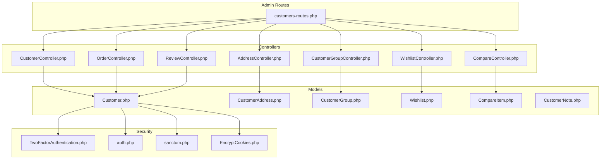

**Diagram sources**
- [customers-routes.php:1-119](file://packages/Webkul/Admin/src/Routes/customers-routes.php#L1-L119)
- [CustomerController.php](file://packages/Webkul/Admin/src/Http/Controllers/Customers/CustomerController.php)
- [AddressController.php](file://packages/Webkul/Admin/src/Http/Controllers/Customers/AddressController.php)
- [WishlistController.php](file://packages/Webkul/Admin/src/Http/Controllers/Customers/Customer/WishlistController.php)
- [CompareController.php](file://packages/Webkul/Admin/src/Http/Controllers/Customers/Customer/CompareController.php)
- [OrderController.php](file://packages/Webkul/Admin/src/Http/Controllers/Customers/Customer/OrderController.php)
- [CustomerGroupController.php](file://packages/Webkul/Admin/src/Http/Controllers/Customers/CustomerGroupController.php)
- [ReviewController.php](file://packages/Webkul/Admin/src/Http/Controllers/Customers/ReviewController.php)
- [Customer.php:1-307](file://packages/Webkul/Customer/src/Models/Customer.php#L1-L307)
- [CustomerAddress.php:1-50](file://packages/Webkul/Customer/src/Models/CustomerAddress.php#L1-L50)
- [CustomerGroup.php:1-50](file://packages/Webkul/Customer/src/Models/CustomerGroup.php#L1-L50)
- [Wishlist.php:1-85](file://packages/Webkul/Customer/src/Models/Wishlist.php#L1-L85)
- [CompareItem.php:1-59](file://packages/Webkul/Customer/src/Models/CompareItem.php#L1-L59)
- [CustomerNote.php:1-24](file://packages/Webkul/Customer/src/Models/CustomerNote.php#L1-L24)
- [TwoFactorAuthentication.php:1-109](file://packages/Webkul/User/src/TwoFactorAuthentication.php#L1-L109)
- [auth.php](file://config/auth.php)
- [sanctum.php](file://config/sanctum.php)
- [EncryptCookies.php](file://app/Http/Middleware/EncryptCookies.php)

**Section sources**
- [customers-routes.php:1-119](file://packages/Webkul/Admin/src/Routes/customers-routes.php#L1-L119)

## Core Components
This section outlines the primary building blocks of the customer management system and their responsibilities.

- Customer model: Manages customer profiles, authentication, relations to orders, invoices, addresses, wishlist, notes, and channels. Provides helper methods for image URLs, name concatenation, email existence checks, and wishlist sharing.
- Customer address model: Extends the core address model with a scoped filter for customer addresses and enforces address type.
- Customer group model: Defines customer segmentation groups with relationships to customers.
- Wishlist model: Stores customer wishlist entries linked to products and channels.
- Compare item model: Stores customer product comparison entries linked to products.
- Customer note model: Stores internal/admin notes per customer.
- Two-factor authentication service: Generates secrets, QR codes, backup codes, and verifies codes for enhanced security.

**Section sources**
- [Customer.php:1-307](file://packages/Webkul/Customer/src/Models/Customer.php#L1-L307)
- [CustomerAddress.php:1-50](file://packages/Webkul/Customer/src/Models/CustomerAddress.php#L1-L50)
- [CustomerGroup.php:1-50](file://packages/Webkul/Customer/src/Models/CustomerGroup.php#L1-L50)
- [Wishlist.php:1-85](file://packages/Webkul/Customer/src/Models/Wishlist.php#L1-L85)
- [CompareItem.php:1-59](file://packages/Webkul/Customer/src/Models/CompareItem.php#L1-L59)
- [CustomerNote.php:1-24](file://packages/Webkul/Customer/src/Models/CustomerNote.php#L1-L24)
- [TwoFactorAuthentication.php:1-109](file://packages/Webkul/User/src/TwoFactorAuthentication.php#L1-L109)

## Architecture Overview
The customer management system integrates administrative routes with controllers that orchestrate model interactions. Authentication relies on Laravel Sanctum for API tokens and standard authentication guards. Two-factor authentication is supported for enhanced security. The system leverages Eloquent relationships to connect customers with orders, invoices, addresses, wishlist, and notes.

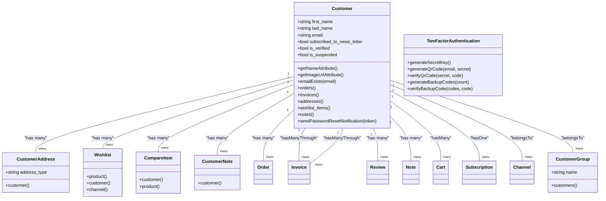

**Diagram sources**
- [Customer.php:1-307](file://packages/Webkul/Customer/src/Models/Customer.php#L1-L307)
- [CustomerAddress.php:1-50](file://packages/Webkul/Customer/src/Models/CustomerAddress.php#L1-L50)
- [CustomerGroup.php:1-50](file://packages/Webkul/Customer/src/Models/CustomerGroup.php#L1-L50)
- [Wishlist.php:1-85](file://packages/Webkul/Customer/src/Models/Wishlist.php#L1-L85)
- [CompareItem.php:1-59](file://packages/Webkul/Customer/src/Models/CompareItem.php#L1-L59)
- [CustomerNote.php:1-24](file://packages/Webkul/Customer/src/Models/CustomerNote.php#L1-L24)
- [TwoFactorAuthentication.php:1-109](file://packages/Webkul/User/src/TwoFactorAuthentication.php#L1-L109)

## Detailed Component Analysis

### Customer Profile Management
Customer profiles are represented by the Customer model, which encapsulates personal details, authentication credentials, and preferences. It provides computed attributes for full name and image URL, and exposes relationships to orders, invoices, addresses, wishlist, notes, and channels. Email existence checks support registration workflows.

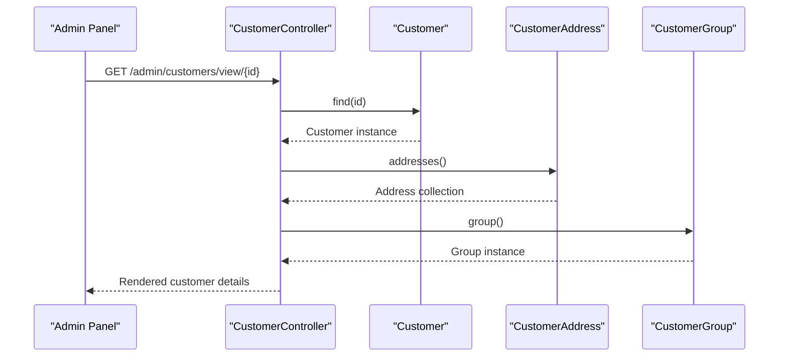

**Diagram sources**
- [CustomerController.php](file://packages/Webkul/Admin/src/Http/Controllers/Customers/CustomerController.php)
- [Customer.php:1-307](file://packages/Webkul/Customer/src/Models/Customer.php#L1-L307)
- [CustomerAddress.php:1-50](file://packages/Webkul/Customer/src/Models/CustomerAddress.php#L1-L50)
- [CustomerGroup.php:1-50](file://packages/Webkul/Customer/src/Models/CustomerGroup.php#L1-L50)

**Section sources**
- [Customer.php:1-307](file://packages/Webkul/Customer/src/Models/Customer.php#L1-L307)

### Customer Groups and Segmentation
Customer groups enable segmentation for pricing, promotions, and targeted communications. The CustomerGroup model defines group metadata and maintains a relationship to customers. Administrative routes support CRUD operations for groups.

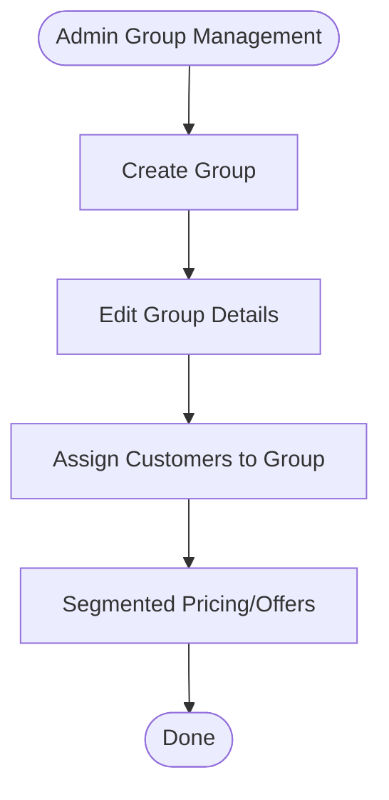

**Diagram sources**
- [CustomerGroup.php:1-50](file://packages/Webkul/Customer/src/Models/CustomerGroup.php#L1-L50)
- [CustomerGroupController.php](file://packages/Webkul/Admin/src/Http/Controllers/Customers/CustomerGroupController.php)
- [customers-routes.php:109-117](file://packages/Webkul/Admin/src/Routes/customers-routes.php#L109-L117)

**Section sources**
- [CustomerGroup.php:1-50](file://packages/Webkul/Customer/src/Models/CustomerGroup.php#L1-L50)
- [customers-routes.php:109-117](file://packages/Webkul/Admin/src/Routes/customers-routes.php#L109-L117)

### Address Book Functionality
The address book allows customers to maintain multiple addresses with a default selection. The CustomerAddress model enforces address type filtering and inherits core address properties. Administrative routes support listing, creation, editing, setting defaults, and deletion of addresses.

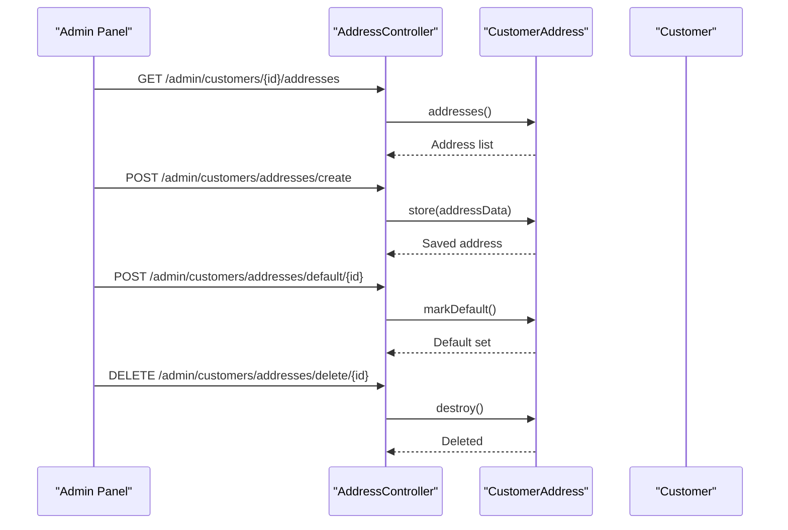

**Diagram sources**
- [AddressController.php](file://packages/Webkul/Admin/src/Http/Controllers/Customers/AddressController.php)
- [CustomerAddress.php:1-50](file://packages/Webkul/Customer/src/Models/CustomerAddress.php#L1-L50)
- [Customer.php:1-307](file://packages/Webkul/Customer/src/Models/Customer.php#L1-L307)
- [customers-routes.php:69-87](file://packages/Webkul/Admin/src/Routes/customers-routes.php#L69-L87)

**Section sources**
- [CustomerAddress.php:1-50](file://packages/Webkul/Customer/src/Models/CustomerAddress.php#L1-L50)
- [customers-routes.php:69-87](file://packages/Webkul/Admin/src/Routes/customers-routes.php#L69-L87)

### Customer Preferences, Wishlists, and Comparison
Customers can manage preferences via wishlist and comparison features. The Wishlist model links products to customers and channels, while CompareItem links products for comparison. Administrative controllers expose endpoints to view and delete items.

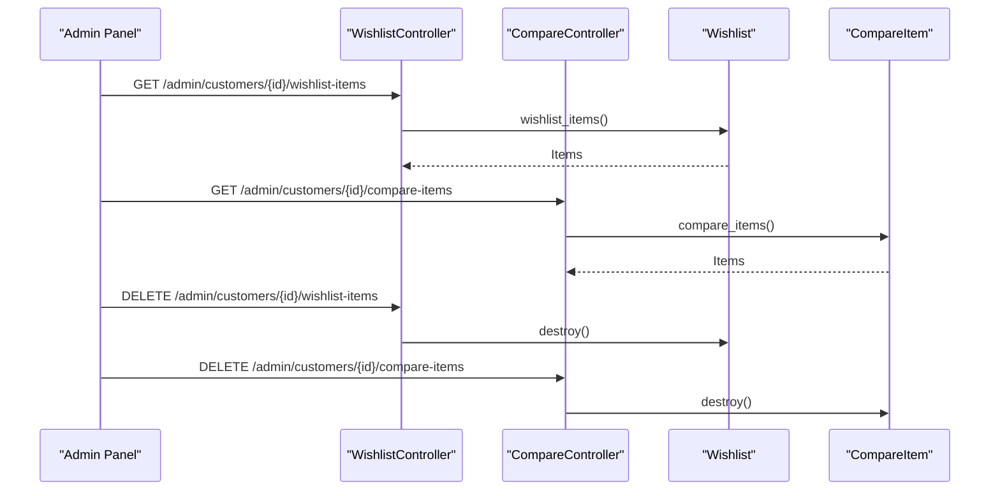

**Diagram sources**
- [WishlistController.php](file://packages/Webkul/Admin/src/Http/Controllers/Customers/Customer/WishlistController.php)
- [CompareController.php](file://packages/Webkul/Admin/src/Http/Controllers/Customers/Customer/CompareController.php)
- [Wishlist.php:1-85](file://packages/Webkul/Customer/src/Models/Wishlist.php#L1-L85)
- [CompareItem.php:1-59](file://packages/Webkul/Customer/src/Models/CompareItem.php#L1-L59)
- [customers-routes.php:41-63](file://packages/Webkul/Admin/src/Routes/customers-routes.php#L41-L63)

**Section sources**
- [Wishlist.php:1-85](file://packages/Webkul/Customer/src/Models/Wishlist.php#L1-L85)
- [CompareItem.php:1-59](file://packages/Webkul/Customer/src/Models/CompareItem.php#L1-L59)
- [customers-routes.php:41-63](file://packages/Webkul/Admin/src/Routes/customers-routes.php#L41-L63)

### Customer Notes
Administrators can attach internal notes to customer records. The CustomerNote model stores note content, links to the customer, and indicates whether the customer was notified.

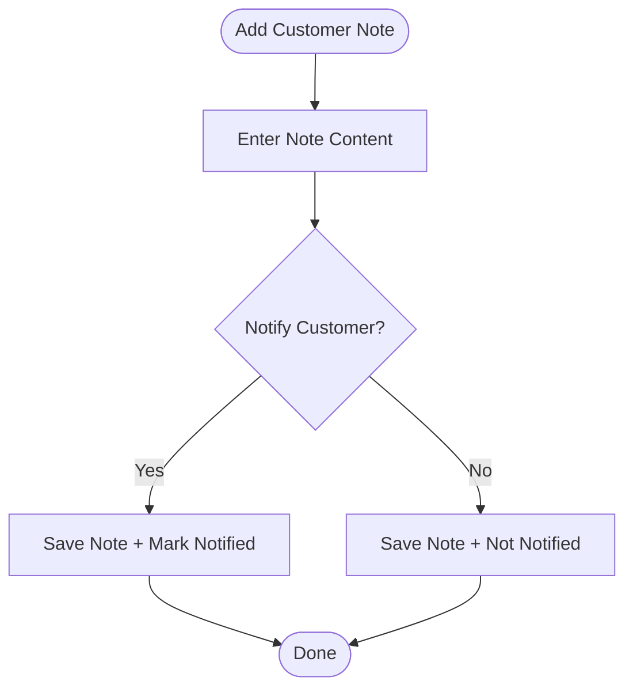

**Diagram sources**
- [CustomerNote.php:1-24](file://packages/Webkul/Customer/src/Models/CustomerNote.php#L1-L24)
- [Customer.php:1-307](file://packages/Webkul/Customer/src/Models/Customer.php#L1-L307)

**Section sources**
- [CustomerNote.php:1-24](file://packages/Webkul/Customer/src/Models/CustomerNote.php#L1-L24)

### Authentication and Registration Workflows
Authentication is handled via Laravel Sanctum for API tokens and standard authentication guards. Password reset notifications are sent through the customer model. Sessions and cookies are managed by framework components.

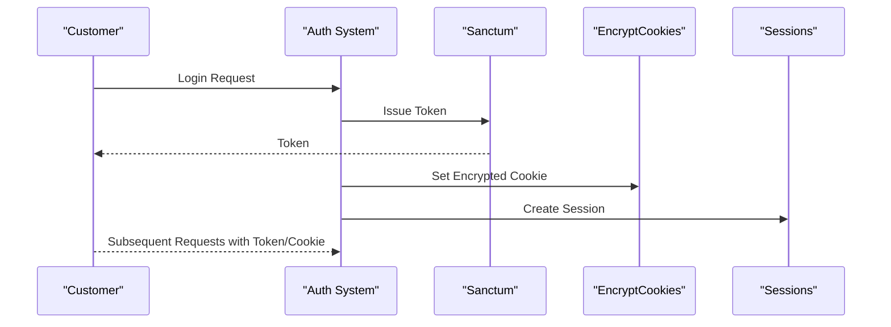

**Diagram sources**
- [Customer.php:1-307](file://packages/Webkul/Customer/src/Models/Customer.php#L1-L307)
- [auth.php](file://config/auth.php)
- [sanctum.php](file://config/sanctum.php)
- [EncryptCookies.php](file://app/Http/Middleware/EncryptCookies.php)
- [2026_02_03_151924_create_sessions_table.php](file://database/migrations/2026_02_03_151924_create_sessions_table.php)

**Section sources**
- [Customer.php:1-307](file://packages/Webkul/Customer/src/Models/Customer.php#L1-L307)
- [auth.php](file://config/auth.php)
- [sanctum.php](file://config/sanctum.php)
- [EncryptCookies.php](file://app/Http/Middleware/EncryptCookies.php)

### Two-Factor Authentication (2FA)
The TwoFactorAuthentication service supports secret generation, QR code creation, backup code generation, and verification. It integrates with Google2FA and QR code generation libraries.

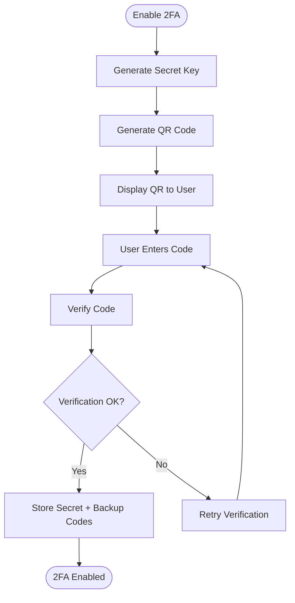

**Diagram sources**
- [TwoFactorAuthentication.php:1-109](file://packages/Webkul/User/src/TwoFactorAuthentication.php#L1-L109)

**Section sources**
- [TwoFactorAuthentication.php:1-109](file://packages/Webkul/User/src/TwoFactorAuthentication.php#L1-L109)

### Administrative Controls and Data Export
Administrative routes provide comprehensive controls for customer data, including viewing, editing, mass updates/deletes, and exporting related data (e.g., wishlist, compare items). These endpoints are secured and designed for backend administration.

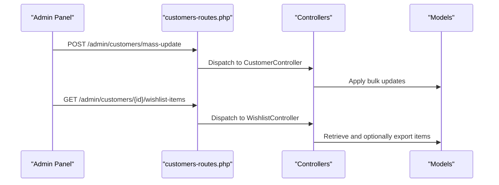

**Diagram sources**
- [customers-routes.php:1-119](file://packages/Webkul/Admin/src/Routes/customers-routes.php#L1-L119)
- [CustomerController.php](file://packages/Webkul/Admin/src/Http/Controllers/Customers/CustomerController.php)
- [WishlistController.php](file://packages/Webkul/Admin/src/Http/Controllers/Customers/Customer/WishlistController.php)

**Section sources**
- [customers-routes.php:1-119](file://packages/Webkul/Admin/src/Routes/customers-routes.php#L1-L119)

## Dependency Analysis
The customer management system exhibits clear separation of concerns:
- Controllers depend on models and repositories to fulfill requests
- Models define relationships and business logic
- Routes bind endpoints to controller actions
- Security configurations (auth, Sanctum, cookies) underpin authentication and session management
- Two-factor authentication is a standalone service integrated where needed

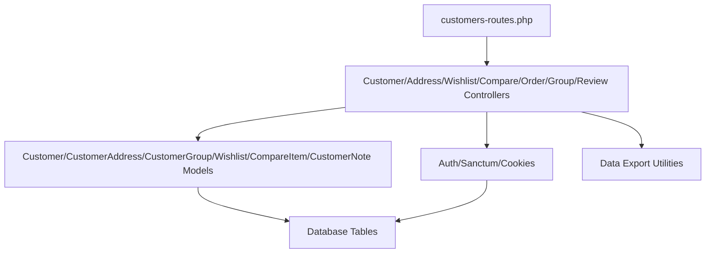

**Diagram sources**
- [customers-routes.php:1-119](file://packages/Webkul/Admin/src/Routes/customers-routes.php#L1-L119)
- [Customer.php:1-307](file://packages/Webkul/Customer/src/Models/Customer.php#L1-L307)
- [CustomerAddress.php:1-50](file://packages/Webkul/Customer/src/Models/CustomerAddress.php#L1-L50)
- [CustomerGroup.php:1-50](file://packages/Webkul/Customer/src/Models/CustomerGroup.php#L1-L50)
- [Wishlist.php:1-85](file://packages/Webkul/Customer/src/Models/Wishlist.php#L1-L85)
- [CompareItem.php:1-59](file://packages/Webkul/Customer/src/Models/CompareItem.php#L1-L59)
- [CustomerNote.php:1-24](file://packages/Webkul/Customer/src/Models/CustomerNote.php#L1-L24)
- [auth.php](file://config/auth.php)
- [sanctum.php](file://config/sanctum.php)
- [EncryptCookies.php](file://app/Http/Middleware/EncryptCookies.php)

**Section sources**
- [customers-routes.php:1-119](file://packages/Webkul/Admin/src/Routes/customers-routes.php#L1-L119)
- [Customer.php:1-307](file://packages/Webkul/Customer/src/Models/Customer.php#L1-L307)

## Performance Considerations
- Eager loading of relationships (orders, invoices, addresses, wishlist, notes) reduces N+1 query issues in administrative views.
- Use of scopes in CustomerAddress ensures filtered queries by address type.
- Token-based authentication via Sanctum minimizes session overhead for API endpoints.
- Indexes on frequently queried columns (e.g., customer_id, email) improve lookup performance.
- Batch operations for mass updates/deletes reduce transaction overhead.

## GDPR Compliance and Data Protection
The system incorporates several GDPR-aligned features:
- Data minimization: Only necessary fields are stored and exposed.
- Consent management: Newsletter subscription flag supports opt-in/opt-out.
- Access controls: Administrative routes restrict access to authorized users.
- Data portability: Administrative endpoints enable retrieval of customer data for export.
- Right to erasure: Administrative deletion endpoints support account removal.
- Security measures: Password resets, encrypted cookies, Sanctum tokens, and optional 2FA protect personal data.

Recommended enhancements:
- Implement explicit consent logs for marketing communications.
- Add automated data retention policies and automatic anonymization.
- Provide granular preference controls for data processing.
- Ensure secure deletion of associated data (orders, carts, wishlist, notes).

**Section sources**
- [Customer.php:1-307](file://packages/Webkul/Customer/src/Models/Customer.php#L1-L307)
- [CustomerAddress.php:1-50](file://packages/Webkul/Customer/src/Models/CustomerAddress.php#L1-L50)
- [CustomerGroup.php:1-50](file://packages/Webkul/Customer/src/Models/CustomerGroup.php#L1-L50)
- [Wishlist.php:1-85](file://packages/Webkul/Customer/src/Models/Wishlist.php#L1-L85)
- [CompareItem.php:1-59](file://packages/Webkul/Customer/src/Models/CompareItem.php#L1-L59)
- [CustomerNote.php:1-24](file://packages/Webkul/Customer/src/Models/CustomerNote.php#L1-L24)
- [auth.php](file://config/auth.php)
- [sanctum.php](file://config/sanctum.php)
- [EncryptCookies.php](file://app/Http/Middleware/EncryptCookies.php)

## Customer Analytics and Targeted Marketing
Analytics and marketing integration can leverage:
- Behavioral insights from orders, invoices, wishlist, and compare activities.
- Segmentation via customer groups for targeted campaigns.
- Newsletter subscriptions for marketing automation.
- Administrative dashboards to monitor customer engagement metrics.

Implementation recommendations:
- Track and expose metrics such as purchase frequency, average order value, and preferred categories.
- Integrate with external marketing platforms using exported datasets.
- Use customer group assignments to trigger personalized offers.

[No sources needed since this section provides general guidance]

## Troubleshooting Guide
Common issues and resolutions:
- Authentication failures: Verify Sanctum tokens, cookie encryption, and session configuration.
- Email notifications: Confirm password reset notification delivery and template configuration.
- Address management: Ensure address type filtering and default address logic are functioning.
- 2FA setup: Validate secret generation, QR code rendering, and code verification flows.
- Data export: Confirm administrative permissions and endpoint availability for retrieving customer data.

**Section sources**
- [Customer.php:1-307](file://packages/Webkul/Customer/src/Models/Customer.php#L1-L307)
- [TwoFactorAuthentication.php:1-109](file://packages/Webkul/User/src/TwoFactorAuthentication.php#L1-L109)
- [customers-routes.php:1-119](file://packages/Webkul/Admin/src/Routes/customers-routes.php#L1-L119)

## Conclusion
Frooxi's customer management system provides a robust foundation for profile management, segmentation, address handling, preferences, and administrative oversight. With built-in authentication, optional two-factor security, and GDPR-aligned data handling, it supports scalable customer operations. Enhanced analytics and marketing integrations can further personalize customer experiences while maintaining compliance and performance standards.