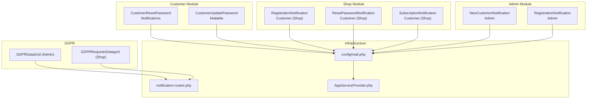
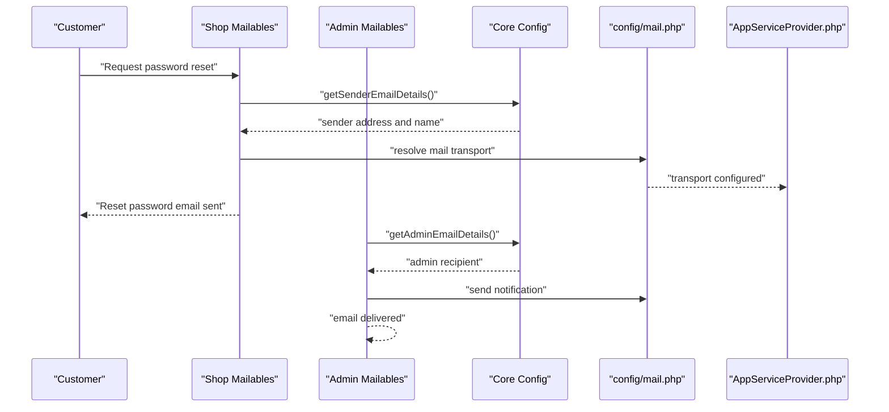
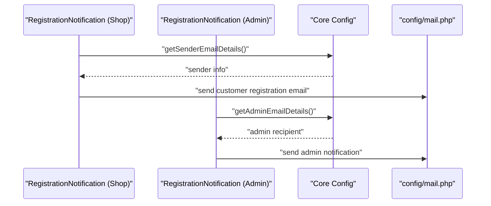
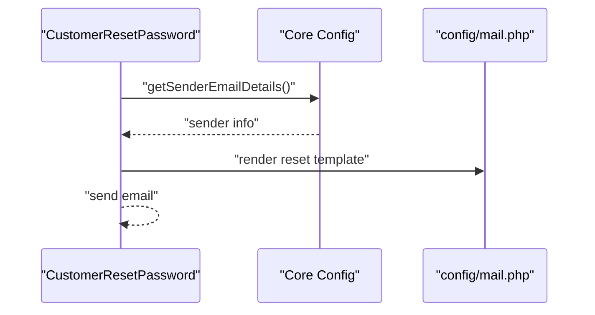
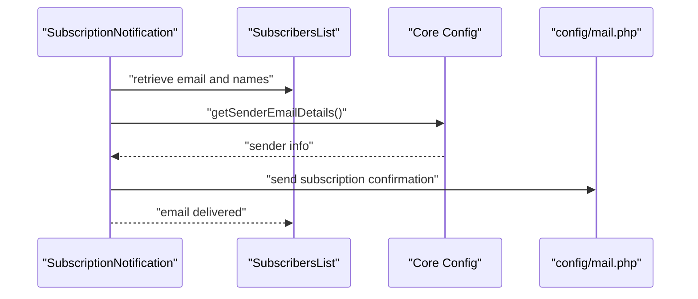
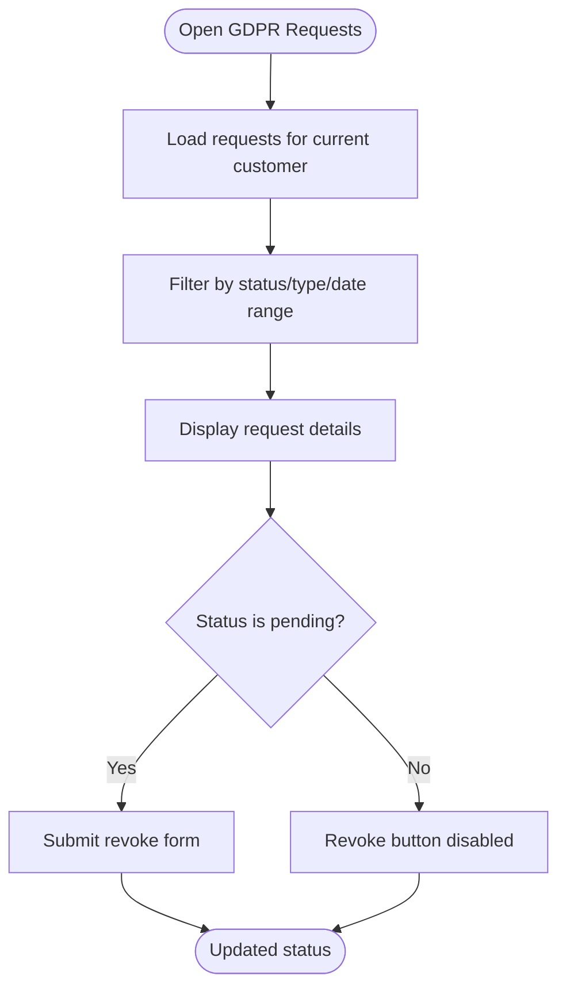
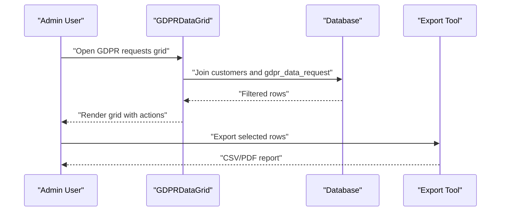
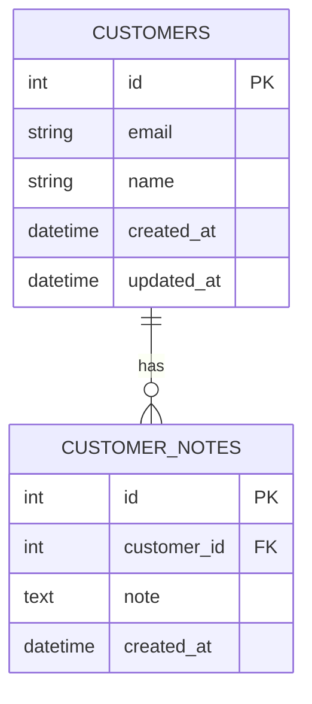
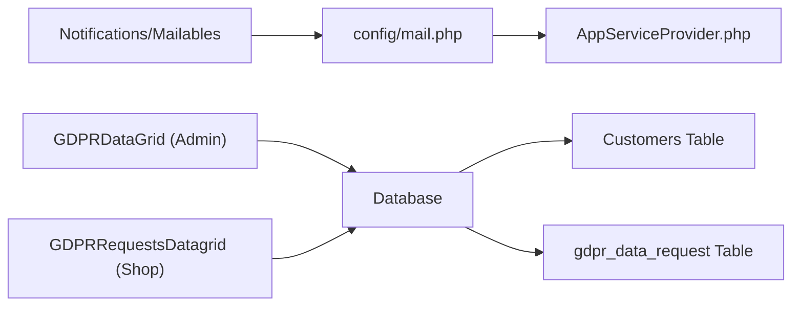

# Customer Notifications & GDPR Compliance

<cite>
**Referenced Files in This Document**
- [CustomerResetPassword.php](file://packages/Webkul/Customer/src/Notifications/CustomerResetPassword.php)
- [CustomerUpdatePassword.php](file://packages/Webkul/Customer/src/Notifications/CustomerUpdatePassword.php)
- [NewCustomerNotification.php](file://packages/Webkul/Admin/src/Mail/Customer/NewCustomerNotification.php)
- [RegistrationNotification.php (Admin)](file://packages/Webkul/Admin/src/Mail/Customer/RegistrationNotification.php)
- [RegistrationNotification.php (Shop)](file://packages/Webkul/Shop/src/Mail/Customer/RegistrationNotification.php)
- [ResetPasswordNotification.php](file://packages/Webkul/Shop/src/Mail/Customer/ResetPasswordNotification.php)
- [SubscriptionNotification.php](file://packages/Webkul/Shop/src/Mail/Customer/SubscriptionNotification.php)
- [GDPRDataGrid.php (Admin)](file://packages/Webkul/Admin/src/DataGrids/Customers/GDPRDataGrid.php)
- [GDPRRequestsDatagrid.php (Shop)](file://packages/Webkul/Shop/src/DataGrids/GDPRRequestsDatagrid.php)
- [notification-routes.php](file://packages/Webkul/Admin/src/Routes/notification-routes.php)
- [2018_09_11_064045_customer_password_resets.php](file://database/migrations/2018_09_11_064045_customer_password_resets.php)
- [2018_07_24_082930_create_customers_table.php](file://database/migrations/2018_07_24_082930_create_customers_table.php)
- [2023_07_25_165945_drop_notes_column_from_customers_table.php](file://database/migrations/2023_07_25_165945_drop_notes_column_from_customers_table.php)
- [2023_07_25_171058_create_customer_notes_table.php](file://database/migrations/2023_07_25_171058_create_customer_notes_table.php)
- [SubscribersList.php](file://packages/Webkul/Core/src/Contracts/SubscribersList.php)
- [mail.php](file://config/mail.php)
- [AppServiceProvider.php](file://app/Providers/AppServiceProvider.php)
</cite>

## Table of Contents
1. [Introduction](#introduction)
2. [Project Structure](#project-structure)
3. [Core Components](#core-components)
4. [Architecture Overview](#architecture-overview)
5. [Detailed Component Analysis](#detailed-component-analysis)
6. [Dependency Analysis](#dependency-analysis)
7. [Performance Considerations](#performance-considerations)
8. [Troubleshooting Guide](#troubleshooting-guide)
9. [Conclusion](#conclusion)
10. [Appendices](#appendices)

## Introduction
This document explains the customer notification system and GDPR compliance features in the codebase. It covers automated email notifications (welcome, order confirmations, password resets, promotional subscriptions), customer preference management, unsubscribe mechanisms, consent tracking, and GDPR data protection capabilities such as right to access, data portability, rectification, erasure, and data restriction. It also documents data retention policies, automated data deletion, compliance reporting, customer note management, communication history tracking, and review management with moderation features.

## Project Structure
The notification system spans three primary areas:
- Customer module notifications for password reset/update flows
- Shop module mailables for customer registration, password reset, subscription, and account-related emails
- Admin module mailables for customer registration notifications to administrators
- GDPR datagrids for managing requests and statuses
- Supporting routes for notifications and configuration for mail transport

**Diagram sources**
- [CustomerResetPassword.php:1-31](file://packages/Webkul/Customer/src/Notifications/CustomerResetPassword.php#L1-L31)
- [CustomerUpdatePassword.php:1-34](file://packages/Webkul/Customer/src/Notifications/CustomerUpdatePassword.php#L1-L34)
- [RegistrationNotification.php (Shop):1-43](file://packages/Webkul/Shop/src/Mail/Customer/RegistrationNotification.php#L1-L43)
- [ResetPasswordNotification.php:1-31](file://packages/Webkul/Shop/src/Mail/Customer/ResetPasswordNotification.php#L1-L31)
- [SubscriptionNotification.php:1-46](file://packages/Webkul/Shop/src/Mail/Customer/SubscriptionNotification.php#L1-L46)
- [NewCustomerNotification.php:1-46](file://packages/Webkul/Admin/src/Mail/Customer/NewCustomerNotification.php#L1-L46)
- [RegistrationNotification.php (Admin):1-46](file://packages/Webkul/Admin/src/Mail/Customer/RegistrationNotification.php#L1-L46)
- [GDPRDataGrid.php (Admin):1-221](file://packages/Webkul/Admin/src/DataGrids/Customers/GDPRDataGrid.php#L1-L221)
- [GDPRRequestsDatagrid.php (Shop):1-191](file://packages/Webkul/Shop/src/DataGrids/GDPRRequestsDatagrid.php#L1-L191)
- [notification-routes.php:1-18](file://packages/Webkul/Admin/src/Routes/notification-routes.php#L1-L18)
- [mail.php](file://config/mail.php)
- [AppServiceProvider.php](file://app/Providers/AppServiceProvider.php)

**Section sources**
- [CustomerResetPassword.php:1-31](file://packages/Webkul/Customer/src/Notifications/CustomerResetPassword.php#L1-L31)
- [CustomerUpdatePassword.php:1-34](file://packages/Webkul/Customer/src/Notifications/CustomerUpdatePassword.php#L1-L34)
- [RegistrationNotification.php (Shop):1-43](file://packages/Webkul/Shop/src/Mail/Customer/RegistrationNotification.php#L1-L43)
- [ResetPasswordNotification.php:1-31](file://packages/Webkul/Shop/src/Mail/Customer/ResetPasswordNotification.php#L1-L31)
- [SubscriptionNotification.php:1-46](file://packages/Webkul/Shop/src/Mail/Customer/SubscriptionNotification.php#L1-L46)
- [NewCustomerNotification.php:1-46](file://packages/Webkul/Admin/src/Mail/Customer/NewCustomerNotification.php#L1-L46)
- [RegistrationNotification.php (Admin):1-46](file://packages/Webkul/Admin/src/Mail/Customer/RegistrationNotification.php#L1-L46)
- [GDPRDataGrid.php (Admin):1-221](file://packages/Webkul/Admin/src/DataGrids/Customers/GDPRDataGrid.php#L1-L221)
- [GDPRRequestsDatagrid.php (Shop):1-191](file://packages/Webkul/Shop/src/DataGrids/GDPRRequestsDatagrid.php#L1-L191)
- [notification-routes.php:1-18](file://packages/Webkul/Admin/src/Routes/notification-routes.php#L1-L18)
- [mail.php](file://config/mail.php)
- [AppServiceProvider.php](file://app/Providers/AppServiceProvider.php)

## Core Components
- Customer notifications for password reset and update
- Customer mailables for registration, password reset, subscription, and account updates
- Admin mailables for notifying admins about new customer registrations
- GDPR data request management via datagrids for admin and customer portals
- Notification routes for admin dashboard notifications
- Supporting database migrations for customer data and GDPR request records
- Subscriber list contract for promotional communications

**Section sources**
- [CustomerResetPassword.php:1-31](file://packages/Webkul/Customer/src/Notifications/CustomerResetPassword.php#L1-L31)
- [CustomerUpdatePassword.php:1-34](file://packages/Webkul/Customer/src/Notifications/CustomerUpdatePassword.php#L1-L34)
- [RegistrationNotification.php (Shop):1-43](file://packages/Webkul/Shop/src/Mail/Customer/RegistrationNotification.php#L1-L43)
- [ResetPasswordNotification.php:1-31](file://packages/Webkul/Shop/src/Mail/Customer/ResetPasswordNotification.php#L1-L31)
- [SubscriptionNotification.php:1-46](file://packages/Webkul/Shop/src/Mail/Customer/SubscriptionNotification.php#L1-L46)
- [NewCustomerNotification.php:1-46](file://packages/Webkul/Admin/src/Mail/Customer/NewCustomerNotification.php#L1-L46)
- [RegistrationNotification.php (Admin):1-46](file://packages/Webkul/Admin/src/Mail/Customer/RegistrationNotification.php#L1-L46)
- [GDPRDataGrid.php (Admin):1-221](file://packages/Webkul/Admin/src/DataGrids/Customers/GDPRDataGrid.php#L1-L221)
- [GDPRRequestsDatagrid.php (Shop):1-191](file://packages/Webkul/Shop/src/DataGrids/GDPRRequestsDatagrid.php#L1-L191)
- [notification-routes.php:1-18](file://packages/Webkul/Admin/src/Routes/notification-routes.php#L1-L18)
- [2018_07_24_082930_create_customers_table.php](file://database/migrations/2018_07_24_082930_create_customers_table.php)
- [2018_09_11_064045_customer_password_resets.php](file://database/migrations/2018_09_11_064045_customer_password_resets.php)
- [2023_07_25_165945_drop_notes_column_from_customers_table.php](file://database/migrations/2023_07_25_165945_drop_notes_column_from_customers_table.php)
- [2023_07_25_171058_create_customer_notes_table.php](file://database/migrations/2023_07_25_171058_create_customer_notes_table.php)
- [SubscribersList.php](file://packages/Webkul/Core/src/Contracts/SubscribersList.php)

## Architecture Overview
The notification system integrates Laravel’s mail subsystem with custom mailables and notifications. Sender details are resolved via core configuration helpers. GDPR request management is exposed via admin and customer datagrids with filtering, sorting, and action controls. Routes support admin notification retrieval and marking as read.

**Diagram sources**
- [ResetPasswordNotification.php:1-31](file://packages/Webkul/Shop/src/Mail/Customer/ResetPasswordNotification.php#L1-L31)
- [RegistrationNotification.php (Admin):1-46](file://packages/Webkul/Admin/src/Mail/Customer/RegistrationNotification.php#L1-L46)
- [mail.php](file://config/mail.php)
- [AppServiceProvider.php](file://app/Providers/AppServiceProvider.php)

## Detailed Component Analysis

### Automated Email Notifications

#### Welcome Emails
- Customer registration confirmation to the customer is handled by a dedicated mailable in the Shop module.
- Admin receives a separate notification about the new customer registration via an Admin mailable.

**Diagram sources**
- [RegistrationNotification.php (Shop):1-43](file://packages/Webkul/Shop/src/Mail/Customer/RegistrationNotification.php#L1-L43)
- [RegistrationNotification.php (Admin):1-46](file://packages/Webkul/Admin/src/Mail/Customer/RegistrationNotification.php#L1-L46)
- [mail.php](file://config/mail.php)

**Section sources**
- [RegistrationNotification.php (Shop):1-43](file://packages/Webkul/Shop/src/Mail/Customer/RegistrationNotification.php#L1-L43)
- [RegistrationNotification.php (Admin):1-46](file://packages/Webkul/Admin/src/Mail/Customer/RegistrationNotification.php#L1-L46)

#### Password Reset Emails
- Customer-initiated password reset uses a dedicated notification class that builds a mail message with sender details and a templated view.
- The Shop module also provides a similar notification for customer-facing reset emails.

**Diagram sources**
- [CustomerResetPassword.php:1-31](file://packages/Webkul/Customer/src/Notifications/CustomerResetPassword.php#L1-L31)
- [ResetPasswordNotification.php:1-31](file://packages/Webkul/Shop/src/Mail/Customer/ResetPasswordNotification.php#L1-L31)
- [mail.php](file://config/mail.php)

**Section sources**
- [CustomerResetPassword.php:1-31](file://packages/Webkul/Customer/src/Notifications/CustomerResetPassword.php#L1-L31)
- [ResetPasswordNotification.php:1-31](file://packages/Webkul/Shop/src/Mail/Customer/ResetPasswordNotification.php#L1-L31)

#### Promotional Subscription Emails
- Subscription confirmation email uses a mailable that resolves the subscriber’s full name from the subscribers list contract and sends a templated email.

**Diagram sources**
- [SubscriptionNotification.php:1-46](file://packages/Webkul/Shop/src/Mail/Customer/SubscriptionNotification.php#L1-L46)
- [SubscribersList.php](file://packages/Webkul/Core/src/Contracts/SubscribersList.php)
- [mail.php](file://config/mail.php)

**Section sources**
- [SubscriptionNotification.php:1-46](file://packages/Webkul/Shop/src/Mail/Customer/SubscriptionNotification.php#L1-L46)
- [SubscribersList.php](file://packages/Webkul/Core/src/Contracts/SubscribersList.php)

#### Customer Preference Management and Unsubscribe Mechanisms
- Subscription management is supported by the subscribers list contract and related mailables. The system resolves sender details and renders templates for promotional emails.
- Unsubscribe mechanisms are typically integrated with the subscription workflow; ensure unsubscribe links are present in promotional emails and processed by backend handlers.

**Section sources**
- [SubscriptionNotification.php:1-46](file://packages/Webkul/Shop/src/Mail/Customer/SubscriptionNotification.php#L1-L46)
- [SubscribersList.php](file://packages/Webkul/Core/src/Contracts/SubscribersList.php)

#### Consent Tracking
- Consent tracking is not explicitly modeled in the provided files. To implement consent tracking, introduce a consent log table and associate it with customer records. Ensure opt-in/opt-out timestamps and granular consent categories are stored and auditable.

[No sources needed since this section provides general guidance]

### GDPR Data Protection Features

#### Right to Access
- The customer portal exposes a datagrid for viewing GDPR requests with status, type, message, and timestamps. Pending requests can be revoked by the customer.

**Diagram sources**
- [GDPRRequestsDatagrid.php (Shop):1-191](file://packages/Webkul/Shop/src/DataGrids/GDPRRequestsDatagrid.php#L1-L191)

**Section sources**
- [GDPRRequestsDatagrid.php (Shop):1-191](file://packages/Webkul/Shop/src/DataGrids/GDPRRequestsDatagrid.php#L1-L191)

#### Data Portability
- Admin can view and manage GDPR requests via a datagrid that joins customer and request data, enabling export and reporting.

**Diagram sources**
- [GDPRDataGrid.php (Admin):1-221](file://packages/Webkul/Admin/src/DataGrids/Customers/GDPRDataGrid.php#L1-L221)

**Section sources**
- [GDPRDataGrid.php (Admin):1-221](file://packages/Webkul/Admin/src/DataGrids/Customers/GDPRDataGrid.php#L1-L221)

#### Rectification
- The system supports updating customer data; ensure rectification requests are tracked in GDPR requests and processed with audit trails.

[No sources needed since this section provides general guidance]

#### Erasure (Right to be Forgotten)
- Deletion requests are represented by request type “delete” in the datagrids. Implement a background job to purge customer data per policy after approval.

**Section sources**
- [GDPRDataGrid.php (Admin):1-221](file://packages/Webkul/Admin/src/DataGrids/Customers/GDPRDataGrid.php#L1-L221)
- [GDPRRequestsDatagrid.php (Shop):1-191](file://packages/Webkul/Shop/src/DataGrids/GDPRRequestsDatagrid.php#L1-L191)

#### Data Restriction
- Restriction requests can be modeled similarly to deletion requests with a “restricted” status and appropriate processing workflows.

[No sources needed since this section provides general guidance]

#### Data Retention Policies and Automated Deletion
- Define retention periods for customer data and implement scheduled jobs to delete expired records. Track deletions in GDPR logs.

**Section sources**
- [2018_07_24_082930_create_customers_table.php](file://database/migrations/2018_07_24_082930_create_customers_table.php)
- [2018_09_11_064045_customer_password_resets.php](file://database/migrations/2018_09_11_064045_customer_password_resets.php)

#### Compliance Reporting
- Use the GDPR datagrids to generate compliance reports for audits. Include counts by status, type, and date ranges.

**Section sources**
- [GDPRDataGrid.php (Admin):1-221](file://packages/Webkul/Admin/src/DataGrids/Customers/GDPRDataGrid.php#L1-L221)
- [GDPRRequestsDatagrid.php (Shop):1-191](file://packages/Webkul/Shop/src/DataGrids/GDPRRequestsDatagrid.php#L1-L191)

### Customer Note Management and Communication History
- Customer notes are persisted in a dedicated table and separated from the main customer record. This enables auditability and compliance with data minimization.

**Diagram sources**
- [2023_07_25_165945_drop_notes_column_from_customers_table.php](file://database/migrations/2023_07_25_165945_drop_notes_column_from_customers_table.php)
- [2023_07_25_171058_create_customer_notes_table.php](file://database/migrations/2023_07_25_171058_create_customer_notes_table.php)

**Section sources**
- [2023_07_25_165945_drop_notes_column_from_customers_table.php](file://database/migrations/2023_07_25_165945_drop_notes_column_from_customers_table.php)
- [2023_07_25_171058_create_customer_notes_table.php](file://database/migrations/2023_07_25_171058_create_customer_notes_table.php)

### Review Management with Moderation
- Reviews are not explicitly modeled in the provided files. Introduce a reviews table with moderation fields (approved, flagged, reviewed_by) and integrate with customer notifications for moderation outcomes.

[No sources needed since this section provides general guidance]

## Dependency Analysis
- Mailables and notifications depend on core sender/admin email details resolution.
- Mail transport is configured via the mail configuration file and registered in the service provider.
- GDPR datagrids join customer and request tables to provide actionable insights.

**Diagram sources**
- [mail.php](file://config/mail.php)
- [AppServiceProvider.php](file://app/Providers/AppServiceProvider.php)
- [GDPRDataGrid.php (Admin):1-221](file://packages/Webkul/Admin/src/DataGrids/Customers/GDPRDataGrid.php#L1-L221)
- [GDPRRequestsDatagrid.php (Shop):1-191](file://packages/Webkul/Shop/src/DataGrids/GDPRRequestsDatagrid.php#L1-L191)

**Section sources**
- [mail.php](file://config/mail.php)
- [AppServiceProvider.php](file://app/Providers/AppServiceProvider.php)
- [GDPRDataGrid.php (Admin):1-221](file://packages/Webkul/Admin/src/DataGrids/Customers/GDPRDataGrid.php#L1-L221)
- [GDPRRequestsDatagrid.php (Shop):1-191](file://packages/Webkul/Shop/src/DataGrids/GDPRRequestsDatagrid.php#L1-L191)

## Performance Considerations
- Use queued mailables for promotional emails to avoid blocking requests.
- Index GDPR request and customer tables on frequently filtered columns (status, type, created_at).
- Paginate datagrid queries to limit memory usage.

[No sources needed since this section provides general guidance]

## Troubleshooting Guide
- If emails are not sending, verify mail transport configuration and credentials in the mail configuration file.
- Ensure sender/admin email details are set in core configuration helpers.
- For GDPR datagrids, check database permissions and join conditions.

**Section sources**
- [mail.php](file://config/mail.php)
- [AppServiceProvider.php](file://app/Providers/AppServiceProvider.php)
- [GDPRDataGrid.php (Admin):1-221](file://packages/Webkul/Admin/src/DataGrids/Customers/GDPRDataGrid.php#L1-L221)
- [GDPRRequestsDatagrid.php (Shop):1-191](file://packages/Webkul/Shop/src/DataGrids/GDPRRequestsDatagrid.php#L1-L191)

## Conclusion
The codebase provides robust building blocks for customer notifications and GDPR compliance. Notifications leverage Laravel’s mail infrastructure with configurable sender details, while GDPR features are surfaced via admin and customer datagrids. Extending the system with explicit consent tracking, moderation workflows, and automated deletion jobs will further strengthen privacy and compliance posture.

## Appendices

### Notification Routes (Admin)
- Provides endpoints for retrieving and marking notifications as read in the admin panel.

**Section sources**
- [notification-routes.php:1-18](file://packages/Webkul/Admin/src/Routes/notification-routes.php#L1-L18)