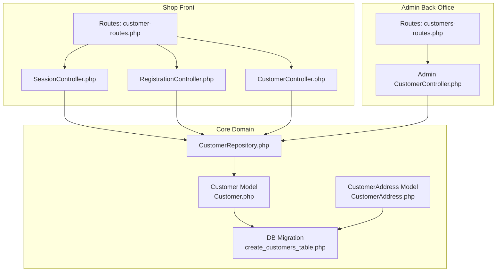
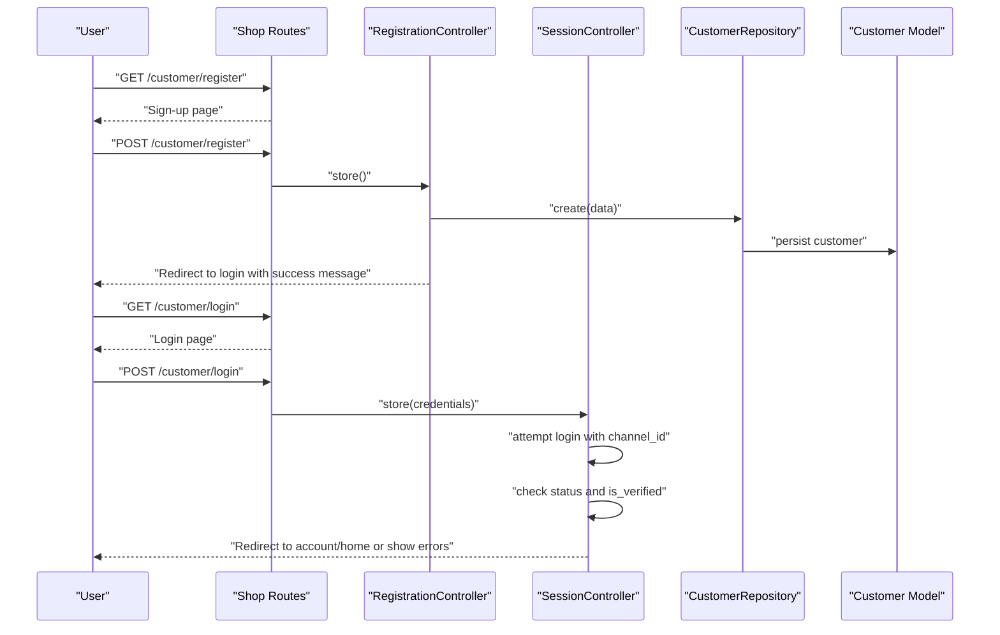
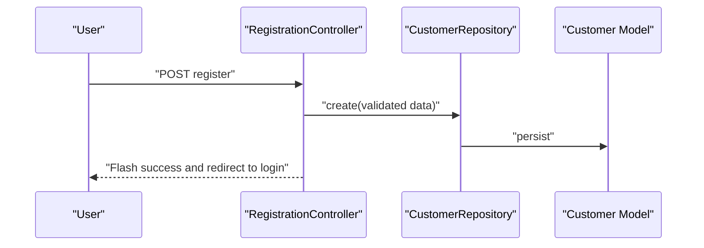
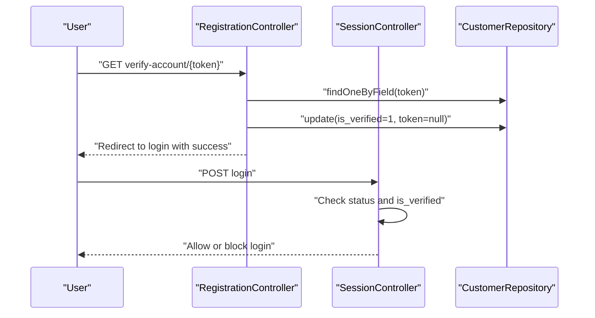
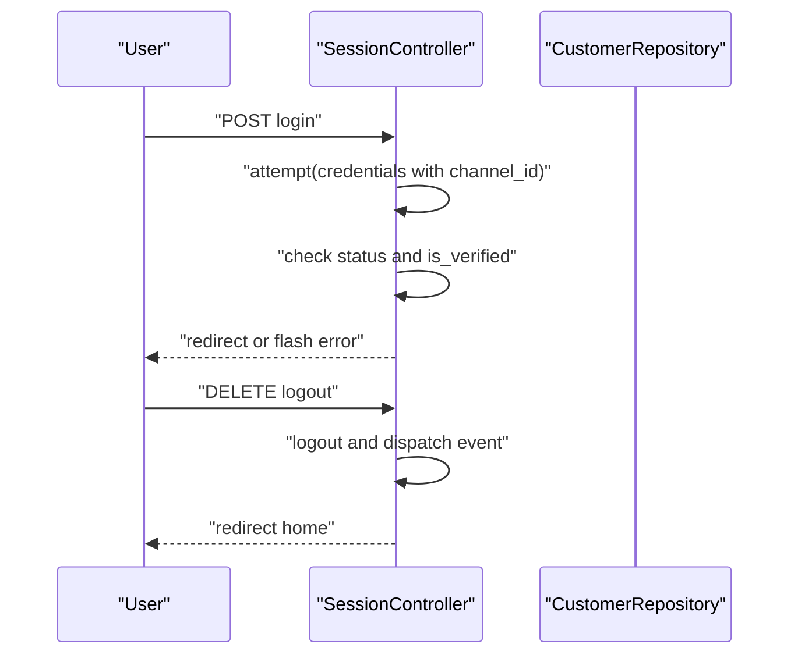
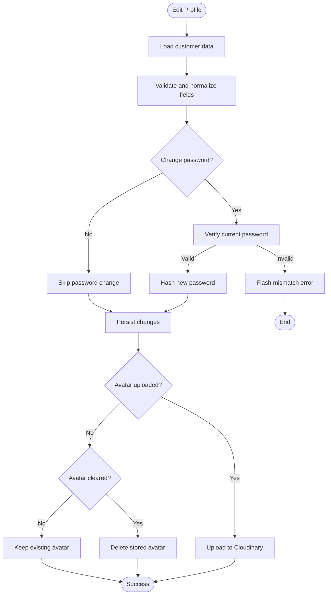
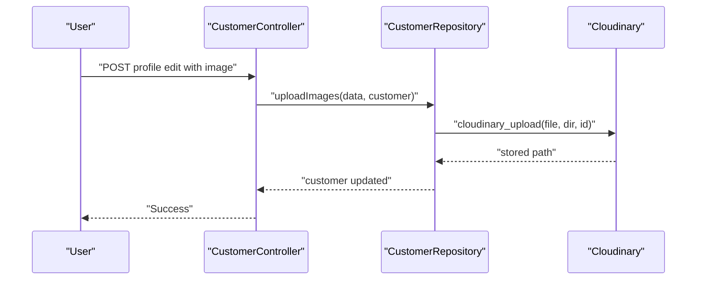
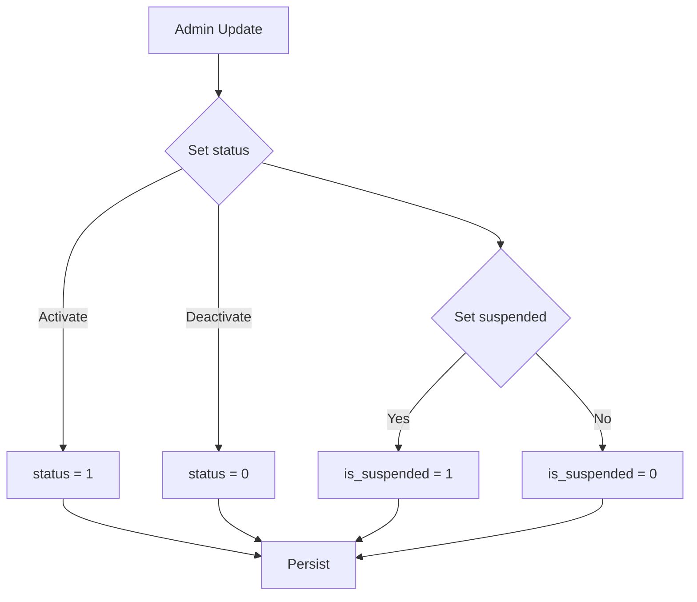
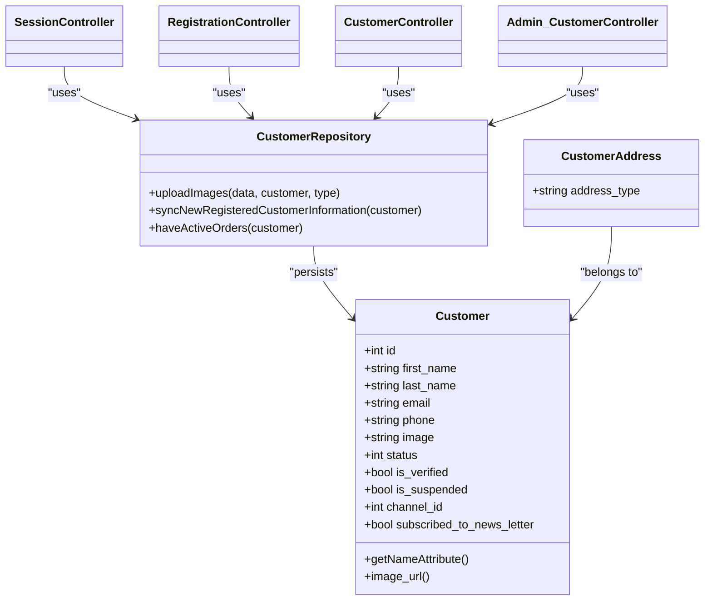

# Customer Profiles

<cite>
**Referenced Files in This Document**
- [Customer.php](file://packages/Webkul/Customer/src/Models/Customer.php)
- [CustomerAddress.php](file://packages/Webkul/Customer/src/Models/CustomerAddress.php)
- [CustomerRepository.php](file://packages/Webkul/Customer/src/Repositories/CustomerRepository.php)
- [customer-routes.php](file://packages/Webkul/Shop/src/Routes/customer-routes.php)
- [customers-routes.php](file://packages/Webkul/Admin/src/Routes/customers-routes.php)
- [SessionController.php](file://packages/Webkul/Shop/src/Http/Controllers/Customer/SessionController.php)
- [RegistrationController.php](file://packages/Webkul/Shop/src/Http/Controllers/Customer/RegistrationController.php)
- [CustomerController.php](file://packages/Webkul/Shop/src/Http/Controllers/Customer/CustomerController.php)
- [CustomerController.php (Admin)](file://packages/Webkul/Admin/src/Http/Controllers/Customers/CustomerController.php)
- [create_customers_table.php](file://packages/Webkul/Customer/src/Database/Migrations/2018_07_24_082930_create_customers_table.php)
</cite>

## Table of Contents
1. [Introduction](#introduction)
2. [Project Structure](#project-structure)
3. [Core Components](#core-components)
4. [Architecture Overview](#architecture-overview)
5. [Detailed Component Analysis](#detailed-component-analysis)
6. [Dependency Analysis](#dependency-analysis)
7. [Performance Considerations](#performance-considerations)
8. [Troubleshooting Guide](#troubleshooting-guide)
9. [Conclusion](#conclusion)

## Introduction
This document describes the customer profile management functionality in the system, focusing on:
- Customer registration and email verification
- Authentication (login/logout) and password management
- Profile editing and personal information updates
- Avatar/image upload and profile visibility
- Status management (verified, suspended) and account activation
- Integration with multi-channel environments
- Privacy controls and subscription preferences

## Project Structure
Customer profile features span three main areas:
- Shop front (customer-facing):
  - Registration, login, logout, profile management, and account pages
  - Routes and controllers under the Shop module
- Admin back-office:
  - Customer listing, viewing, editing, and bulk actions
  - Administrative profile management and status updates
- Core domain:
  - Customer model, repository, and database schema

**Diagram sources**
- [customer-routes.php:1-87](file://packages/Webkul/Shop/src/Routes/customer-routes.php#L1-L87)
- [customers-routes.php:1-119](file://packages/Webkul/Admin/src/Routes/customers-routes.php#L1-L119)
- [SessionController.php:1-94](file://packages/Webkul/Shop/src/Http/Controllers/Customer/SessionController.php#L1-L94)
- [RegistrationController.php:1-179](file://packages/Webkul/Shop/src/Http/Controllers/Customer/RegistrationController.php#L1-L179)
- [CustomerController.php:1-207](file://packages/Webkul/Shop/src/Http/Controllers/Customer/CustomerController.php#L1-L207)
- [CustomerController.php (Admin):1-352](file://packages/Webkul/Admin/src/Http/Controllers/Customers/CustomerController.php#L1-L352)
- [Customer.php:1-307](file://packages/Webkul/Customer/src/Models/Customer.php#L1-L307)
- [CustomerAddress.php:1-50](file://packages/Webkul/Customer/src/Models/CustomerAddress.php#L1-L50)
- [CustomerRepository.php:1-123](file://packages/Webkul/Customer/src/Repositories/CustomerRepository.php#L1-L123)
- [create_customers_table.php:1-51](file://packages/Webkul/Customer/src/Database/Migrations/2018_07_24_082930_create_customers_table.php#L1-L51)

**Section sources**
- [customer-routes.php:1-87](file://packages/Webkul/Shop/src/Routes/customer-routes.php#L1-L87)
- [customers-routes.php:1-119](file://packages/Webkul/Admin/src/Routes/customers-routes.php#L1-L119)
- [Customer.php:1-307](file://packages/Webkul/Customer/src/Models/Customer.php#L1-L307)
- [CustomerAddress.php:1-50](file://packages/Webkul/Customer/src/Models/CustomerAddress.php#L1-L50)
- [CustomerRepository.php:1-123](file://packages/Webkul/Customer/src/Repositories/CustomerRepository.php#L1-L123)
- [create_customers_table.php:1-51](file://packages/Webkul/Customer/src/Database/Migrations/2018_07_24_082930_create_customers_table.php#L1-L51)

## Core Components
- Customer model
  - Authenticatable user with API tokens, notifications, and relations
  - Personal info fields: first_name, last_name, gender, date_of_birth, phone
  - Identity fields: email, password, token
  - Status flags: is_verified, is_suspended, status
  - Subscription preference: subscribed_to_news_letter
  - Multi-channel: channel_id
  - Image/avatar support via image_url accessor and repository upload
  - Relations: group, addresses, orders, invoices, wishlist_items, notes, channel
- CustomerAddress model
  - Extends core Address with address_type scoped to customer
- CustomerRepository
  - Uploads images to Cloudinary
  - Synchronizes registered customer data to existing orders
  - Checks for active/pending orders for safe deletion
- Controllers
  - Shop: Registration, Login/Logout, Profile update, Reviews, Orders, Addresses
  - Admin: Listing, viewing, updating, deleting, login-as-customer, mass actions

**Section sources**
- [Customer.php:25-307](file://packages/Webkul/Customer/src/Models/Customer.php#L25-L307)
- [CustomerAddress.php:12-50](file://packages/Webkul/Customer/src/Models/CustomerAddress.php#L12-L50)
- [CustomerRepository.php:11-123](file://packages/Webkul/Customer/src/Repositories/CustomerRepository.php#L11-L123)
- [SessionController.php:13-94](file://packages/Webkul/Shop/src/Http/Controllers/Customer/SessionController.php#L13-L94)
- [RegistrationController.php:19-179](file://packages/Webkul/Shop/src/Http/Controllers/Customer/RegistrationController.php#L19-L179)
- [CustomerController.php:17-207](file://packages/Webkul/Shop/src/Http/Controllers/Customer/CustomerController.php#L17-L207)
- [CustomerController.php (Admin):25-352](file://packages/Webkul/Admin/src/Http/Controllers/Customers/CustomerController.php#L25-L352)

## Architecture Overview
The customer lifecycle spans routes, controllers, repositories, and models, with events and notifications integrated throughout.

**Diagram sources**
- [customer-routes.php:16-40](file://packages/Webkul/Shop/src/Routes/customer-routes.php#L16-L40)
- [RegistrationController.php:47-107](file://packages/Webkul/Shop/src/Http/Controllers/Customer/RegistrationController.php#L47-L107)
- [SessionController.php:34-76](file://packages/Webkul/Shop/src/Http/Controllers/Customer/SessionController.php#L34-L76)
- [CustomerRepository.php:11-123](file://packages/Webkul/Customer/src/Repositories/CustomerRepository.php#L11-L123)
- [Customer.php:25-307](file://packages/Webkul/Customer/src/Models/Customer.php#L25-L307)

## Detailed Component Analysis

### Customer Registration Workflow
- Registration endpoint validates input, creates a customer with hashed password, assigns default group, sets channel_id, generates api_token and token
- If email verification is enabled, a verification email is sent; otherwise, the customer is marked verified automatically
- Subscriptions are handled if present or created during registration
- Events fire around registration and creation

**Diagram sources**
- [RegistrationController.php:47-107](file://packages/Webkul/Shop/src/Http/Controllers/Customer/RegistrationController.php#L47-L107)
- [CustomerRepository.php:11-123](file://packages/Webkul/Customer/src/Repositories/CustomerRepository.php#L11-L123)
- [Customer.php:25-307](file://packages/Webkul/Customer/src/Models/Customer.php#L25-L307)

**Section sources**
- [RegistrationController.php:47-107](file://packages/Webkul/Shop/src/Http/Controllers/Customer/RegistrationController.php#L47-L107)
- [create_customers_table.php:16-38](file://packages/Webkul/Customer/src/Database/Migrations/2018_07_24_082930_create_customers_table.php#L16-L38)

### Email Verification and Account Activation
- Verification token is stored on registration; verification route updates is_verified and clears token
- Resend verification email regenerates token and sends notification
- Login flow checks status and is_verified and blocks access until verified

**Diagram sources**
- [RegistrationController.php:115-137](file://packages/Webkul/Shop/src/Http/Controllers/Customer/RegistrationController.php#L115-L137)
- [SessionController.php:40-64](file://packages/Webkul/Shop/src/Http/Controllers/Customer/SessionController.php#L40-L64)
- [CustomerRepository.php:11-123](file://packages/Webkul/Customer/src/Repositories/CustomerRepository.php#L11-L123)

**Section sources**
- [RegistrationController.php:115-137](file://packages/Webkul/Shop/src/Http/Controllers/Customer/RegistrationController.php#L115-L137)
- [SessionController.php:40-64](file://packages/Webkul/Shop/src/Http/Controllers/Customer/SessionController.php#L40-L64)

### Authentication: Login/Logout and Password Management
- Login validates credentials against current channel, checks status and verification, dispatches login event, and redirects per configuration
- Logout destroys session and dispatches logout event
- Password change requires current password verification before updating

**Diagram sources**
- [SessionController.php:34-92](file://packages/Webkul/Shop/src/Http/Controllers/Customer/SessionController.php#L34-L92)
- [customer-routes.php:42-44](file://packages/Webkul/Shop/src/Routes/customer-routes.php#L42-L44)

**Section sources**
- [SessionController.php:34-92](file://packages/Webkul/Shop/src/Http/Controllers/Customer/SessionController.php#L34-L92)
- [customer-routes.php:27-30](file://packages/Webkul/Shop/src/Routes/customer-routes.php#L27-L30)
- [CustomerController.php:59-144](file://packages/Webkul/Shop/src/Http/Controllers/Customer/CustomerController.php#L59-L144)

### Profile Editing and Personal Information Management
- Profile edit page loads current customer data
- Update validates, optionally hashes new password if current password matches, manages newsletter subscription, handles avatar upload/delete, and persists changes
- Deletion validates password, checks for pending/processing orders, and deletes the customer

**Diagram sources**
- [CustomerController.php:47-144](file://packages/Webkul/Shop/src/Http/Controllers/Customer/CustomerController.php#L47-L144)
- [CustomerRepository.php:54-80](file://packages/Webkul/Customer/src/Repositories/CustomerRepository.php#L54-L80)

**Section sources**
- [CustomerController.php:47-144](file://packages/Webkul/Shop/src/Http/Controllers/Customer/CustomerController.php#L47-L144)
- [CustomerRepository.php:54-80](file://packages/Webkul/Customer/src/Repositories/CustomerRepository.php#L54-L80)

### Avatar/Image Upload Functionality
- Avatar upload uses repository uploadImages, storing files via Cloudinary and updating customer record
- Deleting avatar removes stored file and clears field
- Accessor image_url resolves public URL for rendering

**Diagram sources**
- [CustomerController.php:122-134](file://packages/Webkul/Shop/src/Http/Controllers/Customer/CustomerController.php#L122-L134)
- [CustomerRepository.php:54-80](file://packages/Webkul/Customer/src/Repositories/CustomerRepository.php#L54-L80)
- [Customer.php:119-126](file://packages/Webkul/Customer/src/Models/Customer.php#L119-L126)

**Section sources**
- [CustomerRepository.php:54-80](file://packages/Webkul/Customer/src/Repositories/CustomerRepository.php#L54-L80)
- [Customer.php:119-126](file://packages/Webkul/Customer/src/Models/Customer.php#L119-L126)

### Profile Visibility Settings and Data Privacy Controls
- Newsletter subscription preference is managed during profile update and via subscription repository
- Avatar visibility follows storage URL resolution; explicit visibility toggles are not present in the model
- Privacy-sensitive fields (password, remember_token) are hidden by default

**Section sources**
- [CustomerController.php:94-120](file://packages/Webkul/Shop/src/Http/Controllers/Customer/CustomerController.php#L94-L120)
- [Customer.php:73-77](file://packages/Webkul/Customer/src/Models/Customer.php#L73-L77)

### Customer Status Management (Verified, Suspended) and Account Activation
- Admin can update status and is_suspended flags
- Login flow enforces status and is_verified checks
- Bulk actions allow mass updates of status

**Diagram sources**
- [CustomerController.php (Admin):140-180](file://packages/Webkul/Admin/src/Http/Controllers/Customers/CustomerController.php#L140-L180)
- [SessionController.php:46-64](file://packages/Webkul/Shop/src/Http/Controllers/Customer/SessionController.php#L46-L64)

**Section sources**
- [CustomerController.php (Admin):140-180](file://packages/Webkul/Admin/src/Http/Controllers/Customers/CustomerController.php#L140-L180)
- [SessionController.php:46-64](file://packages/Webkul/Shop/src/Http/Controllers/Customer/SessionController.php#L46-L64)

### Integration with Multi-Channel Environments
- Customer records include channel_id and are validated against the current channel during registration and login
- Unique constraint on email per channel ensures isolation across channels

**Section sources**
- [RegistrationController.php:63-66](file://packages/Webkul/Shop/src/Http/Controllers/Customer/RegistrationController.php#L63-L66)
- [SessionController.php:38-40](file://packages/Webkul/Shop/src/Http/Controllers/Customer/SessionController.php#L38-L40)
- [create_customers_table.php:22-32](file://packages/Webkul/Customer/src/Database/Migrations/2018_07_24_082930_create_customers_table.php#L22-L32)
- [create_customers_table.php:1-51](file://packages/Webkul/Customer/src/Database/Migrations/2024_06_04_130600_make_email_unique_per_channel.php#L1-L51)

### Address Management
- CustomerAddress model scopes address_type to customer and inherits core Address behavior
- Admin routes support CRUD operations for customer addresses, including setting defaults

**Section sources**
- [CustomerAddress.php:12-50](file://packages/Webkul/Customer/src/Models/CustomerAddress.php#L12-L50)
- [customers-routes.php:69-87](file://packages/Webkul/Admin/src/Routes/customers-routes.php#L69-L87)

## Dependency Analysis
- Controllers depend on repositories for persistence and business logic
- Repositories depend on models and external services (Cloudinary)
- Models define relations and accessors used across controllers and views
- Routes bind URLs to controllers for authentication, registration, and profile management

**Diagram sources**
- [Customer.php:25-307](file://packages/Webkul/Customer/src/Models/Customer.php#L25-L307)
- [CustomerAddress.php:12-50](file://packages/Webkul/Customer/src/Models/CustomerAddress.php#L12-L50)
- [CustomerRepository.php:11-123](file://packages/Webkul/Customer/src/Repositories/CustomerRepository.php#L11-L123)
- [SessionController.php:13-94](file://packages/Webkul/Shop/src/Http/Controllers/Customer/SessionController.php#L13-L94)
- [RegistrationController.php:19-179](file://packages/Webkul/Shop/src/Http/Controllers/Customer/RegistrationController.php#L19-L179)
- [CustomerController.php:17-207](file://packages/Webkul/Shop/src/Http/Controllers/Customer/CustomerController.php#L17-L207)
- [CustomerController.php (Admin):25-352](file://packages/Webkul/Admin/src/Http/Controllers/Customers/CustomerController.php#L25-L352)

**Section sources**
- [Customer.php:25-307](file://packages/Webkul/Customer/src/Models/Customer.php#L25-L307)
- [CustomerRepository.php:11-123](file://packages/Webkul/Customer/src/Repositories/CustomerRepository.php#L11-L123)

## Performance Considerations
- Image uploads are delegated to Cloudinary; ensure appropriate disk configuration and CDN caching for avatar URLs
- Use pagination for customer listings and related grids in Admin
- Minimize unnecessary queries by eager-loading relations (addresses, orders, invoices) when rendering account pages
- Cache frequently accessed configuration flags (e.g., email verification enablement) to reduce repeated reads

## Troubleshooting Guide
- Login blocked due to unverified account
  - Cause: is_verified flag not set
  - Resolution: Trigger resend verification email or verify manually in Admin
- Login blocked due to deactivated account
  - Cause: status = 0
  - Resolution: Activate customer in Admin
- Password change fails
  - Cause: current password mismatch
  - Resolution: Re-enter correct current password
- Avatar not updating
  - Cause: missing file input or Cloudinary upload failure
  - Resolution: Verify file upload and Cloudinary configuration; ensure repository uploadImages is invoked
- Deletion fails due to active orders
  - Cause: pending or processing orders found
  - Resolution: Resolve orders before attempting deletion

**Section sources**
- [SessionController.php:46-64](file://packages/Webkul/Shop/src/Http/Controllers/Customer/SessionController.php#L46-L64)
- [CustomerController.php:154-182](file://packages/Webkul/Shop/src/Http/Controllers/Customer/CustomerController.php#L154-L182)
- [CustomerRepository.php:27-32](file://packages/Webkul/Customer/src/Repositories/CustomerRepository.php#L27-L32)

## Conclusion
The customer profile system integrates authentication, registration, profile management, and administrative oversight with robust status and channel controls. The modular design separates concerns across routes, controllers, repositories, and models, enabling maintainability and extensibility. Following the outlined workflows and troubleshooting steps ensures reliable operation across multi-channel deployments.