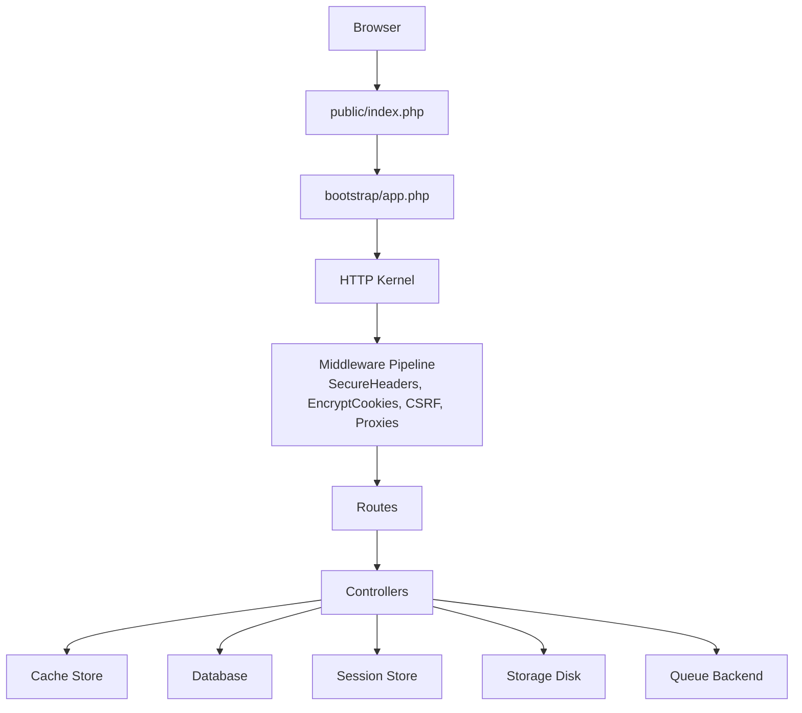
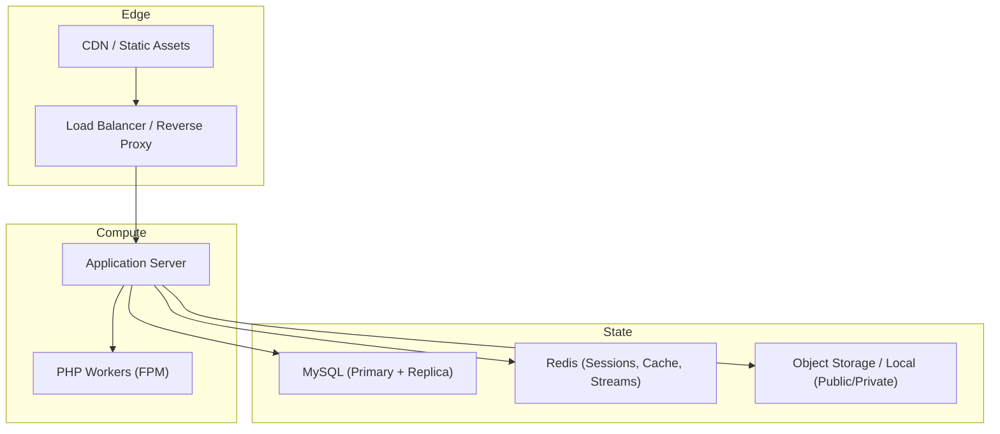
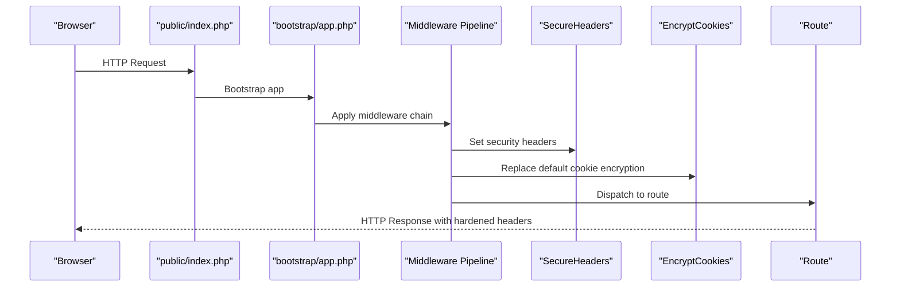
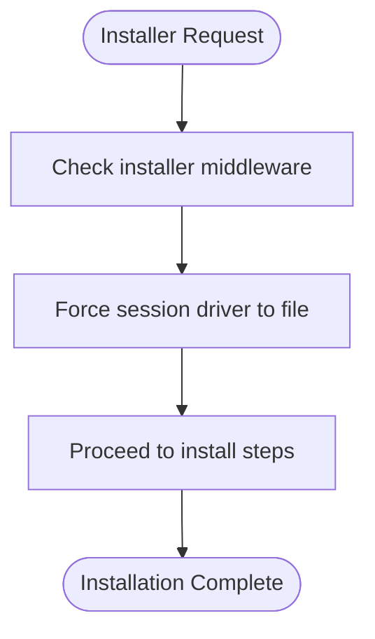
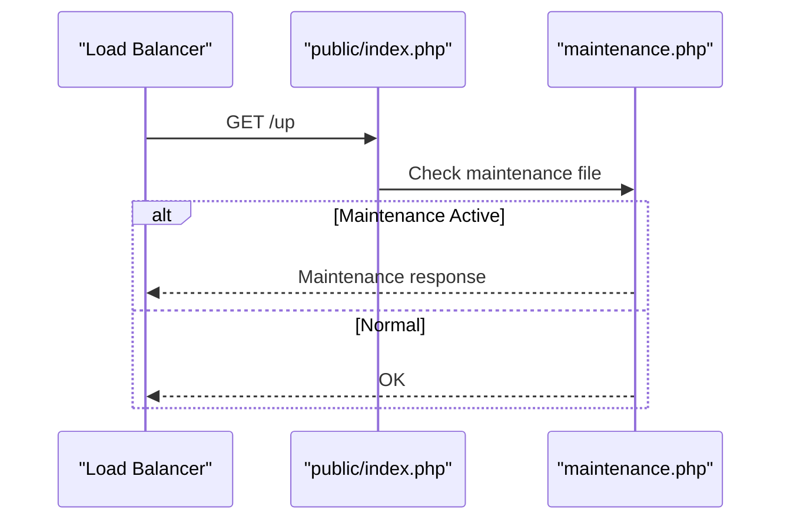
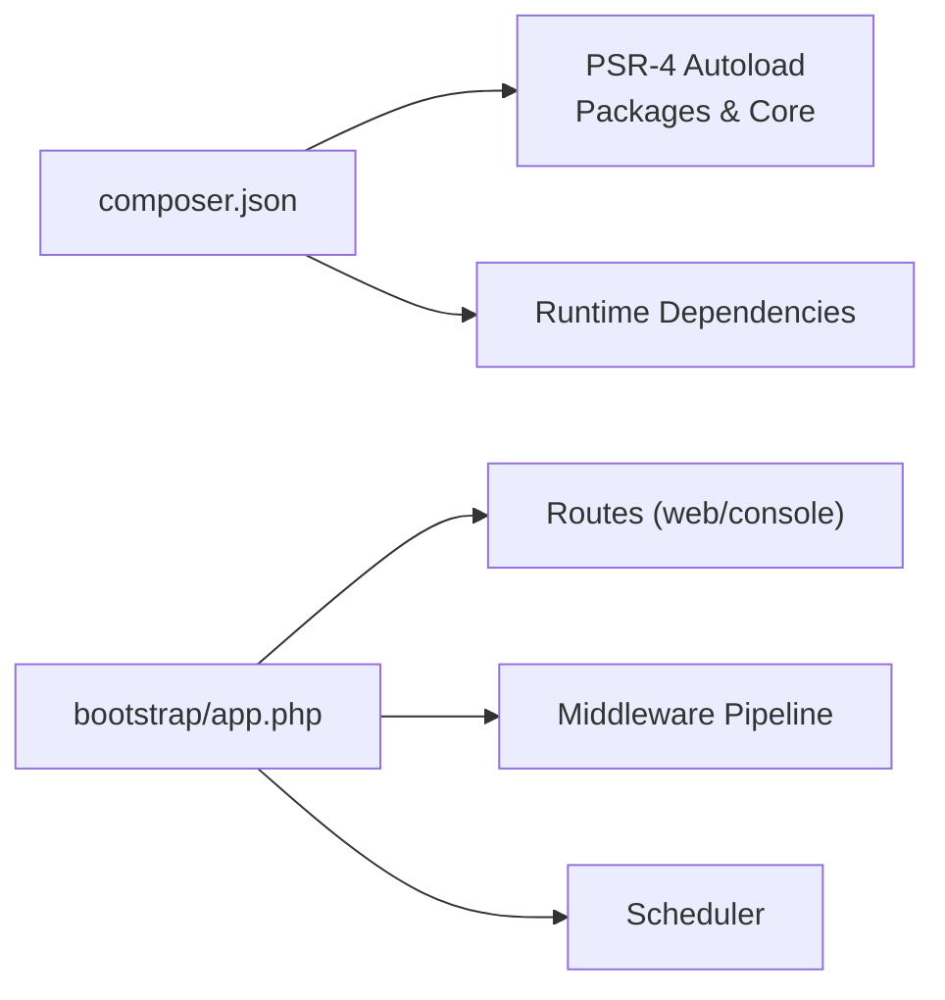
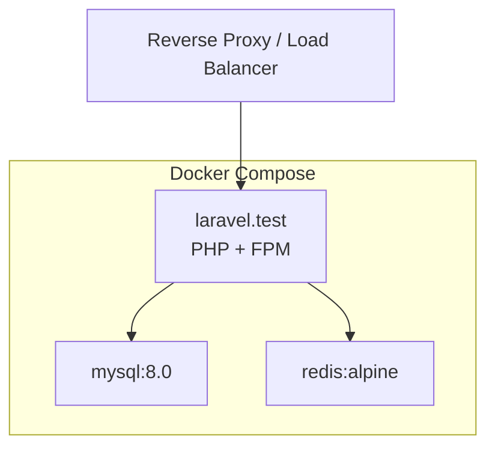

# Deployment & Operations

<cite>
**Referenced Files in This Document**
- [docker-compose.yml](file://docker-compose.yml)
- [composer.json](file://composer.json)
- [config/app.php](file://config/app.php)
- [config/cache.php](file://config/cache.php)
- [config/database.php](file://config/database.php)
- [config/session.php](file://config/session.php)
- [config/logging.php](file://config/logging.php)
- [config/queue.php](file://config/queue.php)
- [config/filesystems.php](file://config/filesystems.php)
- [config/sanctum.php](file://config/sanctum.php)
- [public/index.php](file://public/index.php)
- [bootstrap/app.php](file://bootstrap/app.php)
- [packages/Webkul/Core/src/Http/Middleware/SecureHeaders.php](file://packages/Webkul/Core/src/Http/Middleware/SecureHeaders.php)
- [packages/Webkul/Installer/src/Http/Middleware/UseFileSession.php](file://packages/Webkul/Installer/src/Http/Middleware/UseFileSession.php)
</cite>

## Table of Contents
1. [Introduction](#introduction)
2. [Project Structure](#project-structure)
3. [Core Components](#core-components)
4. [Architecture Overview](#architecture-overview)
5. [Detailed Component Analysis](#detailed-component-analysis)
6. [Dependency Analysis](#dependency-analysis)
7. [Performance Considerations](#performance-considerations)
8. [Security Hardening](#security-hardening)
9. [Containerization with Docker](#containerization-with-docker)
10. [Load Balancing and Scaling](#load-balancing-and-scaling)
11. [Monitoring and Logging](#monitoring-and-logging)
12. [Backup and Disaster Recovery](#backup-and-disaster-recovery)
13. [Upgrade Procedures and Maintenance](#upgrade-procedures-and-maintenance)
14. [Troubleshooting Guide](#troubleshooting-guide)
15. [Conclusion](#conclusion)

## Introduction
This document provides comprehensive guidance for deploying and operating Frooxi (Bagisto) in production environments. It covers infrastructure setup, containerization, load balancing, scaling, security hardening, monitoring, backups, upgrades, and operational troubleshooting. The content is grounded in the repository’s configuration and middleware layers to ensure accurate, actionable steps aligned with the codebase.

## Project Structure
Frooxi is a modular Laravel-based e-commerce platform. The runtime entry point is the public front controller, which boots the framework and routes requests through the configured middleware pipeline. Supporting configuration files define application behavior for caching, sessions, queues, logging, storage, and authentication.

**Diagram sources**
- [public/index.php:1-56](file://public/index.php#L1-L56)
- [bootstrap/app.php:14-55](file://bootstrap/app.php#L14-L55)
- [packages/Webkul/Core/src/Http/Middleware/SecureHeaders.php:24-49](file://packages/Webkul/Core/src/Http/Middleware/SecureHeaders.php#L24-L49)

**Section sources**
- [public/index.php:19-21](file://public/index.php#L19-L21)
- [public/index.php:47-53](file://public/index.php#L47-L53)
- [bootstrap/app.php:14-49](file://bootstrap/app.php#L14-L49)

## Core Components
- Application entry and lifecycle: The front controller initializes maintenance checks, autoloading, and hands off to the HTTP kernel.
- Middleware pipeline: Includes secure headers, custom cookie encryption, CSRF validation exclusions, and proxy trust configuration.
- Configuration surfaces: Centralized via config files for app behavior, cache, database, sessions, logging, queues, storage, and Sanctum.

Key operational levers:
- Maintenance mode driver and store selection.
- Cache store selection and key prefixing.
- Database connection defaults and Redis clustering/prefixing.
- Session driver, cookie policy, and encryption.
- Logging channels and retention.
- Queue backends and failed job handling.
- Storage disks and Cloudinary integration.
- Sanctum stateful domains.

**Section sources**
- [public/index.php:19-21](file://public/index.php#L19-L21)
- [public/index.php:47-53](file://public/index.php#L47-L53)
- [bootstrap/app.php:20-49](file://bootstrap/app.php#L20-L49)
- [config/app.php:182-185](file://config/app.php#L182-L185)
- [config/cache.php:18](file://config/cache.php#L18)
- [config/cache.php:106](file://config/cache.php#L106)
- [config/database.php:19](file://config/database.php#L19)
- [config/database.php:144-180](file://config/database.php#L144-L180)
- [config/session.php:21](file://config/session.php#L21)
- [config/session.php:130-133](file://config/session.php#L130-L133)
- [config/session.php:172](file://config/session.php#L172)
- [config/session.php:202](file://config/session.php#L202)
- [config/logging.php:21](file://config/logging.php#L21)
- [config/logging.php:68-74](file://config/logging.php#L68-L74)
- [config/queue.php:16](file://config/queue.php#L16)
- [config/queue.php:107](file://config/queue.php#L107)
- [config/filesystems.php:16](file://config/filesystems.php#L16)
- [config/filesystems.php:55-74](file://config/filesystems.php#L55-L74)
- [config/sanctum.php:21](file://config/sanctum.php#L21)

## Architecture Overview
Production-grade architecture requires separation of concerns across compute, stateful stores, and external integrations. The following diagram maps the repository’s configuration to a scalable, secure topology.

[No sources needed since this diagram shows conceptual workflow, not actual code structure]

## Detailed Component Analysis

### Middleware and Security Headers
The application sets robust security headers and customizes cookie encryption and CSRF behavior. This is applied globally through the middleware pipeline.

**Diagram sources**
- [public/index.php:47-53](file://public/index.php#L47-L53)
- [bootstrap/app.php:20-49](file://bootstrap/app.php#L20-L49)
- [packages/Webkul/Core/src/Http/Middleware/SecureHeaders.php:24-49](file://packages/Webkul/Core/src/Http/Middleware/SecureHeaders.php#L24-L49)

**Section sources**
- [packages/Webkul/Core/src/Http/Middleware/SecureHeaders.php:43-48](file://packages/Webkul/Core/src/Http/Middleware/SecureHeaders.php#L43-L48)
- [bootstrap/app.php:42-46](file://bootstrap/app.php#L42-L46)

### Installation-Time Session Behavior
During installation, the system forces file-based sessions to avoid database dependency until the environment is fully configured.

**Diagram sources**
- [packages/Webkul/Installer/src/Http/Middleware/UseFileSession.php:19-25](file://packages/Webkul/Installer/src/Http/Middleware/UseFileSession.php#L19-L25)

**Section sources**
- [packages/Webkul/Installer/src/Http/Middleware/UseFileSession.php:19-25](file://packages/Webkul/Installer/src/Http/Middleware/UseFileSession.php#L19-L25)

### Health Checks and Maintenance Mode
The application exposes a health endpoint and supports maintenance mode via a file-based mechanism. This enables load balancers to probe readiness and operators to gracefully drain traffic.

**Diagram sources**
- [public/index.php:19-21](file://public/index.php#L19-L21)
- [bootstrap/app.php:18](file://bootstrap/app.php#L18)

**Section sources**
- [public/index.php:19-21](file://public/index.php#L19-L21)
- [bootstrap/app.php:18](file://bootstrap/app.php#L18)
- [config/app.php:182-185](file://config/app.php#L182-L185)

## Dependency Analysis
The application relies on Laravel’s ecosystem and several packages. The composer manifest defines runtime and autoload configuration, while the bootstrap pipeline wires routing, middleware, and scheduling.

**Diagram sources**
- [composer.json:58-81](file://composer.json#L58-L81)
- [bootstrap/app.php:14-52](file://bootstrap/app.php#L14-L52)

**Section sources**
- [composer.json:10-44](file://composer.json#L10-L44)
- [composer.json:58-81](file://composer.json#L58-L81)
- [bootstrap/app.php:14-52](file://bootstrap/app.php#L14-L52)

## Performance Considerations
- Cache strategy: Choose a distributed cache backend (e.g., Redis) for high throughput and low latency. Configure a unique cache prefix per environment to prevent key collisions.
- Session store: Prefer Redis-backed sessions for horizontal scaling and sticky-session-free deployments.
- Queue backends: Use Redis or SQS for asynchronous job processing to decouple I/O-bound tasks.
- Static assets: Serve public storage via CDN and object storage to reduce origin load.
- Database tuning: Use MySQL with appropriate connection pooling and read replicas for scale.
- PHP-FPM: Tune process manager settings and opcache for predictable performance.

[No sources needed since this section provides general guidance]

## Security Hardening
- Transport security: Enforce HTTPS at the edge and set Strict-Transport-Security via middleware.
- Cookie security: Enable secure, HTTP-only, and SameSite policies; customize cookie names per environment.
- CSRF protection: Maintain CSRF validation except for designated endpoints.
- Maintenance mode: Use centralized maintenance driver for coordinated outages.
- Proxy trust: Configure trusted proxies to preserve client IP and scheme.
- Sanctum domains: Define stateful domains explicitly to control API authentication.

**Section sources**
- [packages/Webkul/Core/src/Http/Middleware/SecureHeaders.php:43-48](file://packages/Webkul/Core/src/Http/Middleware/SecureHeaders.php#L43-L48)
- [config/session.php:172](file://config/session.php#L172)
- [config/session.php:202](file://config/session.php#L202)
- [config/session.php:130-133](file://config/session.php#L130-L133)
- [bootstrap/app.php:44-48](file://bootstrap/app.php#L44-L48)
- [config/app.php:182-185](file://config/app.php#L182-L185)
- [config/sanctum.php:21](file://config/sanctum.php#L21)

## Containerization with Docker
The repository includes a Sail-based docker-compose configuration suitable for development and can be adapted for production with additional orchestration and secrets management.

Operational notes:
- Build context and Dockerfile are defined under the Sail runtime path.
- Ports are configurable via environment variables.
- Health checks are defined for MySQL and Redis.
- Volumes persist database and Redis data locally.

**Diagram sources**
- [docker-compose.yml:1-74](file://docker-compose.yml#L1-L74)

**Section sources**
- [docker-compose.yml:3-8](file://docker-compose.yml#L3-L8)
- [docker-compose.yml:11-13](file://docker-compose.yml#L11-L13)
- [docker-compose.yml:43-50](file://docker-compose.yml#L43-L50)
- [docker-compose.yml:59-65](file://docker-compose.yml#L59-L65)

## Load Balancing and Scaling
- Horizontal scaling: Run multiple PHP workers behind a reverse proxy. Use sticky sessions only if necessary; otherwise, enable session store persistence (Redis).
- Health checks: Utilize the built-in health endpoint for readiness probes.
- Database: Employ read replicas and connection pooling; separate cache and session stores for scalability.
- CDN: Offload static assets and images to a CDN for global performance and reduced origin load.

[No sources needed since this section provides general guidance]

## Monitoring and Logging
- Logging channels: Use daily rotation with retention windows; integrate Slack or Papertrail for alerting.
- Metrics: Track request latency, error rates, queue backlog, and cache hit ratios.
- Tracing: Correlate logs with request IDs for end-to-end visibility.

**Section sources**
- [config/logging.php:21](file://config/logging.php#L21)
- [config/logging.php:68-74](file://config/logging.php#L68-L74)
- [config/logging.php:85-95](file://config/logging.php#L85-L95)

## Backup and Disaster Recovery
- Database: Regular logical backups of primary and replica; validate restore procedures periodically.
- Persistent data: Back up object storage buckets and local public/private storage mounts.
- Configuration: Version control environment-specific overrides; maintain a secure secrets vault.
- DR plan: Automate failover to standby replica; test recovery timelines and RPO/RTO targets.

[No sources needed since this section provides general guidance]

## Upgrade Procedures and Maintenance
- Pre-upgrade: Review release notes, test upgrades in staging, and back up databases and storage.
- Rolling updates: Use blue/green or rolling deployment to minimize downtime; leverage maintenance mode for coordinated restarts.
- Post-upgrade: Clear caches, rebuild autoloaders, run migrations, and verify health checks.

[No sources needed since this section provides general guidance]

## Troubleshooting Guide
Common areas to inspect:
- Maintenance mode: Verify the presence of the maintenance file and the health endpoint.
- Session issues: Confirm session driver alignment with infrastructure (file vs. Redis).
- Cache connectivity: Test cache store reachability and key prefix correctness.
- Queue failures: Inspect failed job tables and retry configurations.
- Storage permissions: Validate disk visibility and symbolic links for public storage.

**Section sources**
- [public/index.php:19-21](file://public/index.php#L19-L21)
- [config/session.php:21](file://config/session.php#L21)
- [config/cache.php:18](file://config/cache.php#L18)
- [config/queue.php:107](file://config/queue.php#L107)
- [config/filesystems.php:89-91](file://config/filesystems.php#L89-L91)

## Conclusion
Deploying Frooxi in production requires a secure, scalable foundation with robust observability and resilient operations. The repository’s configuration and middleware layers provide strong defaults—extend them with proper infrastructure, monitoring, and disciplined change management to achieve reliable, high-performance operations.