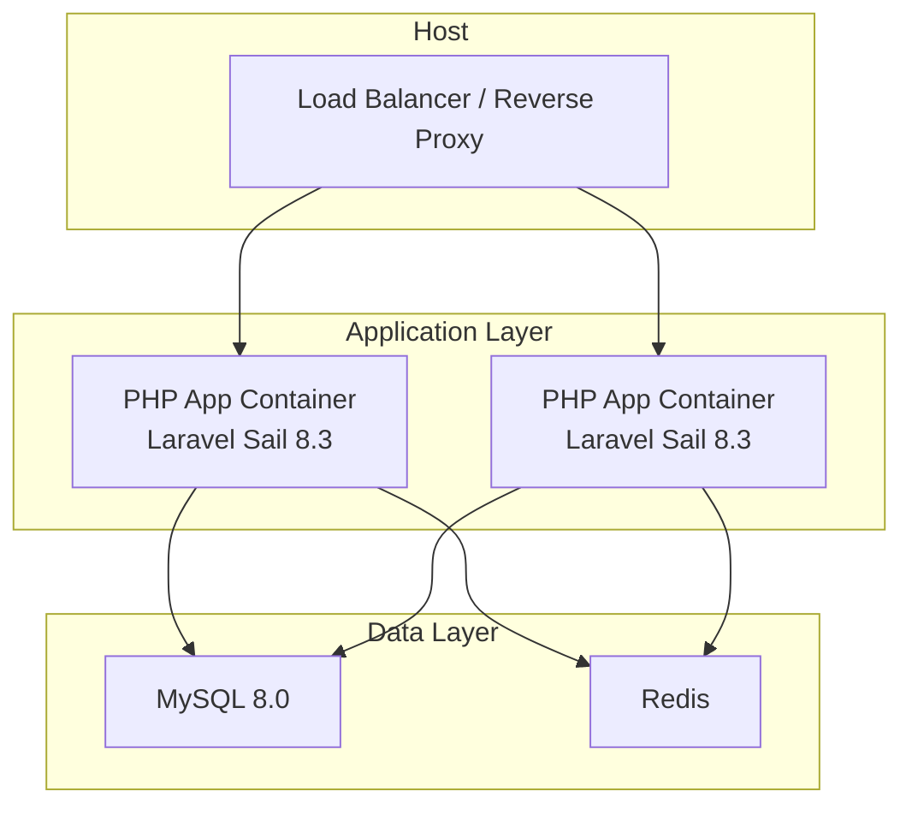
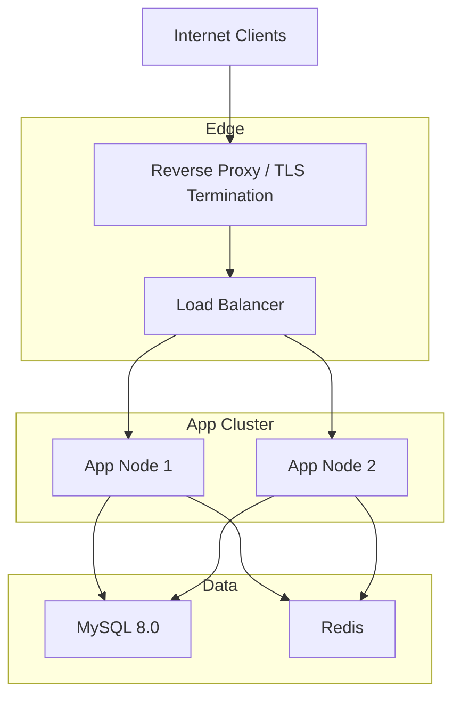
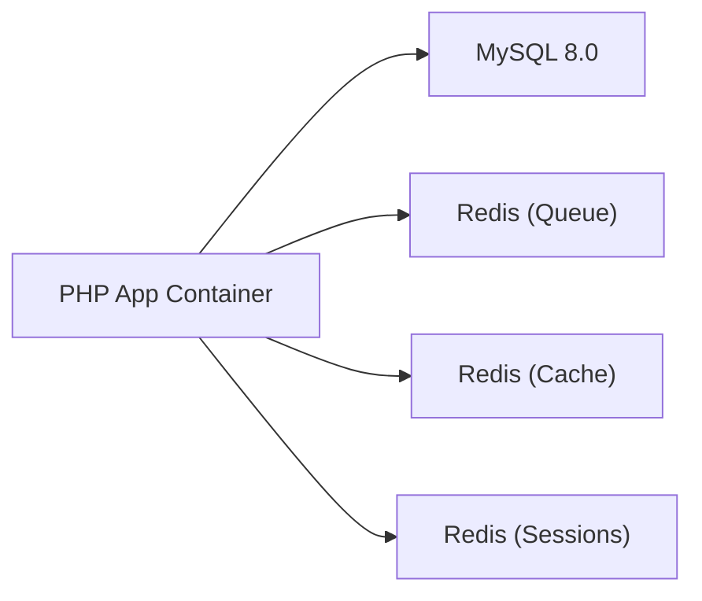

# Infrastructure Setup

<cite>
**Referenced Files in This Document**
- [docker-compose.yml](file://docker-compose.yml)
- [composer.json](file://composer.json)
- [config/database.php](file://config/database.php)
- [config/cache.php](file://config/cache.php)
- [config/queue.php](file://config/queue.php)
- [config/session.php](file://config/session.php)
- [config/broadcasting.php](file://config/broadcasting.php)
- [config/filesystems.php](file://config/filesystems.php)
- [config/logging.php](file://config/logging.php)
- [config/app.php](file://config/app.php)
- [README.md](file://README.md)
- [database/migrations/2014_10_12_000000_create_users_table.php](file://database/migrations/2014_10_12_000000_create_users_table.php)
- [database/migrations/2020_12_27_121950_create_jobs_table.php](file://database/migrations/2020_12_27_121950_create_jobs_table.php)
- [database/migrations/2026_02_03_151924_create_sessions_table.php](file://database/migrations/2026_02_03_151924_create_sessions_table.php)
</cite>

## Table of Contents
1. [Introduction](#introduction)
2. [Project Structure](#project-structure)
3. [Core Components](#core-components)
4. [Architecture Overview](#architecture-overview)
5. [Detailed Component Analysis](#detailed-component-analysis)
6. [Dependency Analysis](#dependency-analysis)
7. [Performance Considerations](#performance-considerations)
8. [Troubleshooting Guide](#troubleshooting-guide)
9. [Conclusion](#conclusion)
10. [Appendices](#appendices)

## Introduction
This document provides comprehensive infrastructure setup guidance for deploying Frooxi (Laravel-based e-commerce) in production-like environments. It covers server requirements, containerization with Docker, environment configuration, database and Redis setup, service dependencies, hardware recommendations, load balancing and reverse proxy configuration, SSL and DNS, and multi-server/clustering considerations.

## Project Structure
Frooxi is a Laravel application with modular packages and a Docker-first development setup. The repository includes:
- A Docker Compose configuration that provisions the PHP application container, MySQL 8.0, and Redis.
- Laravel configuration files for database, cache, queues, sessions, broadcasting, filesystems, logging, and application settings.
- Database migrations for core tables including users, jobs, failed jobs, job batches, sessions, and agent conversations.

**Diagram sources**
- [docker-compose.yml:1-74](file://docker-compose.yml#L1-L74)
- [config/database.php:45-63](file://config/database.php#L45-L63)
- [config/cache.php:74-78](file://config/cache.php#L74-L78)
- [config/queue.php:66-73](file://config/queue.php#L66-L73)

**Section sources**
- [docker-compose.yml:1-74](file://docker-compose.yml#L1-L74)
- [README.md:58-65](file://README.md#L58-L65)

## Core Components
- PHP runtime and application: Laravel Sail-based PHP 8.3 container with required extensions and dependencies.
- Database: MySQL 8.0 container with health checks and initialization scripts.
- Cache/Session/Queue: Redis container for caching, sessions, and queue back-end.
- Networking: Bridge network for inter-service communication.
- Volumes: Persistent storage for MySQL and Redis data.

Key environment and configuration touchpoints:
- Application environment variables are read from .env and mapped into containers.
- Database connectivity is configured via environment-driven settings.
- Cache, queue, and session back-ends are configured to use Redis.
- Logging, filesystems, and broadcasting are configurable via environment variables.

**Section sources**
- [composer.json:10-44](file://composer.json#L10-L44)
- [docker-compose.yml:1-74](file://docker-compose.yml#L1-L74)
- [config/database.php:144-180](file://config/database.php#L144-L180)
- [config/cache.php:74-78](file://config/cache.php#L74-L78)
- [config/queue.php:66-73](file://config/queue.php#L66-L73)
- [config/session.php:21-76](file://config/session.php#L21-L76)

## Architecture Overview
The recommended production architecture separates concerns across containers and services:
- Reverse Proxy (Nginx/Traefik) terminates TLS and forwards HTTP to application nodes.
- Load Balancer distributes traffic across multiple PHP application instances.
- PHP application containers rely on MySQL for relational data and Redis for cache, sessions, and queues.
- Optional external services: object storage (Cloudinary/S3), email transport (SES/Sendmail), and monitoring/logging stacks.

**Diagram sources**
- [docker-compose.yml:27-65](file://docker-compose.yml#L27-L65)
- [config/database.php:45-63](file://config/database.php#L45-L63)
- [config/cache.php:74-78](file://config/cache.php#L74-L78)
- [config/queue.php:66-73](file://config/queue.php#L66-L73)

## Detailed Component Analysis

### PHP Runtime and Dependencies
- PHP requirement: 8.3+ as declared in composer.json.
- Required PHP extensions: calendar, curl, intl, mbstring, openssl, pdo, pdo_mysql, tokenizer.
- Application framework: Laravel 12.x.
- Additional libraries: Redis client, response caching, Excel, PDF generation, QR codes, sanitization, socialite, tinker, UI scaffolding, and more.

Operational implications:
- Ensure the host OS and container runtime support PHP 8.3+ and the listed extensions.
- Use a modern Linux distribution with package managers capable of installing required PHP extensions.

**Section sources**
- [composer.json:10-44](file://composer.json#L10-L44)

### Database: MySQL 8.0
- The Docker Compose service uses the official MySQL 8.0 image.
- Environment variables configure root password, database, user, and permissions.
- Health checks use mysqladmin ping to validate readiness.
- Initialization script mounts to create a testing database on first boot.

Production considerations:
- Use strong credentials and restrict root access.
- Enable SSL/TLS for client connections and enforce strict network policies.
- Back up regularly and monitor slow queries and buffer pool metrics.

**Section sources**
- [docker-compose.yml:27-50](file://docker-compose.yml#L27-L50)
- [config/database.php:45-63](file://config/database.php#L45-L63)

### Cache, Sessions, and Queues: Redis
- Redis is used for cache, sessions, and queues.
- Configuration supports separate logical databases for cache vs. session vs. default.
- Queue driver supports Redis with configurable connection and retry behavior.

Operational implications:
- Use Redis persistence (RDB/AOF) and replication for HA.
- Tune maxmemory and eviction policies per workload.
- Separate Redis instance(s) for cache and sessions if isolation is required.

**Section sources**
- [config/cache.php:74-78](file://config/cache.php#L74-L78)
- [config/session.php:21-76](file://config/session.php#L21-L76)
- [config/queue.php:66-73](file://config/queue.php#L66-L73)
- [config/database.php:144-180](file://config/database.php#L144-L180)

### Docker Containerization and docker-compose.yml
- Application service builds from Laravel Sail’s PHP 8.3 runtime.
- Ports published for HTTP and Vite dev server.
- Depends on MySQL and Redis services.
- MySQL and Redis expose ports with health checks.
- Networks and volumes are defined for inter-service connectivity and persistence.

Environment variable mapping:
- Variables such as APP_PORT, VITE_PORT, FORWARD_DB_PORT, FORWARD_REDIS_PORT, DB_* and REDIS_* are used to configure ports and credentials.

**Section sources**
- [docker-compose.yml:1-74](file://docker-compose.yml#L1-L74)

### Environment Variable Configuration
Critical environment variables (selected):
- Application: APP_NAME, APP_ENV, APP_DEBUG, APP_URL, APP_ADMIN_URL, APP_TIMEZONE, APP_LOCALE, APP_KEY, LOG_CHANNEL.
- Database: DB_CONNECTION, DB_HOST, DB_PORT, DB_DATABASE, DB_USERNAME, DB_PASSWORD, DB_CHARSET, DB_COLLATION.
- Redis: REDIS_CLIENT, REDIS_CLUSTER, REDIS_PREFIX, REDIS_HOST, REDIS_PORT, REDIS_DB, REDIS_CACHE_DB, REDIS_SESSION_DATABASE.
- Cache: CACHE_STORE, CACHE_PREFIX.
- Queue: QUEUE_CONNECTION, REDIS_QUEUE, REDIS_QUEUE_CONNECTION.
- Session: SESSION_DRIVER, SESSION_LIFETIME, SESSION_CONNECTION, SESSION_TABLE, SESSION_SECURE_COOKIE, SESSION_SAME_SITE.
- Broadcasting: BROADCAST_DRIVER, PUSHER_*.
- Filesystems: FILESYSTEM_DISK, AWS_* for S3, CLOUDINARY_* for Cloudinary.
- Logging: LOG_CHANNEL, LOG_STACK, LOG_LEVEL, LOG_SLACK_WEBHOOK_URL, PAPERTRAIL_*.

Notes:
- The application reads these values via env() helpers in configuration files.
- For production, store secrets externally (e.g., secret managers) and mount them securely.

**Section sources**
- [config/app.php:16-161](file://config/app.php#L16-L161)
- [config/database.php:19-180](file://config/database.php#L19-L180)
- [config/cache.php:18-106](file://config/cache.php#L18-L106)
- [config/queue.php:16-110](file://config/queue.php#L16-L110)
- [config/session.php:21-215](file://config/session.php#L21-L215)
- [config/broadcasting.php:18-55](file://config/broadcasting.php#L18-L55)
- [config/filesystems.php:16-74](file://config/filesystems.php#L16-L74)
- [config/logging.php:21-132](file://config/logging.php#L21-L132)

### Database Setup and Schema
- Users table and related authentication tables are included.
- Job-related tables (jobs, failed_jobs, job_batches) support queue processing.
- Sessions table supports database-backed sessions.
- Agent conversations table indicates extended messaging features.

Recommendations:
- Run migrations after connecting to the target database.
- Use read replicas for heavy read workloads and partition large tables if needed.
- Monitor slow queries and maintain optimal indexing.

**Section sources**
- [database/migrations/2014_10_12_000000_create_users_table.php](file://database/migrations/2014_10_12_000000_create_users_table.php)
- [database/migrations/2020_12_27_121950_create_jobs_table.php](file://database/migrations/2020_12_27_121950_create_jobs_table.php)
- [database/migrations/2026_02_03_151924_create_sessions_table.php](file://database/migrations/2026_02_03_151924_create_sessions_table.php)

### Service Dependencies
- Application depends on MySQL and Redis.
- Queue processing relies on Redis.
- Sessions can be stored in database or Redis depending on configuration.
- Cache can use Redis or file/database backends.

**Section sources**
- [docker-compose.yml:24-26](file://docker-compose.yml#L24-L26)
- [config/queue.php:66-73](file://config/queue.php#L66-L73)
- [config/session.php:21-76](file://config/session.php#L21-L76)
- [config/cache.php:74-78](file://config/cache.php#L74-L78)

### Reverse Proxy and Load Balancer
- Place a reverse proxy (e.g., Nginx/Traefik/Caddy) in front of the application cluster.
- Terminate TLS at the proxy using valid certificates.
- Forward HTTP to multiple application nodes behind a load balancer.
- Configure sticky sessions if required by session storage strategy.

[No sources needed since this section provides general guidance]

### SSL Certificates, Domains, and DNS
- Obtain certificates from a trusted CA or ACME-compatible provider.
- Bind certificates at the reverse proxy level.
- Point domains to the load balancer IP(s) via DNS A/AAAA records.
- Configure wildcard or SAN certificates if serving multiple subdomains.

[No sources needed since this section provides general guidance]

### Multi-Server Deployment and Clustering
- Scale PHP application containers horizontally behind a load balancer.
- Use a shared, highly available MySQL cluster or managed service.
- Use a dedicated Redis cluster with replication and failover.
- Ensure consistent application keys and environment across nodes.
- Use persistent volumes or managed block storage for logs and uploaded assets.

[No sources needed since this section provides general guidance]

## Dependency Analysis
The application’s runtime dependencies and their relationships:

**Diagram sources**
- [docker-compose.yml:27-65](file://docker-compose.yml#L27-L65)
- [config/database.php:45-63](file://config/database.php#L45-L63)
- [config/cache.php:74-78](file://config/cache.php#L74-L78)
- [config/queue.php:66-73](file://config/queue.php#L66-L73)
- [config/session.php:21-76](file://config/session.php#L21-L76)

**Section sources**
- [docker-compose.yml:24-26](file://docker-compose.yml#L24-L26)
- [config/database.php:19-180](file://config/database.php#L19-L180)

## Performance Considerations
- PHP and MySQL: Tune opcache, query cache, and connection pooling. Use prepared statements and limit N+1 queries.
- Redis: Set appropriate maxmemory policies, enable persistence, and shard if needed.
- Queues: Use multiple Redis queues and workers; monitor backlog and dead-letter handling.
- Sessions: Prefer Redis sessions for horizontal scaling; set reasonable TTLs.
- Caching: Use Redis cache with proper key prefixes; invalidate proactively.
- Storage: Offload static assets to CDN or S3; enable compression and caching headers.

[No sources needed since this section provides general guidance]

## Troubleshooting Guide
Common areas to inspect:
- Database connectivity: Verify host, port, credentials, and charset/collation.
- Redis availability: Confirm health checks and connectivity from application.
- Queue processing: Check queue names, retry windows, and failed job tables.
- Sessions: Ensure session driver alignment with storage (database vs. Redis).
- Logs: Review stack logs and daily rotation settings; integrate with centralized logging if applicable.

**Section sources**
- [docker-compose.yml:43-50](file://docker-compose.yml#L43-L50)
- [config/database.php:45-63](file://config/database.php#L45-L63)
- [config/queue.php:66-73](file://config/queue.php#L66-L73)
- [config/session.php:21-76](file://config/session.php#L21-L76)
- [config/logging.php:53-132](file://config/logging.php#L53-L132)

## Conclusion
Frooxi’s infrastructure can be deployed effectively using the provided Docker Compose setup as a foundation. For production, extend the setup with a reverse proxy, load balancer, managed database and Redis services, robust TLS and DNS, and operational tooling for monitoring and backups. Align environment variables with your deployment model and scale horizontally as demand grows.

[No sources needed since this section summarizes without analyzing specific files]

## Appendices

### Hardware Recommendations (Guidelines)
- CPU: Multi-core x86_64 or ARM64; allocate cores proportionally to PHP workers and queues.
- Memory: Minimum 4 GB for development; scale to 8–32 GB for production depending on traffic and cache needs.
- Storage: SSD NVMe preferred; provision sufficient IOPS for MySQL and Redis.
- Network: 1 Gbps minimum; 10 Gbps for high-throughput environments.

[No sources needed since this section provides general guidance]

### Environment Variables Reference (Selected)
- Application: APP_NAME, APP_ENV, APP_DEBUG, APP_URL, APP_ADMIN_URL, APP_TIMEZONE, APP_LOCALE, APP_KEY, LOG_CHANNEL
- Database: DB_CONNECTION, DB_HOST, DB_PORT, DB_DATABASE, DB_USERNAME, DB_PASSWORD, DB_CHARSET, DB_COLLATION
- Redis: REDIS_CLIENT, REDIS_CLUSTER, REDIS_PREFIX, REDIS_HOST, REDIS_PORT, REDIS_DB, REDIS_CACHE_DB, REDIS_SESSION_DATABASE
- Cache: CACHE_STORE, CACHE_PREFIX
- Queue: QUEUE_CONNECTION, REDIS_QUEUE, REDIS_QUEUE_CONNECTION
- Session: SESSION_DRIVER, SESSION_LIFETIME, SESSION_CONNECTION, SESSION_TABLE, SESSION_SECURE_COOKIE, SESSION_SAME_SITE
- Broadcasting: BROADCAST_DRIVER, PUSHER_APP_KEY, PUSHER_APP_SECRET, PUSHER_APP_ID, PUSHER_APP_CLUSTER
- Filesystems: FILESYSTEM_DISK, AWS_ACCESS_KEY_ID, AWS_SECRET_ACCESS_KEY, AWS_DEFAULT_REGION, AWS_BUCKET, AWS_URL, AWS_ENDPOINT, CLOUDINARY_CLOUD_NAME, CLOUDINARY_API_KEY, CLOUDINARY_API_SECRET
- Logging: LOG_CHANNEL, LOG_STACK, LOG_LEVEL, LOG_SLACK_WEBHOOK_URL, PAPERTRAIL_URL, PAPERTRAIL_PORT

**Section sources**
- [config/app.php:16-161](file://config/app.php#L16-L161)
- [config/database.php:19-180](file://config/database.php#L19-L180)
- [config/cache.php:18-106](file://config/cache.php#L18-L106)
- [config/queue.php:16-110](file://config/queue.php#L16-L110)
- [config/session.php:21-215](file://config/session.php#L21-L215)
- [config/broadcasting.php:18-55](file://config/broadcasting.php#L18-L55)
- [config/filesystems.php:16-74](file://config/filesystems.php#L16-L74)
- [config/logging.php:21-132](file://config/logging.php#L21-L132)