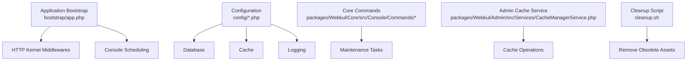
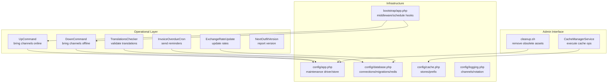
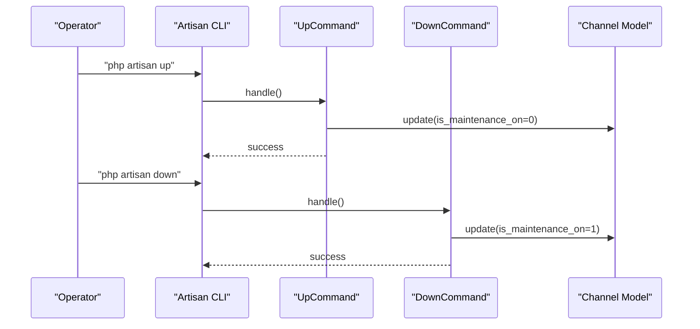
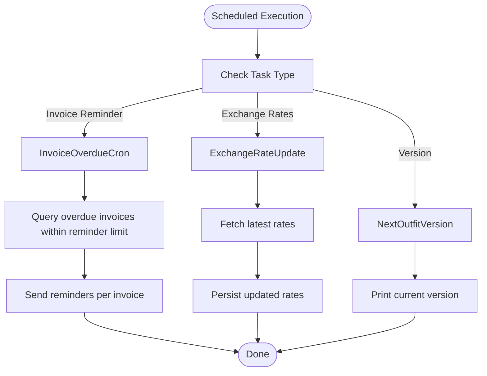
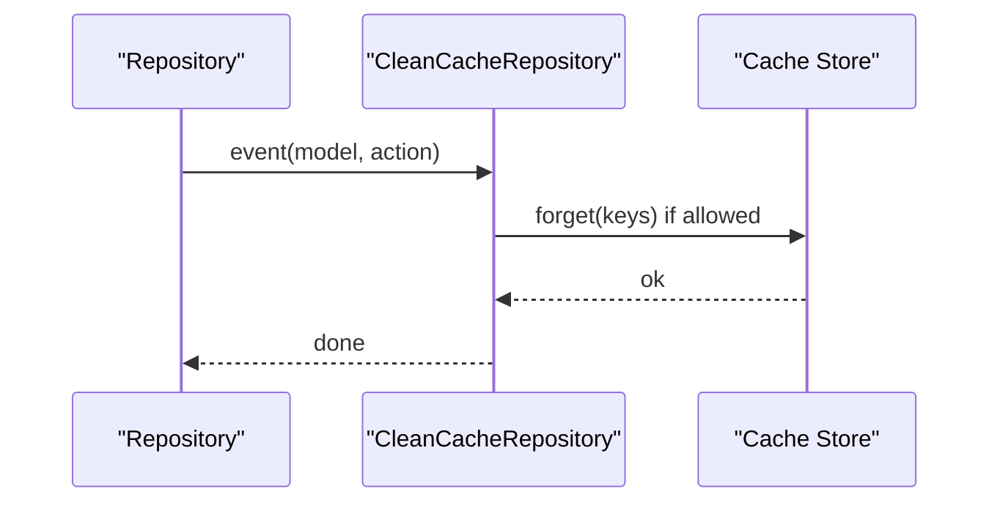
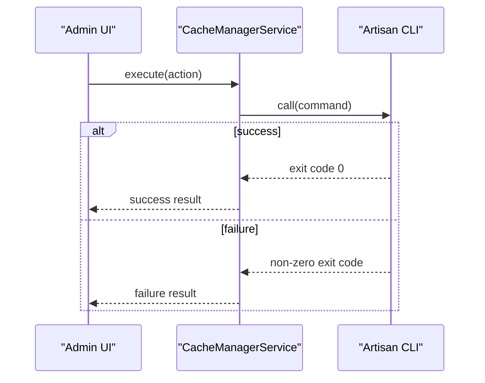
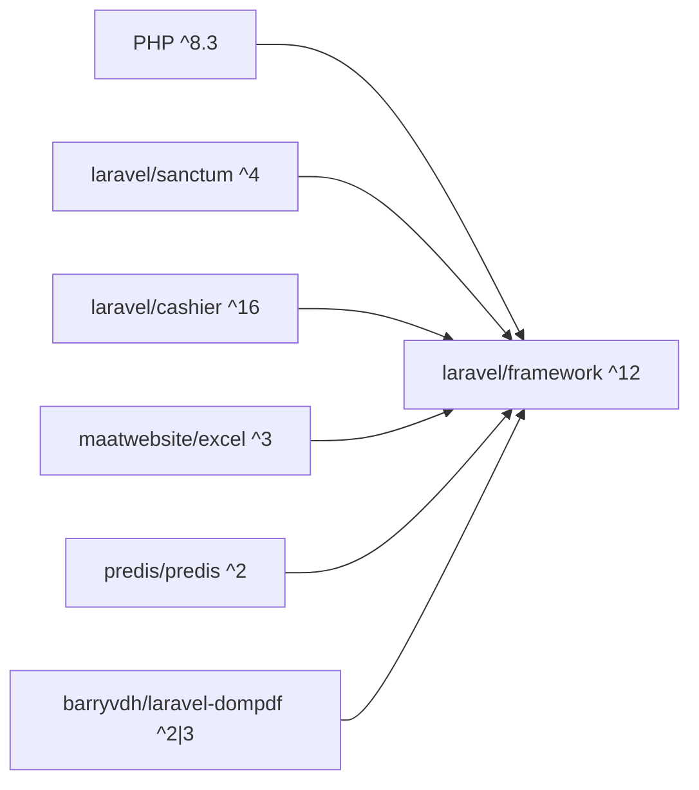

# Maintenance & Upgrades

<cite>
**Referenced Files in This Document**
- [UPGRADE.md](file://UPGRADE.md)
- [composer.json](file://composer.json)
- [config/app.php](file://config/app.php)
- [config/database.php](file://config/database.php)
- [config/cache.php](file://config/cache.php)
- [config/logging.php](file://config/logging.php)
- [bootstrap/app.php](file://bootstrap/app.php)
- [cleanup.sh](file://cleanup.sh)
- [packages/Webkul/Core/src/Console/Commands/UpCommand.php](file://packages/Webkul/Core/src/Console/Commands/UpCommand.php)
- [packages/Webkul/Core/src/Console/Commands/DownCommand.php](file://packages/Webkul/Core/src/Console/Commands/DownCommand.php)
- [packages/Webkul/Core/src/Console/Commands/InvoiceOverdueCron.php](file://packages/Webkul/Core/src/Console/Commands/InvoiceOverdueCron.php)
- [packages/Webkul/Core/src/Console/Commands/ExchangeRateUpdate.php](file://packages/Webkul/Core/src/Console/Commands/ExchangeRateUpdate.php)
- [packages/Webkul/Core/src/Console/Commands/TranslationsChecker.php](file://packages/Webkul/Core/src/Console/Commands/TranslationsChecker.php)
- [packages/Webkul/Core/src/Console/Commands/NextOutfitVersion.php](file://packages/Webkul/Core/src/Console/Commands/NextOutfitVersion.php)
- [packages/Webkul/Core/src/Listeners/CleanCacheRepository.php](file://packages/Webkul/Core/src/Listeners/CleanCacheRepository.php)
- [packages/Webkul/Admin/src/Services/CacheManagerService.php](file://packages/Webkul/Admin/src/Services/CacheManagerService.php)
</cite>

## Table of Contents
1. [Introduction](#introduction)
2. [Project Structure](#project-structure)
3. [Core Components](#core-components)
4. [Architecture Overview](#architecture-overview)
5. [Detailed Component Analysis](#detailed-component-analysis)
6. [Dependency Analysis](#dependency-analysis)
7. [Performance Considerations](#performance-considerations)
8. [Troubleshooting Guide](#troubleshooting-guide)
9. [Conclusion](#conclusion)
10. [Appendices](#appendices)

## Introduction
This document provides comprehensive maintenance and upgrade guidance for Frooxi operations. It covers upgrade procedures across versions, database migrations, asset compilation, routine maintenance tasks (cache, logs, database), backups, cleanup, storage optimization, disaster recovery, rollbacks, and emergency response. The content is grounded in the repository’s configuration, console commands, and operational scripts.

## Project Structure
Frooxi is a modular Laravel application. Key areas relevant to maintenance and upgrades include:
- Configuration: application, database, cache, logging
- Core console commands for maintenance and automation
- Admin cache management service
- Cleanup script for obsolete assets and routes
- Bootstrap configuration for middleware and scheduling hooks

**Diagram sources**
- [bootstrap/app.php:14-56](file://bootstrap/app.php#L14-L56)
- [config/database.php:1-183](file://config/database.php#L1-L183)
- [config/cache.php:1-109](file://config/cache.php#L1-L109)
- [config/logging.php:1-133](file://config/logging.php#L1-L133)
- [packages/Webkul/Core/src/Console/Commands/UpCommand.php:1-34](file://packages/Webkul/Core/src/Console/Commands/UpCommand.php#L1-L34)
- [packages/Webkul/Admin/src/Services/CacheManagerService.php:1-95](file://packages/Webkul/Admin/src/Services/CacheManagerService.php#L1-L95)
- [cleanup.sh:1-55](file://cleanup.sh#L1-L55)

**Section sources**
- [bootstrap/app.php:14-56](file://bootstrap/app.php#L14-L56)
- [config/database.php:1-183](file://config/database.php#L1-L183)
- [config/cache.php:1-109](file://config/cache.php#L1-L109)
- [config/logging.php:1-133](file://config/logging.php#L1-L133)
- [packages/Webkul/Core/src/Console/Commands/UpCommand.php:1-34](file://packages/Webkul/Core/src/Console/Commands/UpCommand.php#L1-L34)
- [packages/Webkul/Admin/src/Services/CacheManagerService.php:1-95](file://packages/Webkul/Admin/src/Services/CacheManagerService.php#L1-L95)
- [cleanup.sh:1-55](file://cleanup.sh#L1-L55)

## Core Components
- Maintenance mode commands: bring systems online/offline across channels
- Automated maintenance tasks: overdue invoices, exchange rate updates, version reporting
- Cache management: per-repository cache invalidation and admin-managed cache operations
- Logging configuration: daily rotation, Slack, syslog, stderr, and papertrail
- Database configuration: MySQL/MariaDB/Postgres/SQL Server connections and Redis options
- Upgrade guide: version-specific changes, dependencies, and migration steps

**Section sources**
- [packages/Webkul/Core/src/Console/Commands/UpCommand.php:1-34](file://packages/Webkul/Core/src/Console/Commands/UpCommand.php#L1-L34)
- [packages/Webkul/Core/src/Console/Commands/DownCommand.php:1-34](file://packages/Webkul/Core/src/Console/Commands/DownCommand.php#L1-L34)
- [packages/Webkul/Core/src/Console/Commands/InvoiceOverdueCron.php:1-48](file://packages/Webkul/Core/src/Console/Commands/InvoiceOverdueCron.php#L1-L48)
- [packages/Webkul/Core/src/Console/Commands/ExchangeRateUpdate.php:1-38](file://packages/Webkul/Core/src/Console/Commands/ExchangeRateUpdate.php#L1-L38)
- [packages/Webkul/Core/src/Console/Commands/NextOutfitVersion.php:1-43](file://packages/Webkul/Core/src/Console/Commands/NextOutfitVersion.php#L1-L43)
- [packages/Webkul/Core/src/Listeners/CleanCacheRepository.php:1-40](file://packages/Webkul/Core/src/Listeners/CleanCacheRepository.php#L1-L40)
- [packages/Webkul/Admin/src/Services/CacheManagerService.php:1-95](file://packages/Webkul/Admin/src/Services/CacheManagerService.php#L1-L95)
- [config/logging.php:1-133](file://config/logging.php#L1-L133)
- [config/database.php:1-183](file://config/database.php#L1-L183)

## Architecture Overview
The maintenance and upgrade architecture integrates configuration-driven behavior, console commands, and admin interfaces.

**Diagram sources**
- [packages/Webkul/Core/src/Console/Commands/UpCommand.php:1-34](file://packages/Webkul/Core/src/Console/Commands/UpCommand.php#L1-L34)
- [packages/Webkul/Core/src/Console/Commands/DownCommand.php:1-34](file://packages/Webkul/Core/src/Console/Commands/DownCommand.php#L1-L34)
- [packages/Webkul/Core/src/Console/Commands/InvoiceOverdueCron.php:1-48](file://packages/Webkul/Core/src/Console/Commands/InvoiceOverdueCron.php#L1-L48)
- [packages/Webkul/Core/src/Console/Commands/ExchangeRateUpdate.php:1-38](file://packages/Webkul/Core/src/Console/Commands/ExchangeRateUpdate.php#L1-L38)
- [packages/Webkul/Core/src/Console/Commands/TranslationsChecker.php:1-800](file://packages/Webkul/Core/src/Console/Commands/TranslationsChecker.php#L1-L800)
- [packages/Webkul/Core/src/Console/Commands/NextOutfitVersion.php:1-43](file://packages/Webkul/Core/src/Console/Commands/NextOutfitVersion.php#L1-L43)
- [config/app.php:182-185](file://config/app.php#L182-L185)
- [config/database.php:128-131](file://config/database.php#L128-L131)
- [config/cache.php:18-107](file://config/cache.php#L18-L107)
- [config/logging.php:21-133](file://config/logging.php#L21-L133)
- [bootstrap/app.php:14-56](file://bootstrap/app.php#L14-L56)
- [packages/Webkul/Admin/src/Services/CacheManagerService.php:1-95](file://packages/Webkul/Admin/src/Services/CacheManagerService.php#L1-L95)
- [cleanup.sh:1-55](file://cleanup.sh#L1-L55)

## Detailed Component Analysis

### Upgrade Process and Version Management
- Follow the official upgrade guide for version transitions, including dependency updates, breaking changes, and migration steps.
- Key upgrade topics include:
  - Laravel 12 upgrade and strict type handling
  - Google reCAPTCHA Enterprise integration changes
  - PayPal SDK upgrade to server-side SDK
  - Removal of visitor tracking and migration steps
  - Magic AI migration to Laravel AI SDK

Recommended procedure:
- Review the upgrade guide for your target version.
- Update PHP and dependencies as required.
- Run database migrations and seeders.
- Rebuild assets and cache.
- Validate payment and captcha integrations.
- Test reporting and analytics integrations.

**Section sources**
- [UPGRADE.md:1-505](file://UPGRADE.md#L1-L505)
- [composer.json:10-45](file://composer.json#L10-L45)

### Maintenance Mode Commands
- Bring all channels online/offline across the system using dedicated commands.
- These commands update channel maintenance flags and then invoke the underlying framework command.

**Diagram sources**
- [packages/Webkul/Core/src/Console/Commands/UpCommand.php:15-32](file://packages/Webkul/Core/src/Console/Commands/UpCommand.php#L15-L32)
- [packages/Webkul/Core/src/Console/Commands/DownCommand.php:15-32](file://packages/Webkul/Core/src/Console/Commands/DownCommand.php#L15-L32)

**Section sources**
- [packages/Webkul/Core/src/Console/Commands/UpCommand.php:1-34](file://packages/Webkul/Core/src/Console/Commands/UpCommand.php#L1-L34)
- [packages/Webkul/Core/src/Console/Commands/DownCommand.php:1-34](file://packages/Webkul/Core/src/Console/Commands/DownCommand.php#L1-L34)
- [config/app.php:182-185](file://config/app.php#L182-L185)

### Automated Maintenance Tasks
- Overdue invoice reminders: scheduled job sends reminders for invoices within limits.
- Exchange rate updates: periodic job updates currency exchange rates.
- Version reporting: displays current installed version.

**Diagram sources**
- [packages/Webkul/Core/src/Console/Commands/InvoiceOverdueCron.php:39-46](file://packages/Webkul/Core/src/Console/Commands/InvoiceOverdueCron.php#L39-L46)
- [packages/Webkul/Core/src/Console/Commands/ExchangeRateUpdate.php:27-36](file://packages/Webkul/Core/src/Console/Commands/ExchangeRateUpdate.php#L27-L36)
- [packages/Webkul/Core/src/Console/Commands/NextOutfitVersion.php:38-41](file://packages/Webkul/Core/src/Console/Commands/NextOutfitVersion.php#L38-L41)

**Section sources**
- [packages/Webkul/Core/src/Console/Commands/InvoiceOverdueCron.php:1-48](file://packages/Webkul/Core/src/Console/Commands/InvoiceOverdueCron.php#L1-L48)
- [packages/Webkul/Core/src/Console/Commands/ExchangeRateUpdate.php:1-38](file://packages/Webkul/Core/src/Console/Commands/ExchangeRateUpdate.php#L1-L38)
- [packages/Webkul/Core/src/Console/Commands/NextOutfitVersion.php:1-43](file://packages/Webkul/Core/src/Console/Commands/NextOutfitVersion.php#L1-L43)

### Cache Management
- Per-repository cache invalidation via listener to keep cached data consistent.
- Admin-managed cache operations (clear/build) executed through a service wrapper around Artisan.

**Diagram sources**
- [packages/Webkul/Core/src/Listeners/CleanCacheRepository.php:12-38](file://packages/Webkul/Core/src/Listeners/CleanCacheRepository.php#L12-L38)

**Diagram sources**
- [packages/Webkul/Admin/src/Services/CacheManagerService.php:35-77](file://packages/Webkul/Admin/src/Services/CacheManagerService.php#L35-L77)

**Section sources**
- [packages/Webkul/Core/src/Listeners/CleanCacheRepository.php:1-40](file://packages/Webkul/Core/src/Listeners/CleanCacheRepository.php#L1-L40)
- [packages/Webkul/Admin/src/Services/CacheManagerService.php:1-95](file://packages/Webkul/Admin/src/Services/CacheManagerService.php#L1-L95)
- [config/cache.php:18-107](file://config/cache.php#L18-L107)

### Logging and Log Rotation
- Daily log rotation with configurable retention.
- Multiple channels: single, daily, slack, syslog, stderr, papertrail, stack.
- Placeholders and level-based filtering supported.

**Section sources**
- [config/logging.php:68-74](file://config/logging.php#L68-L74)
- [config/logging.php:53-133](file://config/logging.php#L53-L133)

### Database Configuration and Migrations
- Support for SQLite, MySQL, MariaDB, PostgreSQL, SQL Server.
- Migration repository table configuration.
- Redis client and connection options for cache/session.

**Section sources**
- [config/database.php:32-183](file://config/database.php#L32-L183)

### Asset Compilation and Build Pipeline
- Vite-based build pipeline for admin/shop assets.
- Manifest files and compiled assets under public/build and theme directories.
- Cleanup script removes obsolete CMS, marketing, booking, RMA, and tax-related assets.

**Section sources**
- [cleanup.sh:1-55](file://cleanup.sh#L1-L55)

### Translation Consistency Checks
- Validates translation files across packages and locales.
- Compares structure and keys against the canonical English locale.
- Reports missing/extra files and keys, with optional detailed output.

**Section sources**
- [packages/Webkul/Core/src/Console/Commands/TranslationsChecker.php:116-137](file://packages/Webkul/Core/src/Console/Commands/TranslationsChecker.php#L116-L137)

## Dependency Analysis
- PHP requirement is aligned with Laravel 12.
- Core dependencies include framework, Sanctum, Cashier, DomPDF, intervention/image, maatwebsite/excel, mpdf, redis clients, and others.
- Composer repositories symlink packages for development.

**Diagram sources**
- [composer.json:10-45](file://composer.json#L10-L45)

**Section sources**
- [composer.json:10-45](file://composer.json#L10-L45)

## Performance Considerations
- Use Redis-backed cache and session stores for scalability.
- Enable appropriate cache stores and prefixes to avoid collisions.
- Schedule recurring jobs for overdue reminders and exchange rate updates.
- Keep logs rotated to prevent disk pressure.

[No sources needed since this section provides general guidance]

## Troubleshooting Guide
Common issues and resolutions:
- Maintenance mode not applying: verify maintenance driver/store configuration and ensure commands are executed with sufficient privileges.
- Cache inconsistencies: confirm repository cache invalidation is enabled and listener is active; use admin cache manager to clear/build caches.
- Logging problems: adjust log channel levels and rotation days; verify Slack/Papertrail endpoints and credentials.
- Database connectivity: validate connection parameters and SSL options; ensure migration table exists and is writable.
- Upgrade regressions: review upgrade guide for breaking changes; re-run migrations and rebuild assets; validate third-party integrations (PayPal, reCAPTCHA).

**Section sources**
- [config/app.php:182-185](file://config/app.php#L182-L185)
- [packages/Webkul/Admin/src/Services/CacheManagerService.php:35-77](file://packages/Webkul/Admin/src/Services/CacheManagerService.php#L35-L77)
- [config/logging.php:21-133](file://config/logging.php#L21-L133)
- [config/database.php:128-131](file://config/database.php#L128-L131)
- [UPGRADE.md:19-505](file://UPGRADE.md#L19-L505)

## Conclusion
This maintenance and upgrade guide consolidates repository-backed practices for upgrades, migrations, caching, logging, database configuration, and cleanup. By following the documented procedures and leveraging the provided commands and services, Frooxi operations can be kept reliable, performant, and resilient.

[No sources needed since this section summarizes without analyzing specific files]

## Appendices

### Backup Strategies
- Database: use vendor-native tools (mysqldump, pg_dump, sqlcmd) with scheduled rotation.
- Files: snapshot public assets, storage/app/public, and configuration files.
- Configuration: maintain .env and config snapshots; version-control non-sensitive config files.

[No sources needed since this section provides general guidance]

### Disaster Recovery and Rollback
- Rollback plan: tag releases, retain last known good database dump, and pinned dependency versions.
- Restore steps: restore DB, redeploy code, run migrations, rebuild cache and assets, restart services.
- Emergency response: activate maintenance mode, scale monitoring/alerts, and follow incident playbooks.

[No sources needed since this section provides general guidance]

### Routine Maintenance Schedules
- Daily: rotate logs, prune old cache entries, send overdue invoice reminders.
- Weekly: update exchange rates, validate translations, review logs for anomalies.
- Monthly: audit storage usage, review cache hit ratios, refresh long-lived assets.

[No sources needed since this section provides general guidance]