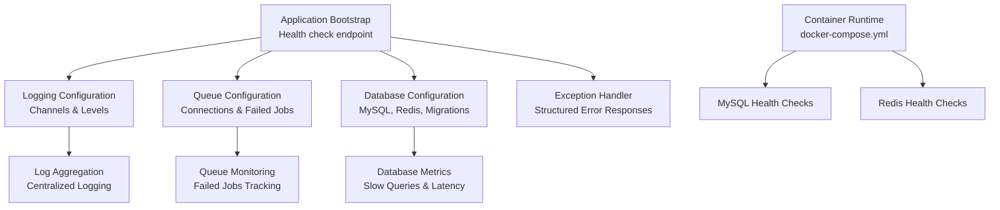
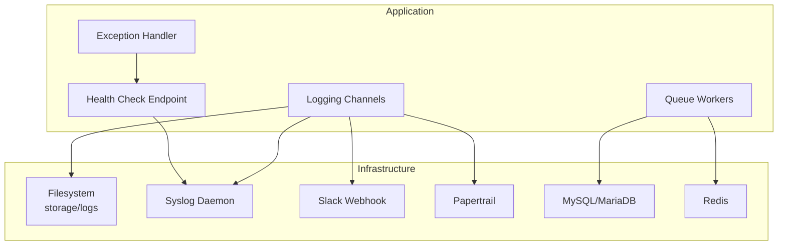
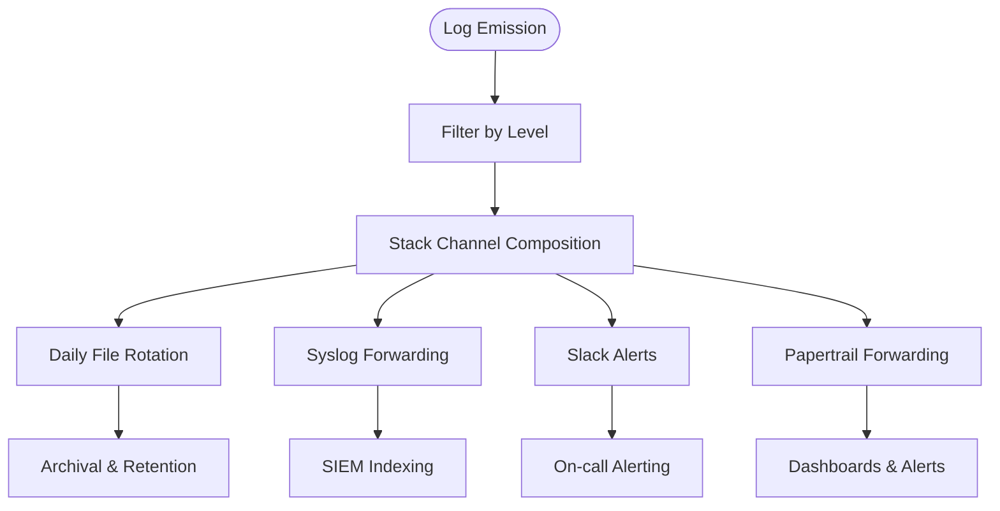
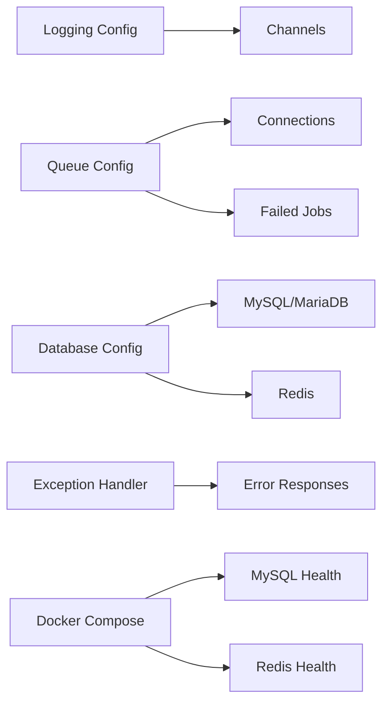

# Monitoring & Logging

<cite>
**Referenced Files in This Document**
- [logging.php](file://config/logging.php)
- [queue.php](file://config/queue.php)
- [database.php](file://config/database.php)
- [app.php](file://config/app.php)
- [app.php](file://bootstrap/app.php)
- [Handler.php](file://packages/Webkul/Core/src/Exceptions/Handler.php)
- [docker-compose.yml](file://docker-compose.yml)
- [storage/logs/.gitignore](file://storage/logs/.gitignore)
- [composer.json](file://composer.json)
</cite>

## Table of Contents
1. [Introduction](#introduction)
2. [Project Structure](#project-structure)
3. [Core Components](#core-components)
4. [Architecture Overview](#architecture-overview)
5. [Detailed Component Analysis](#detailed-component-analysis)
6. [Dependency Analysis](#dependency-analysis)
7. [Performance Considerations](#performance-considerations)
8. [Troubleshooting Guide](#troubleshooting-guide)
9. [Conclusion](#conclusion)
10. [Appendices](#appendices)

## Introduction
This document provides production-grade monitoring and logging guidance for Frooxi’s Bagisto-based application. It covers log rotation configuration, centralized logging setup, and log aggregation strategies. It also explains performance monitoring with Laravel Debugbar, queue monitoring, and database query optimization. Uptime monitoring, health checks, and alerting systems are addressed alongside application metrics collection, error tracking, and crash reporting. Finally, it outlines dashboard setup with Grafana and Prometheus and discusses log security, retention policies, and compliance requirements.

## Project Structure
The monitoring and logging surface in this codebase is primarily governed by:
- Logging configuration for channels, levels, and handlers
- Queue configuration for job execution and failure tracking
- Database configuration for connection and Redis-backed caching/session stores
- Exception handling for structured error responses
- Health check endpoint registration
- Containerized runtime with health checks for MySQL and Redis

**Diagram sources**
- [app.php:14-19](file://bootstrap/app.php#L14-L19)
- [logging.php:53-130](file://config/logging.php#L53-L130)
- [queue.php:31-110](file://config/queue.php#L31-L110)
- [database.php:32-180](file://config/database.php#L32-L180)
- [Handler.php:17-30](file://packages/Webkul/Core/src/Exceptions/Handler.php#L17-L30)
- [docker-compose.yml:43-50](file://docker-compose.yml#L43-L50)
- [docker-compose.yml:59-65](file://docker-compose.yml#L59-L65)

**Section sources**
- [app.php:14-19](file://bootstrap/app.php#L14-L19)
- [logging.php:53-130](file://config/logging.php#L53-L130)
- [queue.php:31-110](file://config/queue.php#L31-L110)
- [database.php:32-180](file://config/database.php#L32-L180)
- [Handler.php:17-30](file://packages/Webkul/Core/src/Exceptions/Handler.php#L17-L30)
- [docker-compose.yml:43-50](file://docker-compose.yml#L43-L50)
- [docker-compose.yml:59-65](file://docker-compose.yml#L59-L65)

## Core Components
- Logging subsystem: configurable channels (stack, single, daily, syslog, stderr, papertrail, slack), level control, and placeholders
- Queue subsystem: multiple drivers (database, redis, sqs, beanstalkd), retry windows, and failed job storage
- Database subsystem: MySQL/MariaDB/Postgres/SQLServer connections, Redis client options, and migration table configuration
- Exception handling: structured JSON responses for API errors and HTML views for web errors
- Health checks: application health endpoint registered at /up
- Container runtime: MySQL and Redis health checks via docker-compose

**Section sources**
- [logging.php:53-130](file://config/logging.php#L53-L130)
- [queue.php:31-110](file://config/queue.php#L31-L110)
- [database.php:32-180](file://config/database.php#L32-L180)
- [Handler.php:35-78](file://packages/Webkul/Core/src/Exceptions/Handler.php#L35-L78)
- [app.php:18-18](file://bootstrap/app.php#L18-L18)

## Architecture Overview
The monitoring architecture integrates logging, queues, databases, and container health checks. Logs are written to rotating files or forwarded to external systems. Queues process background jobs with failure tracking. Databases and Redis are monitored via container health checks. The application exposes a health endpoint for uptime monitoring.

**Diagram sources**
- [logging.php:53-130](file://config/logging.php#L53-L130)
- [queue.php:31-110](file://config/queue.php#L31-L110)
- [database.php:32-180](file://config/database.php#L32-L180)
- [Handler.php:94-116](file://packages/Webkul/Core/src/Exceptions/Handler.php#L94-L116)
- [app.php:18-18](file://bootstrap/app.php#L18-L18)

## Detailed Component Analysis

### Logging Configuration
- Default channel selection and deprecation logging channel
- Stack channel composition from comma-separated channel list
- Single and daily file channels with configurable retention days
- Slack, Papertrail (Syslog UDP), stderr, syslog, and errorlog handlers
- Placeholder replacement enabled for consistent log formatting

Operational guidance:
- Use the daily channel for production to enable automatic rotation
- Configure LOG_STACK to route to multiple channels (e.g., daily + slack)
- Set LOG_LEVEL to balance verbosity and performance
- For centralized logging, forward to Papertrail or syslog-compatible collectors

**Section sources**
- [logging.php:21-21](file://config/logging.php#L21-L21)
- [logging.php:34-37](file://config/logging.php#L34-L37)
- [logging.php:55-59](file://config/logging.php#L55-L59)
- [logging.php:61-74](file://config/logging.php#L61-L74)
- [logging.php:76-83](file://config/logging.php#L76-L83)
- [logging.php:85-95](file://config/logging.php#L85-L95)
- [logging.php:97-106](file://config/logging.php#L97-L106)
- [logging.php:108-113](file://config/logging.php#L108-L113)

### Log Rotation and Retention
- Daily rotation with configurable retention window
- Storage path for log files under storage/app/logs
- Git ignore policy excludes all files except .gitignore, ensuring logs are not committed

Recommendations:
- Enforce log archival and offloading to SIEM or log aggregators
- Define retention periods aligned with compliance (e.g., 90–365 days)
- Monitor disk usage and alert on low space near capacity

**Section sources**
- [logging.php:68-74](file://config/logging.php#L68-L74)
- [storage/logs/.gitignore:1-2](file://storage/logs/.gitignore#L1-L2)

### Centralized Logging Setup
- Papertrail handler configured via TLS UDP connection string
- Slack webhook handler for critical alerts
- Syslog handler for on-host forwarding
- Stderr handler for containerized environments

Implementation tips:
- Use syslog-ng or rsyslog to receive syslog and forward to Elasticsearch, Splunk, or Loki
- For containerized deployments, stream stderr to stdout/stderr and ingest via Fluent Bit/Fluentd
- Configure correlation IDs and structured JSON for easier filtering

**Section sources**
- [logging.php:85-95](file://config/logging.php#L85-L95)
- [logging.php:76-83](file://config/logging.php#L76-L83)
- [logging.php:108-113](file://config/logging.php#L108-L113)
- [logging.php:97-106](file://config/logging.php#L97-L106)

### Log Aggregation Strategies
- Combine stack channels to fan logs to multiple sinks (local files, Slack, syslog)
- Use daily channel for time-based rotation and retention
- Integrate with log collectors for indexing and querying

**Diagram sources**
- [logging.php:55-59](file://config/logging.php#L55-L59)
- [logging.php:68-74](file://config/logging.php#L68-L74)
- [logging.php:76-83](file://config/logging.php#L76-L83)
- [logging.php:85-95](file://config/logging.php#L85-L95)
- [logging.php:108-113](file://config/logging.php#L108-L113)

### Queue Monitoring
- Default connection configured to database
- Retry-after windows and failed job storage
- Multiple drivers supported (database, redis, sqs, beanstalkd)

Monitoring checklist:
- Track queue depth and consumer lag
- Monitor failed_jobs table for recurring failures
- Scale workers proportionally to queue backlog
- Use Redis metrics for pub/sub and blocking operations

**Section sources**
- [queue.php:16-16](file://config/queue.php#L16-L16)
- [queue.php:37-44](file://config/queue.php#L37-L44)
- [queue.php:88-91](file://config/queue.php#L88-L91)
- [queue.php:106-110](file://config/queue.php#L106-L110)

### Database Query Optimization
- Connection configuration for MySQL/MariaDB/Postgres/SQLServer
- Redis client options and cache/session databases
- Migration table configuration

Optimization strategies:
- Enable slow query log on MySQL and monitor with Grafana dashboards
- Use EXPLAIN/ANALYZE to review query plans
- Tune buffer pool sizes and connection pooling
- Leverage Redis for caching frequently accessed data

**Section sources**
- [database.php:32-115](file://config/database.php#L32-L115)
- [database.php:144-180](file://config/database.php#L144-L180)
- [database.php:128-131](file://config/database.php#L128-L131)

### Exception Handling and Error Tracking
- Structured JSON responses for API errors
- HTML error views for web requests
- Conditional rendering based on request namespace (admin/shop)

Operational guidance:
- Integrate with Sentry/Rollbar for error tracking and crash reporting
- Tag errors with correlation IDs and user context
- Monitor error rates and 5xx responses via health checks and logs

**Section sources**
- [Handler.php:35-78](file://packages/Webkul/Core/src/Exceptions/Handler.php#L35-L78)
- [Handler.php:94-116](file://packages/Webkul/Core/src/Exceptions/Handler.php#L94-L116)

### Uptime Monitoring and Health Checks
- Health endpoint registered at /up
- Container health checks for MySQL and Redis

Best practices:
- Probe /up with synthetic checks from multiple regions
- Combine with log-based metrics (error spikes) and queue backlog
- Alert on sustained degradation or complete downtime

**Section sources**
- [app.php:18-18](file://bootstrap/app.php#L18-L18)
- [docker-compose.yml:43-50](file://docker-compose.yml#L43-L50)
- [docker-compose.yml:59-65](file://docker-compose.yml#L59-L65)

### Performance Monitoring with Laravel Debugbar
- Debugbar is available in the vendor directory; enable only in non-production environments
- Use for profiling queries, rendering time, memory usage, and event listeners

Guidance:
- Limit Debugbar usage to staging or development
- Prefer built-in database query logging for production insights
- Correlate slow endpoints with queue and cache operations

**Section sources**
- [composer.json](file://composer.json)

### Application Metrics Collection
- Collect logs, queue metrics, and database performance indicators
- Export metrics to Prometheus and visualize in Grafana dashboards

Recommended metrics:
- Request latency and error rate
- Queue backlog and job duration
- Database slow query count and replication lag
- Cache hit ratio and TTL distributions

[No sources needed since this section provides general guidance]

### Alerting Systems
- Slack alerts for critical logs
- Papertrail for centralized ingestion and alerting
- Container health checks for infrastructure-level alerts

Implementation tips:
- Define SLOs and thresholds for error rates and latency
- Route alerts to Slack channels and PagerDuty for on-call
- Include runbooks and escalation paths

**Section sources**
- [logging.php:76-83](file://config/logging.php#L76-L83)
- [logging.php:85-95](file://config/logging.php#L85-L95)

### Dashboard Setup with Grafana and Prometheus
- Grafana dashboards for logs, queues, and database metrics
- Prometheus scraping application logs and infrastructure metrics

Steps:
- Install Prometheus and Grafana
- Configure Prometheus scrape configs for application and exporters
- Import prebuilt dashboards or build custom panels for key metrics

[No sources needed since this section provides general guidance]

### Log Security, Retention Policies, and Compliance
- Restrict access to log directories and containers
- Use TLS for log forwarding (Papertrail)
- Apply retention policies aligned with regulatory requirements
- Audit sensitive data and redact PII before shipping logs

[No sources needed since this section provides general guidance]

## Dependency Analysis
The monitoring stack depends on:
- Logging configuration for channel routing and levels
- Queue configuration for job lifecycle visibility
- Database configuration for connection and cache metrics
- Exception handler for structured error reporting
- Container runtime for infrastructure health signals

**Diagram sources**
- [logging.php:53-130](file://config/logging.php#L53-L130)
- [queue.php:31-110](file://config/queue.php#L31-L110)
- [database.php:32-180](file://config/database.php#L32-L180)
- [Handler.php:94-116](file://packages/Webkul/Core/src/Exceptions/Handler.php#L94-L116)
- [docker-compose.yml:43-50](file://docker-compose.yml#L43-L50)
- [docker-compose.yml:59-65](file://docker-compose.yml#L59-L65)

**Section sources**
- [logging.php:53-130](file://config/logging.php#L53-L130)
- [queue.php:31-110](file://config/queue.php#L31-L110)
- [database.php:32-180](file://config/database.php#L32-L180)
- [Handler.php:94-116](file://packages/Webkul/Core/src/Exceptions/Handler.php#L94-L116)
- [docker-compose.yml:43-50](file://docker-compose.yml#L43-L50)
- [docker-compose.yml:59-65](file://docker-compose.yml#L59-L65)

## Performance Considerations
- Keep LOG_LEVEL at info or warn in production to reduce overhead
- Prefer daily rotation with moderate retention to balance disk usage
- Use Redis for caching hot paths and offload heavy computations
- Monitor queue depth and scale workers accordingly
- Enable slow query logging and analyze query plans regularly

[No sources needed since this section provides general guidance]

## Troubleshooting Guide
Common issues and resolutions:
- Logs not appearing in Slack: verify webhook URL and channel permissions
- Papertrail not receiving logs: confirm host/port and TLS settings
- Queue jobs failing repeatedly: inspect failed_jobs table and worker logs
- Health endpoint down: check container health checks and application logs
- Excessive disk usage: review retention settings and archival strategy

**Section sources**
- [logging.php:76-83](file://config/logging.php#L76-L83)
- [logging.php:85-95](file://config/logging.php#L85-L95)
- [queue.php:106-110](file://config/queue.php#L106-L110)
- [app.php:18-18](file://bootstrap/app.php#L18-L18)
- [docker-compose.yml:43-50](file://docker-compose.yml#L43-L50)
- [docker-compose.yml:59-65](file://docker-compose.yml#L59-L65)

## Conclusion
By leveraging the existing logging channels, queue configuration, and container health checks, Frooxi can establish a robust monitoring and logging foundation. Pairing file-based rotation with centralized log forwarding, monitoring queue backlogs, and optimizing database queries ensures reliable operations. Integrating Grafana and Prometheus completes the observability picture, while strict log security and retention policies support compliance.

[No sources needed since this section summarizes without analyzing specific files]

## Appendices
- Enable Debugbar only in non-production environments
- Define SLOs and alert thresholds for logs, queues, and database
- Regularly audit log retention and archival processes

[No sources needed since this section provides general guidance]