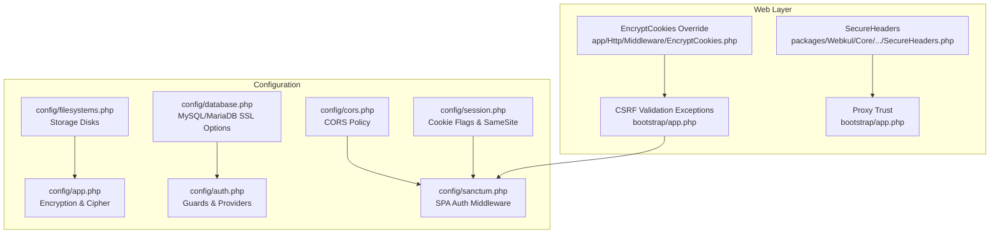
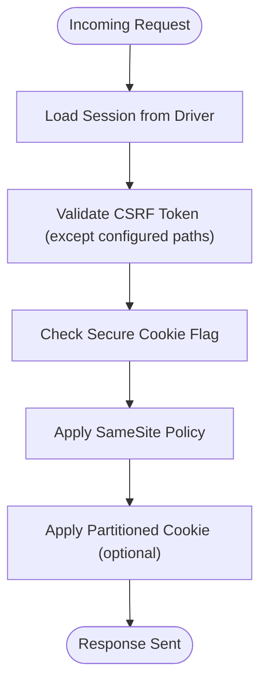
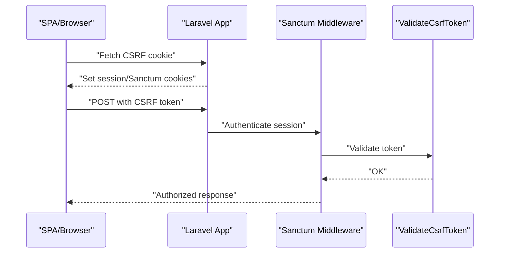
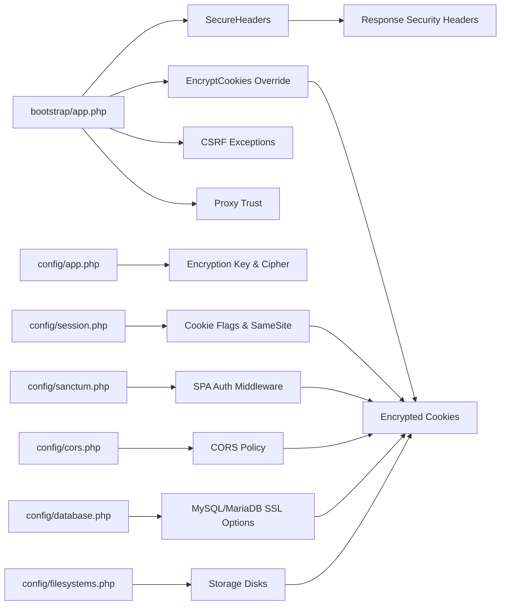

# Security Hardening

<cite>
**Referenced Files in This Document**
- [config/app.php](file://config/app.php)
- [config/auth.php](file://config/auth.php)
- [config/session.php](file://config/session.php)
- [config/cors.php](file://config/cors.php)
- [config/sanctum.php](file://config/sanctum.php)
- [config/database.php](file://config/database.php)
- [config/filesystems.php](file://config/filesystems.php)
- [bootstrap/app.php](file://bootstrap/app.php)
- [app/Http/Middleware/EncryptCookies.php](file://app/Http/Middleware/EncryptCookies.php)
- [packages/Webkul/Core/src/Http/Middleware/SecureHeaders.php](file://packages/Webkul/Core/src/Http/Middleware/SecureHeaders.php)
- [database/migrations/2026_02_03_151924_create_sessions_table.php](file://database/migrations/2026_02_03_151924_create_sessions_table.php)
- [lang/*/validation.php](file://lang/en/validation.php)
</cite>

## Table of Contents
1. [Introduction](#introduction)
2. [Project Structure](#project-structure)
3. [Core Components](#core-components)
4. [Architecture Overview](#architecture-overview)
5. [Detailed Component Analysis](#detailed-component-analysis)
6. [Dependency Analysis](#dependency-analysis)
7. [Performance Considerations](#performance-considerations)
8. [Troubleshooting Guide](#troubleshooting-guide)
9. [Conclusion](#conclusion)
10. [Appendices](#appendices)

## Introduction
This document provides a comprehensive security hardening guide for the Frooxi production deployment of the Bagisto application. It focuses on configuration-driven security controls across encryption, authentication, session management, CORS, cookies, headers, file storage, database connectivity, and CSRF protection. Guidance is grounded in the repository’s configuration files and middleware, ensuring practical, deployable recommendations aligned with the codebase.

## Project Structure
Security-relevant configuration and middleware are primarily located under:
- Configuration: config/*.php
- Bootstrap and middleware registration: bootstrap/app.php
- Custom middleware: app/Http/Middleware and packages/Webkul/Core/src/Http/Middleware
- Database session table: database/migrations
- Localization-based validation rules: lang/*/validation.php

```mermaid
graph TB
A["Bootstrap<br/>bootstrap/app.php"] --> B["Security Headers<br/>packages/Webkul/Core/.../SecureHeaders.php"]
A --> C["Encrypted Cookies Override<br/>app/Http/Middleware/EncryptCookies.php"]
A --> D["CSRF Exceptions<br/>bootstrap/app.php"]
A --> E["Proxy Trust<br/>bootstrap/app.php"]
F["App Config<br/>config/app.php"] --> G["Encryption Key & Cipher<br/>config/app.php"]
H["Auth Config<br/>config/auth.php"] --> I["Guards & Providers<br/>config/auth.php"]
J["Session Config<br/>config/session.php"] --> K["Cookie Flags & SameSite<br/>config/session.php"]
L["CORS Config<br/>config/cors.php"] --> M["Cross-Origin Policy<br/>config/cors.php"]
N["Sanctum Config<br/>config/sanctum.php"] --> O["SPA Auth Middleware<br/>config/sanctum.php"]
P["Database Config<br/>config/database.php"] --> Q["SSL Options for MySQL/MariaDB<br/>config/database.php"]
R["Filesystems Config<br/>config/filesystems.php"] --> S["Public/Private Storage<br/>config/filesystems.php"]
```

**Diagram sources**
- [bootstrap/app.php:14-56](file://bootstrap/app.php#L14-L56)
- [packages/Webkul/Core/src/Http/Middleware/SecureHeaders.php:1-66](file://packages/Webkul/Core/src/Http/Middleware/SecureHeaders.php#L1-L66)
- [app/Http/Middleware/EncryptCookies.php:1-19](file://app/Http/Middleware/EncryptCookies.php#L1-L19)
- [config/app.php:150-167](file://config/app.php#L150-L167)
- [config/auth.php:41-80](file://config/auth.php#L41-L80)
- [config/session.php:129-202](file://config/session.php#L129-L202)
- [config/cors.php:18-33](file://config/cors.php#L18-L33)
- [config/sanctum.php:21-69](file://config/sanctum.php#L21-L69)
- [config/database.php:60-82](file://config/database.php#L60-L82)
- [config/filesystems.php:31-91](file://config/filesystems.php#L31-L91)

**Section sources**
- [bootstrap/app.php:14-56](file://bootstrap/app.php#L14-L56)
- [config/app.php:150-167](file://config/app.php#L150-L167)
- [config/auth.php:41-80](file://config/auth.php#L41-L80)
- [config/session.php:129-202](file://config/session.php#L129-L202)
- [config/cors.php:18-33](file://config/cors.php#L18-L33)
- [config/sanctum.php:21-69](file://config/sanctum.php#L21-L69)
- [config/database.php:60-82](file://config/database.php#L60-L82)
- [config/filesystems.php:31-91](file://config/filesystems.php#L31-L91)

## Core Components
- Encryption and cipher configuration for application secrets and encrypted cookies.
- Authentication guards and providers for customer and admin contexts.
- Session management with cookie flags, SameSite, and secure transport.
- CORS policy for API and SPA integration.
- Sanctum configuration for SPA authentication and CSRF handling.
- Database connectivity with SSL/TLS options for MySQL/MariaDB.
- Filesystems configuration for public and private storage.
- Security headers middleware and custom cookie encryption override.
- CSRF token validation exceptions for specific endpoints.

**Section sources**
- [config/app.php:150-167](file://config/app.php#L150-L167)
- [config/auth.php:41-80](file://config/auth.php#L41-L80)
- [config/session.php:129-202](file://config/session.php#L129-L202)
- [config/cors.php:18-33](file://config/cors.php#L18-L33)
- [config/sanctum.php:21-69](file://config/sanctum.php#L21-L69)
- [config/database.php:60-82](file://config/database.php#L60-L82)
- [config/filesystems.php:31-91](file://config/filesystems.php#L31-L91)
- [packages/Webkul/Core/src/Http/Middleware/SecureHeaders.php:41-48](file://packages/Webkul/Core/src/Http/Middleware/SecureHeaders.php#L41-L48)
- [app/Http/Middleware/EncryptCookies.php:14-17](file://app/Http/Middleware/EncryptCookies.php#L14-L17)

## Architecture Overview
The security architecture integrates configuration-driven controls with middleware and database settings. The bootstrap registers custom security headers, overrides cookie encryption, validates CSRF except for selected paths, and trusts proxies. Configuration files define encryption, session cookies, CORS, Sanctum, database SSL, and filesystems.

**Diagram sources**
- [packages/Webkul/Core/src/Http/Middleware/SecureHeaders.php:24-48](file://packages/Webkul/Core/src/Http/Middleware/SecureHeaders.php#L24-L48)
- [app/Http/Middleware/EncryptCookies.php:7-17](file://app/Http/Middleware/EncryptCookies.php#L7-L17)
- [bootstrap/app.php:42-48](file://bootstrap/app.php#L42-L48)
- [config/app.php:159-161](file://config/app.php#L159-L161)
- [config/auth.php:41-80](file://config/auth.php#L41-L80)
- [config/session.php:129-202](file://config/session.php#L129-L202)
- [config/cors.php:18-33](file://config/cors.php#L18-L33)
- [config/sanctum.php:65-69](file://config/sanctum.php#L65-L69)
- [config/database.php:60-82](file://config/database.php#L60-L82)
- [config/filesystems.php:31-91](file://config/filesystems.php#L31-L91)

## Detailed Component Analysis

### Encryption and Cipher (config/app.php)
- Cipher: AES-256-CBC is configured for encryption services.
- Key management: APP_KEY must be set to a 32-character random string; previous keys are supported via APP_PREVIOUS_KEYS.
- Recommendations:
  - Generate a cryptographically secure APP_KEY and rotate keys periodically using APP_PREVIOUS_KEYS during transitions.
  - Store keys in environment variables and restrict filesystem permissions.
  - Ensure backups of keys are encrypted and access-controlled.

**Section sources**
- [config/app.php:150-167](file://config/app.php#L150-L167)

### Authentication Security (config/auth.php)
- Guards:
  - customer and admin use session-based authentication.
- Providers:
  - Eloquent providers backed by Customer and Admin models.
- Password resets:
  - Token expiration and throttling configured per guard.
- Recommendations:
  - Enforce strong password policies via localization validation rules.
  - Consider adding rate limiting around login attempts.
  - Use two-factor authentication where applicable.

**Section sources**
- [config/auth.php:41-80](file://config/auth.php#L41-L80)
- [config/auth.php:101-115](file://config/auth.php#L101-L115)

### Session Management and Cookies (config/session.php, bootstrap/app.php)
- Driver and persistence:
  - Default database driver with configurable table and connection.
- Cookie attributes:
  - Name, path, domain, http_only, same_site, partitioned.
  - secure flag is configurable for HTTPS-only cookies.
- CSRF:
  - CSRF validation is enabled globally with exceptions for specific routes.
- Recommendations:
  - Set SESSION_SECURE_COOKIE=true behind TLS termination.
  - Use SameSite=strict for sensitive actions; lax for SPAs.
  - Limit session lifetime and enable expire_on_close where appropriate.
  - Consider encrypting session data with SESSION_ENCRYPT=true.

**Diagram sources**
- [bootstrap/app.php:44-46](file://bootstrap/app.php#L44-L46)
- [config/session.php:129-202](file://config/session.php#L129-L202)

**Section sources**
- [config/session.php:21-217](file://config/session.php#L21-L217)
- [bootstrap/app.php:42-48](file://bootstrap/app.php#L42-L48)

### Security Headers (packages/Webkul/Core/src/Http/Middleware/SecureHeaders.php)
- Applied headers:
  - Referrer-Policy, X-Content-Type-Options, X-XSS-Protection, X-Frame-Options, Strict-Transport-Security.
- Behavior:
  - Removes unwanted headers and sets hardened defaults.
- Recommendations:
  - Ensure HSTS is only applied under HTTPS.
  - Review X-Built-With header in production environments.

**Section sources**
- [packages/Webkul/Core/src/Http/Middleware/SecureHeaders.php:41-48](file://packages/Webkul/Core/src/Http/Middleware/SecureHeaders.php#L41-L48)

### CORS and Sanctum (config/cors.php, config/sanctum.php)
- CORS:
  - Paths, methods, origins, headers, credentials support configured.
- Sanctum:
  - Stateful domains, middleware stack includes cookie encryption and CSRF validation.
- Recommendations:
  - Restrict allowed_origins to trusted domains in production.
  - Align stateful domains with SPA origin and port.
  - Keep supports_credentials=false unless necessary.

**Diagram sources**
- [config/sanctum.php:65-69](file://config/sanctum.php#L65-L69)
- [bootstrap/app.php:44-46](file://bootstrap/app.php#L44-L46)

**Section sources**
- [config/cors.php:18-33](file://config/cors.php#L18-L33)
- [config/sanctum.php:21-69](file://config/sanctum.php#L21-L69)

### Database Security (config/database.php)
- SSL/TLS for MySQL/MariaDB:
  - Options include SSL CA configuration via MYSQL_ATTR_SSL_CA.
- Recommendations:
  - Enable SSL/TLS for database connections in production.
  - Configure SSL CA path and certificate verification.
  - Use least-privilege database accounts and network-level firewalling.

**Section sources**
- [config/database.php:60-82](file://config/database.php#L60-L82)

### File Uploads and Storage (config/filesystems.php)
- Disks:
  - local, private, public, s3, cloudinary.
- Recommendations:
  - Serve uploaded assets via signed URLs or private disks with authenticated access.
  - Restrict file types and scan uploads for malware.
  - Ensure proper filesystem permissions and disk quotas.

**Section sources**
- [config/filesystems.php:31-91](file://config/filesystems.php#L31-L91)

### CSRF Protection (bootstrap/app.php)
- CSRF exceptions:
  - Specific routes excluded from CSRF validation.
- Recommendations:
  - Minimize exceptions; only whitelist necessary endpoints.
  - Ensure all state-changing API endpoints require CSRF tokens.

**Section sources**
- [bootstrap/app.php:44-46](file://bootstrap/app.php#L44-L46)

### Password Policies and Validation (lang/*/validation.php)
- Validation rules include:
  - Minimum requirements for letters, mixed case, numbers, symbols.
  - Uncompromised password detection messaging.
- Recommendations:
  - Enforce minimum length and complexity rules.
  - Integrate with password strength libraries and breach checks.

**Section sources**
- [lang/en/validation.php:131-137](file://lang/en/validation.php#L131-L137)

### Two-Factor Authentication (2FA)
- Evidence of 2FA UI and setup exists in admin views and translations.
- Recommendations:
  - Enable 2FA by default for admin users.
  - Provide backup codes and recovery mechanisms.
  - Audit 2FA enable/disable events.

[No sources needed since this section references UI and translations conceptually]

## Dependency Analysis
Security controls depend on coordinated configuration and middleware ordering. The bootstrap removes default maintenance and empty-string conversion middleware, appends security headers, replaces cookie encryption, validates CSRF except specific paths, and trusts proxies. Session storage depends on database configuration and filesystem visibility.

**Diagram sources**
- [bootstrap/app.php:20-49](file://bootstrap/app.php#L20-L49)
- [config/app.php:159-161](file://config/app.php#L159-L161)
- [config/session.php:129-202](file://config/session.php#L129-L202)
- [config/sanctum.php:65-69](file://config/sanctum.php#L65-L69)
- [config/cors.php:18-33](file://config/cors.php#L18-L33)
- [config/database.php:60-82](file://config/database.php#L60-L82)
- [config/filesystems.php:31-91](file://config/filesystems.php#L31-L91)

**Section sources**
- [bootstrap/app.php:20-49](file://bootstrap/app.php#L20-L49)
- [config/app.php:159-161](file://config/app.php#L159-L161)
- [config/session.php:129-202](file://config/session.php#L129-L202)
- [config/sanctum.php:65-69](file://config/sanctum.php#L65-L69)
- [config/cors.php:18-33](file://config/cors.php#L18-L33)
- [config/database.php:60-82](file://config/database.php#L60-L82)
- [config/filesystems.php:31-91](file://config/filesystems.php#L31-L91)

## Performance Considerations
- Session drivers: Database sessions incur IO overhead; consider Redis for high concurrency.
- Cookie flags: Partitioned cookies and strict SameSite may impact cross-site integrations.
- Logging: Daily rotation and external syslog reduce local disk usage.
- CORS: Wildcard origins increase risk; tighten origins in production.

[No sources needed since this section provides general guidance]

## Troubleshooting Guide
- Encryption key errors:
  - Verify APP_KEY is set and matches cipher configuration.
- CSRF failures:
  - Confirm CSRF exceptions list and ensure tokens are included in requests.
- Session issues:
  - Check database connectivity, session table existence, and cookie domain/path.
- HSTS/HTTPS:
  - Ensure secure cookies and HTTPS termination before enabling HSTS.
- CORS problems:
  - Validate allowed origins and credentials settings.

**Section sources**
- [config/app.php:159-161](file://config/app.php#L159-L161)
- [bootstrap/app.php:44-46](file://bootstrap/app.php#L44-L46)
- [config/session.php:89-90](file://config/session.php#L89-L90)
- [config/session.php:172-172](file://config/session.php#L172-L172)
- [config/cors.php:22-32](file://config/cors.php#L22-L32)

## Conclusion
This guide consolidates production-hardening practices derived from the repository’s configuration and middleware. By enforcing strong encryption, tightening session and cookie policies, applying robust security headers, validating CSRF, configuring CORS and Sanctum appropriately, enabling database SSL, and securing file storage, deployments can achieve a strong baseline security posture aligned with the codebase.

[No sources needed since this section summarizes without analyzing specific files]

## Appendices

### Appendix A: Security Checklist
- Encryption
  - APP_KEY set and rotated via APP_PREVIOUS_KEYS
  - Cipher set to AES-256-CBC
- Sessions and Cookies
  - SESSION_SECURE_COOKIE enabled under HTTPS
  - SameSite set to strict for sensitive actions
  - Session lifetime minimized
- Authentication
  - Strong password policies enforced
  - 2FA enabled for admin users
- CORS and Sanctum
  - Origins restricted to trusted domains
  - Supports credentials disabled unless required
- Database
  - SSL/TLS enabled for MySQL/MariaDB
- Filesystems
  - Private storage for sensitive uploads
  - Signed URLs for public assets
- Headers and Middleware
  - Security headers applied
  - CSRF validation exceptions minimized

[No sources needed since this section provides general guidance]