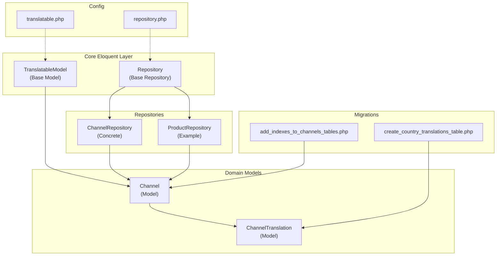
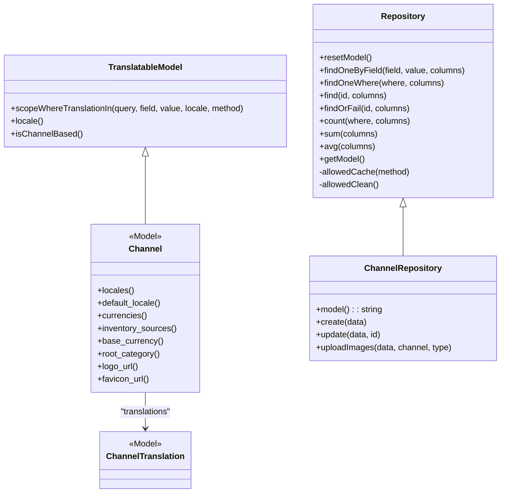
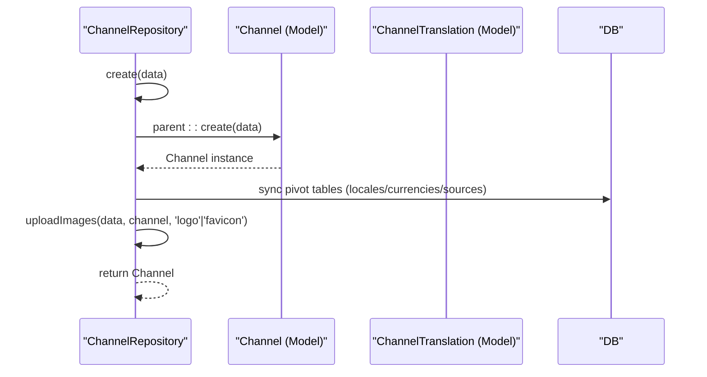
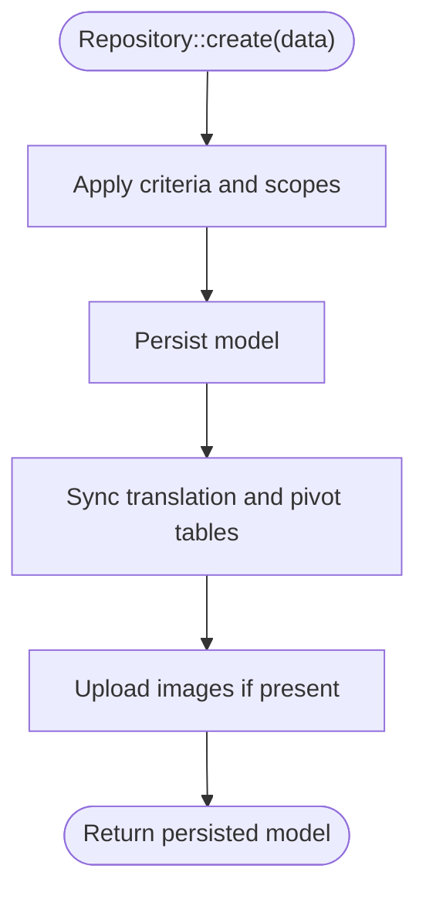
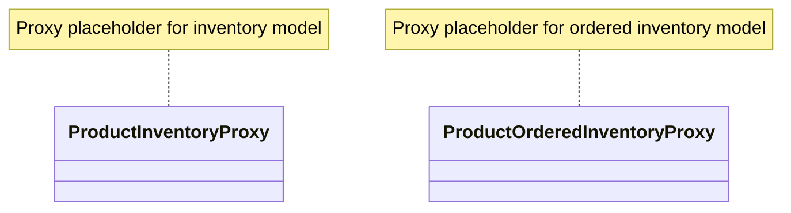
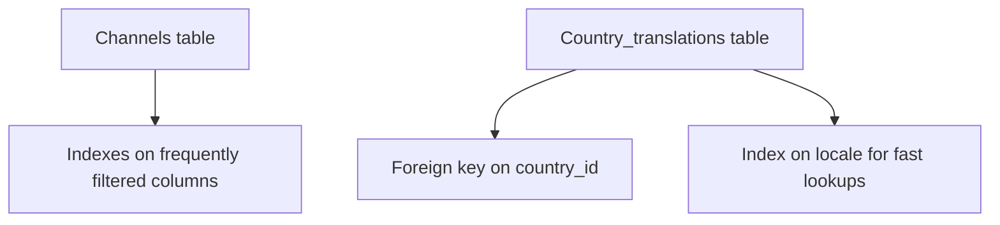
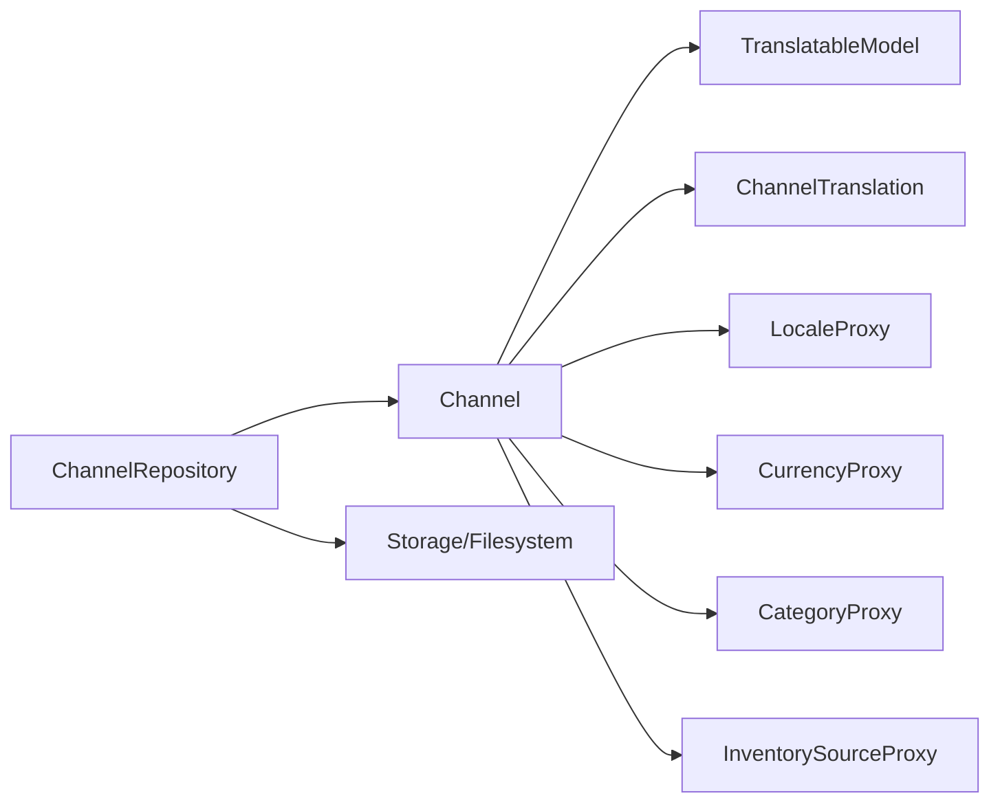

# Database Migrations & Models

<cite>
**Referenced Files in This Document**
- [TranslatableModel.php](file://packages/Webkul/Core/src/Eloquent/TranslatableModel.php)
- [repository.php](file://config/repository.php)
- [Repository.php](file://packages/Webkul/Core/src/Eloquent/Repository.php)
- [Channel.php](file://packages/Webkul/Core/src/Models/Channel.php)
- [ChannelTranslation.php](file://packages/Webkul/Core/src/Models/ChannelTranslation.php)
- [ChannelRepository.php](file://packages/Webkul/Core/src/Repositories/ChannelRepository.php)
- [2018_10_12_101803_create_country_translations_table.php](file://packages/Webkul/Core/src/Database/Migrations/2018_10_12_101803_create_country_translations_table.php)
- [2025_09_05_000100_add_indexes_to_channels_tables.php](file://packages/Webkul/Core/src/Database/Migrations/2025_09_05_000100_add_indexes_to_channels_tables.php)
- [translatable.php](file://config/translatable.php)
- [ProductRepository.php](file://packages/Webkul/Product/src/Repositories/ProductRepository.php)
- [ProductInventoryProxy.php](file://packages/Webkul/Product/src/Models/ProductInventoryProxy.php)
- [ProductOrderedInventoryProxy.php](file://packages/Webkul/Product/src/Models/ProductOrderedInventoryProxy.php)
</cite>

## Table of Contents
1. [Introduction](#introduction)
2. [Project Structure](#project-structure)
3. [Core Components](#core-components)
4. [Architecture Overview](#architecture-overview)
5. [Detailed Component Analysis](#detailed-component-analysis)
6. [Dependency Analysis](#dependency-analysis)
7. [Performance Considerations](#performance-considerations)
8. [Troubleshooting Guide](#troubleshooting-guide)
9. [Conclusion](#conclusion)
10. [Appendices](#appendices)

## Introduction
This document explains how database schema development and model extensions work in Frooxi (Bagisto). It covers:
- Creating and maintaining migrations
- Defining models and translatable models
- Implementing the repository pattern
- Working with translatable models and polymorphic-like proxies
- Indexing strategies and performance optimization
- Practical examples for extending existing models, building custom repositories, and adding data validation
- Best practices for migrations, data integrity, and caching

## Project Structure
The database and ORM layer is primarily organized under the Core module with reusable patterns:
- Eloquent base classes: Translatable base model and generic repository
- Domain models: Channel and its translation model
- Repositories: Typed repositories for domain operations
- Migrations: Versioned schema changes, including translation tables and indexes
- Configuration: Repository caching and criteria settings, and translatable behavior

**Diagram sources**
- [TranslatableModel.php:1-62](file://packages/Webkul/Core/src/Eloquent/TranslatableModel.php#L1-L62)
- [Repository.php:1-224](file://packages/Webkul/Core/src/Eloquent/Repository.php#L1-L224)
- [Channel.php:1-157](file://packages/Webkul/Core/src/Models/Channel.php#L1-L157)
- [ChannelTranslation.php:1-39](file://packages/Webkul/Core/src/Models/ChannelTranslation.php#L1-L39)
- [ChannelRepository.php:1-103](file://packages/Webkul/Core/src/Repositories/ChannelRepository.php#L1-L103)
- [ProductRepository.php:43-112](file://packages/Webkul/Product/src/Repositories/ProductRepository.php#L43-L112)
- [2018_10_12_101803_create_country_translations_table.php:1-36](file://packages/Webkul/Core/src/Database/Migrations/2018_10_12_101803_create_country_translations_table.php#L1-L36)
- [2025_09_05_000100_add_indexes_to_channels_tables.php:1-200](file://packages/Webkul/Core/src/Database/Migrations/2025_09_05_000100_add_indexes_to_channels_tables.php#L1-L200)
- [repository.php:1-294](file://config/repository.php#L1-L294)
- [translatable.php:1-152](file://config/translatable.php#L1-L152)

**Section sources**
- [TranslatableModel.php:1-62](file://packages/Webkul/Core/src/Eloquent/TranslatableModel.php#L1-L62)
- [Repository.php:1-224](file://packages/Webkul/Core/src/Eloquent/Repository.php#L1-L224)
- [Channel.php:1-157](file://packages/Webkul/Core/src/Models/Channel.php#L1-L157)
- [ChannelTranslation.php:1-39](file://packages/Webkul/Core/src/Models/ChannelTranslation.php#L1-L39)
- [ChannelRepository.php:1-103](file://packages/Webkul/Core/src/Repositories/ChannelRepository.php#L1-L103)
- [2018_10_12_101803_create_country_translations_table.php:1-36](file://packages/Webkul/Core/src/Database/Migrations/2018_10_12_101803_create_country_translations_table.php#L1-L36)
- [2025_09_05_000100_add_indexes_to_channels_tables.php:1-200](file://packages/Webkul/Core/src/Database/Migrations/2025_09_05_000100_add_indexes_to_channels_tables.php#L1-L200)
- [repository.php:1-294](file://config/repository.php#L1-L294)
- [translatable.php:1-152](file://config/translatable.php#L1-L152)

## Core Components
- Translatable base model: Provides translation behavior and optimized locale resolution for models.
- Generic repository: Adds caching, scoping, criteria, and convenience methods for typed repositories.
- Domain models: Channel and ChannelTranslation demonstrate translatable attributes and relationships.
- Domain repository: ChannelRepository shows how to manage translations and pivot tables via the repository pattern.
- Migrations: Translation tables and indexes illustrate schema design for localization and performance.
- Configuration: Repository caching and criteria parameters; translatable behavior settings.

**Section sources**
- [TranslatableModel.php:10-62](file://packages/Webkul/Core/src/Eloquent/TranslatableModel.php#L10-L62)
- [Repository.php:9-224](file://packages/Webkul/Core/src/Eloquent/Repository.php#L9-L224)
- [Channel.php:16-157](file://packages/Webkul/Core/src/Models/Channel.php#L16-L157)
- [ChannelTranslation.php:11-39](file://packages/Webkul/Core/src/Models/ChannelTranslation.php#L11-L39)
- [ChannelRepository.php:9-103](file://packages/Webkul/Core/src/Repositories/ChannelRepository.php#L9-L103)
- [2018_10_12_101803_create_country_translations_table.php:14-34](file://packages/Webkul/Core/src/Database/Migrations/2018_10_12_101803_create_country_translations_table.php#L14-L34)
- [2025_09_05_000100_add_indexes_to_channels_tables.php:1-200](file://packages/Webkul/Core/src/Database/Migrations/2025_09_05_000100_add_indexes_to_channels_tables.php#L1-L200)
- [repository.php:20-270](file://config/repository.php#L20-L270)
- [translatable.php:15-151](file://config/translatable.php#L15-L151)

## Architecture Overview
The system follows a layered architecture:
- Models encapsulate entity state and behavior, including translatable fields.
- Repositories abstract persistence and expose domain-specific operations.
- Migrations evolve the schema safely across environments.
- Configuration controls caching and validation behavior.

**Diagram sources**
- [TranslatableModel.php:10-62](file://packages/Webkul/Core/src/Eloquent/TranslatableModel.php#L10-L62)
- [Repository.php:9-224](file://packages/Webkul/Core/src/Eloquent/Repository.php#L9-L224)
- [Channel.php:16-157](file://packages/Webkul/Core/src/Models/Channel.php#L16-L157)
- [ChannelTranslation.php:11-39](file://packages/Webkul/Core/src/Models/ChannelTranslation.php#L11-L39)
- [ChannelRepository.php:9-103](file://packages/Webkul/Core/src/Repositories/ChannelRepository.php#L9-L103)

## Detailed Component Analysis

### Translatable Models and Localization
- TranslatableModel provides:
  - Locale selection logic tailored to channel-based or application-wide defaults
  - A scope to filter records by translation values efficiently
- Channel and ChannelTranslation demonstrate:
  - Declaring translatable attributes
  - Relationship to translation table
  - Accessors for media URLs

**Diagram sources**
- [ChannelRepository.php:24-73](file://packages/Webkul/Core/src/Repositories/ChannelRepository.php#L24-L73)
- [Channel.php:64-107](file://packages/Webkul/Core/src/Models/Channel.php#L64-L107)
- [ChannelTranslation.php:11-39](file://packages/Webkul/Core/src/Models/ChannelTranslation.php#L11-L39)

**Section sources**
- [TranslatableModel.php:29-62](file://packages/Webkul/Core/src/Eloquent/TranslatableModel.php#L29-L62)
- [Channel.php:54-157](file://packages/Webkul/Core/src/Models/Channel.php#L54-L157)
- [ChannelTranslation.php:20-39](file://packages/Webkul/Core/src/Models/ChannelTranslation.php#L20-L39)
- [ChannelRepository.php:24-103](file://packages/Webkul/Core/src/Repositories/ChannelRepository.php#L24-L103)

### Repository Pattern Implementation
- Base repository adds:
  - Caching control per repository and per-method
  - Convenience methods for single-row queries
  - Scope and criteria application
- ChannelRepository:
  - Overrides create/update to populate translations across locales
  - Manages many-to-many pivots and image uploads

**Diagram sources**
- [Repository.php:131-139](file://packages/Webkul/Core/src/Eloquent/Repository.php#L131-L139)
- [ChannelRepository.php:24-73](file://packages/Webkul/Core/src/Repositories/ChannelRepository.php#L24-L73)

**Section sources**
- [Repository.php:9-224](file://packages/Webkul/Core/src/Eloquent/Repository.php#L9-L224)
- [ChannelRepository.php:9-103](file://packages/Webkul/Core/src/Repositories/ChannelRepository.php#L9-L103)

### Polymorphic Relationships and Proxies
- Proxies enable extensibility without modifying base classes:
  - ProductInventoryProxy and ProductOrderedInventoryProxy act as proxy placeholders for inventory-related models
- These proxies integrate with Concord’s model registry to support runtime extension and swapping

**Diagram sources**
- [ProductInventoryProxy.php:1-7](file://packages/Webkul/Product/src/Models/ProductInventoryProxy.php#L1-L7)
- [ProductOrderedInventoryProxy.php:1-7](file://packages/Webkul/Product/src/Models/ProductOrderedInventoryProxy.php#L1-L7)

**Section sources**
- [ProductInventoryProxy.php:1-7](file://packages/Webkul/Product/src/Models/ProductInventoryProxy.php#L1-L7)
- [ProductOrderedInventoryProxy.php:1-7](file://packages/Webkul/Product/src/Models/ProductOrderedInventoryProxy.php#L1-L7)

### Model Observers and Mutators
- Observers are used in modules (e.g., CategoryObserver) to react to model lifecycle events
- Mutators and accessors:
  - Channel exposes accessors for logo_url and favicon_url
  - Channel casts home_seo to array for structured data handling
- These patterns help keep models focused while enabling side effects and computed properties

**Section sources**
- [Channel.php:112-147](file://packages/Webkul/Core/src/Models/Channel.php#L112-L147)
- [ChannelTranslation.php:27-29](file://packages/Webkul/Core/src/Models/ChannelTranslation.php#L27-L29)

### Indexing Strategies
- Channels table receives explicit indexes to improve lookup performance
- Translation tables include foreign keys and locale indexing to optimize joins and filtering

**Diagram sources**
- [2025_09_05_000100_add_indexes_to_channels_tables.php:1-200](file://packages/Webkul/Core/src/Database/Migrations/2025_09_05_000100_add_indexes_to_channels_tables.php#L1-L200)
- [2018_10_12_101803_create_country_translations_table.php:16-23](file://packages/Webkul/Core/src/Database/Migrations/2018_10_12_101803_create_country_translations_table.php#L16-L23)

**Section sources**
- [2025_09_05_000100_add_indexes_to_channels_tables.php:1-200](file://packages/Webkul/Core/src/Database/Migrations/2025_09_05_000100_add_indexes_to_channels_tables.php#L1-L200)
- [2018_10_12_101803_create_country_translations_table.php:14-34](file://packages/Webkul/Core/src/Database/Migrations/2018_10_12_101803_create_country_translations_table.php#L14-L34)

### Practical Examples

#### Extending an Existing Model
- Extend Channel with additional attributes and relationships in the model class
- Keep translation handling intact by leveraging the translatable base class
- Use the repository to orchestrate creation and updates, ensuring translations and pivots are synchronized

**Section sources**
- [Channel.php:16-157](file://packages/Webkul/Core/src/Models/Channel.php#L16-L157)
- [ChannelRepository.php:24-73](file://packages/Webkul/Core/src/Repositories/ChannelRepository.php#L24-L73)

#### Creating a Custom Repository
- Inherit from the base repository
- Implement a model() method returning the contract or class
- Add domain-specific methods (e.g., suggestions, copying) and reuse base capabilities

**Section sources**
- [Repository.php:4-11](file://packages/Webkul/Core/src/Eloquent/Repository.php#L4-L11)
- [ProductRepository.php:43-112](file://packages/Webkul/Product/src/Repositories/ProductRepository.php#L43-L112)

#### Implementing Data Validation
- Use configuration-driven validation rules and locales
- Apply validation at the application layer before repository operations
- Leverage translatable configuration to ensure localized messages and formats

**Section sources**
- [translatable.php:15-151](file://config/translatable.php#L15-L151)

## Dependency Analysis
- Channel depends on:
  - TranslatableModel for localization
  - Proxy classes for related entities (Locale, Currency, Category, InventorySource)
  - ChannelTranslation for localized attributes
- ChannelRepository depends on:
  - Channel model and its relationships
  - Filesystem for image uploads
  - Core services for locale and channel utilities

**Diagram sources**
- [Channel.php:10-15](file://packages/Webkul/Core/src/Models/Channel.php#L10-L15)
- [ChannelTranslation.php:11-39](file://packages/Webkul/Core/src/Models/ChannelTranslation.php#L11-L39)
- [ChannelRepository.php:5-7](file://packages/Webkul/Core/src/Repositories/ChannelRepository.php#L5-L7)

**Section sources**
- [Channel.php:10-15](file://packages/Webkul/Core/src/Models/Channel.php#L10-L15)
- [ChannelRepository.php:5-7](file://packages/Webkul/Core/src/Repositories/ChannelRepository.php#L5-L7)

## Performance Considerations
- Caching:
  - Enable repository-level caching selectively per repository and method
  - Configure cache expiration and clean triggers to maintain consistency
- Query efficiency:
  - Use indexed columns for frequent filters
  - Prefer scopes like whereTranslationIn for efficient translation filtering
- I/O:
  - Batch translation inserts during seeding or bulk operations
  - Minimize redundant writes by checking file presence before upload

**Section sources**
- [repository.php:49-191](file://config/repository.php#L49-L191)
- [Repository.php:53-80](file://packages/Webkul/Core/src/Eloquent/Repository.php#L53-L80)
- [TranslatableModel.php:52-61](file://packages/Webkul/Core/src/Eloquent/TranslatableModel.php#L52-L61)
- [2025_09_05_000100_add_indexes_to_channels_tables.php:1-200](file://packages/Webkul/Core/src/Database/Migrations/2025_09_05_000100_add_indexes_to_channels_tables.php#L1-L200)

## Troubleshooting Guide
- Translation not loading:
  - Verify translatable configuration and locale fallback settings
  - Ensure translation table exists and foreign keys are correct
- Repository cache stale data:
  - Confirm cache enabled/disabled per repository and method
  - Trigger cache clean on create/update/delete as configured
- Pivot synchronization errors:
  - Check repository update logic for syncing many-to-many relations
  - Validate that required pivot arrays are passed in requests

**Section sources**
- [translatable.php:61-90](file://config/translatable.php#L61-L90)
- [repository.php:88-113](file://config/repository.php#L88-L113)
- [ChannelRepository.php:58-73](file://packages/Webkul/Core/src/Repositories/ChannelRepository.php#L58-L73)

## Conclusion
Frooxi’s database and model layer combines a robust translatable base, a configurable repository pattern, and carefully designed migrations. Following the patterns demonstrated here ensures:
- Consistent localization handling
- Efficient and maintainable persistence logic
- Scalable performance through indexing and caching
- Safe evolution of schema and model behavior

## Appendices

### Migration Creation Checklist
- Define schema in a new migration file
- Add indexes for foreign keys and frequently queried columns
- Include rollback logic for safety
- Test locally and review diffs before merging

**Section sources**
- [2018_10_12_101803_create_country_translations_table.php:14-34](file://packages/Webkul/Core/src/Database/Migrations/2018_10_12_101803_create_country_translations_table.php#L14-L34)
- [2025_09_05_000100_add_indexes_to_channels_tables.php:1-200](file://packages/Webkul/Core/src/Database/Migrations/2025_09_05_000100_add_indexes_to_channels_tables.php#L1-L200)

### Repository Best Practices
- Keep repositories thin: delegate business logic to models and services
- Use criteria and scopes to encapsulate common queries
- Enable caching only where beneficial and test cache invalidation

**Section sources**
- [Repository.php:53-80](file://packages/Webkul/Core/src/Eloquent/Repository.php#L53-L80)
- [repository.php:143-146](file://config/repository.php#L143-L146)