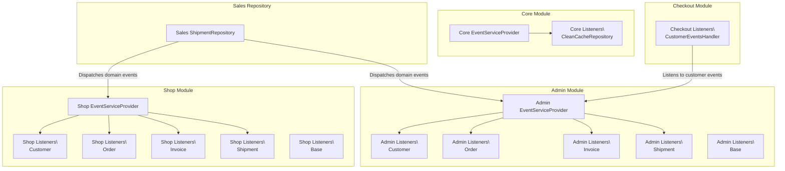
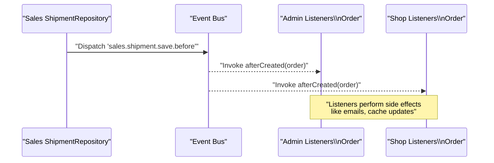
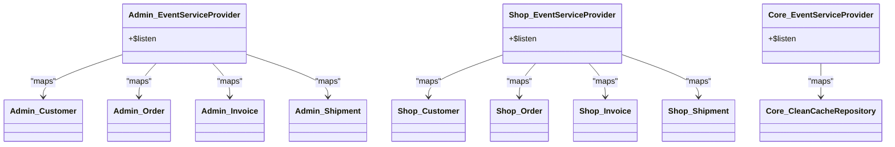
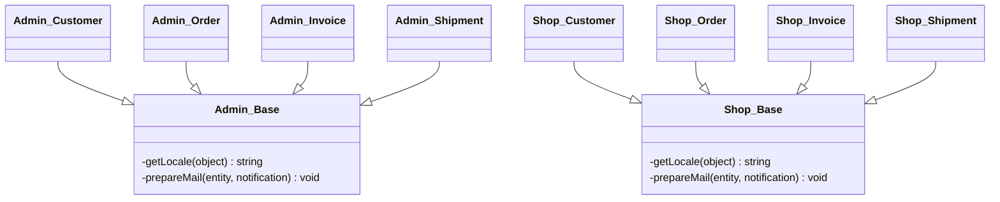
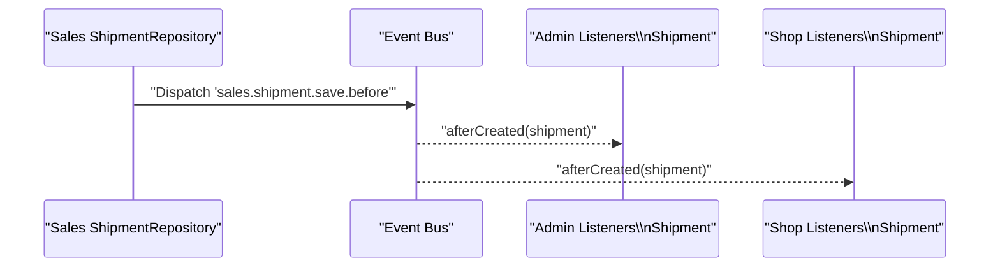
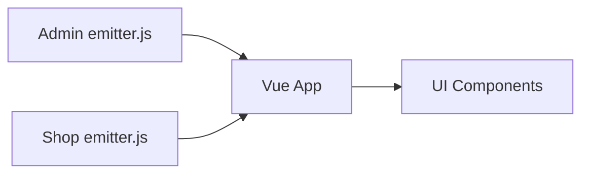
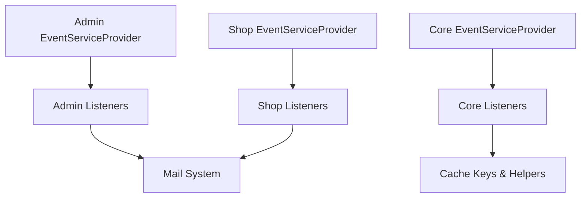
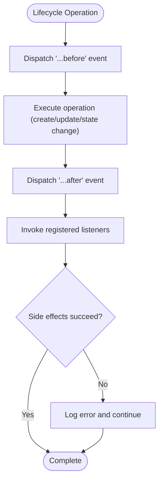

# Event System & Listeners

<cite>
**Referenced Files in This Document**
- [EventServiceProvider.php](file://packages/Webkul/Admin/src/Providers/EventServiceProvider.php)
- [EventServiceProvider.php](file://packages/Webkul/Shop/src/Providers/EventServiceProvider.php)
- [EventServiceProvider.php](file://packages/Webkul/Core/src/Providers/EventServiceProvider.php)
- [Customer.php](file://packages/Webkul/Admin/src/Listeners/Customer.php)
- [Order.php](file://packages/Webkul/Admin/src/Listeners/Order.php)
- [Invoice.php](file://packages/Webkul/Admin/src/Listeners/Invoice.php)
- [Shipment.php](file://packages/Webkul/Admin/src/Listeners/Shipment.php)
- [Base.php](file://packages/Webkul/Admin/src/Listeners/Base.php)
- [Customer.php](file://packages/Webkul/Shop/src/Listeners/Customer.php)
- [Order.php](file://packages/Webkul/Shop/src/Listeners/Order.php)
- [Invoice.php](file://packages/Webkul/Shop/src/Listeners/Invoice.php)
- [Shipment.php](file://packages/Webkul/Shop/src/Listeners/Shipment.php)
- [Base.php](file://packages/Webkul/Shop/src/Listeners/Base.php)
- [CustomerEventsHandler.php](file://packages/Webkul/Checkout/src/Listeners/CustomerEventsHandler.php)
- [CleanCacheRepository.php](file://packages/Webkul/Core/src/Listeners/CleanCacheRepository.php)
- [ShipmentRepository.php](file://packages/Webkul/Sales/src/Repositories/ShipmentRepository.php)
- [emitter.js](file://packages/Webkul/Admin/src/Resources/assets/js/plugins/emitter.js)
- [emitter.js](file://packages/Webkul/Shop/src/Resources/assets/js/plugins/emitter.js)
</cite>

## Table of Contents
1. [Introduction](#introduction)
2. [Project Structure](#project-structure)
3. [Core Components](#core-components)
4. [Architecture Overview](#architecture-overview)
5. [Detailed Component Analysis](#detailed-component-analysis)
6. [Dependency Analysis](#dependency-analysis)
7. [Performance Considerations](#performance-considerations)
8. [Troubleshooting Guide](#troubleshooting-guide)
9. [Conclusion](#conclusion)
10. [Appendices](#appendices)

## Introduction
This document explains the event-driven architecture in Frooxi (Bagisto), focusing on how events are registered, how listeners are implemented, and how events are fired across modules. It documents built-in events for Customer, Order, Invoice, Shipment, and Refund, and provides guidance on creating custom events, managing listener priorities, broadcasting events, and building robust event-driven workflows. Practical examples show how to extend functionality via events and maintain clean, testable, and performant code.

## Project Structure
Frooxi organizes event handling primarily in:
- Event service providers per module that declare event-to-listener mappings
- Listener classes that encapsulate side effects (email notifications, cache invalidation, transactions)
- Repository and controller code that dispatches domain events
- Frontend event emitters for UI-driven interactions

**Diagram sources**
- [EventServiceProvider.php:14-57](file://packages/Webkul/Admin/src/Providers/EventServiceProvider.php#L14-L57)
- [EventServiceProvider.php:13-81](file://packages/Webkul/Shop/src/Providers/EventServiceProvider.php#L13-L81)
- [EventServiceProvider.php:7-24](file://packages/Webkul/Core/src/Providers/EventServiceProvider.php#L7-L24)
- [CustomerEventsHandler.php:8-34](file://packages/Webkul/Checkout/src/Listeners/CustomerEventsHandler.php#L8-L34)
- [ShipmentRepository.php:42-47](file://packages/Webkul/Sales/src/Repositories/ShipmentRepository.php#L42-L47)

**Section sources**
- [EventServiceProvider.php:14-57](file://packages/Webkul/Admin/src/Providers/EventServiceProvider.php#L14-L57)
- [EventServiceProvider.php:13-81](file://packages/Webkul/Shop/src/Providers/EventServiceProvider.php#L13-L81)
- [EventServiceProvider.php:7-24](file://packages/Webkul/Core/src/Providers/EventServiceProvider.php#L7-L24)
- [CustomerEventsHandler.php:8-34](file://packages/Webkul/Checkout/src/Listeners/CustomerEventsHandler.php#L8-L34)
- [ShipmentRepository.php:42-47](file://packages/Webkul/Sales/src/Repositories/ShipmentRepository.php#L42-L47)

## Core Components
- Event service providers define event-to-listener mappings per module.
- Listener classes implement side effects (email, cache, transaction creation).
- Domain repositories dispatch domain events around lifecycle hooks.
- Frontend plugins expose lightweight event emitters for UI interactions.

Key responsibilities:
- Registration: Modules register event handlers in their EventServiceProvider.
- Firing: Repositories and services dispatch events during lifecycle transitions.
- Handling: Listeners receive the dispatched payload and perform side effects.
- Broadcasting: Frontend emitters enable decoupled UI interactions.

**Section sources**
- [EventServiceProvider.php:14-57](file://packages/Webkul/Admin/src/Providers/EventServiceProvider.php#L14-L57)
- [EventServiceProvider.php:13-81](file://packages/Webkul/Shop/src/Providers/EventServiceProvider.php#L13-L81)
- [Customer.php:16-27](file://packages/Webkul/Admin/src/Listeners/Customer.php#L16-L27)
- [Order.php:16-46](file://packages/Webkul/Admin/src/Listeners/Order.php#L16-L46)
- [Invoice.php:25-74](file://packages/Webkul/Admin/src/Listeners/Invoice.php#L25-L74)
- [Shipment.php:16-29](file://packages/Webkul/Admin/src/Listeners/Shipment.php#L16-L29)
- [Base.php:16-47](file://packages/Webkul/Admin/src/Listeners/Base.php#L16-L47)
- [ShipmentRepository.php:42-47](file://packages/Webkul/Sales/src/Repositories/ShipmentRepository.php#L42-L47)
- [emitter.js:1-11](file://packages/Webkul/Admin/src/Resources/assets/js/plugins/emitter.js#L1-L11)

## Architecture Overview
The event system follows a publish-subscribe pattern:
- Publishers: Repositories and services emit named events with contextual data.
- Subscribers: Module-specific listeners react to events and perform side effects.
- Configuration: Event service providers bind events to listener methods.

**Diagram sources**
- [ShipmentRepository.php:42-47](file://packages/Webkul/Sales/src/Repositories/ShipmentRepository.php#L42-L47)
- [EventServiceProvider.php:50-52](file://packages/Webkul/Admin/src/Providers/EventServiceProvider.php#L50-L52)
- [EventServiceProvider.php:74-76](file://packages/Webkul/Shop/src/Providers/EventServiceProvider.php#L74-L76)

**Section sources**
- [ShipmentRepository.php:42-47](file://packages/Webkul/Sales/src/Repositories/ShipmentRepository.php#L42-L47)
- [EventServiceProvider.php:50-52](file://packages/Webkul/Admin/src/Providers/EventServiceProvider.php#L50-L52)
- [EventServiceProvider.php:74-76](file://packages/Webkul/Shop/src/Providers/EventServiceProvider.php#L74-L76)

## Detailed Component Analysis

### Event Registration and Listener Mapping
- Admin module registers listeners for customer, GDPR, order, invoice, shipment, and refund events.
- Shop module mirrors many sales-related events for storefront reactions.
- Core module listens to repository lifecycle events to invalidate caches.

**Diagram sources**
- [EventServiceProvider.php:14-57](file://packages/Webkul/Admin/src/Providers/EventServiceProvider.php#L14-L57)
- [EventServiceProvider.php:13-81](file://packages/Webkul/Shop/src/Providers/EventServiceProvider.php#L13-L81)
- [EventServiceProvider.php:7-24](file://packages/Webkul/Core/src/Providers/EventServiceProvider.php#L7-L24)

**Section sources**
- [EventServiceProvider.php:14-57](file://packages/Webkul/Admin/src/Providers/EventServiceProvider.php#L14-L57)
- [EventServiceProvider.php:13-81](file://packages/Webkul/Shop/src/Providers/EventServiceProvider.php#L13-L81)
- [EventServiceProvider.php:7-24](file://packages/Webkul/Core/src/Providers/EventServiceProvider.php#L7-L24)

### Built-in Events by Module

#### Customer
- Admin: customer.create.after, customer.gdpr-request.create.after, customer.gdpr-request.update.after
- Shop: customer.registration.after, customer.password.update.after, customer.subscription.after, customer.note.create.after

Listener behavior:
- Admin Customer listener conditionally sends admin notifications upon customer creation.
- Shop Customer listeners handle registration, password update, subscription, and note creation.

**Section sources**
- [EventServiceProvider.php:22-32](file://packages/Webkul/Admin/src/Providers/EventServiceProvider.php#L22-L32)
- [EventServiceProvider.php:24-38](file://packages/Webkul/Shop/src/Providers/EventServiceProvider.php#L24-L38)
- [Customer.php:16-27](file://packages/Webkul/Admin/src/Listeners/Customer.php#L16-L27)
- [Customer.php](file://packages/Webkul/Shop/src/Listeners/Customer.php)

#### Order
- Admin: checkout.order.save.after, sales.order.cancel.after
- Shop: checkout.order.save.after, sales.order.cancel.after, sales.order.comment.create.after

Listener behavior:
- Admin Order listener sends “new order” and “order canceled” notifications.
- Shop Order listener sends “new order,” “order canceled,” and “order commented” notifications.

**Section sources**
- [EventServiceProvider.php:38-44](file://packages/Webkul/Admin/src/Providers/EventServiceProvider.php#L38-L44)
- [EventServiceProvider.php:54-64](file://packages/Webkul/Shop/src/Providers/EventServiceProvider.php#L54-L64)
- [Order.php:16-46](file://packages/Webkul/Admin/src/Listeners/Order.php#L16-L46)
- [Order.php:18-70](file://packages/Webkul/Shop/src/Listeners/Order.php#L18-L70)

#### Invoice
- Admin: sales.invoice.save.after
- Shop: sales.invoice.save.after, sales.invoice.send_duplicate_email

Listener behavior:
- Admin Invoice listener prepares email and optionally creates payment transactions.
- Shop Invoice listener prepares email notifications.

**Section sources**
- [EventServiceProvider.php:46-48](file://packages/Webkul/Admin/src/Providers/EventServiceProvider.php#L46-L48)
- [EventServiceProvider.php:66-72](file://packages/Webkul/Shop/src/Providers/EventServiceProvider.php#L66-L72)
- [Invoice.php:25-74](file://packages/Webkul/Admin/src/Listeners/Invoice.php#L25-L74)
- [Invoice.php](file://packages/Webkul/Shop/src/Listeners/Invoice.php)

#### Shipment
- Admin: sales.shipment.save.after
- Shop: sales.shipment.save.after

Listener behavior:
- Admin Shipment listener conditionally sends shipment and inventory-source notifications.
- Shop Shipment listener conditionally sends shipment notifications.

**Section sources**
- [EventServiceProvider.php:50-52](file://packages/Webkul/Admin/src/Providers/EventServiceProvider.php#L50-L52)
- [EventServiceProvider.php:74-76](file://packages/Webkul/Shop/src/Providers/EventServiceProvider.php#L74-L76)
- [Shipment.php:16-29](file://packages/Webkul/Admin/src/Listeners/Shipment.php#L16-L29)
- [Shipment.php](file://packages/Webkul/Shop/src/Listeners/Shipment.php)

#### Refund
- Admin: sales.refund.save.after
- Shop: sales.refund.save.after

Listener behavior:
- Listeners are mapped but not shown in detail; typical usage would mirror invoice/order patterns.

**Section sources**
- [EventServiceProvider.php:54-56](file://packages/Webkul/Admin/src/Providers/EventServiceProvider.php#L54-L56)
- [EventServiceProvider.php:78-80](file://packages/Webkul/Shop/src/Providers/EventServiceProvider.php#L78-L80)

### Listener Implementation Patterns
- Base classes centralize shared logic (locale-aware email preparation).
- Listeners encapsulate side effects behind method names that reflect event semantics.
- Listeners often gate actions by configuration flags to avoid unnecessary work.

**Diagram sources**
- [Base.php:16-47](file://packages/Webkul/Admin/src/Listeners/Base.php#L16-L47)
- [Base.php](file://packages/Webkul/Shop/src/Listeners/Base.php)

**Section sources**
- [Base.php:16-47](file://packages/Webkul/Admin/src/Listeners/Base.php#L16-L47)
- [Base.php](file://packages/Webkul/Shop/src/Listeners/Base.php)

### Event Firing Mechanisms
- Domain repositories dispatch pre/post lifecycle events around state changes.
- Examples include shipment save lifecycle events.

**Diagram sources**
- [ShipmentRepository.php:42-47](file://packages/Webkul/Sales/src/Repositories/ShipmentRepository.php#L42-L47)
- [EventServiceProvider.php:50-52](file://packages/Webkul/Admin/src/Providers/EventServiceProvider.php#L50-L52)
- [EventServiceProvider.php:74-76](file://packages/Webkul/Shop/src/Providers/EventServiceProvider.php#L74-L76)

**Section sources**
- [ShipmentRepository.php:42-47](file://packages/Webkul/Sales/src/Repositories/ShipmentRepository.php#L42-L47)

### Custom Event Creation and Listener Priority
- To add a new event:
  - Choose a descriptive event name under a domain namespace (e.g., domain.action.after).
  - Dispatch the event in the appropriate repository/service lifecycle hook.
  - Register the listener in the module’s EventServiceProvider.
- Listener priority:
  - Laravel does not support explicit listener ordering in the service provider mapping shown here. If ordering is required, consider:
    - Using queued listeners to defer execution
    - Introducing middleware-like wrappers to control execution order
    - Leveraging separate events to split responsibilities

**Section sources**
- [EventServiceProvider.php:14-57](file://packages/Webkul/Admin/src/Providers/EventServiceProvider.php#L14-L57)
- [EventServiceProvider.php:13-81](file://packages/Webkul/Shop/src/Providers/EventServiceProvider.php#L13-L81)
- [ShipmentRepository.php:42-47](file://packages/Webkul/Sales/src/Repositories/ShipmentRepository.php#L42-L47)

### Event Broadcasting (Frontend)
- Frontend plugins expose event emitters for UI interactions.
- Admin and Shop modules each initialize a local emitter plugin.
- These are useful for decoupling UI components and enabling cross-component communication.

**Diagram sources**
- [emitter.js:1-11](file://packages/Webkul/Admin/src/Resources/assets/js/plugins/emitter.js#L1-L11)
- [emitter.js:1-7](file://packages/Webkul/Shop/src/Resources/assets/js/plugins/emitter.js#L1-L7)

**Section sources**
- [emitter.js:1-11](file://packages/Webkul/Admin/src/Resources/assets/js/plugins/emitter.js#L1-L11)
- [emitter.js:1-7](file://packages/Webkul/Shop/src/Resources/assets/js/plugins/emitter.js#L1-L7)

### Practical Examples

#### Extending Functionality Through Events
- Add a new “customer.segment.update.after” event in the customer lifecycle and dispatch it after segment updates.
- Register a listener in the Admin EventServiceProvider to trigger segmentation logic or analytics.

**Section sources**
- [EventServiceProvider.php:14-57](file://packages/Webkul/Admin/src/Providers/EventServiceProvider.php#L14-L57)

#### Implementing Custom Listeners
- Create a listener class under the module’s Listeners namespace.
- Implement methods that match the event semantics (e.g., afterCreated, afterCanceled).
- Use the Base class methods for shared logic like locale-aware email preparation.

**Section sources**
- [Base.php:16-47](file://packages/Webkul/Admin/src/Listeners/Base.php#L16-L47)
- [Base.php](file://packages/Webkul/Shop/src/Listeners/Base.php)

#### Handling Event-Driven Workflows
- Use repository lifecycle events to coordinate side effects (e.g., sending notifications and creating transactions).
- Gate actions by configuration flags to keep listeners efficient and configurable.

**Section sources**
- [Invoice.php:25-74](file://packages/Webkul/Admin/src/Listeners/Invoice.php#L25-L74)
- [Order.php:16-46](file://packages/Webkul/Admin/src/Listeners/Order.php#L16-L46)

## Dependency Analysis
- Coupling:
  - Listeners depend on contracts and repositories for side effects.
  - Base classes reduce duplication and centralize shared concerns.
- Cohesion:
  - Each listener focuses on a single responsibility aligned with its event.
- External dependencies:
  - Mail subsystem for notifications.
  - Cache keys and repository helpers for cache invalidation.

**Diagram sources**
- [EventServiceProvider.php:14-57](file://packages/Webkul/Admin/src/Providers/EventServiceProvider.php#L14-L57)
- [EventServiceProvider.php:13-81](file://packages/Webkul/Shop/src/Providers/EventServiceProvider.php#L13-L81)
- [EventServiceProvider.php:7-24](file://packages/Webkul/Core/src/Providers/EventServiceProvider.php#L7-L24)
- [CleanCacheRepository.php:12-38](file://packages/Webkul/Core/src/Listeners/CleanCacheRepository.php#L12-L38)

**Section sources**
- [EventServiceProvider.php:14-57](file://packages/Webkul/Admin/src/Providers/EventServiceProvider.php#L14-L57)
- [EventServiceProvider.php:13-81](file://packages/Webkul/Shop/src/Providers/EventServiceProvider.php#L13-L81)
- [EventServiceProvider.php:7-24](file://packages/Webkul/Core/src/Providers/EventServiceProvider.php#L7-L24)
- [CleanCacheRepository.php:12-38](file://packages/Webkul/Core/src/Listeners/CleanCacheRepository.php#L12-L38)

## Performance Considerations
- Prefer queued listeners for heavy tasks (email sending, external API calls).
- Gate expensive operations behind configuration checks to avoid unnecessary work.
- Minimize listener-side I/O and database writes; batch where possible.
- Use repository lifecycle events judiciously to avoid excessive fan-out.

## Troubleshooting Guide
- Listener not invoked:
  - Verify event name and module registration in EventServiceProvider.
  - Confirm the event is actually dispatched in the repository/service.
- Emails not sent:
  - Check configuration flags gating notifications.
  - Review listener exception handling and logs.
- Cache not invalidated:
  - Ensure repository allows clean and that cache keys are configured.

**Section sources**
- [EventServiceProvider.php:14-57](file://packages/Webkul/Admin/src/Providers/EventServiceProvider.php#L14-L57)
- [EventServiceProvider.php:13-81](file://packages/Webkul/Shop/src/Providers/EventServiceProvider.php#L13-L81)
- [Customer.php:16-27](file://packages/Webkul/Admin/src/Listeners/Customer.php#L16-L27)
- [Order.php:16-46](file://packages/Webkul/Admin/src/Listeners/Order.php#L16-L46)
- [Invoice.php:25-74](file://packages/Webkul/Admin/src/Listeners/Invoice.php#L25-L74)
- [Shipment.php:16-29](file://packages/Webkul/Admin/src/Listeners/Shipment.php#L16-L29)
- [CleanCacheRepository.php:12-38](file://packages/Webkul/Core/src/Listeners/CleanCacheRepository.php#L12-L38)

## Conclusion
Frooxi’s event system cleanly separates concerns across modules using explicit event names, dedicated listeners, and repository-driven dispatching. By following the patterns documented here—registering events in service providers, implementing focused listeners, and gating side effects—you can extend functionality safely and efficiently while keeping the codebase maintainable.

## Appendices

### Appendix A: Event Firing Flow (Algorithm)

**Diagram sources**
- [ShipmentRepository.php:42-47](file://packages/Webkul/Sales/src/Repositories/ShipmentRepository.php#L42-L47)