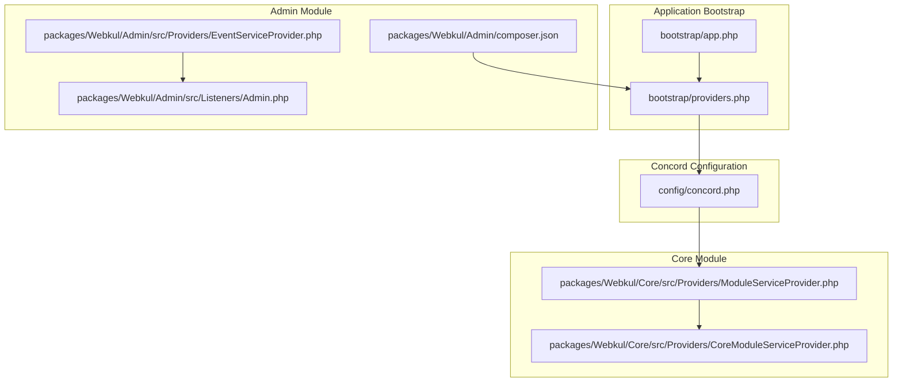
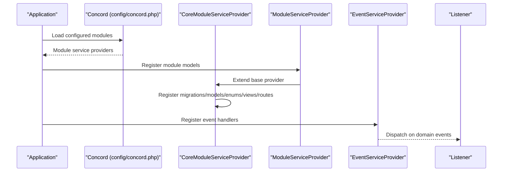
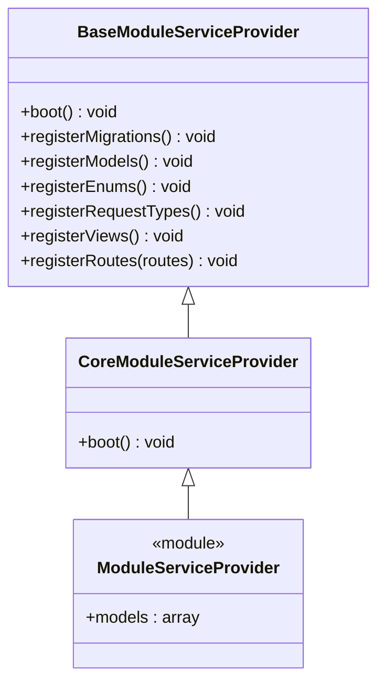
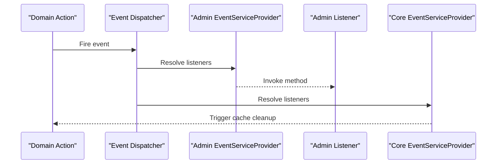
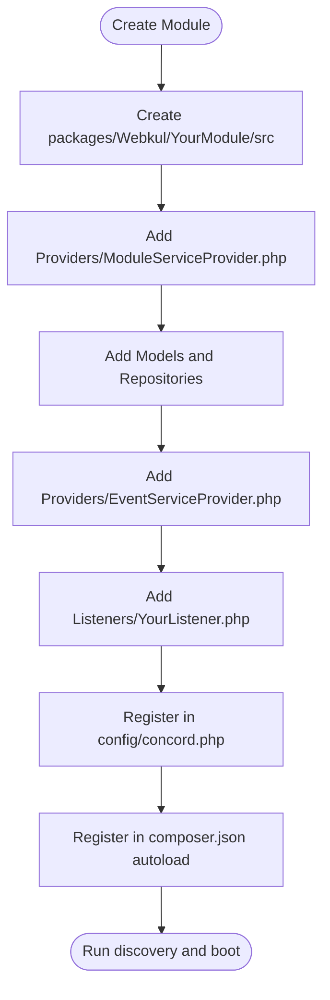
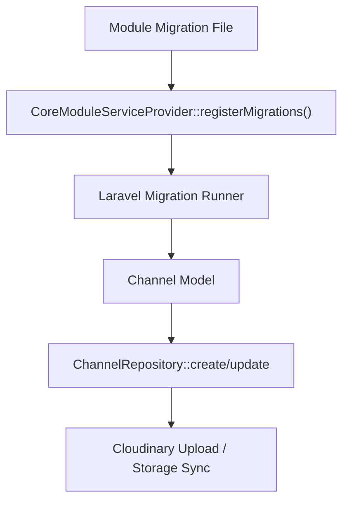
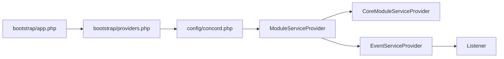

# Extension Development

<cite>
**Referenced Files in This Document**
- [composer.json](file://composer.json)
- [config/concord.php](file://config/concord.php)
- [bootstrap/app.php](file://bootstrap/app.php)
- [bootstrap/providers.php](file://bootstrap/providers.php)
- [packages/Webkul/Core/src/Providers/CoreModuleServiceProvider.php](file://packages/Webkul/Core/src/Providers/CoreModuleServiceProvider.php)
- [packages/Webkul/Core/src/Providers/ModuleServiceProvider.php](file://packages/Webkul/Core/src/Providers/ModuleServiceProvider.php)
- [packages/Webkul/Core/src/Providers/EventServiceProvider.php](file://packages/Webkul/Core/src/Providers/EventServiceProvider.php)
- [packages/Webkul/Admin/src/Providers/EventServiceProvider.php](file://packages/Webkul/Admin/src/Providers/EventServiceProvider.php)
- [packages/Webkul/Admin/src/Listeners/Admin.php](file://packages/Webkul/Admin/src/Listeners/Admin.php)
- [packages/Webkul/Core/src/Models/Channel.php](file://packages/Webkul/Core/src/Models/Channel.php)
- [packages/Webkul/Core/src/Repositories/ChannelRepository.php](file://packages/Webkul/Core/src/Repositories/ChannelRepository.php)
- [packages/Webkul/Admin/composer.json](file://packages/Webkul/Admin/composer.json)
</cite>

## Table of Contents
1. [Introduction](#introduction)
2. [Project Structure](#project-structure)
3. [Core Components](#core-components)
4. [Architecture Overview](#architecture-overview)
5. [Detailed Component Analysis](#detailed-component-analysis)
6. [Dependency Analysis](#dependency-analysis)
7. [Performance Considerations](#performance-considerations)
8. [Troubleshooting Guide](#troubleshooting-guide)
9. [Conclusion](#conclusion)
10. [Appendices](#appendices)

## Introduction
This document explains how to develop extensions and custom modules for Frooxi (Bagisto), focusing on the Concord modular package system, package structure, service provider registration, event-driven architecture, listener implementation, plugin development patterns, database migration strategies, model and view extensions, publishing and dependency management, version compatibility, testing strategies, debugging techniques, and contribution guidelines.

## Project Structure
Frooxi follows a modular monolith built on Laravel and the Concord package manager. Modules live under packages/Webkul/<ModuleName>/ with their own src, Providers, Models, Repositories, Listeners, and Resources. The application registers module service providers centrally via Concord configuration and the framework’s provider registry.

**Diagram sources**
- [bootstrap/app.php:14-56](file://bootstrap/app.php#L14-L56)
- [bootstrap/providers.php:22-49](file://bootstrap/providers.php#L22-L49)
- [config/concord.php:6-37](file://config/concord.php#L6-L37)
- [packages/Webkul/Core/src/Providers/CoreModuleServiceProvider.php:10-36](file://packages/Webkul/Core/src/Providers/CoreModuleServiceProvider.php#L10-L36)
- [packages/Webkul/Core/src/Providers/ModuleServiceProvider.php:16-36](file://packages/Webkul/Core/src/Providers/ModuleServiceProvider.php#L16-L36)
- [packages/Webkul/Admin/src/Providers/EventServiceProvider.php:14-59](file://packages/Webkul/Admin/src/Providers/EventServiceProvider.php#L14-L59)
- [packages/Webkul/Admin/src/Listeners/Admin.php:5-15](file://packages/Webkul/Admin/src/Listeners/Admin.php#L5-L15)
- [packages/Webkul/Admin/composer.json:1-27](file://packages/Webkul/Admin/composer.json#L1-L27)

**Section sources**
- [bootstrap/app.php:14-56](file://bootstrap/app.php#L14-L56)
- [bootstrap/providers.php:22-49](file://bootstrap/providers.php#L22-L49)
- [config/concord.php:6-37](file://config/concord.php#L6-L37)

## Core Components
- Concord configuration defines the module convention and lists module service providers to load.
- CoreModuleServiceProvider extends Concord’s base provider to register migrations, models, enums, request types, views, and routes conditionally.
- ModuleServiceProvider in each module declares the module’s models for registration.
- EventServiceProvider in modules binds domain events to listeners.
- Listeners implement the side effects for domain actions.

Key responsibilities:
- Concord module discovery and loading
- Conditional registration of migrations/models/enums/views/routes
- Event-to-listener binding and invocation
- Model and repository patterns for persistence and business logic

**Section sources**
- [config/concord.php:6-37](file://config/concord.php#L6-L37)
- [packages/Webkul/Core/src/Providers/CoreModuleServiceProvider.php:10-36](file://packages/Webkul/Core/src/Providers/CoreModuleServiceProvider.php#L10-L36)
- [packages/Webkul/Core/src/Providers/ModuleServiceProvider.php:16-36](file://packages/Webkul/Core/src/Providers/ModuleServiceProvider.php#L16-L36)
- [packages/Webkul/Core/src/Providers/EventServiceProvider.php:7-26](file://packages/Webkul/Core/src/Providers/EventServiceProvider.php#L7-L26)
- [packages/Webkul/Admin/src/Providers/EventServiceProvider.php:14-59](file://packages/Webkul/Admin/src/Providers/EventServiceProvider.php#L14-L59)
- [packages/Webkul/Admin/src/Listeners/Admin.php:5-15](file://packages/Webkul/Admin/src/Listeners/Admin.php#L5-L15)

## Architecture Overview
The extension architecture is event-driven and module-based. Modules declare models, repositories, migrations, views, routes, and events. Concord loads modules and their providers, while Laravel’s event system wires events to listeners.

**Diagram sources**
- [config/concord.php:19-35](file://config/concord.php#L19-L35)
- [packages/Webkul/Core/src/Providers/CoreModuleServiceProvider.php:15-34](file://packages/Webkul/Core/src/Providers/CoreModuleServiceProvider.php#L15-L34)
- [packages/Webkul/Core/src/Providers/ModuleServiceProvider.php:23-34](file://packages/Webkul/Core/src/Providers/ModuleServiceProvider.php#L23-L34)
- [packages/Webkul/Admin/src/Providers/EventServiceProvider.php:21-57](file://packages/Webkul/Admin/src/Providers/EventServiceProvider.php#L21-L57)

## Detailed Component Analysis

### Concord Modular Package System
- Modules are autoloaded via PSR-4 and discovered through Composer repositories pointing to packages/*/*.
- Concord configuration lists module service providers and sets the convention class.
- The application registers additional framework service providers alongside module providers.

Implementation highlights:
- Composer autoload maps vendor namespaces to module src directories.
- Concord modules array enumerates module service providers.
- Provider registry includes both application and module providers.

**Section sources**
- [composer.json:58-81](file://composer.json#L58-L81)
- [composer.json:110-116](file://composer.json#L110-L116)
- [config/concord.php:19-35](file://config/concord.php#L19-L35)
- [bootstrap/providers.php:22-49](file://bootstrap/providers.php#L22-L49)

### Service Provider Registration Patterns
- CoreModuleServiceProvider overrides boot to conditionally register migrations, models, enums, request types, views, and routes.
- ModuleServiceProvider in each module defines its models for registration.
- EventServiceProvider binds domain events to listener classes.

**Diagram sources**
- [packages/Webkul/Core/src/Providers/CoreModuleServiceProvider.php:10-36](file://packages/Webkul/Core/src/Providers/CoreModuleServiceProvider.php#L10-L36)
- [packages/Webkul/Core/src/Providers/ModuleServiceProvider.php:16-36](file://packages/Webkul/Core/src/Providers/ModuleServiceProvider.php#L16-L36)

**Section sources**
- [packages/Webkul/Core/src/Providers/CoreModuleServiceProvider.php:15-34](file://packages/Webkul/Core/src/Providers/CoreModuleServiceProvider.php#L15-L34)
- [packages/Webkul/Core/src/Providers/ModuleServiceProvider.php:23-34](file://packages/Webkul/Core/src/Providers/ModuleServiceProvider.php#L23-L34)

### Event-Driven Architecture and Listener Implementation
- Domain events are declared as strings and mapped to listener classes in EventServiceProvider.
- Listeners implement methods invoked after domain actions (e.g., password update, order save, invoice creation).
- Core listens to repository lifecycle events to clean caches.

**Diagram sources**
- [packages/Webkul/Admin/src/Providers/EventServiceProvider.php:21-57](file://packages/Webkul/Admin/src/Providers/EventServiceProvider.php#L21-L57)
- [packages/Webkul/Admin/src/Listeners/Admin.php:13-14](file://packages/Webkul/Admin/src/Listeners/Admin.php#L13-L14)
- [packages/Webkul/Core/src/Providers/EventServiceProvider.php:14-24](file://packages/Webkul/Core/src/Providers/EventServiceProvider.php#L14-L24)

**Section sources**
- [packages/Webkul/Admin/src/Providers/EventServiceProvider.php:14-59](file://packages/Webkul/Admin/src/Providers/EventServiceProvider.php#L14-L59)
- [packages/Webkul/Admin/src/Listeners/Admin.php:5-15](file://packages/Webkul/Admin/src/Listeners/Admin.php#L5-L15)
- [packages/Webkul/Core/src/Providers/EventServiceProvider.php:7-26](file://packages/Webkul/Core/src/Providers/EventServiceProvider.php#L7-L26)

### Plugin Development Patterns
- Define a new module under packages/Webkul/<YourModule>/ with src, Providers, Models, Repositories, Listeners, and Resources.
- Create a ModuleServiceProvider extending CoreModuleServiceProvider and declare models.
- Add an EventServiceProvider to bind domain events to listeners.
- Register your module’s provider in Concord configuration and Composer autoload.

**Diagram sources**
- [config/concord.php:19-35](file://config/concord.php#L19-L35)
- [composer.json:58-81](file://composer.json#L58-L81)
- [packages/Webkul/Core/src/Providers/CoreModuleServiceProvider.php:15-34](file://packages/Webkul/Core/src/Providers/CoreModuleServiceProvider.php#L15-L34)

**Section sources**
- [config/concord.php:19-35](file://config/concord.php#L19-L35)
- [composer.json:58-81](file://composer.json#L58-L81)
- [packages/Webkul/Core/src/Providers/CoreModuleServiceProvider.php:15-34](file://packages/Webkul/Core/src/Providers/CoreModuleServiceProvider.php#L15-L34)

### Database Migration Strategies and Model Extensions
- CoreModuleServiceProvider registers migrations when enabled, allowing modules to ship migrations independently.
- Models define fillable attributes, casts, translated attributes, and relationships.
- Repositories encapsulate persistence logic and handle media uploads.

**Diagram sources**
- [packages/Webkul/Core/src/Providers/CoreModuleServiceProvider.php:17-19](file://packages/Webkul/Core/src/Providers/CoreModuleServiceProvider.php#L17-L19)
- [packages/Webkul/Core/src/Models/Channel.php:25-47](file://packages/Webkul/Core/src/Models/Channel.php#L25-L47)
- [packages/Webkul/Core/src/Repositories/ChannelRepository.php:24-50](file://packages/Webkul/Core/src/Repositories/ChannelRepository.php#L24-L50)

**Section sources**
- [packages/Webkul/Core/src/Providers/CoreModuleServiceProvider.php:17-25](file://packages/Webkul/Core/src/Providers/CoreModuleServiceProvider.php#L17-L25)
- [packages/Webkul/Core/src/Models/Channel.php:16-157](file://packages/Webkul/Core/src/Models/Channel.php#L16-L157)
- [packages/Webkul/Core/src/Repositories/ChannelRepository.php:9-103](file://packages/Webkul/Core/src/Repositories/ChannelRepository.php#L9-L103)

### View Customization and Publishing
- Views are registered conditionally in CoreModuleServiceProvider when enabled.
- Modules can publish views to override defaults in the host application.

Practical steps:
- Place views under Resources/views in your module.
- Enable view registration in the module provider.
- Publish views from the module to the application using Laravel’s publishing mechanisms.

**Section sources**
- [packages/Webkul/Core/src/Providers/CoreModuleServiceProvider.php:27-29](file://packages/Webkul/Core/src/Providers/CoreModuleServiceProvider.php#L27-L29)

### Package Publishing and Dependency Management
- Composer repositories enable local development of modules via symlinked path packages.
- Each module’s composer.json can declare its provider and aliases for automatic discovery.
- The root composer.json autoloads module namespaces and runs package discovery.

Best practices:
- Keep module composer.json minimal; rely on root autoload and provider registration.
- Use extra.laravel.providers to auto-register module providers.
- Align PHP and framework versions with the root configuration.

**Section sources**
- [composer.json:110-116](file://composer.json#L110-L116)
- [packages/Webkul/Admin/composer.json:17-24](file://packages/Webkul/Admin/composer.json#L17-L24)
- [composer.json:58-81](file://composer.json#L58-L81)

### Version Compatibility
- Root composer.json requires PHP ^8.3 and Laravel framework ^12.0.
- Concord ^1.16 integrates module management.
- Align module dependencies with the host application’s major versions.

**Section sources**
- [composer.json:10-45](file://composer.json#L10-L45)

## Dependency Analysis
The system exhibits low coupling between modules through Concord and Laravel’s service container. Dependencies flow from the application bootstrap to Concord, then to module providers and listeners.

**Diagram sources**
- [bootstrap/app.php:14-56](file://bootstrap/app.php#L14-L56)
- [bootstrap/providers.php:22-49](file://bootstrap/providers.php#L22-L49)
- [config/concord.php:19-35](file://config/concord.php#L19-L35)
- [packages/Webkul/Core/src/Providers/ModuleServiceProvider.php:16-36](file://packages/Webkul/Core/src/Providers/ModuleServiceProvider.php#L16-L36)
- [packages/Webkul/Core/src/Providers/CoreModuleServiceProvider.php:10-36](file://packages/Webkul/Core/src/Providers/CoreModuleServiceProvider.php#L10-L36)
- [packages/Webkul/Admin/src/Providers/EventServiceProvider.php:14-59](file://packages/Webkul/Admin/src/Providers/EventServiceProvider.php#L14-L59)

**Section sources**
- [bootstrap/app.php:14-56](file://bootstrap/app.php#L14-L56)
- [bootstrap/providers.php:22-49](file://bootstrap/providers.php#L22-L49)
- [config/concord.php:19-35](file://config/concord.php#L19-L35)

## Performance Considerations
- Prefer repository patterns to centralize persistence logic and reduce duplication.
- Use lazy registration of views and routes via CoreModuleServiceProvider to minimize boot overhead.
- Avoid heavy operations in listeners; defer to queued jobs when appropriate.
- Keep migrations small and incremental; test migrations in isolation before merging.

## Troubleshooting Guide
- If a module’s migrations are not applied, verify migrations are enabled in the provider and the module is listed in Concord configuration.
- If listeners are not triggered, confirm event strings match and EventServiceProvider mappings are correct.
- If views are not overriding, ensure view registration is enabled and publishing was executed.
- For autoload issues, re-run discovery and clear caches.

**Section sources**
- [packages/Webkul/Core/src/Providers/CoreModuleServiceProvider.php:17-34](file://packages/Webkul/Core/src/Providers/CoreModuleServiceProvider.php#L17-L34)
- [packages/Webkul/Admin/src/Providers/EventServiceProvider.php:21-57](file://packages/Webkul/Admin/src/Providers/EventServiceProvider.php#L21-L57)
- [composer.json:92-101](file://composer.json#L92-L101)

## Conclusion
Frooxi’s extension model leverages Concord for modular packaging, Laravel’s provider system for registration, and an event-driven architecture for decoupled behavior. By following the patterns outlined—module structure, service provider registration, event mapping, repository-centric persistence, and careful dependency management—you can build robust, maintainable extensions that integrate seamlessly with the platform.

## Appendices

### Appendix A: Creating a New Module Checklist
- Create packages/Webkul/YourModule/src with Providers, Models, Repositories, Listeners, Resources.
- Add a ModuleServiceProvider extending CoreModuleServiceProvider and declare models.
- Add an EventServiceProvider mapping domain events to listeners.
- Register the module provider in config/concord.php.
- Ensure PSR-4 autoload and optional provider aliasing in module composer.json.
- Run discovery and verify migrations, views, and events.

**Section sources**
- [config/concord.php:19-35](file://config/concord.php#L19-L35)
- [packages/Webkul/Core/src/Providers/CoreModuleServiceProvider.php:15-34](file://packages/Webkul/Core/src/Providers/CoreModuleServiceProvider.php#L15-L34)
- [packages/Webkul/Admin/composer.json:17-24](file://packages/Webkul/Admin/composer.json#L17-L24)
- [composer.json:58-81](file://composer.json#L58-L81)