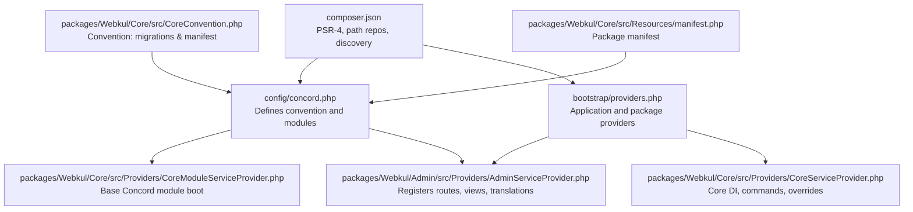
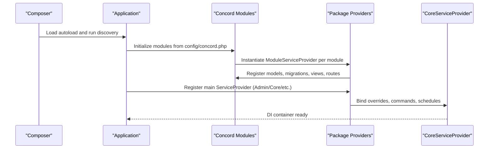
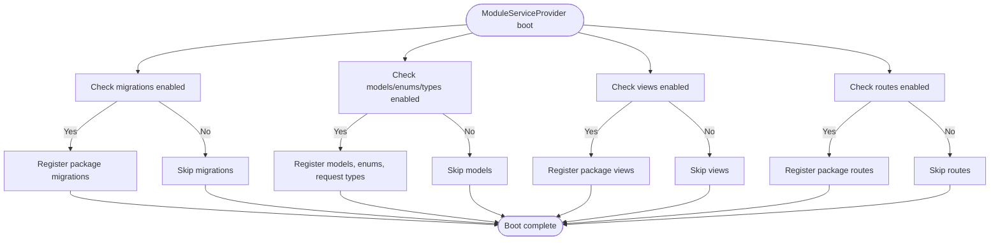
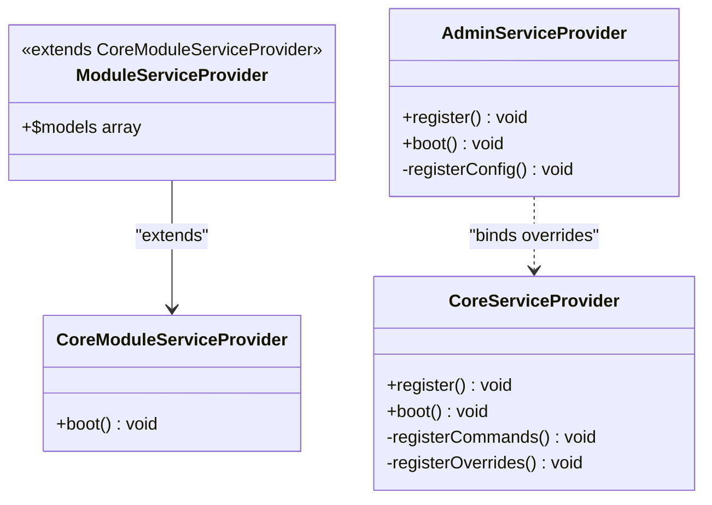
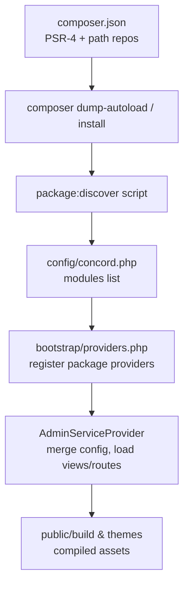
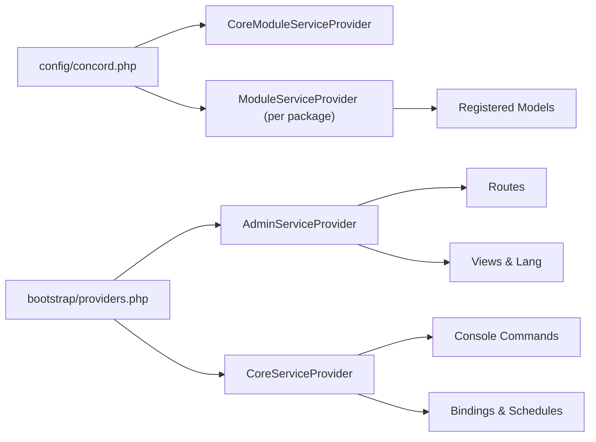

# Package Development

<cite>
**Referenced Files in This Document**
- [config/concord.php](file://config/concord.php)
- [composer.json](file://composer.json)
- [bootstrap/app.php](file://bootstrap/app.php)
- [bootstrap/providers.php](file://bootstrap/providers.php)
- [packages/Webkul/Core/src/Providers/CoreModuleServiceProvider.php](file://packages/Webkul/Core/src/Providers/CoreModuleServiceProvider.php)
- [packages/Webkul/Core/src/Providers/CoreServiceProvider.php](file://packages/Webkul/Core/src/Providers/CoreServiceProvider.php)
- [packages/Webkul/Core/src/Providers/ModuleServiceProvider.php](file://packages/Webkul/Core/src/Providers/ModuleServiceProvider.php)
- [packages/Webkul/Admin/src/Providers/AdminServiceProvider.php](file://packages/Webkul/Admin/src/Providers/AdminServiceProvider.php)
- [packages/Webkul/Product/src/Providers/ModuleServiceProvider.php](file://packages/Webkul/Product/src/Providers/ModuleServiceProvider.php)
- [packages/Webkul/Core/src/CoreConvention.php](file://packages/Webkul/Core/src/CoreConvention.php)
- [packages/Webkul/Core/src/Resources/manifest.php](file://packages/Webkul/Core/src/Resources/manifest.php)
- [packages/Webkul/Admin/composer.json](file://packages/Webkul/Admin/composer.json)
- [AGENTS.md](file://AGENTS.md)
</cite>

## Table of Contents
1. [Introduction](#introduction)
2. [Project Structure](#project-structure)
3. [Core Components](#core-components)
4. [Architecture Overview](#architecture-overview)
5. [Detailed Component Analysis](#detailed-component-analysis)
6. [Dependency Analysis](#dependency-analysis)
7. [Performance Considerations](#performance-considerations)
8. [Troubleshooting Guide](#troubleshooting-guide)
9. [Conclusion](#conclusion)
10. [Appendices](#appendices)

## Introduction
This document explains how to develop custom packages in the Frooxi modular system built on Laravel and Konekt Concord. It covers the Concord package architecture, package structure requirements, service provider registration patterns, module lifecycle, model registration, dependency injection, package discovery, configuration publishing, and asset compilation. Practical examples show how to create a new package, implement service providers, and integrate with the core system. It also documents package naming conventions, namespace organization, and composer.json configuration for proper package registration.

## Project Structure
Frooxi organizes packages under packages/Webkul/<PackageName>/ with a consistent structure per package:
- src/: Public API, models, contracts, repositories, providers, resources, and routes
- Resources/: Views, language files, and manifest
- Database/: Migrations and factories
- Tests/: Optional test suites
- composer.json: Package metadata, autoload, and Laravel extra providers/aliases

Key integration points:
- config/concord.php defines the convention class and lists module service providers
- bootstrap/providers.php registers application and package service providers
- composer.json configures PSR-4 autoloading, path repositories, and package discovery scripts

**Diagram sources**
- [config/concord.php:1-37](file://config/concord.php#L1-L37)
- [packages/Webkul/Core/src/Providers/CoreModuleServiceProvider.php:1-36](file://packages/Webkul/Core/src/Providers/CoreModuleServiceProvider.php#L1-L36)
- [packages/Webkul/Admin/src/Providers/AdminServiceProvider.php:1-57](file://packages/Webkul/Admin/src/Providers/AdminServiceProvider.php#L1-L57)
- [bootstrap/providers.php:1-49](file://bootstrap/providers.php#L1-L49)
- [packages/Webkul/Core/src/Providers/CoreServiceProvider.php:1-142](file://packages/Webkul/Core/src/Providers/CoreServiceProvider.php#L1-L142)
- [composer.json:1-135](file://composer.json#L1-L135)
- [packages/Webkul/Core/src/CoreConvention.php:1-25](file://packages/Webkul/Core/src/CoreConvention.php#L1-L25)
- [packages/Webkul/Core/src/Resources/manifest.php:1-7](file://packages/Webkul/Core/src/Resources/manifest.php#L1-L7)

**Section sources**
- [config/concord.php:1-37](file://config/concord.php#L1-L37)
- [bootstrap/providers.php:1-49](file://bootstrap/providers.php#L1-L49)
- [composer.json:1-135](file://composer.json#L1-L135)

## Core Components
- Concord Convention and Module Boot
  - CoreConvention customizes migration and manifest locations for packages.
  - CoreModuleServiceProvider extends Concord’s base to register migrations, models, enums, request types, views, and routes based on configuration flags.
- Package Service Providers
  - AdminServiceProvider registers routes with middleware, loads translations and views, registers anonymous Blade components, and defers to EventServiceProvider.
  - CoreServiceProvider handles console command registration, override bindings, scheduling, and view compiler binding.
  - ModuleServiceProvider in each package lists models to be registered by Concord.
- Configuration and Discovery
  - config/concord.php declares the convention and module providers.
  - composer.json defines PSR-4 namespaces, path repositories, and runs package:discover to wire packages into the application.

**Section sources**
- [packages/Webkul/Core/src/CoreConvention.php:1-25](file://packages/Webkul/Core/src/CoreConvention.php#L1-L25)
- [packages/Webkul/Core/src/Providers/CoreModuleServiceProvider.php:1-36](file://packages/Webkul/Core/src/Providers/CoreModuleServiceProvider.php#L1-L36)
- [packages/Webkul/Admin/src/Providers/AdminServiceProvider.php:1-57](file://packages/Webkul/Admin/src/Providers/AdminServiceProvider.php#L1-L57)
- [packages/Webkul/Core/src/Providers/CoreServiceProvider.php:1-142](file://packages/Webkul/Core/src/Providers/CoreServiceProvider.php#L1-L142)
- [packages/Webkul/Core/src/Providers/ModuleServiceProvider.php:1-36](file://packages/Webkul/Core/src/Providers/ModuleServiceProvider.php#L1-L36)
- [config/concord.php:1-37](file://config/concord.php#L1-L37)
- [composer.json:1-135](file://composer.json#L1-L135)

## Architecture Overview
The package architecture follows a layered pattern:
- Concord Module Layer: Provides module bootstrapping, model registration, and routing.
- Package Provider Layer: Registers routes, views, translations, migrations, and configuration.
- Application Provider Layer: Wires package providers into the application via bootstrap/providers.php.
- Composer Integration: Autoloads packages, discovers them, and symlinks path-based packages for rapid iteration.

**Diagram sources**
- [config/concord.php:1-37](file://config/concord.php#L1-L37)
- [packages/Webkul/Core/src/Providers/CoreModuleServiceProvider.php:1-36](file://packages/Webkul/Core/src/Providers/CoreModuleServiceProvider.php#L1-L36)
- [packages/Webkul/Admin/src/Providers/AdminServiceProvider.php:1-57](file://packages/Webkul/Admin/src/Providers/AdminServiceProvider.php#L1-L57)
- [packages/Webkul/Core/src/Providers/CoreServiceProvider.php:1-142](file://packages/Webkul/Core/src/Providers/CoreServiceProvider.php#L1-L142)
- [composer.json:1-135](file://composer.json#L1-L135)

## Detailed Component Analysis

### Concord Module Lifecycle and Model Registration
Concord’s module lifecycle is orchestrated by CoreModuleServiceProvider:
- Boot phase checks flags for migrations, models/enums/request types, views, and routes.
- ModuleServiceProvider subclasses define the $models array to register with Concord.
- CoreConvention customizes where migrations and manifests live.

**Diagram sources**
- [packages/Webkul/Core/src/Providers/CoreModuleServiceProvider.php:15-34](file://packages/Webkul/Core/src/Providers/CoreModuleServiceProvider.php#L15-L34)
- [packages/Webkul/Core/src/CoreConvention.php:12-23](file://packages/Webkul/Core/src/CoreConvention.php#L12-L23)
- [packages/Webkul/Core/src/Providers/ModuleServiceProvider.php:23-34](file://packages/Webkul/Core/src/Providers/ModuleServiceProvider.php#L23-L34)

**Section sources**
- [packages/Webkul/Core/src/Providers/CoreModuleServiceProvider.php:1-36](file://packages/Webkul/Core/src/Providers/CoreModuleServiceProvider.php#L1-L36)
- [packages/Webkul/Core/src/CoreConvention.php:1-25](file://packages/Webkul/Core/src/CoreConvention.php#L1-L25)
- [packages/Webkul/Core/src/Providers/ModuleServiceProvider.php:1-36](file://packages/Webkul/Core/src/Providers/ModuleServiceProvider.php#L1-L36)

### Service Provider Registration Patterns
- Application-level providers are registered in bootstrap/providers.php.
- Package-level providers (e.g., AdminServiceProvider) load routes, views, translations, and register nested event/service providers.
- CoreServiceProvider binds overrides, console commands, schedules, and custom blade compiler.

**Diagram sources**
- [packages/Webkul/Core/src/Providers/CoreModuleServiceProvider.php:1-36](file://packages/Webkul/Core/src/Providers/CoreModuleServiceProvider.php#L1-L36)
- [packages/Webkul/Core/src/Providers/ModuleServiceProvider.php:1-36](file://packages/Webkul/Core/src/Providers/ModuleServiceProvider.php#L1-L36)
- [packages/Webkul/Admin/src/Providers/AdminServiceProvider.php:1-57](file://packages/Webkul/Admin/src/Providers/AdminServiceProvider.php#L1-L57)
- [packages/Webkul/Core/src/Providers/CoreServiceProvider.php:1-142](file://packages/Webkul/Core/src/Providers/CoreServiceProvider.php#L1-L142)

**Section sources**
- [bootstrap/providers.php:1-49](file://bootstrap/providers.php#L1-L49)
- [packages/Webkul/Admin/src/Providers/AdminServiceProvider.php:1-57](file://packages/Webkul/Admin/src/Providers/AdminServiceProvider.php#L1-L57)
- [packages/Webkul/Core/src/Providers/CoreServiceProvider.php:1-142](file://packages/Webkul/Core/src/Providers/CoreServiceProvider.php#L1-L142)

### Dependency Injection and Overrides
CoreServiceProvider demonstrates several DI patterns:
- Extending console commands (UpCommand, DownCommand)
- Binding interface implementations (ExceptionHandler, Maintenance middleware)
- Singleton bindings (Elasticsearch client, custom Blade compiler)
These patterns ensure the core system can be extended without modifying vendor code.

**Section sources**
- [packages/Webkul/Core/src/Providers/CoreServiceProvider.php:111-140](file://packages/Webkul/Core/src/Providers/CoreServiceProvider.php#L111-L140)

### Package Discovery, Configuration Publishing, and Asset Compilation
- Discovery and autoload
  - composer.json defines PSR-4 namespaces for packages and uses path repositories to symlink packages under packages/*/*.
  - Scripts run package:discover to wire packages into the application.
- Configuration publishing
  - AdminServiceProvider merges package config into application config keys (menu, acl, core).
- Asset compilation
  - Packages include frontend tooling (Vite/Tailwind) and build artifacts under public/themes and public/build. Assets are compiled and served via configured build manifests.

**Diagram sources**
- [composer.json:58-116](file://composer.json#L58-L116)
- [config/concord.php:19-35](file://config/concord.php#L19-L35)
- [bootstrap/providers.php:22-48](file://bootstrap/providers.php#L22-L48)
- [packages/Webkul/Admin/src/Providers/AdminServiceProvider.php:39-55](file://packages/Webkul/Admin/src/Providers/AdminServiceProvider.php#L39-L55)

**Section sources**
- [composer.json:1-135](file://composer.json#L1-L135)
- [config/concord.php:1-37](file://config/concord.php#L1-L37)
- [bootstrap/providers.php:1-49](file://bootstrap/providers.php#L1-L49)
- [packages/Webkul/Admin/src/Providers/AdminServiceProvider.php:1-57](file://packages/Webkul/Admin/src/Providers/AdminServiceProvider.php#L1-L57)

### Practical Examples

#### Creating a New Package
Steps to scaffold a new package:
1. Create directory packages/Webkul/<YourPackage>/src and add composer.json with PSR-4 and Laravel extra providers.
2. Implement a ModuleServiceProvider extending CoreModuleServiceProvider and declare $models.
3. Optionally implement a main ServiceProvider (e.g., YourPackageServiceProvider) to load routes, views, and translations.
4. Register your ModuleServiceProvider in config/concord.php under modules.
5. Register your main ServiceProvider in bootstrap/providers.php if needed.
6. Run composer dump-autoload to refresh autoload maps.

References:
- [packages/Webkul/Admin/composer.json:12-24](file://packages/Webkul/Admin/composer.json#L12-L24)
- [packages/Webkul/Core/src/Providers/CoreModuleServiceProvider.php:10-34](file://packages/Webkul/Core/src/Providers/CoreModuleServiceProvider.php#L10-L34)
- [packages/Webkul/Core/src/Providers/ModuleServiceProvider.php:16-34](file://packages/Webkul/Core/src/Providers/ModuleServiceProvider.php#L16-L34)
- [config/concord.php:19-35](file://config/concord.php#L19-L35)
- [bootstrap/providers.php:22-48](file://bootstrap/providers.php#L22-L48)

#### Implementing a Service Provider
- For route/view/config loading, use a main ServiceProvider similar to AdminServiceProvider.
- For Concord module wiring, subclass CoreModuleServiceProvider and define $models in ModuleServiceProvider.

References:
- [packages/Webkul/Admin/src/Providers/AdminServiceProvider.php:15-34](file://packages/Webkul/Admin/src/Providers/AdminServiceProvider.php#L15-L34)
- [packages/Webkul/Core/src/Providers/CoreModuleServiceProvider.php:15-34](file://packages/Webkul/Core/src/Providers/CoreModuleServiceProvider.php#L15-L34)
- [packages/Webkul/Core/src/Providers/ModuleServiceProvider.php:23-34](file://packages/Webkul/Core/src/Providers/ModuleServiceProvider.php#L23-L34)

#### Integrating with the Core System
- Use CoreServiceProvider patterns to bind overrides and register console commands.
- Leverage CoreConvention to place migrations and manifests in conventional locations.

References:
- [packages/Webkul/Core/src/Providers/CoreServiceProvider.php:27-63](file://packages/Webkul/Core/src/Providers/CoreServiceProvider.php#L27-L63)
- [packages/Webkul/Core/src/CoreConvention.php:12-23](file://packages/Webkul/Core/src/CoreConvention.php#L12-L23)

## Dependency Analysis
The following diagram maps key dependencies among providers and configuration:

**Diagram sources**
- [config/concord.php:19-35](file://config/concord.php#L19-L35)
- [packages/Webkul/Core/src/Providers/CoreModuleServiceProvider.php:10-34](file://packages/Webkul/Core/src/Providers/CoreModuleServiceProvider.php#L10-L34)
- [packages/Webkul/Core/src/Providers/ModuleServiceProvider.php:16-34](file://packages/Webkul/Core/src/Providers/ModuleServiceProvider.php#L16-L34)
- [bootstrap/providers.php:22-48](file://bootstrap/providers.php#L22-L48)
- [packages/Webkul/Admin/src/Providers/AdminServiceProvider.php:23-34](file://packages/Webkul/Admin/src/Providers/AdminServiceProvider.php#L23-L34)
- [packages/Webkul/Core/src/Providers/CoreServiceProvider.php:27-63](file://packages/Webkul/Core/src/Providers/CoreServiceProvider.php#L27-L63)

**Section sources**
- [config/concord.php:1-37](file://config/concord.php#L1-L37)
- [bootstrap/providers.php:1-49](file://bootstrap/providers.php#L1-L49)

## Performance Considerations
- Keep migrations minimal and scoped to package boundaries; use CoreConvention to centralize migration discovery.
- Prefer lazy registration of routes and views; only enable what is needed per environment.
- Use Composer path repositories for local package development to avoid frequent composer updates.
- Cache configuration and routes after package development to reduce overhead during iteration.

## Troubleshooting Guide
- Package not discovered
  - Ensure PSR-4 autoload includes your namespace and packages are symlinked via path repositories.
  - Run composer dump-autoload and re-run package:discover.
- Module not booting
  - Confirm your ModuleServiceProvider extends CoreModuleServiceProvider and is listed in config/concord.php.
  - Verify $models array is populated if models are required.
- Routes not loading
  - Ensure your main ServiceProvider registers routes and middleware groups as needed.
- Configuration not merging
  - Confirm mergeConfigFrom calls in your main ServiceProvider target existing keys.

**Section sources**
- [composer.json:58-116](file://composer.json#L58-L116)
- [config/concord.php:19-35](file://config/concord.php#L19-L35)
- [packages/Webkul/Admin/src/Providers/AdminServiceProvider.php:39-55](file://packages/Webkul/Admin/src/Providers/AdminServiceProvider.php#L39-L55)

## Conclusion
Frooxi’s package development model leverages Concord for modular bootstrapping, Laravel service providers for integration, and Composer for discovery and autoloading. By following the conventions documented here—naming, structure, provider roles, and configuration—you can build robust, maintainable packages that integrate seamlessly with the core system.

## Appendices

### Package Naming Conventions and Namespace Organization
- Vendor and package naming: Webkul/<PackageName>
- Namespace: Webkul\<PackageName>\...
- Directory layout: packages/Webkul/<PackageName>/src
- Composer name: Use a descriptive name and ensure PSR-4 maps to src/

**Section sources**
- [packages/Webkul/Admin/composer.json:2-26](file://packages/Webkul/Admin/composer.json#L2-L26)
- [composer.json:63-79](file://composer.json#L63-L79)

### composer.json Configuration for Package Registration
- PSR-4 autoload maps Webkul\<PackageName>\ to packages/Webkul/<PackageName>/src
- Path repositories enable symlinked packages under packages/*/*
- Scripts trigger package:discover to register packages automatically

**Section sources**
- [composer.json:58-116](file://composer.json#L58-L116)

### Concord Configuration Reference
- convention: CoreConvention class location
- modules: Fully qualified ModuleServiceProvider classes for each package

**Section sources**
- [config/concord.php:6-35](file://config/concord.php#L6-L35)

### Manifest and Versioning
- Package manifest defines name and version for runtime introspection

**Section sources**
- [packages/Webkul/Core/src/Resources/manifest.php:4-6](file://packages/Webkul/Core/src/Resources/manifest.php#L4-L6)