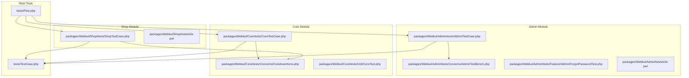
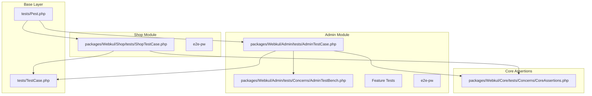
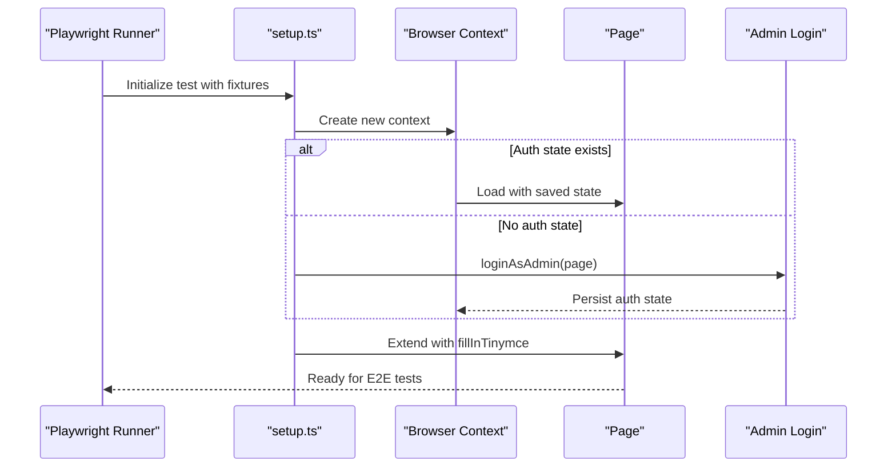
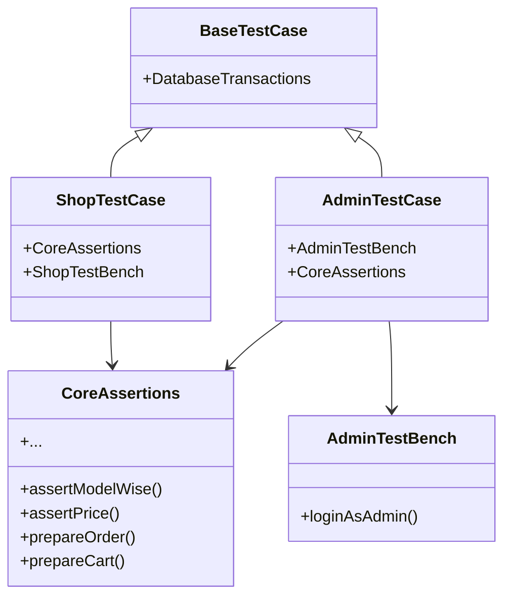
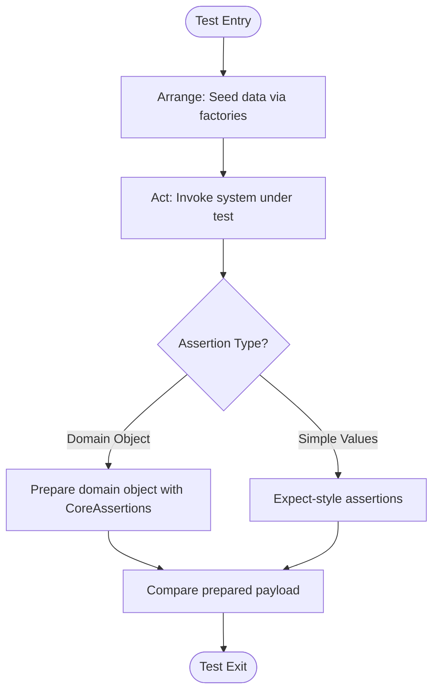
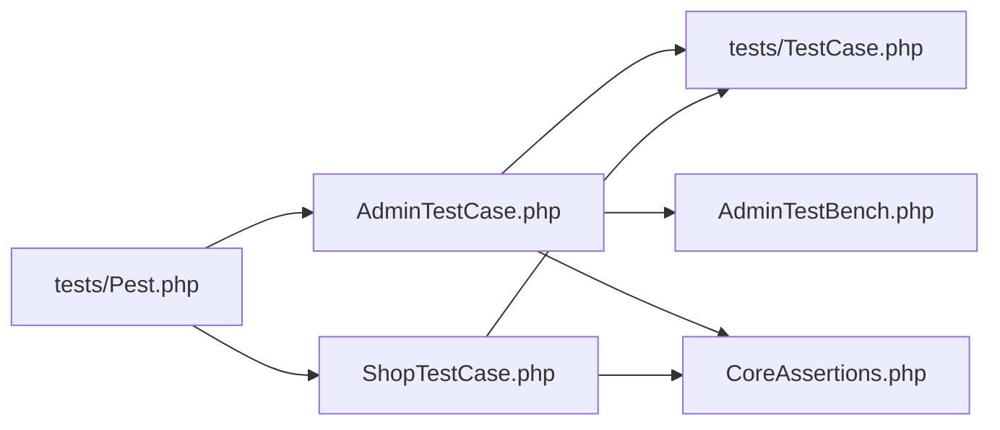

# Testing Strategies

<cite>
**Referenced Files in This Document**
- [tests/TestCase.php](file://tests/TestCase.php)
- [tests/Pest.php](file://tests/Pest.php)
- [packages/Webkul/Admin/tests/AdminTestCase.php](file://packages/Webkul/Admin/tests/AdminTestCase.php)
- [packages/Webkul/Admin/tests/Concerns/AdminTestBench.php](file://packages/Webkul/Admin/tests/Concerns/AdminTestBench.php)
- [packages/Webkul/Admin/tests/Feature/Admin/ForgotPasswordTest.php](file://packages/Webkul/Admin/tests/Feature/Admin/ForgotPasswordTest.php)
- [packages/Webkul/Admin/tests/e2e-pw/playwright.config.ts](file://packages/Webkul/Admin/tests/e2e-pw/playwright.config.ts)
- [packages/Webkul/Admin/tests/e2e-pw/setup.ts](file://packages/Webkul/Admin/tests/e2e-pw/setup.ts)
- [packages/Webkul/Core/tests/CoreTestCase.php](file://packages/Webkul/Core/tests/CoreTestCase.php)
- [packages/Webkul/Core/tests/Concerns/CoreAssertions.php](file://packages/Webkul/Core/tests/Concerns/CoreAssertions.php)
- [packages/Webkul/Core/tests/Unit/CoreTest.php](file://packages/Webkul/Core/tests/Unit/CoreTest.php)
- [packages/Webkul/Shop/tests/ShopTestCase.php](file://packages/Webkul/Shop/tests/ShopTestCase.php)
- [packages/Webkul/Shop/tests/e2e-pw/playwright.config.ts](file://packages/Webkul/Shop/tests/e2e-pw/playwright.config.ts)
</cite>

## Table of Contents
1. [Introduction](#introduction)
2. [Project Structure](#project-structure)
3. [Core Components](#core-components)
4. [Architecture Overview](#architecture-overview)
5. [Detailed Component Analysis](#detailed-component-analysis)
6. [Dependency Analysis](#dependency-analysis)
7. [Performance Considerations](#performance-considerations)
8. [Troubleshooting Guide](#troubleshooting-guide)
9. [Conclusion](#conclusion)
10. [Appendices](#appendices)

## Introduction
This document explains testing strategies for custom extensions in Frooxi (Bagisto), focusing on unit testing, feature testing, and end-to-end testing. It covers test case setup, mocking strategies, assertion patterns, testing utilities, fixtures, and database seeding. Practical examples demonstrate testing custom packages, validating event handlers, and ensuring compatibility with core functionality. Guidance is also included for test automation and continuous integration setup, along with quality assurance best practices tailored to extension development.

## Project Structure
The repository organizes tests by module under packages/Webkul/<Module>/tests, with shared base test classes in tests/. Each module’s tests include:
- Unit tests for pure logic and isolated components
- Feature tests for HTTP/API interactions
- End-to-end tests using Playwright under e2e-pw

**Diagram sources**
- [tests/TestCase.php:1-12](file://tests/TestCase.php#L1-L12)
- [tests/Pest.php:1-68](file://tests/Pest.php#L1-L68)
- [packages/Webkul/Admin/tests/AdminTestCase.php:1-13](file://packages/Webkul/Admin/tests/AdminTestCase.php#L1-L13)
- [packages/Webkul/Admin/tests/Concerns/AdminTestBench.php:1-22](file://packages/Webkul/Admin/tests/Concerns/AdminTestBench.php#L1-L22)
- [packages/Webkul/Admin/tests/Feature/Admin/ForgotPasswordTest.php:1-33](file://packages/Webkul/Admin/tests/Feature/Admin/ForgotPasswordTest.php#L1-L33)
- [packages/Webkul/Admin/tests/e2e-pw/playwright.config.ts:1-59](file://packages/Webkul/Admin/tests/e2e-pw/playwright.config.ts#L1-L59)
- [packages/Webkul/Admin/tests/e2e-pw/setup.ts:1-108](file://packages/Webkul/Admin/tests/e2e-pw/setup.ts#L1-L108)
- [packages/Webkul/Core/tests/CoreTestCase.php:1-12](file://packages/Webkul/Core/tests/CoreTestCase.php#L1-L12)
- [packages/Webkul/Core/tests/Concerns/CoreAssertions.php:1-555](file://packages/Webkul/Core/tests/Concerns/CoreAssertions.php#L1-L555)
- [packages/Webkul/Core/tests/Unit/CoreTest.php:1-719](file://packages/Webkul/Core/tests/Unit/CoreTest.php#L1-L719)
- [packages/Webkul/Shop/tests/ShopTestCase.php:1-13](file://packages/Webkul/Shop/tests/ShopTestCase.php#L1-L13)
- [packages/Webkul/Shop/tests/e2e-pw/playwright.config.ts:1-58](file://packages/Webkul/Shop/tests/e2e-pw/playwright.config.ts#L1-L58)

**Section sources**
- [tests/TestCase.php:1-12](file://tests/TestCase.php#L1-L12)
- [tests/Pest.php:1-68](file://tests/Pest.php#L1-L68)

## Core Components
- Shared base test case: Provides transactional database behavior for fast, clean tests.
- Pest configuration: Centralizes test case bindings and global helpers for module-specific test suites.
- Module test cases: Extend the shared base and bring in reusable traits for assertions and test benches.
- Assertions and factories: Utilities to assert domain-specific structures and seed data consistently.

Key responsibilities:
- tests/TestCase.php: Base class enabling database transactions per test.
- tests/Pest.php: Registers module-specific test cases and global expectations/helpers.
- packages/Webkul/Core/tests/Concerns/CoreAssertions.php: Rich assertion helpers for orders, carts, payments, invoices, rules, and addresses.
- packages/Webkul/Admin/tests/Concerns/AdminTestBench.php: Helper to log in as admin for admin tests.

**Section sources**
- [tests/TestCase.php:1-12](file://tests/TestCase.php#L1-L12)
- [tests/Pest.php:1-68](file://tests/Pest.php#L1-L68)
- [packages/Webkul/Core/tests/Concerns/CoreAssertions.php:1-555](file://packages/Webkul/Core/tests/Concerns/CoreAssertions.php#L1-L555)
- [packages/Webkul/Admin/tests/Concerns/AdminTestBench.php:1-22](file://packages/Webkul/Admin/tests/Concerns/AdminTestBench.php#L1-L22)

## Architecture Overview
The testing architecture follows a layered pattern:
- Base layer: Shared test harness and configuration
- Module layer: Module-specific test cases and traits
- Test layer: Unit, feature, and end-to-end tests

**Diagram sources**
- [tests/TestCase.php:1-12](file://tests/TestCase.php#L1-L12)
- [tests/Pest.php:1-68](file://tests/Pest.php#L1-L68)
- [packages/Webkul/Admin/tests/AdminTestCase.php:1-13](file://packages/Webkul/Admin/tests/AdminTestCase.php#L1-L13)
- [packages/Webkul/Admin/tests/Concerns/AdminTestBench.php:1-22](file://packages/Webkul/Admin/tests/Concerns/AdminTestBench.php#L1-L22)
- [packages/Webkul/Core/tests/Concerns/CoreAssertions.php:1-555](file://packages/Webkul/Core/tests/Concerns/CoreAssertions.php#L1-L555)
- [packages/Webkul/Shop/tests/ShopTestCase.php:1-13](file://packages/Webkul/Shop/tests/ShopTestCase.php#L1-L13)

## Detailed Component Analysis

### Unit Testing Strategy
Unit tests validate isolated logic and pure functions. They rely on factories and assertions to verify behavior deterministically.

Recommended patterns:
- Arrange: Seed minimal data via factories.
- Act: Invoke the unit under test.
- Assert: Use expectation-style assertions or domain-specific helpers.

Examples in the codebase:
- Currency formatting and channel selection logic are covered in unit tests.
- CoreAssertions provides helpers to assert complex domain structures consistently.

Practical guidance:
- Keep unit tests focused and fast.
- Prefer expectation-style assertions for readability.
- Use factories to generate deterministic test data.

**Section sources**
- [packages/Webkul/Core/tests/Unit/CoreTest.php:1-719](file://packages/Webkul/Core/tests/Unit/CoreTest.php#L1-L719)
- [packages/Webkul/Core/tests/Concerns/CoreAssertions.php:1-555](file://packages/Webkul/Core/tests/Concerns/CoreAssertions.php#L1-L555)

### Feature Testing Strategy
Feature tests validate HTTP/API interactions and request/response behavior. They use Pest DSL helpers and mock notifications/transmissions where appropriate.

Recommended patterns:
- Fake external interactions (notifications, jobs).
- Use module-specific test cases to share setup logic.
- Assert redirects, response status, and database changes.

Example in the codebase:
- Admin forgot password feature test demonstrates redirect, database presence, and notification dispatch verification.

Mocking strategies:
- Use faking for notifications and queues to avoid real-side effects.
- Stub facades or services when verifying integration points.

**Section sources**
- [packages/Webkul/Admin/tests/Feature/Admin/ForgotPasswordTest.php:1-33](file://packages/Webkul/Admin/tests/Feature/Admin/ForgotPasswordTest.php#L1-L33)

### End-to-End Testing Strategy (Playwright)
End-to-end tests automate browser interactions across admin and shop frontends. The setup includes:
- Authentication fixtures to reuse logged-in sessions
- Editor helpers for rich text inputs
- Configurable timeouts and reporters

Key elements:
- playwright.config.ts defines timeouts, reporters, and device targets.
- setup.ts creates admin/shop contexts, handles authentication persistence, and extends pages with helper methods.

**Diagram sources**
- [packages/Webkul/Admin/tests/e2e-pw/playwright.config.ts:1-59](file://packages/Webkul/Admin/tests/e2e-pw/playwright.config.ts#L1-L59)
- [packages/Webkul/Admin/tests/e2e-pw/setup.ts:1-108](file://packages/Webkul/Admin/tests/e2e-pw/setup.ts#L1-L108)

**Section sources**
- [packages/Webkul/Admin/tests/e2e-pw/playwright.config.ts:1-59](file://packages/Webkul/Admin/tests/e2e-pw/playwright.config.ts#L1-L59)
- [packages/Webkul/Admin/tests/e2e-pw/setup.ts:1-108](file://packages/Webkul/Admin/tests/e2e-pw/setup.ts#L1-L108)
- [packages/Webkul/Shop/tests/e2e-pw/playwright.config.ts:1-58](file://packages/Webkul/Shop/tests/e2e-pw/playwright.config.ts#L1-L58)

### Test Case Setup and Module Integration
- tests/Pest.php binds module-specific test cases to their respective directories, enabling consistent test discovery and execution.
- packages/Webkul/Admin/tests/AdminTestCase.php and packages/Webkul/Shop/tests/ShopTestCase.php extend the shared base and include reusable traits for assertions and bench logic.

**Diagram sources**
- [tests/TestCase.php:1-12](file://tests/TestCase.php#L1-L12)
- [packages/Webkul/Admin/tests/AdminTestCase.php:1-13](file://packages/Webkul/Admin/tests/AdminTestCase.php#L1-L13)
- [packages/Webkul/Admin/tests/Concerns/AdminTestBench.php:1-22](file://packages/Webkul/Admin/tests/Concerns/AdminTestBench.php#L1-L22)
- [packages/Webkul/Shop/tests/ShopTestCase.php:1-13](file://packages/Webkul/Shop/tests/ShopTestCase.php#L1-L13)
- [packages/Webkul/Core/tests/Concerns/CoreAssertions.php:1-555](file://packages/Webkul/Core/tests/Concerns/CoreAssertions.php#L1-L555)

**Section sources**
- [tests/Pest.php:1-68](file://tests/Pest.php#L1-L68)
- [packages/Webkul/Admin/tests/AdminTestCase.php:1-13](file://packages/Webkul/Admin/tests/AdminTestCase.php#L1-L13)
- [packages/Webkul/Shop/tests/ShopTestCase.php:1-13](file://packages/Webkul/Shop/tests/ShopTestCase.php#L1-L13)
- [packages/Webkul/Admin/tests/Concerns/AdminTestBench.php:1-22](file://packages/Webkul/Admin/tests/Concerns/AdminTestBench.php#L1-L22)
- [packages/Webkul/Core/tests/Concerns/CoreAssertions.php:1-555](file://packages/Webkul/Core/tests/Concerns/CoreAssertions.php#L1-L555)

### Assertion Patterns and Domain Helpers
CoreAssertions centralizes domain-specific assertions for:
- Orders, invoices, and order items
- Carts, cart items, and payments
- Addresses and transactions
- Cart rules and catalog rules

Patterns:
- Prepare domain objects for assertion to avoid brittle field-by-field checks.
- Use assertModelWise for batch database validations.
- Use assertPrice to normalize decimals and channel-specific formatting.

**Diagram sources**
- [packages/Webkul/Core/tests/Concerns/CoreAssertions.php:1-555](file://packages/Webkul/Core/tests/Concerns/CoreAssertions.php#L1-L555)

**Section sources**
- [packages/Webkul/Core/tests/Concerns/CoreAssertions.php:1-555](file://packages/Webkul/Core/tests/Concerns/CoreAssertions.php#L1-L555)

### Database Seeding and Transactions
- tests/TestCase.php enables database transactions per test, ensuring isolation and fast rollbacks.
- CoreAssertions includes helpers to assert model-wise records, supporting seeded or factory-generated data.

Best practices:
- Use factories for deterministic data generation.
- Leverage assertModelWise for bulk validations after actions.
- Keep seeds minimal and scoped to module needs.

**Section sources**
- [tests/TestCase.php:1-12](file://tests/TestCase.php#L1-L12)
- [packages/Webkul/Core/tests/Concerns/CoreAssertions.php:1-555](file://packages/Webkul/Core/tests/Concerns/CoreAssertions.php#L1-L555)

### Practical Examples for Extensions
- Testing custom packages: Create a module-specific test case extending the shared base and include domain-specific assertions from CoreAssertions.
- Validating event handlers: Use feature tests to trigger events and assert resulting database changes or queued jobs.
- Ensuring compatibility: Use unit tests to verify calculations and formatting against channel/currency rules.

[No sources needed since this section synthesizes patterns already cited above]

## Dependency Analysis
The testing stack exhibits low coupling and high cohesion:
- tests/Pest.php decouples module registration from individual test files.
- Module test cases depend on shared base and domain traits.
- End-to-end tests are self-contained per module with shared Playwright configuration.

**Diagram sources**
- [tests/Pest.php:1-68](file://tests/Pest.php#L1-L68)
- [tests/TestCase.php:1-12](file://tests/TestCase.php#L1-L12)
- [packages/Webkul/Admin/tests/AdminTestCase.php:1-13](file://packages/Webkul/Admin/tests/AdminTestCase.php#L1-L13)
- [packages/Webkul/Admin/tests/Concerns/AdminTestBench.php:1-22](file://packages/Webkul/Admin/tests/Concerns/AdminTestBench.php#L1-L22)
- [packages/Webkul/Shop/tests/ShopTestCase.php:1-13](file://packages/Webkul/Shop/tests/ShopTestCase.php#L1-L13)
- [packages/Webkul/Core/tests/Concerns/CoreAssertions.php:1-555](file://packages/Webkul/Core/tests/Concerns/CoreAssertions.php#L1-L555)

**Section sources**
- [tests/Pest.php:1-68](file://tests/Pest.php#L1-L68)

## Performance Considerations
- Use database transactions per test to keep runs fast and isolated.
- Prefer expectation-style assertions for readability and maintainability.
- Limit E2E scope to critical flows; use unit and feature tests for exhaustive coverage.
- Configure Playwright workers and timeouts according to CI capacity.

[No sources needed since this section provides general guidance]

## Troubleshooting Guide
Common issues and resolutions:
- Stale authentication state in E2E: Recreate context or re-run login in setup.ts.
- Slow E2E runs: Reduce workers, shorten timeouts, or split tests into focused suites.
- Assertion drift: Use CoreAssertions.prepare* helpers to assert normalized domain structures.
- Environment-dependent failures: Ensure APP_URL is configured and .env is loaded in Playwright configs.

**Section sources**
- [packages/Webkul/Admin/tests/e2e-pw/setup.ts:1-108](file://packages/Webkul/Admin/tests/e2e-pw/setup.ts#L1-L108)
- [packages/Webkul/Admin/tests/e2e-pw/playwright.config.ts:1-59](file://packages/Webkul/Admin/tests/e2e-pw/playwright.config.ts#L1-L59)
- [packages/Webkul/Shop/tests/e2e-pw/playwright.config.ts:1-58](file://packages/Webkul/Shop/tests/e2e-pw/playwright.config.ts#L1-L58)

## Conclusion
By leveraging the shared base test harness, module-specific test cases, and rich assertion utilities, extensions can implement robust unit, feature, and end-to-end tests. The patterns demonstrated in the codebase—factory-driven data seeding, expectation-style assertions, domain normalization helpers, and Playwright fixtures—provide a scalable foundation for ensuring correctness and compatibility across Frooxi modules.

[No sources needed since this section summarizes without analyzing specific files]

## Appendices

### Appendix A: Test Automation and CI Best Practices
- Run unit and feature tests locally with Pest; schedule E2E tests in CI with reduced concurrency.
- Cache Composer and NPM dependencies to speed up CI builds.
- Store Playwright traces and videos on failure for diagnostics.
- Use separate Playwright projects for admin and shop to isolate environments.

[No sources needed since this section provides general guidance]