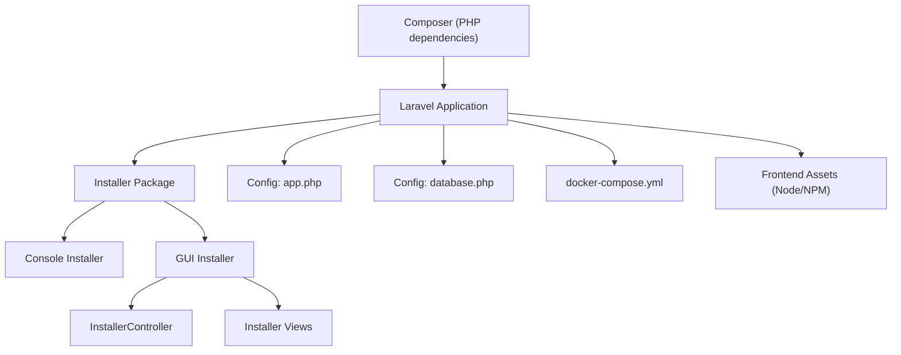
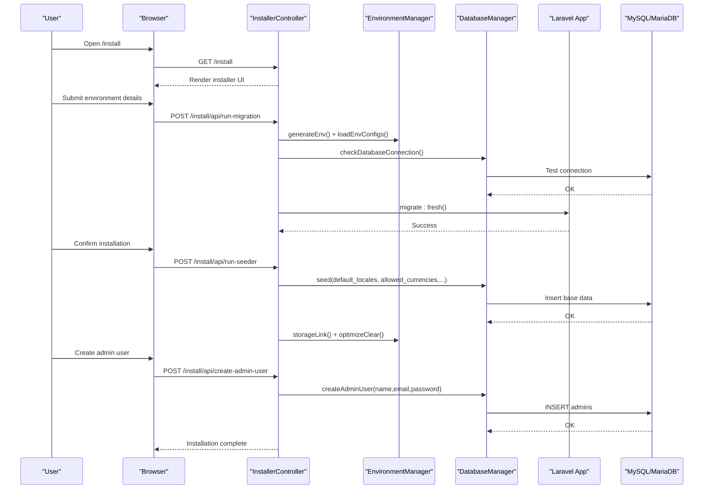
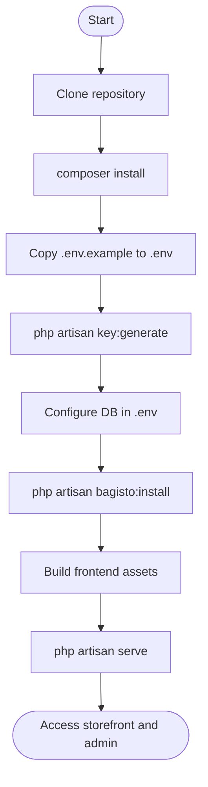
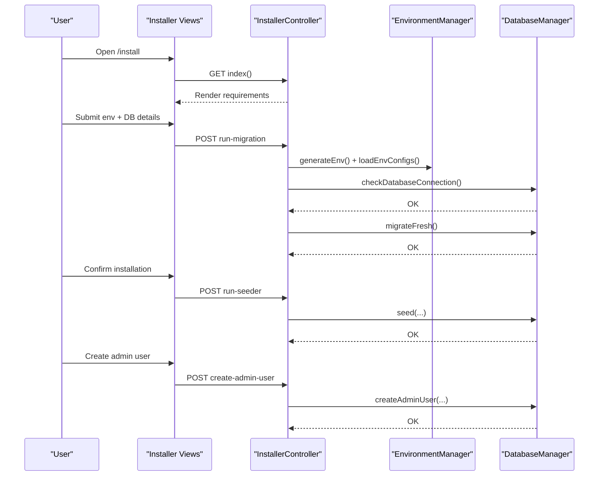
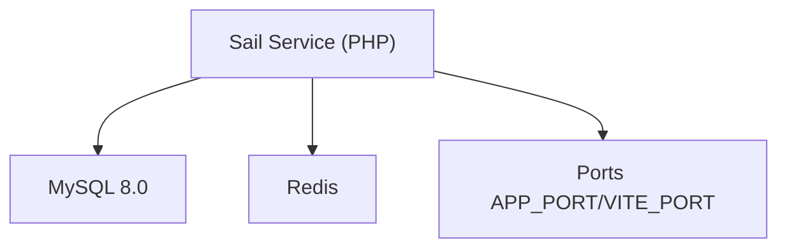
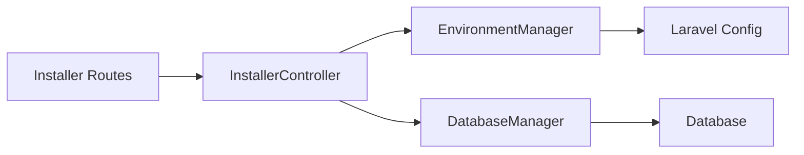

# Getting Started

<cite>
**Referenced Files in This Document**
- [composer.json](file://composer.json)
- [README.md](file://README.md)
- [config/app.php](file://config/app.php)
- [config/database.php](file://config/database.php)
- [docker-compose.yml](file://docker-compose.yml)
- [packages/Webkul/Installer/src/Console/Commands/Installer.php](file://packages/Webkul/Installer/src/Console/Commands/Installer.php)
- [packages/Webkul/Installer/src/Helpers/EnvironmentManager.php](file://packages/Webkul/Installer/src/Helpers/EnvironmentManager.php)
- [packages/Webkul/Installer/src/Helpers/DatabaseManager.php](file://packages/Webkul/Installer/src/Helpers/DatabaseManager.php)
- [packages/Webkul/Installer/src/Http/Controllers/InstallerController.php](file://packages/Webkul/Installer/src/Http/Controllers/InstallerController.php)
- [packages/Webkul/Installer/src/Routes/web.php](file://packages/Webkul/Installer/src/Routes/web.php)
- [packages/Webkul/Installer/src/Resources/views/installer/index.blade.php](file://packages/Webkul/Installer/src/Resources/views/installer/index.blade.php)
</cite>

## Table of Contents
1. [Introduction](#introduction)
2. [Project Structure](#project-structure)
3. [Core Components](#core-components)
4. [Architecture Overview](#architecture-overview)
5. [Detailed Component Analysis](#detailed-component-analysis)
6. [Dependency Analysis](#dependency-analysis)
7. [Performance Considerations](#performance-considerations)
8. [Troubleshooting Guide](#troubleshooting-guide)
9. [Conclusion](#conclusion)
10. [Appendices](#appendices)

## Introduction
This guide helps you install and start using the Frooxi 2.4 e-commerce platform. It covers system requirements, installation methods (Composer CLI, GUI installer, and Docker), environment configuration, database setup, and first-time administration. You will learn how to differentiate development and production environments, resolve common issues, and verify a successful installation. Practical examples show how to access the storefront and admin panel, initial user account details, and basic administrative tasks.

## Project Structure
Frooxi is a Laravel-based e-commerce application organized around modular packages under the packages/Webkul directory. The installer module provides both a web-based GUI and a CLI installer to automate environment setup, database migrations, seeding, and admin user creation. Frontend assets are compiled via Node.js and NPM.

**Diagram sources**
- [composer.json:1-135](file://composer.json#L1-L135)
- [config/app.php:1-188](file://config/app.php#L1-L188)
- [config/database.php:1-183](file://config/database.php#L1-L183)
- [docker-compose.yml:1-74](file://docker-compose.yml#L1-L74)
- [packages/Webkul/Installer/src/Console/Commands/Installer.php:1-635](file://packages/Webkul/Installer/src/Console/Commands/Installer.php#L1-L635)
- [packages/Webkul/Installer/src/Http/Controllers/InstallerController.php:1-166](file://packages/Webkul/Installer/src/Http/Controllers/InstallerController.php#L1-L166)
- [packages/Webkul/Installer/src/Resources/views/installer/index.blade.php:1-800](file://packages/Webkul/Installer/src/Resources/views/installer/index.blade.php#L1-L800)

**Section sources**
- [composer.json:1-135](file://composer.json#L1-L135)
- [README.md:66-101](file://README.md#L66-L101)
- [config/app.php:16-146](file://config/app.php#L16-L146)
- [config/database.php:19-114](file://config/database.php#L19-L114)
- [docker-compose.yml:1-74](file://docker-compose.yml#L1-L74)

## Core Components
- System requirements
  - PHP 8.3+ with required extensions
  - MySQL 8.0+ or MariaDB 10.3+
  - Web server (Apache/Nginx)
  - Composer (latest stable)
  - Node.js and NPM for frontend asset compilation
- Installation methods
  - Composer CLI installer
  - GUI installer (web-based)
  - Docker (Sail-based)
- Initial setup and configuration
  - Environment configuration (.env)
  - Database connection and migrations
  - Seeding basic data and optional sample products
  - Admin user creation
  - Storage linking and optimization

**Section sources**
- [README.md:58-65](file://README.md#L58-L65)
- [composer.json:10-45](file://composer.json#L10-L45)
- [config/database.php:45-83](file://config/database.php#L45-L83)
- [packages/Webkul/Installer/src/Console/Commands/Installer.php:27-38](file://packages/Webkul/Installer/src/Console/Commands/Installer.php#L27-L38)

## Architecture Overview
The installation pipeline integrates CLI and GUI paths that converge on shared helpers for environment and database management. The GUI installer exposes endpoints to validate requirements, write .env, connect to the database, run migrations, seed data, and create the admin user.

**Diagram sources**
- [packages/Webkul/Installer/src/Routes/web.php:14-28](file://packages/Webkul/Installer/src/Routes/web.php#L14-L28)
- [packages/Webkul/Installer/src/Http/Controllers/InstallerController.php:48-164](file://packages/Webkul/Installer/src/Http/Controllers/InstallerController.php#L48-L164)
- [packages/Webkul/Installer/src/Helpers/EnvironmentManager.php:14-174](file://packages/Webkul/Installer/src/Helpers/EnvironmentManager.php#L14-L174)
- [packages/Webkul/Installer/src/Helpers/DatabaseManager.php:74-167](file://packages/Webkul/Installer/src/Helpers/DatabaseManager.php#L74-L167)

## Detailed Component Analysis

### System Requirements
- PHP: 8.3+ with calendar, curl, intl, mbstring, openssl, pdo, pdo_mysql, tokenizer
- Database: MySQL 8.0+ or MariaDB 10.3+
- Web server: Apache or Nginx
- Composer: latest stable
- Node.js and NPM: for frontend asset compilation

Verification steps:
- Confirm PHP version meets minimum requirement
- Ensure required PHP extensions are enabled
- Verify MySQL/MariaDB connectivity and version
- Confirm Node.js and NPM availability

**Section sources**
- [README.md:58-65](file://README.md#L58-L65)
- [composer.json:10-20](file://composer.json#L10-L20)
- [config/database.php:45-83](file://config/database.php#L45-L83)

### Installation Methods

#### Composer CLI Installer
- Clone repository and navigate to project directory
- Install PHP dependencies
- Copy .env.example to .env
- Generate application key
- Configure database in .env
- Run the CLI installer
- Build frontend assets
- Start development server

**Diagram sources**
- [README.md:68-99](file://README.md#L68-L99)
- [packages/Webkul/Installer/src/Console/Commands/Installer.php:183-237](file://packages/Webkul/Installer/src/Console/Commands/Installer.php#L183-L237)

**Section sources**
- [README.md:68-99](file://README.md#L68-L99)
- [packages/Webkul/Installer/src/Console/Commands/Installer.php:183-237](file://packages/Webkul/Installer/src/Console/Commands/Installer.php#L183-L237)

#### GUI Installer
- Access the web installer at /install
- Choose language
- Review server requirements
- Enter environment and database configuration
- Confirm installation and run migrations
- Seed basic data
- Optionally seed sample products
- Create admin user
- Complete installation

**Diagram sources**
- [packages/Webkul/Installer/src/Resources/views/installer/index.blade.php:140-292](file://packages/Webkul/Installer/src/Resources/views/installer/index.blade.php#L140-L292)
- [packages/Webkul/Installer/src/Http/Controllers/InstallerController.php:30-164](file://packages/Webkul/Installer/src/Http/Controllers/InstallerController.php#L30-L164)
- [packages/Webkul/Installer/src/Routes/web.php:14-28](file://packages/Webkul/Installer/src/Routes/web.php#L14-L28)

**Section sources**
- [packages/Webkul/Installer/src/Resources/views/installer/index.blade.php:140-292](file://packages/Webkul/Installer/src/Resources/views/installer/index.blade.php#L140-L292)
- [packages/Webkul/Installer/src/Http/Controllers/InstallerController.php:30-164](file://packages/Webkul/Installer/src/Http/Controllers/InstallerController.php#L30-L164)
- [packages/Webkul/Installer/src/Routes/web.php:14-28](file://packages/Webkul/Installer/src/Routes/web.php#L14-L28)

#### Docker Installation
- Use Sail-managed containers for PHP, MySQL 8.0, and Redis
- Ports are configurable via environment variables
- The service depends on MySQL and Redis

**Diagram sources**
- [docker-compose.yml:1-74](file://docker-compose.yml#L1-L74)

**Section sources**
- [docker-compose.yml:1-74](file://docker-compose.yml#L1-L74)

### Environment Configuration
Key environment variables and their roles:
- APP_NAME: Application name
- APP_ENV: Environment (development/production)
- APP_DEBUG: Debug mode
- APP_URL: Storefront base URL
- APP_ADMIN_URL: Admin route suffix
- APP_TIMEZONE: Default timezone
- APP_LOCALE: Default locale
- APP_CURRENCY: Default currency
- DB_CONNECTION: Database driver (mysql)
- DB_HOST, DB_PORT, DB_DATABASE, DB_USERNAME, DB_PASSWORD: Database credentials
- DB_PREFIX: Optional table prefix

Configuration locations:
- Laravel app config reads from .env
- Installer writes and loads .env values
- Database connections defined centrally

**Section sources**
- [config/app.php:16-146](file://config/app.php#L16-L146)
- [config/database.php:19-114](file://config/database.php#L19-L114)
- [packages/Webkul/Installer/src/Helpers/EnvironmentManager.php:75-149](file://packages/Webkul/Installer/src/Helpers/EnvironmentManager.php#L75-L149)

### Database Setup
- CLI installer runs db:wipe followed by migrate:fresh
- GUI installer checks database connection, migrates, seeds, and optionally creates admin user
- Supported connections include mysql and mariadb
- Redis is configured for caching and sessions

**Section sources**
- [packages/Webkul/Installer/src/Console/Commands/Installer.php:206-213](file://packages/Webkul/Installer/src/Console/Commands/Installer.php#L206-L213)
- [packages/Webkul/Installer/src/Http/Controllers/InstallerController.php:54-64](file://packages/Webkul/Installer/src/Http/Controllers/InstallerController.php#L54-L64)
- [config/database.php:45-114](file://config/database.php#L45-L114)

### First-Time Administration
- Default admin credentials created during installation
- Admin panel URL derived from APP_URL and APP_ADMIN_URL
- Basic administrative tasks include managing channels, locales, currencies, and core configurations

**Section sources**
- [packages/Webkul/Installer/src/Console/Commands/Installer.php:423-459](file://packages/Webkul/Installer/src/Console/Commands/Installer.php#L423-L459)
- [config/app.php:79](file://config/app.php#L79)
- [README.md:101](file://README.md#L101)

## Dependency Analysis
The installer relies on shared helpers to manage environment and database operations. The GUI installer routes map to controller actions that orchestrate these helpers.

**Diagram sources**
- [packages/Webkul/Installer/src/Routes/web.php:14-28](file://packages/Webkul/Installer/src/Routes/web.php#L14-L28)
- [packages/Webkul/Installer/src/Http/Controllers/InstallerController.php:19-23](file://packages/Webkul/Installer/src/Http/Controllers/InstallerController.php#L19-L23)
- [packages/Webkul/Installer/src/Helpers/EnvironmentManager.php:14-174](file://packages/Webkul/Installer/src/Helpers/EnvironmentManager.php#L14-L174)
- [packages/Webkul/Installer/src/Helpers/DatabaseManager.php:13-169](file://packages/Webkul/Installer/src/Helpers/DatabaseManager.php#L13-L169)

**Section sources**
- [packages/Webkul/Installer/src/Routes/web.php:14-28](file://packages/Webkul/Installer/src/Routes/web.php#L14-L28)
- [packages/Webkul/Installer/src/Http/Controllers/InstallerController.php:19-23](file://packages/Webkul/Installer/src/Http/Controllers/InstallerController.php#L19-L23)
- [packages/Webkul/Installer/src/Helpers/EnvironmentManager.php:14-174](file://packages/Webkul/Installer/src/Helpers/EnvironmentManager.php#L14-L174)
- [packages/Webkul/Installer/src/Helpers/DatabaseManager.php:13-169](file://packages/Webkul/Installer/src/Helpers/DatabaseManager.php#L13-L169)

## Performance Considerations
- Use production environment settings for optimized performance
- Enable opcache and proper PHP-FPM tuning in production
- Precompile assets and cache configuration
- Use Redis for sessions and caching in production
- Keep Composer autoload optimized and prefer stable packages

[No sources needed since this section provides general guidance]

## Troubleshooting Guide
Common issues and resolutions:
- PHP version mismatch
  - Ensure PHP 8.3+ is installed and required extensions are enabled
- Database connection failures
  - Verify DB_HOST, DB_PORT, DB_DATABASE, DB_USERNAME, DB_PASSWORD
  - Confirm MySQL/MariaDB is running and accessible
- Missing .env or incorrect values
  - Regenerate key and re-run installer
  - Re-enter environment details in GUI or CLI installer
- GUI installer errors
  - Check browser console and network tab for failed requests
  - Ensure CSRF bypass is applied for installer endpoints
- Asset compilation issues
  - Install Node.js and NPM, then rebuild assets
- Docker connectivity
  - Confirm ports APP_PORT and VITE_PORT are free
  - Ensure MySQL and Redis health checks pass

**Section sources**
- [packages/Webkul/Installer/src/Helpers/EnvironmentManager.php:75-108](file://packages/Webkul/Installer/src/Helpers/EnvironmentManager.php#L75-L108)
- [packages/Webkul/Installer/src/Helpers/DatabaseManager.php:74-85](file://packages/Webkul/Installer/src/Helpers/DatabaseManager.php#L74-L85)
- [packages/Webkul/Installer/src/Http/Controllers/InstallerController.php:54-64](file://packages/Webkul/Installer/src/Http/Controllers/InstallerController.php#L54-L64)
- [docker-compose.yml:24-65](file://docker-compose.yml#L24-L65)

## Conclusion
You now have the essential steps to install Frooxi 2.4 using Composer CLI, the GUI installer, or Docker. By configuring environment variables, connecting to MySQL/MariaDB, running migrations, seeding data, and creating an admin user, you can launch your storefront and begin administration. Use production-grade settings for performance and reliability, and consult the troubleshooting section for common issues.

[No sources needed since this section summarizes without analyzing specific files]

## Appendices

### Development vs Production Environments
- Development
  - APP_ENV=development
  - APP_DEBUG=true
  - APP_ADMIN_URL=admin
  - Useful for local testing and debugging
- Production
  - APP_ENV=production
  - APP_DEBUG=false
  - APP_ADMIN_URL=some-secret-path
  - Enable opcache, optimize Composer autoload, and secure .env

**Section sources**
- [config/app.php:29](file://config/app.php#L29)
- [config/app.php:42](file://config/app.php#L42)
- [config/app.php:79](file://config/app.php#L79)

### Verification Checklist
- PHP 8.3+ and required extensions present
- MySQL 8.0+ reachable with provided credentials
- .env generated and configured
- Application key created
- Migrations executed successfully
- Basic data seeded
- Admin user created
- Frontend assets built
- Storefront and admin panel accessible

**Section sources**
- [README.md:101](file://README.md#L101)
- [packages/Webkul/Installer/src/Console/Commands/Installer.php:206-230](file://packages/Webkul/Installer/src/Console/Commands/Installer.php#L206-L230)
- [packages/Webkul/Installer/src/Helpers/DatabaseManager.php:106-117](file://packages/Webkul/Installer/src/Helpers/DatabaseManager.php#L106-L117)