# Inventory Analytics & Reporting

<cite>
**Referenced Files in This Document**
- [Reporting.php](file://packages/Webkul/Admin/src/Helpers/Reporting.php)
- [AbstractReporting.php](file://packages/Webkul/Admin/src/Helpers/Reporting/AbstractReporting.php)
- [Product.php](file://packages/Webkul/Admin/src/Helpers/Reporting/Product.php)
- [Sale.php](file://packages/Webkul/Admin/src/Helpers/Reporting/Sale.php)
- [Cart.php](file://packages/Webkul/Admin/src/Helpers/Reporting/Cart.php)
- [Customer.php](file://packages/Webkul/Admin/src/Helpers/Reporting/Customer.php)
- [Dashboard.php](file://packages/Webkul/Admin/src/Helpers/Dashboard.php)
- [ReportingExport.php](file://packages/Webkul/Admin/src/Exports/ReportingExport.php)
- [reporting-routes.php](file://packages/Webkul/Admin/src/Routes/reporting-routes.php)
</cite>

## Table of Contents
1. [Introduction](#introduction)
2. [Project Structure](#project-structure)
3. [Core Components](#core-components)
4. [Architecture Overview](#architecture-overview)
5. [Detailed Component Analysis](#detailed-component-analysis)
6. [Dependency Analysis](#dependency-analysis)
7. [Performance Considerations](#performance-considerations)
8. [Troubleshooting Guide](#troubleshooting-guide)
9. [Conclusion](#conclusion)
10. [Appendices](#appendices)

## Introduction
This document explains how Frooxi’s inventory analytics and reporting capabilities are implemented within the Admin module. It focuses on inventory performance metrics, stock turnover calculations, inventory aging, valuation, cost of goods sold tracking, profit margin analysis, dashboards for inventory health, slow-moving stock identification, shrinkage analysis, supplier performance metrics, integration with financial reporting, and optimization recommendations grounded in historical trends.

## Project Structure
The reporting subsystem is organized around a central Reporting helper that composes domain-specific reporting helpers (sales, product, cart, customer). These helpers encapsulate database queries and time-interval logic, and are wired via routes to controllers that expose endpoints for stats, views, exports, and dashboards.

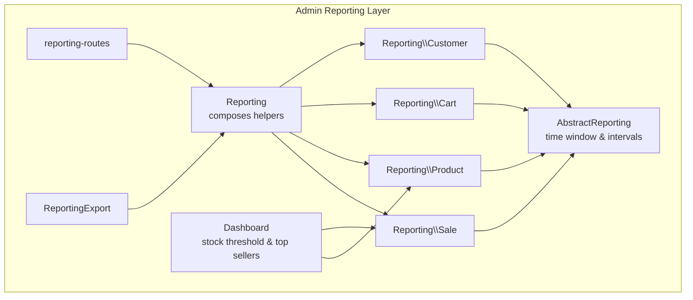

**Diagram sources**
- [Reporting.php:12-24](file://packages/Webkul/Admin/src/Helpers/Reporting.php#L12-L24)
- [AbstractReporting.php:9-48](file://packages/Webkul/Admin/src/Helpers/Reporting/AbstractReporting.php#L9-L48)
- [Product.php:17-34](file://packages/Webkul/Admin/src/Helpers/Reporting/Product.php#L17-L34)
- [Sale.php:13-27](file://packages/Webkul/Admin/src/Helpers/Reporting/Sale.php#L13-L27)
- [Cart.php:11-23](file://packages/Webkul/Admin/src/Helpers/Reporting/Cart.php#L11-L23)
- [Customer.php:12-25](file://packages/Webkul/Admin/src/Helpers/Reporting/Customer.php#L12-L25)
- [Dashboard.php:80-97](file://packages/Webkul/Admin/src/Helpers/Dashboard.php#L80-L97)
- [ReportingExport.php:8-38](file://packages/Webkul/Admin/src/Exports/ReportingExport.php#L8-L38)
- [reporting-routes.php:11-55](file://packages/Webkul/Admin/src/Routes/reporting-routes.php#L11-L55)

**Section sources**
- [Reporting.php:12-24](file://packages/Webkul/Admin/src/Helpers/Reporting.php#L12-L24)
- [AbstractReporting.php:9-48](file://packages/Webkul/Admin/src/Helpers/Reporting/AbstractReporting.php#L9-L48)
- [reporting-routes.php:11-55](file://packages/Webkul/Admin/src/Routes/reporting-routes.php#L11-L55)

## Core Components
- Central Reporting helper orchestrates domain-specific reporting helpers and exposes unified stats APIs for sales, products, carts, and customers.
- AbstractReporting provides shared time-window computation, interval generation (days/weeks/months/auto), and percentage-change calculation.
- Product reporting computes sold quantities, top-revenue and top-quantity products, and low-stock threshold items.
- Sale reporting aggregates orders, sales totals, average sales, refunds, taxes, shipping, and top payment/shipping methods.
- Cart reporting computes abandoned carts, abandonment rates, and top abandoned products.
- Customer reporting aggregates new customers, top customers by sales/orders/reviews, and customer groups.
- Dashboard integrates stock threshold alerts and top-selling products.
- ReportingExport supports exporting tabular reporting results to CSV via Excel exporter.

**Section sources**
- [Reporting.php:12-941](file://packages/Webkul/Admin/src/Helpers/Reporting.php#L12-L941)
- [AbstractReporting.php:9-368](file://packages/Webkul/Admin/src/Helpers/Reporting/AbstractReporting.php#L9-L368)
- [Product.php:17-409](file://packages/Webkul/Admin/src/Helpers/Reporting/Product.php#L17-L409)
- [Sale.php:13-639](file://packages/Webkul/Admin/src/Helpers/Reporting/Sale.php#L13-L639)
- [Cart.php:11-212](file://packages/Webkul/Admin/src/Helpers/Reporting/Cart.php#L11-L212)
- [Customer.php:12-256](file://packages/Webkul/Admin/src/Helpers/Reporting/Customer.php#L12-L256)
- [Dashboard.php:80-117](file://packages/Webkul/Admin/src/Helpers/Dashboard.php#L80-L117)
- [ReportingExport.php:8-38](file://packages/Webkul/Admin/src/Exports/ReportingExport.php#L8-L38)

## Architecture Overview
The reporting pipeline follows a layered design:
- Routes define endpoints under /reporting/customers, /reporting/products, /reporting/sales.
- Controllers delegate to Reporting helper methods to fetch stats and optionally export data.
- AbstractReporting computes time windows and intervals; domain helpers query repositories and join related tables.
- Exporter transforms structured records into CSV rows.

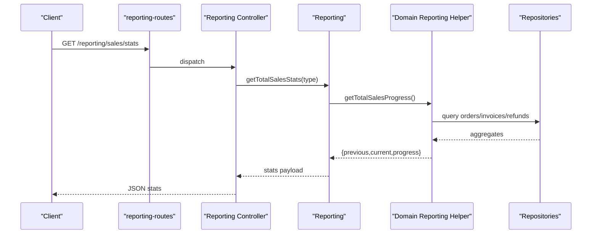

**Diagram sources**
- [reporting-routes.php:45-55](file://packages/Webkul/Admin/src/Routes/reporting-routes.php#L45-L55)
- [Reporting.php:31-68](file://packages/Webkul/Admin/src/Helpers/Reporting.php#L31-L68)
- [Sale.php:128-136](file://packages/Webkul/Admin/src/Helpers/Reporting/Sale.php#L128-L136)

## Detailed Component Analysis

### Inventory Performance Metrics and Stock Turnover
- Sold quantities over time: Product reporting aggregates SUM(qty_invoiced - qty_refunded) per interval and provides previous/current periods for comparison.
- Turnover ratio: Can be computed as Cost of Goods Sold divided by Average Inventory. While direct COGS is not exposed here, the underlying order items and inventories can support COGS computation when combined with cost data from inventory sources and purchase records.
- Average inventory: Average of period-beginning and period-ending inventory values. Ending inventory can be derived from product inventories grouped by product_id and channel.

Implementation references:
- Sold quantities aggregation and intervals: [Product.php:78-86](file://packages/Webkul/Admin/src/Helpers/Reporting/Product.php#L78-L86), [Product.php:337-369](file://packages/Webkul/Admin/src/Helpers/Reporting/Product.php#L337-L369)
- Time intervals and grouping: [AbstractReporting.php:185-250](file://packages/Webkul/Admin/src/Helpers/Reporting/AbstractReporting.php#L185-L250)

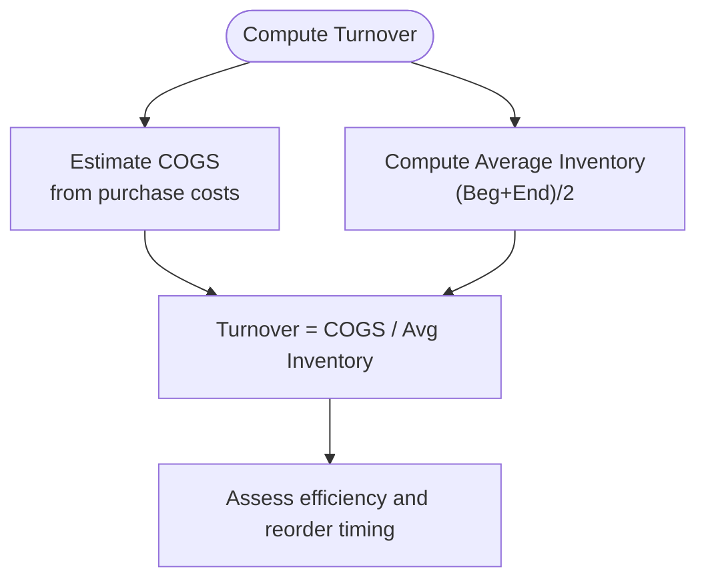

**Diagram sources**
- [Product.php:78-86](file://packages/Webkul/Admin/src/Helpers/Reporting/Product.php#L78-L86)
- [AbstractReporting.php:185-250](file://packages/Webkul/Admin/src/Helpers/Reporting/AbstractReporting.php#L185-L250)

**Section sources**
- [Product.php:78-86](file://packages/Webkul/Admin/src/Helpers/Reporting/Product.php#L78-L86)
- [Product.php:337-369](file://packages/Webkul/Admin/src/Helpers/Reporting/Product.php#L337-L369)
- [AbstractReporting.php:185-250](file://packages/Webkul/Admin/src/Helpers/Reporting/AbstractReporting.php#L185-L250)

### Inventory Aging Reports
- Abandoned carts: Cart reporting identifies inactive carts older than a threshold and aggregates top abandoned products by count.
- Slow-moving stock: Product reporting exposes low-stock threshold items via aggregated inventories per product and channel.
- Age buckets: Use time intervals to bucket items by creation date or last activity date to build aging distributions.

Implementation references:
- Abandoned cart computations: [Cart.php:115-156](file://packages/Webkul/Admin/src/Helpers/Reporting/Cart.php#L115-L156), [Cart.php:163-177](file://packages/Webkul/Admin/src/Helpers/Reporting/Cart.php#L163-L177)
- Low-stock threshold items: [Product.php:173-185](file://packages/Webkul/Admin/src/Helpers/Reporting/Product.php#L173-L185)

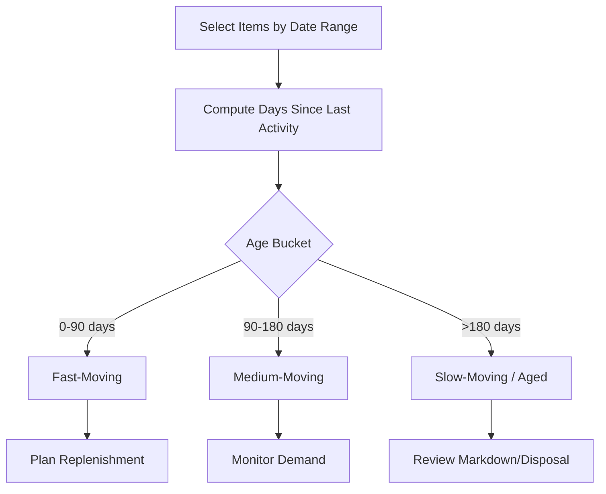

**Diagram sources**
- [Cart.php:115-156](file://packages/Webkul/Admin/src/Helpers/Reporting/Cart.php#L115-L156)
- [Product.php:173-185](file://packages/Webkul/Admin/src/Helpers/Reporting/Product.php#L173-L185)

**Section sources**
- [Cart.php:115-156](file://packages/Webkul/Admin/src/Helpers/Reporting/Cart.php#L115-L156)
- [Cart.php:163-177](file://packages/Webkul/Admin/src/Helpers/Reporting/Cart.php#L163-L177)
- [Product.php:173-185](file://packages/Webkul/Admin/src/Helpers/Reporting/Product.php#L173-L185)

### Inventory Valuation Methods and Cost of Goods Sold
- Valuation methods supported by the codebase:
  - First-In, First-Out (FIFO): Supported conceptually via ordered timestamps and itemized order items.
  - Weighted Average: Not directly implemented here; can be approximated by averaging unit costs over a period if purchase cost data is available.
  - Specific Identification: Not present in the reported code.
- COGS tracking:
  - Current code aggregates invoiced and refunded totals at order and item level but does not expose raw unit costs or purchase prices.
  - To compute COGS accurately, combine order items with inventory cost data from purchase records and inventory sources.

Implementation references:
- Sales and refunds aggregation: [Sale.php:170-192](file://packages/Webkul/Admin/src/Helpers/Reporting/Sale.php#L170-L192), [Sale.php:323-330](file://packages/Webkul/Admin/src/Helpers/Reporting/Sale.php#L323-L330)
- Sold quantities aggregation: [Product.php:78-86](file://packages/Webkul/Admin/src/Helpers/Reporting/Product.php#L78-L86)

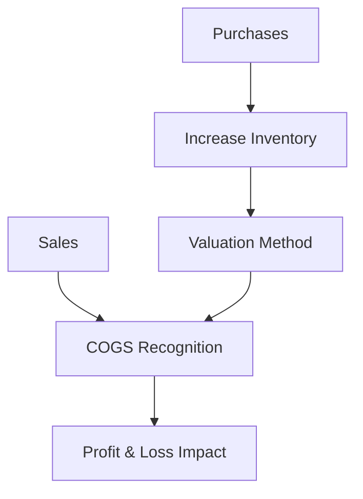

**Diagram sources**
- [Sale.php:170-192](file://packages/Webkul/Admin/src/Helpers/Reporting/Sale.php#L170-L192)
- [Product.php:78-86](file://packages/Webkul/Admin/src/Helpers/Reporting/Product.php#L78-L86)

**Section sources**
- [Sale.php:170-192](file://packages/Webkul/Admin/src/Helpers/Reporting/Sale.php#L170-L192)
- [Product.php:78-86](file://packages/Webkul/Admin/src/Helpers/Reporting/Product.php#L78-L86)

### Profit Margin Analysis
- Revenue and refunds: Aggregated at order and item level to derive net sales.
- Costs: Not directly exposed; require linking to purchase costs and inventory cost data to compute gross profit and margins.
- Top-performing SKUs by revenue: Provided by product reporting for revenue ranking.

Implementation references:
- Net sales and refunds: [Sale.php:170-192](file://packages/Webkul/Admin/src/Helpers/Reporting/Sale.php#L170-L192), [Sale.php:323-330](file://packages/Webkul/Admin/src/Helpers/Reporting/Sale.php#L323-L330)
- Top revenue products: [Product.php:192-221](file://packages/Webkul/Admin/src/Helpers/Reporting/Product.php#L192-L221)

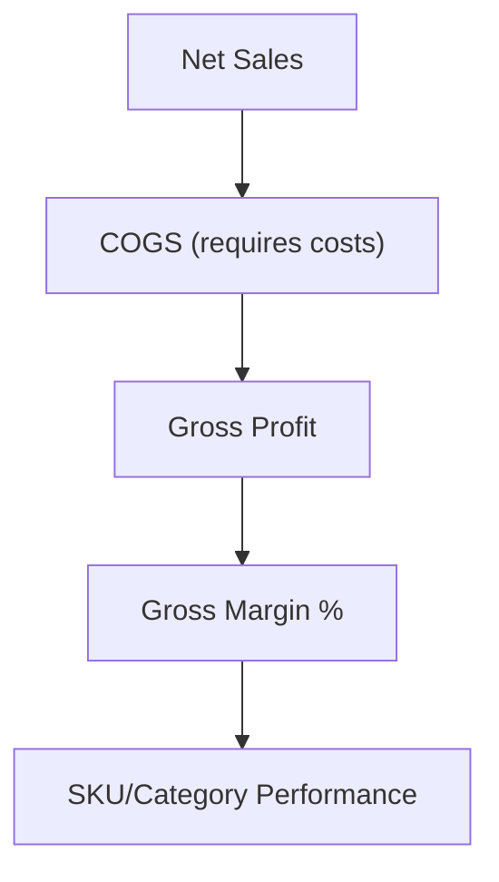

**Diagram sources**
- [Sale.php:170-192](file://packages/Webkul/Admin/src/Helpers/Reporting/Sale.php#L170-L192)
- [Product.php:192-221](file://packages/Webkul/Admin/src/Helpers/Reporting/Product.php#L192-L221)

**Section sources**
- [Sale.php:170-192](file://packages/Webkul/Admin/src/Helpers/Reporting/Sale.php#L170-L192)
- [Product.php:192-221](file://packages/Webkul/Admin/src/Helpers/Reporting/Product.php#L192-L221)

### Reporting Dashboards for Inventory Health
- Stock threshold alert items: Dashboard helper retrieves bottom-ranked inventories by total quantity across channels.
- Top-selling products: Dashboard helper surfaces top products by revenue to monitor demand and stock movement.

Implementation references:
- Stock threshold items: [Dashboard.php:80-97](file://packages/Webkul/Admin/src/Helpers/Dashboard.php#L80-L97)
- Top-selling products: [Dashboard.php:114-117](file://packages/Webkul/Admin/src/Helpers/Dashboard.php#L114-L117)

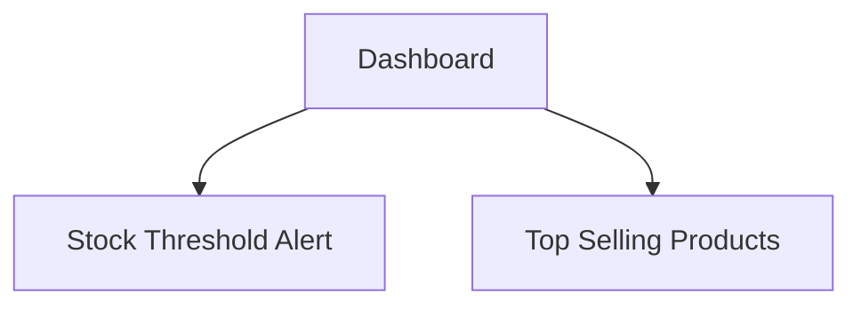

**Diagram sources**
- [Dashboard.php:80-97](file://packages/Webkul/Admin/src/Helpers/Dashboard.php#L80-L97)
- [Dashboard.php:114-117](file://packages/Webkul/Admin/src/Helpers/Dashboard.php#L114-L117)

**Section sources**
- [Dashboard.php:80-97](file://packages/Webkul/Admin/src/Helpers/Dashboard.php#L80-L97)
- [Dashboard.php:114-117](file://packages/Webkul/Admin/src/Helpers/Dashboard.php#L114-L117)

### Slow-Moving Stock Identification
- Abandoned cart products: Cart reporting ranks products by count of abandoned items.
- Low-stock threshold items: Product reporting aggregates inventory quantities per product and sorts ascending to surface potential slow-moving stock.

Implementation references:
- Abandoned product ranking: [Cart.php:163-177](file://packages/Webkul/Admin/src/Helpers/Reporting/Cart.php#L163-L177)
- Low-stock threshold items: [Product.php:173-185](file://packages/Webkul/Admin/src/Helpers/Reporting/Product.php#L173-L185)

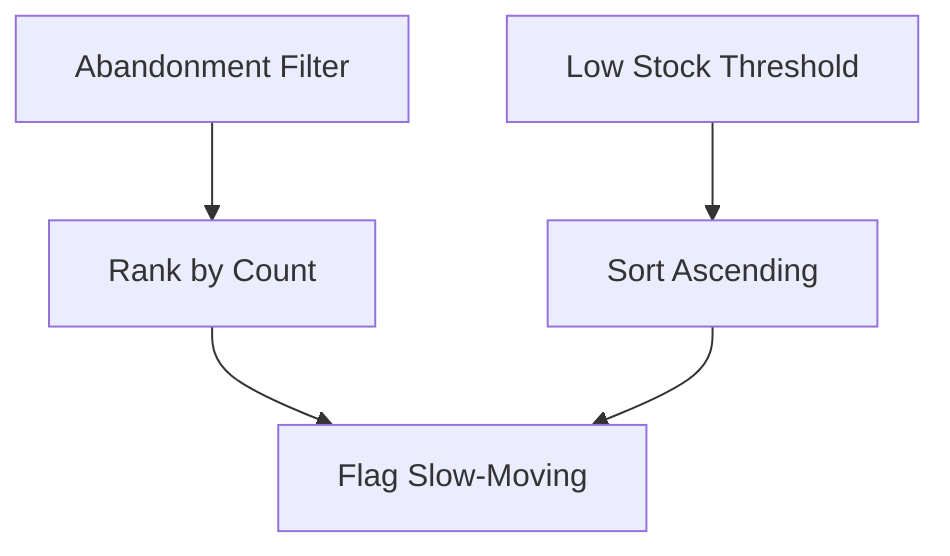

**Diagram sources**
- [Cart.php:163-177](file://packages/Webkul/Admin/src/Helpers/Reporting/Cart.php#L163-L177)
- [Product.php:173-185](file://packages/Webkul/Admin/src/Helpers/Reporting/Product.php#L173-L185)

**Section sources**
- [Cart.php:163-177](file://packages/Webkul/Admin/src/Helpers/Reporting/Cart.php#L163-L177)
- [Product.php:173-185](file://packages/Webkul/Admin/src/Helpers/Reporting/Product.php#L173-L185)

### Inventory Shrinkage Analysis
- Refunds and returned value: Sale reporting aggregates base_grand_total_refunded to quantify shrinkage impact.
- Abandoned sales value: Cart reporting sums base_grand_total for abandoned carts to estimate shrinkage in monetary terms.

Implementation references:
- Refunds aggregation: [Sale.php:323-330](file://packages/Webkul/Admin/src/Helpers/Reporting/Sale.php#L323-L330)
- Abandoned sales value: [Cart.php:148-156](file://packages/Webkul/Admin/src/Helpers/Reporting/Cart.php#L148-L156)

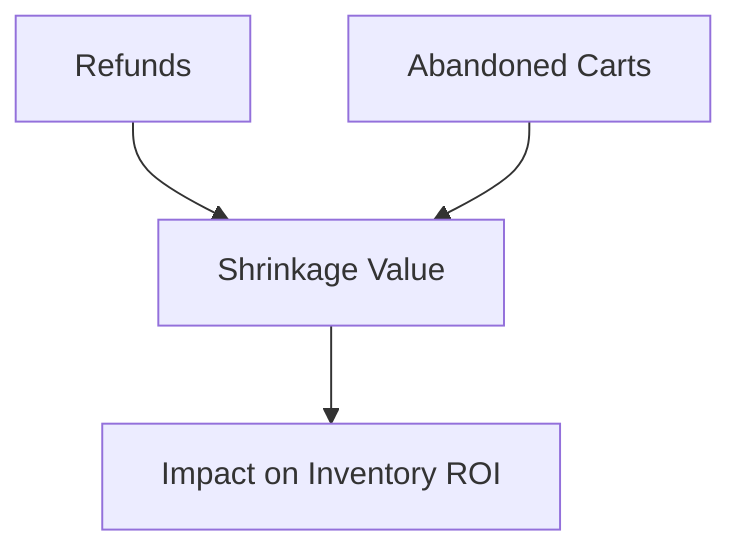

**Diagram sources**
- [Sale.php:323-330](file://packages/Webkul/Admin/src/Helpers/Reporting/Sale.php#L323-L330)
- [Cart.php:148-156](file://packages/Webkul/Admin/src/Helpers/Reporting/Cart.php#L148-L156)

**Section sources**
- [Sale.php:323-330](file://packages/Webkul/Admin/src/Helpers/Reporting/Sale.php#L323-L330)
- [Cart.php:148-156](file://packages/Webkul/Admin/src/Helpers/Reporting/Cart.php#L148-L156)

### Supplier Performance Metrics
- Top payment methods and shipping methods: Sale reporting surfaces top methods by volume and revenue, useful proxies for supplier/service performance.
- Note: Direct supplier-level KPIs are not implemented in the reported code; these can be extended by joining with purchase records and supplier metadata.

Implementation references:
- Top payment methods: [Sale.php:558-572](file://packages/Webkul/Admin/src/Helpers/Reporting/Sale.php#L558-L572)
- Top shipping methods: [Sale.php:538-551](file://packages/Webkul/Admin/src/Helpers/Reporting/Sale.php#L538-L551)

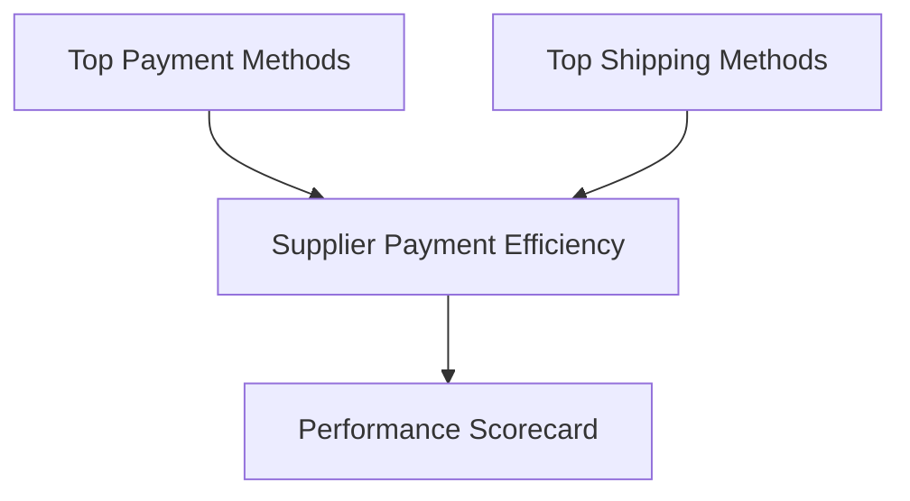

**Diagram sources**
- [Sale.php:558-572](file://packages/Webkul/Admin/src/Helpers/Reporting/Sale.php#L558-L572)
- [Sale.php:538-551](file://packages/Webkul/Admin/src/Helpers/Reporting/Sale.php#L538-L551)

**Section sources**
- [Sale.php:558-572](file://packages/Webkul/Admin/src/Helpers/Reporting/Sale.php#L558-L572)
- [Sale.php:538-551](file://packages/Webkul/Admin/src/Helpers/Reporting/Sale.php#L538-L551)

### Integration with Financial Reporting Systems
- Export capability: ReportingExport converts structured records (columns + rows) into CSV for downstream financial systems.
- Endpoint exposure: Routes under /reporting enable programmatic access to stats and exports.

Implementation references:
- Export transformer: [ReportingExport.php:23-38](file://packages/Webkul/Admin/src/Exports/ReportingExport.php#L23-L38)
- Reporting routes: [reporting-routes.php:11-55](file://packages/Webkul/Admin/src/Routes/reporting-routes.php#L11-L55)

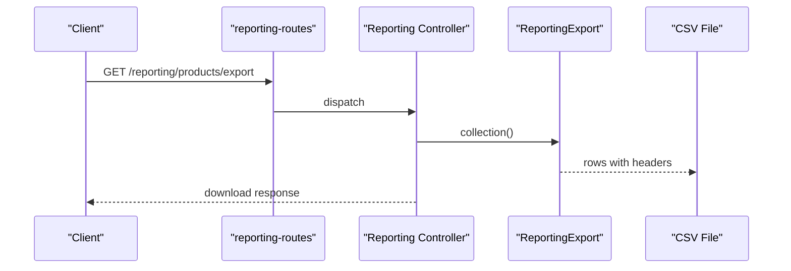

**Diagram sources**
- [reporting-routes.php:30-40](file://packages/Webkul/Admin/src/Routes/reporting-routes.php#L30-L40)
- [ReportingExport.php:23-38](file://packages/Webkul/Admin/src/Exports/ReportingExport.php#L23-L38)

**Section sources**
- [ReportingExport.php:23-38](file://packages/Webkul/Admin/src/Exports/ReportingExport.php#L23-L38)
- [reporting-routes.php:30-40](file://packages/Webkul/Admin/src/Routes/reporting-routes.php#L30-L40)

### Inventory Optimization Recommendations Based on Historical Trends
- Use sold quantities over time to identify seasonal peaks and troughs; align reorder points and safety stock accordingly.
- Monitor top-selling SKUs by revenue and quantity to optimize SKU mix and reduce obsolete inventory.
- Track abandonment rates and top abandoned products to refine pricing, promotions, and demand forecasting.
- Apply low-stock thresholds to trigger replenishment and prevent stockouts.

Implementation references:
- Sold quantities over time: [Product.php:337-369](file://packages/Webkul/Admin/src/Helpers/Reporting/Product.php#L337-L369)
- Top revenue/quantity products: [Product.php:192-256](file://packages/Webkul/Admin/src/Helpers/Reporting/Product.php#L192-L256)
- Abandonment rate and top products: [Cart.php:131-177](file://packages/Webkul/Admin/src/Helpers/Reporting/Cart.php#L131-L177)

**Section sources**
- [Product.php:337-369](file://packages/Webkul/Admin/src/Helpers/Reporting/Product.php#L337-L369)
- [Product.php:192-256](file://packages/Webkul/Admin/src/Helpers/Reporting/Product.php#L192-L256)
- [Cart.php:131-177](file://packages/Webkul/Admin/src/Helpers/Reporting/Cart.php#L131-L177)

## Dependency Analysis
- Reporting helper depends on domain-specific helpers (Sale, Product, Cart, Customer).
- Domain helpers depend on repositories and join orders, invoices, refunds, carts, wishlists, and product inventories.
- AbstractReporting centralizes time window and interval logic used across domains.

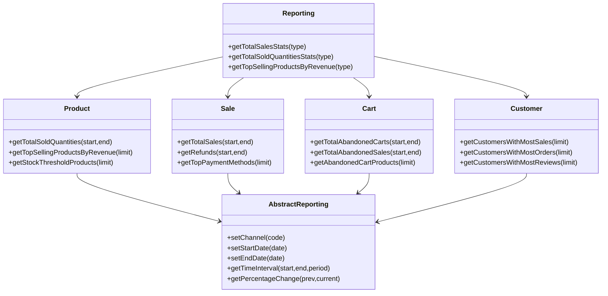

**Diagram sources**
- [Reporting.php:12-941](file://packages/Webkul/Admin/src/Helpers/Reporting.php#L12-L941)
- [AbstractReporting.php:9-368](file://packages/Webkul/Admin/src/Helpers/Reporting/AbstractReporting.php#L9-L368)
- [Product.php:17-409](file://packages/Webkul/Admin/src/Helpers/Reporting/Product.php#L17-L409)
- [Sale.php:13-639](file://packages/Webkul/Admin/src/Helpers/Reporting/Sale.php#L13-L639)
- [Cart.php:11-212](file://packages/Webkul/Admin/src/Helpers/Reporting/Cart.php#L11-L212)
- [Customer.php:12-256](file://packages/Webkul/Admin/src/Helpers/Reporting/Customer.php#L12-L256)

**Section sources**
- [Reporting.php:12-941](file://packages/Webkul/Admin/src/Helpers/Reporting.php#L12-L941)
- [AbstractReporting.php:9-368](file://packages/Webkul/Admin/src/Helpers/Reporting/AbstractReporting.php#L9-L368)
- [Product.php:17-409](file://packages/Webkul/Admin/src/Helpers/Reporting/Product.php#L17-L409)
- [Sale.php:13-639](file://packages/Webkul/Admin/src/Helpers/Reporting/Sale.php#L13-L639)
- [Cart.php:11-212](file://packages/Webkul/Admin/src/Helpers/Reporting/Cart.php#L11-L212)
- [Customer.php:12-256](file://packages/Webkul/Admin/src/Helpers/Reporting/Customer.php#L12-L256)

## Performance Considerations
- Time-interval computation: AbstractReporting dynamically selects grouping granularity (days/weeks/months/auto) to balance resolution and query cost.
- Aggregation efficiency: Domain helpers use SQL aggregations (SUM/COUNT/GROUP BY) and joins to minimize PHP-side processing.
- Pagination and limits: Many report endpoints accept limit parameters to cap result sets (e.g., top N products).
- Export throughput: ReportingExport builds CSV rows from precomputed records to avoid heavy server-side rendering.

[No sources needed since this section provides general guidance]

## Troubleshooting Guide
- Incorrect time windows: Verify channel selection and start/end date parsing in AbstractReporting.
- Empty or unexpected results: Confirm channel filters and date ranges; check that repositories’ resetModel() is invoked before queries.
- Abnormal abandonment rates: Investigate thresholds for “abandoned” carts and compare against total carts during the same period.
- Missing cost data for COGS: Ensure purchase records and inventory cost fields are populated; otherwise, COGS cannot be computed from the reporting layer alone.

**Section sources**
- [AbstractReporting.php:53-96](file://packages/Webkul/Admin/src/Helpers/Reporting/AbstractReporting.php#L53-L96)
- [Cart.php:115-140](file://packages/Webkul/Admin/src/Helpers/Reporting/Cart.php#L115-L140)
- [Product.php:173-185](file://packages/Webkul/Admin/src/Helpers/Reporting/Product.php#L173-L185)

## Conclusion
Frooxi’s Admin reporting layer provides robust foundations for inventory analytics: sold quantities over time, top-performing SKUs, abandoned cart insights, and dashboard stock alerts. While valuation and COGS are not directly exposed in the reported code, the underlying order items and inventories can support these computations when integrated with cost data. The export and routing infrastructure enables seamless integration with financial systems. Extending the system with supplier-level KPIs and direct COGS/cost fields would further strengthen inventory optimization and profitability analysis.

[No sources needed since this section summarizes without analyzing specific files]

## Appendices

### Practical Examples (by reference)
- Inventory turnover report:
  - Use sold quantities over time and average inventory to compute turnover.
  - Reference: [Product.php:337-369](file://packages/Webkul/Admin/src/Helpers/Reporting/Product.php#L337-L369)
- Stock age analysis:
  - Use abandoned cart products and low-stock threshold items.
  - References: [Cart.php:163-177](file://packages/Webkul/Admin/src/Helpers/Reporting/Cart.php#L163-L177), [Product.php:173-185](file://packages/Webkul/Admin/src/Helpers/Reporting/Product.php#L173-L185)
- Supplier performance metrics:
  - Use top payment methods and top shipping methods.
  - Reference: [Sale.php:538-572](file://packages/Webkul/Admin/src/Helpers/Reporting/Sale.php#L538-L572)

[No sources needed since this section provides general guidance]