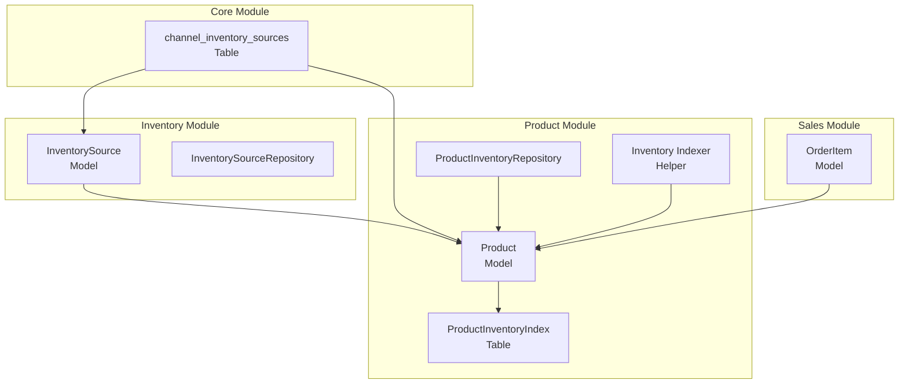
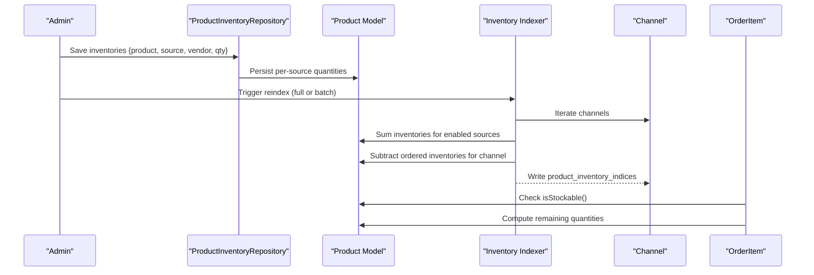
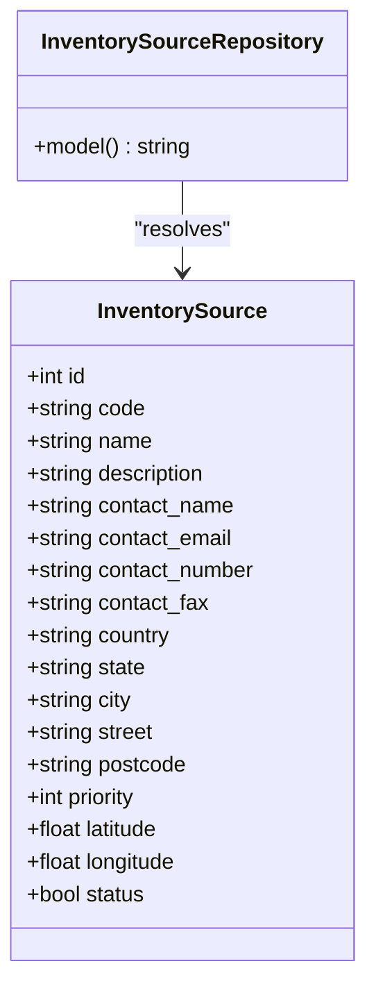
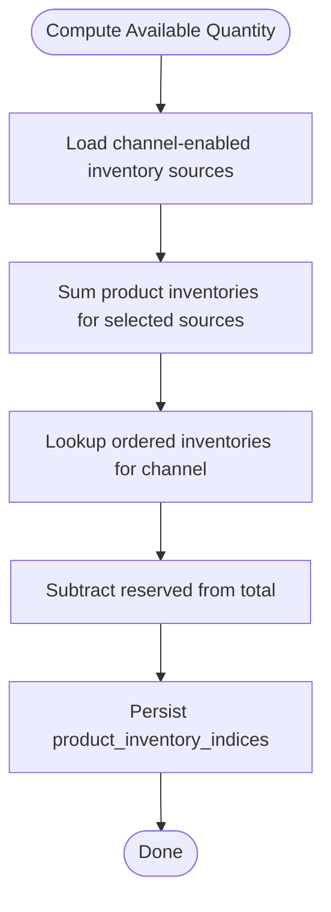
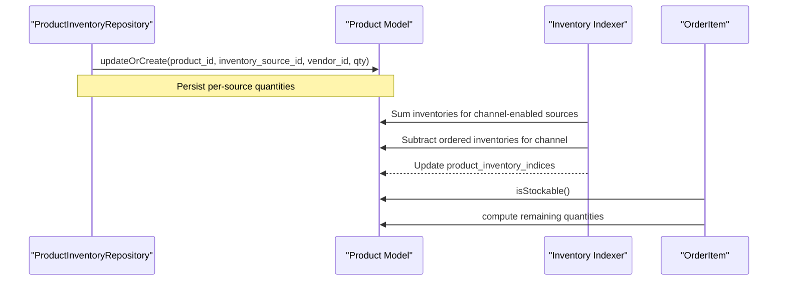
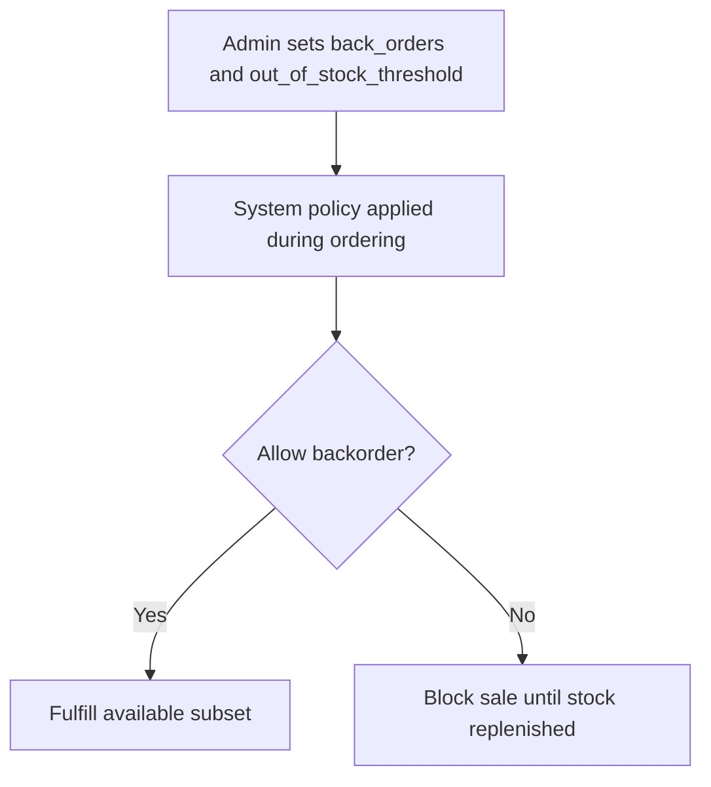
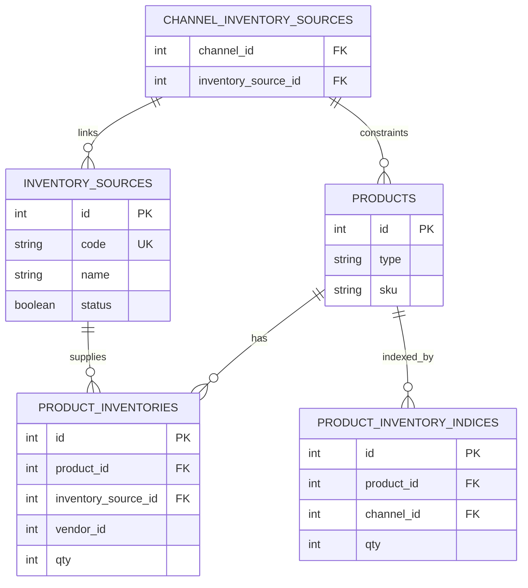

# Inventory Control

<cite>
**Referenced Files in This Document**
- [InventorySource.php](file://packages/Webkul/Inventory/src/Models/InventorySource.php)
- [InventorySource.php (contract)](file://packages/Webkul/Inventory/src/Contracts/InventorySource.php)
- [InventorySourceRepository.php](file://packages/Webkul/Inventory/src/Repositories/InventorySourceRepository.php)
- [2018_07_23_110040_create_inventory_sources_table.php](file://packages/Webkul/Inventory/src/Database/Migrations/2018_07_23_110040_create_inventory_sources_table.php)
- [2018_12_24_123812_create_channel_inventory_sources_table.php](file://packages/Webkul/Core/src/Database/Migrations/2018_12_24_123812_create_channel_inventory_sources_table.php)
- [2022_10_08_134150_create_product_inventory_indices_table.php](file://packages/Webkul/Product/src/Database/Migrations/2022_10_08_134150_create_product_inventory_indices_table.php)
- [2018_07_27_113956_create_product_inventories_table.php](file://packages/Webkul/Product/src/Database/Migrations/2018_07_27_113956_create_product_inventories_table.php)
- [Inventory.php](file://packages/Webkul/Product/src/Helpers/Indexers/Inventory.php)
- [Product.php](file://packages/Webkul/Product/src/Models/Product.php)
- [ProductInventoryRepository.php](file://packages/Webkul/Product/src/Repositories/ProductInventoryRepository.php)
- [OrderItem.php](file://packages/Webkul/Sales/src/Models/OrderItem.php)
- [InventorySourceTableSeeder.php](file://packages/Webkul/Installer/src/Database/Seeders/Inventory/InventorySourceTableSeeder.php)
- [system.php](file://packages/Webkul/Admin/src/Config/system.php)
- [inventory.spec.ts](file://packages/Webkul/Admin/tests/e2e-pw/tests/configuration/catalog/inventory.spec.ts)
</cite>

## Table of Contents
1. [Introduction](#introduction)
2. [Project Structure](#project-structure)
3. [Core Components](#core-components)
4. [Architecture Overview](#architecture-overview)
5. [Detailed Component Analysis](#detailed-component-analysis)
6. [Dependency Analysis](#dependency-analysis)
7. [Performance Considerations](#performance-considerations)
8. [Troubleshooting Guide](#troubleshooting-guide)
9. [Conclusion](#conclusion)
10. [Appendices](#appendices)

## Introduction
This document describes Frooxi’s inventory control system within the Bagisto codebase. It focuses on stock tracking, inventory sources, warehouse management, and inventory allocation across channels. It also explains inventory updates via indexing, reservation systems reflected in order processing, backorder handling, multi-location inventory, supplier/vendor linkage, and integration with the product catalog and order processing. Reporting is supported through precomputed product inventory indices.

## Project Structure
The inventory system spans several modules:
- Inventory module defines inventory sources and repositories.
- Product module maintains product inventories per source and computes channel-specific indices.
- Core module links channels to inventory sources.
- Sales module consumes inventory via order items and enforces stockability checks.
- Admin configuration exposes stock options such as backorders and out-of-stock thresholds.

**Diagram sources**
- [InventorySource.php:11-24](file://packages/Webkul/Inventory/src/Models/InventorySource.php#L11-L24)
- [InventorySourceRepository.php:7-16](file://packages/Webkul/Inventory/src/Repositories/InventorySourceRepository.php#L7-L16)
- [Product.php:175-199](file://packages/Webkul/Product/src/Models/Product.php#L175-L199)
- [2018_12_24_123812_create_channel_inventory_sources_table.php:16-23](file://packages/Webkul/Core/src/Database/Migrations/2018_12_24_123812_create_channel_inventory_sources_table.php#L16-L23)
- [2022_10_08_134150_create_product_inventory_indices_table.php:16-26](file://packages/Webkul/Product/src/Database/Migrations/2022_10_08_134150_create_product_inventory_indices_table.php#L16-L26)
- [ProductInventoryRepository.php:21-36](file://packages/Webkul/Product/src/Repositories/ProductInventoryRepository.php#L21-L36)
- [Inventory.php:11-215](file://packages/Webkul/Product/src/Helpers/Indexers/Inventory.php#L11-L215)
- [OrderItem.php:67-98](file://packages/Webkul/Sales/src/Models/OrderItem.php#L67-L98)

**Section sources**
- [InventorySource.php:11-24](file://packages/Webkul/Inventory/src/Models/InventorySource.php#L11-L24)
- [InventorySourceRepository.php:7-16](file://packages/Webkul/Inventory/src/Repositories/InventorySourceRepository.php#L7-L16)
- [Product.php:175-199](file://packages/Webkul/Product/src/Models/Product.php#L175-L199)
- [2018_12_24_123812_create_channel_inventory_sources_table.php:16-23](file://packages/Webkul/Core/src/Database/Migrations/2018_12_24_123812_create_channel_inventory_sources_table.php#L16-L23)
- [2022_10_08_134150_create_product_inventory_indices_table.php:16-26](file://packages/Webkul/Product/src/Database/Migrations/2022_10_08_134150_create_product_inventory_indices_table.php#L16-L26)
- [2018_07_27_113956_create_product_inventories_table.php:16-26](file://packages/Webkul/Product/src/Database/Migrations/2018_07_27_113956_create_product_inventories_table.php#L16-L26)
- [Inventory.php:11-215](file://packages/Webkul/Product/src/Helpers/Indexers/Inventory.php#L11-L215)
- [OrderItem.php:67-98](file://packages/Webkul/Sales/src/Models/OrderItem.php#L67-L98)

## Core Components
- InventorySource: Represents a physical or logical source of inventory (warehouses, suppliers). It is an Eloquent model backed by the inventory_sources table and supports factory creation.
- InventorySourceRepository: Provides CRUD operations for inventory sources using the contract interface.
- ProductInventoryRepository: Persists per-source quantities for a product, keyed by product, inventory source, and vendor.
- Inventory Indexer: Computes channel-specific available quantities by aggregating product inventories and subtracting reserved quantities per channel.
- Product Inventory Indices: Stores computed per-product-per-channel quantities for fast reporting and storefront display.
- Channel-to-Inventory Source Linkage: Associates channels with inventory sources to constrain which sources contribute to a channel’s stock.
- OrderItem: Enforces stockability checks and calculates remaining quantities eligible for shipping, invoicing, cancellation, and refund.

**Section sources**
- [InventorySource.php:11-24](file://packages/Webkul/Inventory/src/Models/InventorySource.php#L11-L24)
- [InventorySource.php (contract):5-5](file://packages/Webkul/Inventory/src/Contracts/InventorySource.php#L5-L5)
- [InventorySourceRepository.php:7-16](file://packages/Webkul/Inventory/src/Repositories/InventorySourceRepository.php#L7-L16)
- [ProductInventoryRepository.php:21-36](file://packages/Webkul/Product/src/Repositories/ProductInventoryRepository.php#L21-L36)
- [Inventory.php:166-200](file://packages/Webkul/Product/src/Helpers/Indexers/Inventory.php#L166-L200)
- [2022_10_08_134150_create_product_inventory_indices_table.php:16-26](file://packages/Webkul/Product/src/Database/Migrations/2022_10_08_134150_create_product_inventory_indices_table.php#L16-L26)
- [2018_12_24_123812_create_channel_inventory_sources_table.php:16-23](file://packages/Webkul/Core/src/Database/Migrations/2018_12_24_123812_create_channel_inventory_sources_table.php#L16-L23)
- [OrderItem.php:67-98](file://packages/Webkul/Sales/src/Models/OrderItem.php#L67-L98)

## Architecture Overview
The system separates concerns across modules:
- Inventory sources are managed independently and linked to channels.
- Products maintain inventories per source and vendor.
- An indexer aggregates inventories for each channel and subtracts reserved quantities to produce a channel-specific available quantity.
- Order processing relies on stockability checks and remaining quantities to allow actions like shipping and invoicing.

**Diagram sources**
- [ProductInventoryRepository.php:21-36](file://packages/Webkul/Product/src/Repositories/ProductInventoryRepository.php#L21-L36)
- [Inventory.php:83-149](file://packages/Webkul/Product/src/Helpers/Indexers/Inventory.php#L83-L149)
- [Product.php:175-199](file://packages/Webkul/Product/src/Models/Product.php#L175-L199)
- [OrderItem.php:67-98](file://packages/Webkul/Sales/src/Models/OrderItem.php#L67-L98)

## Detailed Component Analysis

### Inventory Sources and Warehouse Management
- InventorySource defines the warehouse/supplier entity with address, contact info, priority, geolocation, and status.
- InventorySourceRepository provides model resolution via the contract.
- Channel-to-Inventory Source linkage constrains which sources contribute to a channel’s stock.

**Diagram sources**
- [InventorySource.php:11-24](file://packages/Webkul/Inventory/src/Models/InventorySource.php#L11-L24)
- [InventorySourceRepository.php:7-16](file://packages/Webkul/Inventory/src/Repositories/InventorySourceRepository.php#L7-L16)

**Section sources**
- [InventorySource.php:11-24](file://packages/Webkul/Inventory/src/Models/InventorySource.php#L11-L24)
- [2018_07_23_110040_create_inventory_sources_table.php:16-35](file://packages/Webkul/Inventory/src/Database/Migrations/2018_07_23_110040_create_inventory_sources_table.php#L16-L35)
- [2018_12_24_123812_create_channel_inventory_sources_table.php:16-23](file://packages/Webkul/Core/src/Database/Migrations/2018_12_24_123812_create_channel_inventory_sources_table.php#L16-L23)

### Multi-Location Inventory and Allocation
- Product maintains inventories per source and vendor via the product_inventories table.
- Product inventory indices aggregate per-channel quantities and are used for reporting and storefront display.
- The indexer sums inventories from enabled sources for a channel and subtracts reserved quantities tracked per channel.

**Diagram sources**
- [Inventory.php:180-200](file://packages/Webkul/Product/src/Helpers/Indexers/Inventory.php#L180-L200)
- [2022_10_08_134150_create_product_inventory_indices_table.php:16-26](file://packages/Webkul/Product/src/Database/Migrations/2022_10_08_134150_create_product_inventory_indices_table.php#L16-L26)

**Section sources**
- [Product.php:175-199](file://packages/Webkul/Product/src/Models/Product.php#L175-L199)
- [2018_07_27_113956_create_product_inventories_table.php:16-26](file://packages/Webkul/Product/src/Database/Migrations/2018_07_27_113956_create_product_inventories_table.php#L16-L26)
- [Inventory.php:166-200](file://packages/Webkul/Product/src/Helpers/Indexers/Inventory.php#L166-L200)

### Inventory Updates and Reservation System
- Inventory updates are persisted via ProductInventoryRepository, which creates or updates per-source quantities keyed by product, source, and vendor.
- Reservation is implicit in the indexer: reserved quantity per channel is subtracted from total available, ensuring downstream order actions operate on net available stock.
- OrderItem enforces stockability and computes remaining quantities eligible for shipping, invoicing, cancellation, and refund.

**Diagram sources**
- [ProductInventoryRepository.php:21-36](file://packages/Webkul/Product/src/Repositories/ProductInventoryRepository.php#L21-L36)
- [Inventory.php:180-200](file://packages/Webkul/Product/src/Helpers/Indexers/Inventory.php#L180-L200)
- [OrderItem.php:67-98](file://packages/Webkul/Sales/src/Models/OrderItem.php#L67-L98)

**Section sources**
- [ProductInventoryRepository.php:21-36](file://packages/Webkul/Product/src/Repositories/ProductInventoryRepository.php#L21-L36)
- [Inventory.php:180-200](file://packages/Webkul/Product/src/Helpers/Indexers/Inventory.php#L180-L200)
- [OrderItem.php:67-98](file://packages/Webkul/Sales/src/Models/OrderItem.php#L67-L98)

### Backorder Handling
- Backorder behavior is configurable via Admin configuration under catalog inventory stock options.
- Tests demonstrate enabling back orders and setting out-of-stock thresholds, indicating the system supports configurable reservation and fulfillment policies.

**Diagram sources**
- [system.php:977-989](file://packages/Webkul/Admin/src/Config/system.php#L977-L989)
- [inventory.spec.ts:13-22](file://packages/Webkul/Admin/tests/e2e-pw/tests/configuration/catalog/inventory.spec.ts#L13-L22)

**Section sources**
- [system.php:977-989](file://packages/Webkul/Admin/src/Config/system.php#L977-L989)
- [inventory.spec.ts:13-22](file://packages/Webkul/Admin/tests/e2e-pw/tests/configuration/catalog/inventory.spec.ts#L13-L22)

### Supplier Management and Vendor Linkage
- Product inventories include a vendor_id field, allowing per-vendor quantity tracking for a given product and source.
- This enables supplier segmentation and procurement workflows.

**Section sources**
- [2018_07_27_113956_create_product_inventories_table.php:16-26](file://packages/Webkul/Product/src/Database/Migrations/2018_07_27_113956_create_product_inventories_table.php#L16-L26)

### Inventory Forecasting
- No explicit forecasting engine is present in the codebase. The system focuses on real-time aggregation of current inventories minus reservations for channel-specific indices.

[No sources needed since this section provides general guidance]

### Inventory Adjustment Procedures
- Adjustments are performed by updating per-source quantities through ProductInventoryRepository. There is no dedicated adjustment log table in the examined migrations.

**Section sources**
- [ProductInventoryRepository.php:21-36](file://packages/Webkul/Product/src/Repositories/ProductInventoryRepository.php#L21-L36)

### Stock Transfers
- No dedicated transfer entities or workflows were identified in the examined files. Transfers would typically require moving quantities between sources and vendors, which is not present in the current schema.

[No sources needed since this section provides general guidance]

### Inventory Valuation
- No valuation logic or cost tracking tables were found in the examined files. Valuation would typically require cost per unit per source/vendor, which is not present in the current schema.

[No sources needed since this section provides general guidance]

### Integration with Product Catalog and Order Processing
- Product model exposes relations to inventories, inventory indices, and ordered inventories, enabling accurate stock computations.
- OrderItem leverages product type stockability and computes remaining quantities for shipping, invoicing, cancellation, and refund.

**Section sources**
- [Product.php:175-207](file://packages/Webkul/Product/src/Models/Product.php#L175-L207)
- [OrderItem.php:67-98](file://packages/Webkul/Sales/src/Models/OrderItem.php#L67-L98)

### Reporting Systems
- product_inventory_indices stores per-product-per-channel quantities for efficient reporting and storefront queries.

**Section sources**
- [2022_10_08_134150_create_product_inventory_indices_table.php:16-26](file://packages/Webkul/Product/src/Database/Migrations/2022_10_08_134150_create_product_inventory_indices_table.php#L16-L26)

## Dependency Analysis
- InventorySource is referenced by Product through a many-to-many relationship with pivot quantities.
- ProductInventoryIndex depends on Product and Channel foreign keys.
- ChannelInventorySources binds channels to inventory sources.
- OrderItem depends on Product type stockability and remaining quantities.

**Diagram sources**
- [2018_07_23_110040_create_inventory_sources_table.php:16-35](file://packages/Webkul/Inventory/src/Database/Migrations/2018_07_23_110040_create_inventory_sources_table.php#L16-L35)
- [2018_12_24_123812_create_channel_inventory_sources_table.php:16-23](file://packages/Webkul/Core/src/Database/Migrations/2018_12_24_123812_create_channel_inventory_sources_table.php#L16-L23)
- [2018_07_27_113956_create_product_inventories_table.php:16-26](file://packages/Webkul/Product/src/Database/Migrations/2018_07_27_113956_create_product_inventories_table.php#L16-L26)
- [2022_10_08_134150_create_product_inventory_indices_table.php:16-26](file://packages/Webkul/Product/src/Database/Migrations/2022_10_08_134150_create_product_inventory_indices_table.php#L16-L26)

**Section sources**
- [Product.php:175-199](file://packages/Webkul/Product/src/Models/Product.php#L175-L199)
- [2018_12_24_123812_create_channel_inventory_sources_table.php:16-23](file://packages/Webkul/Core/src/Database/Migrations/2018_12_24_123812_create_channel_inventory_sources_table.php#L16-L23)
- [2022_10_08_134150_create_product_inventory_indices_table.php:16-26](file://packages/Webkul/Product/src/Database/Migrations/2022_10_08_134150_create_product_inventory_indices_table.php#L16-L26)

## Performance Considerations
- Batch reindexing: The indexer paginates products to avoid memory pressure during full reindexing.
- Unique constraints: product_inventories uses a composite unique key to prevent duplicates.
- Indexed reporting: product_inventory_indices provides O(1) reads for channel-specific quantities.

**Section sources**
- [Inventory.php:83-105](file://packages/Webkul/Product/src/Helpers/Indexers/Inventory.php#L83-L105)
- [2018_07_27_113956_create_product_inventories_table.php:23-23](file://packages/Webkul/Product/src/Database/Migrations/2018_07_27_113956_create_product_inventories_table.php#L23-L23)
- [2022_10_08_134150_create_product_inventory_indices_table.php:23-23](file://packages/Webkul/Product/src/Database/Migrations/2022_10_08_134150_create_product_inventory_indices_table.php#L23-L23)

## Troubleshooting Guide
- Missing default inventory source: The installer seeds a default inventory source; verify it exists if stock computations appear incorrect.
- Channel-source linkage: Ensure the channel is linked to inventory sources so their quantities contribute to the channel’s available stock.
- Backorder configuration: Confirm Admin configuration for back orders and out-of-stock thresholds aligns with desired behavior.

**Section sources**
- [InventorySourceTableSeeder.php:22-35](file://packages/Webkul/Installer/src/Database/Seeders/Inventory/InventorySourceTableSeeder.php#L22-L35)
- [2018_12_24_123812_create_channel_inventory_sources_table.php:16-23](file://packages/Webkul/Core/src/Database/Migrations/2018_12_24_123812_create_channel_inventory_sources_table.php#L16-L23)
- [system.php:977-989](file://packages/Webkul/Admin/src/Config/system.php#L977-L989)

## Conclusion
Frooxi’s inventory control centers on:
- Inventory sources and channel linkage for multi-location stock.
- Per-source, per-vendor product inventories with channel-specific indexing.
- Reservation via subtraction of ordered inventories from total stock.
- Admin-configurable backorder behavior.
- Integration with product catalog and order processing for stock-aware operations.
Missing components include explicit inventory adjustments, transfers, supplier valuation, and forecasting—these can be introduced by extending the existing schema and repositories.

## Appendices
- Default inventory source seeding for initial setup.
- Admin configuration keys for stock options.

**Section sources**
- [InventorySourceTableSeeder.php:22-35](file://packages/Webkul/Installer/src/Database/Seeders/Inventory/InventorySourceTableSeeder.php#L22-L35)
- [system.php:977-989](file://packages/Webkul/Admin/src/Config/system.php#L977-L989)