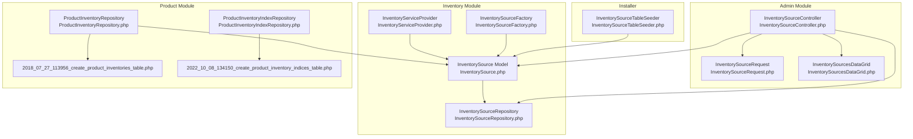
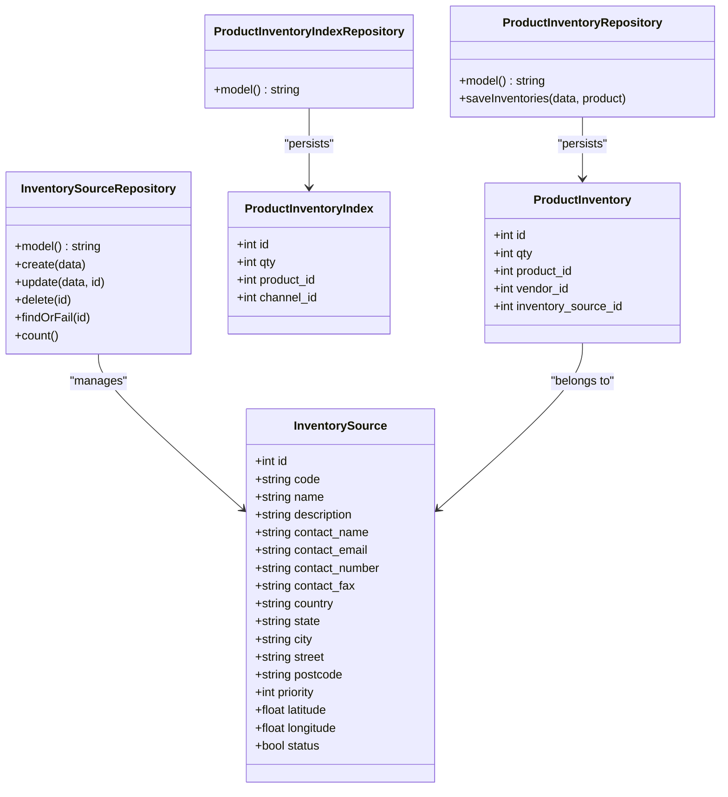
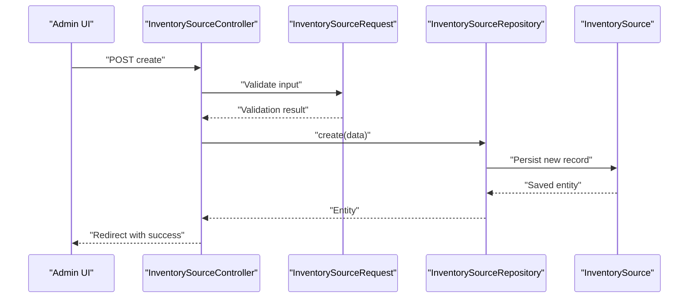
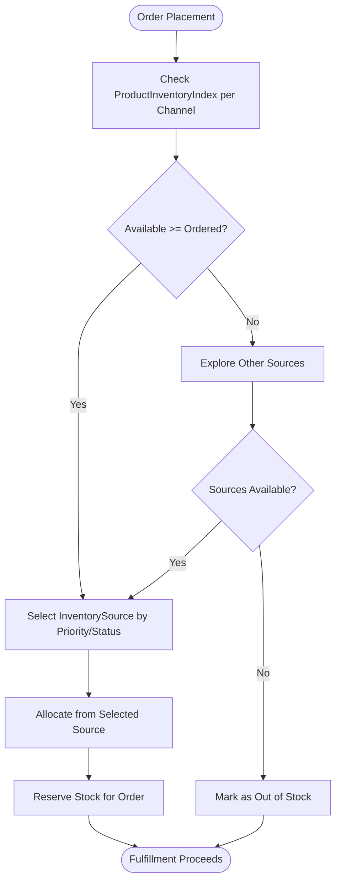
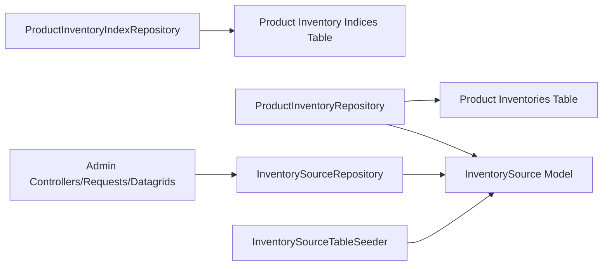

# Inventory Sources & Warehouses

<cite>
**Referenced Files in This Document**
- [2018_07_23_110040_create_inventory_sources_table.php](file://packages/Webkul/Inventory/src/Database/Migrations/2018_07_23_110040_create_inventory_sources_table.php)
- [InventorySource.php](file://packages/Webkul/Inventory/src/Models/InventorySource.php)
- [InventorySourceProxy.php](file://packages/Webkul/Inventory/src/Models/InventorySourceProxy.php)
- [InventorySourceRepository.php](file://packages/Webkul/Inventory/src/Repositories/InventorySourceRepository.php)
- [InventoryServiceProvider.php](file://packages/Webkul/Inventory/src/Providers/InventoryServiceProvider.php)
- [InventorySourceFactory.php](file://packages/Webkul/Inventory/src/Database/Factories/InventorySourceFactory.php)
- [InventorySourceController.php](file://packages/Webkul/Admin/src/Http/Controllers/Settings/InventorySourceController.php)
- [InventorySourceRequest.php](file://packages/Webkul/Admin/src/Http/Requests/InventorySourceRequest.php)
- [InventorySourcesDataGrid.php](file://packages/Webkul/Admin/src/DataGrids/Settings/InventorySourcesDataGrid.php)
- [InventorySourceTableSeeder.php](file://packages/Webkul/Installer/src/Database/Seeders/Inventory/InventorySourceTableSeeder.php)
- [2018_07_27_113956_create_product_inventories_table.php](file://packages/Webkul/Product/src/Database/Migrations/2018_07_27_113956_create_product_inventories_table.php)
- [2022_10_08_134150_create_product_inventory_indices_table.php](file://packages/Webkul/Product/src/Database/Migrations/2022_10_08_134150_create_product_inventory_indices_table.php)
- [ProductInventoryRepository.php](file://packages/Webkul/Product/src/Repositories/ProductInventoryRepository.php)
- [ProductInventoryIndexRepository.php](file://packages/Webkul/Product/src/Repositories/ProductInventoryIndexRepository.php)
- [ProductInventoryFactory.php](file://packages/Webkul/Product/src/Database/Factories/ProductInventoryFactory.php)
- [InventorySourceNotification.php](file://packages/Webkul/Admin/src/Mail/Order/InventorySourceNotification.php)
</cite>

## Table of Contents
1. [Introduction](#introduction)
2. [Project Structure](#project-structure)
3. [Core Components](#core-components)
4. [Architecture Overview](#architecture-overview)
5. [Detailed Component Analysis](#detailed-component-analysis)
6. [Dependency Analysis](#dependency-analysis)
7. [Performance Considerations](#performance-considerations)
8. [Troubleshooting Guide](#troubleshooting-guide)
9. [Conclusion](#conclusion)

## Introduction
This document explains the inventory sources and warehouse management capabilities in Frooxi’s inventory control system. It focuses on the InventorySource model, warehouse configuration, and multi-location inventory setup. You will learn how inventory sources are created and managed, how product inventories are tracked per source, and how allocation strategies can be applied. Practical examples demonstrate setting up multiple warehouses, configuring allocation rules, and integrating with the product catalog for location-specific stock tracking and order fulfillment routing.

## Project Structure
The inventory subsystem is organized around a dedicated module with models, repositories, migrations, factories, and administrative UI components. The product module maintains separate tables for per-source and per-channel inventory indices to support granular stock visibility and allocation.

**Diagram sources**
- [InventorySource.php:1-25](file://packages/Webkul/Inventory/src/Models/InventorySource.php#L1-L25)
- [InventorySourceRepository.php:1-17](file://packages/Webkul/Inventory/src/Repositories/InventorySourceRepository.php#L1-L17)
- [InventoryServiceProvider.php:1-17](file://packages/Webkul/Inventory/src/Providers/InventoryServiceProvider.php#L1-L17)
- [InventorySourceFactory.php:1-40](file://packages/Webkul/Inventory/src/Database/Factories/InventorySourceFactory.php#L1-L40)
- [InventorySourceController.php:1-167](file://packages/Webkul/Admin/src/Http/Controllers/Settings/InventorySourceController.php#L1-L167)
- [InventorySourceRequest.php:1-47](file://packages/Webkul/Admin/src/Http/Requests/InventorySourceRequest.php#L1-L47)
- [InventorySourcesDataGrid.php:1-127](file://packages/Webkul/Admin/src/DataGrids/Settings/InventorySourcesDataGrid.php#L1-L127)
- [2018_07_27_113956_create_product_inventories_table.php:1-38](file://packages/Webkul/Product/src/Database/Migrations/2018_07_27_113956_create_product_inventories_table.php#L1-L38)
- [2022_10_08_134150_create_product_inventory_indices_table.php:1-38](file://packages/Webkul/Product/src/Database/Migrations/2022_10_08_134150_create_product_inventory_indices_table.php#L1-L38)
- [ProductInventoryRepository.php:1-37](file://packages/Webkul/Product/src/Repositories/ProductInventoryRepository.php#L1-L37)
- [ProductInventoryIndexRepository.php:1-16](file://packages/Webkul/Product/src/Repositories/ProductInventoryIndexRepository.php#L1-L16)
- [InventorySourceTableSeeder.php:1-38](file://packages/Webkul/Installer/src/Database/Seeders/Inventory/InventorySourceTableSeeder.php#L1-L38)

**Section sources**
- [InventorySource.php:1-25](file://packages/Webkul/Inventory/src/Models/InventorySource.php#L1-L25)
- [InventorySourceRepository.php:1-17](file://packages/Webkul/Inventory/src/Repositories/InventorySourceRepository.php#L1-L17)
- [InventoryServiceProvider.php:1-17](file://packages/Webkul/Inventory/src/Providers/InventoryServiceProvider.php#L1-L17)
- [InventorySourceFactory.php:1-40](file://packages/Webkul/Inventory/src/Database/Factories/InventorySourceFactory.php#L1-L40)
- [InventorySourceController.php:1-167](file://packages/Webkul/Admin/src/Http/Controllers/Settings/InventorySourceController.php#L1-L167)
- [InventorySourceRequest.php:1-47](file://packages/Webkul/Admin/src/Http/Requests/InventorySourceRequest.php#L1-L47)
- [InventorySourcesDataGrid.php:1-127](file://packages/Webkul/Admin/src/DataGrids/Settings/InventorySourcesDataGrid.php#L1-L127)
- [2018_07_27_113956_create_product_inventories_table.php:1-38](file://packages/Webkul/Product/src/Database/Migrations/2018_07_27_113956_create_product_inventories_table.php#L1-L38)
- [2022_10_08_134150_create_product_inventory_indices_table.php:1-38](file://packages/Webkul/Product/src/Database/Migrations/2022_10_08_134150_create_product_inventory_indices_table.php#L1-L38)
- [ProductInventoryRepository.php:1-37](file://packages/Webkul/Product/src/Repositories/ProductInventoryRepository.php#L1-L37)
- [ProductInventoryIndexRepository.php:1-16](file://packages/Webkul/Product/src/Repositories/ProductInventoryIndexRepository.php#L1-L16)
- [InventorySourceTableSeeder.php:1-38](file://packages/Webkul/Installer/src/Database/Seeders/Inventory/InventorySourceTableSeeder.php#L1-L38)

## Core Components
- InventorySource model: Represents a physical or logical source of inventory (warehouse, DC, vendor location). It persists address, contact, priority, coordinates, and status.
- InventorySourceRepository: Provides CRUD operations against the InventorySource contract.
- InventorySourceController: Admin interface for listing, creating, updating, and deleting inventory sources.
- InventorySourceRequest: Validation rules for inventory source creation and updates.
- InventorySourcesDataGrid: Datagrid for listing sources with filtering and actions.
- ProductInventoryRepository: Persists per-product, per-source quantities and vendor associations.
- ProductInventoryIndexRepository: Manages aggregated per-product, per-channel inventory indices.
- Installer seeder: Seeds a default inventory source for out-of-the-box setup.

Key capabilities:
- Multi-location inventory: Each product can have separate quantity records per inventory source.
- Per-channel aggregation: A product’s channel-wide availability is derived from per-source indices.
- Administrative management: Full CRUD lifecycle for inventory sources with validation and events.

**Section sources**
- [InventorySource.php:1-25](file://packages/Webkul/Inventory/src/Models/InventorySource.php#L1-L25)
- [InventorySourceRepository.php:1-17](file://packages/Webkul/Inventory/src/Repositories/InventorySourceRepository.php#L1-L17)
- [InventorySourceController.php:1-167](file://packages/Webkul/Admin/src/Http/Controllers/Settings/InventorySourceController.php#L1-L167)
- [InventorySourceRequest.php:1-47](file://packages/Webkul/Admin/src/Http/Requests/InventorySourceRequest.php#L1-L47)
- [InventorySourcesDataGrid.php:1-127](file://packages/Webkul/Admin/src/DataGrids/Settings/InventorySourcesDataGrid.php#L1-L127)
- [ProductInventoryRepository.php:1-37](file://packages/Webkul/Product/src/Repositories/ProductInventoryRepository.php#L1-L37)
- [ProductInventoryIndexRepository.php:1-16](file://packages/Webkul/Product/src/Repositories/ProductInventoryIndexRepository.php#L1-L16)
- [InventorySourceTableSeeder.php:1-38](file://packages/Webkul/Installer/src/Database/Seeders/Inventory/InventorySourceTableSeeder.php#L1-L38)

## Architecture Overview
The system separates concerns across modules:
- Inventory module: Defines and manages inventory sources.
- Product module: Tracks per-source quantities and aggregates per-channel availability.
- Admin module: Provides UI and validation for inventory source management.
- Installer module: Seeds default data for quick start.

**Diagram sources**
- [InventorySource.php:1-25](file://packages/Webkul/Inventory/src/Models/InventorySource.php#L1-L25)
- [2018_07_27_113956_create_product_inventories_table.php:1-38](file://packages/Webkul/Product/src/Database/Migrations/2018_07_27_113956_create_product_inventories_table.php#L1-L38)
- [2022_10_08_134150_create_product_inventory_indices_table.php:1-38](file://packages/Webkul/Product/src/Database/Migrations/2022_10_08_134150_create_product_inventory_indices_table.php#L1-L38)
- [InventorySourceRepository.php:1-17](file://packages/Webkul/Inventory/src/Repositories/InventorySourceRepository.php#L1-L17)
- [ProductInventoryRepository.php:1-37](file://packages/Webkul/Product/src/Repositories/ProductInventoryRepository.php#L1-L37)
- [ProductInventoryIndexRepository.php:1-16](file://packages/Webkul/Product/src/Repositories/ProductInventoryIndexRepository.php#L1-L16)

## Detailed Component Analysis

### InventorySource Model and Management
- Purpose: Represents a warehouse or supply location with address, contact, priority, coordinates, and status.
- Persistence: Migrated via a dedicated migration with unique constraints on code and composite uniqueness for product-inventory relationships.
- Factory: Generates realistic default attributes for development and testing.
- Proxy: Concord proxy enables extension and override patterns.

**Diagram sources**
- [InventorySourceController.php:52-82](file://packages/Webkul/Admin/src/Http/Controllers/Settings/InventorySourceController.php#L52-L82)
- [InventorySourceRequest.php:28-45](file://packages/Webkul/Admin/src/Http/Requests/InventorySourceRequest.php#L28-L45)
- [InventorySourceRepository.php:12-15](file://packages/Webkul/Inventory/src/Repositories/InventorySourceRepository.php#L12-L15)
- [InventorySource.php:11-23](file://packages/Webkul/Inventory/src/Models/InventorySource.php#L11-L23)

**Section sources**
- [2018_07_23_110040_create_inventory_sources_table.php:14-36](file://packages/Webkul/Inventory/src/Database/Migrations/2018_07_23_110040_create_inventory_sources_table.php#L14-L36)
- [InventorySource.php:1-25](file://packages/Webkul/Inventory/src/Models/InventorySource.php#L1-L25)
- [InventorySourceProxy.php:1-7](file://packages/Webkul/Inventory/src/Models/InventorySourceProxy.php#L1-L7)
- [InventorySourceFactory.php:1-40](file://packages/Webkul/Inventory/src/Database/Factories/InventorySourceFactory.php#L1-L40)
- [InventorySourceRepository.php:1-17](file://packages/Webkul/Inventory/src/Repositories/InventorySourceRepository.php#L1-L17)
- [InventorySourceController.php:1-167](file://packages/Webkul/Admin/src/Http/Controllers/Settings/InventorySourceController.php#L1-L167)
- [InventorySourceRequest.php:1-47](file://packages/Webkul/Admin/src/Http/Requests/InventorySourceRequest.php#L1-L47)
- [InventorySourcesDataGrid.php:1-127](file://packages/Webkul/Admin/src/DataGrids/Settings/InventorySourcesDataGrid.php#L1-L127)

### Multi-Location Inventory Setup
- Per-source quantities: Product inventories are stored per product, per inventory source, and optional vendor, enabling precise stock tracking across locations.
- Aggregated indices: Per-product, per-channel indices enable efficient availability checks and order routing decisions.
- Allocation strategy: Priority and status fields on inventory sources can guide allocation rules (e.g., higher priority sources fulfill first, disabled sources excluded).

**Diagram sources**
- [2018_07_27_113956_create_product_inventories_table.php:14-26](file://packages/Webkul/Product/src/Database/Migrations/2018_07_27_113956_create_product_inventories_table.php#L14-L26)
- [2022_10_08_134150_create_product_inventory_indices_table.php:14-26](file://packages/Webkul/Product/src/Database/Migrations/2022_10_08_134150_create_product_inventory_indices_table.php#L14-L26)
- [ProductInventoryRepository.php:21-36](file://packages/Webkul/Product/src/Repositories/ProductInventoryRepository.php#L21-L36)

**Section sources**
- [2018_07_27_113956_create_product_inventories_table.php:1-38](file://packages/Webkul/Product/src/Database/Migrations/2018_07_27_113956_create_product_inventories_table.php#L1-L38)
- [2022_10_08_134150_create_product_inventory_indices_table.php:1-38](file://packages/Webkul/Product/src/Database/Migrations/2022_10_08_134150_create_product_inventory_indices_table.php#L1-L38)
- [ProductInventoryRepository.php:1-37](file://packages/Webkul/Product/src/Repositories/ProductInventoryRepository.php#L1-L37)
- [ProductInventoryIndexRepository.php:1-16](file://packages/Webkul/Product/src/Repositories/ProductInventoryIndexRepository.php#L1-L16)

### Warehouse Hierarchies and Regional Distribution Centers
- Hierarchical routing: Use priority and status to model regional hubs, local DCs, and fallback sources. Higher-priority sources serve primary regions; lower-priority ones act as backups.
- Geographic proximity: Latitude and longitude can inform proximity-based allocation when combined with customer location or shipping origin.
- Cross-docking: Enable rapid transfers by adjusting per-source quantities and coordinating with shipping workflows. Status toggles can temporarily disable sources during maintenance or consolidation.

[No sources needed since this section provides conceptual guidance]

### Practical Examples

- Setting up multiple warehouses:
  - Create inventory sources with distinct codes and priorities.
  - Configure addresses and contacts for each location.
  - Use status to enable/disable sources dynamically.

- Configuring inventory allocation rules:
  - Assign priority values to reflect service level or geography.
  - Disable underperforming or maintenance sources.
  - Combine with product inventory indices to enforce channel-level availability.

- Managing cross-docking operations:
  - Temporarily mark a source as inactive while consolidating stock.
  - Adjust per-source quantities to reflect transfer movements.
  - Monitor notifications for stock adjustments.

**Section sources**
- [InventorySourceController.php:52-135](file://packages/Webkul/Admin/src/Http/Controllers/Settings/InventorySourceController.php#L52-L135)
- [InventorySourceRequest.php:28-45](file://packages/Webkul/Admin/src/Http/Requests/InventorySourceRequest.php#L28-L45)
- [InventorySourceTableSeeder.php:22-35](file://packages/Webkul/Installer/src/Database/Seeders/Inventory/InventorySourceTableSeeder.php#L22-L35)

### Integration with Product Catalog
- Location-specific stock tracking:
  - Persist per-source quantities for each product.
  - Vendor association allows multi-supplier sourcing per SKU.
- Order fulfillment routing:
  - Use per-channel inventory indices to decide which source fulfills an order.
  - Combine with shipping origin and destination to optimize logistics.

**Section sources**
- [ProductInventoryRepository.php:21-36](file://packages/Webkul/Product/src/Repositories/ProductInventoryRepository.php#L21-L36)
- [2018_07_27_113956_create_product_inventories_table.php:14-26](file://packages/Webkul/Product/src/Database/Migrations/2018_07_27_113956_create_product_inventories_table.php#L14-L26)
- [2022_10_08_134150_create_product_inventory_indices_table.php:14-26](file://packages/Webkul/Product/src/Database/Migrations/2022_10_08_134150_create_product_inventory_indices_table.php#L14-L26)

## Dependency Analysis
- Inventory module depends on Eloquent and Concord proxies for extensibility.
- Admin module depends on InventorySourceRepository for persistence and DataGrid for listing.
- Product module depends on InventorySource for foreign-key relationships and on its own repositories for inventory and index management.
- Installer seeds default inventory sources for initial setup.

**Diagram sources**
- [InventorySourceController.php:1-167](file://packages/Webkul/Admin/src/Http/Controllers/Settings/InventorySourceController.php#L1-L167)
- [InventorySourceRepository.php:1-17](file://packages/Webkul/Inventory/src/Repositories/InventorySourceRepository.php#L1-L17)
- [InventorySource.php:1-25](file://packages/Webkul/Inventory/src/Models/InventorySource.php#L1-L25)
- [ProductInventoryRepository.php:1-37](file://packages/Webkul/Product/src/Repositories/ProductInventoryRepository.php#L1-L37)
- [2018_07_27_113956_create_product_inventories_table.php:1-38](file://packages/Webkul/Product/src/Database/Migrations/2018_07_27_113956_create_product_inventories_table.php#L1-L38)
- [ProductInventoryIndexRepository.php:1-16](file://packages/Webkul/Product/src/Repositories/ProductInventoryIndexRepository.php#L1-L16)
- [2022_10_08_134150_create_product_inventory_indices_table.php:1-38](file://packages/Webkul/Product/src/Database/Migrations/2022_10_08_134150_create_product_inventory_indices_table.php#L1-L38)
- [InventorySourceTableSeeder.php:1-38](file://packages/Webkul/Installer/src/Database/Seeders/Inventory/InventorySourceTableSeeder.php#L1-L38)

**Section sources**
- [InventoryServiceProvider.php:12-15](file://packages/Webkul/Inventory/src/Providers/InventoryServiceProvider.php#L12-L15)
- [InventorySourceController.php:1-167](file://packages/Webkul/Admin/src/Http/Controllers/Settings/InventorySourceController.php#L1-L167)
- [InventorySourceRepository.php:1-17](file://packages/Webkul/Inventory/src/Repositories/InventorySourceRepository.php#L1-L17)
- [ProductInventoryRepository.php:1-37](file://packages/Webkul/Product/src/Repositories/ProductInventoryRepository.php#L1-L37)
- [ProductInventoryIndexRepository.php:1-16](file://packages/Webkul/Product/src/Repositories/ProductInventoryIndexRepository.php#L1-L16)
- [InventorySourceTableSeeder.php:1-38](file://packages/Webkul/Installer/src/Database/Seeders/Inventory/InventorySourceTableSeeder.php#L1-L38)

## Performance Considerations
- Indexes: Ensure unique constraints on product-source combinations and channel indices to speed up lookups.
- Aggregation: Maintain per-channel indices to avoid expensive joins during order placement.
- Batch updates: When adjusting quantities for multiple SKUs across sources, batch operations reduce transaction overhead.
- Validation: Keep validation rules minimal and targeted to avoid unnecessary overhead in bulk operations.

[No sources needed since this section provides general guidance]

## Troubleshooting Guide
- Last source protection: Deleting the final inventory source is prevented to maintain system integrity.
- Validation failures: Ensure required fields (code, name, contact info, address) meet validation rules before saving.
- Allocation anomalies: Verify source priority and status; confirm per-source quantities and channel indices are accurate.
- Notifications: Use notifications to alert stakeholders about stock adjustments or low-stock thresholds.

**Section sources**
- [InventorySourceController.php:140-165](file://packages/Webkul/Admin/src/Http/Controllers/Settings/InventorySourceController.php#L140-L165)
- [InventorySourceRequest.php:28-45](file://packages/Webkul/Admin/src/Http/Requests/InventorySourceRequest.php#L28-L45)
- [InventorySourceNotification.php](file://packages/Webkul/Admin/src/Mail/Order/InventorySourceNotification.php)

## Conclusion
Frooxi’s inventory control system provides robust support for multi-location inventory management through dedicated inventory sources, per-source product quantities, and per-channel indices. Administrators can configure warehouses, set priorities and statuses, and integrate with the product catalog to drive accurate, location-aware order fulfillment. By leveraging the provided repositories, controllers, and data grids, teams can implement allocation strategies, manage cross-docking workflows, and maintain reliable stock visibility across regions.