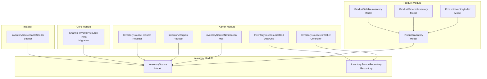
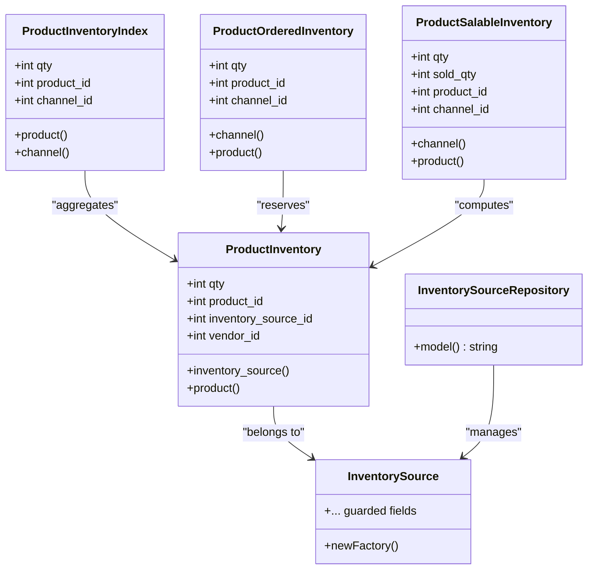
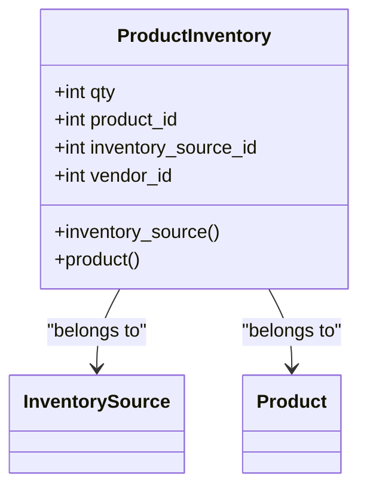
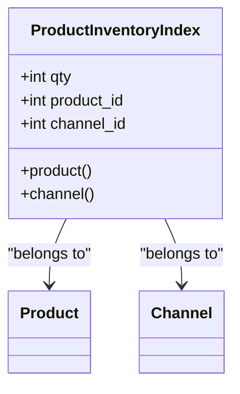
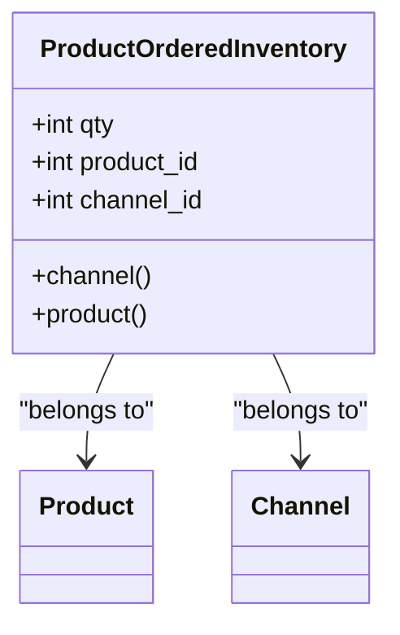
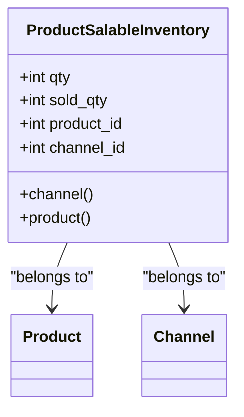
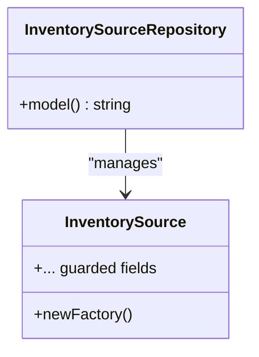
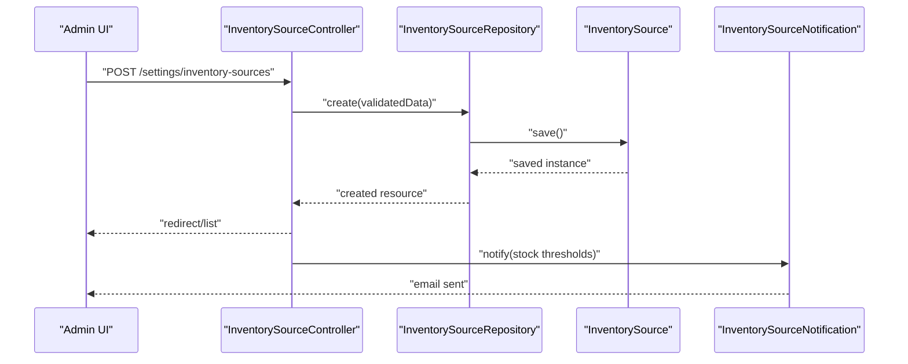
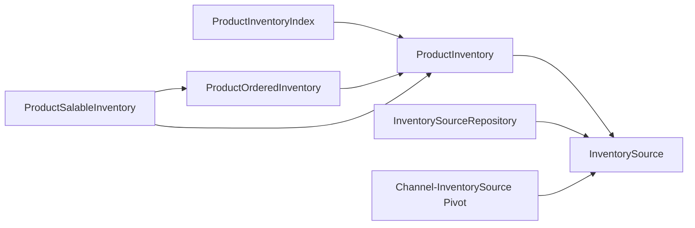
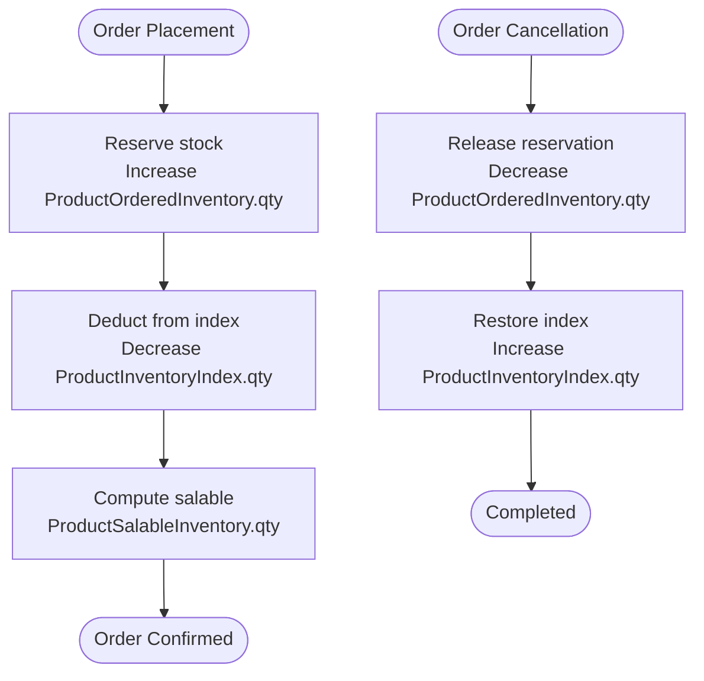

# Stock Management & Tracking

<cite>
**Referenced Files in This Document**
- [ProductInventory.php](file://packages/Webkul/Product/src/Models/ProductInventory.php)
- [ProductInventoryIndex.php](file://packages/Webkul/Product/src/Models/ProductInventoryIndex.php)
- [ProductOrderedInventory.php](file://packages/Webkul/Product/src/Models/ProductOrderedInventory.php)
- [ProductSalableInventory.php](file://packages/Webkul/Product/src/Models/ProductSalableInventory.php)
- [InventorySource.php](file://packages/Webkul/Inventory/src/Models/InventorySource.php)
- [InventorySourceRepository.php](file://packages/Webkul/Inventory/src/Repositories/InventorySourceRepository.php)
- [ProductInventory.php (contract)](file://packages/Webkul/Product/src/Contracts/ProductInventory.php)
- [ProductInventoryIndex.php (contract)](file://packages/Webkul/Product/src/Contracts/ProductInventoryIndex.php)
- [ProductOrderedInventory.php (contract)](file://packages/Webkul/Product/src/Contracts/ProductOrderedInventory.php)
- [ProductSalableInventory.php (contract)](file://packages/Webkul/Product/src/Contracts/ProductSalableInventory.php)
- [InventorySource.php (contract)](file://packages/Webkul/Inventory/src/Contracts/InventorySource.php)
- [2022_10_08_134150_create_product_inventory_indices_table.php](file://packages/Webkul/Product/src/Database/Migrations/2022_10_08_134150_create_product_inventory_indices_table.php)
- [2018_07_23_110040_create_inventory_sources_table.php](file://packages/Webkul/Inventory/src/Database/Migrations/2018_07_23_110040_create_inventory_sources_table.php)
- [2018_12_24_123812_create_channel_inventory_sources_table.php](file://packages/Webkul/Core/src/Database/Migrations/2018_12_24_123812_create_channel_inventory_sources_table.php)
- [InsufficientProductInventoryException.php](file://packages/Webkul/Product/src/Exceptions/InsufficientProductInventoryException.php)
- [InventorySourceController.php](file://packages/Webkul/Admin/src/Http/Controllers/Settings/InventorySourceController.php)
- [InventorySourcesDataGrid.php](file://packages/Webkul/Admin/src/DataGrids/Settings/InventorySourcesDataGrid.php)
- [InventorySourceNotification.php](file://packages/Webkul/Admin/src/Mail/Order/InventorySourceNotification.php)
- [InventoryRequest.php](file://packages/Webkul/Admin/src/Http/Requests/InventoryRequest.php)
- [InventorySourceRequest.php](file://packages/Webkul/Admin/src/Http/Requests/InventorySourceRequest.php)
- [inventory.svg](file://packages/Webkul/Admin/src/Resources/assets/images/settings/inventory.svg)
- [inventory-source.blade.php](file://packages/Webkul/Admin/src/Resources/views/emails/orders/inventory-source.blade.php)
- [InventorySourceTableSeeder.php](file://packages/Webkul/Installer/src/Database/Seeders/Inventory/InventorySourceTableSeeder.php)
</cite>

## Table of Contents
1. [Introduction](#introduction)
2. [Project Structure](#project-structure)
3. [Core Components](#core-components)
4. [Architecture Overview](#architecture-overview)
5. [Detailed Component Analysis](#detailed-component-analysis)
6. [Dependency Analysis](#dependency-analysis)
7. [Performance Considerations](#performance-considerations)
8. [Troubleshooting Guide](#troubleshooting-guide)
9. [Conclusion](#conclusion)
10. [Appendices](#appendices)

## Introduction
This document explains the stock management and tracking mechanisms in Frooxi’s inventory system. It focuses on the ProductInventory model, stock level calculations, and real-time inventory updates. It also covers stock reservation, allocation, and release during order fulfillment, inventory indexing strategies, stock threshold alerts, low-stock notifications, inventory adjustments, manual corrections, bulk updates, integration with order processing for automatic stock deductions and reversions on cancellations, stock transfer operations, inventory valuation methods, and cycle counting procedures.

## Project Structure
The inventory system spans multiple modules:
- Product module defines inventory models and indices for product-level stock tracking.
- Inventory module defines inventory sources and related repositories.
- Admin module provides controllers, requests, datagrids, and notifications for inventory management.
- Core module connects channels to inventory sources via a pivot relationship.
- Installer seeds default inventory sources.

**Diagram sources**
- [ProductInventory.php:13-49](file://packages/Webkul/Product/src/Models/ProductInventory.php#L13-L49)
- [ProductInventoryIndex.php:10-42](file://packages/Webkul/Product/src/Models/ProductInventoryIndex.php#L10-L42)
- [ProductOrderedInventory.php:13-62](file://packages/Webkul/Product/src/Models/ProductOrderedInventory.php#L13-L62)
- [ProductSalableInventory.php:9-35](file://packages/Webkul/Product/src/Models/ProductSalableInventory.php#L9-L35)
- [InventorySource.php:11-24](file://packages/Webkul/Inventory/src/Models/InventorySource.php#L11-L24)
- [InventorySourceRepository.php:7-16](file://packages/Webkul/Inventory/src/Repositories/InventorySourceRepository.php#L7-L16)
- [InventorySourceController.php](file://packages/Webkul/Admin/src/Http/Controllers/Settings/InventorySourceController.php)
- [InventorySourcesDataGrid.php](file://packages/Webkul/Admin/src/DataGrids/Settings/InventorySourcesDataGrid.php)
- [InventorySourceNotification.php](file://packages/Webkul/Admin/src/Mail/Order/InventorySourceNotification.php)
- [InventoryRequest.php](file://packages/Webkul/Admin/src/Http/Requests/InventoryRequest.php)
- [InventorySourceRequest.php](file://packages/Webkul/Admin/src/Http/Requests/InventorySourceRequest.php)
- [2018_12_24_123812_create_channel_inventory_sources_table.php](file://packages/Webkul/Core/src/Database/Migrations/2018_12_24_123812_create_channel_inventory_sources_table.php)
- [2018_07_23_110040_create_inventory_sources_table.php](file://packages/Webkul/Inventory/src/Database/Migrations/2018_07_23_110040_create_inventory_sources_table.php)
- [2022_10_08_134150_create_product_inventory_indices_table.php](file://packages/Webkul/Product/src/Database/Migrations/2022_10_08_134150_create_product_inventory_indices_table.php)
- [InventorySourceTableSeeder.php](file://packages/Webkul/Installer/src/Database/Seeders/Inventory/InventorySourceTableSeeder.php)

**Section sources**
- [ProductInventory.php:13-49](file://packages/Webkul/Product/src/Models/ProductInventory.php#L13-L49)
- [InventorySource.php:11-24](file://packages/Webkul/Inventory/src/Models/InventorySource.php#L11-L24)
- [InventorySourceRepository.php:7-16](file://packages/Webkul/Inventory/src/Repositories/InventorySourceRepository.php#L7-L16)

## Core Components
- ProductInventory: Tracks per-product quantities per inventory source and vendor association.
- ProductInventoryIndex: Aggregated stock per product per channel for storefront visibility.
- ProductOrderedInventory: Tracks reserved quantities per product per channel for open orders.
- ProductSalableInventory: Tracks sellable stock and sold quantity per product per channel.
- InventorySource: Represents physical or virtual stock locations with configurable attributes.
- InventorySourceRepository: Provides CRUD operations for inventory sources.

Key responsibilities:
- ProductInventory: Holds base stock quantities and links to inventory sources and products.
- ProductInventoryIndex: Maintains aggregated stock per channel for fast retrieval.
- ProductOrderedInventory: Accumulates reserved quantities to prevent overselling.
- ProductSalableInventory: Computes salable stock as aggregated available minus reserved.
- InventorySource: Defines stock locations and supports channel assignment.

**Section sources**
- [ProductInventory.php:13-49](file://packages/Webkul/Product/src/Models/ProductInventory.php#L13-L49)
- [ProductInventoryIndex.php:10-42](file://packages/Webkul/Product/src/Models/ProductInventoryIndex.php#L10-L42)
- [ProductOrderedInventory.php:13-62](file://packages/Webkul/Product/src/Models/ProductOrderedInventory.php#L13-L62)
- [ProductSalableInventory.php:9-35](file://packages/Webkul/Product/src/Models/ProductSalableInventory.php#L9-L35)
- [InventorySource.php:11-24](file://packages/Webkul/Inventory/src/Models/InventorySource.php#L11-L24)
- [InventorySourceRepository.php:7-16](file://packages/Webkul/Inventory/src/Repositories/InventorySourceRepository.php#L7-L16)

## Architecture Overview
The inventory architecture separates concerns across models, repositories, and administrative interfaces. Channels are linked to inventory sources, enabling multi-location stock management. Product-level indices and ordered inventories support real-time availability checks and reservations.

**Diagram sources**
- [ProductInventory.php:13-49](file://packages/Webkul/Product/src/Models/ProductInventory.php#L13-L49)
- [ProductInventoryIndex.php:10-42](file://packages/Webkul/Product/src/Models/ProductInventoryIndex.php#L10-L42)
- [ProductOrderedInventory.php:13-62](file://packages/Webkul/Product/src/Models/ProductOrderedInventory.php#L13-L62)
- [ProductSalableInventory.php:9-35](file://packages/Webkul/Product/src/Models/ProductSalableInventory.php#L9-L35)
- [InventorySource.php:11-24](file://packages/Webkul/Inventory/src/Models/InventorySource.php#L11-L24)
- [InventorySourceRepository.php:7-16](file://packages/Webkul/Inventory/src/Repositories/InventorySourceRepository.php#L7-L16)

## Detailed Component Analysis

### ProductInventory Model
- Purpose: Stores per-product, per-inventory-source quantities and vendor associations.
- Key relations: belongs to InventorySource and Product.
- Fields: qty, product_id, inventory_source_id, vendor_id.
- Behavior: Used as the base stock ledger for allocations and transfers.

**Diagram sources**
- [ProductInventory.php:13-49](file://packages/Webkul/Product/src/Models/ProductInventory.php#L13-L49)

**Section sources**
- [ProductInventory.php:13-49](file://packages/Webkul/Product/src/Models/ProductInventory.php#L13-L49)

### ProductInventoryIndex Model
- Purpose: Aggregated stock per product per channel for storefront queries.
- Key relations: belongs to Product and Channel.
- Fields: qty, product_id, channel_id.
- Behavior: Updated via batch jobs or triggers to reflect current stock after transactions.

**Diagram sources**
- [ProductInventoryIndex.php:10-42](file://packages/Webkul/Product/src/Models/ProductInventoryIndex.php#L10-L42)

**Section sources**
- [ProductInventoryIndex.php:10-42](file://packages/Webkul/Product/src/Models/ProductInventoryIndex.php#L10-L42)

### ProductOrderedInventory Model
- Purpose: Tracks reserved quantities per product per channel to prevent overselling.
- Key relations: belongs to Product and Channel.
- Fields: qty, product_id, channel_id.
- Behavior: Incremented on order placement and decremented on cancellation or return.

**Diagram sources**
- [ProductOrderedInventory.php:13-62](file://packages/Webkul/Product/src/Models/ProductOrderedInventory.php#L13-L62)

**Section sources**
- [ProductOrderedInventory.php:13-62](file://packages/Webkul/Product/src/Models/ProductOrderedInventory.php#L13-L62)

### ProductSalableInventory Model
- Purpose: Computes sellable stock per product per channel as available minus reserved.
- Key relations: belongs to Product and Channel.
- Fields: qty (salable), sold_qty, product_id, channel_id.
- Behavior: Recomputed periodically or on-demand to reflect latest available stock.

**Diagram sources**
- [ProductSalableInventory.php:9-35](file://packages/Webkul/Product/src/Models/ProductSalableInventory.php#L9-L35)

**Section sources**
- [ProductSalableInventory.php:9-35](file://packages/Webkul/Product/src/Models/ProductSalableInventory.php#L9-L35)

### InventorySource Model and Repository
- Purpose: Represents stock locations (physical warehouses, distribution centers, vendors).
- Relations: Managed by InventorySourceRepository.
- Behavior: Linked to channels via a pivot table to enable channel-specific stock visibility.

**Diagram sources**
- [InventorySource.php:11-24](file://packages/Webkul/Inventory/src/Models/InventorySource.php#L11-L24)
- [InventorySourceRepository.php:7-16](file://packages/Webkul/Inventory/src/Repositories/InventorySourceRepository.php#L7-L16)

**Section sources**
- [InventorySource.php:11-24](file://packages/Webkul/Inventory/src/Models/InventorySource.php#L11-L24)
- [InventorySourceRepository.php:7-16](file://packages/Webkul/Inventory/src/Repositories/InventorySourceRepository.php#L7-L16)

### Administrative Interfaces and Workflows
- InventorySourceController: Manages creation, updates, and deletion of inventory sources.
- InventorySourcesDataGrid: Provides grid-based listing and filtering of inventory sources.
- InventorySourceNotification: Sends notifications related to inventory events.
- InventoryRequest and InventorySourceRequest: Form requests validating admin actions.
- InventorySourceTableSeeder: Seeds default inventory sources during installation.

**Diagram sources**
- [InventorySourceController.php](file://packages/Webkul/Admin/src/Http/Controllers/Settings/InventorySourceController.php)
- [InventorySourceRepository.php:7-16](file://packages/Webkul/Inventory/src/Repositories/InventorySourceRepository.php#L7-L16)
- [InventorySource.php:11-24](file://packages/Webkul/Inventory/src/Models/InventorySource.php#L11-L24)
- [InventorySourceNotification.php](file://packages/Webkul/Admin/src/Mail/Order/InventorySourceNotification.php)

**Section sources**
- [InventorySourceController.php](file://packages/Webkul/Admin/src/Http/Controllers/Settings/InventorySourceController.php)
- [InventorySourcesDataGrid.php](file://packages/Webkul/Admin/src/DataGrids/Settings/InventorySourcesDataGrid.php)
- [InventorySourceNotification.php](file://packages/Webkul/Admin/src/Mail/Order/InventorySourceNotification.php)
- [InventoryRequest.php](file://packages/Webkul/Admin/src/Http/Requests/InventoryRequest.php)
- [InventorySourceRequest.php](file://packages/Webkul/Admin/src/Http/Requests/InventorySourceRequest.php)
- [InventorySourceTableSeeder.php](file://packages/Webkul/Installer/src/Database/Seeders/Inventory/InventorySourceTableSeeder.php)

## Dependency Analysis
- ProductInventory depends on InventorySource and Product.
- ProductInventoryIndex aggregates from ProductInventory.
- ProductOrderedInventory reserves from ProductInventory.
- ProductSalableInventory computes from aggregated ProductInventory and ProductOrderedInventory.
- InventorySourceRepository manages InventorySource persistence.
- Channels connect to InventorySources via a pivot migration.

**Diagram sources**
- [ProductInventory.php:13-49](file://packages/Webkul/Product/src/Models/ProductInventory.php#L13-L49)
- [ProductInventoryIndex.php:10-42](file://packages/Webkul/Product/src/Models/ProductInventoryIndex.php#L10-L42)
- [ProductOrderedInventory.php:13-62](file://packages/Webkul/Product/src/Models/ProductOrderedInventory.php#L13-L62)
- [ProductSalableInventory.php:9-35](file://packages/Webkul/Product/src/Models/ProductSalableInventory.php#L9-L35)
- [InventorySourceRepository.php:7-16](file://packages/Webkul/Inventory/src/Repositories/InventorySourceRepository.php#L7-L16)
- [2018_12_24_123812_create_channel_inventory_sources_table.php](file://packages/Webkul/Core/src/Database/Migrations/2018_12_24_123812_create_channel_inventory_sources_table.php)

**Section sources**
- [ProductInventory.php:13-49](file://packages/Webkul/Product/src/Models/ProductInventory.php#L13-L49)
- [ProductInventoryIndex.php:10-42](file://packages/Webkul/Product/src/Models/ProductInventoryIndex.php#L10-L42)
- [ProductOrderedInventory.php:13-62](file://packages/Webkul/Product/src/Models/ProductOrderedInventory.php#L13-L62)
- [ProductSalableInventory.php:9-35](file://packages/Webkul/Product/src/Models/ProductSalableInventory.php#L9-L35)
- [InventorySourceRepository.php:7-16](file://packages/Webkul/Inventory/src/Repositories/InventorySourceRepository.php#L7-L16)
- [2018_12_24_123812_create_channel_inventory_sources_table.php](file://packages/Webkul/Core/src/Database/Migrations/2018_12_24_123812_create_channel_inventory_sources_table.php)

## Performance Considerations
- Indexing: ProductInventoryIndex and ProductOrderedInventory reduce query complexity for stock checks and reservations.
- Aggregation: Salable stock computation should be cached or computed periodically to avoid heavy joins.
- Batch Updates: Bulk stock adjustments should leverage batched writes to minimize transaction overhead.
- Concurrency: Use optimistic locking or database-level atomic operations for stock updates to prevent race conditions.
- Monitoring: Track slow queries on stock aggregation and reserve/release operations.

## Troubleshooting Guide
Common issues and resolutions:
- Insufficient stock errors: Thrown when attempting to allocate more than available. Catch and present user-friendly messages indicating available quantities.
- Reservation mismatches: Verify that reserved quantities are decremented on order cancellation or return.
- Index staleness: Ensure ProductInventoryIndex is refreshed after stock changes to reflect accurate storefront availability.
- Multi-source discrepancies: Confirm channel-to-inventory-source mapping and reconcile differences.

**Section sources**
- [InsufficientProductInventoryException.php](file://packages/Webkul/Product/src/Exceptions/InsufficientProductInventoryException.php)

## Conclusion
Frooxi’s inventory system separates base stock tracking (ProductInventory), aggregated availability (ProductInventoryIndex), reservations (ProductOrderedInventory), and salable stock (ProductSalableInventory). Inventory sources and channel mappings enable flexible, multi-location stock management. Administrative interfaces streamline configuration, while migrations define the underlying schema. Proper indexing, batch updates, and concurrency controls ensure reliable, real-time stock operations integrated with order processing.

## Appendices

### Stock Level Calculations
- Available stock per inventory source: ProductInventory.qty.
- Aggregated stock per channel: ProductInventoryIndex.qty.
- Reserved stock per channel: ProductOrderedInventory.qty.
- Salable stock per channel: ProductSalableInventory.qty = ProductInventoryIndex.qty − ProductOrderedInventory.qty.

**Section sources**
- [ProductInventory.php:19-24](file://packages/Webkul/Product/src/Models/ProductInventory.php#L19-L24)
- [ProductInventoryIndex.php:17-21](file://packages/Webkul/Product/src/Models/ProductInventoryIndex.php#L17-L21)
- [ProductOrderedInventory.php:29-33](file://packages/Webkul/Product/src/Models/ProductOrderedInventory.php#L29-L33)
- [ProductSalableInventory.php:13-18](file://packages/Webkul/Product/src/Models/ProductSalableInventory.php#L13-L18)

### Real-Time Inventory Updates
- On order placement: Increase ProductOrderedInventory.qty and decrease ProductInventoryIndex.qty.
- On order cancellation: Decrease ProductOrderedInventory.qty and increase ProductInventoryIndex.qty.
- On stock adjustments: Update ProductInventory.qty and refresh ProductInventoryIndex.qty and ProductSalableInventory.qty.

**Section sources**
- [ProductOrderedInventory.php:29-33](file://packages/Webkul/Product/src/Models/ProductOrderedInventory.php#L29-L33)
- [ProductInventoryIndex.php:17-21](file://packages/Webkul/Product/src/Models/ProductInventoryIndex.php#L17-L21)
- [ProductSalableInventory.php:13-18](file://packages/Webkul/Product/src/Models/ProductSalableInventory.php#L13-L18)

### Stock Reservation, Allocation, and Release
- Reservation: Increment ProductOrderedInventory.qty upon adding items to cart or confirming an order.
- Allocation: Deduct from ProductInventoryIndex.qty and update ProductSalableInventory.qty.
- Release: Decrement ProductOrderedInventory.qty on cancellation or refund; restore ProductInventoryIndex.qty.

**Diagram sources**
- [ProductOrderedInventory.php:29-33](file://packages/Webkul/Product/src/Models/ProductOrderedInventory.php#L29-L33)
- [ProductInventoryIndex.php:17-21](file://packages/Webkul/Product/src/Models/ProductInventoryIndex.php#L17-L21)
- [ProductSalableInventory.php:13-18](file://packages/Webkul/Product/src/Models/ProductSalableInventory.php#L13-L18)

### Inventory Indexing Strategies
- ProductInventoryIndex: Aggregate per product per channel for fast storefront queries.
- ProductOrderedInventory: Per product per channel reserved quantities.
- ProductSalableInventory: Per product per channel computed salable stock.

**Section sources**
- [ProductInventoryIndex.php:10-42](file://packages/Webkul/Product/src/Models/ProductInventoryIndex.php#L10-L42)
- [ProductOrderedInventory.php:13-62](file://packages/Webkul/Product/src/Models/ProductOrderedInventory.php#L13-L62)
- [ProductSalableInventory.php:9-35](file://packages/Webkul/Product/src/Models/ProductSalableInventory.php#L9-L35)

### Stock Threshold Alerts and Low-Stock Notifications
- Configure thresholds per inventory source or product.
- Trigger notifications when ProductInventoryIndex.qty falls below configured thresholds.
- Use InventorySourceNotification to send alerts to administrators or vendors.

**Section sources**
- [InventorySourceNotification.php](file://packages/Webkul/Admin/src/Mail/Order/InventorySourceNotification.php)

### Inventory Adjustment Procedures and Manual Corrections
- Use InventorySourceController to adjust quantities.
- Validate inputs via InventoryRequest and InventorySourceRequest.
- Apply corrections to ProductInventory.qty and propagate to ProductInventoryIndex.qty and ProductSalableInventory.qty.

**Section sources**
- [InventorySourceController.php](file://packages/Webkul/Admin/src/Http/Controllers/Settings/InventorySourceController.php)
- [InventoryRequest.php](file://packages/Webkul/Admin/src/Http/Requests/InventoryRequest.php)
- [InventorySourceRequest.php](file://packages/Webkul/Admin/src/Http/Requests/InventorySourceRequest.php)

### Bulk Inventory Updates
- Batch update ProductInventory entries for multiple SKUs and sources.
- Refresh ProductInventoryIndex and ProductSalableInventory after bulk changes.
- Use batched writes to improve performance and reduce transaction overhead.

**Section sources**
- [ProductInventory.php:19-24](file://packages/Webkul/Product/src/Models/ProductInventory.php#L19-L24)
- [ProductInventoryIndex.php:17-21](file://packages/Webkul/Product/src/Models/ProductInventoryIndex.php#L17-L21)
- [ProductSalableInventory.php:13-18](file://packages/Webkul/Product/src/Models/ProductSalableInventory.php#L13-L18)

### Integration with Order Processing
- Automatic deductions: On order confirmation, decrement ProductInventoryIndex.qty and increment ProductOrderedInventory.qty.
- Reversion on cancellations: On cancellation, increment ProductInventoryIndex.qty and decrement ProductOrderedInventory.qty.
- Exception handling: Throw InsufficientProductInventoryException when stock is unavailable.

**Section sources**
- [InsufficientProductInventoryException.php](file://packages/Webkul/Product/src/Exceptions/InsufficientProductInventoryException.php)

### Stock Transfer Operations
- Transfer from one inventory source to another by adjusting ProductInventory entries for the source and destination.
- Update ProductInventoryIndex.qty for affected channels.
- Log transfers for audit trails.

**Section sources**
- [ProductInventory.php:19-24](file://packages/Webkul/Product/src/Models/ProductInventory.php#L19-L24)
- [ProductInventoryIndex.php:17-21](file://packages/Webkul/Product/src/Models/ProductInventoryIndex.php#L17-L21)

### Inventory Valuation Methods
- FIFO/LIFO: Maintain cost layers per inventory source and compute valuation accordingly.
- Weighted average: Track total cost and units per source to compute average cost.
- Per-channel valuation: Separate valuations per channel if sources are mapped differently.

[No sources needed since this section provides general guidance]

### Cycle Counting Procedures
- Schedule periodic counts per inventory source and channel.
- Compare counted quantities with ProductInventoryIndex.qty and reconcile differences.
- Adjust ProductInventory.qty and recalculate ProductSalableInventory.qty.

**Section sources**
- [ProductInventory.php:19-24](file://packages/Webkul/Product/src/Models/ProductInventory.php#L19-L24)
- [ProductInventoryIndex.php:17-21](file://packages/Webkul/Product/src/Models/ProductInventoryIndex.php#L17-L21)
- [ProductSalableInventory.php:13-18](file://packages/Webkul/Product/src/Models/ProductSalableInventory.php#L13-L18)