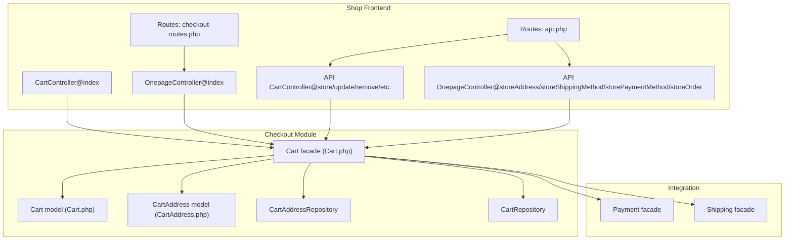
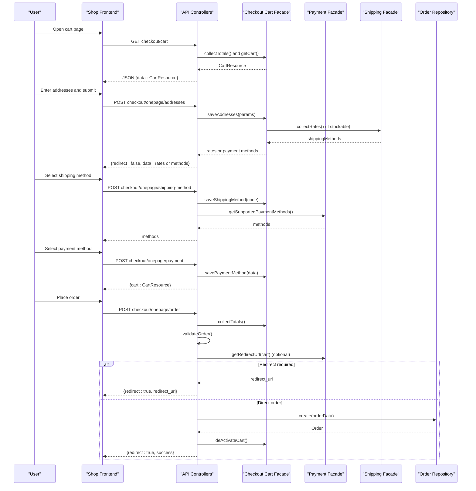
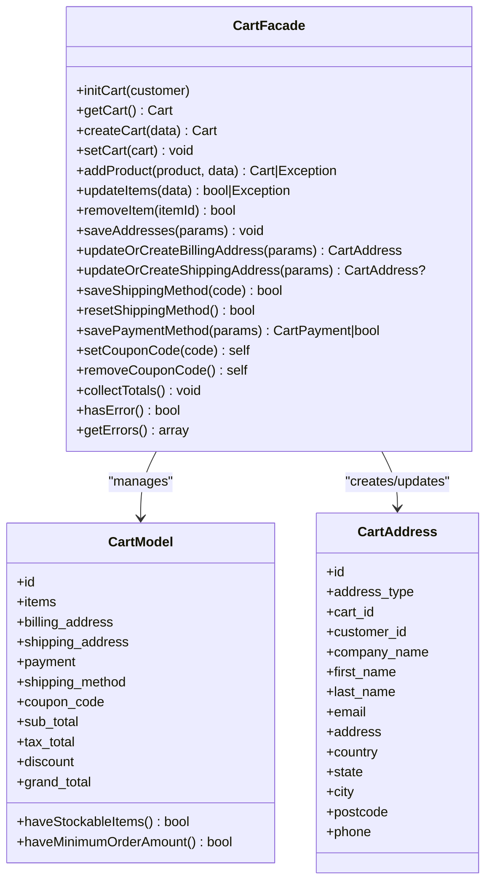
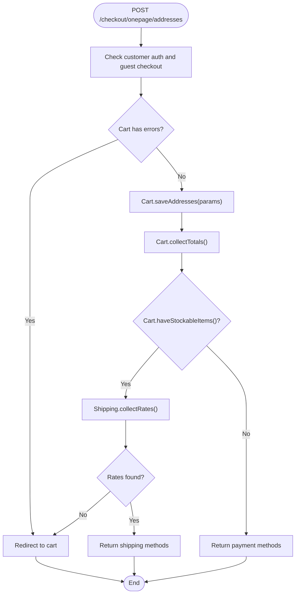
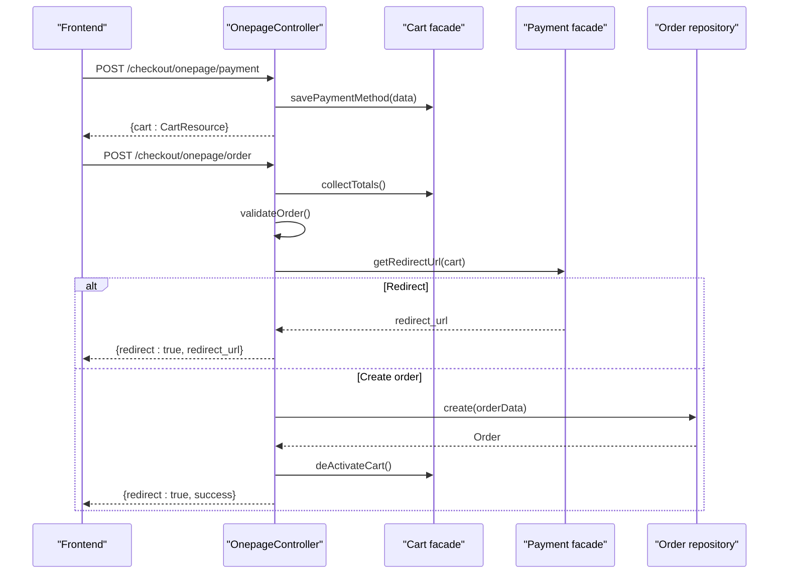
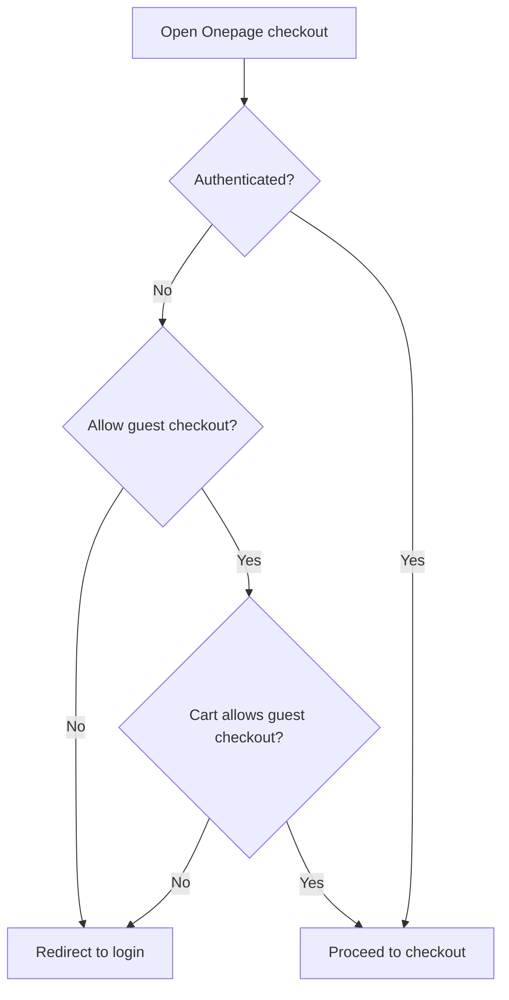
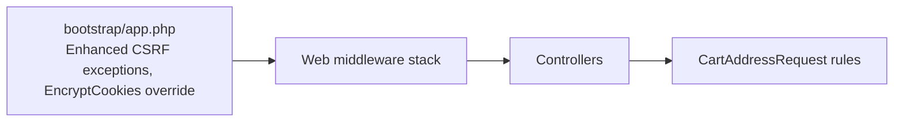
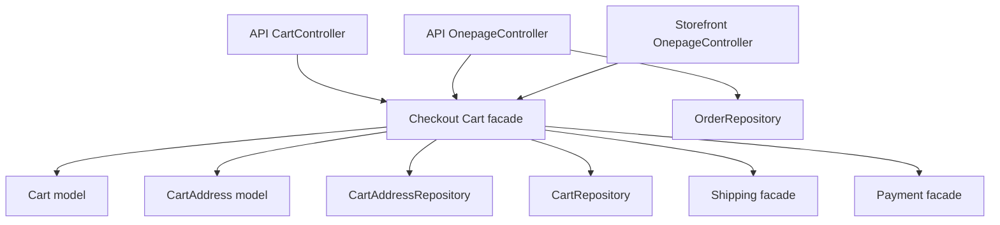

# Checkout Process

<cite>
**Referenced Files in This Document**
- [Cart.php](file://packages/Webkul/Checkout/src/Cart.php)
- [Cart.php](file://packages/Webkul/Checkout/src/Models/Cart.php)
- [CartAddress.php](file://packages/Webkul/Checkout/src/Models/CartAddress.php)
- [CartAddressRepository.php](file://packages/Webkul/Checkout/src/Repositories/CartAddressRepository.php)
- [CartRepository.php](file://packages/Webkul/Checkout/src/Repositories/CartRepository.php)
- [CartController.php](file://packages/Webkul/Shop/src/Http/Controllers/CartController.php)
- [OnepageController.php](file://packages/Webkul/Shop/src/Http/Controllers/OnepageController.php)
- [CartController.php](file://packages/Webkul/Shop/src/Http/Controllers/API/CartController.php)
- [OnepageController.php](file://packages/Webkul/Shop/src/Http/Controllers/API/OnepageController.php)
- [CartAddressRequest.php](file://packages/Webkul/Shop/src/Http/Requests/CartAddressRequest.php)
- [checkout-routes.php](file://packages/Webkul/Shop/src/Routes/checkout-routes.php)
- [api.php](file://packages/Webkul/Shop/src/Routes/api.php)
- [BillingAddressNotFoundException.php](file://packages/Webkul/Checkout/src/Exceptions/BillingAddressNotFoundException.php)
- [app.php](file://bootstrap/app.php)
</cite>

## Update Summary
**Changes Made**
- Updated tax calculation section to reflect removal of tax package integration
- Enhanced error handling documentation for modernized checkout flow
- Added comprehensive coverage of improved form validation and user feedback mechanisms
- Updated payment processing integration documentation
- Enhanced security measures and middleware protection details
- Expanded troubleshooting guide with new error scenarios

## Table of Contents
1. [Introduction](#introduction)
2. [Project Structure](#project-structure)
3. [Core Components](#core-components)
4. [Architecture Overview](#architecture-overview)
5. [Detailed Component Analysis](#detailed-component-analysis)
6. [Dependency Analysis](#dependency-analysis)
7. [Performance Considerations](#performance-considerations)
8. [Troubleshooting Guide](#troubleshooting-guide)
9. [Conclusion](#conclusion)

## Introduction
This document explains the end-to-end checkout process in the system, from reviewing the cart to order confirmation. The checkout functionality has been modernized with improved form validation, better error handling, and enhanced user feedback throughout the purchasing process. It covers address validation, shipping estimation, totals computation, discount application (currently disabled), payment processing integration, order placement logic, and comprehensive error handling. It also documents guest vs. registered customer flows, middleware protections, data transformation, order creation triggers, and cart cleanup processes.

## Project Structure
The checkout workflow spans several modules with modernized functionality:
- Shop storefront routes and controllers for cart and onepage checkout with enhanced validation
- Checkout module for cart model, repositories, and totals computation with streamlined tax handling
- Payment and Shipping facades for payment method retrieval and shipping rates
- Validation requests for address inputs with dynamic rule merging
- Bootstrap configuration for CSRF and encryption middleware with enhanced security

**Diagram sources**
- [checkout-routes.php:1-19](file://packages/Webkul/Shop/src/Routes/checkout-routes.php#L1-L19)
- [api.php:65-90](file://packages/Webkul/Shop/src/Routes/api.php#L65-L90)
- [CartController.php:1-23](file://packages/Webkul/Shop/src/Http/Controllers/CartController.php#L1-L23)
- [OnepageController.php:1-96](file://packages/Webkul/Shop/src/Http/Controllers/OnepageController.php#L1-L96)
- [CartController.php:1-265](file://packages/Webkul/Shop/src/Http/Controllers/API/CartController.php#L1-L265)
- [OnepageController.php:1-250](file://packages/Webkul/Shop/src/Http/Controllers/API/OnepageController.php#L1-L250)
- [Cart.php:1-1228](file://packages/Webkul/Checkout/src/Cart.php#L1-L1228)
- [Cart.php:1-200](file://packages/Webkul/Checkout/src/Models/Cart.php#L1-L200)
- [CartAddress.php:1-200](file://packages/Webkul/Checkout/src/Models/CartAddress.php#L1-L200)
- [CartAddressRepository.php:1-200](file://packages/Webkul/Checkout/src/Repositories/CartAddressRepository.php#L1-L200)
- [CartRepository.php:1-200](file://packages/Webkul/Checkout/src/Repositories/CartRepository.php#L1-L200)

**Section sources**
- [checkout-routes.php:1-19](file://packages/Webkul/Shop/src/Routes/checkout-routes.php#L1-L19)
- [api.php:65-90](file://packages/Webkul/Shop/src/Routes/api.php#L65-L90)
- [CartController.php:1-23](file://packages/Webkul/Shop/src/Http/Controllers/CartController.php#L1-L23)
- [OnepageController.php:1-96](file://packages/Webkul/Shop/src/Http/Controllers/OnepageController.php#L1-L96)
- [CartController.php:1-265](file://packages/Webkul/Shop/src/Http/Controllers/API/CartController.php#L1-L265)
- [OnepageController.php:1-250](file://packages/Webkul/Shop/src/Http/Controllers/API/OnepageController.php#L1-L250)
- [Cart.php:1-1228](file://packages/Webkul/Checkout/src/Cart.php#L1-L1228)

## Core Components
- Cart facade and model: central cart lifecycle with modernized totals computation, streamlined address saving, enhanced shipping/payment saving, coupon handling (disabled), and comprehensive error checks
- API controllers: cart CRUD operations with improved validation, shipping estimation, coupon application/removal (disabled), and onepage checkout steps with better error handling
- Validation request: dynamic address rules merged based on billing/shipping usage with enhanced phone number, postal code, and VAT ID validation
- Payment and Shipping facades: payment method retrieval and shipping rate collection with improved integration
- Exceptions: billing address requirement enforcement with clearer error messages

Key responsibilities:
- Cart facade orchestrates add/update/remove items with enhanced validation, collect totals with streamlined tax handling, save addresses with improved error checking, save shipping/payment with better validation, and comprehensive error validation
- API controllers translate HTTP requests into cart operations with enhanced error handling and return structured JSON responses with improved user feedback
- Validation request adapts rules dynamically depending on whether shipping address is same as billing with enhanced validation rules
- Payment and Shipping facades provide integrations for supported methods and shipping rates with improved reliability
- Tax calculation has been streamlined with removal of external tax package dependency

**Section sources**
- [Cart.php:1-1228](file://packages/Webkul/Checkout/src/Cart.php#L1-L1228)
- [Cart.php:1-200](file://packages/Webkul/Checkout/src/Models/Cart.php#L1-L200)
- [CartAddress.php:1-200](file://packages/Webkul/Checkout/src/Models/CartAddress.php#L1-L200)
- [CartAddressRepository.php:1-200](file://packages/Webkul/Checkout/src/Repositories/CartAddressRepository.php#L1-L200)
- [CartRepository.php:1-200](file://packages/Webkul/Checkout/src/Repositories/CartRepository.php#L1-L200)
- [CartController.php:1-265](file://packages/Webkul/Shop/src/Http/Controllers/API/CartController.php#L1-L265)
- [OnepageController.php:1-250](file://packages/Webkul/Shop/src/Http/Controllers/API/OnepageController.php#L1-L250)
- [CartAddressRequest.php:1-76](file://packages/Webkul/Shop/src/Http/Requests/CartAddressRequest.php#L1-L76)

## Architecture Overview
The checkout flow is split into two primary paths with modernized error handling and user feedback:
- Storefront UI path: Cart page and Onepage view with enhanced validation
- API-first path: Cart and Onepage API endpoints invoked by frontend with improved error handling

**Diagram sources**
- [checkout-routes.php:1-19](file://packages/Webkul/Shop/src/Routes/checkout-routes.php#L1-L19)
- [api.php:65-90](file://packages/Webkul/Shop/src/Routes/api.php#L65-L90)
- [CartController.php:1-265](file://packages/Webkul/Shop/src/Http/Controllers/API/CartController.php#L1-L265)
- [OnepageController.php:1-250](file://packages/Webkul/Shop/src/Http/Controllers/API/OnepageController.php#L1-L250)
- [Cart.php:1-1228](file://packages/Webkul/Checkout/src/Cart.php#L1-L1228)

## Detailed Component Analysis

### Cart Facade and Modernized Totals Computation
The Cart facade coordinates with streamlined tax handling:
- Cart initialization and persistence with enhanced validation
- Adding/updating/removing items with improved error handling
- Address saving (billing and shipping) with comprehensive validation
- Shipping method selection and reset with better error checking
- Payment method selection with enhanced validation
- Coupon code setting/removal (currently disabled)
- Totals recalculation with simplified tax handling and error checks

**Diagram sources**
- [Cart.php:1-1228](file://packages/Webkul/Checkout/src/Cart.php#L1-L1228)
- [Cart.php:1-200](file://packages/Webkul/Checkout/src/Models/Cart.php#L1-L200)
- [CartAddress.php:1-200](file://packages/Webkul/Checkout/src/Models/CartAddress.php#L1-L200)

**Section sources**
- [Cart.php:1-1228](file://packages/Webkul/Checkout/src/Cart.php#L1-L1228)
- [Cart.php:1-200](file://packages/Webkul/Checkout/src/Models/Cart.php#L1-L200)
- [CartAddress.php:1-200](file://packages/Webkul/Checkout/src/Models/CartAddress.php#L1-L200)

### Address Validation and Modernized Shipping Estimation
- Validation request merges rules dynamically for billing and shipping based on form inputs with enhanced phone number, postal code, and VAT ID validation
- Onepage storeAddress endpoint validates presence of guest checkout eligibility and cart errors, saves addresses, collects totals, and either returns shipping methods or payment methods depending on stockable items with improved error handling

**Diagram sources**
- [OnepageController.php:1-250](file://packages/Webkul/Shop/src/Http/Controllers/API/OnepageController.php#L1-L250)
- [CartAddressRequest.php:1-76](file://packages/Webkul/Shop/src/Http/Requests/CartAddressRequest.php#L1-L76)
- [Cart.php:1-1228](file://packages/Webkul/Checkout/src/Cart.php#L1-L1228)

**Section sources**
- [OnepageController.php:1-250](file://packages/Webkul/Shop/src/Http/Controllers/API/OnepageController.php#L1-L250)
- [CartAddressRequest.php:1-76](file://packages/Webkul/Shop/src/Http/Requests/CartAddressRequest.php#L1-L76)
- [Cart.php:1-1228](file://packages/Webkul/Checkout/src/Cart.php#L1-L1228)

### Payment Processing Integration and Modernized Order Placement
- After shipping is selected, the client requests supported payment methods with enhanced validation
- The client selects a payment method; the server persists it and returns the updated cart with improved error handling
- Placing order triggers comprehensive validation, optional redirect via payment provider, or direct order creation and cart deactivation with enhanced error feedback

**Diagram sources**
- [OnepageController.php:1-250](file://packages/Webkul/Shop/src/Http/Controllers/API/OnepageController.php#L1-L250)
- [Cart.php:1-1228](file://packages/Webkul/Checkout/src/Cart.php#L1-L1228)

**Section sources**
- [OnepageController.php:1-250](file://packages/Webkul/Shop/src/Http/Controllers/API/OnepageController.php#L1-L250)
- [Cart.php:1-1228](file://packages/Webkul/Checkout/src/Cart.php#L1-L1228)

### Guest Checkout vs Registered Customer Flows
- Storefront OnepageController enforces guest checkout configuration and redirects unauthenticated users appropriately with enhanced validation
- API OnepageController checks guest checkout eligibility per cart contents and customer session with improved error handling
- Cart facade sets customer personnel details from billing address when applicable with better error checking

**Diagram sources**
- [OnepageController.php:1-96](file://packages/Webkul/Shop/src/Http/Controllers/OnepageController.php#L1-L96)
- [OnepageController.php:1-250](file://packages/Webkul/Shop/src/Http/Controllers/API/OnepageController.php#L1-L250)
- [Cart.php:1-1228](file://packages/Webkul/Checkout/src/Cart.php#L1-L1228)

**Section sources**
- [OnepageController.php:1-96](file://packages/Webkul/Shop/src/Http/Controllers/OnepageController.php#L1-L96)
- [OnepageController.php:1-250](file://packages/Webkul/Shop/src/Http/Controllers/API/OnepageController.php#L1-L250)
- [Cart.php:1-1228](file://packages/Webkul/Checkout/src/Cart.php#L1-L1228)

### Security Measures and Enhanced Middleware Protection
- CSRF exceptions are configured for specific paths (e.g., Stripe) with enhanced security
- Cookies encryption is overridden in the web middleware group for better compatibility
- Address validation uses dedicated rules for phone number, postal code, and VAT ID with improved validation

**Diagram sources**
- [app.php:30-55](file://bootstrap/app.php#L30-L55)
- [CartAddressRequest.php:1-76](file://packages/Webkul/Shop/src/Http/Requests/CartAddressRequest.php#L1-L76)

**Section sources**
- [app.php:30-55](file://bootstrap/app.php#L30-L55)
- [CartAddressRequest.php:1-76](file://packages/Webkul/Shop/src/Http/Requests/CartAddressRequest.php#L1-L76)

### Data Transformation and Modernized Cart Cleanup
- Cart totals recomputation after add/update/remove/save operations with streamlined tax handling
- Cart deactivation upon successful order placement with enhanced cleanup
- Coupon removal on usage limit exceeded during order creation (currently disabled functionality)

**Section sources**
- [Cart.php:1-1228](file://packages/Webkul/Checkout/src/Cart.php#L1-L1228)
- [OnepageController.php:1-250](file://packages/Webkul/Shop/src/Http/Controllers/API/OnepageController.php#L1-L250)

### Modernized Tax Calculation and Error Handling
**Updated** The tax calculation system has been modernized with the removal of external tax package dependency. The cart facade now includes streamlined tax handling that focuses on essential calculations while removing complex tax category and rate management.

Key improvements:
- Simplified tax calculation logic with removal of external tax package
- Streamlined tax category handling with fallback to default configurations
- Enhanced error handling for tax-related operations
- Improved performance by eliminating external tax calculations
- Better integration with currency conversion systems

**Section sources**
- [Cart.php:1016-1140](file://packages/Webkul/Checkout/src/Cart.php#L1016-L1140)
- [Cart.php:1145-1226](file://packages/Webkul/Checkout/src/Cart.php#L1145-L1226)

## Dependency Analysis

**Diagram sources**
- [CartController.php:1-265](file://packages/Webkul/Shop/src/Http/Controllers/API/CartController.php#L1-L265)
- [OnepageController.php:1-250](file://packages/Webkul/Shop/src/Http/Controllers/API/OnepageController.php#L1-L250)
- [OnepageController.php:1-96](file://packages/Webkul/Shop/src/Http/Controllers/OnepageController.php#L1-L96)
- [Cart.php:1-1228](file://packages/Webkul/Checkout/src/Cart.php#L1-L1228)
- [Cart.php:1-200](file://packages/Webkul/Checkout/src/Models/Cart.php#L1-L200)
- [CartAddress.php:1-200](file://packages/Webkul/Checkout/src/Models/CartAddress.php#L1-L200)
- [CartAddressRepository.php:1-200](file://packages/Webkul/Checkout/src/Repositories/CartAddressRepository.php#L1-L200)
- [CartRepository.php:1-200](file://packages/Webkul/Checkout/src/Repositories/CartRepository.php#L1-L200)

**Section sources**
- [CartController.php:1-265](file://packages/Webkul/Shop/src/Http/Controllers/API/CartController.php#L1-L265)
- [OnepageController.php:1-250](file://packages/Webkul/Shop/src/Http/Controllers/API/OnepageController.php#L1-L250)
- [OnepageController.php:1-96](file://packages/Webkul/Shop/src/Http/Controllers/OnepageController.php#L1-L96)
- [Cart.php:1-1228](file://packages/Webkul/Checkout/src/Cart.php#L1-L1228)

## Performance Considerations
- Totals recomputation occurs after each significant change with streamlined tax handling; batch updates should minimize repeated calls
- Shipping rates are cleared when addresses change or shipping method is reset with improved performance
- Coupon functionality is disabled; avoid unnecessary coupon-related logic in totals computation
- Use lazy loading and minimal serialization for cart resources to reduce payload sizes
- Enhanced error handling reduces unnecessary processing by catching issues early
- Streamlined tax calculations improve overall checkout performance

## Troubleshooting Guide
**Updated** Common issues and remedies with enhanced error handling:

- Billing address required before shipping address: ensure billing address is saved first; otherwise, a specific exception is thrown with clear error messaging
- Cart errors prevent proceeding: check inventory sufficiency, minimum order amount, and item status with comprehensive error validation
- Guest checkout restrictions: verify configuration and cart contents allow guest checkout with enhanced validation
- Payment redirect: if a redirect URL is returned, follow it; otherwise, confirm order creation succeeded with improved error feedback
- CSRF or cookie issues: verify CSRF exceptions and encryption overrides for third-party integrations with enhanced security
- Tax calculation errors: with the removal of external tax package, verify currency conversion and basic tax calculations are working properly
- Coupon functionality: currently disabled due to CartRule package removal; expect limited coupon support
- Enhanced error messages: modernized checkout provides more descriptive error messages for better user experience

**Section sources**
- [BillingAddressNotFoundException.php:1-8](file://packages/Webkul/Checkout/src/Exceptions/BillingAddressNotFoundException.php#L1-L8)
- [Cart.php:1-1228](file://packages/Webkul/Checkout/src/Cart.php#L1-L1228)
- [OnepageController.php:1-250](file://packages/Webkul/Shop/src/Http/Controllers/API/OnepageController.php#L1-L250)
- [app.php:30-55](file://bootstrap/app.php#L30-L55)

## Conclusion
The checkout process is orchestrated by the modernized Cart facade and exposed through both storefront and API controllers with enhanced validation and error handling. Address validation, shipping estimation, and totals computation are integrated tightly with Payment and Shipping facades. While discount application is currently disabled due to CartRule package removal, the framework supports future extension. Robust validation, middleware protections, and clear error handling ensure a reliable checkout experience for both guests and registered users with improved user feedback throughout the purchasing process.