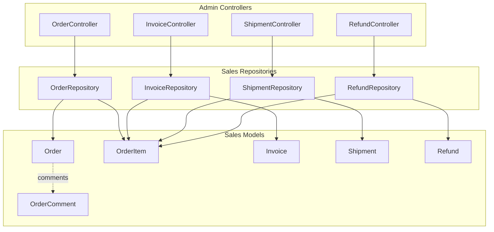
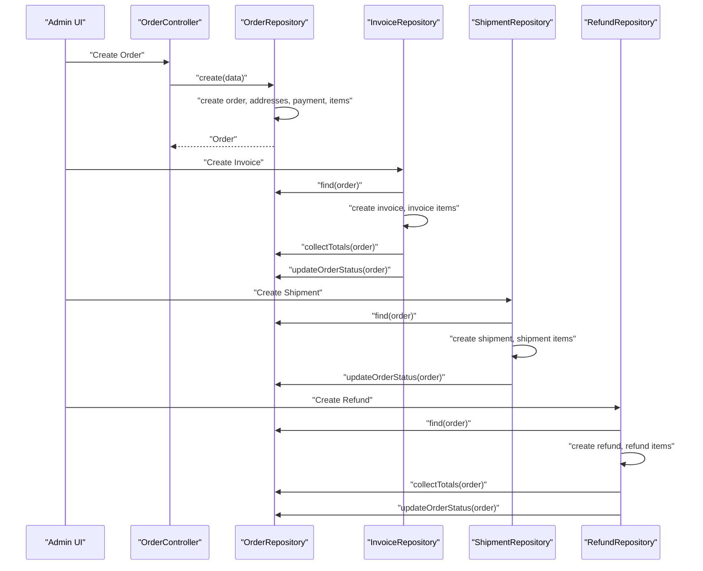
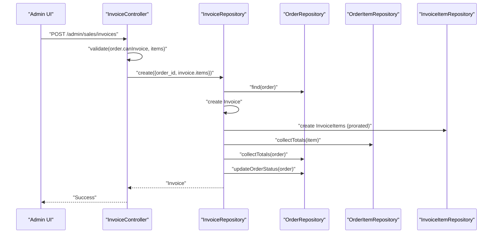
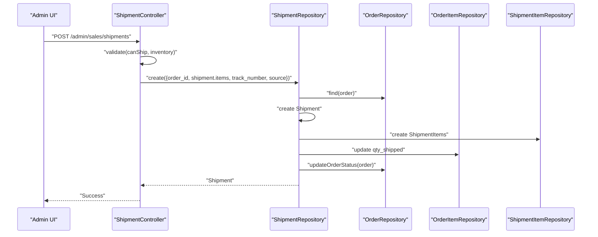
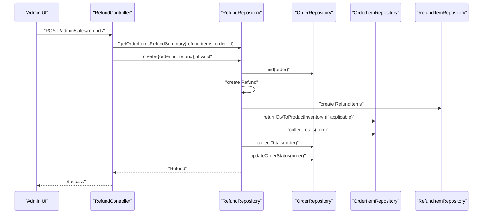
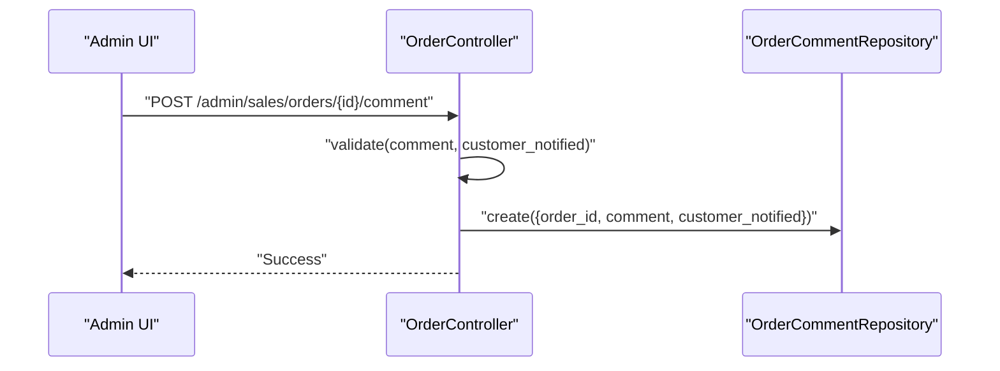
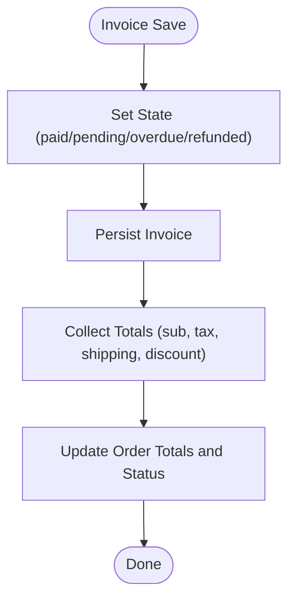
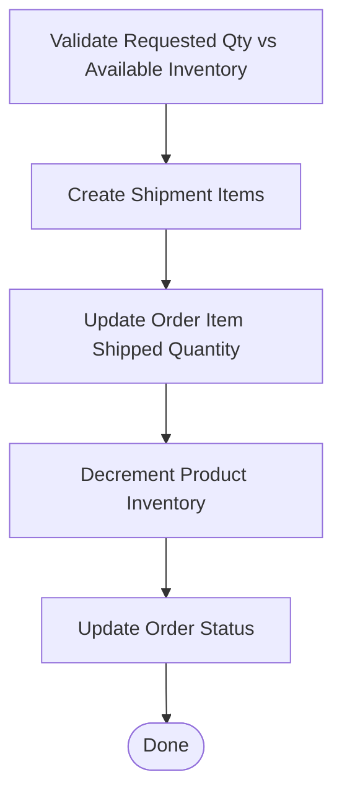
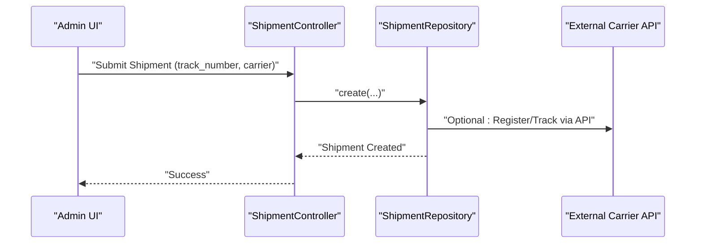
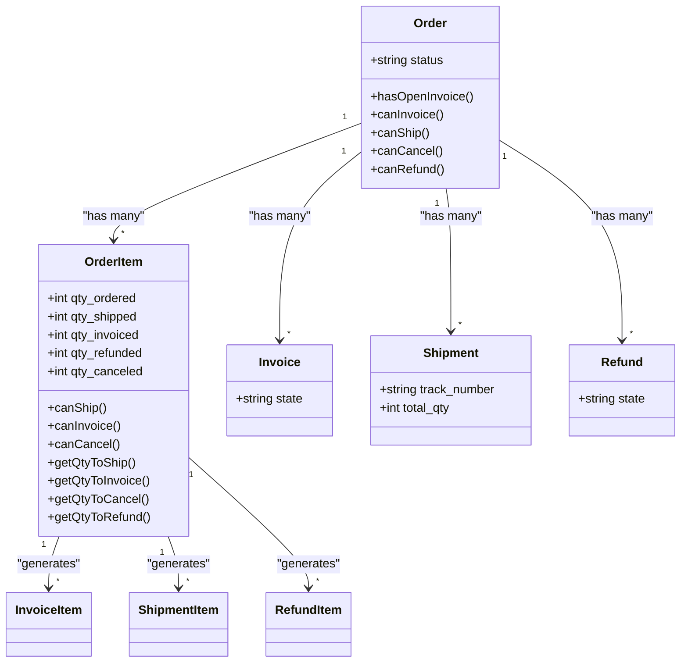

# Order Fulfillment

<cite>
**Referenced Files in This Document**
- [Order.php](file://packages/Webkul/Sales/src/Models/Order.php)
- [Invoice.php](file://packages/Webkul/Sales/src/Models/Invoice.php)
- [Shipment.php](file://packages/Webkul/Sales/src/Models/Shipment.php)
- [Refund.php](file://packages/Webkul/Sales/src/Models/Refund.php)
- [OrderItem.php](file://packages/Webkul/Sales/src/Models/OrderItem.php)
- [OrderComment.php](file://packages/Webkul/Sales/src/Models/OrderComment.php)
- [OrderRepository.php](file://packages/Webkul/Sales/src/Repositories/OrderRepository.php)
- [InvoiceRepository.php](file://packages/Webkul/Sales/src/Repositories/InvoiceRepository.php)
- [ShipmentRepository.php](file://packages/Webkul/Sales/src/Repositories/ShipmentRepository.php)
- [RefundRepository.php](file://packages/Webkul/Sales/src/Repositories/RefundRepository.php)
- [OrderController.php](file://packages/Webkul/Admin/src/Http/Controllers/Sales/OrderController.php)
- [InvoiceController.php](file://packages/Webkul/Admin/src/Http/Controllers/Sales/InvoiceController.php)
- [ShipmentController.php](file://packages/Webkul/Admin/src/Http/Controllers/Sales/ShipmentController.php)
- [RefundController.php](file://packages/Webkul/Admin/src/Http/Controllers/Sales/RefundController.php)
</cite>

## Table of Contents
1. [Introduction](#introduction)
2. [Project Structure](#project-structure)
3. [Core Components](#core-components)
4. [Architecture Overview](#architecture-overview)
5. [Detailed Component Analysis](#detailed-component-analysis)
6. [Dependency Analysis](#dependency-analysis)
7. [Performance Considerations](#performance-considerations)
8. [Troubleshooting Guide](#troubleshooting-guide)
9. [Conclusion](#conclusion)

## Introduction
This document explains order fulfillment operations in the system, focusing on invoice generation, shipment creation, and refund processing. It details how sales, inventory, and shipping systems coordinate during fulfillment, and covers invoice states, payment tracking, overdue invoice management, shipment documentation and tracking, delivery confirmation, refund calculation and approvals, inventory restocking, order comments, customer notifications, and fulfillment status updates. It also outlines integration points with external shipping providers and tracking systems.

## Project Structure
The fulfillment domain spans Sales models, repositories, and Admin controllers:
- Models define entities (Order, Invoice, Shipment, Refund, OrderItem, OrderComment) and their relationships.
- Repositories encapsulate business logic for creating invoices, shipments, and refunds, and for updating order totals and status.
- Controllers orchestrate user actions in the Admin panel for order creation, invoicing, shipping, and refunding.

**Diagram sources**
- [OrderController.php:22-267](file://packages/Webkul/Admin/src/Http/Controllers/Sales/OrderController.php#L22-L267)
- [InvoiceController.php:17-176](file://packages/Webkul/Admin/src/Http/Controllers/Sales/InvoiceController.php#L17-L176)
- [ShipmentController.php:13-174](file://packages/Webkul/Admin/src/Http/Controllers/Sales/ShipmentController.php#L13-L174)
- [RefundController.php:15-148](file://packages/Webkul/Admin/src/Http/Controllers/Sales/RefundController.php#L15-L148)
- [OrderRepository.php:16-415](file://packages/Webkul/Sales/src/Repositories/OrderRepository.php#L16-L415)
- [InvoiceRepository.php:12-337](file://packages/Webkul/Sales/src/Repositories/InvoiceRepository.php#L12-L337)
- [ShipmentRepository.php:12-151](file://packages/Webkul/Sales/src/Repositories/ShipmentRepository.php#L12-L151)
- [RefundRepository.php:12-275](file://packages/Webkul/Sales/src/Repositories/RefundRepository.php#L12-L275)
- [Order.php:16-421](file://packages/Webkul/Sales/src/Models/Order.php#L16-L421)
- [OrderItem.php:16-247](file://packages/Webkul/Sales/src/Models/OrderItem.php#L16-L247)
- [OrderComment.php:8-24](file://packages/Webkul/Sales/src/Models/OrderComment.php#L8-L24)
- [Invoice.php:16-148](file://packages/Webkul/Sales/src/Models/Invoice.php#L16-L148)
- [Shipment.php:15-74](file://packages/Webkul/Sales/src/Models/Shipment.php#L15-L74)
- [Refund.php:14-93](file://packages/Webkul/Sales/src/Models/Refund.php#L14-L93)

**Section sources**
- [Order.php:16-421](file://packages/Webkul/Sales/src/Models/Order.php#L16-L421)
- [Invoice.php:16-148](file://packages/Webkul/Sales/src/Models/Invoice.php#L16-L148)
- [Shipment.php:15-74](file://packages/Webkul/Sales/src/Models/Shipment.php#L15-L74)
- [Refund.php:14-93](file://packages/Webkul/Sales/src/Models/Refund.php#L14-L93)
- [OrderItem.php:16-247](file://packages/Webkul/Sales/src/Models/OrderItem.php#L16-L247)
- [OrderComment.php:8-24](file://packages/Webkul/Sales/src/Models/OrderComment.php#L8-L24)
- [OrderRepository.php:16-415](file://packages/Webkul/Sales/src/Repositories/OrderRepository.php#L16-L415)
- [InvoiceRepository.php:12-337](file://packages/Webkul/Sales/src/Repositories/InvoiceRepository.php#L12-L337)
- [ShipmentRepository.php:12-151](file://packages/Webkul/Sales/src/Repositories/ShipmentRepository.php#L12-L151)
- [RefundRepository.php:12-275](file://packages/Webkul/Sales/src/Repositories/RefundRepository.php#L12-L275)
- [OrderController.php:22-267](file://packages/Webkul/Admin/src/Http/Controllers/Sales/OrderController.php#L22-L267)
- [InvoiceController.php:17-176](file://packages/Webkul/Admin/src/Http/Controllers/Sales/InvoiceController.php#L17-L176)
- [ShipmentController.php:13-174](file://packages/Webkul/Admin/src/Http/Controllers/Sales/ShipmentController.php#L13-L174)
- [RefundController.php:15-148](file://packages/Webkul/Admin/src/Http/Controllers/Sales/RefundController.php#L15-L148)

## Core Components
- Order: Central entity representing a customer purchase, with statuses (pending, processing, completed, canceled, closed, fraud), related addresses, payments, items, shipments, invoices, refunds, transactions, and comments.
- OrderItem: Represents individual products in an order, with computed quantities for shipping, invoicing, cancellation, and refunding, and links to related invoice/shipment/refund items.
- Invoice: Represents billing documents with states (pending, pending payment, paid, overdue, refunded), linked to order and items, and supports totals computation and state updates.
- Shipment: Represents shipped packages with tracking number assignment, inventory source linkage, and item-level records.
- Refund: Represents credit memos with item-level breakdowns, adjustment refund/fee, and inventory restocking logic.
- OrderComment: Stores internal/admin comments with optional customer notification flag.

Key capabilities:
- Order status transitions driven by totals and states of invoices and shipments.
- Invoice generation with per-item quantity validation and tax/shipping adjustments.
- Shipment creation with inventory validation and order status updates.
- Refund calculation with per-item validation and inventory restock.
- Comments and notifications via controllers and event dispatches.

**Section sources**
- [Order.php:34-100](file://packages/Webkul/Sales/src/Models/Order.php#L34-L100)
- [Order.php:296-393](file://packages/Webkul/Sales/src/Models/Order.php#L296-L393)
- [OrderItem.php:67-142](file://packages/Webkul/Sales/src/Models/OrderItem.php#L67-L142)
- [Invoice.php:20-80](file://packages/Webkul/Sales/src/Models/Invoice.php#L20-L80)
- [Shipment.php:19-64](file://packages/Webkul/Sales/src/Models/Shipment.php#L19-L64)
- [Refund.php:18-83](file://packages/Webkul/Sales/src/Models/Refund.php#L18-L83)
- [OrderComment.php:10-22](file://packages/Webkul/Sales/src/Models/OrderComment.php#L10-L22)

## Architecture Overview
Fulfillment is orchestrated by Admin controllers delegating to repositories, which manage model persistence and cross-entity totals and status updates. Events are dispatched around save operations to integrate with listeners.

**Diagram sources**
- [OrderController.php:77-119](file://packages/Webkul/Admin/src/Http/Controllers/Sales/OrderController.php#L77-L119)
- [OrderRepository.php:45-118](file://packages/Webkul/Sales/src/Repositories/OrderRepository.php#L45-L118)
- [InvoiceRepository.php:44-194](file://packages/Webkul/Sales/src/Repositories/InvoiceRepository.php#L44-L194)
- [ShipmentRepository.php:42-149](file://packages/Webkul/Sales/src/Repositories/ShipmentRepository.php#L42-L149)
- [RefundRepository.php:40-172](file://packages/Webkul/Sales/src/Repositories/RefundRepository.php#L40-L172)

## Detailed Component Analysis

### Invoice Generation Workflow
- Validation: Controller validates order eligibility and quantity arrays; repository checks validity and whether any items are selected.
- Creation: Repository creates invoice with derived state (default paid), increments ID via sequencer, and persists items with prorated tax and discount amounts.
- Totals: Computes subtotals, taxes, shipping tax, discounts, and grand totals; adjusts for prior invoices’ shipping tax/amount to avoid double-charging.
- Order sync: Updates order totals and status; sets order to pending payment if open invoices remain.
- State management: Supports mass state updates and duplicate email sending.

**Diagram sources**
- [InvoiceController.php:66-100](file://packages/Webkul/Admin/src/Http/Controllers/Sales/InvoiceController.php#L66-L100)
- [InvoiceRepository.php:44-194](file://packages/Webkul/Sales/src/Repositories/InvoiceRepository.php#L44-L194)
- [OrderRepository.php:345-400](file://packages/Webkul/Sales/src/Repositories/OrderRepository.php#L345-L400)

**Section sources**
- [InvoiceController.php:66-100](file://packages/Webkul/Admin/src/Http/Controllers/Sales/InvoiceController.php#L66-L100)
- [InvoiceRepository.php:44-194](file://packages/Webkul/Sales/src/Repositories/InvoiceRepository.php#L44-L194)
- [InvoiceRepository.php:242-313](file://packages/Webkul/Sales/src/Repositories/InvoiceRepository.php#L242-L313)
- [Invoice.php:20-80](file://packages/Webkul/Sales/src/Models/Invoice.php#L20-L80)
- [Order.php:296-309](file://packages/Webkul/Sales/src/Models/Order.php#L296-L309)

### Shipment Creation Workflow
- Validation: Controller ensures order allows shipping and requested quantities do not exceed available stock per inventory source.
- Creation: Repository creates Shipment with carrier title, tracking number, and items; updates shipment item SKUs via product type; updates order item shipped quantities and inventory.
- Order status: Updates order status depending on existing invoices; otherwise applies default logic.
- Delivery confirmation: Tracking number assignment occurs during creation; view page displays shipment details.

**Diagram sources**
- [ShipmentController.php:63-93](file://packages/Webkul/Admin/src/Http/Controllers/Sales/ShipmentController.php#L63-L93)
- [ShipmentRepository.php:42-149](file://packages/Webkul/Sales/src/Repositories/ShipmentRepository.php#L42-L149)
- [OrderRepository.php:312-337](file://packages/Webkul/Sales/src/Repositories/OrderRepository.php#L312-L337)

**Section sources**
- [ShipmentController.php:45-93](file://packages/Webkul/Admin/src/Http/Controllers/Sales/ShipmentController.php#L45-L93)
- [ShipmentRepository.php:42-149](file://packages/Webkul/Sales/src/Repositories/ShipmentRepository.php#L42-L149)
- [Shipment.php:19-64](file://packages/Webkul/Sales/src/Models/Shipment.php#L19-L64)

### Refund Processing Workflow
- Validation: Controller computes refund summary and validates quantities and maximum refund amount against order’s invoiced and refunded balances.
- Creation: Repository creates Refund with totals and per-item breakdown; returns inventory for stockable or quantity-box items; expires downloadable links when fully refunded/canceled.
- Order sync: Updates order totals and status after refund creation.

**Diagram sources**
- [RefundController.php:59-115](file://packages/Webkul/Admin/src/Http/Controllers/Sales/RefundController.php#L59-L115)
- [RefundRepository.php:40-172](file://packages/Webkul/Sales/src/Repositories/RefundRepository.php#L40-L172)
- [OrderRepository.php:345-400](file://packages/Webkul/Sales/src/Repositories/OrderRepository.php#L345-L400)

**Section sources**
- [RefundController.php:59-115](file://packages/Webkul/Admin/src/Http/Controllers/Sales/RefundController.php#L59-L115)
- [RefundRepository.php:40-172](file://packages/Webkul/Sales/src/Repositories/RefundRepository.php#L40-L172)
- [Refund.php:18-83](file://packages/Webkul/Sales/src/Models/Refund.php#L18-L83)

### Order Comment System and Notifications
- Comments: Admin controllers persist comments with optional customer notification flag; comments are attached to orders and displayed in order view.
- Notifications: Controllers dispatch events before and after comment creation to trigger email/listener logic.

**Diagram sources**
- [OrderController.php:183-201](file://packages/Webkul/Admin/src/Http/Controllers/Sales/OrderController.php#L183-L201)
- [OrderComment.php:10-22](file://packages/Webkul/Sales/src/Models/OrderComment.php#L10-L22)

**Section sources**
- [OrderController.php:183-201](file://packages/Webkul/Admin/src/Http/Controllers/Sales/OrderController.php#L183-L201)
- [OrderComment.php:10-22](file://packages/Webkul/Sales/src/Models/OrderComment.php#L10-L22)

### Overdue Invoice Management
- Invoice states include “overdue”; repositories expose methods to compute pending invoice totals and support mass state updates.
- Overdue handling can be integrated via scheduled tasks or listeners to trigger reminders or status changes.

**Diagram sources**
- [Invoice.php:20-80](file://packages/Webkul/Sales/src/Models/Invoice.php#L20-L80)
- [InvoiceRepository.php:321-327](file://packages/Webkul/Sales/src/Repositories/InvoiceRepository.php#L321-L327)
- [InvoiceRepository.php:332-335](file://packages/Webkul/Sales/src/Repositories/InvoiceRepository.php#L332-L335)

**Section sources**
- [Invoice.php:20-80](file://packages/Webkul/Sales/src/Models/Invoice.php#L20-L80)
- [InvoiceRepository.php:321-335](file://packages/Webkul/Sales/src/Repositories/InvoiceRepository.php#L321-L335)

### Fulfillment Coordination Between Sales, Inventory, and Shipping Systems
- Inventory validation: Shipment creation validates requested quantities against product inventory at the selected source before decrementing stock.
- Stockable vs non-stockable: Composite and non-stockable items are handled differently; inventory adjustments occur for stockable items and quantity-box non-stockables.
- Order status: Repositories compute completion/cancel/closed states based on item-level shipped, invoiced, refunded, and canceled quantities.

**Diagram sources**
- [ShipmentController.php:101-160](file://packages/Webkul/Admin/src/Http/Controllers/Sales/ShipmentController.php#L101-L160)
- [ShipmentRepository.php:78-123](file://packages/Webkul/Sales/src/Repositories/ShipmentRepository.php#L78-L123)
- [OrderRepository.php:312-337](file://packages/Webkul/Sales/src/Repositories/OrderRepository.php#L312-L337)

**Section sources**
- [ShipmentController.php:101-160](file://packages/Webkul/Admin/src/Http/Controllers/Sales/ShipmentController.php#L101-L160)
- [ShipmentRepository.php:78-123](file://packages/Webkul/Sales/src/Repositories/ShipmentRepository.php#L78-L123)
- [OrderRepository.php:312-337](file://packages/Webkul/Sales/src/Repositories/OrderRepository.php#L312-L337)

### Integration with External Shipping Providers and Tracking Systems
- Tracking number assignment: Shipment creation accepts a tracking number and carrier title; these values are persisted and displayed in the shipment view.
- External provider integration: The system stores tracking numbers and carrier metadata; integration with external APIs can be implemented via listeners or background jobs triggered by shipment creation events.

**Diagram sources**
- [Shipment.php:55-63](file://packages/Webkul/Sales/src/Models/Shipment.php#L55-L63)
- [ShipmentRepository.php:51-61](file://packages/Webkul/Sales/src/Repositories/ShipmentRepository.php#L51-L61)

**Section sources**
- [Shipment.php:55-63](file://packages/Webkul/Sales/src/Models/Shipment.php#L55-L63)
- [ShipmentRepository.php:51-61](file://packages/Webkul/Sales/src/Repositories/ShipmentRepository.php#L51-L61)

## Dependency Analysis
- Controllers depend on repositories for business operations.
- Repositories depend on models and each other for cross-entity updates (e.g., invoice updates trigger order totals and status).
- Models define relationships and computed attributes (e.g., due amounts, status labels).
- OrderItem encapsulates fulfillment computations (quantities to ship/invoice/cancel/refund) and links to related items.

**Diagram sources**
- [Order.php:150-204](file://packages/Webkul/Sales/src/Models/Order.php#L150-L204)
- [OrderItem.php:75-142](file://packages/Webkul/Sales/src/Models/OrderItem.php#L75-L142)
- [Invoice.php:101-121](file://packages/Webkul/Sales/src/Models/Invoice.php#L101-L121)
- [Shipment.php:28-63](file://packages/Webkul/Sales/src/Models/Shipment.php#L28-L63)
- [Refund.php:47-83](file://packages/Webkul/Sales/src/Models/Refund.php#L47-L83)

**Section sources**
- [Order.php:150-204](file://packages/Webkul/Sales/src/Models/Order.php#L150-L204)
- [OrderItem.php:75-142](file://packages/Webkul/Sales/src/Models/OrderItem.php#L75-L142)
- [Invoice.php:101-121](file://packages/Webkul/Sales/src/Models/Invoice.php#L101-L121)
- [Shipment.php:28-63](file://packages/Webkul/Sales/src/Models/Shipment.php#L28-L63)
- [Refund.php:47-83](file://packages/Webkul/Sales/src/Models/Refund.php#L47-L83)

## Performance Considerations
- Batch operations: Use mass state updates for invoices to reduce repeated saves.
- Prorated calculations: Totals computation iterates over items; ensure minimal redundant recalculations by leveraging repository-collected totals.
- Inventory validation: Validate per-source availability before shipment creation to avoid partial writes and rollbacks.
- Event-driven updates: Dispatching events around saves incurs overhead; keep listeners efficient and scoped.

## Troubleshooting Guide
- Order creation errors: Controller validates minimum order amount, presence of shipping/billing addresses, shipping method, and payment method before creating an order.
- Invoice creation errors: Controller checks order eligibility and quantity validity; repository enforces per-item quantity limits.
- Shipment creation errors: Controller validates inventory availability per source; repository updates order item shipped quantities and inventory.
- Refund errors: Controller validates quantities and maximum refund amount; repository throws exceptions for invalid quantities and handles inventory restock.

Common checks:
- Ensure order is eligible for invoice/shipment/refund using model helper methods.
- Confirm inventory availability at the selected source before shipment creation.
- Verify refund quantities do not exceed item-level refundable balance.

**Section sources**
- [OrderController.php:234-265](file://packages/Webkul/Admin/src/Http/Controllers/Sales/OrderController.php#L234-L265)
- [InvoiceController.php:76-91](file://packages/Webkul/Admin/src/Http/Controllers/Sales/InvoiceController.php#L76-L91)
- [ShipmentController.php:73-84](file://packages/Webkul/Admin/src/Http/Controllers/Sales/ShipmentController.php#L73-L84)
- [RefundController.php:69-108](file://packages/Webkul/Admin/src/Http/Controllers/Sales/RefundController.php#L69-L108)
- [Order.php:296-393](file://packages/Webkul/Sales/src/Models/Order.php#L296-L393)

## Conclusion
The order fulfillment subsystem integrates Sales models, repositories, and Admin controllers to support robust invoice generation, shipment creation, and refund processing. It enforces inventory validation, maintains accurate order and invoice totals, and updates order status consistently. The design leverages repositories for transactional integrity and event hooks for extensibility, while controllers provide user-facing workflows for comments, notifications, and document generation. External shipping provider integration is supported through tracking number assignment and carrier metadata persistence.