# Order Lifecycle Management

<cite>
**Referenced Files in This Document**
- [Order.php](file://packages/Webkul/Sales/src/Models/Order.php)
- [OrderItem.php](file://packages/Webkul/Sales/src/Models/OrderItem.php)
- [OrderRepository.php](file://packages/Webkul/Sales/src/Repositories/OrderRepository.php)
- [OrderItemRepository.php](file://packages/Webkul/Sales/src/Repositories/OrderItemRepository.php)
- [Invoice.php](file://packages/Webkul/Sales/src/Models/Invoice.php)
- [Shipment.php](file://packages/Webkul/Sales/src/Models/Shipment.php)
- [Refund.php](file://packages/Webkul/Sales/src/Models/Refund.php)
- [OrderSequencer.php](file://packages/Webkul/Sales/src/Generators/OrderSequencer.php)
- [Sequencer.php](file://packages/Webkul/Sales/src/Generators/Sequencer.php)
- [OrderAddress.php](file://packages/Webkul/Sales/src/Models/OrderAddress.php)
- [OrderComment.php](file://packages/Webkul/Sales/src/Models/OrderComment.php)
- [OrderPayment.php](file://packages/Webkul/Sales/src/Models/OrderPayment.php)
- [OrderTransaction.php](file://packages/Webkul/Sales/src/Models/OrderTransaction.php)
- [2018_09_27_113154_create_orders_table.php](file://packages/Webkul/Sales/src/Database/Migrations/2018_09_27_113154_create_orders_table.php)
</cite>

## Table of Contents
1. [Introduction](#introduction)
2. [Project Structure](#project-structure)
3. [Core Components](#core-components)
4. [Architecture Overview](#architecture-overview)
5. [Detailed Component Analysis](#detailed-component-analysis)
6. [Dependency Analysis](#dependency-analysis)
7. [Performance Considerations](#performance-considerations)
8. [Troubleshooting Guide](#troubleshooting-guide)
9. [Conclusion](#conclusion)
10. [Appendices](#appendices)

## Introduction
This document explains the order lifecycle management in the Sales module. It covers the end-to-end journey from order creation through invoicing, shipping, and refunding, including state transitions, inventory reservation and allocation, validation and sequencing, modification and cancellation rules, and reporting via collected totals. It also outlines data integrity, audit trails, and historical tracking mechanisms.

## Project Structure
The Sales module organizes order-related logic around models, repositories, generators, migrations, and supporting traits. The core lifecycle spans:
- Order creation and sequencing
- Order item processing and inventory reservation
- Invoice creation and state updates
- Shipment creation and stock release
- Refund creation and reconciliation
- Totals collection and status updates
- Address, payment, transaction, and comment records

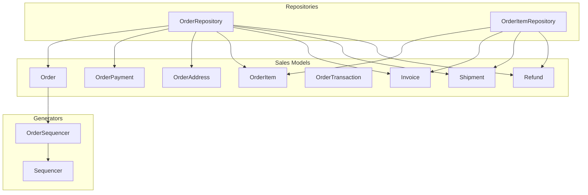

**Diagram sources**
- [Order.php:16-421](file://packages/Webkul/Sales/src/Models/Order.php#L16-L421)
- [OrderItem.php:16-247](file://packages/Webkul/Sales/src/Models/OrderItem.php#L16-L247)
- [OrderRepository.php:16-415](file://packages/Webkul/Sales/src/Repositories/OrderRepository.php#L16-L415)
- [OrderItemRepository.php:10-232](file://packages/Webkul/Sales/src/Repositories/OrderItemRepository.php#L10-L232)
- [OrderSequencer.php:7-50](file://packages/Webkul/Sales/src/Generators/OrderSequencer.php#L7-L50)
- [Sequencer.php:7-117](file://packages/Webkul/Sales/src/Generators/Sequencer.php#L7-L117)
- [OrderAddress.php:21-87](file://packages/Webkul/Sales/src/Models/OrderAddress.php#L21-L87)
- [OrderPayment.php:11-35](file://packages/Webkul/Sales/src/Models/OrderPayment.php#L11-L35)
- [OrderTransaction.php:11-53](file://packages/Webkul/Sales/src/Models/OrderTransaction.php#L11-L53)
- [Invoice.php:16-148](file://packages/Webkul/Sales/src/Models/Invoice.php#L16-L148)
- [Shipment.php:15-74](file://packages/Webkul/Sales/src/Models/Shipment.php#L15-L74)
- [Refund.php:14-93](file://packages/Webkul/Sales/src/Models/Refund.php#L14-L93)

**Section sources**
- [Order.php:16-421](file://packages/Webkul/Sales/src/Models/Order.php#L16-L421)
- [OrderRepository.php:16-415](file://packages/Webkul/Sales/src/Repositories/OrderRepository.php#L16-L415)
- [OrderItemRepository.php:10-232](file://packages/Webkul/Sales/src/Repositories/OrderItemRepository.php#L10-L232)
- [OrderSequencer.php:7-50](file://packages/Webkul/Sales/src/Generators/OrderSequencer.php#L7-L50)
- [Sequencer.php:7-117](file://packages/Webkul/Sales/src/Generators/Sequencer.php#L7-L117)
- [OrderAddress.php:21-87](file://packages/Webkul/Sales/src/Models/OrderAddress.php#L21-L87)
- [OrderPayment.php:11-35](file://packages/Webkul/Sales/src/Models/OrderPayment.php#L11-L35)
- [OrderTransaction.php:11-53](file://packages/Webkul/Sales/src/Models/OrderTransaction.php#L11-L53)
- [Invoice.php:16-148](file://packages/Webkul/Sales/src/Models/Invoice.php#L16-L148)
- [Shipment.php:15-74](file://packages/Webkul/Sales/src/Models/Shipment.php#L15-L74)
- [Refund.php:14-93](file://packages/Webkul/Sales/src/Models/Refund.php#L14-L93)

## Core Components
- Order: central entity with statuses, relations to items, addresses, payments, invoices, shipments, refunds, and transactions. Provides capability checks for shipping, invoicing, cancellation, and refunding.
- OrderItem: per-product line item with stockability checks, remaining quantities for shipping/invoice/cancel/refund, and relations to invoice/shipment/refund items.
- OrderRepository: orchestrates order creation with retries, inventory reservation, customizable options handling, and order status updates based on item-level completion.
- OrderItemRepository: manages inventory reservations, returns quantities to stock on cancellation, and collects per-item totals for invoiced/refunded amounts.
- Invoice/Shipment/Refund: financial and logistics artifacts with state constants and relations back to orders and items.
- OrderSequencer/Sequencer: generates increment IDs for orders using configured prefix/length/suffix and a generator class.
- Supporting entities: OrderAddress (billing/shipping), OrderPayment, OrderTransaction, OrderComment.

**Section sources**
- [Order.php:34-115](file://packages/Webkul/Sales/src/Models/Order.php#L34-L115)
- [OrderItem.php:67-142](file://packages/Webkul/Sales/src/Models/OrderItem.php#L67-L142)
- [OrderRepository.php:45-118](file://packages/Webkul/Sales/src/Repositories/OrderRepository.php#L45-L118)
- [OrderItemRepository.php:81-192](file://packages/Webkul/Sales/src/Repositories/OrderItemRepository.php#L81-L192)
- [Invoice.php:21-80](file://packages/Webkul/Sales/src/Models/Invoice.php#L21-L80)
- [Shipment.php:19-47](file://packages/Webkul/Sales/src/Models/Shipment.php#L19-L47)
- [Refund.php:18-42](file://packages/Webkul/Sales/src/Models/Refund.php#L18-L42)
- [OrderSequencer.php:25-48](file://packages/Webkul/Sales/src/Generators/OrderSequencer.php#L25-L48)
- [Sequencer.php:88-115](file://packages/Webkul/Sales/src/Generators/Sequencer.php#L88-L115)
- [OrderAddress.php:28-66](file://packages/Webkul/Sales/src/Models/OrderAddress.php#L28-L66)
- [OrderPayment.php:15-25](file://packages/Webkul/Sales/src/Models/OrderPayment.php#L15-L25)
- [OrderTransaction.php:35-43](file://packages/Webkul/Sales/src/Models/OrderTransaction.php#L35-L43)
- [OrderComment.php:10-22](file://packages/Webkul/Sales/src/Models/OrderComment.php#L10-L22)

## Architecture Overview
The lifecycle is event-driven and transactional. Creation starts with a cart-derived payload, validated and persisted atomically. Inventory is reserved per item, and order-level totals and status are recalculated as invoices, shipments, and refunds are generated.

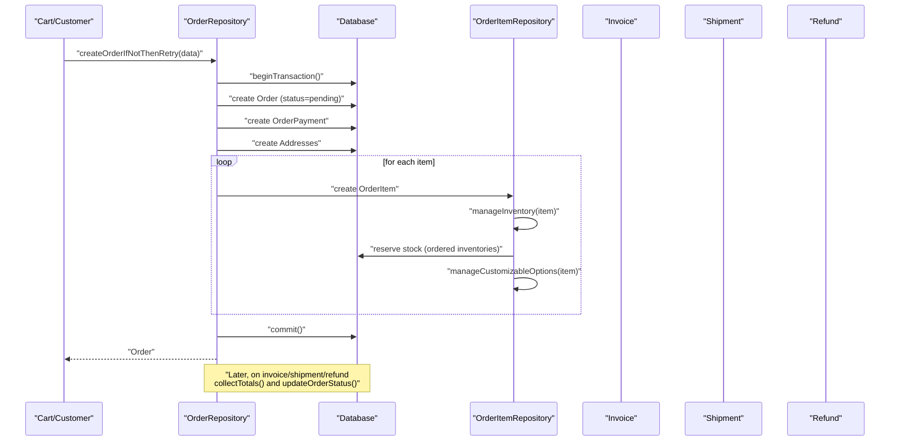

**Diagram sources**
- [OrderRepository.php:45-118](file://packages/Webkul/Sales/src/Repositories/OrderRepository.php#L45-L118)
- [OrderItemRepository.php:81-128](file://packages/Webkul/Sales/src/Repositories/OrderItemRepository.php#L81-L128)
- [Order.php:152-172](file://packages/Webkul/Sales/src/Models/Order.php#L152-L172)
- [Invoice.php:101-113](file://packages/Webkul/Sales/src/Models/Invoice.php#L101-L113)
- [Shipment.php:28-39](file://packages/Webkul/Sales/src/Models/Shipment.php#L28-L39)
- [Refund.php:47-59](file://packages/Webkul/Sales/src/Models/Refund.php#L47-L59)

## Detailed Component Analysis

### Order State Machine and Transitions
- States: pending, pending_payment, processing, completed, canceled, closed, fraud.
- Capability checks gate actions:
  - canShip(): true if any stockable item has qty_to_ship > 0 and order is not closed/fraud.
  - canInvoice(): true if any item has qty_to_invoice > 0 and order is not closed/fraud.
  - canCancel(): true if any item can cancel and order is not closed/fraud.
  - canRefund(): true if any item has qty_to_refund > 0 or unrefunded invoiced balance remains and order is not closed/fraud.
- Status updates:
  - updateOrderStatus() derives final state from item-level aggregates:
    - completed: invoiced equals ordered and shipped equals invoiced (or shipped equals shipped+refunded depending on stockability).
    - canceled: all items canceled.
    - closed: invoiced plus refunded equals ordered.
    - otherwise defaults to processing.

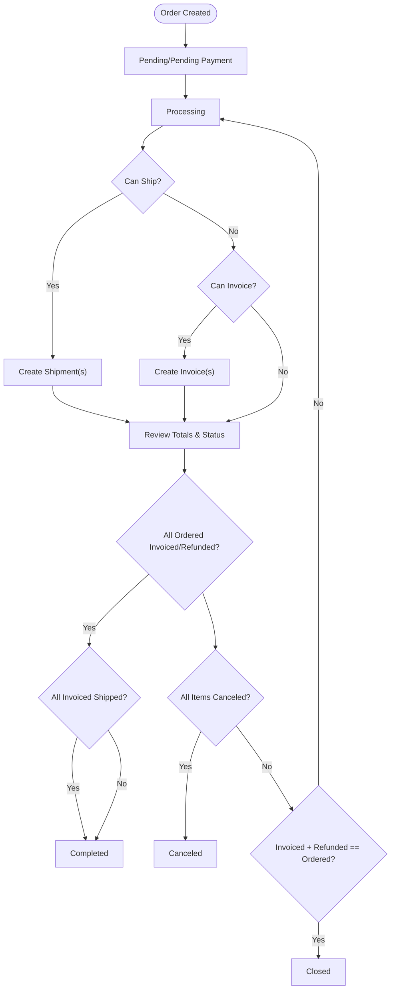

**Diagram sources**
- [Order.php:34-67](file://packages/Webkul/Sales/src/Models/Order.php#L34-L67)
- [Order.php:314-393](file://packages/Webkul/Sales/src/Models/Order.php#L314-L393)
- [OrderRepository.php:312-337](file://packages/Webkul/Sales/src/Repositories/OrderRepository.php#L312-L337)
- [OrderRepository.php:209-266](file://packages/Webkul/Sales/src/Repositories/OrderRepository.php#L209-L266)

**Section sources**
- [Order.php:34-67](file://packages/Webkul/Sales/src/Models/Order.php#L34-L67)
- [Order.php:314-393](file://packages/Webkul/Sales/src/Models/Order.php#L314-L393)
- [OrderRepository.php:312-337](file://packages/Webkul/Sales/src/Repositories/OrderRepository.php#L312-L337)
- [OrderRepository.php:209-266](file://packages/Webkul/Sales/src/Repositories/OrderRepository.php#L209-L266)

### Order Creation, Validation, and Sequencing
- Creation flow:
  - Sets initial status to pending.
  - Generates unique increment_id via OrderSequencer.
  - Persists payment, billing/shipping addresses, and items.
  - For each item, reserves inventory and handles customizable options.
  - Retries on transient failures (with max attempts configurable).
- Duplicate detection:
  - Orders are uniquely identified by increment_id; sequencing ensures uniqueness.
- Order sequencing:
  - Configurable prefix/length/suffix and optional custom generator class.
  - Last ID derived from the highest existing order ID.

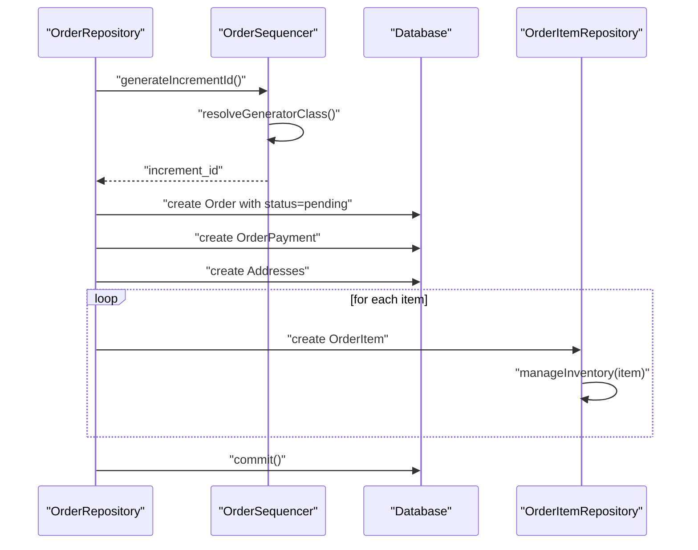

**Diagram sources**
- [OrderRepository.php:45-118](file://packages/Webkul/Sales/src/Repositories/OrderRepository.php#L45-L118)
- [OrderSequencer.php:198-201](file://packages/Webkul/Sales/src/Generators/OrderSequencer.php#L198-L201)
- [OrderSequencer.php:25-48](file://packages/Webkul/Sales/src/Generators/OrderSequencer.php#L25-L48)
- [Sequencer.php:88-115](file://packages/Webkul/Sales/src/Generators/Sequencer.php#L88-L115)

**Section sources**
- [OrderRepository.php:45-118](file://packages/Webkul/Sales/src/Repositories/OrderRepository.php#L45-L118)
- [OrderSequencer.php:25-48](file://packages/Webkul/Sales/src/Generators/OrderSequencer.php#L25-L48)
- [Sequencer.php:88-115](file://packages/Webkul/Sales/src/Generators/Sequencer.php#L88-L115)

### Order Item Processing, Inventory Reservation, and Stock Allocation
- Inventory reservation:
  - For stockable items (including composite children), ordered inventories are incremented per channel.
- Stock release on cancellation:
  - Quantities are returned to product inventories and ordered inventories adjusted accordingly.
- Remaining quantities:
  - qty_to_ship, qty_to_invoice, qty_to_cancel, qty_to_refund computed from ordered, shipped, invoiced, refunded, and canceled quantities.

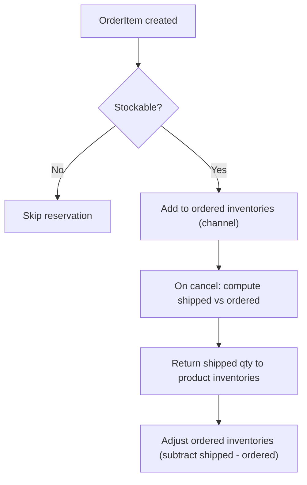

**Diagram sources**
- [OrderItemRepository.php:81-128](file://packages/Webkul/Sales/src/Repositories/OrderItemRepository.php#L81-L128)
- [OrderItemRepository.php:133-192](file://packages/Webkul/Sales/src/Repositories/OrderItemRepository.php#L133-L192)
- [OrderItem.php:67-142](file://packages/Webkul/Sales/src/Models/OrderItem.php#L67-L142)

**Section sources**
- [OrderItemRepository.php:81-128](file://packages/Webkul/Sales/src/Repositories/OrderItemRepository.php#L81-L128)
- [OrderItemRepository.php:133-192](file://packages/Webkul/Sales/src/Repositories/OrderItemRepository.php#L133-L192)
- [OrderItem.php:67-142](file://packages/Webkul/Sales/src/Models/OrderItem.php#L67-L142)

### Invoicing Workflow
- Invoice states: pending, pending_payment, paid, overdue, refunded.
- Capability:
  - canInvoice() checks item-level remaining qty_to_invoice > 0.
- Totals:
  - collectTotals() aggregates invoiced and refunded amounts across invoices and refunds and persists order-level totals.

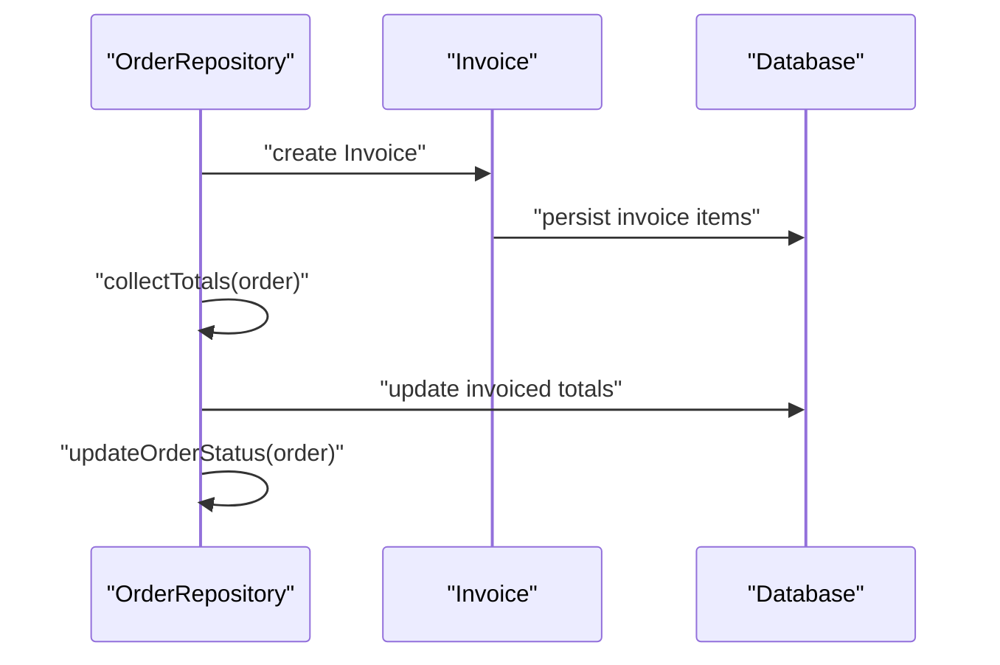

**Diagram sources**
- [OrderRepository.php:345-400](file://packages/Webkul/Sales/src/Repositories/OrderRepository.php#L345-L400)
- [Invoice.php:21-80](file://packages/Webkul/Sales/src/Models/Invoice.php#L21-L80)

**Section sources**
- [Invoice.php:21-80](file://packages/Webkul/Sales/src/Models/Invoice.php#L21-L80)
- [OrderRepository.php:345-400](file://packages/Webkul/Sales/src/Repositories/OrderRepository.php#L345-L400)

### Shipment Workflow
- Capability:
  - canShip() checks item-level remaining qty_to_ship > 0.
- Relations:
  - Shipment belongs to Order and contains ShipmentItems linked to OrderItems.

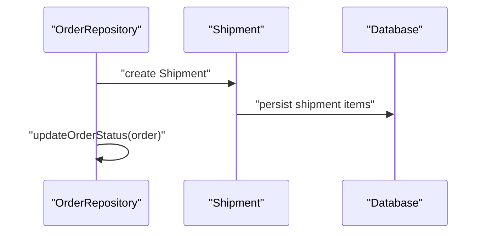

**Diagram sources**
- [Order.php:314-329](file://packages/Webkul/Sales/src/Models/Order.php#L314-L329)
- [Shipment.php:28-39](file://packages/Webkul/Sales/src/Models/Shipment.php#L28-L39)

**Section sources**
- [Order.php:314-329](file://packages/Webkul/Sales/src/Models/Order.php#L314-L329)
- [Shipment.php:28-39](file://packages/Webkul/Sales/src/Models/Shipment.php#L28-L39)

### Refund Workflow
- Capability:
  - canRefund() checks item-level qty_to_refund > 0 or remaining invoiced balance.
- Totals:
  - collectTotals() accumulates refund amounts and adjustment fees.

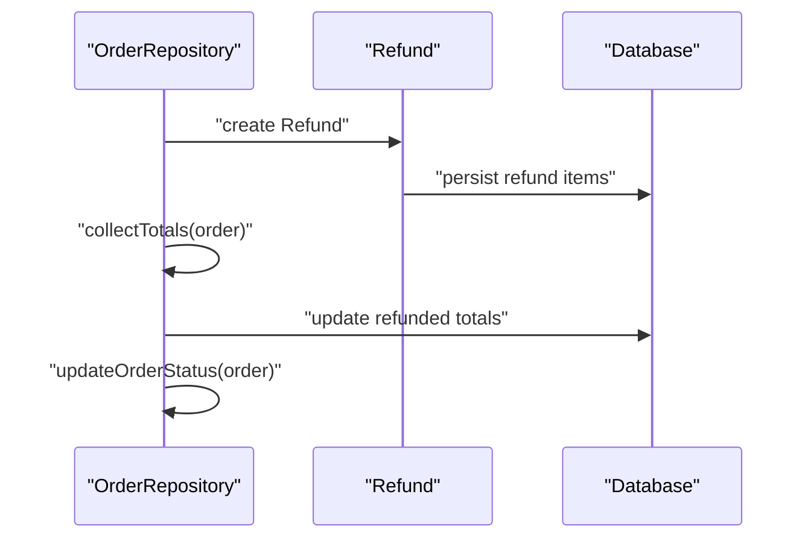

**Diagram sources**
- [OrderRepository.php:345-400](file://packages/Webkul/Sales/src/Repositories/OrderRepository.php#L345-L400)
- [Refund.php:47-59](file://packages/Webkul/Sales/src/Models/Refund.php#L47-L59)

**Section sources**
- [OrderRepository.php:345-400](file://packages/Webkul/Sales/src/Repositories/OrderRepository.php#L345-L400)
- [Refund.php:47-59](file://packages/Webkul/Sales/src/Models/Refund.php#L47-L59)

### Order Modification Rules and Cancellation Procedures
- Modification rules:
  - Actions are gated by item-level remaining quantities and order state.
- Cancellation:
  - Validates canCancel(), returns shipped quantities to stock, increments canceled quantities, expires downloadable links, and updates order status.

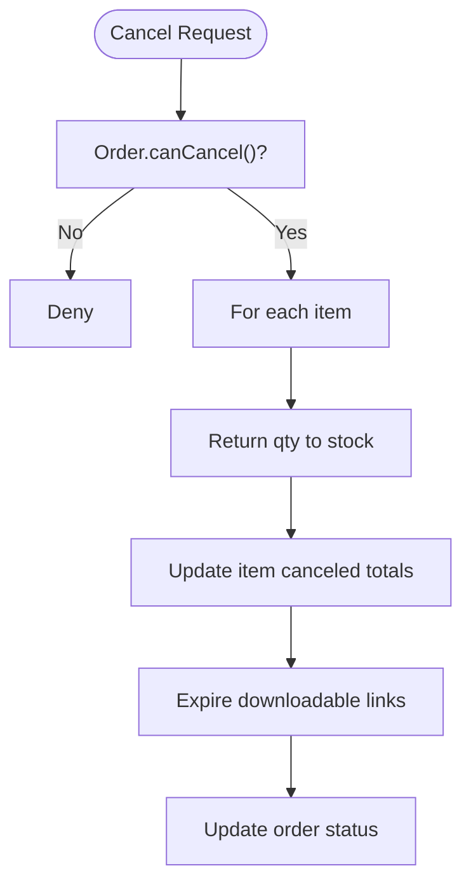

**Diagram sources**
- [OrderRepository.php:136-191](file://packages/Webkul/Sales/src/Repositories/OrderRepository.php#L136-L191)
- [OrderItemRepository.php:133-192](file://packages/Webkul/Sales/src/Repositories/OrderItemRepository.php#L133-L192)
- [Order.php:354-369](file://packages/Webkul/Sales/src/Models/Order.php#L354-L369)

**Section sources**
- [OrderRepository.php:136-191](file://packages/Webkul/Sales/src/Repositories/OrderRepository.php#L136-L191)
- [OrderItemRepository.php:133-192](file://packages/Webkul/Sales/src/Repositories/OrderItemRepository.php#L133-L192)
- [Order.php:354-369](file://packages/Webkul/Sales/src/Models/Order.php#L354-L369)

### Order Search, Filtering, and Reporting
- Search and filtering:
  - Orders are stored with indexed increment_id and timestamps, enabling efficient lookup and range queries.
- Reporting:
  - collectTotals() computes invoiced and refunded aggregates per order for reporting dashboards and exports.

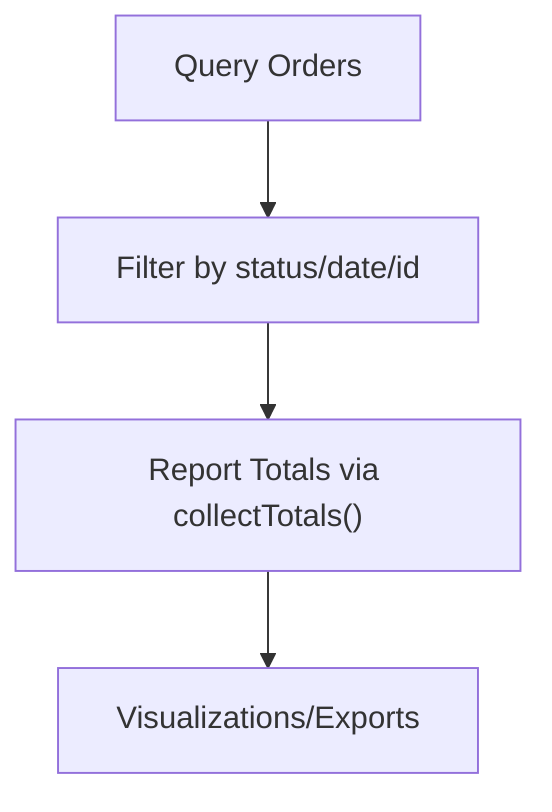

**Diagram sources**
- [2018_09_27_113154_create_orders_table.php:16-78](file://packages/Webkul/Sales/src/Database/Migrations/2018_09_27_113154_create_orders_table.php#L16-L78)
- [OrderRepository.php:345-400](file://packages/Webkul/Sales/src/Repositories/OrderRepository.php#L345-L400)

**Section sources**
- [2018_09_27_113154_create_orders_table.php:16-78](file://packages/Webkul/Sales/src/Database/Migrations/2018_09_27_113154_create_orders_table.php#L16-L78)
- [OrderRepository.php:345-400](file://packages/Webkul/Sales/src/Repositories/OrderRepository.php#L345-L400)

### Data Integrity, Audit Trails, and Historical Tracking
- Transactions:
  - Order creation runs inside a transaction; on exceptions, rollback occurs and retry is attempted up to configured max attempts.
- Events:
  - Hooks before/after saving order, order items, and cancellation enable external listeners for audit and notifications.
- Historical tracking:
  - OrderAddress, OrderPayment, OrderTransaction, and OrderComment preserve history alongside the order.

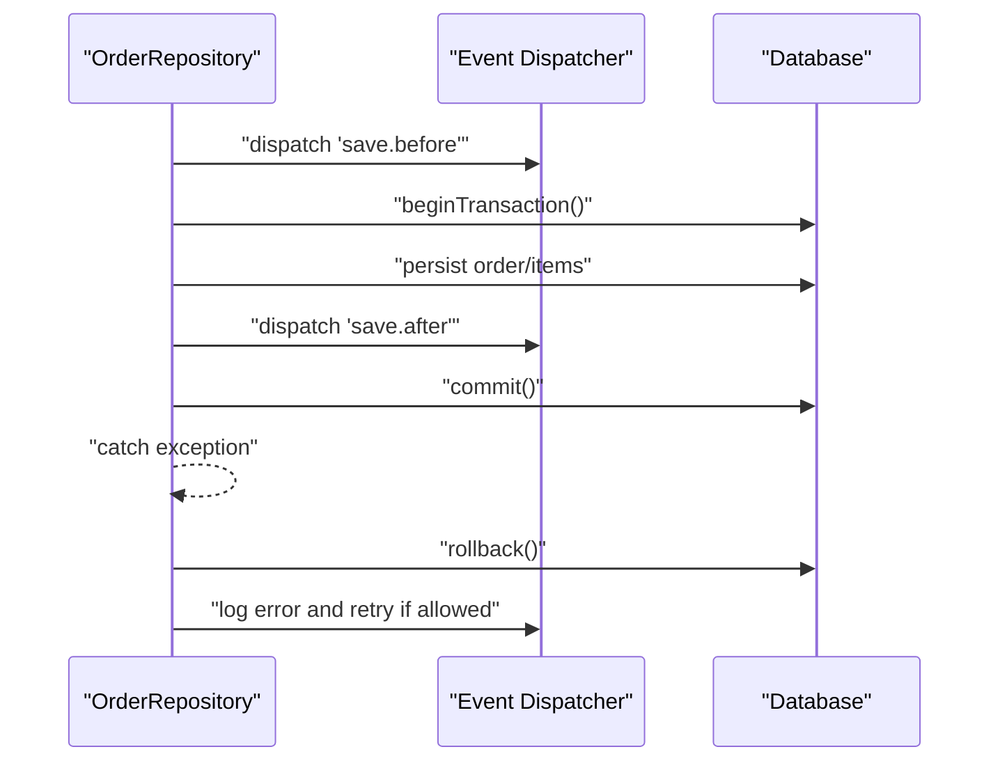

**Diagram sources**
- [OrderRepository.php:45-118](file://packages/Webkul/Sales/src/Repositories/OrderRepository.php#L45-L118)
- [Order.php:144-147](file://packages/Webkul/Sales/src/Models/Order.php#L144-L147)
- [OrderItem.php:147-150](file://packages/Webkul/Sales/src/Models/OrderItem.php#L147-L150)
- [OrderAddress.php:74-77](file://packages/Webkul/Sales/src/Models/OrderAddress.php#L74-L77)
- [OrderPayment.php:15-21](file://packages/Webkul/Sales/src/Models/OrderPayment.php#L15-L21)
- [OrderTransaction.php:11-53](file://packages/Webkul/Sales/src/Models/OrderTransaction.php#L11-L53)
- [OrderComment.php:10-22](file://packages/Webkul/Sales/src/Models/OrderComment.php#L10-L22)

**Section sources**
- [OrderRepository.php:45-118](file://packages/Webkul/Sales/src/Repositories/OrderRepository.php#L45-L118)
- [Order.php:144-147](file://packages/Webkul/Sales/src/Models/Order.php#L144-L147)
- [OrderItem.php:147-150](file://packages/Webkul/Sales/src/Models/OrderItem.php#L147-L150)
- [OrderAddress.php:74-77](file://packages/Webkul/Sales/src/Models/OrderAddress.php#L74-L77)
- [OrderPayment.php:15-21](file://packages/Webkul/Sales/src/Models/OrderPayment.php#L15-L21)
- [OrderTransaction.php:11-53](file://packages/Webkul/Sales/src/Models/OrderTransaction.php#L11-L53)
- [OrderComment.php:10-22](file://packages/Webkul/Sales/src/Models/OrderComment.php#L10-L22)

## Dependency Analysis
- Cohesion:
  - OrderRepository encapsulates end-to-end order orchestration and state transitions.
  - OrderItemRepository encapsulates inventory and per-item totals.
- Coupling:
  - Order depends on OrderItem, Invoice, Shipment, Refund, Payment, Address, Transaction, Comment.
  - OrderSequencer depends on core configuration and Order model for last ID.
- External integrations:
  - Payment method titles resolved via configuration.
  - Retry behavior respects business-logic exceptions (e.g., coupon usage limits).

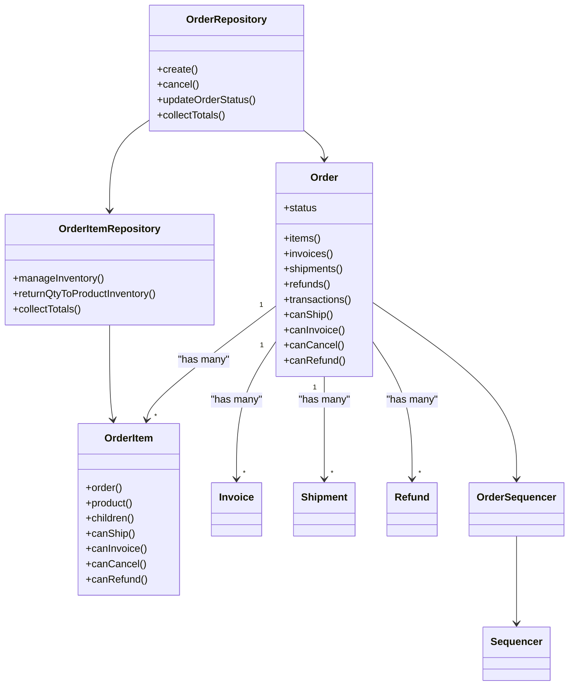

**Diagram sources**
- [Order.php:152-212](file://packages/Webkul/Sales/src/Models/Order.php#L152-L212)
- [OrderItem.php:147-206](file://packages/Webkul/Sales/src/Models/OrderItem.php#L147-L206)
- [OrderRepository.php:16-415](file://packages/Webkul/Sales/src/Repositories/OrderRepository.php#L16-L415)
- [OrderItemRepository.php:10-232](file://packages/Webkul/Sales/src/Repositories/OrderItemRepository.php#L10-L232)
- [Invoice.php:101-113](file://packages/Webkul/Sales/src/Models/Invoice.php#L101-L113)
- [Shipment.php:28-39](file://packages/Webkul/Sales/src/Models/Shipment.php#L28-L39)
- [Refund.php:47-59](file://packages/Webkul/Sales/src/Models/Refund.php#L47-L59)
- [OrderSequencer.php:7-50](file://packages/Webkul/Sales/src/Generators/OrderSequencer.php#L7-L50)
- [Sequencer.php:7-117](file://packages/Webkul/Sales/src/Generators/Sequencer.php#L7-L117)

**Section sources**
- [Order.php:152-212](file://packages/Webkul/Sales/src/Models/Order.php#L152-L212)
- [OrderItem.php:147-206](file://packages/Webkul/Sales/src/Models/OrderItem.php#L147-L206)
- [OrderRepository.php:16-415](file://packages/Webkul/Sales/src/Repositories/OrderRepository.php#L16-L415)
- [OrderItemRepository.php:10-232](file://packages/Webkul/Sales/src/Repositories/OrderItemRepository.php#L10-L232)
- [OrderSequencer.php:7-50](file://packages/Webkul/Sales/src/Generators/OrderSequencer.php#L7-L50)
- [Sequencer.php:7-117](file://packages/Webkul/Sales/src/Generators/Sequencer.php#L7-L117)

## Performance Considerations
- Batch operations:
  - Minimize repeated queries by eager-loading related collections when rendering order details.
- Inventory updates:
  - Composite items require iterating children; batch updates reduce overhead.
- Totals aggregation:
  - Use collectTotals() to avoid recomputation and maintain consistency.
- Concurrency:
  - Retries during order creation mitigate transient DB conflicts; avoid long-running transactions.

## Troubleshooting Guide
- Order creation fails:
  - Check retry attempts and logs; coupon usage limit exceptions are not retried.
- Inventory mismatch:
  - Verify ordered inventories and product inventories after cancel; ensure channel alignment.
- Status not updating:
  - Confirm collectTotals() has been called and updateOrderStatus() executed after invoices/shipments/refunds.
- Duplicate order number:
  - Ensure OrderSequencer is invoked and prefix/length/suffix are configured.

**Section sources**
- [OrderRepository.php:87-112](file://packages/Webkul/Sales/src/Repositories/OrderRepository.php#L87-L112)
- [OrderItemRepository.php:171-192](file://packages/Webkul/Sales/src/Repositories/OrderItemRepository.php#L171-L192)
- [OrderRepository.php:345-400](file://packages/Webkul/Sales/src/Repositories/OrderRepository.php#L345-L400)
- [OrderSequencer.php:25-48](file://packages/Webkul/Sales/src/Generators/OrderSequencer.php#L25-L48)

## Conclusion
The Sales module implements a robust order lifecycle with explicit state transitions, inventory reservation and release, and comprehensive totals tracking. The repository layer coordinates creation, modifications, and status updates while maintaining data integrity through transactions and events. Reporting and auditing are supported via collected totals and historical records.

## Appendices
- Database schema highlights:
  - orders table includes currency, discount, tax, shipping, and grand totals with invoiced/refunded variants.
  - Unique increment_id supports reliable search and reporting.

**Section sources**
- [2018_09_27_113154_create_orders_table.php:16-78](file://packages/Webkul/Sales/src/Database/Migrations/2018_09_27_113154_create_orders_table.php#L16-L78)